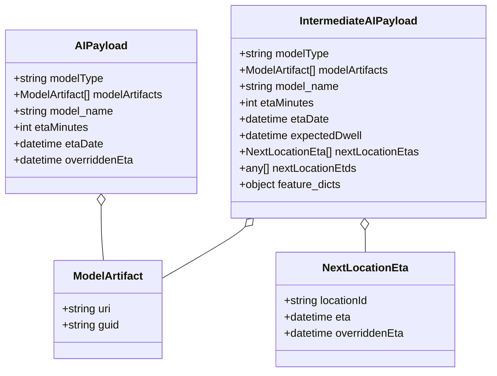
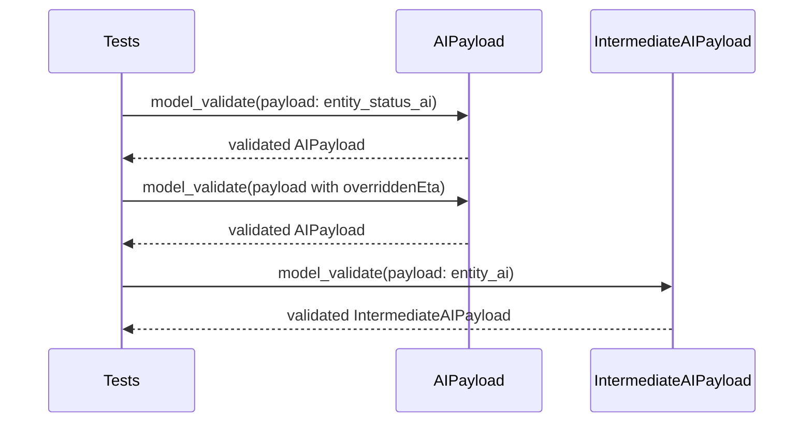

# Diagram: eta/eta_platform_common/eta_platform_common/models/get_ai_eta/tests/test_responses.py

> Auto-generated by Obscura crawlers

## Diagram 1

### SVG

<svg id="container" width="723.8046875" xmlns="http://www.w3.org/2000/svg" class="classDiagram" height="546" viewBox="0 0 723.8046875 546" role="graphics-document document" aria-roledescription="class"><g><defs><marker id="container_class-aggregationStart" class="marker aggregation class" refX="18" refY="7" markerWidth="190" markerHeight="240" orient="auto"><path d="M 18,7 L9,13 L1,7 L9,1 Z"></path></marker></defs><defs><marker id="container_class-aggregationEnd" class="marker aggregation class" refX="1" refY="7" markerWidth="20" markerHeight="28" orient="auto"><path d="M 18,7 L9,13 L1,7 L9,1 Z"></path></marker></defs><defs><marker id="container_class-extensionStart" class="marker extension class" refX="18" refY="7" markerWidth="190" markerHeight="240" orient="auto"><path d="M 1,7 L18,13 V 1 Z"></path></marker></defs><defs><marker id="container_class-extensionEnd" class="marker extension class" refX="1" refY="7" markerWidth="20" markerHeight="28" orient="auto"><path d="M 1,1 V 13 L18,7 Z"></path></marker></defs><defs><marker id="container_class-compositionStart" class="marker composition class" refX="18" refY="7" markerWidth="190" markerHeight="240" orient="auto"><path d="M 18,7 L9,13 L1,7 L9,1 Z"></path></marker></defs><defs><marker id="container_class-compositionEnd" class="marker composition class" refX="1" refY="7" markerWidth="20" markerHeight="28" orient="auto"><path d="M 18,7 L9,13 L1,7 L9,1 Z"></path></marker></defs><defs><marker id="container_class-dependencyStart" class="marker dependency class" refX="6" refY="7" markerWidth="190" markerHeight="240" orient="auto"><path d="M 5,7 L9,13 L1,7 L9,1 Z"></path></marker></defs><defs><marker id="container_class-dependencyEnd" class="marker dependency class" refX="13" refY="7" markerWidth="20" markerHeight="28" orient="auto"><path d="M 18,7 L9,13 L14,7 L9,1 Z"></path></marker></defs><defs><marker id="container_class-lollipopStart" class="marker lollipop class" refX="13" refY="7" markerWidth="190" markerHeight="240" orient="auto"><circle stroke="black" fill="transparent" cx="7" cy="7" r="6"></circle></marker></defs><defs><marker id="container_class-lollipopEnd" class="marker lollipop class" refX="1" refY="7" markerWidth="190" markerHeight="240" orient="auto"><circle stroke="black" fill="transparent" cx="7" cy="7" r="6"></circle></marker></defs><g class="root"><g class="clusters"></g><g class="edgePaths"><path d="M151.156,301.25L151.156,308.542C151.156,315.833,151.156,330.417,151.722,343.875C152.288,357.333,153.419,369.667,153.985,375.833L154.551,382" id="id_AIPayload_ModelArtifact_1" class="edge-thickness-normal edge-pattern-solid relation" style=";;;" data-edge="true" data-et="edge" data-id="id_AIPayload_ModelArtifact_1" data-points="W3sieCI6MTUxLjE1NjI1LCJ5IjoyODR9LHsieCI6MTUxLjE1NjI1LCJ5IjozNDV9LHsieCI6MTU0LjU1MDc0NTQxMjg0NDA0LCJ5IjozODJ9XQ==" marker-start="url(#container_class-aggregationStart)"></path><path d="M363.248,332.25L361.142,334.375C359.035,336.5,354.821,340.75,334.407,353.408C313.992,366.066,277.377,387.133,259.069,397.666L240.762,408.199" id="id_IntermediateAIPayload_ModelArtifact_2" class="edge-thickness-normal edge-pattern-solid relation" style=";;;" data-edge="true" data-et="edge" data-id="id_IntermediateAIPayload_ModelArtifact_2" data-points="W3sieCI6Mzc1LjM5MzQ5NTMzODM5Nzc3LCJ5IjozMjB9LHsieCI6MzUwLjYwNzQyMTg3NSwieSI6MzQ1fSx7IngiOjI0MC43NjE3MTg3NSwieSI6NDA4LjE5OTMwMTAyMzcyMTl9XQ==" marker-start="url(#container_class-aggregationStart)"></path><path d="M539.629,337.224L539.701,338.52C539.772,339.816,539.915,342.408,539.987,347.871C540.059,353.333,540.059,361.667,540.059,365.833L540.059,370" id="id_IntermediateAIPayload_NextLocationEta_3" class="edge-thickness-normal edge-pattern-solid relation" style=";;;" data-edge="true" data-et="edge" data-id="id_IntermediateAIPayload_NextLocationEta_3" data-points="W3sieCI6NTM4LjY3NzM3ODI4MDM4NjcsInkiOjMyMH0seyJ4Ijo1NDAuMDU4NTkzNzUsInkiOjM0NX0seyJ4Ijo1NDAuMDU4NTkzNzUsInkiOjM3MH1d" marker-start="url(#container_class-aggregationStart)"></path></g><g class="edgeLabels"><g class="edgeLabel"><g class="label" data-id="id_AIPayload_ModelArtifact_1" transform="translate(0, 0)"><foreignObject width="0" height="0">

</foreignObject></g></g><g class="edgeLabel"><g class="label" data-id="id_IntermediateAIPayload_ModelArtifact_2" transform="translate(0, 0)"><foreignObject width="0" height="0">

</foreignObject></g></g><g class="edgeLabel"><g class="label" data-id="id_IntermediateAIPayload_NextLocationEta_3" transform="translate(0, 0)"><foreignObject width="0" height="0">

</foreignObject></g></g></g><g class="nodes"><g class="node default" id="classId-ModelArtifact-0" transform="translate(161.15625, 454)"><g class="basic label-container"><path d="M-79.60546875 -72 L79.60546875 -72 L79.60546875 72 L-79.60546875 72" stroke="none" stroke-width="0" fill="#ECECFF" style=""></path><path d="M-79.60546875 -72 C-45.80502771367358 -72, -12.004586677347163 -72, 79.60546875 -72 M-79.60546875 -72 C-29.74297513709037 -72, 20.119518475819262 -72, 79.60546875 -72 M79.60546875 -72 C79.60546875 -39.048744188877066, 79.60546875 -6.097488377754132, 79.60546875 72 M79.60546875 -72 C79.60546875 -24.36877390962298, 79.60546875 23.26245218075404, 79.60546875 72 M79.60546875 72 C40.17863991722137 72, 0.7518110844427355 72, -79.60546875 72 M79.60546875 72 C18.98294045442151 72, -41.63958784115698 72, -79.60546875 72 M-79.60546875 72 C-79.60546875 18.5942920915911, -79.60546875 -34.8114158168178, -79.60546875 -72 M-79.60546875 72 C-79.60546875 40.04039792810452, -79.60546875 8.080795856209036, -79.60546875 -72" stroke="#9370DB" stroke-width="1.3" fill="none" stroke-dasharray="0 0" style=""></path></g><g class="annotation-group text" transform="translate(0, -48)"></g><g class="label-group text" transform="translate(-49.7890625, -48)"><g class="label" style="font-weight: bolder" transform="translate(0,-12)"><foreignObject width="99.578125" height="24">

ModelArtifact

</foreignObject></g></g><g class="members-group text" transform="translate(-67.60546875, 0)"><g class="label" style="" transform="translate(0,-12)"><foreignObject width="73.859375" height="24">

+string uri

</foreignObject></g><g class="label" style="" transform="translate(0,12)"><foreignObject width="85.421875" height="24">

+string guid

</foreignObject></g></g><g class="methods-group text" transform="translate(-67.60546875, 72)"></g><g class="divider" style=""><path d="M-79.60546875 -24 C-18.80490040662393 -24, 41.99566793675214 -24, 79.60546875 -24 M-79.60546875 -24 C-17.312014288318124 -24, 44.98144017336375 -24, 79.60546875 -24" stroke="#9370DB" stroke-width="1.3" fill="none" stroke-dasharray="0 0" style=""></path></g><g class="divider" style=""><path d="M-79.60546875 48 C-31.59255066880037 48, 16.42036741239926 48, 79.60546875 48 M-79.60546875 48 C-47.27190096477229 48, -14.938333179544586 48, 79.60546875 48" stroke="#9370DB" stroke-width="1.3" fill="none" stroke-dasharray="0 0" style=""></path></g></g><g class="node default" id="classId-NextLocationEta-1" transform="translate(540.05859375, 454)"><g class="basic label-container"><path d="M-131.83984375 -84 L131.83984375 -84 L131.83984375 84 L-131.83984375 84" stroke="none" stroke-width="0" fill="#ECECFF" style=""></path><path d="M-131.83984375 -84 C-43.18287812294557 -84, 45.474087504108866 -84, 131.83984375 -84 M-131.83984375 -84 C-62.52292006132615 -84, 6.794003627347706 -84, 131.83984375 -84 M131.83984375 -84 C131.83984375 -18.51217691552381, 131.83984375 46.97564616895238, 131.83984375 84 M131.83984375 -84 C131.83984375 -49.23078725048927, 131.83984375 -14.461574500978543, 131.83984375 84 M131.83984375 84 C46.585277570671764 84, -38.66928860865647 84, -131.83984375 84 M131.83984375 84 C68.12921790085015 84, 4.418592051700301 84, -131.83984375 84 M-131.83984375 84 C-131.83984375 34.970223074863, -131.83984375 -14.059553850274, -131.83984375 -84 M-131.83984375 84 C-131.83984375 25.612704490732803, -131.83984375 -32.774591018534394, -131.83984375 -84" stroke="#9370DB" stroke-width="1.3" fill="none" stroke-dasharray="0 0" style=""></path></g><g class="annotation-group text" transform="translate(0, -60)"></g><g class="label-group text" transform="translate(-59.5859375, -60)"><g class="label" style="font-weight: bolder" transform="translate(0,-12)"><foreignObject width="119.171875" height="24">

NextLocationEta

</foreignObject></g></g><g class="members-group text" transform="translate(-119.83984375, -12)"><g class="label" style="" transform="translate(0,-12)"><foreignObject width="127.296875" height="24">

+string locationId

</foreignObject></g><g class="label" style="" transform="translate(0,12)"><foreignObject width="100.5625" height="24">

+datetime eta

</foreignObject></g><g class="label" style="" transform="translate(0,36)"><foreignObject width="180.09375" height="24">

+datetime overriddenEta

</foreignObject></g></g><g class="methods-group text" transform="translate(-119.83984375, 84)"></g><g class="divider" style=""><path d="M-131.83984375 -36 C-54.751210034812146 -36, 22.337423680375707 -36, 131.83984375 -36 M-131.83984375 -36 C-26.628548676621904 -36, 78.58274639675619 -36, 131.83984375 -36" stroke="#9370DB" stroke-width="1.3" fill="none" stroke-dasharray="0 0" style=""></path></g><g class="divider" style=""><path d="M-131.83984375 60 C-34.819988773824136 60, 62.19986620235173 60, 131.83984375 60 M-131.83984375 60 C-52.757057876394555 60, 26.32572799721089 60, 131.83984375 60" stroke="#9370DB" stroke-width="1.3" fill="none" stroke-dasharray="0 0" style=""></path></g></g><g class="node default" id="classId-AIPayload-2" transform="translate(151.15625, 164)"><g class="basic label-container"><path d="M-143.15625 -120 L143.15625 -120 L143.15625 120 L-143.15625 120" stroke="none" stroke-width="0" fill="#ECECFF" style=""></path><path d="M-143.15625 -120 C-51.64717204620197 -120, 39.861905907596054 -120, 143.15625 -120 M-143.15625 -120 C-65.48740258674853 -120, 12.18144482650294 -120, 143.15625 -120 M143.15625 -120 C143.15625 -53.75279828581358, 143.15625 12.494403428372834, 143.15625 120 M143.15625 -120 C143.15625 -42.32944665756065, 143.15625 35.341106684878696, 143.15625 120 M143.15625 120 C51.72877969608045 120, -39.6986906078391 120, -143.15625 120 M143.15625 120 C28.67061214824578 120, -85.81502570350844 120, -143.15625 120 M-143.15625 120 C-143.15625 69.7081546123986, -143.15625 19.416309224797217, -143.15625 -120 M-143.15625 120 C-143.15625 29.496558995272025, -143.15625 -61.00688200945595, -143.15625 -120" stroke="#9370DB" stroke-width="1.3" fill="none" stroke-dasharray="0 0" style=""></path></g><g class="annotation-group text" transform="translate(0, -96)"></g><g class="label-group text" transform="translate(-35.96875, -96)"><g class="label" style="font-weight: bolder" transform="translate(0,-12)"><foreignObject width="71.9375" height="24">

AIPayload

</foreignObject></g></g><g class="members-group text" transform="translate(-131.15625, -48)"><g class="label" style="" transform="translate(0,-12)"><foreignObject width="133.625" height="24">

+string modelType

</foreignObject></g><g class="label" style="" transform="translate(0,12)"><foreignObject width="226.34375" height="24">

+ModelArtifact[] modelArtifacts

</foreignObject></g><g class="label" style="" transform="translate(0,36)"><foreignObject width="148.734375" height="24">

+string model_name

</foreignObject></g><g class="label" style="" transform="translate(0,60)"><foreignObject width="112.359375" height="24">

+int etaMinutes

</foreignObject></g><g class="label" style="" transform="translate(0,84)"><foreignObject width="133.671875" height="24">

+datetime etaDate

</foreignObject></g><g class="label" style="" transform="translate(0,108)"><foreignObject width="180.09375" height="24">

+datetime overriddenEta

</foreignObject></g></g><g class="methods-group text" transform="translate(-131.15625, 120)"></g><g class="divider" style=""><path d="M-143.15625 -72 C-41.73215070412181 -72, 59.691948591756386 -72, 143.15625 -72 M-143.15625 -72 C-55.57167042036454 -72, 32.01290915927092 -72, 143.15625 -72" stroke="#9370DB" stroke-width="1.3" fill="none" stroke-dasharray="0 0" style=""></path></g><g class="divider" style=""><path d="M-143.15625 96 C-73.22796707496765 96, -3.2996841499353025 96, 143.15625 96 M-143.15625 96 C-49.063699045468525 96, 45.02885190906295 96, 143.15625 96" stroke="#9370DB" stroke-width="1.3" fill="none" stroke-dasharray="0 0" style=""></path></g></g><g class="node default" id="classId-IntermediateAIPayload-3" transform="translate(530.05859375, 164)"><g class="basic label-container"><path d="M-185.74609375 -156 L185.74609375 -156 L185.74609375 156 L-185.74609375 156" stroke="none" stroke-width="0" fill="#ECECFF" style=""></path><path d="M-185.74609375 -156 C-90.15278855506065 -156, 5.440516639878695 -156, 185.74609375 -156 M-185.74609375 -156 C-45.20844242683785 -156, 95.3292088963243 -156, 185.74609375 -156 M185.74609375 -156 C185.74609375 -89.31294234880461, 185.74609375 -22.625884697609223, 185.74609375 156 M185.74609375 -156 C185.74609375 -73.20438244814119, 185.74609375 9.591235103717622, 185.74609375 156 M185.74609375 156 C44.00373148262918 156, -97.73863078474164 156, -185.74609375 156 M185.74609375 156 C66.15302139141224 156, -53.44005096717552 156, -185.74609375 156 M-185.74609375 156 C-185.74609375 78.95141624228738, -185.74609375 1.902832484574759, -185.74609375 -156 M-185.74609375 156 C-185.74609375 43.11875355762582, -185.74609375 -69.76249288474835, -185.74609375 -156" stroke="#9370DB" stroke-width="1.3" fill="none" stroke-dasharray="0 0" style=""></path></g><g class="annotation-group text" transform="translate(0, -132)"></g><g class="label-group text" transform="translate(-83.4765625, -132)"><g class="label" style="font-weight: bolder" transform="translate(0,-12)"><foreignObject width="166.953125" height="24">

IntermediateAIPayload

</foreignObject></g></g><g class="members-group text" transform="translate(-173.74609375, -84)"><g class="label" style="" transform="translate(0,-12)"><foreignObject width="133.625" height="24">

+string modelType

</foreignObject></g><g class="label" style="" transform="translate(0,12)"><foreignObject width="226.34375" height="24">

+ModelArtifact[] modelArtifacts

</foreignObject></g><g class="label" style="" transform="translate(0,36)"><foreignObject width="148.734375" height="24">

+string model_name

</foreignObject></g><g class="label" style="" transform="translate(0,60)"><foreignObject width="112.359375" height="24">

+int etaMinutes

</foreignObject></g><g class="label" style="" transform="translate(0,84)"><foreignObject width="133.671875" height="24">

+datetime etaDate

</foreignObject></g><g class="label" style="" transform="translate(0,108)"><foreignObject width="183.390625" height="24">

+datetime expectedDwell

</foreignObject></g><g class="label" style="" transform="translate(0,132)"><foreignObject width="264.015625" height="24">

+NextLocationEta[] nextLocationEtas

</foreignObject></g><g class="label" style="" transform="translate(0,156)"><foreignObject width="172.640625" height="24">

+any[] nextLocationEtds

</foreignObject></g><g class="label" style="" transform="translate(0,180)"><foreignObject width="152.328125" height="24">

+object feature_dicts

</foreignObject></g></g><g class="methods-group text" transform="translate(-173.74609375, 156)"></g><g class="divider" style=""><path d="M-185.74609375 -108 C-40.71170790798769 -108, 104.32267793402463 -108, 185.74609375 -108 M-185.74609375 -108 C-106.0095281086286 -108, -26.2729624672572 -108, 185.74609375 -108" stroke="#9370DB" stroke-width="1.3" fill="none" stroke-dasharray="0 0" style=""></path></g><g class="divider" style=""><path d="M-185.74609375 132 C-38.663762722941925 132, 108.41856830411615 132, 185.74609375 132 M-185.74609375 132 C-42.87861641408435 132, 99.9888609218313 132, 185.74609375 132" stroke="#9370DB" stroke-width="1.3" fill="none" stroke-dasharray="0 0" style=""></path></g></g></g></g></g></svg>

## Diagram 2

> SVG rendering failed for this diagram.
