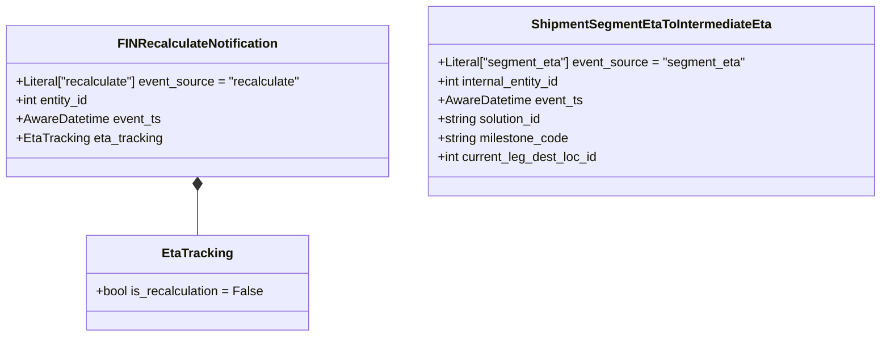

# Diagram: eta/eta_platform_common/eta_platform_common/models/supporting_types.py

> Auto-generated by Obscura crawlers

## Mermaid

### SVG

<svg id="container" width="1115.0234375" xmlns="http://www.w3.org/2000/svg" class="classDiagram" height="426" viewBox="0 0 1115.0234375 426" role="graphics-document document" aria-roledescription="class"><g><defs><marker id="container_class-aggregationStart" class="marker aggregation class" refX="18" refY="7" markerWidth="190" markerHeight="240" orient="auto"><path d="M 18,7 L9,13 L1,7 L9,1 Z"></path></marker></defs><defs><marker id="container_class-aggregationEnd" class="marker aggregation class" refX="1" refY="7" markerWidth="20" markerHeight="28" orient="auto"><path d="M 18,7 L9,13 L1,7 L9,1 Z"></path></marker></defs><defs><marker id="container_class-extensionStart" class="marker extension class" refX="18" refY="7" markerWidth="190" markerHeight="240" orient="auto"><path d="M 1,7 L18,13 V 1 Z"></path></marker></defs><defs><marker id="container_class-extensionEnd" class="marker extension class" refX="1" refY="7" markerWidth="20" markerHeight="28" orient="auto"><path d="M 1,1 V 13 L18,7 Z"></path></marker></defs><defs><marker id="container_class-compositionStart" class="marker composition class" refX="18" refY="7" markerWidth="190" markerHeight="240" orient="auto"><path d="M 18,7 L9,13 L1,7 L9,1 Z"></path></marker></defs><defs><marker id="container_class-compositionEnd" class="marker composition class" refX="1" refY="7" markerWidth="20" markerHeight="28" orient="auto"><path d="M 18,7 L9,13 L1,7 L9,1 Z"></path></marker></defs><defs><marker id="container_class-dependencyStart" class="marker dependency class" refX="6" refY="7" markerWidth="190" markerHeight="240" orient="auto"><path d="M 5,7 L9,13 L1,7 L9,1 Z"></path></marker></defs><defs><marker id="container_class-dependencyEnd" class="marker dependency class" refX="13" refY="7" markerWidth="20" markerHeight="28" orient="auto"><path d="M 18,7 L9,13 L14,7 L9,1 Z"></path></marker></defs><defs><marker id="container_class-lollipopStart" class="marker lollipop class" refX="13" refY="7" markerWidth="190" markerHeight="240" orient="auto"><circle stroke="black" fill="transparent" cx="7" cy="7" r="6"></circle></marker></defs><defs><marker id="container_class-lollipopEnd" class="marker lollipop class" refX="1" refY="7" markerWidth="190" markerHeight="240" orient="auto"><circle stroke="black" fill="transparent" cx="7" cy="7" r="6"></circle></marker></defs><g class="root"><g class="clusters"></g><g class="edgePaths"><path d="M250.988,241.25L250.988,246.542C250.988,251.833,250.988,262.417,250.988,271.875C250.988,281.333,250.988,289.667,250.988,293.833L250.988,298" id="id_FINRecalculateNotification_EtaTracking_1" class="edge-thickness-normal edge-pattern-solid relation" style=";;;" data-edge="true" data-et="edge" data-id="id_FINRecalculateNotification_EtaTracking_1" data-points="W3sieCI6MjUwLjk4ODI4MTI1LCJ5IjoyMjR9LHsieCI6MjUwLjk4ODI4MTI1LCJ5IjoyNzN9LHsieCI6MjUwLjk4ODI4MTI1LCJ5IjoyOTh9XQ==" marker-start="url(#container_class-compositionStart)"></path></g><g class="edgeLabels"><g class="edgeLabel"><g class="label" data-id="id_FINRecalculateNotification_EtaTracking_1" transform="translate(0, 0)"><foreignObject width="0" height="0">

</foreignObject></g></g></g><g class="nodes"><g class="node default" id="classId-EtaTracking-0" transform="translate(250.98828125, 358)"><g class="basic label-container"><path d="M-139.22265625 -60 L139.22265625 -60 L139.22265625 60 L-139.22265625 60" stroke="none" stroke-width="0" fill="#ECECFF" style=""></path><path d="M-139.22265625 -60 C-73.88147440536308 -60, -8.540292560726158 -60, 139.22265625 -60 M-139.22265625 -60 C-44.20303881054649 -60, 50.816578628907024 -60, 139.22265625 -60 M139.22265625 -60 C139.22265625 -29.795241915116094, 139.22265625 0.40951616976781224, 139.22265625 60 M139.22265625 -60 C139.22265625 -34.83207474474696, 139.22265625 -9.66414948949393, 139.22265625 60 M139.22265625 60 C76.42935445120925 60, 13.636052652418499 60, -139.22265625 60 M139.22265625 60 C50.148692124014474 60, -38.92527200197105 60, -139.22265625 60 M-139.22265625 60 C-139.22265625 30.725783136934137, -139.22265625 1.4515662738682735, -139.22265625 -60 M-139.22265625 60 C-139.22265625 27.45320549570907, -139.22265625 -5.0935890085818585, -139.22265625 -60" stroke="#9370DB" stroke-width="1.3" fill="none" stroke-dasharray="0 0" style=""></path></g><g class="annotation-group text" transform="translate(0, -36)"></g><g class="label-group text" transform="translate(-42.3671875, -36)"><g class="label" style="font-weight: bolder" transform="translate(0,-12)"><foreignObject width="84.734375" height="24">

EtaTracking

</foreignObject></g></g><g class="members-group text" transform="translate(-127.22265625, 12)"><g class="label" style="" transform="translate(0,-12)"><foreignObject width="212.078125" height="24">

+bool is_recalculation = False

</foreignObject></g></g><g class="methods-group text" transform="translate(-127.22265625, 60)"></g><g class="divider" style=""><path d="M-139.22265625 -12 C-83.0918026419437 -12, -26.960949033887417 -12, 139.22265625 -12 M-139.22265625 -12 C-54.49576610775664 -12, 30.231124034486726 -12, 139.22265625 -12" stroke="#9370DB" stroke-width="1.3" fill="none" stroke-dasharray="0 0" style=""></path></g><g class="divider" style=""><path d="M-139.22265625 36 C-32.440792650900576 36, 74.34107094819885 36, 139.22265625 36 M-139.22265625 36 C-60.47992173267174 36, 18.262812784656518 36, 139.22265625 36" stroke="#9370DB" stroke-width="1.3" fill="none" stroke-dasharray="0 0" style=""></path></g></g><g class="node default" id="classId-FINRecalculateNotification-1" transform="translate(250.98828125, 128)"><g class="basic label-container"><path d="M-242.98828125 -96 L242.98828125 -96 L242.98828125 96 L-242.98828125 96" stroke="none" stroke-width="0" fill="#ECECFF" style=""></path><path d="M-242.98828125 -96 C-125.16235558137282 -96, -7.336429912745643 -96, 242.98828125 -96 M-242.98828125 -96 C-132.04943995670806 -96, -21.11059866341614 -96, 242.98828125 -96 M242.98828125 -96 C242.98828125 -28.813680102422225, 242.98828125 38.37263979515555, 242.98828125 96 M242.98828125 -96 C242.98828125 -50.46852598979327, 242.98828125 -4.937051979586542, 242.98828125 96 M242.98828125 96 C106.13960172940997 96, -30.70907779118005 96, -242.98828125 96 M242.98828125 96 C119.52151619388384 96, -3.9452488622323187 96, -242.98828125 96 M-242.98828125 96 C-242.98828125 25.3940380662103, -242.98828125 -45.2119238675794, -242.98828125 -96 M-242.98828125 96 C-242.98828125 23.087912562012335, -242.98828125 -49.82417487597533, -242.98828125 -96" stroke="#9370DB" stroke-width="1.3" fill="none" stroke-dasharray="0 0" style=""></path></g><g class="annotation-group text" transform="translate(0, -72)"></g><g class="label-group text" transform="translate(-96.4609375, -72)"><g class="label" style="font-weight: bolder" transform="translate(0,-12)"><foreignObject width="192.921875" height="24">

FINRecalculateNotification

</foreignObject></g></g><g class="members-group text" transform="translate(-230.98828125, -24)"><g class="label" style="" transform="translate(0,-12)"><foreignObject width="365.515625" height="24">

+Literal["recalculate"] event_source = "recalculate"

</foreignObject></g><g class="label" style="" transform="translate(0,12)"><foreignObject width="95.765625" height="24">

+int entity_id

</foreignObject></g><g class="label" style="" transform="translate(0,36)"><foreignObject width="183.046875" height="24">

+AwareDatetime event_ts

</foreignObject></g><g class="label" style="" transform="translate(0,60)"><foreignObject width="184.328125" height="24">

+EtaTracking eta_tracking

</foreignObject></g></g><g class="methods-group text" transform="translate(-230.98828125, 96)"></g><g class="divider" style=""><path d="M-242.98828125 -48 C-110.18701240110875 -48, 22.61425644778251 -48, 242.98828125 -48 M-242.98828125 -48 C-97.43343799160368 -48, 48.121405266792635 -48, 242.98828125 -48" stroke="#9370DB" stroke-width="1.3" fill="none" stroke-dasharray="0 0" style=""></path></g><g class="divider" style=""><path d="M-242.98828125 72 C-50.045802904111326 72, 142.89667544177735 72, 242.98828125 72 M-242.98828125 72 C-57.62284669108681 72, 127.74258786782639 72, 242.98828125 72" stroke="#9370DB" stroke-width="1.3" fill="none" stroke-dasharray="0 0" style=""></path></g></g><g class="node default" id="classId-ShipmentSegmentEtaToIntermediateEta-2" transform="translate(825.5, 128)"><g class="basic label-container"><path d="M-281.5234375 -120 L281.5234375 -120 L281.5234375 120 L-281.5234375 120" stroke="none" stroke-width="0" fill="#ECECFF" style=""></path><path d="M-281.5234375 -120 C-151.4586895479515 -120, -21.393941595903016 -120, 281.5234375 -120 M-281.5234375 -120 C-156.25872985903592 -120, -30.994022218071848 -120, 281.5234375 -120 M281.5234375 -120 C281.5234375 -69.26569200377322, 281.5234375 -18.53138400754645, 281.5234375 120 M281.5234375 -120 C281.5234375 -44.625051252993984, 281.5234375 30.749897494012032, 281.5234375 120 M281.5234375 120 C57.770137730348154 120, -165.9831620393037 120, -281.5234375 120 M281.5234375 120 C129.86002142689085 120, -21.803394646218294 120, -281.5234375 120 M-281.5234375 120 C-281.5234375 63.77199987330115, -281.5234375 7.543999746602296, -281.5234375 -120 M-281.5234375 120 C-281.5234375 63.86791003548992, -281.5234375 7.735820070979841, -281.5234375 -120" stroke="#9370DB" stroke-width="1.3" fill="none" stroke-dasharray="0 0" style=""></path></g><g class="annotation-group text" transform="translate(0, -96)"></g><g class="label-group text" transform="translate(-146.328125, -96)"><g class="label" style="font-weight: bolder" transform="translate(0,-12)"><foreignObject width="292.65625" height="24">

ShipmentSegmentEtaToIntermediateEta

</foreignObject></g></g><g class="members-group text" transform="translate(-269.5234375, -48)"><g class="label" style="" transform="translate(0,-12)"><foreignObject width="392.71875" height="24">

+Literal["segment_eta"] event_source = "segment_eta"

</foreignObject></g><g class="label" style="" transform="translate(0,12)"><foreignObject width="160.703125" height="24">

+int internal_entity_id

</foreignObject></g><g class="label" style="" transform="translate(0,36)"><foreignObject width="183.046875" height="24">

+AwareDatetime event_ts

</foreignObject></g><g class="label" style="" transform="translate(0,60)"><foreignObject width="136.09375" height="24">

+string solution_id

</foreignObject></g><g class="label" style="" transform="translate(0,84)"><foreignObject width="168.5" height="24">

+string milestone_code

</foreignObject></g><g class="label" style="" transform="translate(0,108)"><foreignObject width="206.015625" height="24">

+int current_leg_dest_loc_id

</foreignObject></g></g><g class="methods-group text" transform="translate(-269.5234375, 120)"></g><g class="divider" style=""><path d="M-281.5234375 -72 C-144.7237946773057 -72, -7.924151854611409 -72, 281.5234375 -72 M-281.5234375 -72 C-127.74761814766669 -72, 26.02820120466663 -72, 281.5234375 -72" stroke="#9370DB" stroke-width="1.3" fill="none" stroke-dasharray="0 0" style=""></path></g><g class="divider" style=""><path d="M-281.5234375 96 C-77.79957341367697 96, 125.92429067264607 96, 281.5234375 96 M-281.5234375 96 C-138.66070494193073 96, 4.202027616138537 96, 281.5234375 96" stroke="#9370DB" stroke-width="1.3" fill="none" stroke-dasharray="0 0" style=""></path></g></g></g></g></g></svg>
