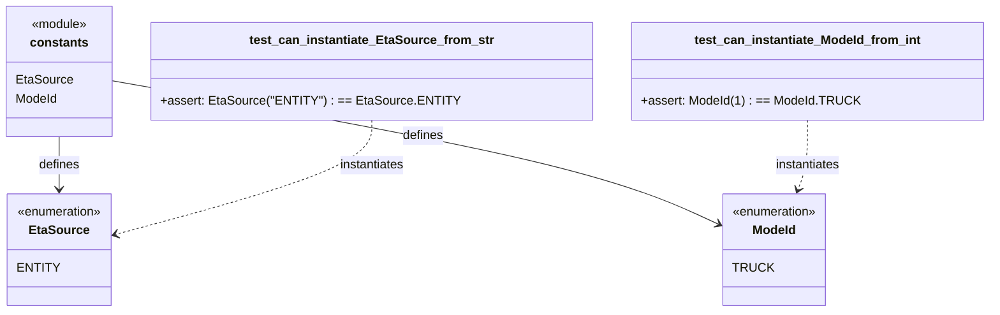

# Diagram: eta/eta_platform_common/eta_platform_common/tests/test_constants.py

> Auto-generated by Obscura crawlers

## Mermaid

### SVG

<svg id="container" width="1220.32421875" xmlns="http://www.w3.org/2000/svg" class="classDiagram" height="402" viewBox="0 0 1220.32421875 402" role="graphics-document document" aria-roledescription="class"><g><defs><marker id="container_class-aggregationStart" class="marker aggregation class" refX="18" refY="7" markerWidth="190" markerHeight="240" orient="auto"><path d="M 18,7 L9,13 L1,7 L9,1 Z"></path></marker></defs><defs><marker id="container_class-aggregationEnd" class="marker aggregation class" refX="1" refY="7" markerWidth="20" markerHeight="28" orient="auto"><path d="M 18,7 L9,13 L1,7 L9,1 Z"></path></marker></defs><defs><marker id="container_class-extensionStart" class="marker extension class" refX="18" refY="7" markerWidth="190" markerHeight="240" orient="auto"><path d="M 1,7 L18,13 V 1 Z"></path></marker></defs><defs><marker id="container_class-extensionEnd" class="marker extension class" refX="1" refY="7" markerWidth="20" markerHeight="28" orient="auto"><path d="M 1,1 V 13 L18,7 Z"></path></marker></defs><defs><marker id="container_class-compositionStart" class="marker composition class" refX="18" refY="7" markerWidth="190" markerHeight="240" orient="auto"><path d="M 18,7 L9,13 L1,7 L9,1 Z"></path></marker></defs><defs><marker id="container_class-compositionEnd" class="marker composition class" refX="1" refY="7" markerWidth="20" markerHeight="28" orient="auto"><path d="M 18,7 L9,13 L1,7 L9,1 Z"></path></marker></defs><defs><marker id="container_class-dependencyStart" class="marker dependency class" refX="6" refY="7" markerWidth="190" markerHeight="240" orient="auto"><path d="M 5,7 L9,13 L1,7 L9,1 Z"></path></marker></defs><defs><marker id="container_class-dependencyEnd" class="marker dependency class" refX="13" refY="7" markerWidth="20" markerHeight="28" orient="auto"><path d="M 18,7 L9,13 L14,7 L9,1 Z"></path></marker></defs><defs><marker id="container_class-lollipopStart" class="marker lollipop class" refX="13" refY="7" markerWidth="190" markerHeight="240" orient="auto"><circle stroke="black" fill="transparent" cx="7" cy="7" r="6"></circle></marker></defs><defs><marker id="container_class-lollipopEnd" class="marker lollipop class" refX="1" refY="7" markerWidth="190" markerHeight="240" orient="auto"><circle stroke="black" fill="transparent" cx="7" cy="7" r="6"></circle></marker></defs><g class="root"><g class="clusters"></g><g class="edgePaths"><path d="M75.555,176L75.555,182.167C75.555,188.333,75.555,200.667,75.555,212C75.555,223.333,75.555,233.667,75.555,238.833L75.555,244" id="id_constants_EtaSource_1" class="edge-thickness-normal edge-pattern-solid relation" style=";;;" data-edge="true" data-et="edge" data-id="id_constants_EtaSource_1" data-points="W3sieCI6NzUuNTU0Njg3NSwieSI6MTc2fSx7IngiOjc1LjU1NDY4NzUsInkiOjIxM30seyJ4Ijo3NS41NTQ2ODc1LCJ5IjoyNTB9XQ==" marker-end="url(#container_class-dependencyEnd)"></path><path d="M141.77,104.282L239.456,122.402C337.143,140.521,532.516,176.761,655.197,207.102C777.879,237.444,827.869,261.888,852.865,274.11L877.86,286.332" id="id_constants_ModeId_2" class="edge-thickness-normal edge-pattern-solid relation" style=";;;" data-edge="true" data-et="edge" data-id="id_constants_ModeId_2" data-points="W3sieCI6MTQxLjc2OTUzMTI1LCJ5IjoxMDQuMjgyMDQ2MTM4NDE1MjR9LHsieCI6NzI3Ljg4ODY3MTg3NSwieSI6MjEzfSx7IngiOjg4My4yNSwieSI6Mjg4Ljk2NzU1NTM5NTg5Nzc2fV0=" marker-end="url(#container_class-dependencyEnd)"></path><path d="M460.25,155L460.25,164.667C460.25,174.333,460.25,193.667,408.355,218.037C356.461,242.408,252.671,271.816,200.777,286.519L148.882,301.223" id="id_test_can_instantiate_EtaSource_from_str_EtaSource_3" class="edge-thickness-normal edge-pattern-dashed relation" style=";;;" data-edge="true" data-et="edge" data-id="id_test_can_instantiate_EtaSource_from_str_EtaSource_3" data-points="W3sieCI6NDYwLjI1LCJ5IjoxNTV9LHsieCI6NDYwLjI1LCJ5IjoyMTN9LHsieCI6MTQzLjEwOTM3NSwieSI6MzAyLjg1ODk3OTMwNTg2M31d" marker-end="url(#container_class-dependencyEnd)"></path><path d="M995.527,155L995.527,164.667C995.527,174.333,995.527,193.667,993.377,208.575C991.226,223.483,986.925,233.966,984.774,239.208L982.624,244.449" id="id_test_can_instantiate_ModeId_from_int_ModeId_4" class="edge-thickness-normal edge-pattern-dashed relation" style=";;;" data-edge="true" data-et="edge" data-id="id_test_can_instantiate_ModeId_from_int_ModeId_4" data-points="W3sieCI6OTk1LjUyNzM0Mzc1LCJ5IjoxNTV9LHsieCI6OTk1LjUyNzM0Mzc1LCJ5IjoyMTN9LHsieCI6OTgwLjM0NjI1ODYwMDkxNzQsInkiOjI1MH1d" marker-end="url(#container_class-dependencyEnd)"></path></g><g class="edgeLabels"><g class="edgeLabel" transform="translate(75.5546875, 213)"><g class="label" data-id="id_constants_EtaSource_1" transform="translate(-26.53125, -12)"><foreignObject width="53.0625" height="24">

defines

</foreignObject></g></g><g class="edgeLabel" transform="translate(519.84884, 174.41115)"><g class="label" data-id="id_constants_ModeId_2" transform="translate(-26.53125, -12)"><foreignObject width="53.0625" height="24">

defines

</foreignObject></g></g><g class="edgeLabel" transform="translate(460.25, 213)"><g class="label" data-id="id_test_can_instantiate_EtaSource_from_str_EtaSource_3" transform="translate(-42.9140625, -12)"><foreignObject width="85.828125" height="24">

instantiates

</foreignObject></g></g><g class="edgeLabel" transform="translate(995.52734375, 213)"><g class="label" data-id="id_test_can_instantiate_ModeId_from_int_ModeId_4" transform="translate(-42.9140625, -12)"><foreignObject width="85.828125" height="24">

instantiates

</foreignObject></g></g></g><g class="nodes"><g class="node default" id="classId-constants-0" transform="translate(75.5546875, 92)"><g class="basic label-container"><path d="M-66.21484375 -84 L66.21484375 -84 L66.21484375 84 L-66.21484375 84" stroke="none" stroke-width="0" fill="#ECECFF" style=""></path><path d="M-66.21484375 -84 C-35.64478688802815 -84, -5.074730026056301 -84, 66.21484375 -84 M-66.21484375 -84 C-38.61153667424915 -84, -11.008229598498296 -84, 66.21484375 -84 M66.21484375 -84 C66.21484375 -30.26486792083989, 66.21484375 23.47026415832022, 66.21484375 84 M66.21484375 -84 C66.21484375 -27.25609595339374, 66.21484375 29.48780809321252, 66.21484375 84 M66.21484375 84 C38.75679517919708 84, 11.298746608394154 84, -66.21484375 84 M66.21484375 84 C33.43349453881866 84, 0.6521453276373137 84, -66.21484375 84 M-66.21484375 84 C-66.21484375 21.19997647218355, -66.21484375 -41.6000470556329, -66.21484375 -84 M-66.21484375 84 C-66.21484375 34.166249045352465, -66.21484375 -15.66750190929507, -66.21484375 -84" stroke="#9370DB" stroke-width="1.3" fill="none" stroke-dasharray="0 0" style=""></path></g><g class="annotation-group text" transform="translate(-36.6015625, -60)"><g class="label" style="" transform="translate(0,-12)"><foreignObject width="73.203125" height="24">

«module»

</foreignObject></g></g><g class="label-group text" transform="translate(-35.7734375, -36)"><g class="label" style="font-weight: bolder" transform="translate(0,-12)"><foreignObject width="71.546875" height="24">

constants

</foreignObject></g></g><g class="members-group text" transform="translate(-54.21484375, 12)"><g class="label" style="" transform="translate(0,-12)"><foreignObject width="71.828125" height="24">

EtaSource

</foreignObject></g><g class="label" style="" transform="translate(0,12)"><foreignObject width="54.375" height="24">

ModeId

</foreignObject></g></g><g class="methods-group text" transform="translate(-54.21484375, 84)"></g><g class="divider" style=""><path d="M-66.21484375 -12 C-38.0452782920386 -12, -9.875712834077206 -12, 66.21484375 -12 M-66.21484375 -12 C-27.739903042761235 -12, 10.735037664477531 -12, 66.21484375 -12" stroke="#9370DB" stroke-width="1.3" fill="none" stroke-dasharray="0 0" style=""></path></g><g class="divider" style=""><path d="M-66.21484375 60 C-27.527808810673427 60, 11.159226128653145 60, 66.21484375 60 M-66.21484375 60 C-34.632129528884946 60, -3.049415307769884 60, 66.21484375 60" stroke="#9370DB" stroke-width="1.3" fill="none" stroke-dasharray="0 0" style=""></path></g></g><g class="node default" id="classId-EtaSource-1" transform="translate(75.5546875, 322)"><g class="basic label-container"><path d="M-67.5546875 -72 L67.5546875 -72 L67.5546875 72 L-67.5546875 72" stroke="none" stroke-width="0" fill="#ECECFF" style=""></path><path d="M-67.5546875 -72 C-34.583459140384385 -72, -1.612230780768769 -72, 67.5546875 -72 M-67.5546875 -72 C-15.363200344394158 -72, 36.82828681121168 -72, 67.5546875 -72 M67.5546875 -72 C67.5546875 -35.121874480871796, 67.5546875 1.7562510382564085, 67.5546875 72 M67.5546875 -72 C67.5546875 -17.246034160872668, 67.5546875 37.507931678254664, 67.5546875 72 M67.5546875 72 C29.78228410884187 72, -7.9901192823162575 72, -67.5546875 72 M67.5546875 72 C30.304788768155063 72, -6.945109963689873 72, -67.5546875 72 M-67.5546875 72 C-67.5546875 40.7415575617826, -67.5546875 9.483115123565192, -67.5546875 -72 M-67.5546875 72 C-67.5546875 20.174817224264963, -67.5546875 -31.650365551470074, -67.5546875 -72" stroke="#9370DB" stroke-width="1.3" fill="none" stroke-dasharray="0 0" style=""></path></g><g class="annotation-group text" transform="translate(-55.5546875, -48)"><g class="label" style="" transform="translate(0,-12)"><foreignObject width="111.109375" height="24">

«enumeration»

</foreignObject></g></g><g class="label-group text" transform="translate(-36.3203125, -24)"><g class="label" style="font-weight: bolder" transform="translate(0,-12)"><foreignObject width="72.640625" height="24">

EtaSource

</foreignObject></g></g><g class="members-group text" transform="translate(-55.5546875, 24)"><g class="label" style="" transform="translate(0,-12)"><foreignObject width="49.5625" height="24">

ENTITY

</foreignObject></g></g><g class="methods-group text" transform="translate(-55.5546875, 72)"></g><g class="divider" style=""><path d="M-67.5546875 0 C-37.33179060590519 0, -7.108893711810381 0, 67.5546875 0 M-67.5546875 0 C-27.94601888675176 0, 11.662649726496483 0, 67.5546875 0" stroke="#9370DB" stroke-width="1.3" fill="none" stroke-dasharray="0 0" style=""></path></g><g class="divider" style=""><path d="M-67.5546875 48 C-33.716379869884804 48, 0.12192776023039187 48, 67.5546875 48 M-67.5546875 48 C-28.242523149180485 48, 11.06964120163903 48, 67.5546875 48" stroke="#9370DB" stroke-width="1.3" fill="none" stroke-dasharray="0 0" style=""></path></g></g><g class="node default" id="classId-ModeId-2" transform="translate(950.8046875, 322)"><g class="basic label-container"><path d="M-67.5546875 -72 L67.5546875 -72 L67.5546875 72 L-67.5546875 72" stroke="none" stroke-width="0" fill="#ECECFF" style=""></path><path d="M-67.5546875 -72 C-28.647970763637744 -72, 10.258745972724512 -72, 67.5546875 -72 M-67.5546875 -72 C-26.024391525366752 -72, 15.505904449266495 -72, 67.5546875 -72 M67.5546875 -72 C67.5546875 -35.303915952851334, 67.5546875 1.3921680942973325, 67.5546875 72 M67.5546875 -72 C67.5546875 -35.31820398807043, 67.5546875 1.363592023859141, 67.5546875 72 M67.5546875 72 C18.32593788018253 72, -30.90281173963494 72, -67.5546875 72 M67.5546875 72 C22.13365477198675 72, -23.287377956026504 72, -67.5546875 72 M-67.5546875 72 C-67.5546875 33.66828168717573, -67.5546875 -4.6634366256485436, -67.5546875 -72 M-67.5546875 72 C-67.5546875 37.11595283689215, -67.5546875 2.231905673784297, -67.5546875 -72" stroke="#9370DB" stroke-width="1.3" fill="none" stroke-dasharray="0 0" style=""></path></g><g class="annotation-group text" transform="translate(-55.5546875, -48)"><g class="label" style="" transform="translate(0,-12)"><foreignObject width="111.109375" height="24">

«enumeration»

</foreignObject></g></g><g class="label-group text" transform="translate(-27.3203125, -24)"><g class="label" style="font-weight: bolder" transform="translate(0,-12)"><foreignObject width="54.640625" height="24">

ModeId

</foreignObject></g></g><g class="members-group text" transform="translate(-55.5546875, 24)"><g class="label" style="" transform="translate(0,-12)"><foreignObject width="46.828125" height="24">

TRUCK

</foreignObject></g></g><g class="methods-group text" transform="translate(-55.5546875, 72)"></g><g class="divider" style=""><path d="M-67.5546875 0 C-31.58054697359939 0, 4.393593552801221 0, 67.5546875 0 M-67.5546875 0 C-35.23941776635986 0, -2.924148032719714 0, 67.5546875 0" stroke="#9370DB" stroke-width="1.3" fill="none" stroke-dasharray="0 0" style=""></path></g><g class="divider" style=""><path d="M-67.5546875 48 C-24.24587209818823 48, 19.06294330362354 48, 67.5546875 48 M-67.5546875 48 C-39.69103973791999 48, -11.827391975839994 48, 67.5546875 48" stroke="#9370DB" stroke-width="1.3" fill="none" stroke-dasharray="0 0" style=""></path></g></g><g class="node default" id="classId-test_can_instantiate_EtaSource_from_str-3" transform="translate(460.25, 92)"><g class="basic label-container"><path d="M-268.48046875 -63 L268.48046875 -63 L268.48046875 63 L-268.48046875 63" stroke="none" stroke-width="0" fill="#ECECFF" style=""></path><path d="M-268.48046875 -63 C-79.83950856515375 -63, 108.8014516196925 -63, 268.48046875 -63 M-268.48046875 -63 C-104.21389545576676 -63, 60.05267783846648 -63, 268.48046875 -63 M268.48046875 -63 C268.48046875 -16.53830984864142, 268.48046875 29.923380302717163, 268.48046875 63 M268.48046875 -63 C268.48046875 -34.194566216320226, 268.48046875 -5.3891324326404515, 268.48046875 63 M268.48046875 63 C72.7459003239774 63, -122.98866810204521 63, -268.48046875 63 M268.48046875 63 C130.2351475165886 63, -8.010173716822806 63, -268.48046875 63 M-268.48046875 63 C-268.48046875 15.474820543286974, -268.48046875 -32.05035891342605, -268.48046875 -63 M-268.48046875 63 C-268.48046875 19.59573142750945, -268.48046875 -23.808537144981102, -268.48046875 -63" stroke="#9370DB" stroke-width="1.3" fill="none" stroke-dasharray="0 0" style=""></path></g><g class="annotation-group text" transform="translate(0, -39)"></g><g class="label-group text" transform="translate(-150.7734375, -39)"><g class="label" style="font-weight: bolder" transform="translate(0,-12)"><foreignObject width="301.546875" height="24">

test_can_instantiate_EtaSource_from_str

</foreignObject></g></g><g class="members-group text" transform="translate(-256.48046875, 9)"></g><g class="methods-group text" transform="translate(-256.48046875, 39)"><g class="label" style="" transform="translate(0,-12)"><foreignObject width="362.1875" height="24">

+assert: EtaSource("ENTITY") : == EtaSource.ENTITY

</foreignObject></g></g><g class="divider" style=""><path d="M-268.48046875 -15 C-128.717746780399 -15, 11.044975189201978 -15, 268.48046875 -15 M-268.48046875 -15 C-68.57423450889223 -15, 131.33199973221554 -15, 268.48046875 -15" stroke="#9370DB" stroke-width="1.3" fill="none" stroke-dasharray="0 0" style=""></path></g><g class="divider" style=""><path d="M-268.48046875 9 C-147.06258564539053 9, -25.644702540781083 9, 268.48046875 9 M-268.48046875 9 C-115.84804822198424 9, 36.784372306031514 9, 268.48046875 9" stroke="#9370DB" stroke-width="1.3" fill="none" stroke-dasharray="0 0" style=""></path></g></g><g class="node default" id="classId-test_can_instantiate_ModeId_from_int-4" transform="translate(995.52734375, 92)"><g class="basic label-container"><path d="M-216.796875 -63 L216.796875 -63 L216.796875 63 L-216.796875 63" stroke="none" stroke-width="0" fill="#ECECFF" style=""></path><path d="M-216.796875 -63 C-101.28938149363844 -63, 14.218112012723111 -63, 216.796875 -63 M-216.796875 -63 C-115.65557817302329 -63, -14.514281346046573 -63, 216.796875 -63 M216.796875 -63 C216.796875 -13.226006911477157, 216.796875 36.547986177045686, 216.796875 63 M216.796875 -63 C216.796875 -37.67495197123673, 216.796875 -12.34990394247346, 216.796875 63 M216.796875 63 C82.15962764719174 63, -52.47761970561652 63, -216.796875 63 M216.796875 63 C117.13800522074182 63, 17.479135441483635 63, -216.796875 63 M-216.796875 63 C-216.796875 21.819999650039463, -216.796875 -19.360000699921073, -216.796875 -63 M-216.796875 63 C-216.796875 14.46460306762345, -216.796875 -34.0707938647531, -216.796875 -63" stroke="#9370DB" stroke-width="1.3" fill="none" stroke-dasharray="0 0" style=""></path></g><g class="annotation-group text" transform="translate(0, -39)"></g><g class="label-group text" transform="translate(-141.734375, -39)"><g class="label" style="font-weight: bolder" transform="translate(0,-12)"><foreignObject width="283.46875" height="24">

test_can_instantiate_ModeId_from_int

</foreignObject></g></g><g class="members-group text" transform="translate(-204.796875, 9)"></g><g class="methods-group text" transform="translate(-204.796875, 39)"><g class="label" style="" transform="translate(0,-12)"><foreignObject width="267.859375" height="24">

+assert: ModeId(1) : == ModeId.TRUCK

</foreignObject></g></g><g class="divider" style=""><path d="M-216.796875 -15 C-60.37841245695182 -15, 96.04005008609636 -15, 216.796875 -15 M-216.796875 -15 C-76.95473208024845 -15, 62.887410839503104 -15, 216.796875 -15" stroke="#9370DB" stroke-width="1.3" fill="none" stroke-dasharray="0 0" style=""></path></g><g class="divider" style=""><path d="M-216.796875 9 C-109.34888425159032 9, -1.9008935031806402 9, 216.796875 9 M-216.796875 9 C-103.09094945850804 9, 10.61497608298393 9, 216.796875 9" stroke="#9370DB" stroke-width="1.3" fill="none" stroke-dasharray="0 0" style=""></path></g></g></g></g></g></svg>
