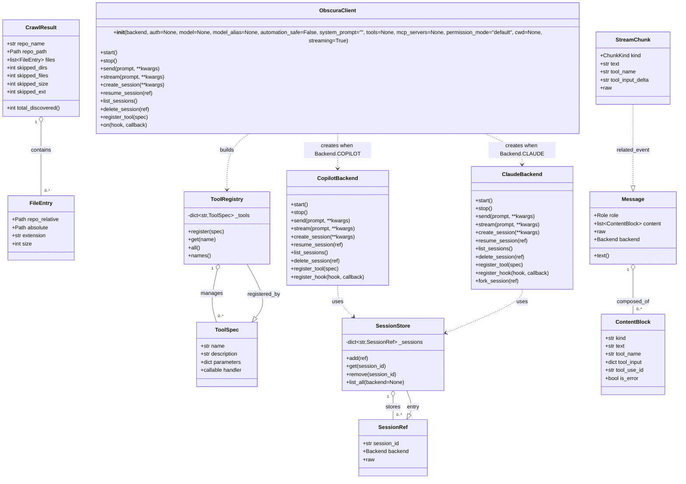

# Diagram: eta/eta_platform_common/pyproject.toml


> Auto-generated by Obscura crawlers

## Diagram 1



### SVG

<svg id="container" width="2059.21875" xmlns="http://www.w3.org/2000/svg" class="classDiagram" height="1402" viewBox="0 0 2059.21875 1402" role="graphics-document document" aria-roledescription="class"><style>#container{font-family:"trebuchet ms",verdana,arial,sans-serif;font-size:16px;fill:#333;}@keyframes edge-animation-frame{from{stroke-dashoffset:0;}}@keyframes dash{to{stroke-dashoffset:0;}}#container .edge-animation-slow{stroke-dasharray:9,5!important;stroke-dashoffset:900;animation:dash 50s linear infinite;stroke-linecap:round;}#container .edge-animation-fast{stroke-dasharray:9,5!important;stroke-dashoffset:900;animation:dash 20s linear infinite;stroke-linecap:round;}#container .error-icon{fill:#552222;}#container .error-text{fill:#552222;stroke:#552222;}#container .edge-thickness-normal{stroke-width:1px;}#container .edge-thickness-thick{stroke-width:3.5px;}#container .edge-pattern-solid{stroke-dasharray:0;}#container .edge-thickness-invisible{stroke-width:0;fill:none;}#container .edge-pattern-dashed{stroke-dasharray:3;}#container .edge-pattern-dotted{stroke-dasharray:2;}#container .marker{fill:#333333;stroke:#333333;}#container .marker.cross{stroke:#333333;}#container svg{font-family:"trebuchet ms",verdana,arial,sans-serif;font-size:16px;}#container p{margin:0;}#container g.classGroup text{fill:#9370DB;stroke:none;font-family:"trebuchet ms",verdana,arial,sans-serif;font-size:10px;}#container g.classGroup text .title{font-weight:bolder;}#container .nodeLabel,#container .edgeLabel{color:#131300;}#container .edgeLabel .label rect{fill:#ECECFF;}#container .label text{fill:#131300;}#container .labelBkg{background:#ECECFF;}#container .edgeLabel .label span{background:#ECECFF;}#container .classTitle{font-weight:bolder;}#container .node rect,#container .node circle,#container .node ellipse,#container .node polygon,#container .node path{fill:#ECECFF;stroke:#9370DB;stroke-width:1px;}#container .divider{stroke:#9370DB;stroke-width:1;}#container g.clickable{cursor:pointer;}#container g.classGroup rect{fill:#ECECFF;stroke:#9370DB;}#container g.classGroup line{stroke:#9370DB;stroke-width:1;}#container .classLabel .box{stroke:none;stroke-width:0;fill:#ECECFF;opacity:0.5;}#container .classLabel .label{fill:#9370DB;font-size:10px;}#container .relation{stroke:#333333;stroke-width:1;fill:none;}#container .dashed-line{stroke-dasharray:3;}#container .dotted-line{stroke-dasharray:1 2;}#container #compositionStart,#container .composition{fill:#333333!important;stroke:#333333!important;stroke-width:1;}#container #compositionEnd,#container .composition{fill:#333333!important;stroke:#333333!important;stroke-width:1;}#container #dependencyStart,#container .dependency{fill:#333333!important;stroke:#333333!important;stroke-width:1;}#container #dependencyStart,#container .dependency{fill:#333333!important;stroke:#333333!important;stroke-width:1;}#container #extensionStart,#container .extension{fill:transparent!important;stroke:#333333!important;stroke-width:1;}#container #extensionEnd,#container .extension{fill:transparent!important;stroke:#333333!important;stroke-width:1;}#container #aggregationStart,#container .aggregation{fill:transparent!important;stroke:#333333!important;stroke-width:1;}#container #aggregationEnd,#container .aggregation{fill:transparent!important;stroke:#333333!important;stroke-width:1;}#container #lollipopStart,#container .lollipop{fill:#ECECFF!important;stroke:#333333!important;stroke-width:1;}#container #lollipopEnd,#container .lollipop{fill:#ECECFF!important;stroke:#333333!important;stroke-width:1;}#container .edgeTerminals{font-size:11px;line-height:initial;}#container .classTitleText{text-anchor:middle;font-size:18px;fill:#333;}#container .label-icon{display:inline-block;height:1em;overflow:visible;vertical-align:-0.125em;}#container .node .label-icon path{fill:currentColor;stroke:revert;stroke-width:revert;}#container :root{--mermaid-font-family:"trebuchet ms",verdana,arial,sans-serif;}</style><g><defs><marker id="container_class-aggregationStart" class="marker aggregation class" refX="18" refY="7" markerWidth="190" markerHeight="240" orient="auto"><path d="M 18,7 L9,13 L1,7 L9,1 Z"></path></marker></defs><defs><marker id="container_class-aggregationEnd" class="marker aggregation class" refX="1" refY="7" markerWidth="20" markerHeight="28" orient="auto"><path d="M 18,7 L9,13 L1,7 L9,1 Z"></path></marker></defs><defs><marker id="container_class-extensionStart" class="marker extension class" refX="18" refY="7" markerWidth="190" markerHeight="240" orient="auto"><path d="M 1,7 L18,13 V 1 Z"></path></marker></defs><defs><marker id="container_class-extensionEnd" class="marker extension class" refX="1" refY="7" markerWidth="20" markerHeight="28" orient="auto"><path d="M 1,1 V 13 L18,7 Z"></path></marker></defs><defs><marker id="container_class-compositionStart" class="marker composition class" refX="18" refY="7" markerWidth="190" markerHeight="240" orient="auto"><path d="M 18,7 L9,13 L1,7 L9,1 Z"></path></marker></defs><defs><marker id="container_class-compositionEnd" class="marker composition class" refX="1" refY="7" markerWidth="20" markerHeight="28" orient="auto"><path d="M 18,7 L9,13 L1,7 L9,1 Z"></path></marker></defs><defs><marker id="container_class-dependencyStart" class="marker dependency class" refX="6" refY="7" markerWidth="190" markerHeight="240" orient="auto"><path d="M 5,7 L9,13 L1,7 L9,1 Z"></path></marker></defs><defs><marker id="container_class-dependencyEnd" class="marker dependency class" refX="13" refY="7" markerWidth="20" markerHeight="28" orient="auto"><path d="M 18,7 L9,13 L14,7 L9,1 Z"></path></marker></defs><defs><marker id="container_class-lollipopStart" class="marker lollipop class" refX="13" refY="7" markerWidth="190" markerHeight="240" orient="auto"><circle stroke="black" fill="transparent" cx="7" cy="7" r="6"></circle></marker></defs><defs><marker id="container_class-lollipopEnd" class="marker lollipop class" refX="1" refY="7" markerWidth="190" markerHeight="240" orient="auto"><circle stroke="black" fill="transparent" cx="7" cy="7" r="6"></circle></marker></defs><g class="root"><g class="clusters"></g><g class="edgePaths"><path d="M123,352.25L123,364.042C123,375.833,123,399.417,123,433.875C123,468.333,123,513.667,123,536.333L123,559" id="id_CrawlResult_FileEntry_1" class="edge-thickness-normal edge-pattern-solid relation" style=";;;" data-edge="true" data-et="edge" data-id="id_CrawlResult_FileEntry_1" data-points="W3sieCI6MTIzLCJ5IjozMzV9LHsieCI6MTIzLCJ5Ijo0MjN9LHsieCI6MTIzLCJ5Ijo1NTl9XQ==" marker-start="url(#container_class-aggregationStart)"></path><path d="M666.796,779.808L663.133,795.673C659.469,811.539,652.143,843.269,651.769,869.301C651.395,895.333,657.974,915.667,661.263,925.833L664.553,936" id="id_ToolRegistry_ToolSpec_2" class="edge-thickness-normal edge-pattern-solid relation" style=";;;" data-edge="true" data-et="edge" data-id="id_ToolRegistry_ToolSpec_2" data-points="W3sieCI6NjcwLjY3NjYzMzUyMjcyNzIsInkiOjc2M30seyJ4Ijo2NDQuODE2NDA2MjUsInkiOjg3NX0seyJ4Ijo2NjQuNTUyNzcxNjk1ODU5OSwieSI6OTM2fV0=" marker-start="url(#container_class-aggregationStart)"></path><path d="M1187.977,1157.25L1187.977,1162.542C1187.977,1167.833,1187.977,1178.417,1187.977,1189.875C1187.977,1201.333,1187.977,1213.667,1187.977,1219.833L1187.977,1226" id="id_SessionStore_SessionRef_3" class="edge-thickness-normal edge-pattern-solid relation" style=";;;" data-edge="true" data-et="edge" data-id="id_SessionStore_SessionRef_3" data-points="W3sieCI6MTE4Ny45NzY1NjI1LCJ5IjoxMTQwfSx7IngiOjExODcuOTc2NTYyNSwieSI6MTE4OX0seyJ4IjoxMTg3Ljk3NjU2MjUsInkiOjEyMjZ9XQ==" marker-start="url(#container_class-aggregationStart)"></path><path d="M764.94,374L753.386,382.167C741.831,390.333,718.722,406.667,707.168,434.5C695.613,462.333,695.613,501.667,695.613,521.333L695.613,541" id="id_ObscuraClient_ToolRegistry_4" class="edge-thickness-normal edge-pattern-dashed relation" style=";;;" data-edge="true" data-et="edge" data-id="id_ObscuraClient_ToolRegistry_4" data-points="W3sieCI6NzY0Ljk0MDI5NDk4OTIyNDIsInkiOjM3NH0seyJ4Ijo2OTUuNjEzMjgxMjUsInkiOjQyM30seyJ4Ijo2OTUuNjEzMjgxMjUsInkiOjU0N31d" marker-end="url(#container_class-dependencyEnd)"></path><path d="M1023.855,374L1023.855,382.167C1023.855,390.333,1023.855,406.667,1023.855,424C1023.855,441.333,1023.855,459.667,1023.855,468.833L1023.855,478" id="id_ObscuraClient_CopilotBackend_5" class="edge-thickness-normal edge-pattern-dashed relation" style=";;;" data-edge="true" data-et="edge" data-id="id_ObscuraClient_CopilotBackend_5" data-points="W3sieCI6MTAyMy44NTU0Njg3NSwieSI6Mzc0fSx7IngiOjEwMjMuODU1NDY4NzUsInkiOjQyM30seyJ4IjoxMDIzLjg1NTQ2ODc1LCJ5Ijo0ODR9XQ==" marker-end="url(#container_class-dependencyEnd)"></path><path d="M1473.082,374L1493.13,382.167C1513.177,390.333,1553.272,406.667,1573.32,422C1593.367,437.333,1593.367,451.667,1593.367,458.833L1593.367,466" id="id_ObscuraClient_ClaudeBackend_6" class="edge-thickness-normal edge-pattern-dashed relation" style=";;;" data-edge="true" data-et="edge" data-id="id_ObscuraClient_ClaudeBackend_6" data-points="W3sieCI6MTQ3My4wODIzODQ4MzI5NzQyLCJ5IjozNzR9LHsieCI6MTU5My4zNjcxODc1LCJ5Ijo0MjN9LHsieCI6MTU5My4zNjcxODc1LCJ5Ijo0NzJ9XQ==" marker-end="url(#container_class-dependencyEnd)"></path><path d="M1023.855,826L1023.855,834.167C1023.855,842.333,1023.855,858.667,1031.67,874.309C1039.484,889.951,1055.113,904.902,1062.928,912.377L1070.742,919.852" id="id_CopilotBackend_SessionStore_7" class="edge-thickness-normal edge-pattern-dashed relation" style=";;;" data-edge="true" data-et="edge" data-id="id_CopilotBackend_SessionStore_7" data-points="W3sieCI6MTAyMy44NTU0Njg3NSwieSI6ODI2fSx7IngiOjEwMjMuODU1NDY4NzUsInkiOjg3NX0seyJ4IjoxMDc1LjA3Nzk3NTcxNjU2MDYsInkiOjkyNH1d" marker-end="url(#container_class-dependencyEnd)"></path><path d="M1593.367,838L1593.367,844.167C1593.367,850.333,1593.367,862.667,1551.48,885.055C1509.593,907.444,1425.819,939.888,1383.931,956.11L1342.044,972.333" id="id_ClaudeBackend_SessionStore_8" class="edge-thickness-normal edge-pattern-dashed relation" style=";;;" data-edge="true" data-et="edge" data-id="id_ClaudeBackend_SessionStore_8" data-points="W3sieCI6MTU5My4zNjcxODc1LCJ5Ijo4Mzh9LHsieCI6MTU5My4zNjcxODc1LCJ5Ijo4NzV9LHsieCI6MTMzNi40NDkyMTg3NSwieSI6OTc0LjQ5OTM5Mjk0NjYxNzh9XQ==" marker-end="url(#container_class-dependencyEnd)"></path><path d="M1922.5,780.25L1922.5,796.042C1922.5,811.833,1922.5,843.417,1922.5,865.375C1922.5,887.333,1922.5,899.667,1922.5,905.833L1922.5,912" id="id_Message_ContentBlock_9" class="edge-thickness-normal edge-pattern-solid relation" style=";;;" data-edge="true" data-et="edge" data-id="id_Message_ContentBlock_9" data-points="W3sieCI6MTkyMi41LCJ5Ijo3NjN9LHsieCI6MTkyMi41LCJ5Ijo4NzV9LHsieCI6MTkyMi41LCJ5Ijo5MTJ9XQ==" marker-start="url(#container_class-aggregationStart)"></path><path d="M1922.5,299L1922.5,319.667C1922.5,340.333,1922.5,381.667,1922.5,420.125C1922.5,458.583,1922.5,494.167,1922.5,511.958L1922.5,529.75" id="id_StreamChunk_Message_10" class="edge-thickness-normal edge-pattern-dashed relation" style=";;;" data-edge="true" data-et="edge" data-id="id_StreamChunk_Message_10" data-points="W3sieCI6MTkyMi41LCJ5IjoyOTl9LHsieCI6MTkyMi41LCJ5Ijo0MjN9LHsieCI6MTkyMi41LCJ5Ijo1NDd9XQ==" marker-end="url(#container_class-extensionEnd)"></path><path d="M780.282,922.346L786.375,914.455C792.468,906.564,804.654,890.782,800.461,864.224C796.268,837.667,775.696,800.333,765.41,781.667L755.125,763" id="id_ToolSpec_ToolRegistry_11" class="edge-thickness-normal edge-pattern-solid relation" style=";;;" data-edge="true" data-et="edge" data-id="id_ToolSpec_ToolRegistry_11" data-points="W3sieCI6NzY5LjczOTA3NzQyODM0NCwieSI6OTM2fSx7IngiOjgxNi44Mzk4NDM3NSwieSI6ODc1fSx7IngiOjc1NS4xMjQ1MDI4NDA5MDkxLCJ5Ijo3NjN9XQ==" marker-start="url(#container_class-extensionStart)"></path><path d="M1238.157,1210.601L1239.975,1207.001C1241.792,1203.401,1245.427,1196.2,1244.067,1184.434C1242.707,1172.667,1236.352,1156.333,1233.175,1148.167L1229.997,1140" id="id_SessionRef_SessionStore_12" class="edge-thickness-normal edge-pattern-solid relation" style=";;;" data-edge="true" data-et="edge" data-id="id_SessionRef_SessionStore_12" data-points="W3sieCI6MTIzMC4zODMzMjkwMjg5MjU2LCJ5IjoxMjI2fSx7IngiOjEyNDkuMDYyNSwieSI6MTE4OX0seyJ4IjoxMjI5Ljk5NzQ2MjE4MTUyODYsInkiOjExNDB9XQ==" marker-start="url(#container_class-extensionStart)"></path></g><g class="edgeLabels"><g class="edgeLabel" transform="translate(123, 423)"><g class="label" data-id="id_CrawlResult_FileEntry_1" transform="translate(-30.890625, -12)"><foreignObject width="61.78125" height="24"><div xmlns="http://www.w3.org/1999/xhtml" class="labelBkg" style="display: table-cell; white-space: nowrap; line-height: 1.5; max-width: 200px; text-align: center;"><span class="edgeLabel"><p>contains</p></span></div></foreignObject></g></g><g class="edgeLabel" transform="translate(650.53454, 850.23489)"><g class="label" data-id="id_ToolRegistry_ToolSpec_2" transform="translate(-32.296875, -12)"><foreignObject width="64.59375" height="24"><div xmlns="http://www.w3.org/1999/xhtml" class="labelBkg" style="display: table-cell; white-space: nowrap; line-height: 1.5; max-width: 200px; text-align: center;"><span class="edgeLabel"><p>manages</p></span></div></foreignObject></g></g><g class="edgeLabel" transform="translate(1187.9765625, 1189)"><g class="label" data-id="id_SessionStore_SessionRef_3" transform="translate(-22.125, -12)"><foreignObject width="44.25" height="24"><div xmlns="http://www.w3.org/1999/xhtml" class="labelBkg" style="display: table-cell; white-space: nowrap; line-height: 1.5; max-width: 200px; text-align: center;"><span class="edgeLabel"><p>stores</p></span></div></foreignObject></g></g><g class="edgeLabel" transform="translate(695.61328125, 423)"><g class="label" data-id="id_ObscuraClient_ToolRegistry_4" transform="translate(-22.4921875, -12)"><foreignObject width="44.984375" height="24"><div xmlns="http://www.w3.org/1999/xhtml" class="labelBkg" style="display: table-cell; white-space: nowrap; line-height: 1.5; max-width: 200px; text-align: center;"><span class="edgeLabel"><p>builds</p></span></div></foreignObject></g></g><g class="edgeLabel" transform="translate(1023.85546875, 423)"><g class="label" data-id="id_ObscuraClient_CopilotBackend_5" transform="translate(-100, -24)"><foreignObject width="200" height="48"><div xmlns="http://www.w3.org/1999/xhtml" class="labelBkg" style="display: table; white-space: break-spaces; line-height: 1.5; max-width: 200px; text-align: center; width: 200px;"><span class="edgeLabel"><p>creates when Backend.COPILOT</p></span></div></foreignObject></g></g><g class="edgeLabel" transform="translate(1593.3671875, 423)"><g class="label" data-id="id_ObscuraClient_ClaudeBackend_6" transform="translate(-100, -24)"><foreignObject width="200" height="48"><div xmlns="http://www.w3.org/1999/xhtml" class="labelBkg" style="display: table; white-space: break-spaces; line-height: 1.5; max-width: 200px; text-align: center; width: 200px;"><span class="edgeLabel"><p>creates when Backend.CLAUDE</p></span></div></foreignObject></g></g><g class="edgeLabel" transform="translate(1023.85546875, 875)"><g class="label" data-id="id_CopilotBackend_SessionStore_7" transform="translate(-16.4921875, -12)"><foreignObject width="32.984375" height="24"><div xmlns="http://www.w3.org/1999/xhtml" class="labelBkg" style="display: table-cell; white-space: nowrap; line-height: 1.5; max-width: 200px; text-align: center;"><span class="edgeLabel"><p>uses</p></span></div></foreignObject></g></g><g class="edgeLabel" transform="translate(1593.3671875, 875)"><g class="label" data-id="id_ClaudeBackend_SessionStore_8" transform="translate(-16.4921875, -12)"><foreignObject width="32.984375" height="24"><div xmlns="http://www.w3.org/1999/xhtml" class="labelBkg" style="display: table-cell; white-space: nowrap; line-height: 1.5; max-width: 200px; text-align: center;"><span class="edgeLabel"><p>uses</p></span></div></foreignObject></g></g><g class="edgeLabel" transform="translate(1922.5, 875)"><g class="label" data-id="id_Message_ContentBlock_9" transform="translate(-48.8515625, -12)"><foreignObject width="97.703125" height="24"><div xmlns="http://www.w3.org/1999/xhtml" class="labelBkg" style="display: table-cell; white-space: nowrap; line-height: 1.5; max-width: 200px; text-align: center;"><span class="edgeLabel"><p>composed_of</p></span></div></foreignObject></g></g><g class="edgeLabel" transform="translate(1922.5, 423)"><g class="label" data-id="id_StreamChunk_Message_10" transform="translate(-49.9453125, -12)"><foreignObject width="99.890625" height="24"><div xmlns="http://www.w3.org/1999/xhtml" class="labelBkg" style="display: table-cell; white-space: nowrap; line-height: 1.5; max-width: 200px; text-align: center;"><span class="edgeLabel"><p>related_event</p></span></div></foreignObject></g></g><g class="edgeLabel" transform="translate(804.57912, 852.74943)"><g class="label" data-id="id_ToolSpec_ToolRegistry_11" transform="translate(-49.296875, -12)"><foreignObject width="98.59375" height="24"><div xmlns="http://www.w3.org/1999/xhtml" class="labelBkg" style="display: table-cell; white-space: nowrap; line-height: 1.5; max-width: 200px; text-align: center;"><span class="edgeLabel"><p>registered_by</p></span></div></foreignObject></g></g><g class="edgeLabel" transform="translate(1247.04451, 1183.81346)"><g class="label" data-id="id_SessionRef_SessionStore_12" transform="translate(-18.9609375, -12)"><foreignObject width="37.921875" height="24"><div xmlns="http://www.w3.org/1999/xhtml" class="labelBkg" style="display: table-cell; white-space: nowrap; line-height: 1.5; max-width: 200px; text-align: center;"><span class="edgeLabel"><p>entry</p></span></div></foreignObject></g></g><g class="edgeTerminals" transform="translate(108, 352.5)"><g class="inner" transform="translate(0, 0)"><foreignObject style="width: 9px; height: 12px;"><div xmlns="http://www.w3.org/1999/xhtml" style="display: inline-block; padding-right: 1px; white-space: nowrap;"><span class="edgeLabel">1</span></div></foreignObject></g></g><g class="edgeTerminals" transform="translate(652.1240915883532, 776.6767375711019)"><g class="inner" transform="translate(0, 0)"><foreignObject style="width: 9px; height: 12px;"><div xmlns="http://www.w3.org/1999/xhtml" style="display: inline-block; padding-right: 1px; white-space: nowrap;"><span class="edgeLabel">1</span></div></foreignObject></g></g><g class="edgeTerminals" transform="translate(1172.97656125, 1157.4999989285714)"><g class="inner" transform="translate(0, 0)"><foreignObject style="width: 9px; height: 12px;"><div xmlns="http://www.w3.org/1999/xhtml" style="display: inline-block; padding-right: 1px; white-space: nowrap;"><span class="edgeLabel">1</span></div></foreignObject></g></g><g class="edgeTerminals" transform="translate(1907.5, 780.5)"><g class="inner" transform="translate(0, 0)"><foreignObject style="width: 9px; height: 12px;"><div xmlns="http://www.w3.org/1999/xhtml" style="display: inline-block; padding-right: 1px; white-space: nowrap;"><span class="edgeLabel">1</span></div></foreignObject></g></g><g class="edgeTerminals" transform="translate(133, 536.5)"><g class="inner" transform="translate(0, 0)"></g><foreignObject style="width: 36px; height: 12px;"><div xmlns="http://www.w3.org/1999/xhtml" style="display: inline-block; padding-right: 1px; white-space: nowrap;"><span class="edgeLabel">0..*</span></div></foreignObject></g><g class="edgeTerminals" transform="translate(668.4372450577398, 909.7322733314003)"><g class="inner" transform="translate(0, 0)"></g><foreignObject style="width: 36px; height: 12px;"><div xmlns="http://www.w3.org/1999/xhtml" style="display: inline-block; padding-right: 1px; white-space: nowrap;"><span class="edgeLabel">0..*</span></div></foreignObject></g><g class="edgeTerminals" transform="translate(1197.97656125, 1203.4999989285714)"><g class="inner" transform="translate(0, 0)"></g><foreignObject style="width: 36px; height: 12px;"><div xmlns="http://www.w3.org/1999/xhtml" style="display: inline-block; padding-right: 1px; white-space: nowrap;"><span class="edgeLabel">0..*</span></div></foreignObject></g><g class="edgeTerminals" transform="translate(1932.5, 889.5)"><g class="inner" transform="translate(0, 0)"></g><foreignObject style="width: 36px; height: 12px;"><div xmlns="http://www.w3.org/1999/xhtml" style="display: inline-block; padding-right: 1px; white-space: nowrap;"><span class="edgeLabel">0..*</span></div></foreignObject></g></g><g class="nodes"><g class="node default" id="classId-FileEntry-0" transform="translate(123, 655)"><g class="basic label-container"><path d="M-98.0859375 -96 L98.0859375 -96 L98.0859375 96 L-98.0859375 96" stroke="none" stroke-width="0" fill="#ECECFF" style=""></path><path d="M-98.0859375 -96 C-29.319677914717943 -96, 39.446581670564115 -96, 98.0859375 -96 M-98.0859375 -96 C-32.033617697691795 -96, 34.01870210461641 -96, 98.0859375 -96 M98.0859375 -96 C98.0859375 -45.79660994013631, 98.0859375 4.406780119727387, 98.0859375 96 M98.0859375 -96 C98.0859375 -19.22674305941902, 98.0859375 57.54651388116196, 98.0859375 96 M98.0859375 96 C52.26614703535214 96, 6.446356570704282 96, -98.0859375 96 M98.0859375 96 C35.05511825825656 96, -27.975700983486874 96, -98.0859375 96 M-98.0859375 96 C-98.0859375 45.920892677982465, -98.0859375 -4.15821464403507, -98.0859375 -96 M-98.0859375 96 C-98.0859375 23.243825042514715, -98.0859375 -49.51234991497057, -98.0859375 -96" stroke="#9370DB" stroke-width="1.3" fill="none" stroke-dasharray="0 0" style=""></path></g><g class="annotation-group text" transform="translate(0, -72)"></g><g class="label-group text" transform="translate(-31.859375, -72)"><g class="label" style="font-weight: bolder" transform="translate(0,-12)"><foreignObject width="63.71875" height="24"><div xmlns="http://www.w3.org/1999/xhtml" style="display: table-cell; white-space: nowrap; line-height: 1.5; max-width: 113px; text-align: center;"><span class="nodeLabel markdown-node-label" style=""><p>FileEntry</p></span></div></foreignObject></g></g><g class="members-group text" transform="translate(-86.0859375, -24)"><g class="label" style="" transform="translate(0,-12)"><foreignObject width="140.3125" height="24"><div xmlns="http://www.w3.org/1999/xhtml" style="display: table-cell; white-space: nowrap; line-height: 1.5; max-width: 198px; text-align: center;"><span class="nodeLabel markdown-node-label" style=""><p>+Path repo_relative</p></span></div></foreignObject></g><g class="label" style="" transform="translate(0,12)"><foreignObject width="107.78125" height="24"><div xmlns="http://www.w3.org/1999/xhtml" style="display: table-cell; white-space: nowrap; line-height: 1.5; max-width: 165px; text-align: center;"><span class="nodeLabel markdown-node-label" style=""><p>+Path absolute</p></span></div></foreignObject></g><g class="label" style="" transform="translate(0,36)"><foreignObject width="102.328125" height="24"><div xmlns="http://www.w3.org/1999/xhtml" style="display: table-cell; white-space: nowrap; line-height: 1.5; max-width: 160px; text-align: center;"><span class="nodeLabel markdown-node-label" style=""><p>+str extension</p></span></div></foreignObject></g><g class="label" style="" transform="translate(0,60)"><foreignObject width="59.484375" height="24"><div xmlns="http://www.w3.org/1999/xhtml" style="display: table-cell; white-space: nowrap; line-height: 1.5; max-width: 117px; text-align: center;"><span class="nodeLabel markdown-node-label" style=""><p>+int size</p></span></div></foreignObject></g></g><g class="methods-group text" transform="translate(-86.0859375, 96)"></g><g class="divider" style=""><path d="M-98.0859375 -48 C-46.42359300156165 -48, 5.238751496876702 -48, 98.0859375 -48 M-98.0859375 -48 C-28.8494024412053 -48, 40.3871326175894 -48, 98.0859375 -48" stroke="#9370DB" stroke-width="1.3" fill="none" stroke-dasharray="0 0" style=""></path></g><g class="divider" style=""><path d="M-98.0859375 72 C-22.24464969831081 72, 53.59663810337838 72, 98.0859375 72 M-98.0859375 72 C-27.58281224384332 72, 42.92031301231336 72, 98.0859375 72" stroke="#9370DB" stroke-width="1.3" fill="none" stroke-dasharray="0 0" style=""></path></g></g><g class="node default" id="classId-CrawlResult-1" transform="translate(123, 191)"><g class="basic label-container"><path d="M-115 -144 L115 -144 L115 144 L-115 144" stroke="none" stroke-width="0" fill="#ECECFF" style=""></path><path d="M-115 -144 C-36.6546400670633 -144, 41.690719865873405 -144, 115 -144 M-115 -144 C-35.433960359372506 -144, 44.13207928125499 -144, 115 -144 M115 -144 C115 -79.75000554244667, 115 -15.500011084893345, 115 144 M115 -144 C115 -54.63039886660604, 115 34.73920226678791, 115 144 M115 144 C39.87500585790448 144, -35.24998828419103 144, -115 144 M115 144 C59.044195103549185 144, 3.088390207098371 144, -115 144 M-115 144 C-115 73.98977147540239, -115 3.9795429508047846, -115 -144 M-115 144 C-115 54.333688134945916, -115 -35.33262373010817, -115 -144" stroke="#9370DB" stroke-width="1.3" fill="none" stroke-dasharray="0 0" style=""></path></g><g class="annotation-group text" transform="translate(0, -120)"></g><g class="label-group text" transform="translate(-43.28125, -120)"><g class="label" style="font-weight: bolder" transform="translate(0,-12)"><foreignObject width="86.5625" height="24"><div xmlns="http://www.w3.org/1999/xhtml" style="display: table-cell; white-space: nowrap; line-height: 1.5; max-width: 135px; text-align: center;"><span class="nodeLabel markdown-node-label" style=""><p>CrawlResult</p></span></div></foreignObject></g></g><g class="members-group text" transform="translate(-103, -72)"><g class="label" style="" transform="translate(0,-12)"><foreignObject width="113.4375" height="24"><div xmlns="http://www.w3.org/1999/xhtml" style="display: table-cell; white-space: nowrap; line-height: 1.5; max-width: 171px; text-align: center;"><span class="nodeLabel markdown-node-label" style=""><p>+str repo_name</p></span></div></foreignObject></g><g class="label" style="" transform="translate(0,12)"><foreignObject width="118.96875" height="24"><div xmlns="http://www.w3.org/1999/xhtml" style="display: table-cell; white-space: nowrap; line-height: 1.5; max-width: 176px; text-align: center;"><span class="nodeLabel markdown-node-label" style=""><p>+Path repo_path</p></span></div></foreignObject></g><g class="label" style="" transform="translate(0,36)"><foreignObject width="143.421875" height="24"><div xmlns="http://www.w3.org/1999/xhtml" style="display: table-cell; white-space: nowrap; line-height: 1.5; max-width: 240px; text-align: center;"><span class="nodeLabel markdown-node-label" style=""><p>+list&lt;FileEntry&gt; files</p></span></div></foreignObject></g><g class="label" style="" transform="translate(0,60)"><foreignObject width="124.859375" height="24"><div xmlns="http://www.w3.org/1999/xhtml" style="display: table-cell; white-space: nowrap; line-height: 1.5; max-width: 182px; text-align: center;"><span class="nodeLabel markdown-node-label" style=""><p>+int skipped_dirs</p></span></div></foreignObject></g><g class="label" style="" transform="translate(0,84)"><foreignObject width="127.375" height="24"><div xmlns="http://www.w3.org/1999/xhtml" style="display: table-cell; white-space: nowrap; line-height: 1.5; max-width: 185px; text-align: center;"><span class="nodeLabel markdown-node-label" style=""><p>+int skipped_files</p></span></div></foreignObject></g><g class="label" style="" transform="translate(0,108)"><foreignObject width="125.265625" height="24"><div xmlns="http://www.w3.org/1999/xhtml" style="display: table-cell; white-space: nowrap; line-height: 1.5; max-width: 183px; text-align: center;"><span class="nodeLabel markdown-node-label" style=""><p>+int skipped_size</p></span></div></foreignObject></g><g class="label" style="" transform="translate(0,132)"><foreignObject width="119.484375" height="24"><div xmlns="http://www.w3.org/1999/xhtml" style="display: table-cell; white-space: nowrap; line-height: 1.5; max-width: 177px; text-align: center;"><span class="nodeLabel markdown-node-label" style=""><p>+int skipped_ext</p></span></div></foreignObject></g></g><g class="methods-group text" transform="translate(-103, 120)"><g class="label" style="" transform="translate(0,-12)"><foreignObject width="162.71875" height="24"><div xmlns="http://www.w3.org/1999/xhtml" style="display: table-cell; white-space: nowrap; line-height: 1.5; max-width: 220px; text-align: center;"><span class="nodeLabel markdown-node-label" style=""><p>+int total_discovered()</p></span></div></foreignObject></g></g><g class="divider" style=""><path d="M-115 -96 C-48.55712959632547 -96, 17.885740807349066 -96, 115 -96 M-115 -96 C-26.464461819913836 -96, 62.07107636017233 -96, 115 -96" stroke="#9370DB" stroke-width="1.3" fill="none" stroke-dasharray="0 0" style=""></path></g><g class="divider" style=""><path d="M-115 96 C-28.801020647231866 96, 57.39795870553627 96, 115 96 M-115 96 C-54.998817641496835 96, 5.00236471700633 96, 115 96" stroke="#9370DB" stroke-width="1.3" fill="none" stroke-dasharray="0 0" style=""></path></g></g><g class="node default" id="classId-ObscuraClient-2" transform="translate(1023.85546875, 191)"><g class="basic label-container"><path d="M-735.85546875 -183 L735.85546875 -183 L735.85546875 183 L-735.85546875 183" stroke="none" stroke-width="0" fill="#ECECFF" style=""></path><path d="M-735.85546875 -183 C-173.53782782172073 -183, 388.77981310655855 -183, 735.85546875 -183 M-735.85546875 -183 C-194.7204818785326 -183, 346.4145049929348 -183, 735.85546875 -183 M735.85546875 -183 C735.85546875 -76.21599204367114, 735.85546875 30.568015912657728, 735.85546875 183 M735.85546875 -183 C735.85546875 -63.05568237016038, 735.85546875 56.88863525967923, 735.85546875 183 M735.85546875 183 C255.6209453744179 183, -224.61357800116423 183, -735.85546875 183 M735.85546875 183 C371.36160980100516 183, 6.867750852010317 183, -735.85546875 183 M-735.85546875 183 C-735.85546875 98.24116335412117, -735.85546875 13.48232670824234, -735.85546875 -183 M-735.85546875 183 C-735.85546875 40.16445087484229, -735.85546875 -102.67109825031542, -735.85546875 -183" stroke="#9370DB" stroke-width="1.3" fill="none" stroke-dasharray="0 0" style=""></path></g><g class="annotation-group text" transform="translate(0, -159)"></g><g class="label-group text" transform="translate(-51.0859375, -159)"><g class="label" style="font-weight: bolder" transform="translate(0,-12)"><foreignObject width="102.171875" height="24"><div xmlns="http://www.w3.org/1999/xhtml" style="display: table-cell; white-space: nowrap; line-height: 1.5; max-width: 151px; text-align: center;"><span class="nodeLabel markdown-node-label" style=""><p>ObscuraClient</p></span></div></foreignObject></g></g><g class="members-group text" transform="translate(-723.85546875, -111)"></g><g class="methods-group text" transform="translate(-723.85546875, -81)"><g class="label" style="" transform="translate(0,-12)"><foreignObject width="1396.625" height="24"><div xmlns="http://www.w3.org/1999/xhtml" style="display: table-cell; white-space: nowrap; line-height: 1.5; max-width: 1485px; text-align: center;"><span class="nodeLabel markdown-node-label" style=""><p>+<strong>init</strong>(backend, auth=None, model=None, model_alias=None, automation_safe=False, system_prompt="", tools=None, mcp_servers=None, permission_mode="default", cwd=None, streaming=True)</p></span></div></foreignObject></g><g class="label" style="" transform="translate(0,12)"><foreignObject width="52.15625" height="24"><div xmlns="http://www.w3.org/1999/xhtml" style="display: table-cell; white-space: nowrap; line-height: 1.5; max-width: 110px; text-align: center;"><span class="nodeLabel markdown-node-label" style=""><p>+start()</p></span></div></foreignObject></g><g class="label" style="" transform="translate(0,36)"><foreignObject width="50.21875" height="24"><div xmlns="http://www.w3.org/1999/xhtml" style="display: table-cell; white-space: nowrap; line-height: 1.5; max-width: 108px; text-align: center;"><span class="nodeLabel markdown-node-label" style=""><p>+stop()</p></span></div></foreignObject></g><g class="label" style="" transform="translate(0,60)"><foreignObject width="179.078125" height="24"><div xmlns="http://www.w3.org/1999/xhtml" style="display: table-cell; white-space: nowrap; line-height: 1.5; max-width: 236px; text-align: center;"><span class="nodeLabel markdown-node-label" style=""><p>+send(prompt, **kwargs)</p></span></div></foreignObject></g><g class="label" style="" transform="translate(0,84)"><foreignObject width="193.859375" height="24"><div xmlns="http://www.w3.org/1999/xhtml" style="display: table-cell; white-space: nowrap; line-height: 1.5; max-width: 251px; text-align: center;"><span class="nodeLabel markdown-node-label" style=""><p>+stream(prompt, **kwargs)</p></span></div></foreignObject></g><g class="label" style="" transform="translate(0,108)"><foreignObject width="189.34375" height="24"><div xmlns="http://www.w3.org/1999/xhtml" style="display: table-cell; white-space: nowrap; line-height: 1.5; max-width: 247px; text-align: center;"><span class="nodeLabel markdown-node-label" style=""><p>+create_session(**kwargs)</p></span></div></foreignObject></g><g class="label" style="" transform="translate(0,132)"><foreignObject width="155.25" height="24"><div xmlns="http://www.w3.org/1999/xhtml" style="display: table-cell; white-space: nowrap; line-height: 1.5; max-width: 213px; text-align: center;"><span class="nodeLabel markdown-node-label" style=""><p>+resume_session(ref)</p></span></div></foreignObject></g><g class="label" style="" transform="translate(0,156)"><foreignObject width="110.8125" height="24"><div xmlns="http://www.w3.org/1999/xhtml" style="display: table-cell; white-space: nowrap; line-height: 1.5; max-width: 168px; text-align: center;"><span class="nodeLabel markdown-node-label" style=""><p>+list_sessions()</p></span></div></foreignObject></g><g class="label" style="" transform="translate(0,180)"><foreignObject width="147.5" height="24"><div xmlns="http://www.w3.org/1999/xhtml" style="display: table-cell; white-space: nowrap; line-height: 1.5; max-width: 205px; text-align: center;"><span class="nodeLabel markdown-node-label" style=""><p>+delete_session(ref)</p></span></div></foreignObject></g><g class="label" style="" transform="translate(0,204)"><foreignObject width="142.484375" height="24"><div xmlns="http://www.w3.org/1999/xhtml" style="display: table-cell; white-space: nowrap; line-height: 1.5; max-width: 200px; text-align: center;"><span class="nodeLabel markdown-node-label" style=""><p>+register_tool(spec)</p></span></div></foreignObject></g><g class="label" style="" transform="translate(0,228)"><foreignObject width="140.78125" height="24"><div xmlns="http://www.w3.org/1999/xhtml" style="display: table-cell; white-space: nowrap; line-height: 1.5; max-width: 198px; text-align: center;"><span class="nodeLabel markdown-node-label" style=""><p>+on(hook, callback)</p></span></div></foreignObject></g></g><g class="divider" style=""><path d="M-735.85546875 -135 C-196.28785998276442 -135, 343.27974878447117 -135, 735.85546875 -135 M-735.85546875 -135 C-170.22236304217688 -135, 395.41074266564624 -135, 735.85546875 -135" stroke="#9370DB" stroke-width="1.3" fill="none" stroke-dasharray="0 0" style=""></path></g><g class="divider" style=""><path d="M-735.85546875 -111 C-182.19463419335113 -111, 371.46620036329773 -111, 735.85546875 -111 M-735.85546875 -111 C-411.993524384682 -111, -88.13158001936404 -111, 735.85546875 -111" stroke="#9370DB" stroke-width="1.3" fill="none" stroke-dasharray="0 0" style=""></path></g></g><g class="node default" id="classId-ToolRegistry-3" transform="translate(695.61328125, 655)"><g class="basic label-container"><path d="M-127.22265625 -108 L127.22265625 -108 L127.22265625 108 L-127.22265625 108" stroke="none" stroke-width="0" fill="#ECECFF" style=""></path><path d="M-127.22265625 -108 C-46.745459951124246 -108, 33.73173634775151 -108, 127.22265625 -108 M-127.22265625 -108 C-72.36838452253463 -108, -17.514112795069238 -108, 127.22265625 -108 M127.22265625 -108 C127.22265625 -50.803094927024176, 127.22265625 6.393810145951647, 127.22265625 108 M127.22265625 -108 C127.22265625 -27.468602504729745, 127.22265625 53.06279499054051, 127.22265625 108 M127.22265625 108 C71.35465860348344 108, 15.486660956966901 108, -127.22265625 108 M127.22265625 108 C51.50401643270227 108, -24.214623384595455 108, -127.22265625 108 M-127.22265625 108 C-127.22265625 23.931404665520915, -127.22265625 -60.13719066895817, -127.22265625 -108 M-127.22265625 108 C-127.22265625 43.048675691435406, -127.22265625 -21.902648617129188, -127.22265625 -108" stroke="#9370DB" stroke-width="1.3" fill="none" stroke-dasharray="0 0" style=""></path></g><g class="annotation-group text" transform="translate(0, -84)"></g><g class="label-group text" transform="translate(-45.8046875, -84)"><g class="label" style="font-weight: bolder" transform="translate(0,-12)"><foreignObject width="91.609375" height="24"><div xmlns="http://www.w3.org/1999/xhtml" style="display: table-cell; white-space: nowrap; line-height: 1.5; max-width: 139px; text-align: center;"><span class="nodeLabel markdown-node-label" style=""><p>ToolRegistry</p></span></div></foreignObject></g></g><g class="members-group text" transform="translate(-115.22265625, -36)"><g class="label" style="" transform="translate(0,-12)"><foreignObject width="184.640625" height="24"><div xmlns="http://www.w3.org/1999/xhtml" style="display: table-cell; white-space: nowrap; line-height: 1.5; max-width: 282px; text-align: center;"><span class="nodeLabel markdown-node-label" style=""><p>-dict&lt;str,ToolSpec&gt; _tools</p></span></div></foreignObject></g></g><g class="methods-group text" transform="translate(-115.22265625, 12)"><g class="label" style="" transform="translate(0,-12)"><foreignObject width="106.859375" height="24"><div xmlns="http://www.w3.org/1999/xhtml" style="display: table-cell; white-space: nowrap; line-height: 1.5; max-width: 164px; text-align: center;"><span class="nodeLabel markdown-node-label" style=""><p>+register(spec)</p></span></div></foreignObject></g><g class="label" style="" transform="translate(0,12)"><foreignObject width="81.4375" height="24"><div xmlns="http://www.w3.org/1999/xhtml" style="display: table-cell; white-space: nowrap; line-height: 1.5; max-width: 139px; text-align: center;"><span class="nodeLabel markdown-node-label" style=""><p>+get(name)</p></span></div></foreignObject></g><g class="label" style="" transform="translate(0,36)"><foreignObject width="36.046875" height="24"><div xmlns="http://www.w3.org/1999/xhtml" style="display: table-cell; white-space: nowrap; line-height: 1.5; max-width: 93px; text-align: center;"><span class="nodeLabel markdown-node-label" style=""><p>+all()</p></span></div></foreignObject></g><g class="label" style="" transform="translate(0,60)"><foreignObject width="66.34375" height="24"><div xmlns="http://www.w3.org/1999/xhtml" style="display: table-cell; white-space: nowrap; line-height: 1.5; max-width: 124px; text-align: center;"><span class="nodeLabel markdown-node-label" style=""><p>+names()</p></span></div></foreignObject></g></g><g class="divider" style=""><path d="M-127.22265625 -60 C-68.19041088311519 -60, -9.158165516230369 -60, 127.22265625 -60 M-127.22265625 -60 C-55.04052799685323 -60, 17.141600256293543 -60, 127.22265625 -60" stroke="#9370DB" stroke-width="1.3" fill="none" stroke-dasharray="0 0" style=""></path></g><g class="divider" style=""><path d="M-127.22265625 -12 C-73.76714582352193 -12, -20.311635397043858 -12, 127.22265625 -12 M-127.22265625 -12 C-69.18177947803734 -12, -11.140902706074684 -12, 127.22265625 -12" stroke="#9370DB" stroke-width="1.3" fill="none" stroke-dasharray="0 0" style=""></path></g></g><g class="node default" id="classId-ToolSpec-4" transform="translate(695.61328125, 1032)"><g class="basic label-container"><path d="M-91.4140625 -96 L91.4140625 -96 L91.4140625 96 L-91.4140625 96" stroke="none" stroke-width="0" fill="#ECECFF" style=""></path><path d="M-91.4140625 -96 C-50.11454114137377 -96, -8.815019782747541 -96, 91.4140625 -96 M-91.4140625 -96 C-40.23824223514486 -96, 10.93757802971028 -96, 91.4140625 -96 M91.4140625 -96 C91.4140625 -39.25569490679695, 91.4140625 17.488610186406106, 91.4140625 96 M91.4140625 -96 C91.4140625 -48.02027564062382, 91.4140625 -0.04055128124764451, 91.4140625 96 M91.4140625 96 C35.016691894020276 96, -21.380678711959447 96, -91.4140625 96 M91.4140625 96 C29.189074415490637 96, -33.035913669018726 96, -91.4140625 96 M-91.4140625 96 C-91.4140625 44.52087629416813, -91.4140625 -6.958247411663734, -91.4140625 -96 M-91.4140625 96 C-91.4140625 25.414575483577423, -91.4140625 -45.170849032845155, -91.4140625 -96" stroke="#9370DB" stroke-width="1.3" fill="none" stroke-dasharray="0 0" style=""></path></g><g class="annotation-group text" transform="translate(0, -72)"></g><g class="label-group text" transform="translate(-33.203125, -72)"><g class="label" style="font-weight: bolder" transform="translate(0,-12)"><foreignObject width="66.40625" height="24"><div xmlns="http://www.w3.org/1999/xhtml" style="display: table-cell; white-space: nowrap; line-height: 1.5; max-width: 116px; text-align: center;"><span class="nodeLabel markdown-node-label" style=""><p>ToolSpec</p></span></div></foreignObject></g></g><g class="members-group text" transform="translate(-79.4140625, -24)"><g class="label" style="" transform="translate(0,-12)"><foreignObject width="72.171875" height="24"><div xmlns="http://www.w3.org/1999/xhtml" style="display: table-cell; white-space: nowrap; line-height: 1.5; max-width: 130px; text-align: center;"><span class="nodeLabel markdown-node-label" style=""><p>+str name</p></span></div></foreignObject></g><g class="label" style="" transform="translate(0,12)"><foreignObject width="114.265625" height="24"><div xmlns="http://www.w3.org/1999/xhtml" style="display: table-cell; white-space: nowrap; line-height: 1.5; max-width: 172px; text-align: center;"><span class="nodeLabel markdown-node-label" style=""><p>+str description</p></span></div></foreignObject></g><g class="label" style="" transform="translate(0,36)"><foreignObject width="122.203125" height="24"><div xmlns="http://www.w3.org/1999/xhtml" style="display: table-cell; white-space: nowrap; line-height: 1.5; max-width: 180px; text-align: center;"><span class="nodeLabel markdown-node-label" style=""><p>+dict parameters</p></span></div></foreignObject></g><g class="label" style="" transform="translate(0,60)"><foreignObject width="125.625" height="24"><div xmlns="http://www.w3.org/1999/xhtml" style="display: table-cell; white-space: nowrap; line-height: 1.5; max-width: 184px; text-align: center;"><span class="nodeLabel markdown-node-label" style=""><p>+callable handler</p></span></div></foreignObject></g></g><g class="methods-group text" transform="translate(-79.4140625, 96)"></g><g class="divider" style=""><path d="M-91.4140625 -48 C-24.007657470779492 -48, 43.398747558441016 -48, 91.4140625 -48 M-91.4140625 -48 C-36.19352697239013 -48, 19.027008555219737 -48, 91.4140625 -48" stroke="#9370DB" stroke-width="1.3" fill="none" stroke-dasharray="0 0" style=""></path></g><g class="divider" style=""><path d="M-91.4140625 72 C-35.862750663308276 72, 19.688561173383448 72, 91.4140625 72 M-91.4140625 72 C-50.844059234608224 72, -10.274055969216448 72, 91.4140625 72" stroke="#9370DB" stroke-width="1.3" fill="none" stroke-dasharray="0 0" style=""></path></g></g><g class="node default" id="classId-SessionStore-5" transform="translate(1187.9765625, 1032)"><g class="basic label-container"><path d="M-148.47265625 -108 L148.47265625 -108 L148.47265625 108 L-148.47265625 108" stroke="none" stroke-width="0" fill="#ECECFF" style=""></path><path d="M-148.47265625 -108 C-53.3954692224069 -108, 41.681717805186196 -108, 148.47265625 -108 M-148.47265625 -108 C-86.78934118733774 -108, -25.10602612467548 -108, 148.47265625 -108 M148.47265625 -108 C148.47265625 -57.82158434015693, 148.47265625 -7.643168680313863, 148.47265625 108 M148.47265625 -108 C148.47265625 -46.028292702091726, 148.47265625 15.943414595816549, 148.47265625 108 M148.47265625 108 C51.77179787663516 108, -44.929060496729676 108, -148.47265625 108 M148.47265625 108 C39.33082850519544 108, -69.81099923960912 108, -148.47265625 108 M-148.47265625 108 C-148.47265625 41.793729805143485, -148.47265625 -24.41254038971303, -148.47265625 -108 M-148.47265625 108 C-148.47265625 51.279076934886234, -148.47265625 -5.441846130227532, -148.47265625 -108" stroke="#9370DB" stroke-width="1.3" fill="none" stroke-dasharray="0 0" style=""></path></g><g class="annotation-group text" transform="translate(0, -84)"></g><g class="label-group text" transform="translate(-47.7890625, -84)"><g class="label" style="font-weight: bolder" transform="translate(0,-12)"><foreignObject width="95.578125" height="24"><div xmlns="http://www.w3.org/1999/xhtml" style="display: table-cell; white-space: nowrap; line-height: 1.5; max-width: 143px; text-align: center;"><span class="nodeLabel markdown-node-label" style=""><p>SessionStore</p></span></div></foreignObject></g></g><g class="members-group text" transform="translate(-136.47265625, -36)"><g class="label" style="" transform="translate(0,-12)"><foreignObject width="225.15625" height="24"><div xmlns="http://www.w3.org/1999/xhtml" style="display: table-cell; white-space: nowrap; line-height: 1.5; max-width: 322px; text-align: center;"><span class="nodeLabel markdown-node-label" style=""><p>-dict&lt;str,SessionRef&gt; _sessions</p></span></div></foreignObject></g></g><g class="methods-group text" transform="translate(-136.47265625, 12)"><g class="label" style="" transform="translate(0,-12)"><foreignObject width="67.015625" height="24"><div xmlns="http://www.w3.org/1999/xhtml" style="display: table-cell; white-space: nowrap; line-height: 1.5; max-width: 124px; text-align: center;"><span class="nodeLabel markdown-node-label" style=""><p>+add(ref)</p></span></div></foreignObject></g><g class="label" style="" transform="translate(0,12)"><foreignObject width="117.53125" height="24"><div xmlns="http://www.w3.org/1999/xhtml" style="display: table-cell; white-space: nowrap; line-height: 1.5; max-width: 175px; text-align: center;"><span class="nodeLabel markdown-node-label" style=""><p>+get(session_id)</p></span></div></foreignObject></g><g class="label" style="" transform="translate(0,36)"><foreignObject width="148.90625" height="24"><div xmlns="http://www.w3.org/1999/xhtml" style="display: table-cell; white-space: nowrap; line-height: 1.5; max-width: 206px; text-align: center;"><span class="nodeLabel markdown-node-label" style=""><p>+remove(session_id)</p></span></div></foreignObject></g><g class="label" style="" transform="translate(0,60)"><foreignObject width="174.5" height="24"><div xmlns="http://www.w3.org/1999/xhtml" style="display: table-cell; white-space: nowrap; line-height: 1.5; max-width: 232px; text-align: center;"><span class="nodeLabel markdown-node-label" style=""><p>+list_all(backend=None)</p></span></div></foreignObject></g></g><g class="divider" style=""><path d="M-148.47265625 -60 C-64.81758785475216 -60, 18.837480540495676 -60, 148.47265625 -60 M-148.47265625 -60 C-86.31031317160371 -60, -24.14797009320742 -60, 148.47265625 -60" stroke="#9370DB" stroke-width="1.3" fill="none" stroke-dasharray="0 0" style=""></path></g><g class="divider" style=""><path d="M-148.47265625 -12 C-68.3062211602842 -12, 11.860213929431609 -12, 148.47265625 -12 M-148.47265625 -12 C-49.488061550029684 -12, 49.49653314994063 -12, 148.47265625 -12" stroke="#9370DB" stroke-width="1.3" fill="none" stroke-dasharray="0 0" style=""></path></g></g><g class="node default" id="classId-SessionRef-6" transform="translate(1187.9765625, 1310)"><g class="basic label-container"><path d="M-99.86328125 -84 L99.86328125 -84 L99.86328125 84 L-99.86328125 84" stroke="none" stroke-width="0" fill="#ECECFF" style=""></path><path d="M-99.86328125 -84 C-51.968338151745314 -84, -4.0733950534906285 -84, 99.86328125 -84 M-99.86328125 -84 C-33.66766994677867 -84, 32.52794135644265 -84, 99.86328125 -84 M99.86328125 -84 C99.86328125 -31.067410843655622, 99.86328125 21.865178312688755, 99.86328125 84 M99.86328125 -84 C99.86328125 -24.265477036753616, 99.86328125 35.46904592649277, 99.86328125 84 M99.86328125 84 C54.5406437929663 84, 9.2180063359326 84, -99.86328125 84 M99.86328125 84 C31.198823804005826 84, -37.46563364198835 84, -99.86328125 84 M-99.86328125 84 C-99.86328125 39.03860479675874, -99.86328125 -5.92279040648252, -99.86328125 -84 M-99.86328125 84 C-99.86328125 46.43904444266813, -99.86328125 8.878088885336254, -99.86328125 -84" stroke="#9370DB" stroke-width="1.3" fill="none" stroke-dasharray="0 0" style=""></path></g><g class="annotation-group text" transform="translate(0, -60)"></g><g class="label-group text" transform="translate(-40.2890625, -60)"><g class="label" style="font-weight: bolder" transform="translate(0,-12)"><foreignObject width="80.578125" height="24"><div xmlns="http://www.w3.org/1999/xhtml" style="display: table-cell; white-space: nowrap; line-height: 1.5; max-width: 131px; text-align: center;"><span class="nodeLabel markdown-node-label" style=""><p>SessionRef</p></span></div></foreignObject></g></g><g class="members-group text" transform="translate(-87.86328125, -12)"><g class="label" style="" transform="translate(0,-12)"><foreignObject width="108.265625" height="24"><div xmlns="http://www.w3.org/1999/xhtml" style="display: table-cell; white-space: nowrap; line-height: 1.5; max-width: 166px; text-align: center;"><span class="nodeLabel markdown-node-label" style=""><p>+str session_id</p></span></div></foreignObject></g><g class="label" style="" transform="translate(0,12)"><foreignObject width="135.4375" height="24"><div xmlns="http://www.w3.org/1999/xhtml" style="display: table-cell; white-space: nowrap; line-height: 1.5; max-width: 193px; text-align: center;"><span class="nodeLabel markdown-node-label" style=""><p>+Backend backend</p></span></div></foreignObject></g><g class="label" style="" transform="translate(0,36)"><foreignObject width="33.703125" height="24"><div xmlns="http://www.w3.org/1999/xhtml" style="display: table-cell; white-space: nowrap; line-height: 1.5; max-width: 92px; text-align: center;"><span class="nodeLabel markdown-node-label" style=""><p>+raw</p></span></div></foreignObject></g></g><g class="methods-group text" transform="translate(-87.86328125, 84)"></g><g class="divider" style=""><path d="M-99.86328125 -36 C-37.89267482006722 -36, 24.07793160986556 -36, 99.86328125 -36 M-99.86328125 -36 C-32.80863255180883 -36, 34.246016146382345 -36, 99.86328125 -36" stroke="#9370DB" stroke-width="1.3" fill="none" stroke-dasharray="0 0" style=""></path></g><g class="divider" style=""><path d="M-99.86328125 60 C-29.632906973445202 60, 40.597467303109596 60, 99.86328125 60 M-99.86328125 60 C-44.50653695898517 60, 10.850207332029655 60, 99.86328125 60" stroke="#9370DB" stroke-width="1.3" fill="none" stroke-dasharray="0 0" style=""></path></g></g><g class="node default" id="classId-Message-7" transform="translate(1922.5, 655)"><g class="basic label-container"><path d="M-128.71875 -108 L128.71875 -108 L128.71875 108 L-128.71875 108" stroke="none" stroke-width="0" fill="#ECECFF" style=""></path><path d="M-128.71875 -108 C-33.98188016165125 -108, 60.754989676697505 -108, 128.71875 -108 M-128.71875 -108 C-41.00159662815528 -108, 46.71555674368943 -108, 128.71875 -108 M128.71875 -108 C128.71875 -36.65334307437563, 128.71875 34.693313851248746, 128.71875 108 M128.71875 -108 C128.71875 -22.140646596538616, 128.71875 63.71870680692277, 128.71875 108 M128.71875 108 C45.280895917831984 108, -38.15695816433603 108, -128.71875 108 M128.71875 108 C44.81149355954524 108, -39.09576288090952 108, -128.71875 108 M-128.71875 108 C-128.71875 24.493470966678373, -128.71875 -59.013058066643254, -128.71875 -108 M-128.71875 108 C-128.71875 37.58432616742611, -128.71875 -32.831347665147774, -128.71875 -108" stroke="#9370DB" stroke-width="1.3" fill="none" stroke-dasharray="0 0" style=""></path></g><g class="annotation-group text" transform="translate(0, -84)"></g><g class="label-group text" transform="translate(-31.25, -84)"><g class="label" style="font-weight: bolder" transform="translate(0,-12)"><foreignObject width="62.5" height="24"><div xmlns="http://www.w3.org/1999/xhtml" style="display: table-cell; white-space: nowrap; line-height: 1.5; max-width: 111px; text-align: center;"><span class="nodeLabel markdown-node-label" style=""><p>Message</p></span></div></foreignObject></g></g><g class="members-group text" transform="translate(-116.71875, -36)"><g class="label" style="" transform="translate(0,-12)"><foreignObject width="72.71875" height="24"><div xmlns="http://www.w3.org/1999/xhtml" style="display: table-cell; white-space: nowrap; line-height: 1.5; max-width: 130px; text-align: center;"><span class="nodeLabel markdown-node-label" style=""><p>+Role role</p></span></div></foreignObject></g><g class="label" style="" transform="translate(0,12)"><foreignObject width="202.1875" height="24"><div xmlns="http://www.w3.org/1999/xhtml" style="display: table-cell; white-space: nowrap; line-height: 1.5; max-width: 299px; text-align: center;"><span class="nodeLabel markdown-node-label" style=""><p>+list&lt;ContentBlock&gt; content</p></span></div></foreignObject></g><g class="label" style="" transform="translate(0,36)"><foreignObject width="33.703125" height="24"><div xmlns="http://www.w3.org/1999/xhtml" style="display: table-cell; white-space: nowrap; line-height: 1.5; max-width: 92px; text-align: center;"><span class="nodeLabel markdown-node-label" style=""><p>+raw</p></span></div></foreignObject></g><g class="label" style="" transform="translate(0,60)"><foreignObject width="135.4375" height="24"><div xmlns="http://www.w3.org/1999/xhtml" style="display: table-cell; white-space: nowrap; line-height: 1.5; max-width: 193px; text-align: center;"><span class="nodeLabel markdown-node-label" style=""><p>+Backend backend</p></span></div></foreignObject></g></g><g class="methods-group text" transform="translate(-116.71875, 84)"><g class="label" style="" transform="translate(0,-12)"><foreignObject width="45.921875" height="24"><div xmlns="http://www.w3.org/1999/xhtml" style="display: table-cell; white-space: nowrap; line-height: 1.5; max-width: 103px; text-align: center;"><span class="nodeLabel markdown-node-label" style=""><p>+text()</p></span></div></foreignObject></g></g><g class="divider" style=""><path d="M-128.71875 -60 C-27.326695068815127 -60, 74.06535986236975 -60, 128.71875 -60 M-128.71875 -60 C-48.61681089450025 -60, 31.485128210999505 -60, 128.71875 -60" stroke="#9370DB" stroke-width="1.3" fill="none" stroke-dasharray="0 0" style=""></path></g><g class="divider" style=""><path d="M-128.71875 60 C-77.12806150733854 60, -25.537373014677087 60, 128.71875 60 M-128.71875 60 C-28.92721734306386 60, 70.86431531387228 60, 128.71875 60" stroke="#9370DB" stroke-width="1.3" fill="none" stroke-dasharray="0 0" style=""></path></g></g><g class="node default" id="classId-ContentBlock-8" transform="translate(1922.5, 1032)"><g class="basic label-container"><path d="M-94.5703125 -120 L94.5703125 -120 L94.5703125 120 L-94.5703125 120" stroke="none" stroke-width="0" fill="#ECECFF" style=""></path><path d="M-94.5703125 -120 C-30.080691809171043 -120, 34.408928881657914 -120, 94.5703125 -120 M-94.5703125 -120 C-43.350119998972744 -120, 7.870072502054512 -120, 94.5703125 -120 M94.5703125 -120 C94.5703125 -43.63454789213249, 94.5703125 32.73090421573502, 94.5703125 120 M94.5703125 -120 C94.5703125 -49.134373115474276, 94.5703125 21.73125376905145, 94.5703125 120 M94.5703125 120 C28.14098611185483 120, -38.28834027629034 120, -94.5703125 120 M94.5703125 120 C31.58686802356437 120, -31.39657645287126 120, -94.5703125 120 M-94.5703125 120 C-94.5703125 46.10123932406154, -94.5703125 -27.797521351876924, -94.5703125 -120 M-94.5703125 120 C-94.5703125 51.448832582356815, -94.5703125 -17.10233483528637, -94.5703125 -120" stroke="#9370DB" stroke-width="1.3" fill="none" stroke-dasharray="0 0" style=""></path></g><g class="annotation-group text" transform="translate(0, -96)"></g><g class="label-group text" transform="translate(-48.984375, -96)"><g class="label" style="font-weight: bolder" transform="translate(0,-12)"><foreignObject width="97.96875" height="24"><div xmlns="http://www.w3.org/1999/xhtml" style="display: table-cell; white-space: nowrap; line-height: 1.5; max-width: 147px; text-align: center;"><span class="nodeLabel markdown-node-label" style=""><p>ContentBlock</p></span></div></foreignObject></g></g><g class="members-group text" transform="translate(-82.5703125, -48)"><g class="label" style="" transform="translate(0,-12)"><foreignObject width="63.296875" height="24"><div xmlns="http://www.w3.org/1999/xhtml" style="display: table-cell; white-space: nowrap; line-height: 1.5; max-width: 121px; text-align: center;"><span class="nodeLabel markdown-node-label" style=""><p>+str kind</p></span></div></foreignObject></g><g class="label" style="" transform="translate(0,12)"><foreignObject width="59.296875" height="24"><div xmlns="http://www.w3.org/1999/xhtml" style="display: table-cell; white-space: nowrap; line-height: 1.5; max-width: 117px; text-align: center;"><span class="nodeLabel markdown-node-label" style=""><p>+str text</p></span></div></foreignObject></g><g class="label" style="" transform="translate(0,36)"><foreignObject width="109.40625" height="24"><div xmlns="http://www.w3.org/1999/xhtml" style="display: table-cell; white-space: nowrap; line-height: 1.5; max-width: 167px; text-align: center;"><span class="nodeLabel markdown-node-label" style=""><p>+str tool_name</p></span></div></foreignObject></g><g class="label" style="" transform="translate(0,60)"><foreignObject width="115.453125" height="24"><div xmlns="http://www.w3.org/1999/xhtml" style="display: table-cell; white-space: nowrap; line-height: 1.5; max-width: 173px; text-align: center;"><span class="nodeLabel markdown-node-label" style=""><p>+dict tool_input</p></span></div></foreignObject></g><g class="label" style="" transform="translate(0,84)"><foreignObject width="116.15625" height="24"><div xmlns="http://www.w3.org/1999/xhtml" style="display: table-cell; white-space: nowrap; line-height: 1.5; max-width: 174px; text-align: center;"><span class="nodeLabel markdown-node-label" style=""><p>+str tool_use_id</p></span></div></foreignObject></g><g class="label" style="" transform="translate(0,108)"><foreignObject width="100.890625" height="24"><div xmlns="http://www.w3.org/1999/xhtml" style="display: table-cell; white-space: nowrap; line-height: 1.5; max-width: 159px; text-align: center;"><span class="nodeLabel markdown-node-label" style=""><p>+bool is_error</p></span></div></foreignObject></g></g><g class="methods-group text" transform="translate(-82.5703125, 120)"></g><g class="divider" style=""><path d="M-94.5703125 -72 C-30.487119696842257 -72, 33.59607310631549 -72, 94.5703125 -72 M-94.5703125 -72 C-35.57776394317074 -72, 23.414784613658526 -72, 94.5703125 -72" stroke="#9370DB" stroke-width="1.3" fill="none" stroke-dasharray="0 0" style=""></path></g><g class="divider" style=""><path d="M-94.5703125 96 C-42.65168518362109 96, 9.26694213275782 96, 94.5703125 96 M-94.5703125 96 C-19.475872094904744 96, 55.61856831019051 96, 94.5703125 96" stroke="#9370DB" stroke-width="1.3" fill="none" stroke-dasharray="0 0" style=""></path></g></g><g class="node default" id="classId-StreamChunk-9" transform="translate(1922.5, 191)"><g class="basic label-container"><path d="M-112.7890625 -108 L112.7890625 -108 L112.7890625 108 L-112.7890625 108" stroke="none" stroke-width="0" fill="#ECECFF" style=""></path><path d="M-112.7890625 -108 C-36.215547264978596 -108, 40.35796797004281 -108, 112.7890625 -108 M-112.7890625 -108 C-52.94242851986 -108, 6.9042054602799965 -108, 112.7890625 -108 M112.7890625 -108 C112.7890625 -24.225021951051858, 112.7890625 59.549956097896285, 112.7890625 108 M112.7890625 -108 C112.7890625 -38.07677683986603, 112.7890625 31.846446320267944, 112.7890625 108 M112.7890625 108 C59.01521029377239 108, 5.241358087544782 108, -112.7890625 108 M112.7890625 108 C46.093692951351585 108, -20.60167659729683 108, -112.7890625 108 M-112.7890625 108 C-112.7890625 64.05715644743125, -112.7890625 20.114312894862522, -112.7890625 -108 M-112.7890625 108 C-112.7890625 25.335980389557434, -112.7890625 -57.32803922088513, -112.7890625 -108" stroke="#9370DB" stroke-width="1.3" fill="none" stroke-dasharray="0 0" style=""></path></g><g class="annotation-group text" transform="translate(0, -84)"></g><g class="label-group text" transform="translate(-48.859375, -84)"><g class="label" style="font-weight: bolder" transform="translate(0,-12)"><foreignObject width="97.71875" height="24"><div xmlns="http://www.w3.org/1999/xhtml" style="display: table-cell; white-space: nowrap; line-height: 1.5; max-width: 147px; text-align: center;"><span class="nodeLabel markdown-node-label" style=""><p>StreamChunk</p></span></div></foreignObject></g></g><g class="members-group text" transform="translate(-100.7890625, -36)"><g class="label" style="" transform="translate(0,-12)"><foreignObject width="121.8125" height="24"><div xmlns="http://www.w3.org/1999/xhtml" style="display: table-cell; white-space: nowrap; line-height: 1.5; max-width: 179px; text-align: center;"><span class="nodeLabel markdown-node-label" style=""><p>+ChunkKind kind</p></span></div></foreignObject></g><g class="label" style="" transform="translate(0,12)"><foreignObject width="59.296875" height="24"><div xmlns="http://www.w3.org/1999/xhtml" style="display: table-cell; white-space: nowrap; line-height: 1.5; max-width: 117px; text-align: center;"><span class="nodeLabel markdown-node-label" style=""><p>+str text</p></span></div></foreignObject></g><g class="label" style="" transform="translate(0,36)"><foreignObject width="109.40625" height="24"><div xmlns="http://www.w3.org/1999/xhtml" style="display: table-cell; white-space: nowrap; line-height: 1.5; max-width: 167px; text-align: center;"><span class="nodeLabel markdown-node-label" style=""><p>+str tool_name</p></span></div></foreignObject></g><g class="label" style="" transform="translate(0,60)"><foreignObject width="152.71875" height="24"><div xmlns="http://www.w3.org/1999/xhtml" style="display: table-cell; white-space: nowrap; line-height: 1.5; max-width: 210px; text-align: center;"><span class="nodeLabel markdown-node-label" style=""><p>+str tool_input_delta</p></span></div></foreignObject></g><g class="label" style="" transform="translate(0,84)"><foreignObject width="33.703125" height="24"><div xmlns="http://www.w3.org/1999/xhtml" style="display: table-cell; white-space: nowrap; line-height: 1.5; max-width: 92px; text-align: center;"><span class="nodeLabel markdown-node-label" style=""><p>+raw</p></span></div></foreignObject></g></g><g class="methods-group text" transform="translate(-100.7890625, 108)"></g><g class="divider" style=""><path d="M-112.7890625 -60 C-43.02917609918072 -60, 26.730710301638567 -60, 112.7890625 -60 M-112.7890625 -60 C-37.35307583216256 -60, 38.08291083567488 -60, 112.7890625 -60" stroke="#9370DB" stroke-width="1.3" fill="none" stroke-dasharray="0 0" style=""></path></g><g class="divider" style=""><path d="M-112.7890625 84 C-61.13507650472743 84, -9.481090509454859 84, 112.7890625 84 M-112.7890625 84 C-24.23119289420721 84, 64.32667671158558 84, 112.7890625 84" stroke="#9370DB" stroke-width="1.3" fill="none" stroke-dasharray="0 0" style=""></path></g></g><g class="node default" id="classId-CopilotBackend-10" transform="translate(1023.85546875, 655)"><g class="basic label-container"><path d="M-151.01953125 -171 L151.01953125 -171 L151.01953125 171 L-151.01953125 171" stroke="none" stroke-width="0" fill="#ECECFF" style=""></path><path d="M-151.01953125 -171 C-76.3934023406823 -171, -1.7672734313646004 -171, 151.01953125 -171 M-151.01953125 -171 C-90.5672822307975 -171, -30.11503321159502 -171, 151.01953125 -171 M151.01953125 -171 C151.01953125 -88.74592514012693, 151.01953125 -6.491850280253857, 151.01953125 171 M151.01953125 -171 C151.01953125 -63.89475979622691, 151.01953125 43.210480407546186, 151.01953125 171 M151.01953125 171 C89.59950976313883 171, 28.179488276277638 171, -151.01953125 171 M151.01953125 171 C37.63115871342907 171, -75.75721382314185 171, -151.01953125 171 M-151.01953125 171 C-151.01953125 98.4316738573846, -151.01953125 25.86334771476919, -151.01953125 -171 M-151.01953125 171 C-151.01953125 70.84735167548372, -151.01953125 -29.305296649032556, -151.01953125 -171" stroke="#9370DB" stroke-width="1.3" fill="none" stroke-dasharray="0 0" style=""></path></g><g class="annotation-group text" transform="translate(0, -147)"></g><g class="label-group text" transform="translate(-57.5390625, -147)"><g class="label" style="font-weight: bolder" transform="translate(0,-12)"><foreignObject width="115.078125" height="24"><div xmlns="http://www.w3.org/1999/xhtml" style="display: table-cell; white-space: nowrap; line-height: 1.5; max-width: 164px; text-align: center;"><span class="nodeLabel markdown-node-label" style=""><p>CopilotBackend</p></span></div></foreignObject></g></g><g class="members-group text" transform="translate(-139.01953125, -99)"></g><g class="methods-group text" transform="translate(-139.01953125, -69)"><g class="label" style="" transform="translate(0,-12)"><foreignObject width="52.15625" height="24"><div xmlns="http://www.w3.org/1999/xhtml" style="display: table-cell; white-space: nowrap; line-height: 1.5; max-width: 110px; text-align: center;"><span class="nodeLabel markdown-node-label" style=""><p>+start()</p></span></div></foreignObject></g><g class="label" style="" transform="translate(0,12)"><foreignObject width="50.21875" height="24"><div xmlns="http://www.w3.org/1999/xhtml" style="display: table-cell; white-space: nowrap; line-height: 1.5; max-width: 108px; text-align: center;"><span class="nodeLabel markdown-node-label" style=""><p>+stop()</p></span></div></foreignObject></g><g class="label" style="" transform="translate(0,36)"><foreignObject width="179.078125" height="24"><div xmlns="http://www.w3.org/1999/xhtml" style="display: table-cell; white-space: nowrap; line-height: 1.5; max-width: 236px; text-align: center;"><span class="nodeLabel markdown-node-label" style=""><p>+send(prompt, **kwargs)</p></span></div></foreignObject></g><g class="label" style="" transform="translate(0,60)"><foreignObject width="193.859375" height="24"><div xmlns="http://www.w3.org/1999/xhtml" style="display: table-cell; white-space: nowrap; line-height: 1.5; max-width: 251px; text-align: center;"><span class="nodeLabel markdown-node-label" style=""><p>+stream(prompt, **kwargs)</p></span></div></foreignObject></g><g class="label" style="" transform="translate(0,84)"><foreignObject width="189.34375" height="24"><div xmlns="http://www.w3.org/1999/xhtml" style="display: table-cell; white-space: nowrap; line-height: 1.5; max-width: 247px; text-align: center;"><span class="nodeLabel markdown-node-label" style=""><p>+create_session(**kwargs)</p></span></div></foreignObject></g><g class="label" style="" transform="translate(0,108)"><foreignObject width="155.25" height="24"><div xmlns="http://www.w3.org/1999/xhtml" style="display: table-cell; white-space: nowrap; line-height: 1.5; max-width: 213px; text-align: center;"><span class="nodeLabel markdown-node-label" style=""><p>+resume_session(ref)</p></span></div></foreignObject></g><g class="label" style="" transform="translate(0,132)"><foreignObject width="110.8125" height="24"><div xmlns="http://www.w3.org/1999/xhtml" style="display: table-cell; white-space: nowrap; line-height: 1.5; max-width: 168px; text-align: center;"><span class="nodeLabel markdown-node-label" style=""><p>+list_sessions()</p></span></div></foreignObject></g><g class="label" style="" transform="translate(0,156)"><foreignObject width="147.5" height="24"><div xmlns="http://www.w3.org/1999/xhtml" style="display: table-cell; white-space: nowrap; line-height: 1.5; max-width: 205px; text-align: center;"><span class="nodeLabel markdown-node-label" style=""><p>+delete_session(ref)</p></span></div></foreignObject></g><g class="label" style="" transform="translate(0,180)"><foreignObject width="142.484375" height="24"><div xmlns="http://www.w3.org/1999/xhtml" style="display: table-cell; white-space: nowrap; line-height: 1.5; max-width: 200px; text-align: center;"><span class="nodeLabel markdown-node-label" style=""><p>+register_tool(spec)</p></span></div></foreignObject></g><g class="label" style="" transform="translate(0,204)"><foreignObject width="220.5" height="24"><div xmlns="http://www.w3.org/1999/xhtml" style="display: table-cell; white-space: nowrap; line-height: 1.5; max-width: 278px; text-align: center;"><span class="nodeLabel markdown-node-label" style=""><p>+register_hook(hook, callback)</p></span></div></foreignObject></g></g><g class="divider" style=""><path d="M-151.01953125 -123 C-90.44847510279885 -123, -29.87741895559769 -123, 151.01953125 -123 M-151.01953125 -123 C-37.16921187262135 -123, 76.6811075047573 -123, 151.01953125 -123" stroke="#9370DB" stroke-width="1.3" fill="none" stroke-dasharray="0 0" style=""></path></g><g class="divider" style=""><path d="M-151.01953125 -99 C-79.36400834750009 -99, -7.7084854450001785 -99, 151.01953125 -99 M-151.01953125 -99 C-73.67350296587215 -99, 3.6725253182557083 -99, 151.01953125 -99" stroke="#9370DB" stroke-width="1.3" fill="none" stroke-dasharray="0 0" style=""></path></g></g><g class="node default" id="classId-ClaudeBackend-11" transform="translate(1593.3671875, 655)"><g class="basic label-container"><path d="M-150.4140625 -183 L150.4140625 -183 L150.4140625 183 L-150.4140625 183" stroke="none" stroke-width="0" fill="#ECECFF" style=""></path><path d="M-150.4140625 -183 C-44.97784765887209 -183, 60.45836718225581 -183, 150.4140625 -183 M-150.4140625 -183 C-66.83729045850042 -183, 16.73948158299916 -183, 150.4140625 -183 M150.4140625 -183 C150.4140625 -71.66125752286256, 150.4140625 39.67748495427489, 150.4140625 183 M150.4140625 -183 C150.4140625 -102.22390282632225, 150.4140625 -21.44780565264449, 150.4140625 183 M150.4140625 183 C71.97406129321455 183, -6.465939913570907 183, -150.4140625 183 M150.4140625 183 C58.66268604217019 183, -33.08869041565961 183, -150.4140625 183 M-150.4140625 183 C-150.4140625 65.76673132621669, -150.4140625 -51.46653734756663, -150.4140625 -183 M-150.4140625 183 C-150.4140625 108.50072109286954, -150.4140625 34.00144218573908, -150.4140625 -183" stroke="#9370DB" stroke-width="1.3" fill="none" stroke-dasharray="0 0" style=""></path></g><g class="annotation-group text" transform="translate(0, -159)"></g><g class="label-group text" transform="translate(-56.328125, -159)"><g class="label" style="font-weight: bolder" transform="translate(0,-12)"><foreignObject width="112.65625" height="24"><div xmlns="http://www.w3.org/1999/xhtml" style="display: table-cell; white-space: nowrap; line-height: 1.5; max-width: 162px; text-align: center;"><span class="nodeLabel markdown-node-label" style=""><p>ClaudeBackend</p></span></div></foreignObject></g></g><g class="members-group text" transform="translate(-138.4140625, -111)"></g><g class="methods-group text" transform="translate(-138.4140625, -81)"><g class="label" style="" transform="translate(0,-12)"><foreignObject width="52.15625" height="24"><div xmlns="http://www.w3.org/1999/xhtml" style="display: table-cell; white-space: nowrap; line-height: 1.5; max-width: 110px; text-align: center;"><span class="nodeLabel markdown-node-label" style=""><p>+start()</p></span></div></foreignObject></g><g class="label" style="" transform="translate(0,12)"><foreignObject width="50.21875" height="24"><div xmlns="http://www.w3.org/1999/xhtml" style="display: table-cell; white-space: nowrap; line-height: 1.5; max-width: 108px; text-align: center;"><span class="nodeLabel markdown-node-label" style=""><p>+stop()</p></span></div></foreignObject></g><g class="label" style="" transform="translate(0,36)"><foreignObject width="179.078125" height="24"><div xmlns="http://www.w3.org/1999/xhtml" style="display: table-cell; white-space: nowrap; line-height: 1.5; max-width: 236px; text-align: center;"><span class="nodeLabel markdown-node-label" style=""><p>+send(prompt, **kwargs)</p></span></div></foreignObject></g><g class="label" style="" transform="translate(0,60)"><foreignObject width="193.859375" height="24"><div xmlns="http://www.w3.org/1999/xhtml" style="display: table-cell; white-space: nowrap; line-height: 1.5; max-width: 251px; text-align: center;"><span class="nodeLabel markdown-node-label" style=""><p>+stream(prompt, **kwargs)</p></span></div></foreignObject></g><g class="label" style="" transform="translate(0,84)"><foreignObject width="189.34375" height="24"><div xmlns="http://www.w3.org/1999/xhtml" style="display: table-cell; white-space: nowrap; line-height: 1.5; max-width: 247px; text-align: center;"><span class="nodeLabel markdown-node-label" style=""><p>+create_session(**kwargs)</p></span></div></foreignObject></g><g class="label" style="" transform="translate(0,108)"><foreignObject width="155.25" height="24"><div xmlns="http://www.w3.org/1999/xhtml" style="display: table-cell; white-space: nowrap; line-height: 1.5; max-width: 213px; text-align: center;"><span class="nodeLabel markdown-node-label" style=""><p>+resume_session(ref)</p></span></div></foreignObject></g><g class="label" style="" transform="translate(0,132)"><foreignObject width="110.8125" height="24"><div xmlns="http://www.w3.org/1999/xhtml" style="display: table-cell; white-space: nowrap; line-height: 1.5; max-width: 168px; text-align: center;"><span class="nodeLabel markdown-node-label" style=""><p>+list_sessions()</p></span></div></foreignObject></g><g class="label" style="" transform="translate(0,156)"><foreignObject width="147.5" height="24"><div xmlns="http://www.w3.org/1999/xhtml" style="display: table-cell; white-space: nowrap; line-height: 1.5; max-width: 205px; text-align: center;"><span class="nodeLabel markdown-node-label" style=""><p>+delete_session(ref)</p></span></div></foreignObject></g><g class="label" style="" transform="translate(0,180)"><foreignObject width="142.484375" height="24"><div xmlns="http://www.w3.org/1999/xhtml" style="display: table-cell; white-space: nowrap; line-height: 1.5; max-width: 200px; text-align: center;"><span class="nodeLabel markdown-node-label" style=""><p>+register_tool(spec)</p></span></div></foreignObject></g><g class="label" style="" transform="translate(0,204)"><foreignObject width="220.5" height="24"><div xmlns="http://www.w3.org/1999/xhtml" style="display: table-cell; white-space: nowrap; line-height: 1.5; max-width: 278px; text-align: center;"><span class="nodeLabel markdown-node-label" style=""><p>+register_hook(hook, callback)</p></span></div></foreignObject></g><g class="label" style="" transform="translate(0,228)"><foreignObject width="130.609375" height="24"><div xmlns="http://www.w3.org/1999/xhtml" style="display: table-cell; white-space: nowrap; line-height: 1.5; max-width: 188px; text-align: center;"><span class="nodeLabel markdown-node-label" style=""><p>+fork_session(ref)</p></span></div></foreignObject></g></g><g class="divider" style=""><path d="M-150.4140625 -135 C-63.59200442400996 -135, 23.230053651980086 -135, 150.4140625 -135 M-150.4140625 -135 C-42.12490094952267 -135, 66.16426060095466 -135, 150.4140625 -135" stroke="#9370DB" stroke-width="1.3" fill="none" stroke-dasharray="0 0" style=""></path></g><g class="divider" style=""><path d="M-150.4140625 -111 C-30.665797859809416 -111, 89.08246678038117 -111, 150.4140625 -111 M-150.4140625 -111 C-37.24389145477261 -111, 75.92627959045478 -111, 150.4140625 -111" stroke="#9370DB" stroke-width="1.3" fill="none" stroke-dasharray="0 0" style=""></path></g></g></g></g></g></svg>

## Diagram 2

```mermaid
flowchart LR
    A[Start: crawl_repo(repo_path)] --> B{Walk filesystem}
    B --> C[Filter: extensions, skip_dirs, skip_files, size]
    C --> D[Collect FileEntry list]
    D --> E[For each FileEntry -> generate_stub(entry)]
    E --> F[_run_copilot_for_mermaid(code)]
    F --> G[split_mermaid_diagrams(raw_mermaid)]
    G --> H{diagrams list empty?}
    H -- Yes --> I[Write warning Markdown (no diagrams)]
    H -- No --> J[For each diagram]
    J --> K[_render_single_diagram(diagram)]
    K --> L{mmdc available?}
    L -- Yes --> M[_render_svg_with_mmdc -> SVG]
    L -- No --> N[_render_svg_with_kroki -> SVG]
    M --> O[Embed SVG in Markdown]
    N --> O
    O --> P[Write .md file under output/{repo_name}/<path>.md]
    P --> Q[Update INDEX.md]
    Q --> R[Finish: report written files]
```

> SVG rendering failed for this diagram.
