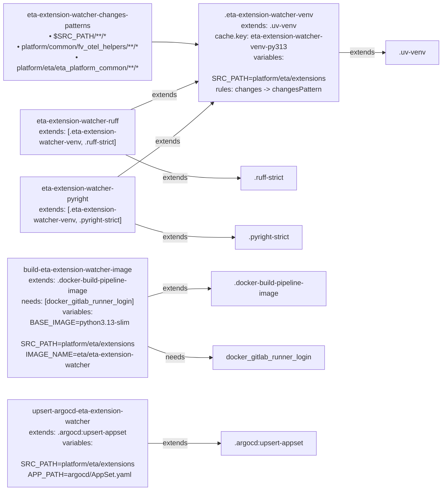

# Diagram: eta/extensions/.gitlab-ci.yml

> Auto-generated by Obscura crawlers

## Mermaid

### SVG

<svg id="container" width="1107.796875" xmlns="http://www.w3.org/2000/svg" class="flowchart" height="982" viewBox="0 0 1107.796875 982" role="graphics-document document" aria-roledescription="flowchart-v2"><g><marker id="container_flowchart-v2-pointEnd" class="marker flowchart-v2" viewBox="0 0 10 10" refX="5" refY="5" markerUnits="userSpaceOnUse" markerWidth="8" markerHeight="8" orient="auto"><path d="M 0 0 L 10 5 L 0 10 z" class="arrowMarkerPath" style="stroke-width: 1; stroke-dasharray: 1, 0;"></path></marker><marker id="container_flowchart-v2-pointStart" class="marker flowchart-v2" viewBox="0 0 10 10" refX="4.5" refY="5" markerUnits="userSpaceOnUse" markerWidth="8" markerHeight="8" orient="auto"><path d="M 0 5 L 10 10 L 10 0 z" class="arrowMarkerPath" style="stroke-width: 1; stroke-dasharray: 1, 0;"></path></marker><marker id="container_flowchart-v2-circleEnd" class="marker flowchart-v2" viewBox="0 0 10 10" refX="11" refY="5" markerUnits="userSpaceOnUse" markerWidth="11" markerHeight="11" orient="auto"><circle cx="5" cy="5" r="5" class="arrowMarkerPath" style="stroke-width: 1; stroke-dasharray: 1, 0;"></circle></marker><marker id="container_flowchart-v2-circleStart" class="marker flowchart-v2" viewBox="0 0 10 10" refX="-1" refY="5" markerUnits="userSpaceOnUse" markerWidth="11" markerHeight="11" orient="auto"><circle cx="5" cy="5" r="5" class="arrowMarkerPath" style="stroke-width: 1; stroke-dasharray: 1, 0;"></circle></marker><marker id="container_flowchart-v2-crossEnd" class="marker cross flowchart-v2" viewBox="0 0 11 11" refX="12" refY="5.2" markerUnits="userSpaceOnUse" markerWidth="11" markerHeight="11" orient="auto"><path d="M 1,1 l 9,9 M 10,1 l -9,9" class="arrowMarkerPath" style="stroke-width: 2; stroke-dasharray: 1, 0;"></path></marker><marker id="container_flowchart-v2-crossStart" class="marker cross flowchart-v2" viewBox="0 0 11 11" refX="-1" refY="5.2" markerUnits="userSpaceOnUse" markerWidth="11" markerHeight="11" orient="auto"><path d="M 1,1 l 9,9 M 10,1 l -9,9" class="arrowMarkerPath" style="stroke-width: 2; stroke-dasharray: 1, 0;"></path></marker><g class="root"><g class="clusters"></g><g class="edgePaths"><path d="M375.883,71L386.32,71C396.758,71,417.633,71,436.327,72.085C455.022,73.17,471.536,75.339,479.793,76.424L488.05,77.509" id="L_changesPattern_etaVenv_0" class="edge-thickness-normal edge-pattern-solid edge-thickness-normal edge-pattern-solid flowchart-link" style=";" data-edge="true" data-et="edge" data-id="L_changesPattern_etaVenv_0" data-points="W3sieCI6Mzc1Ljg4MjgxMjUsInkiOjcxfSx7IngiOjQzOC41MDc4MTI1LCJ5Ijo3MX0seyJ4Ijo0OTIuMDE1NjI1LCJ5Ijo3OC4wMzAwMjMwOTQ2ODgyMn1d" marker-end="url(#container_flowchart-v2-pointEnd)"></path><path d="M872.125,103L881.043,103C889.961,103,907.797,103,924.966,103C942.135,103,958.638,103,966.889,103L975.141,103" id="L_etaVenv_uvVenv_0" class="edge-thickness-normal edge-pattern-solid edge-thickness-normal edge-pattern-solid flowchart-link" style=";" data-edge="true" data-et="edge" data-id="L_etaVenv_uvVenv_0" data-points="W3sieCI6ODcyLjEyNSwieSI6MTAzfSx7IngiOjkyNS42MzI4MTI1LCJ5IjoxMDN9LHsieCI6OTc5LjE0MDYyNSwieSI6MTAzfV0=" marker-end="url(#container_flowchart-v2-pointEnd)"></path><path d="M326.5,210.175L345.168,204.312C363.836,198.45,401.172,186.725,428.118,178.415C455.065,170.105,471.622,165.211,479.901,162.764L488.18,160.316" id="L_ruffJob_etaVenv_0" class="edge-thickness-normal edge-pattern-solid edge-thickness-normal edge-pattern-solid flowchart-link" style=";" data-edge="true" data-et="edge" data-id="L_ruffJob_etaVenv_0" data-points="W3sieCI6MzI2LjUsInkiOjIxMC4xNzQ4NzE2Nzg5ODc2NH0seyJ4Ijo0MzguNTA3ODEyNSwieSI6MTc1fSx7IngiOjQ5Mi4wMTU2MjUsInkiOjE1OS4xODI0NDgwMzY5NTE0OH1d" marker-end="url(#container_flowchart-v2-pointEnd)"></path><path d="M326.5,310.089L345.168,318.574C363.836,327.059,401.172,344.03,448.638,352.515C496.104,361,553.701,361,582.499,361L611.297,361" id="L_ruffJob_ruffStrict_0" class="edge-thickness-normal edge-pattern-solid edge-thickness-normal edge-pattern-solid flowchart-link" style=";" data-edge="true" data-et="edge" data-id="L_ruffJob_ruffStrict_0" data-points="W3sieCI6MzI2LjUsInkiOjMxMC4wODkwMDE1MTcyNTQ3Nn0seyJ4Ijo0MzguNTA3ODEyNSwieSI6MzYxfSx7IngiOjYxNS4yOTY4NzUsInkiOjM2MX1d" marker-end="url(#container_flowchart-v2-pointEnd)"></path><path d="M303.87,364L326.309,350.833C348.749,337.667,393.628,311.333,439.4,280.732C485.171,250.131,531.834,215.263,555.165,197.829L578.497,180.394" id="L_pyrightJob_etaVenv_0" class="edge-thickness-normal edge-pattern-solid edge-thickness-normal edge-pattern-solid flowchart-link" style=";" data-edge="true" data-et="edge" data-id="L_pyrightJob_etaVenv_0" data-points="W3sieCI6MzAzLjg2OTY2MzI5MjI1MzUsInkiOjM2NH0seyJ4Ijo0MzguNTA3ODEyNSwieSI6Mjg1fSx7IngiOjU4MS43MDExNTA0MTIwODc5LCJ5IjoxNzh9XQ==" marker-end="url(#container_flowchart-v2-pointEnd)"></path><path d="M326.5,466.751L345.168,472.459C363.836,478.167,401.172,489.584,446.56,495.292C491.948,501,545.388,501,572.108,501L598.828,501" id="L_pyrightJob_pyrightStrict_0" class="edge-thickness-normal edge-pattern-solid edge-thickness-normal edge-pattern-solid flowchart-link" style=";" data-edge="true" data-et="edge" data-id="L_pyrightJob_pyrightStrict_0" data-points="W3sieCI6MzI2LjUsInkiOjQ2Ni43NTA3ODI4Mzg4ODA0N30seyJ4Ijo0MzguNTA3ODEyNSwieSI6NTAxfSx7IngiOjYwMi44MjgxMjUsInkiOjUwMX1d" marker-end="url(#container_flowchart-v2-pointEnd)"></path><path d="M385,629.824L393.918,627.686C402.836,625.549,420.672,621.275,447.85,619.137C475.029,617,511.549,617,529.81,617L548.07,617" id="L_buildImage_dockerBuildPipeline_0" class="edge-thickness-normal edge-pattern-solid edge-thickness-normal edge-pattern-solid flowchart-link" style=";" data-edge="true" data-et="edge" data-id="L_buildImage_dockerBuildPipeline_0" data-points="W3sieCI6Mzg1LCJ5Ijo2MjkuODIzNzcyNDc2MzUzNH0seyJ4Ijo0MzguNTA3ODEyNSwieSI6NjE3fSx7IngiOjU1Mi4wNzAzMTI1LCJ5Ijo2MTd9XQ==" marker-end="url(#container_flowchart-v2-pointEnd)"></path><path d="M385,721.734L393.918,723.945C402.836,726.156,420.672,730.578,448.005,732.789C475.339,735,512.169,735,530.585,735L549,735" id="L_buildImage_dockerLogin_0" class="edge-thickness-normal edge-pattern-solid edge-thickness-normal edge-pattern-solid flowchart-link" style=";" data-edge="true" data-et="edge" data-id="L_buildImage_dockerLogin_0" data-points="W3sieCI6Mzg1LCJ5Ijo3MjEuNzM0MDI4NDcyNzM3OH0seyJ4Ijo0MzguNTA3ODEyNSwieSI6NzM1fSx7IngiOjU1MywieSI6NzM1fV0=" marker-end="url(#container_flowchart-v2-pointEnd)"></path><path d="M366.492,899L378.495,899C390.497,899,414.503,899,448.195,899C481.888,899,525.268,899,546.958,899L568.648,899" id="L_upsertArgocd_argocdUpsert_0" class="edge-thickness-normal edge-pattern-solid edge-thickness-normal edge-pattern-solid flowchart-link" style=";" data-edge="true" data-et="edge" data-id="L_upsertArgocd_argocdUpsert_0" data-points="W3sieCI6MzY2LjQ5MjE4NzUsInkiOjg5OX0seyJ4Ijo0MzguNTA3ODEyNSwieSI6ODk5fSx7IngiOjU3Mi42NDg0Mzc1LCJ5Ijo4OTl9XQ==" marker-end="url(#container_flowchart-v2-pointEnd)"></path></g><g class="edgeLabels"><g class="edgeLabel"><g class="label" data-id="L_changesPattern_etaVenv_0" transform="translate(0, 0)"><foreignObject width="0" height="0">

</foreignObject></g></g><g class="edgeLabel" transform="translate(925.6328125, 103)"><g class="label" data-id="L_etaVenv_uvVenv_0" transform="translate(-28.5078125, -12)"><foreignObject width="57.015625" height="24">

extends

</foreignObject></g></g><g class="edgeLabel" transform="translate(409.12067, 184.22872)"><g class="label" data-id="L_ruffJob_etaVenv_0" transform="translate(-28.5078125, -12)"><foreignObject width="57.015625" height="24">

extends

</foreignObject></g></g><g class="edgeLabel" transform="translate(438.5078125, 361)"><g class="label" data-id="L_ruffJob_ruffStrict_0" transform="translate(-28.5078125, -12)"><foreignObject width="57.015625" height="24">

extends

</foreignObject></g></g><g class="edgeLabel" transform="translate(438.5078125, 285)"><g class="label" data-id="L_pyrightJob_etaVenv_0" transform="translate(-28.5078125, -12)"><foreignObject width="57.015625" height="24">

extends

</foreignObject></g></g><g class="edgeLabel" transform="translate(438.5078125, 501)"><g class="label" data-id="L_pyrightJob_pyrightStrict_0" transform="translate(-28.5078125, -12)"><foreignObject width="57.015625" height="24">

extends

</foreignObject></g></g><g class="edgeLabel" transform="translate(438.5078125, 617)"><g class="label" data-id="L_buildImage_dockerBuildPipeline_0" transform="translate(-28.5078125, -12)"><foreignObject width="57.015625" height="24">

extends

</foreignObject></g></g><g class="edgeLabel" transform="translate(438.5078125, 735)"><g class="label" data-id="L_buildImage_dockerLogin_0" transform="translate(-21.9296875, -12)"><foreignObject width="43.859375" height="24">

needs

</foreignObject></g></g><g class="edgeLabel" transform="translate(438.5078125, 899)"><g class="label" data-id="L_upsertArgocd_argocdUpsert_0" transform="translate(-28.5078125, -12)"><foreignObject width="57.015625" height="24">

extends

</foreignObject></g></g></g><g class="nodes"><g class="node default" id="flowchart-changesPattern-0" transform="translate(196.5, 71)"><rect class="basic label-container" style="" x="-179.3828125" y="-63" width="358.765625" height="126"></rect><g class="label" style="" transform="translate(-149.3828125, -48)"><rect></rect><foreignObject width="298.765625" height="96">

eta-extension-watcher-changes-patterns\n• $SRC_PATH/<strong>/*\n• platform/common/fv_otel_helpers/</strong>/<em>\n• platform/eta/eta_platform_common/**/</em>

</foreignObject></g></g><g class="node default" id="flowchart-uvVenv-1" transform="translate(1039.46875, 103)"><rect class="basic label-container" style="" x="-60.328125" y="-27" width="120.65625" height="54"></rect><g class="label" style="" transform="translate(-30.328125, -12)"><rect></rect><foreignObject width="60.65625" height="24">

.uv-venv

</foreignObject></g></g><g class="node default" id="flowchart-etaVenv-2" transform="translate(682.0703125, 103)"><rect class="basic label-container" style="" x="-190.0546875" y="-75" width="380.109375" height="150"></rect><g class="label" style="" transform="translate(-160.0546875, -60)"><rect></rect><foreignObject width="320.109375" height="120">

.eta-extension-watcher-venv\nextends: .uv-venv\ncache.key: eta-extension-watcher-venv-py313\nvariables:\n  SRC_PATH=platform/eta/extensions\nrules: changes -&gt; changesPattern

</foreignObject></g></g><g class="node default" id="flowchart-ruffStrict-3" transform="translate(682.0703125, 361)"><rect class="basic label-container" style="" x="-66.7734375" y="-27" width="133.546875" height="54"></rect><g class="label" style="" transform="translate(-36.7734375, -12)"><rect></rect><foreignObject width="73.546875" height="24">

.ruff-strict

</foreignObject></g></g><g class="node default" id="flowchart-pyrightStrict-4" transform="translate(682.0703125, 501)"><rect class="basic label-container" style="" x="-79.2421875" y="-27" width="158.484375" height="54"></rect><g class="label" style="" transform="translate(-49.2421875, -12)"><rect></rect><foreignObject width="98.484375" height="24">

.pyright-strict

</foreignObject></g></g><g class="node default" id="flowchart-ruffJob-5" transform="translate(196.5, 251)"><rect class="basic label-container" style="" x="-130" y="-63" width="260" height="126"></rect><g class="label" style="" transform="translate(-100, -48)"><rect></rect><foreignObject width="200" height="96">

eta-extension-watcher-ruff\nextends: [.eta-extension-watcher-venv, .ruff-strict]

</foreignObject></g></g><g class="node default" id="flowchart-pyrightJob-6" transform="translate(196.5, 427)"><rect class="basic label-container" style="" x="-130" y="-63" width="260" height="126"></rect><g class="label" style="" transform="translate(-100, -48)"><rect></rect><foreignObject width="200" height="96">

eta-extension-watcher-pyright\nextends: [.eta-extension-watcher-venv, .pyright-strict]

</foreignObject></g></g><g class="node default" id="flowchart-dockerBuildPipeline-7" transform="translate(682.0703125, 617)"><rect class="basic label-container" style="" x="-130" y="-39" width="260" height="78"></rect><g class="label" style="" transform="translate(-100, -24)"><rect></rect><foreignObject width="200" height="48">

.docker-build-pipeline-image

</foreignObject></g></g><g class="node default" id="flowchart-dockerLogin-8" transform="translate(682.0703125, 735)"><rect class="basic label-container" style="" x="-129.0703125" y="-27" width="258.140625" height="54"></rect><g class="label" style="" transform="translate(-99.0703125, -12)"><rect></rect><foreignObject width="198.140625" height="24">

docker_gitlab_runner_login

</foreignObject></g></g><g class="node default" id="flowchart-buildImage-9" transform="translate(196.5, 675)"><rect class="basic label-container" style="" x="-188.5" y="-99" width="377" height="198"></rect><g class="label" style="" transform="translate(-158.5, -84)"><rect></rect><foreignObject width="317" height="168">

build-eta-extension-watcher-image\nextends: .docker-build-pipeline-image\nneeds: [docker_gitlab_runner_login]\nvariables:\n  BASE_IMAGE=python3.13-slim\n  SRC_PATH=platform/eta/extensions\n  IMAGE_NAME=eta/eta-extension-watcher

</foreignObject></g></g><g class="node default" id="flowchart-argocdUpsert-10" transform="translate(682.0703125, 899)"><rect class="basic label-container" style="" x="-109.421875" y="-27" width="218.84375" height="54"></rect><g class="label" style="" transform="translate(-79.421875, -12)"><rect></rect><foreignObject width="158.84375" height="24">

.argocd:upsert-appset

</foreignObject></g></g><g class="node default" id="flowchart-upsertArgocd-11" transform="translate(196.5, 899)"><rect class="basic label-container" style="" x="-169.9921875" y="-75" width="339.984375" height="150"></rect><g class="label" style="" transform="translate(-139.9921875, -60)"><rect></rect><foreignObject width="279.984375" height="120">

upsert-argocd-eta-extension-watcher\nextends: .argocd:upsert-appset\nvariables:\n  SRC_PATH=platform/eta/extensions\n  APP_PATH=argocd/AppSet.yaml

</foreignObject></g></g></g></g></g></svg>
