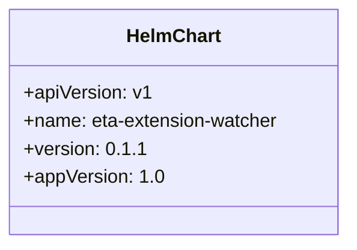

# Diagram: eta/extensions/helm/Chart.yaml

> Auto-generated by Obscura crawlers

## Mermaid

### SVG

<svg id="container" width="299.21875" xmlns="http://www.w3.org/2000/svg" class="classDiagram" height="208" viewBox="0 0 299.21875 208" role="graphics-document document" aria-roledescription="class"><g><defs><marker id="container_class-aggregationStart" class="marker aggregation class" refX="18" refY="7" markerWidth="190" markerHeight="240" orient="auto"><path d="M 18,7 L9,13 L1,7 L9,1 Z"></path></marker></defs><defs><marker id="container_class-aggregationEnd" class="marker aggregation class" refX="1" refY="7" markerWidth="20" markerHeight="28" orient="auto"><path d="M 18,7 L9,13 L1,7 L9,1 Z"></path></marker></defs><defs><marker id="container_class-extensionStart" class="marker extension class" refX="18" refY="7" markerWidth="190" markerHeight="240" orient="auto"><path d="M 1,7 L18,13 V 1 Z"></path></marker></defs><defs><marker id="container_class-extensionEnd" class="marker extension class" refX="1" refY="7" markerWidth="20" markerHeight="28" orient="auto"><path d="M 1,1 V 13 L18,7 Z"></path></marker></defs><defs><marker id="container_class-compositionStart" class="marker composition class" refX="18" refY="7" markerWidth="190" markerHeight="240" orient="auto"><path d="M 18,7 L9,13 L1,7 L9,1 Z"></path></marker></defs><defs><marker id="container_class-compositionEnd" class="marker composition class" refX="1" refY="7" markerWidth="20" markerHeight="28" orient="auto"><path d="M 18,7 L9,13 L1,7 L9,1 Z"></path></marker></defs><defs><marker id="container_class-dependencyStart" class="marker dependency class" refX="6" refY="7" markerWidth="190" markerHeight="240" orient="auto"><path d="M 5,7 L9,13 L1,7 L9,1 Z"></path></marker></defs><defs><marker id="container_class-dependencyEnd" class="marker dependency class" refX="13" refY="7" markerWidth="20" markerHeight="28" orient="auto"><path d="M 18,7 L9,13 L14,7 L9,1 Z"></path></marker></defs><defs><marker id="container_class-lollipopStart" class="marker lollipop class" refX="13" refY="7" markerWidth="190" markerHeight="240" orient="auto"><circle stroke="black" fill="transparent" cx="7" cy="7" r="6"></circle></marker></defs><defs><marker id="container_class-lollipopEnd" class="marker lollipop class" refX="1" refY="7" markerWidth="190" markerHeight="240" orient="auto"><circle stroke="black" fill="transparent" cx="7" cy="7" r="6"></circle></marker></defs><g class="root"><g class="clusters"></g><g class="edgePaths"></g><g class="edgeLabels"></g><g class="nodes"><g class="node default" id="classId-HelmChart-0" transform="translate(149.609375, 104)"><g class="basic label-container"><path d="M-141.609375 -96 L141.609375 -96 L141.609375 96 L-141.609375 96" stroke="none" stroke-width="0" fill="#ECECFF" style=""></path><path d="M-141.609375 -96 C-65.5137509611757 -96, 10.581873077648595 -96, 141.609375 -96 M-141.609375 -96 C-33.6846839699936 -96, 74.2400070600128 -96, 141.609375 -96 M141.609375 -96 C141.609375 -55.82942138677754, 141.609375 -15.65884277355508, 141.609375 96 M141.609375 -96 C141.609375 -23.9411325245716, 141.609375 48.1177349508568, 141.609375 96 M141.609375 96 C54.21223373789876 96, -33.18490752420249 96, -141.609375 96 M141.609375 96 C43.6333277807169 96, -54.342719438566206 96, -141.609375 96 M-141.609375 96 C-141.609375 43.967781972624365, -141.609375 -8.064436054751269, -141.609375 -96 M-141.609375 96 C-141.609375 22.640013787256635, -141.609375 -50.71997242548673, -141.609375 -96" stroke="#9370DB" stroke-width="1.3" fill="none" stroke-dasharray="0 0" style=""></path></g><g class="annotation-group text" transform="translate(0, -72)"></g><g class="label-group text" transform="translate(-38.703125, -72)"><g class="label" style="font-weight: bolder" transform="translate(0,-12)"><foreignObject width="77.40625" height="24">

HelmChart

</foreignObject></g></g><g class="members-group text" transform="translate(-129.609375, -24)"><g class="label" style="" transform="translate(0,-12)"><foreignObject width="107.203125" height="24">

+apiVersion: v1

</foreignObject></g><g class="label" style="" transform="translate(0,12)"><foreignObject width="220.515625" height="24">

+name: eta-extension-watcher

</foreignObject></g><g class="label" style="" transform="translate(0,36)"><foreignObject width="96.15625" height="24">

+version: 0.1.1

</foreignObject></g><g class="label" style="" transform="translate(0,60)"><foreignObject width="116.90625" height="24">

+appVersion: 1.0

</foreignObject></g></g><g class="methods-group text" transform="translate(-129.609375, 96)"></g><g class="divider" style=""><path d="M-141.609375 -48 C-70.56162698856409 -48, 0.4861210228718278 -48, 141.609375 -48 M-141.609375 -48 C-61.16511103177565 -48, 19.279152936448696 -48, 141.609375 -48" stroke="#9370DB" stroke-width="1.3" fill="none" stroke-dasharray="0 0" style=""></path></g><g class="divider" style=""><path d="M-141.609375 72 C-62.93633831469475 72, 15.736698370610497 72, 141.609375 72 M-141.609375 72 C-33.366841069011045 72, 74.87569286197791 72, 141.609375 72" stroke="#9370DB" stroke-width="1.3" fill="none" stroke-dasharray="0 0" style=""></path></g></g></g></g></g></svg>
