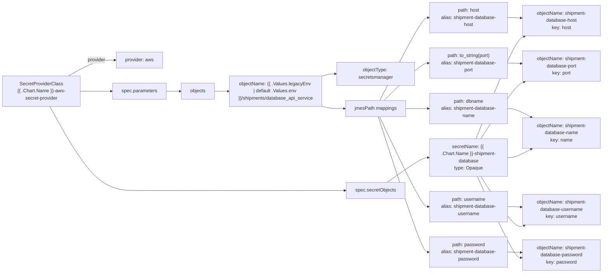

# Diagram: eta/extensions/helm/templates/aws-secret-provider.yaml

> Auto-generated by Obscura crawlers

## Mermaid

### SVG

<svg id="container" width="2027.921875" xmlns="http://www.w3.org/2000/svg" class="flowchart" height="840" viewBox="0 0 2027.921875 840" role="graphics-document document" aria-roledescription="flowchart-v2"><g><marker id="container_flowchart-v2-pointEnd" class="marker flowchart-v2" viewBox="0 0 10 10" refX="5" refY="5" markerUnits="userSpaceOnUse" markerWidth="8" markerHeight="8" orient="auto"><path d="M 0 0 L 10 5 L 0 10 z" class="arrowMarkerPath" style="stroke-width: 1; stroke-dasharray: 1, 0;"></path></marker><marker id="container_flowchart-v2-pointStart" class="marker flowchart-v2" viewBox="0 0 10 10" refX="4.5" refY="5" markerUnits="userSpaceOnUse" markerWidth="8" markerHeight="8" orient="auto"><path d="M 0 5 L 10 10 L 10 0 z" class="arrowMarkerPath" style="stroke-width: 1; stroke-dasharray: 1, 0;"></path></marker><marker id="container_flowchart-v2-circleEnd" class="marker flowchart-v2" viewBox="0 0 10 10" refX="11" refY="5" markerUnits="userSpaceOnUse" markerWidth="11" markerHeight="11" orient="auto"><circle cx="5" cy="5" r="5" class="arrowMarkerPath" style="stroke-width: 1; stroke-dasharray: 1, 0;"></circle></marker><marker id="container_flowchart-v2-circleStart" class="marker flowchart-v2" viewBox="0 0 10 10" refX="-1" refY="5" markerUnits="userSpaceOnUse" markerWidth="11" markerHeight="11" orient="auto"><circle cx="5" cy="5" r="5" class="arrowMarkerPath" style="stroke-width: 1; stroke-dasharray: 1, 0;"></circle></marker><marker id="container_flowchart-v2-crossEnd" class="marker cross flowchart-v2" viewBox="0 0 11 11" refX="12" refY="5.2" markerUnits="userSpaceOnUse" markerWidth="11" markerHeight="11" orient="auto"><path d="M 1,1 l 9,9 M 10,1 l -9,9" class="arrowMarkerPath" style="stroke-width: 2; stroke-dasharray: 1, 0;"></path></marker><marker id="container_flowchart-v2-crossStart" class="marker cross flowchart-v2" viewBox="0 0 11 11" refX="-1" refY="5.2" markerUnits="userSpaceOnUse" markerWidth="11" markerHeight="11" orient="auto"><path d="M 1,1 l 9,9 M 10,1 l -9,9" class="arrowMarkerPath" style="stroke-width: 2; stroke-dasharray: 1, 0;"></path></marker><g class="root"><g class="clusters"></g><g class="edgePaths"><path d="M229.047,218L244.816,209.167C260.586,200.333,292.125,182.667,318.395,173.833C344.664,165,365.664,165,376.164,165L386.664,165" id="L_SPC_PROVIDER_0" class="edge-thickness-normal edge-pattern-solid edge-thickness-normal edge-pattern-solid flowchart-link" style=";" data-edge="true" data-et="edge" data-id="L_SPC_PROVIDER_0" data-points="W3sieCI6MjI5LjA0Njc5OTg3OTgwNzY4LCJ5IjoyMTh9LHsieCI6MzIzLjY2NDA2MjUsInkiOjE2NX0seyJ4IjozOTAuNjY0MDYyNSwieSI6MTY1fV0=" marker-end="url(#container_flowchart-v2-pointEnd)"></path><path d="M268,269L277.277,269C286.555,269,305.109,269,322.997,269C340.885,269,358.107,269,366.717,269L375.328,269" id="L_SPC_PARAMS_0" class="edge-thickness-normal edge-pattern-solid edge-thickness-normal edge-pattern-solid flowchart-link" style=";" data-edge="true" data-et="edge" data-id="L_SPC_PARAMS_0" data-points="W3sieCI6MjY4LCJ5IjoyNjl9LHsieCI6MzIzLjY2NDA2MjUsInkiOjI2OX0seyJ4IjozNzkuMzI4MTI1LCJ5IjoyNjl9XQ==" marker-end="url(#container_flowchart-v2-pointEnd)"></path><path d="M559.141,269L563.307,269C567.474,269,575.807,269,583.474,269C591.141,269,598.141,269,601.641,269L605.141,269" id="L_PARAMS_OBJS_0" class="edge-thickness-normal edge-pattern-solid edge-thickness-normal edge-pattern-solid flowchart-link" style=";" data-edge="true" data-et="edge" data-id="L_PARAMS_OBJS_0" data-points="W3sieCI6NTU5LjE0MDYyNSwieSI6MjY5fSx7IngiOjU4NC4xNDA2MjUsInkiOjI2OX0seyJ4Ijo2MDkuMTQwNjI1LCJ5IjoyNjl9XQ==" marker-end="url(#container_flowchart-v2-pointEnd)"></path><path d="M722.094,269L726.26,269C730.427,269,738.76,269,746.427,269C754.094,269,761.094,269,764.594,269L768.094,269" id="L_OBJS_OBJ1_0" class="edge-thickness-normal edge-pattern-solid edge-thickness-normal edge-pattern-solid flowchart-link" style=";" data-edge="true" data-et="edge" data-id="L_OBJS_OBJ1_0" data-points="W3sieCI6NzIyLjA5Mzc1LCJ5IjoyNjl9LHsieCI6NzQ3LjA5Mzc1LCJ5IjoyNjl9LHsieCI6NzcyLjA5Mzc1LCJ5IjoyNjl9XQ==" marker-end="url(#container_flowchart-v2-pointEnd)"></path><path d="M1089.922,218.884L1094.089,217.57C1098.255,216.256,1106.589,213.628,1114.255,212.314C1121.922,211,1128.922,211,1132.422,211L1135.922,211" id="L_OBJ1_OBJTYPE_0" class="edge-thickness-normal edge-pattern-solid edge-thickness-normal edge-pattern-solid flowchart-link" style=";" data-edge="true" data-et="edge" data-id="L_OBJ1_OBJTYPE_0" data-points="W3sieCI6MTA4OS45MjE4NzUsInkiOjIxOC44ODQxMTcwNzIzNDE4N30seyJ4IjoxMTE0LjkyMTg3NSwieSI6MjExfSx7IngiOjExMzkuOTIxODc1LCJ5IjoyMTF9XQ==" marker-end="url(#container_flowchart-v2-pointEnd)"></path><path d="M1089.922,319.116L1094.089,320.43C1098.255,321.744,1106.589,324.372,1119.098,325.686C1131.607,327,1148.292,327,1156.634,327L1164.977,327" id="L_OBJ1_JMES_0" class="edge-thickness-normal edge-pattern-solid edge-thickness-normal edge-pattern-solid flowchart-link" style=";" data-edge="true" data-et="edge" data-id="L_OBJ1_JMES_0" data-points="W3sieCI6MTA4OS45MjE4NzUsInkiOjMxOS4xMTU4ODI5Mjc2NTgxfSx7IngiOjExMTQuOTIxODc1LCJ5IjozMjd9LHsieCI6MTE2OC45NzY1NjI1LCJ5IjozMjd9XQ==" marker-end="url(#container_flowchart-v2-pointEnd)"></path><path d="M1284.868,300L1308.211,257.833C1331.553,215.667,1378.237,131.333,1405.08,89.167C1431.922,47,1438.922,47,1442.422,47L1445.922,47" id="L_JMES_JP_HOST_0" class="edge-thickness-normal edge-pattern-solid edge-thickness-normal edge-pattern-solid flowchart-link" style=";" data-edge="true" data-et="edge" data-id="L_JMES_JP_HOST_0" data-points="W3sieCI6MTI4NC44NjgzMDM1NzE0Mjg3LCJ5IjozMDB9LHsieCI6MTQyNC45MjE4NzUsInkiOjQ3fSx7IngiOjE0NDkuOTIxODc1LCJ5Ijo0N31d" marker-end="url(#container_flowchart-v2-pointEnd)"></path><path d="M1299.815,300L1320.666,281.167C1341.517,262.333,1383.219,224.667,1407.571,205.833C1431.922,187,1438.922,187,1442.422,187L1445.922,187" id="L_JMES_JP_PORT_0" class="edge-thickness-normal edge-pattern-solid edge-thickness-normal edge-pattern-solid flowchart-link" style=";" data-edge="true" data-et="edge" data-id="L_JMES_JP_PORT_0" data-points="W3sieCI6MTI5OS44MTQ3MzIxNDI4NTcsInkiOjMwMH0seyJ4IjoxNDI0LjkyMTg3NSwieSI6MTg3fSx7IngiOjE0NDkuOTIxODc1LCJ5IjoxODd9XQ==" marker-end="url(#container_flowchart-v2-pointEnd)"></path><path d="M1370.867,327L1379.876,327C1388.885,327,1406.904,327,1419.413,327C1431.922,327,1438.922,327,1442.422,327L1445.922,327" id="L_JMES_JP_DB_0" class="edge-thickness-normal edge-pattern-solid edge-thickness-normal edge-pattern-solid flowchart-link" style=";" data-edge="true" data-et="edge" data-id="L_JMES_JP_DB_0" data-points="W3sieCI6MTM3MC44NjcxODc1LCJ5IjozMjd9LHsieCI6MTQyNC45MjE4NzUsInkiOjMyN30seyJ4IjoxNDQ5LjkyMTg3NSwieSI6MzI3fV0=" marker-end="url(#container_flowchart-v2-pointEnd)"></path><path d="M1284.254,354L1307.699,398.167C1331.143,442.333,1378.033,530.667,1404.977,574.833C1431.922,619,1438.922,619,1442.422,619L1445.922,619" id="L_JMES_JP_USER_0" class="edge-thickness-normal edge-pattern-solid edge-thickness-normal edge-pattern-solid flowchart-link" style=";" data-edge="true" data-et="edge" data-id="L_JMES_JP_USER_0" data-points="W3sieCI6MTI4NC4yNTQwNjY3ODA4MjE5LCJ5IjozNTR9LHsieCI6MTQyNC45MjE4NzUsInkiOjYxOX0seyJ4IjoxNDQ5LjkyMTg3NSwieSI6NjE5fV0=" marker-end="url(#container_flowchart-v2-pointEnd)"></path><path d="M1279.348,354L1303.61,423.5C1327.872,493,1376.397,632,1404.159,701.5C1431.922,771,1438.922,771,1442.422,771L1445.922,771" id="L_JMES_JP_PASS_0" class="edge-thickness-normal edge-pattern-solid edge-thickness-normal edge-pattern-solid flowchart-link" style=";" data-edge="true" data-et="edge" data-id="L_JMES_JP_PASS_0" data-points="W3sieCI6MTI3OS4zNDc1NTA2NzU2NzU2LCJ5IjozNTR9LHsieCI6MTQyNC45MjE4NzUsInkiOjc3MX0seyJ4IjoxNDQ5LjkyMTg3NSwieSI6NzcxfV0=" marker-end="url(#container_flowchart-v2-pointEnd)"></path><path d="M168.743,320L194.563,362.833C220.383,405.667,272.024,491.333,322.106,534.167C372.188,577,420.711,577,464.124,577C507.536,577,545.839,577,578.569,577C611.299,577,638.458,577,665.617,577C692.776,577,719.935,577,764.167,577C808.398,577,869.703,577,931.008,577C992.313,577,1053.617,577,1093.092,577C1132.568,577,1150.214,577,1159.036,577L1167.859,577" id="L_SPC_SECRETOBJ_0" class="edge-thickness-normal edge-pattern-solid edge-thickness-normal edge-pattern-solid flowchart-link" style=";" data-edge="true" data-et="edge" data-id="L_SPC_SECRETOBJ_0" data-points="W3sieCI6MTY4Ljc0MzA3NTI4NDA5MDksInkiOjMyMH0seyJ4IjozMjMuNjY0MDYyNSwieSI6NTc3fSx7IngiOjQ2OS4yMzQzNzUsInkiOjU3N30seyJ4Ijo1ODQuMTQwNjI1LCJ5Ijo1Nzd9LHsieCI6NjY1LjYxNzE4NzUsInkiOjU3N30seyJ4Ijo3NDcuMDkzNzUsInkiOjU3N30seyJ4Ijo5MzEuMDA3ODEyNSwieSI6NTc3fSx7IngiOjExMTQuOTIxODc1LCJ5Ijo1Nzd9LHsieCI6MTE3MS44NTkzNzUsInkiOjU3N31d" marker-end="url(#container_flowchart-v2-pointEnd)"></path><path d="M1307.967,550L1327.46,536.167C1346.952,522.333,1385.937,494.667,1408.929,480.833C1431.922,467,1438.922,467,1442.422,467L1445.922,467" id="L_SECRETOBJ_SECRET_0" class="edge-thickness-normal edge-pattern-solid edge-thickness-normal edge-pattern-solid flowchart-link" style=";" data-edge="true" data-et="edge" data-id="L_SECRETOBJ_SECRET_0" data-points="W3sieCI6MTMwNy45NjczMjk1NDU0NTQ1LCJ5Ijo1NTB9LHsieCI6MTQyNC45MjE4NzUsInkiOjQ2N30seyJ4IjoxNDQ5LjkyMTg3NSwieSI6NDY3fV0=" marker-end="url(#container_flowchart-v2-pointEnd)"></path><path d="M1602.508,416L1624.577,366.167C1646.646,316.333,1690.784,216.667,1721.273,163.574C1751.762,110.481,1768.602,103.963,1777.022,100.703L1785.442,97.444" id="L_SECRET_SD_HOST_0" class="edge-thickness-normal edge-pattern-solid edge-thickness-normal edge-pattern-solid flowchart-link" style=";" data-edge="true" data-et="edge" data-id="L_SECRET_SD_HOST_0" data-points="W3sieCI6MTYwMi41MDc1ODkyODU3MTQyLCJ5Ijo0MTZ9LHsieCI6MTczNC45MjE4NzUsInkiOjExN30seyJ4IjoxNzg5LjE3MTg3NSwieSI6OTZ9XQ==" marker-end="url(#container_flowchart-v2-pointEnd)"></path><path d="M1617.565,416L1637.124,389.5C1656.684,363,1695.803,310,1723.782,280.241C1751.762,250.481,1768.602,243.963,1777.022,240.703L1785.442,237.444" id="L_SECRET_SD_PORT_0" class="edge-thickness-normal edge-pattern-solid edge-thickness-normal edge-pattern-solid flowchart-link" style=";" data-edge="true" data-et="edge" data-id="L_SECRET_SD_PORT_0" data-points="W3sieCI6MTYxNy41NjQ3MzIxNDI4NTcsInkiOjQxNn0seyJ4IjoxNzM0LjkyMTg3NSwieSI6MjU3fSx7IngiOjE3ODkuMTcxODc1LCJ5IjoyMzZ9XQ==" marker-end="url(#container_flowchart-v2-pointEnd)"></path><path d="M1709.922,467L1714.089,467C1718.255,467,1726.589,467,1737.16,464.108C1747.731,461.215,1760.539,455.431,1766.943,452.539L1773.348,449.646" id="L_SECRET_SD_NAME_0" class="edge-thickness-normal edge-pattern-solid edge-thickness-normal edge-pattern-solid flowchart-link" style=";" data-edge="true" data-et="edge" data-id="L_SECRET_SD_NAME_0" data-points="W3sieCI6MTcwOS45MjE4NzUsInkiOjQ2N30seyJ4IjoxNzM0LjkyMTg3NSwieSI6NDY3fSx7IngiOjE3NzYuOTkzMzAzNTcxNDI4NywieSI6NDQ4fV0=" marker-end="url(#container_flowchart-v2-pointEnd)"></path><path d="M1614.593,518L1634.648,547.5C1654.703,577,1694.812,636,1720.125,663.261C1745.438,690.522,1755.953,686.045,1761.211,683.806L1766.469,681.567" id="L_SECRET_SD_USER_0" class="edge-thickness-normal edge-pattern-solid edge-thickness-normal edge-pattern-solid flowchart-link" style=";" data-edge="true" data-et="edge" data-id="L_SECRET_SD_USER_0" data-points="W3sieCI6MTYxNC41OTI5Mjc2MzE1NzksInkiOjUxOH0seyJ4IjoxNzM0LjkyMTg3NSwieSI6Njk1fSx7IngiOjE3NzAuMTQ5MTQ3NzI3MjcyNywieSI6NjgwfV0=" marker-end="url(#container_flowchart-v2-pointEnd)"></path><path d="M1604.32,518L1626.087,563.5C1647.854,609,1691.388,700,1716.656,745.274C1741.925,790.548,1748.927,790.096,1752.429,789.871L1755.93,789.645" id="L_SECRET_SD_PASS_0" class="edge-thickness-normal edge-pattern-solid edge-thickness-normal edge-pattern-solid flowchart-link" style=";" data-edge="true" data-et="edge" data-id="L_SECRET_SD_PASS_0" data-points="W3sieCI6MTYwNC4zMjAwMjMxNDgxNDgsInkiOjUxOH0seyJ4IjoxNzM0LjkyMTg3NSwieSI6NzkxfSx7IngiOjE3NTkuOTIxODc1LCJ5Ijo3ODkuMzg3MDk2Nzc0MTkzNX1d" marker-end="url(#container_flowchart-v2-pointEnd)"></path><path d="M1709.922,47L1714.089,47C1718.255,47,1726.589,47,1734.257,47.226C1741.925,47.452,1748.927,47.904,1752.429,48.129L1755.93,48.355" id="L_JP_HOST_SD_HOST_0" class="edge-thickness-normal edge-pattern-solid edge-thickness-normal edge-pattern-solid flowchart-link" style=";" data-edge="true" data-et="edge" data-id="L_JP_HOST_SD_HOST_0" data-points="W3sieCI6MTcwOS45MjE4NzUsInkiOjQ3fSx7IngiOjE3MzQuOTIxODc1LCJ5Ijo0N30seyJ4IjoxNzU5LjkyMTg3NSwieSI6NDguNjEyOTAzMjI1ODA2NDV9XQ==" marker-end="url(#container_flowchart-v2-pointEnd)"></path><path d="M1709.922,187L1714.089,187C1718.255,187,1726.589,187,1734.257,187.226C1741.925,187.452,1748.927,187.904,1752.429,188.129L1755.93,188.355" id="L_JP_PORT_SD_PORT_0" class="edge-thickness-normal edge-pattern-solid edge-thickness-normal edge-pattern-solid flowchart-link" style=";" data-edge="true" data-et="edge" data-id="L_JP_PORT_SD_PORT_0" data-points="W3sieCI6MTcwOS45MjE4NzUsInkiOjE4N30seyJ4IjoxNzM0LjkyMTg3NSwieSI6MTg3fSx7IngiOjE3NTkuOTIxODc1LCJ5IjoxODguNjEyOTAzMjI1ODA2NDZ9XQ==" marker-end="url(#container_flowchart-v2-pointEnd)"></path><path d="M1709.922,327L1714.089,327C1718.255,327,1726.589,327,1737.16,329.892C1747.731,332.785,1760.539,338.569,1766.943,341.461L1773.348,344.354" id="L_JP_DB_SD_NAME_0" class="edge-thickness-normal edge-pattern-solid edge-thickness-normal edge-pattern-solid flowchart-link" style=";" data-edge="true" data-et="edge" data-id="L_JP_DB_SD_NAME_0" data-points="W3sieCI6MTcwOS45MjE4NzUsInkiOjMyN30seyJ4IjoxNzM0LjkyMTg3NSwieSI6MzI3fSx7IngiOjE3NzYuOTkzMzAzNTcxNDI4NywieSI6MzQ2fV0=" marker-end="url(#container_flowchart-v2-pointEnd)"></path><path d="M1709.922,619L1714.089,619C1718.255,619,1726.589,619,1734.257,619.226C1741.925,619.452,1748.927,619.904,1752.429,620.129L1755.93,620.355" id="L_JP_USER_SD_USER_0" class="edge-thickness-normal edge-pattern-solid edge-thickness-normal edge-pattern-solid flowchart-link" style=";" data-edge="true" data-et="edge" data-id="L_JP_USER_SD_USER_0" data-points="W3sieCI6MTcwOS45MjE4NzUsInkiOjYxOX0seyJ4IjoxNzM0LjkyMTg3NSwieSI6NjE5fSx7IngiOjE3NTkuOTIxODc1LCJ5Ijo2MjAuNjEyOTAzMjI1ODA2NX1d" marker-end="url(#container_flowchart-v2-pointEnd)"></path><path d="M1709.922,771L1714.089,771C1718.255,771,1726.589,771,1734.257,771.226C1741.925,771.452,1748.927,771.904,1752.429,772.129L1755.93,772.355" id="L_JP_PASS_SD_PASS_0" class="edge-thickness-normal edge-pattern-solid edge-thickness-normal edge-pattern-solid flowchart-link" style=";" data-edge="true" data-et="edge" data-id="L_JP_PASS_SD_PASS_0" data-points="W3sieCI6MTcwOS45MjE4NzUsInkiOjc3MX0seyJ4IjoxNzM0LjkyMTg3NSwieSI6NzcxfSx7IngiOjE3NTkuOTIxODc1LCJ5Ijo3NzIuNjEyOTAzMjI1ODA2NX1d" marker-end="url(#container_flowchart-v2-pointEnd)"></path></g><g class="edgeLabels"><g class="edgeLabel" transform="translate(323.6640625, 165)"><g class="label" data-id="L_SPC_PROVIDER_0" transform="translate(-30.6640625, -12)"><foreignObject width="61.328125" height="24">

provider

</foreignObject></g></g><g class="edgeLabel"><g class="label" data-id="L_SPC_PARAMS_0" transform="translate(0, 0)"><foreignObject width="0" height="0">

</foreignObject></g></g><g class="edgeLabel"><g class="label" data-id="L_PARAMS_OBJS_0" transform="translate(0, 0)"><foreignObject width="0" height="0">

</foreignObject></g></g><g class="edgeLabel"><g class="label" data-id="L_OBJS_OBJ1_0" transform="translate(0, 0)"><foreignObject width="0" height="0">

</foreignObject></g></g><g class="edgeLabel"><g class="label" data-id="L_OBJ1_OBJTYPE_0" transform="translate(0, 0)"><foreignObject width="0" height="0">

</foreignObject></g></g><g class="edgeLabel"><g class="label" data-id="L_OBJ1_JMES_0" transform="translate(0, 0)"><foreignObject width="0" height="0">

</foreignObject></g></g><g class="edgeLabel"><g class="label" data-id="L_JMES_JP_HOST_0" transform="translate(0, 0)"><foreignObject width="0" height="0">

</foreignObject></g></g><g class="edgeLabel"><g class="label" data-id="L_JMES_JP_PORT_0" transform="translate(0, 0)"><foreignObject width="0" height="0">

</foreignObject></g></g><g class="edgeLabel"><g class="label" data-id="L_JMES_JP_DB_0" transform="translate(0, 0)"><foreignObject width="0" height="0">

</foreignObject></g></g><g class="edgeLabel"><g class="label" data-id="L_JMES_JP_USER_0" transform="translate(0, 0)"><foreignObject width="0" height="0">

</foreignObject></g></g><g class="edgeLabel"><g class="label" data-id="L_JMES_JP_PASS_0" transform="translate(0, 0)"><foreignObject width="0" height="0">

</foreignObject></g></g><g class="edgeLabel"><g class="label" data-id="L_SPC_SECRETOBJ_0" transform="translate(0, 0)"><foreignObject width="0" height="0">

</foreignObject></g></g><g class="edgeLabel"><g class="label" data-id="L_SECRETOBJ_SECRET_0" transform="translate(0, 0)"><foreignObject width="0" height="0">

</foreignObject></g></g><g class="edgeLabel"><g class="label" data-id="L_SECRET_SD_HOST_0" transform="translate(0, 0)"><foreignObject width="0" height="0">

</foreignObject></g></g><g class="edgeLabel"><g class="label" data-id="L_SECRET_SD_PORT_0" transform="translate(0, 0)"><foreignObject width="0" height="0">

</foreignObject></g></g><g class="edgeLabel"><g class="label" data-id="L_SECRET_SD_NAME_0" transform="translate(0, 0)"><foreignObject width="0" height="0">

</foreignObject></g></g><g class="edgeLabel"><g class="label" data-id="L_SECRET_SD_USER_0" transform="translate(0, 0)"><foreignObject width="0" height="0">

</foreignObject></g></g><g class="edgeLabel"><g class="label" data-id="L_SECRET_SD_PASS_0" transform="translate(0, 0)"><foreignObject width="0" height="0">

</foreignObject></g></g><g class="edgeLabel"><g class="label" data-id="L_JP_HOST_SD_HOST_0" transform="translate(0, 0)"><foreignObject width="0" height="0">

</foreignObject></g></g><g class="edgeLabel"><g class="label" data-id="L_JP_PORT_SD_PORT_0" transform="translate(0, 0)"><foreignObject width="0" height="0">

</foreignObject></g></g><g class="edgeLabel"><g class="label" data-id="L_JP_DB_SD_NAME_0" transform="translate(0, 0)"><foreignObject width="0" height="0">

</foreignObject></g></g><g class="edgeLabel"><g class="label" data-id="L_JP_USER_SD_USER_0" transform="translate(0, 0)"><foreignObject width="0" height="0">

</foreignObject></g></g><g class="edgeLabel"><g class="label" data-id="L_JP_PASS_SD_PASS_0" transform="translate(0, 0)"><foreignObject width="0" height="0">

</foreignObject></g></g></g><g class="nodes"><g class="node default" id="flowchart-SPC-0" transform="translate(138, 269)"><rect class="basic label-container" style="" x="-130" y="-51" width="260" height="102"></rect><g class="label" style="" transform="translate(-100, -36)"><rect></rect><foreignObject width="200" height="72">

SecretProviderClass\n{{ .Chart.Name }}-aws-secret-provider

</foreignObject></g></g><g class="node default" id="flowchart-PROVIDER-2" transform="translate(469.234375, 165)"><rect class="basic label-container" style="" x="-78.5703125" y="-27" width="157.140625" height="54"></rect><g class="label" style="" transform="translate(-48.5703125, -12)"><rect></rect><foreignObject width="97.140625" height="24">

provider: aws

</foreignObject></g></g><g class="node default" id="flowchart-PARAMS-4" transform="translate(469.234375, 269)"><rect class="basic label-container" style="" x="-89.90625" y="-27" width="179.8125" height="54"></rect><g class="label" style="" transform="translate(-59.90625, -12)"><rect></rect><foreignObject width="119.8125" height="24">

spec.parameters

</foreignObject></g></g><g class="node default" id="flowchart-OBJS-6" transform="translate(665.6171875, 269)"><rect class="basic label-container" style="" x="-56.4765625" y="-27" width="112.953125" height="54"></rect><g class="label" style="" transform="translate(-26.4765625, -12)"><rect></rect><foreignObject width="52.953125" height="24">

objects

</foreignObject></g></g><g class="node default" id="flowchart-OBJ1-8" transform="translate(931.0078125, 269)"><rect class="basic label-container" style="" x="-158.9140625" y="-51" width="317.828125" height="102"></rect><g class="label" style="" transform="translate(-128.9140625, -36)"><rect></rect><foreignObject width="257.828125" height="72">

objectName: {{ .Values.legacyEnv | default .Values.env }}/shipments/database_api_service

</foreignObject></g></g><g class="node default" id="flowchart-OBJTYPE-10" transform="translate(1269.921875, 211)"><rect class="basic label-container" style="" x="-130" y="-39" width="260" height="78"></rect><g class="label" style="" transform="translate(-100, -24)"><rect></rect><foreignObject width="200" height="48">

objectType: secretsmanager

</foreignObject></g></g><g class="node default" id="flowchart-JMES-12" transform="translate(1269.921875, 327)"><rect class="basic label-container" style="" x="-100.9453125" y="-27" width="201.890625" height="54"></rect><g class="label" style="" transform="translate(-70.9453125, -12)"><rect></rect><foreignObject width="141.890625" height="24">

jmesPath mappings

</foreignObject></g></g><g class="node default" id="flowchart-JP_HOST-14" transform="translate(1579.921875, 47)"><rect class="basic label-container" style="" x="-130" y="-39" width="260" height="78"></rect><g class="label" style="" transform="translate(-100, -24)"><rect></rect><foreignObject width="200" height="48">

path: host\nalias: shipment-database-host

</foreignObject></g></g><g class="node default" id="flowchart-JP_PORT-16" transform="translate(1579.921875, 187)"><rect class="basic label-container" style="" x="-130" y="-51" width="260" height="102"></rect><g class="label" style="" transform="translate(-100, -36)"><rect></rect><foreignObject width="200" height="72">

path: to_string(port)\nalias: shipment-database-port

</foreignObject></g></g><g class="node default" id="flowchart-JP_DB-18" transform="translate(1579.921875, 327)"><rect class="basic label-container" style="" x="-130" y="-39" width="260" height="78"></rect><g class="label" style="" transform="translate(-100, -24)"><rect></rect><foreignObject width="200" height="48">

path: dbname\nalias: shipment-database-name

</foreignObject></g></g><g class="node default" id="flowchart-JP_USER-20" transform="translate(1579.921875, 619)"><rect class="basic label-container" style="" x="-130" y="-51" width="260" height="102"></rect><g class="label" style="" transform="translate(-100, -36)"><rect></rect><foreignObject width="200" height="72">

path: username\nalias: shipment-database-username

</foreignObject></g></g><g class="node default" id="flowchart-JP_PASS-22" transform="translate(1579.921875, 771)"><rect class="basic label-container" style="" x="-130" y="-51" width="260" height="102"></rect><g class="label" style="" transform="translate(-100, -36)"><rect></rect><foreignObject width="200" height="72">

path: password\nalias: shipment-database-password

</foreignObject></g></g><g class="node default" id="flowchart-SECRETOBJ-24" transform="translate(1269.921875, 577)"><rect class="basic label-container" style="" x="-98.0625" y="-27" width="196.125" height="54"></rect><g class="label" style="" transform="translate(-68.0625, -12)"><rect></rect><foreignObject width="136.125" height="24">

spec.secretObjects

</foreignObject></g></g><g class="node default" id="flowchart-SECRET-26" transform="translate(1579.921875, 467)"><rect class="basic label-container" style="" x="-130" y="-51" width="260" height="102"></rect><g class="label" style="" transform="translate(-100, -36)"><rect></rect><foreignObject width="200" height="72">

secretName: {{ .Chart.Name }}-shipment-database\ntype: Opaque

</foreignObject></g></g><g class="node default" id="flowchart-SD_HOST-28" transform="translate(1889.921875, 57)"><rect class="basic label-container" style="" x="-130" y="-39" width="260" height="78"></rect><g class="label" style="" transform="translate(-100, -24)"><rect></rect><foreignObject width="200" height="48">

objectName: shipment-database-host\nkey: host

</foreignObject></g></g><g class="node default" id="flowchart-SD_PORT-30" transform="translate(1889.921875, 197)"><rect class="basic label-container" style="" x="-130" y="-39" width="260" height="78"></rect><g class="label" style="" transform="translate(-100, -24)"><rect></rect><foreignObject width="200" height="48">

objectName: shipment-database-port\nkey: port

</foreignObject></g></g><g class="node default" id="flowchart-SD_NAME-32" transform="translate(1889.921875, 397)"><rect class="basic label-container" style="" x="-130" y="-51" width="260" height="102"></rect><g class="label" style="" transform="translate(-100, -36)"><rect></rect><foreignObject width="200" height="72">

objectName: shipment-database-name\nkey: name

</foreignObject></g></g><g class="node default" id="flowchart-SD_USER-34" transform="translate(1889.921875, 629)"><rect class="basic label-container" style="" x="-130" y="-51" width="260" height="102"></rect><g class="label" style="" transform="translate(-100, -36)"><rect></rect><foreignObject width="200" height="72">

objectName: shipment-database-username\nkey: username

</foreignObject></g></g><g class="node default" id="flowchart-SD_PASS-36" transform="translate(1889.921875, 781)"><rect class="basic label-container" style="" x="-130" y="-51" width="260" height="102"></rect><g class="label" style="" transform="translate(-100, -36)"><rect></rect><foreignObject width="200" height="72">

objectName: shipment-database-password\nkey: password

</foreignObject></g></g></g></g></g></svg>
