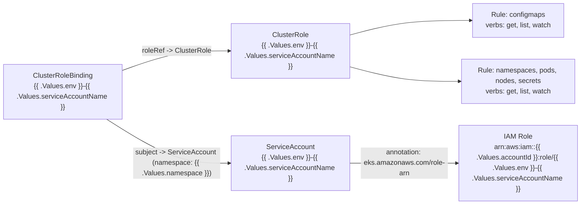

# Diagram: eta/extensions/helm/templates/serviceaccount.yaml

> Auto-generated by Obscura crawlers

## Mermaid

### SVG

<svg id="container" width="1322.015625" xmlns="http://www.w3.org/2000/svg" class="flowchart" height="470" viewBox="0 0 1322.015625 470" role="graphics-document document" aria-roledescription="flowchart-v2"><g><marker id="container_flowchart-v2-pointEnd" class="marker flowchart-v2" viewBox="0 0 10 10" refX="5" refY="5" markerUnits="userSpaceOnUse" markerWidth="8" markerHeight="8" orient="auto"><path d="M 0 0 L 10 5 L 0 10 z" class="arrowMarkerPath" style="stroke-width: 1; stroke-dasharray: 1, 0;"></path></marker><marker id="container_flowchart-v2-pointStart" class="marker flowchart-v2" viewBox="0 0 10 10" refX="4.5" refY="5" markerUnits="userSpaceOnUse" markerWidth="8" markerHeight="8" orient="auto"><path d="M 0 5 L 10 10 L 10 0 z" class="arrowMarkerPath" style="stroke-width: 1; stroke-dasharray: 1, 0;"></path></marker><marker id="container_flowchart-v2-circleEnd" class="marker flowchart-v2" viewBox="0 0 10 10" refX="11" refY="5" markerUnits="userSpaceOnUse" markerWidth="11" markerHeight="11" orient="auto"><circle cx="5" cy="5" r="5" class="arrowMarkerPath" style="stroke-width: 1; stroke-dasharray: 1, 0;"></circle></marker><marker id="container_flowchart-v2-circleStart" class="marker flowchart-v2" viewBox="0 0 10 10" refX="-1" refY="5" markerUnits="userSpaceOnUse" markerWidth="11" markerHeight="11" orient="auto"><circle cx="5" cy="5" r="5" class="arrowMarkerPath" style="stroke-width: 1; stroke-dasharray: 1, 0;"></circle></marker><marker id="container_flowchart-v2-crossEnd" class="marker cross flowchart-v2" viewBox="0 0 11 11" refX="12" refY="5.2" markerUnits="userSpaceOnUse" markerWidth="11" markerHeight="11" orient="auto"><path d="M 1,1 l 9,9 M 10,1 l -9,9" class="arrowMarkerPath" style="stroke-width: 2; stroke-dasharray: 1, 0;"></path></marker><marker id="container_flowchart-v2-crossStart" class="marker cross flowchart-v2" viewBox="0 0 11 11" refX="-1" refY="5.2" markerUnits="userSpaceOnUse" markerWidth="11" markerHeight="11" orient="auto"><path d="M 1,1 l 9,9 M 10,1 l -9,9" class="arrowMarkerPath" style="stroke-width: 2; stroke-dasharray: 1, 0;"></path></marker><g class="root"><g class="clusters"></g><g class="edgePaths"><path d="M795.344,375L816.177,375C837.01,375,878.677,375,919.677,375C960.677,375,1001.01,375,1021.177,375L1041.344,375" id="L_SA_IAM_0" class="edge-thickness-normal edge-pattern-solid edge-thickness-normal edge-pattern-solid flowchart-link" style=";" data-edge="true" data-et="edge" data-id="L_SA_IAM_0" data-points="W3sieCI6Nzk1LjM0Mzc1LCJ5IjozNzV9LHsieCI6OTIwLjM0Mzc1LCJ5IjozNzV9LHsieCI6MTA0NS4zNDM3NSwieSI6Mzc1fV0=" marker-end="url(#container_flowchart-v2-pointEnd)"></path><path d="M795.344,80.74L816.177,75.117C837.01,69.493,878.677,58.247,924.432,52.623C970.188,47,1020.031,47,1044.953,47L1069.875,47" id="L_CR_R1_0" class="edge-thickness-normal edge-pattern-solid edge-thickness-normal edge-pattern-solid flowchart-link" style=";" data-edge="true" data-et="edge" data-id="L_CR_R1_0" data-points="W3sieCI6Nzk1LjM0Mzc1LCJ5Ijo4MC43NDAwMjEwODc1MTMxOH0seyJ4Ijo5MjAuMzQzNzUsInkiOjQ3fSx7IngiOjEwNzMuODc1LCJ5Ijo0N31d" marker-end="url(#container_flowchart-v2-pointEnd)"></path><path d="M795.344,153.26L816.177,158.883C837.01,164.507,878.677,175.753,920.4,181.377C962.122,187,1003.901,187,1024.79,187L1045.68,187" id="L_CR_R2_0" class="edge-thickness-normal edge-pattern-solid edge-thickness-normal edge-pattern-solid flowchart-link" style=";" data-edge="true" data-et="edge" data-id="L_CR_R2_0" data-points="W3sieCI6Nzk1LjM0Mzc1LCJ5IjoxNTMuMjU5OTc4OTEyNDg2ODJ9LHsieCI6OTIwLjM0Mzc1LCJ5IjoxODd9LHsieCI6MTA0OS42Nzk2ODc1LCJ5IjoxODd9XQ==" marker-end="url(#container_flowchart-v2-pointEnd)"></path><path d="M276.672,162.308L297.505,154.757C318.339,147.205,360.005,132.103,401.005,124.551C442.005,117,482.339,117,502.505,117L522.672,117" id="L_CRB_CR_0" class="edge-thickness-normal edge-pattern-solid edge-thickness-normal edge-pattern-solid flowchart-link" style=";" data-edge="true" data-et="edge" data-id="L_CRB_CR_0" data-points="W3sieCI6Mjc2LjY3MTg3NSwieSI6MTYyLjMwODAyODMxNzUxNzd9LHsieCI6NDAxLjY3MTg3NSwieSI6MTE3fSx7IngiOjUyNi42NzE4NzUsInkiOjExN31d" marker-end="url(#container_flowchart-v2-pointEnd)"></path><path d="M241.959,274L268.578,290.833C295.197,307.667,348.434,341.333,395.22,358.167C442.005,375,482.339,375,502.505,375L522.672,375" id="L_CRB_SA_0" class="edge-thickness-normal edge-pattern-solid edge-thickness-normal edge-pattern-solid flowchart-link" style=";" data-edge="true" data-et="edge" data-id="L_CRB_SA_0" data-points="W3sieCI6MjQxLjk1ODg4OTEwMDYwOTc1LCJ5IjoyNzR9LHsieCI6NDAxLjY3MTg3NSwieSI6Mzc1fSx7IngiOjUyNi42NzE4NzUsInkiOjM3NX1d" marker-end="url(#container_flowchart-v2-pointEnd)"></path></g><g class="edgeLabels"><g class="edgeLabel" transform="translate(920.34375, 375)"><g class="label" data-id="L_SA_IAM_0" transform="translate(-100, -36)"><foreignObject width="200" height="72">

annotation: eks.amazonaws.com/role-arn

</foreignObject></g></g><g class="edgeLabel"><g class="label" data-id="L_CR_R1_0" transform="translate(0, 0)"><foreignObject width="0" height="0">

</foreignObject></g></g><g class="edgeLabel"><g class="label" data-id="L_CR_R2_0" transform="translate(0, 0)"><foreignObject width="0" height="0">

</foreignObject></g></g><g class="edgeLabel" transform="translate(401.671875, 117)"><g class="label" data-id="L_CRB_CR_0" transform="translate(-78.8203125, -12)"><foreignObject width="157.640625" height="24">

roleRef -&gt; ClusterRole

</foreignObject></g></g><g class="edgeLabel" transform="translate(401.671875, 375)"><g class="label" data-id="L_CRB_SA_0" transform="translate(-100, -36)"><foreignObject width="200" height="72">

subject -&gt; ServiceAccount (namespace: {{ .Values.namespace }})

</foreignObject></g></g></g><g class="nodes"><g class="node default" id="flowchart-SA-0" transform="translate(661.0078125, 375)"><rect class="basic label-container" style="" x="-134.3359375" y="-63" width="268.671875" height="126"></rect><g class="label" style="" transform="translate(-104.3359375, -48)"><rect></rect><foreignObject width="208.671875" height="96">

ServiceAccount {{ .Values.env }}-{{ .Values.serviceAccountName }}

</foreignObject></g></g><g class="node default" id="flowchart-IAM-1" transform="translate(1179.6796875, 375)"><rect class="basic label-container" style="" x="-134.3359375" y="-87" width="268.671875" height="174"></rect><g class="label" style="" transform="translate(-104.3359375, -72)"><rect></rect><foreignObject width="208.671875" height="144">

IAM Role arn:aws:iam::{{ .Values.accountId }}:role/{{ .Values.env }}-{{ .Values.serviceAccountName }}

</foreignObject></g></g><g class="node default" id="flowchart-CR-4" transform="translate(661.0078125, 117)"><rect class="basic label-container" style="" x="-134.3359375" y="-63" width="268.671875" height="126"></rect><g class="label" style="" transform="translate(-104.3359375, -48)"><rect></rect><foreignObject width="208.671875" height="96">

ClusterRole {{ .Values.env }}-{{ .Values.serviceAccountName }}

</foreignObject></g></g><g class="node default" id="flowchart-R1-5" transform="translate(1179.6796875, 47)"><rect class="basic label-container" style="" x="-105.8046875" y="-39" width="211.609375" height="78"></rect><g class="label" style="" transform="translate(-75.8046875, -24)"><rect></rect><foreignObject width="151.609375" height="48">

Rule: configmaps verbs: get, list, watch

</foreignObject></g></g><g class="node default" id="flowchart-R2-6" transform="translate(1179.6796875, 187)"><rect class="basic label-container" style="" x="-130" y="-51" width="260" height="102"></rect><g class="label" style="" transform="translate(-100, -36)"><rect></rect><foreignObject width="200" height="72">

Rule: namespaces, pods, nodes, secrets verbs: get, list, watch

</foreignObject></g></g><g class="node default" id="flowchart-CRB-11" transform="translate(142.3359375, 211)"><rect class="basic label-container" style="" x="-134.3359375" y="-63" width="268.671875" height="126"></rect><g class="label" style="" transform="translate(-104.3359375, -48)"><rect></rect><foreignObject width="208.671875" height="96">

ClusterRoleBinding {{ .Values.env }}-{{ .Values.serviceAccountName }}

</foreignObject></g></g></g></g></g></svg>
