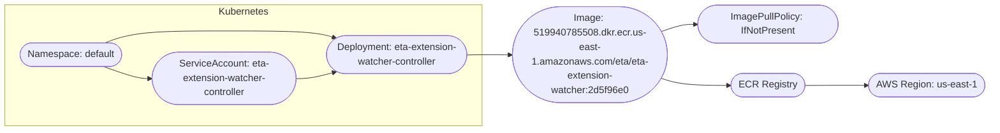
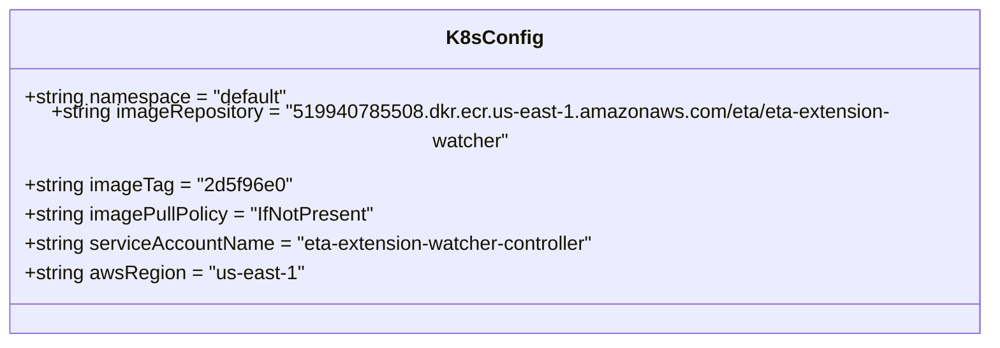

# Diagram: eta/extensions/helm/values.yaml

> Auto-generated by Obscura crawlers

## Diagram 1

### SVG

<svg id="container" width="1625.7877197265625" xmlns="http://www.w3.org/2000/svg" class="flowchart" height="222.25" viewBox="0 0 1625.7877197265625 222.25" role="graphics-document document" aria-roledescription="flowchart-v2"><g><marker id="container_flowchart-v2-pointEnd" class="marker flowchart-v2" viewBox="0 0 10 10" refX="5" refY="5" markerUnits="userSpaceOnUse" markerWidth="8" markerHeight="8" orient="auto"><path d="M 0 0 L 10 5 L 0 10 z" class="arrowMarkerPath" style="stroke-width: 1; stroke-dasharray: 1, 0;"></path></marker><marker id="container_flowchart-v2-pointStart" class="marker flowchart-v2" viewBox="0 0 10 10" refX="4.5" refY="5" markerUnits="userSpaceOnUse" markerWidth="8" markerHeight="8" orient="auto"><path d="M 0 5 L 10 10 L 10 0 z" class="arrowMarkerPath" style="stroke-width: 1; stroke-dasharray: 1, 0;"></path></marker><marker id="container_flowchart-v2-circleEnd" class="marker flowchart-v2" viewBox="0 0 10 10" refX="11" refY="5" markerUnits="userSpaceOnUse" markerWidth="11" markerHeight="11" orient="auto"><circle cx="5" cy="5" r="5" class="arrowMarkerPath" style="stroke-width: 1; stroke-dasharray: 1, 0;"></circle></marker><marker id="container_flowchart-v2-circleStart" class="marker flowchart-v2" viewBox="0 0 10 10" refX="-1" refY="5" markerUnits="userSpaceOnUse" markerWidth="11" markerHeight="11" orient="auto"><circle cx="5" cy="5" r="5" class="arrowMarkerPath" style="stroke-width: 1; stroke-dasharray: 1, 0;"></circle></marker><marker id="container_flowchart-v2-crossEnd" class="marker cross flowchart-v2" viewBox="0 0 11 11" refX="12" refY="5.2" markerUnits="userSpaceOnUse" markerWidth="11" markerHeight="11" orient="auto"><path d="M 1,1 l 9,9 M 10,1 l -9,9" class="arrowMarkerPath" style="stroke-width: 2; stroke-dasharray: 1, 0;"></path></marker><marker id="container_flowchart-v2-crossStart" class="marker cross flowchart-v2" viewBox="0 0 11 11" refX="-1" refY="5.2" markerUnits="userSpaceOnUse" markerWidth="11" markerHeight="11" orient="auto"><path d="M 1,1 l 9,9 M 10,1 l -9,9" class="arrowMarkerPath" style="stroke-width: 2; stroke-dasharray: 1, 0;"></path></marker><g class="root"><g class="clusters"><g class="cluster" id="Kubernetes" data-look="classic"><rect style="" x="8" y="8" width="791.6405792236328" height="206.25"></rect><g class="cluster-label" transform="translate(362.4062271118164, 8)"><foreignObject width="82.828125" height="24">

Kubernetes

</foreignObject></g></g></g><g class="edgePaths"><path d="M171.825,116.5L180.892,119.708C189.96,122.917,208.095,129.333,220.746,132.612C233.397,135.891,240.564,136.031,244.147,136.101L247.731,136.172" id="L_ns_sa_0" class="edge-thickness-normal edge-pattern-solid edge-thickness-normal edge-pattern-solid flowchart-link" style=";" data-edge="true" data-et="edge" data-id="L_ns_sa_0" data-points="W3sieCI6MTcxLjgyNDk3Mzk2Mjg2ODg1LCJ5IjoxMTYuNX0seyJ4IjoyMjYuMjI5OTY1MjA5OTYwOTQsInkiOjEzNS43NX0seyJ4IjoyNTEuNzI5OTY1MjA5OTYzMjQsInkiOjEzNi4yNX1d" marker-end="url(#container_flowchart-v2-pointEnd)"></path><path d="M171.825,77.5L180.892,74.125C189.96,70.75,208.095,64,241.055,60.625C274.014,57.25,321.798,57.25,369.583,57.25C417.367,57.25,465.151,57.25,494.54,58.809C523.93,60.369,534.924,63.487,540.421,65.047L545.918,66.606" id="L_ns_deploy_0" class="edge-thickness-normal edge-pattern-solid edge-thickness-normal edge-pattern-solid flowchart-link" style=";" data-edge="true" data-et="edge" data-id="L_ns_deploy_0" data-points="W3sieCI6MTcxLjgyNDk3Mzk2Mjg2ODg1LCJ5Ijo3Ny41fSx7IngiOjIyNi4yMjk5NjUyMDk5NjA5NCwieSI6NTcuMjV9LHsieCI6MzY5LjU4MjYxODcxMzM3ODksInkiOjU3LjI1fSx7IngiOjUxMi45MzUyNzIyMTY3OTY5LCJ5Ijo1Ny4yNX0seyJ4Ijo1NDkuNzY2NDQzMzQzMDQ2OCwieSI6NjcuNjk3NDg1NjcxNTU5NjZ9XQ==" marker-end="url(#container_flowchart-v2-pointEnd)"></path><path d="M488.435,136.25L492.519,136.167C496.602,136.083,504.769,135.917,514.345,134.424C523.921,132.932,534.906,130.114,540.399,128.705L545.892,127.296" id="L_sa_deploy_0" class="edge-thickness-normal edge-pattern-solid edge-thickness-normal edge-pattern-solid flowchart-link" style=";" data-edge="true" data-et="edge" data-id="L_sa_deploy_0" data-points="W3sieCI6NDg4LjQzNTI2NjAxOTQxODYsInkiOjEzNi4yNX0seyJ4Ijo1MTIuOTM1MjcyMjE2Nzk2OSwieSI6MTM1Ljc1fSx7IngiOjU0OS43NjY0NDMzNDMwNDU2LCJ5IjoxMjYuMzAyNTE0MzI4NDQwN31d" marker-end="url(#container_flowchart-v2-pointEnd)"></path><path d="M775.141,97L779.224,96.917C783.307,96.833,791.474,96.667,799.724,96.583C807.974,96.5,816.307,96.5,824.057,96.57C831.808,96.641,838.974,96.781,842.558,96.851L846.141,96.922" id="L_deploy_image_0" class="edge-thickness-normal edge-pattern-solid edge-thickness-normal edge-pattern-solid flowchart-link" style=";" data-edge="true" data-et="edge" data-id="L_deploy_image_0" data-points="W3sieCI6Nzc1LjE0MDU3MzAyNjI1NDksInkiOjk3fSx7IngiOjc5OS42NDA1NzkyMjM2MzI4LCJ5Ijo5Ni41fSx7IngiOjgyNC42NDA1NzkyMjM2MzI4LCJ5Ijo5Ni41fSx7IngiOjg1MC4xNDA1NzkyMjM2MzIyLCJ5Ijo5Ni45OTk5OTk5OTk5OTk5OX1d" marker-end="url(#container_flowchart-v2-pointEnd)"></path><path d="M1094.664,58.151L1100.438,56.126C1106.213,54.1,1117.761,50.05,1127.118,48.095C1136.476,46.141,1143.643,46.281,1147.226,46.351L1150.81,46.422" id="L_image_pull_0" class="edge-thickness-normal edge-pattern-solid edge-thickness-normal edge-pattern-solid flowchart-link" style=";" data-edge="true" data-et="edge" data-id="L_image_pull_0" data-points="W3sieCI6MTA5NC42NjQzNDcxOTMwNjcyLCJ5Ijo1OC4xNTA2OTcyNzMzODk0fSx7IngiOjExMjkuMzA4ODgzNjY2OTkyMiwieSI6NDZ9LHsieCI6MTE1NC44MDg4ODM2NjY5OTEsInkiOjQ2LjV9XQ==" marker-end="url(#container_flowchart-v2-pointEnd)"></path><path d="M1094.664,135.849L1100.438,137.708C1106.213,139.566,1117.761,143.283,1136.822,145.221C1155.882,147.159,1182.456,147.317,1195.743,147.397L1209.029,147.476" id="L_image_registry_0" class="edge-thickness-normal edge-pattern-solid edge-thickness-normal edge-pattern-solid flowchart-link" style=";" data-edge="true" data-et="edge" data-id="L_image_registry_0" data-points="W3sieCI6MTA5NC42NjQzNDcxOTMwNzA2LCJ5IjoxMzUuODQ5MzAyNzI2NjExNzR9LHsieCI6MTEyOS4zMDg4ODM2NjY5OTIyLCJ5IjoxNDd9LHsieCI6MTIxMy4wMjkyODE2MTYxOTczLCJ5IjoxNDcuNX1d" marker-end="url(#container_flowchart-v2-pointEnd)"></path><path d="M1327.306,147.5L1341.093,147.417C1354.88,147.333,1382.453,147.167,1399.823,147.154C1417.193,147.141,1424.36,147.281,1427.944,147.351L1431.527,147.422" id="L_registry_region_0" class="edge-thickness-normal edge-pattern-solid edge-thickness-normal edge-pattern-solid flowchart-link" style=";" data-edge="true" data-et="edge" data-id="L_registry_region_0" data-points="W3sieCI6MTMyNy4zMDYxMTkwNDgwMzg1LCJ5IjoxNDcuNX0seyJ4IjoxNDEwLjAyNjUxOTc3NTM5MDYsInkiOjE0N30seyJ4IjoxNDM1LjUyNjUxOTc3NTQwNiwieSI6MTQ3LjV9XQ==" marker-end="url(#container_flowchart-v2-pointEnd)"></path></g><g class="edgeLabels"><g class="edgeLabel"><g class="label" data-id="L_ns_sa_0" transform="translate(0, 0)"><foreignObject width="0" height="0">

</foreignObject></g></g><g class="edgeLabel"><g class="label" data-id="L_ns_deploy_0" transform="translate(0, 0)"><foreignObject width="0" height="0">

</foreignObject></g></g><g class="edgeLabel"><g class="label" data-id="L_sa_deploy_0" transform="translate(0, 0)"><foreignObject width="0" height="0">

</foreignObject></g></g><g class="edgeLabel"><g class="label" data-id="L_deploy_image_0" transform="translate(0, 0)"><foreignObject width="0" height="0">

</foreignObject></g></g><g class="edgeLabel"><g class="label" data-id="L_image_pull_0" transform="translate(0, 0)"><foreignObject width="0" height="0">

</foreignObject></g></g><g class="edgeLabel"><g class="label" data-id="L_image_registry_0" transform="translate(0, 0)"><foreignObject width="0" height="0">

</foreignObject></g></g><g class="edgeLabel"><g class="label" data-id="L_registry_region_0" transform="translate(0, 0)"><foreignObject width="0" height="0">

</foreignObject></g></g></g><g class="nodes"><g class="node default" id="flowchart-ns-0" transform="translate(117.11498260498047, 96.5)"><g class="basic label-container outer-path"><path d="M-64.625 -19.5 C-35.083364314217505 -19.5, -5.54172862843501 -19.5, 64.625 -19.5 C64.625 -19.5, 64.625 -19.5, 64.625 -19.5 C65.12020235911966 -19.48411982419595, 65.6154047182393 -19.468239648391904, 65.8743692896239 -19.45993515863156 C66.2926703947488 -19.41958215410084, 66.71097149987371 -19.379229149570126, 67.11860465284786 -19.3399052695533 C67.54567493234308 -19.270859858743997, 67.97274521183829 -19.201814447934694, 68.35259325967675 -19.140403561325776 C68.6847902069796 -19.064581775891572, 69.01698715428245 -18.988759990457368, 69.57126438623538 -18.862249829261074 C70.02812720197774 -18.726655343670604, 70.48499001772008 -18.591060858080134, 70.7696102514606 -18.50658706670804 C71.21592863426562 -18.34233777611389, 71.66224701707064 -18.17808848551974, 71.9427065951478 -18.074876768247425 C72.17782929072378 -17.97079492558289, 72.41295198629977 -17.866713082918352, 73.08573291279238 -17.568892924097174 C73.46280216489936 -17.372176136797343, 73.83987141700635 -17.175459349497515, 74.19399226407678 -16.990714730406097 C74.49947726895576 -16.805527925219305, 74.80496227383473 -16.620341120032517, 75.2629305736057 -16.342718045390892 C75.56756378328187 -16.1302191056799, 75.87219699295804 -15.917720165968907, 76.28815534457871 -15.627565626425154 C76.63413316167122 -15.351657524150253, 76.98011097876373 -15.07574942187535, 77.26545370850187 -14.848196188198123 C77.62992727980176 -14.517190934185809, 77.99440085110167 -14.186185680173493, 78.19080973676799 -14.007812326905688 C78.46952812255908 -13.720012710371345, 78.74824650835016 -13.432213093837, 79.06042094296865 -13.10986736009568 C79.27909474194485 -12.853000672926582, 79.49776854092104 -12.596133985757481, 79.87071390812658 -12.158051136245305 C80.13288057925189 -11.806771680812457, 80.39504725037722 -11.455492225379606, 80.61835896464063 -11.156274872382312 C80.75886361650096 -10.940421996343012, 80.8993682683613 -10.724569120303713, 81.30028387860425 -10.108655082055241 C81.43267560271288 -9.873580169784585, 81.56506732682152 -9.638505257513927, 81.9136864742735 -9.019496659696287 C82.12983902947262 -8.57065125390154, 82.34599158467174 -8.121805848106794, 82.45604614880834 -7.893275190886684 C82.56331376278078 -7.628322110496528, 82.67058137675322 -7.363369030106371, 82.92513422997033 -6.734618561215508 C83.07925118205655 -6.270442856733463, 83.23336813414278 -5.806267152251417, 83.31902313421489 -5.548287939305138 C83.43940228659804 -5.089230058613527, 83.55978143898118 -4.630172177921915, 83.63609428754556 -4.339158212148133 C83.72593597798921 -3.877840119768013, 83.81577766843284 -3.4165220273878925, 83.87504477658177 -3.1121979531509023 C83.92563618071762 -2.7198210130760962, 83.97622758485345 -2.32744407300129, 84.03489270250937 -1.872449005199798 C84.05821395022441 -1.5092017474657187, 84.08153519793944 -1.1459544897316394, 84.11498121591342 -0.6250057626472757 C84.11498121591342 -0.3619957233694193, 84.11498121591342 -0.09898568409156294, 84.11498121591342 0.625005762647271 C84.09732725790444 0.8999804086555139, 84.07967329989546 1.1749550546637568, 84.03489270250937 1.8724490051997846 C83.99971447118246 2.145284420643757, 83.96453623985556 2.4181198360877287, 83.87504477658177 3.1121979531508885 C83.80145462125822 3.490067847452554, 83.72786446593464 3.86793774175422, 83.63609428754556 4.339158212148129 C83.5348355453676 4.725301681889169, 83.43357680318964 5.1114451516302095, 83.31902313421489 5.548287939305125 C83.21929423480279 5.848655494692089, 83.11956533539069 6.149023050079053, 82.92513422997033 6.734618561215495 C82.79639348751282 7.05261068411848, 82.6676527450553 7.370602807021465, 82.45604614880834 7.893275190886679 C82.27154192485455 8.27640215968471, 82.08703770090075 8.659529128482744, 81.9136864742735 9.019496659696284 C81.7403965045524 9.327190548448337, 81.56710653483128 9.634884437200391, 81.30028387860425 10.108655082055236 C81.10037184640817 10.415773647405521, 80.90045981421208 10.722892212755808, 80.61835896464065 11.156274872382301 C80.41634070687823 11.426960933542054, 80.2143224491158 11.697646994701808, 79.87071390812659 12.158051136245302 C79.58290881636421 12.496123373603037, 79.29510372460183 12.834195610960773, 79.06042094296866 13.10986736009567 C78.86411048415803 13.312574026206061, 78.66780002534739 13.515280692316452, 78.19080973676799 14.007812326905684 C77.82351769619517 14.341377240139058, 77.45622565562235 14.674942153372431, 77.2654537085019 14.848196188198111 C77.06371191826119 15.009079897340568, 76.86197012802049 15.169963606483025, 76.28815534457871 15.627565626425152 C76.00893333534206 15.822338812742666, 75.72971132610543 16.01711199906018, 75.2629305736057 16.34271804539089 C74.97280966905781 16.518591042667506, 74.6826887645099 16.69446403994412, 74.19399226407678 16.990714730406093 C73.97206736550471 17.10649280784146, 73.75014246693266 17.22227088527682, 73.08573291279238 17.56889292409717 C72.71628111456894 17.732438275772477, 72.34682931634552 17.895983627447787, 71.9427065951478 18.07487676824742 C71.58451930538244 18.20669300192808, 71.2263320156171 18.33850923560874, 70.76961025146062 18.506587066708033 C70.32423640363383 18.638771686927992, 69.87886255580705 18.77095630714795, 69.57126438623541 18.86224982926107 C69.31317466897582 18.921157123032774, 69.05508495171621 18.980064416804474, 68.35259325967677 19.140403561325773 C67.94939759141857 19.20558911014065, 67.54620192316037 19.27077465895553, 67.11860465284788 19.3399052695533 C66.7285875233682 19.377529752969977, 66.33857039388853 19.415154236386655, 65.8743692896239 19.45993515863156 C65.54538051305231 19.470485188358403, 65.2163917364807 19.481035218085246, 64.625 19.5 C64.625 19.5, 64.625 19.5, 64.625 19.5 C22.864268022752675 19.5, -18.89646395449465 19.5, -64.625 19.5 C-64.93029745777214 19.4902097047547, -65.23559491554428 19.4804194095094, -65.8743692896239 19.45993515863156 C-66.21279538837372 19.427287599902098, -66.55122148712354 19.394640041172632, -67.11860465284786 19.3399052695533 C-67.3907769537669 19.295902562668424, -67.66294925468596 19.251899855783552, -68.35259325967675 19.140403561325773 C-68.73117666547486 19.053994369439955, -69.10976007127297 18.967585177554138, -69.57126438623538 18.862249829261074 C-69.81735184827646 18.78921236226673, -70.06343931031753 18.71617489527239, -70.76961025146059 18.506587066708043 C-71.07947284826128 18.392554766746947, -71.38933544506196 18.278522466785848, -71.9427065951478 18.074876768247425 C-72.36638652573748 17.88732623099397, -72.79006645632715 17.699775693740516, -73.08573291279238 17.568892924097174 C-73.35761232358297 17.427053609634793, -73.62949173437357 17.285214295172416, -74.19399226407678 16.990714730406097 C-74.57246640216788 16.761281483734365, -74.95094054025896 16.531848237062633, -75.26293057360569 16.3427180453909 C-75.61527588190985 16.09693721110048, -75.96762119021402 15.851156376810064, -76.28815534457871 15.627565626425156 C-76.6103193106777 15.370648436604398, -76.9324832767767 15.113731246783638, -77.26545370850187 14.848196188198125 C-77.5179717632784 14.618865972111687, -77.77048981805493 14.389535756025248, -78.19080973676797 14.007812326905697 C-78.41296948655277 13.778414145598223, -78.63512923633758 13.54901596429075, -79.06042094296865 13.109867360095677 C-79.23245419059165 12.907787318468602, -79.40448743821464 12.705707276841526, -79.87071390812658 12.158051136245307 C-80.16144835240947 11.768493467358988, -80.45218279669236 11.37893579847267, -80.61835896464063 11.156274872382316 C-80.76673167844794 10.928334540321991, -80.91510439225526 10.700394208261669, -81.30028387860425 10.108655082055249 C-81.4276283471647 9.882542083100438, -81.55497281572515 9.656429084145627, -81.9136864742735 9.019496659696289 C-82.06945259444045 8.696044978308581, -82.22521871460738 8.372593296920872, -82.45604614880834 7.893275190886686 C-82.59962514711425 7.538632289159995, -82.74320414542017 7.183989387433305, -82.92513422997033 6.73461856121551 C-83.02649988585037 6.429321356128791, -83.12786554173043 6.124024151042073, -83.31902313421489 5.5482879393051325 C-83.40035120992921 5.238148738795414, -83.48167928564355 4.9280095382856945, -83.63609428754556 4.339158212148136 C-83.69077907647147 4.0583633786477975, -83.74546386539738 3.777568545147459, -83.87504477658177 3.112197953150904 C-83.92144280416292 2.752344013558363, -83.96784083174408 2.392490073965822, -84.03489270250937 1.872449005199809 C-84.05484749516783 1.5616370023254396, -84.0748022878263 1.25082499945107, -84.11498121591342 0.6250057626472781 C-84.11498121591342 0.21277232600758694, -84.11498121591342 -0.19946111063210425, -84.11498121591342 -0.6250057626472687 C-84.09639145117674 -0.9145563538090897, -84.07780168644005 -1.2041069449709108, -84.03489270250937 -1.8724490051997822 C-84.00062488496256 -2.1382234311468307, -83.96635706741576 -2.403997857093879, -83.87504477658177 -3.112197953150895 C-83.79731090638619 -3.511344947545963, -83.7195770361906 -3.9104919419410304, -83.63609428754556 -4.339158212148126 C-83.54275291677956 -4.695109313284853, -83.44941154601358 -5.051060414421579, -83.31902313421489 -5.548287939305123 C-83.20135077098091 -5.902698348820882, -83.08367840774693 -6.257108758336641, -82.92513422997033 -6.734618561215485 C-82.80571948771941 -7.029575283302227, -82.68630474546849 -7.324532005388969, -82.45604614880834 -7.893275190886676 C-82.25017587305412 -8.320769223408568, -82.0443055972999 -8.74826325593046, -81.9136864742735 -9.019496659696282 C-81.69180012658913 -9.413478338438978, -81.46991377890477 -9.807460017181672, -81.30028387860425 -10.108655082055243 C-81.03146477256307 -10.52163341697173, -80.7626456665219 -10.934611751888216, -80.61835896464063 -11.156274872382308 C-80.35172189752193 -11.513544251184854, -80.08508483040322 -11.8708136299874, -79.87071390812659 -12.158051136245302 C-79.60810509415751 -12.466526391998203, -79.34549628018844 -12.775001647751104, -79.06042094296866 -13.10986736009567 C-78.82742622589537 -13.350453534695868, -78.59443150882208 -13.591039709296064, -78.19080973676799 -14.007812326905677 C-77.94184656899729 -14.23391408867058, -77.69288340122658 -14.460015850435484, -77.2654537085019 -14.848196188198107 C-76.98226871476426 -15.074028684834701, -76.69908372102662 -15.299861181471295, -76.28815534457871 -15.627565626425149 C-76.05868683863028 -15.78763292264326, -75.82921833268183 -15.947700218861371, -75.26293057360571 -16.342718045390885 C-75.02243832892803 -16.488505857403798, -74.78194608425035 -16.634293669416707, -74.19399226407678 -16.99071473040609 C-73.81600482734862 -17.187910534034664, -73.43801739062046 -17.38510633766324, -73.0857329127924 -17.56889292409717 C-72.84396681311375 -17.675915604688374, -72.6022007134351 -17.782938285279574, -71.94270659514781 -18.07487676824742 C-71.67252588364859 -18.174305767602252, -71.40234517214938 -18.27373476695708, -70.76961025146062 -18.506587066708033 C-70.45364423889009 -18.60036412069952, -70.13767822631958 -18.694141174691005, -69.57126438623541 -18.862249829261067 C-69.16768585365405 -18.954363995726716, -68.76410732107269 -19.046478162192365, -68.35259325967677 -19.140403561325773 C-68.07038439598149 -19.1860289018456, -67.78817553228622 -19.231654242365426, -67.11860465284788 -19.3399052695533 C-66.66476297165774 -19.383686830713234, -66.21092129046758 -19.42746839187317, -65.8743692896239 -19.45993515863156 C-65.41082568068362 -19.474800099937376, -64.94728207174333 -19.48966504124319, -64.625 -19.5 C-64.625 -19.5, -64.625 -19.5, -64.625 -19.5" stroke="none" stroke-width="0" fill="#ECECFF" style=""></path><path d="M-64.625 -19.5 C-33.77707689619526 -19.5, -2.9291537923905224 -19.5, 64.625 -19.5 M-64.625 -19.5 C-19.541916701818487 -19.5, 25.541166596363027 -19.5, 64.625 -19.5 M64.625 -19.5 C64.625 -19.5, 64.625 -19.5, 64.625 -19.5 M64.625 -19.5 C64.625 -19.5, 64.625 -19.5, 64.625 -19.5 M64.625 -19.5 C65.02580800630275 -19.48714686736333, 65.42661601260552 -19.474293734726654, 65.8743692896239 -19.45993515863156 M64.625 -19.5 C65.04126661103976 -19.48665113999776, 65.4575332220795 -19.473302279995522, 65.8743692896239 -19.45993515863156 M65.8743692896239 -19.45993515863156 C66.2884127473982 -19.419992884220186, 66.70245620517248 -19.38005060980881, 67.11860465284786 -19.3399052695533 M65.8743692896239 -19.45993515863156 C66.23865312911938 -19.424793134750843, 66.60293696861488 -19.38965111087013, 67.11860465284786 -19.3399052695533 M67.11860465284786 -19.3399052695533 C67.45409789357849 -19.28566532418091, 67.7895911343091 -19.231425378808524, 68.35259325967675 -19.140403561325776 M67.11860465284786 -19.3399052695533 C67.5695242595801 -19.267004084470607, 68.02044386631236 -19.194102899387914, 68.35259325967675 -19.140403561325776 M68.35259325967675 -19.140403561325776 C68.70178458620174 -19.060702919732808, 69.05097591272673 -18.981002278139837, 69.57126438623538 -18.862249829261074 M68.35259325967675 -19.140403561325776 C68.66901602875981 -19.068182129134104, 68.98543879784287 -18.995960696942433, 69.57126438623538 -18.862249829261074 M69.57126438623538 -18.862249829261074 C70.02063378936352 -18.728879349200778, 70.47000319249166 -18.595508869140478, 70.7696102514606 -18.50658706670804 M69.57126438623538 -18.862249829261074 C69.91303533693508 -18.760814005085734, 70.25480628763478 -18.659378180910394, 70.7696102514606 -18.50658706670804 M70.7696102514606 -18.50658706670804 C71.03028390719832 -18.4106567517557, 71.29095756293606 -18.314726436803358, 71.9427065951478 -18.074876768247425 M70.7696102514606 -18.50658706670804 C71.2013851909739 -18.347689897683363, 71.63316013048718 -18.188792728658683, 71.9427065951478 -18.074876768247425 M71.9427065951478 -18.074876768247425 C72.20227949248557 -17.95997154655241, 72.46185238982336 -17.84506632485739, 73.08573291279238 -17.568892924097174 M71.9427065951478 -18.074876768247425 C72.34353465684511 -17.897442075476018, 72.74436271854242 -17.72000738270461, 73.08573291279238 -17.568892924097174 M73.08573291279238 -17.568892924097174 C73.40000293764506 -17.404938453431097, 73.71427296249772 -17.240983982765016, 74.19399226407678 -16.990714730406097 M73.08573291279238 -17.568892924097174 C73.32625942894094 -17.443410394687056, 73.5667859450895 -17.31792786527694, 74.19399226407678 -16.990714730406097 M74.19399226407678 -16.990714730406097 C74.58497224607979 -16.753700367662468, 74.97595222808279 -16.51668600491884, 75.2629305736057 -16.342718045390892 M74.19399226407678 -16.990714730406097 C74.43519107619035 -16.8444985930613, 74.67638988830392 -16.698282455716505, 75.2629305736057 -16.342718045390892 M75.2629305736057 -16.342718045390892 C75.57808703131104 -16.122878543398812, 75.89324348901638 -15.903039041406736, 76.28815534457871 -15.627565626425154 M75.2629305736057 -16.342718045390892 C75.557483097341 -16.137250955806387, 75.85203562107631 -15.931783866221885, 76.28815534457871 -15.627565626425154 M76.28815534457871 -15.627565626425154 C76.56468475057686 -15.407040783898175, 76.84121415657499 -15.186515941371198, 77.26545370850187 -14.848196188198123 M76.28815534457871 -15.627565626425154 C76.61640851142774 -15.365792461046684, 76.94466167827674 -15.104019295668214, 77.26545370850187 -14.848196188198123 M77.26545370850187 -14.848196188198123 C77.4660302313151 -14.666037897143124, 77.66660675412834 -14.483879606088125, 78.19080973676799 -14.007812326905688 M77.26545370850187 -14.848196188198123 C77.45516912228835 -14.675901668992022, 77.64488453607484 -14.503607149785923, 78.19080973676799 -14.007812326905688 M78.19080973676799 -14.007812326905688 C78.403717519371 -13.787967561314037, 78.61662530197403 -13.568122795722385, 79.06042094296865 -13.10986736009568 M78.19080973676799 -14.007812326905688 C78.40994391383657 -13.781538297831842, 78.62907809090517 -13.555264268757995, 79.06042094296865 -13.10986736009568 M79.06042094296865 -13.10986736009568 C79.26545409255142 -12.869023755879045, 79.47048724213418 -12.628180151662411, 79.87071390812658 -12.158051136245305 M79.06042094296865 -13.10986736009568 C79.38447550513887 -12.729214432143593, 79.70853006730908 -12.348561504191506, 79.87071390812658 -12.158051136245305 M79.87071390812658 -12.158051136245305 C80.0637273150451 -11.899430754857597, 80.25674072196361 -11.640810373469888, 80.61835896464063 -11.156274872382312 M79.87071390812658 -12.158051136245305 C80.12553557828278 -11.816613312967725, 80.38035724843897 -11.475175489690146, 80.61835896464063 -11.156274872382312 M80.61835896464063 -11.156274872382312 C80.80389237265229 -10.871245734980524, 80.98942578066395 -10.586216597578735, 81.30028387860425 -10.108655082055241 M80.61835896464063 -11.156274872382312 C80.80468467256533 -10.870028549551769, 80.99101038049004 -10.583782226721226, 81.30028387860425 -10.108655082055241 M81.30028387860425 -10.108655082055241 C81.44531814623735 -9.851132053560532, 81.59035241387046 -9.593609025065824, 81.9136864742735 -9.019496659696287 M81.30028387860425 -10.108655082055241 C81.4817349764791 -9.786470283862375, 81.66318607435396 -9.464285485669508, 81.9136864742735 -9.019496659696287 M81.9136864742735 -9.019496659696287 C82.07746303563111 -8.679411125780172, 82.24123959698872 -8.339325591864059, 82.45604614880834 -7.893275190886684 M81.9136864742735 -9.019496659696287 C82.06429605296677 -8.706752647010982, 82.21490563166003 -8.394008634325674, 82.45604614880834 -7.893275190886684 M82.45604614880834 -7.893275190886684 C82.58634784418261 -7.5714274841003455, 82.71664953955687 -7.249579777314006, 82.92513422997033 -6.734618561215508 M82.45604614880834 -7.893275190886684 C82.56265121921501 -7.629958605913374, 82.66925628962169 -7.3666420209400645, 82.92513422997033 -6.734618561215508 M82.92513422997033 -6.734618561215508 C83.05026963264733 -6.357730665971205, 83.17540503532433 -5.980842770726903, 83.31902313421489 -5.548287939305138 M82.92513422997033 -6.734618561215508 C83.01015557058749 -6.478547829587626, 83.09517691120465 -6.222477097959744, 83.31902313421489 -5.548287939305138 M83.31902313421489 -5.548287939305138 C83.39639946672345 -5.253218448335324, 83.47377579923202 -4.95814895736551, 83.63609428754556 -4.339158212148133 M83.31902313421489 -5.548287939305138 C83.4041233567066 -5.223763908274457, 83.48922357919834 -4.899239877243777, 83.63609428754556 -4.339158212148133 M83.63609428754556 -4.339158212148133 C83.68609450735356 -4.082417650984223, 83.73609472716157 -3.825677089820314, 83.87504477658177 -3.1121979531509023 M83.63609428754556 -4.339158212148133 C83.72982777112891 -3.8578565845264277, 83.82356125471225 -3.376554956904722, 83.87504477658177 -3.1121979531509023 M83.87504477658177 -3.1121979531509023 C83.91658816835148 -2.789995610255614, 83.9581315601212 -2.4677932673603253, 84.03489270250937 -1.872449005199798 M83.87504477658177 -3.1121979531509023 C83.93694317117871 -2.6321262278776176, 83.99884156577565 -2.1520545026043325, 84.03489270250937 -1.872449005199798 M84.03489270250937 -1.872449005199798 C84.05558948275508 -1.550079946732472, 84.0762862630008 -1.227710888265146, 84.11498121591342 -0.6250057626472757 M84.03489270250937 -1.872449005199798 C84.06469274804206 -1.408289241864364, 84.09449279357474 -0.9441294785289303, 84.11498121591342 -0.6250057626472757 M84.11498121591342 -0.6250057626472757 C84.11498121591342 -0.25867208414216464, 84.11498121591342 0.10766159436294642, 84.11498121591342 0.625005762647271 M84.11498121591342 -0.6250057626472757 C84.11498121591342 -0.3273705324223299, 84.11498121591342 -0.029735302197384073, 84.11498121591342 0.625005762647271 M84.11498121591342 0.625005762647271 C84.09097497468898 0.9989223472070334, 84.06696873346453 1.372838931766796, 84.03489270250937 1.8724490051997846 M84.11498121591342 0.625005762647271 C84.09686340358478 0.9072053141007204, 84.07874559125614 1.1894048655541696, 84.03489270250937 1.8724490051997846 M84.03489270250937 1.8724490051997846 C83.98234202362379 2.280021693331079, 83.92979134473819 2.6875943814623735, 83.87504477658177 3.1121979531508885 M84.03489270250937 1.8724490051997846 C83.98107972433986 2.289811837307975, 83.92726674617036 2.7071746694161654, 83.87504477658177 3.1121979531508885 M83.87504477658177 3.1121979531508885 C83.8265781160728 3.361064011432166, 83.77811145556382 3.6099300697134438, 83.63609428754556 4.339158212148129 M83.87504477658177 3.1121979531508885 C83.81357689492346 3.4278225342249273, 83.75210901326516 3.7434471152989666, 83.63609428754556 4.339158212148129 M83.63609428754556 4.339158212148129 C83.51518008824407 4.800256458630215, 83.39426588894257 5.261354705112302, 83.31902313421489 5.548287939305125 M83.63609428754556 4.339158212148129 C83.5320008884426 4.736111457292266, 83.42790748933965 5.133064702436403, 83.31902313421489 5.548287939305125 M83.31902313421489 5.548287939305125 C83.16515816159375 6.011704721785796, 83.01129318897262 6.475121504266468, 82.92513422997033 6.734618561215495 M83.31902313421489 5.548287939305125 C83.16736011449743 6.005072790473489, 83.01569709477997 6.461857641641853, 82.92513422997033 6.734618561215495 M82.92513422997033 6.734618561215495 C82.77735302369989 7.099640997858731, 82.62957181742945 7.464663434501967, 82.45604614880834 7.893275190886679 M82.92513422997033 6.734618561215495 C82.83084639686409 6.9675113319191455, 82.73655856375785 7.200404102622796, 82.45604614880834 7.893275190886679 M82.45604614880834 7.893275190886679 C82.31828448188452 8.179340239881482, 82.18052281496068 8.465405288876283, 81.9136864742735 9.019496659696284 M82.45604614880834 7.893275190886679 C82.34618869904162 8.121396535900143, 82.2363312492749 8.349517880913606, 81.9136864742735 9.019496659696284 M81.9136864742735 9.019496659696284 C81.77088317676554 9.273058374823583, 81.62807987925757 9.526620089950882, 81.30028387860425 10.108655082055236 M81.9136864742735 9.019496659696284 C81.76363128369877 9.28593484529743, 81.61357609312404 9.552373030898575, 81.30028387860425 10.108655082055236 M81.30028387860425 10.108655082055236 C81.08022580026409 10.446723384253682, 80.86016772192393 10.78479168645213, 80.61835896464065 11.156274872382301 M81.30028387860425 10.108655082055236 C81.15242057289467 10.335812826482213, 81.00455726718509 10.56297057090919, 80.61835896464065 11.156274872382301 M80.61835896464065 11.156274872382301 C80.3745727348124 11.482926210969723, 80.13078650498416 11.809577549557144, 79.87071390812659 12.158051136245302 M80.61835896464065 11.156274872382301 C80.46614213264745 11.360231560014519, 80.31392530065425 11.564188247646737, 79.87071390812659 12.158051136245302 M79.87071390812659 12.158051136245302 C79.6922798311443 12.3676499562553, 79.51384575416202 12.577248776265302, 79.06042094296866 13.10986736009567 M79.87071390812659 12.158051136245302 C79.67512422081975 12.387801912324402, 79.47953453351292 12.617552688403501, 79.06042094296866 13.10986736009567 M79.06042094296866 13.10986736009567 C78.85979060277694 13.317034658400885, 78.65916026258523 13.524201956706102, 78.19080973676799 14.007812326905684 M79.06042094296866 13.10986736009567 C78.79112763307187 13.387934811956029, 78.52183432317507 13.666002263816388, 78.19080973676799 14.007812326905684 M78.19080973676799 14.007812326905684 C77.98759072557657 14.192370455989348, 77.78437171438513 14.376928585073012, 77.2654537085019 14.848196188198111 M78.19080973676799 14.007812326905684 C77.8355373059951 14.330461348540204, 77.48026487522222 14.653110370174725, 77.2654537085019 14.848196188198111 M77.2654537085019 14.848196188198111 C77.00762533581654 15.053807454313533, 76.74979696313119 15.259418720428954, 76.28815534457871 15.627565626425152 M77.2654537085019 14.848196188198111 C77.00743251900128 15.053961220592626, 76.74941132950069 15.259726252987141, 76.28815534457871 15.627565626425152 M76.28815534457871 15.627565626425152 C75.99595102428923 15.831394710937941, 75.70374670399974 16.03522379545073, 75.2629305736057 16.34271804539089 M76.28815534457871 15.627565626425152 C75.95251952153585 15.86169064713925, 75.61688369849298 16.095815667853348, 75.2629305736057 16.34271804539089 M75.2629305736057 16.34271804539089 C75.04088113356227 16.477325720852573, 74.81883169351883 16.611933396314257, 74.19399226407678 16.990714730406093 M75.2629305736057 16.34271804539089 C74.96606296511955 16.522680934242906, 74.66919535663341 16.70264382309492, 74.19399226407678 16.990714730406093 M74.19399226407678 16.990714730406093 C73.84886422637354 17.170767806610822, 73.50373618867027 17.350820882815547, 73.08573291279238 17.56889292409717 M74.19399226407678 16.990714730406093 C73.94374756568764 17.121267229266326, 73.6935028672985 17.25181972812656, 73.08573291279238 17.56889292409717 M73.08573291279238 17.56889292409717 C72.73921174572006 17.722287565574884, 72.39269057864774 17.875682207052602, 71.9427065951478 18.07487676824742 M73.08573291279238 17.56889292409717 C72.79745500654376 17.69650500173318, 72.50917710029515 17.824117079369188, 71.9427065951478 18.07487676824742 M71.9427065951478 18.07487676824742 C71.6958308603826 18.16572932073529, 71.44895512561739 18.256581873223162, 70.76961025146062 18.506587066708033 M71.9427065951478 18.07487676824742 C71.70230424882918 18.1633470539476, 71.46190190251058 18.25181733964778, 70.76961025146062 18.506587066708033 M70.76961025146062 18.506587066708033 C70.50470662162861 18.585209073534642, 70.23980299179662 18.663831080361255, 69.57126438623541 18.86224982926107 M70.76961025146062 18.506587066708033 C70.30134034964635 18.645567115567637, 69.83307044783209 18.784547164427238, 69.57126438623541 18.86224982926107 M69.57126438623541 18.86224982926107 C69.18118284043018 18.951283396571135, 68.79110129462495 19.040316963881203, 68.35259325967677 19.140403561325773 M69.57126438623541 18.86224982926107 C69.10333670516678 18.9690512689515, 68.63540902409815 19.07585270864193, 68.35259325967677 19.140403561325773 M68.35259325967677 19.140403561325773 C67.9140788736113 19.21129916653498, 67.47556448754585 19.28219477174419, 67.11860465284788 19.3399052695533 M68.35259325967677 19.140403561325773 C67.9013011262187 19.21336497364051, 67.45000899276063 19.286326385955245, 67.11860465284788 19.3399052695533 M67.11860465284788 19.3399052695533 C66.70975861853393 19.37934615477427, 66.30091258421997 19.41878703999524, 65.8743692896239 19.45993515863156 M67.11860465284788 19.3399052695533 C66.83004911044245 19.36774187569034, 66.54149356803701 19.395578481827375, 65.8743692896239 19.45993515863156 M65.8743692896239 19.45993515863156 C65.47050604271169 19.47288626688791, 65.0666427957995 19.485837375144264, 64.625 19.5 M65.8743692896239 19.45993515863156 C65.60687720864776 19.468513109026713, 65.33938512767162 19.47709105942187, 64.625 19.5 M64.625 19.5 C64.625 19.5, 64.625 19.5, 64.625 19.5 M64.625 19.5 C64.625 19.5, 64.625 19.5, 64.625 19.5 M64.625 19.5 C23.71774226076097 19.5, -17.189515478478057 19.5, -64.625 19.5 M64.625 19.5 C25.215809356660493 19.5, -14.193381286679013 19.5, -64.625 19.5 M-64.625 19.5 C-65.01223568063837 19.487582105430455, -65.39947136127672 19.47516421086091, -65.8743692896239 19.45993515863156 M-64.625 19.5 C-65.02299721257515 19.487237004047294, -65.42099442515031 19.47447400809459, -65.8743692896239 19.45993515863156 M-65.8743692896239 19.45993515863156 C-66.16780396195854 19.43162786869826, -66.4612386342932 19.403320578764962, -67.11860465284786 19.3399052695533 M-65.8743692896239 19.45993515863156 C-66.13417527139849 19.43487198803217, -66.39398125317308 19.409808817432786, -67.11860465284786 19.3399052695533 M-67.11860465284786 19.3399052695533 C-67.44073939052788 19.287825023357396, -67.76287412820788 19.235744777161493, -68.35259325967675 19.140403561325773 M-67.11860465284786 19.3399052695533 C-67.41920216337222 19.29130699522023, -67.71979967389659 19.242708720887162, -68.35259325967675 19.140403561325773 M-68.35259325967675 19.140403561325773 C-68.65397821056051 19.071614413007158, -68.95536316144427 19.002825264688546, -69.57126438623538 18.862249829261074 M-68.35259325967675 19.140403561325773 C-68.82420128005148 19.032762108205187, -69.2958093004262 18.925120655084598, -69.57126438623538 18.862249829261074 M-69.57126438623538 18.862249829261074 C-70.03805063879027 18.723710119713825, -70.50483689134515 18.585170410166576, -70.76961025146059 18.506587066708043 M-69.57126438623538 18.862249829261074 C-69.89940050543774 18.764860751503456, -70.2275366246401 18.667471673745833, -70.76961025146059 18.506587066708043 M-70.76961025146059 18.506587066708043 C-71.18467757898699 18.35383845333801, -71.59974490651341 18.201089839967977, -71.9427065951478 18.074876768247425 M-70.76961025146059 18.506587066708043 C-71.01974663353799 18.414534565868195, -71.26988301561538 18.322482065028343, -71.9427065951478 18.074876768247425 M-71.9427065951478 18.074876768247425 C-72.20179004595944 17.960188210010617, -72.46087349677107 17.845499651773807, -73.08573291279238 17.568892924097174 M-71.9427065951478 18.074876768247425 C-72.30809848112607 17.913128619290035, -72.67349036710432 17.751380470332645, -73.08573291279238 17.568892924097174 M-73.08573291279238 17.568892924097174 C-73.38929216433421 17.410526257006786, -73.69285141587602 17.2521595899164, -74.19399226407678 16.990714730406097 M-73.08573291279238 17.568892924097174 C-73.51818007038445 17.343285518977016, -73.95062722797653 17.117678113856858, -74.19399226407678 16.990714730406097 M-74.19399226407678 16.990714730406097 C-74.50475431166505 16.80232895091758, -74.81551635925334 16.613943171429067, -75.26293057360569 16.3427180453909 M-74.19399226407678 16.990714730406097 C-74.58679135837112 16.75259761110117, -74.97959045266546 16.51448049179624, -75.26293057360569 16.3427180453909 M-75.26293057360569 16.3427180453909 C-75.55737396731989 16.13732708018495, -75.85181736103411 15.931936114978997, -76.28815534457871 15.627565626425156 M-75.26293057360569 16.3427180453909 C-75.50438259702801 16.174291566141115, -75.74583462045035 16.005865086891333, -76.28815534457871 15.627565626425156 M-76.28815534457871 15.627565626425156 C-76.64835252829306 15.340317957662577, -77.00854971200741 15.0530702889, -77.26545370850187 14.848196188198125 M-76.28815534457871 15.627565626425156 C-76.55507141142552 15.414707166049666, -76.82198747827233 15.201848705674177, -77.26545370850187 14.848196188198125 M-77.26545370850187 14.848196188198125 C-77.51332396322333 14.623086981147646, -77.7611942179448 14.397977774097166, -78.19080973676797 14.007812326905697 M-77.26545370850187 14.848196188198125 C-77.57563235897396 14.56650014471673, -77.88581100944607 14.284804101235336, -78.19080973676797 14.007812326905697 M-78.19080973676797 14.007812326905697 C-78.43571150959986 13.75493113964729, -78.68061328243174 13.502049952388884, -79.06042094296865 13.109867360095677 M-78.19080973676797 14.007812326905697 C-78.4039989107106 13.787677001653245, -78.61718808465322 13.567541676400792, -79.06042094296865 13.109867360095677 M-79.06042094296865 13.109867360095677 C-79.25468683672862 12.881671587242714, -79.44895273048859 12.65347581438975, -79.87071390812658 12.158051136245307 M-79.06042094296865 13.109867360095677 C-79.29978582977796 12.828695743801559, -79.53915071658727 12.54752412750744, -79.87071390812658 12.158051136245307 M-79.87071390812658 12.158051136245307 C-80.10606066601716 11.842707921202647, -80.34140742390774 11.527364706159988, -80.61835896464063 11.156274872382316 M-79.87071390812658 12.158051136245307 C-80.14072121480687 11.796265943465388, -80.41072852148716 11.434480750685468, -80.61835896464063 11.156274872382316 M-80.61835896464063 11.156274872382316 C-80.82919334870307 10.832376641503174, -81.04002773276551 10.508478410624033, -81.30028387860425 10.108655082055249 M-80.61835896464063 11.156274872382316 C-80.75526810593172 10.945945666107155, -80.8921772472228 10.735616459831995, -81.30028387860425 10.108655082055249 M-81.30028387860425 10.108655082055249 C-81.48138178832814 9.787097405188609, -81.66247969805202 9.46553972832197, -81.9136864742735 9.019496659696289 M-81.30028387860425 10.108655082055249 C-81.43284814965226 9.873273795221465, -81.56541242070026 9.637892508387683, -81.9136864742735 9.019496659696289 M-81.9136864742735 9.019496659696289 C-82.08341783376996 8.66704586003258, -82.25314919326642 8.314595060368871, -82.45604614880834 7.893275190886686 M-81.9136864742735 9.019496659696289 C-82.12475388947348 8.581210655914319, -82.33582130467346 8.14292465213235, -82.45604614880834 7.893275190886686 M-82.45604614880834 7.893275190886686 C-82.57630336323638 7.596237546234364, -82.69656057766441 7.299199901582043, -82.92513422997033 6.73461856121551 M-82.45604614880834 7.893275190886686 C-82.61156613967734 7.509137806665781, -82.76708613054635 7.1250004224448755, -82.92513422997033 6.73461856121551 M-82.92513422997033 6.73461856121551 C-83.04159586478406 6.3838546727981536, -83.15805749959779 6.033090784380797, -83.31902313421489 5.5482879393051325 M-82.92513422997033 6.73461856121551 C-83.02878085031983 6.422451454569103, -83.13242747066936 6.110284347922697, -83.31902313421489 5.5482879393051325 M-83.31902313421489 5.5482879393051325 C-83.42385766886807 5.148508423097814, -83.52869220352125 4.748728906890495, -83.63609428754556 4.339158212148136 M-83.31902313421489 5.5482879393051325 C-83.38590525012668 5.293237444441038, -83.45278736603849 5.038186949576943, -83.63609428754556 4.339158212148136 M-83.63609428754556 4.339158212148136 C-83.7138865317688 3.9397114794584644, -83.79167877599203 3.5402647467687927, -83.87504477658177 3.112197953150904 M-83.63609428754556 4.339158212148136 C-83.72537810715218 3.8807046686101057, -83.8146619267588 3.4222511250720755, -83.87504477658177 3.112197953150904 M-83.87504477658177 3.112197953150904 C-83.93152865882784 2.67412011645455, -83.98801254107391 2.236042279758195, -84.03489270250937 1.872449005199809 M-83.87504477658177 3.112197953150904 C-83.91117867241358 2.8319505925242447, -83.94731256824538 2.5517032318975854, -84.03489270250937 1.872449005199809 M-84.03489270250937 1.872449005199809 C-84.0639978214844 1.4191132839344573, -84.09310294045943 0.9657775626691057, -84.11498121591342 0.6250057626472781 M-84.03489270250937 1.872449005199809 C-84.0618570364805 1.4524577383806738, -84.08882137045164 1.0324664715615386, -84.11498121591342 0.6250057626472781 M-84.11498121591342 0.6250057626472781 C-84.11498121591342 0.20520755660476286, -84.11498121591342 -0.2145906494377524, -84.11498121591342 -0.6250057626472687 M-84.11498121591342 0.6250057626472781 C-84.11498121591342 0.28095192159493965, -84.11498121591342 -0.06310191945739885, -84.11498121591342 -0.6250057626472687 M-84.11498121591342 -0.6250057626472687 C-84.09102470933612 -0.9981476899325444, -84.06706820275885 -1.3712896172178202, -84.03489270250937 -1.8724490051997822 M-84.11498121591342 -0.6250057626472687 C-84.09594637983359 -0.9214886992337274, -84.07691154375377 -1.2179716358201862, -84.03489270250937 -1.8724490051997822 M-84.03489270250937 -1.8724490051997822 C-83.98987830736216 -2.221571764863747, -83.94486391221496 -2.5706945245277115, -83.87504477658177 -3.112197953150895 M-84.03489270250937 -1.8724490051997822 C-83.97192880926745 -2.360784527556977, -83.90896491602554 -2.8491200499141716, -83.87504477658177 -3.112197953150895 M-83.87504477658177 -3.112197953150895 C-83.81620640209616 -3.414320570639699, -83.75736802761054 -3.716443188128503, -83.63609428754556 -4.339158212148126 M-83.87504477658177 -3.112197953150895 C-83.78411206887853 -3.579118188572506, -83.69317936117528 -4.0460384239941165, -83.63609428754556 -4.339158212148126 M-83.63609428754556 -4.339158212148126 C-83.5197424669058 -4.782858131445577, -83.40339064626605 -5.226558050743028, -83.31902313421489 -5.548287939305123 M-83.63609428754556 -4.339158212148126 C-83.53184171180177 -4.736718466811347, -83.42758913605797 -5.134278721474566, -83.31902313421489 -5.548287939305123 M-83.31902313421489 -5.548287939305123 C-83.1788936044753 -5.970335756272174, -83.03876407473572 -6.392383573239226, -82.92513422997033 -6.734618561215485 M-83.31902313421489 -5.548287939305123 C-83.18217560351582 -5.960450898077695, -83.04532807281674 -6.3726138568502675, -82.92513422997033 -6.734618561215485 M-82.92513422997033 -6.734618561215485 C-82.73904051959767 -7.19427362371308, -82.552946809225 -7.653928686210675, -82.45604614880834 -7.893275190886676 M-82.92513422997033 -6.734618561215485 C-82.82606179298678 -6.979329396000128, -82.72698935600322 -7.2240402307847695, -82.45604614880834 -7.893275190886676 M-82.45604614880834 -7.893275190886676 C-82.2896734115589 -8.238751739591473, -82.12330067430943 -8.584228288296272, -81.9136864742735 -9.019496659696282 M-82.45604614880834 -7.893275190886676 C-82.27347019976764 -8.272398055569182, -82.09089425072695 -8.65152092025169, -81.9136864742735 -9.019496659696282 M-81.9136864742735 -9.019496659696282 C-81.72733701484017 -9.350378994849105, -81.54098755540686 -9.681261330001929, -81.30028387860425 -10.108655082055243 M-81.9136864742735 -9.019496659696282 C-81.7527368436157 -9.305279026846609, -81.5917872129579 -9.591061393996934, -81.30028387860425 -10.108655082055243 M-81.30028387860425 -10.108655082055243 C-81.13631836767405 -10.360550137748618, -80.97235285674385 -10.612445193441992, -80.61835896464063 -11.156274872382308 M-81.30028387860425 -10.108655082055243 C-81.04255945477951 -10.504589005747963, -80.78483503095478 -10.900522929440681, -80.61835896464063 -11.156274872382308 M-80.61835896464063 -11.156274872382308 C-80.33056295214989 -11.541895310363804, -80.04276693965915 -11.9275157483453, -79.87071390812659 -12.158051136245302 M-80.61835896464063 -11.156274872382308 C-80.39082917730052 -11.461144059028019, -80.1632993899604 -11.766013245673728, -79.87071390812659 -12.158051136245302 M-79.87071390812659 -12.158051136245302 C-79.6342902759019 -12.435767787542186, -79.39786664367723 -12.713484438839071, -79.06042094296866 -13.10986736009567 M-79.87071390812659 -12.158051136245302 C-79.69189017694532 -12.368107666249381, -79.51306644576404 -12.578164196253462, -79.06042094296866 -13.10986736009567 M-79.06042094296866 -13.10986736009567 C-78.72994413879486 -13.451111793055336, -78.39946733462106 -13.792356226015, -78.19080973676799 -14.007812326905677 M-79.06042094296866 -13.10986736009567 C-78.77889391597 -13.400567129270557, -78.49736688897134 -13.691266898445445, -78.19080973676799 -14.007812326905677 M-78.19080973676799 -14.007812326905677 C-77.86082619356579 -14.307494649955808, -77.53084265036358 -14.60717697300594, -77.2654537085019 -14.848196188198107 M-78.19080973676799 -14.007812326905677 C-77.91938547656518 -14.254312658529479, -77.64796121636238 -14.500812990153282, -77.2654537085019 -14.848196188198107 M-77.2654537085019 -14.848196188198107 C-77.0667347928875 -15.00666923526815, -76.86801587727311 -15.165142282338191, -76.28815534457871 -15.627565626425149 M-77.2654537085019 -14.848196188198107 C-76.8986729617031 -15.140694073324557, -76.5318922149043 -15.433191958451005, -76.28815534457871 -15.627565626425149 M-76.28815534457871 -15.627565626425149 C-76.0082934280066 -15.822785184398754, -75.72843151143448 -16.01800474237236, -75.26293057360571 -16.342718045390885 M-76.28815534457871 -15.627565626425149 C-76.00023675081007 -15.82840517364311, -75.71231815704144 -16.029244720861072, -75.26293057360571 -16.342718045390885 M-75.26293057360571 -16.342718045390885 C-74.94817662532995 -16.533523738535166, -74.63342267705418 -16.724329431679443, -74.19399226407678 -16.99071473040609 M-75.26293057360571 -16.342718045390885 C-75.04006749356265 -16.477818954201823, -74.81720441351958 -16.61291986301276, -74.19399226407678 -16.99071473040609 M-74.19399226407678 -16.99071473040609 C-73.90533003513082 -17.14130963035022, -73.61666780618485 -17.29190453029435, -73.0857329127924 -17.56889292409717 M-74.19399226407678 -16.99071473040609 C-73.93461062689542 -17.12603396438174, -73.67522898971406 -17.26135319835739, -73.0857329127924 -17.56889292409717 M-73.0857329127924 -17.56889292409717 C-72.76784417805959 -17.70961283712911, -72.44995544332679 -17.85033275016105, -71.94270659514781 -18.07487676824742 M-73.0857329127924 -17.56889292409717 C-72.83063887458887 -17.681815487714086, -72.57554483638535 -17.794738051331006, -71.94270659514781 -18.07487676824742 M-71.94270659514781 -18.07487676824742 C-71.65018796297505 -18.18252632889959, -71.35766933080228 -18.29017588955176, -70.76961025146062 -18.506587066708033 M-71.94270659514781 -18.07487676824742 C-71.52944028320289 -18.226962591235065, -71.11617397125795 -18.379048414222705, -70.76961025146062 -18.506587066708033 M-70.76961025146062 -18.506587066708033 C-70.29879772491367 -18.646321753241786, -69.82798519836672 -18.786056439775535, -69.57126438623541 -18.862249829261067 M-70.76961025146062 -18.506587066708033 C-70.3027433684001 -18.645150706966117, -69.83587648533958 -18.7837143472242, -69.57126438623541 -18.862249829261067 M-69.57126438623541 -18.862249829261067 C-69.18493108230567 -18.950427884822616, -68.79859777837592 -19.03860594038417, -68.35259325967677 -19.140403561325773 M-69.57126438623541 -18.862249829261067 C-69.13437353630661 -18.961967314778082, -68.6974826863778 -19.0616848002951, -68.35259325967677 -19.140403561325773 M-68.35259325967677 -19.140403561325773 C-67.97293590292944 -19.201783618477904, -67.59327854618212 -19.26316367563004, -67.11860465284788 -19.3399052695533 M-68.35259325967677 -19.140403561325773 C-67.9779103050568 -19.20097939571902, -67.60322735043682 -19.26155523011227, -67.11860465284788 -19.3399052695533 M-67.11860465284788 -19.3399052695533 C-66.64883359260251 -19.38522351875281, -66.17906253235716 -19.43054176795232, -65.8743692896239 -19.45993515863156 M-67.11860465284788 -19.3399052695533 C-66.73441347923858 -19.3769677300139, -66.35022230562929 -19.414030190474502, -65.8743692896239 -19.45993515863156 M-65.8743692896239 -19.45993515863156 C-65.45339394679233 -19.473435018497373, -65.03241860396076 -19.486934878363183, -64.625 -19.5 M-65.8743692896239 -19.45993515863156 C-65.55181813487233 -19.470278746356705, -65.22926698012077 -19.480622334081854, -64.625 -19.5 M-64.625 -19.5 C-64.625 -19.5, -64.625 -19.5, -64.625 -19.5 M-64.625 -19.5 C-64.625 -19.5, -64.625 -19.5, -64.625 -19.5" stroke="#9370DB" stroke-width="1.3" fill="none" stroke-dasharray="0 0" style=""></path></g><g class="label" style="" transform="translate(-71.75, -12)"><rect></rect><foreignObject width="143.5" height="24">

Namespace: default

</foreignObject></g></g><g class="node default" id="flowchart-sa-1" transform="translate(369.5826187133789, 135.75)"><g class="basic label-container outer-path"><path d="M-74.875 -43.5 C-25.94848339293428 -43.5, 22.978033214131443 -43.5, 74.875 -43.5 C74.875 -43.5, 74.875 -43.5, 74.875 -43.5 C75.97395619108404 -43.4647586139404, 77.07291238216808 -43.429517227880794, 77.66205456916101 -43.41062458463963 C78.4051588072103 -43.338938212508616, 79.14826304525958 -43.267251840377604, 80.43765653327601 -43.14286560131121 C81.02172387952146 -43.04843812228016, 81.60579122576691 -42.95401064324912, 83.19040034850968 -42.697823329111344 C83.89569630520954 -42.53684412948084, 84.6009922619094 -42.375864929850344, 85.90897440006356 -42.07732654219778 C86.95896748370811 -41.765694106498245, 88.00896056735264 -41.454061670798716, 88.58220748402749 -41.28392499496409 C89.50307415408243 -40.945037547985685, 90.42394082413738 -40.60615010100728, 91.19911471225277 -40.32087894455194 C91.77995610789928 -40.063757688747046, 92.36079750354581 -39.80663643294215, 93.74894265161377 -39.192145753755234 C94.48950876705176 -38.80579288568647, 95.23007488248975 -38.41944001761771, 96.22121351217129 -37.90236362936744 C96.74214341054201 -37.58657286365123, 97.26307330891274 -37.270782097935005, 98.60576820265887 -36.45683256279507 C99.35478401190808 -35.93435155863461, 100.1037998211573 -35.411870554474156, 100.8928080763679 -34.86149255125611 C101.73071954091566 -34.193280456039794, 102.56863100546342 -33.52506836082347, 103.07293519588879 -33.12289918905735 C103.5826165489095 -32.660020069673564, 104.09229790193021 -32.19714095028978, 105.13719095125165 -31.248196729251152 C105.7776132881224 -30.586908086780408, 106.41803562499314 -29.925619444309664, 107.07709287277622 -29.24508872636729 C107.59795468508594 -28.633254803751573, 108.11881649739566 -28.021420881135857, 108.8846694873593 -27.12180638085491 C109.45035983890394 -26.36383284523631, 110.01605019044857 -25.60585930961771, 110.55249307496757 -24.88707471531439 C110.98318604262593 -24.225414659735794, 111.41387901028429 -23.563754604157197, 112.07371019073256 -22.550076721507846 C112.57247068414715 -21.66447696047372, 113.07123117756173 -20.77887719943959, 113.44206982722551 -20.120415625476333 C113.8278301488259 -19.319376063724498, 114.21359047042628 -18.51833650197266, 114.65194910118784 -17.60807542582414 C115.05322793039653 -16.616908959480302, 115.45450675960522 -15.62574249313646, 115.69837635916457 -15.023379867326902 C115.88902295697179 -14.44918269014187, 116.079669554779 -13.874985512956837, 116.57705160709475 -12.376950018449923 C116.74243550520126 -11.74626953713491, 116.90781940330778 -11.115589055819896, 117.28436417990932 -9.67966062709968 C117.44224578880723 -8.868971933698797, 117.60012739770514 -8.058283240297913, 117.81740757852859 -6.942595433952013 C117.93566264084434 -6.025432522734312, 118.05391770316011 -5.108269611516611, 118.17399141329012 -4.177001626984165 C118.2228346659241 -3.416228541646217, 118.27167791855805 -2.6554554563082693, 118.35265040472993 -1.3942436243669998 C118.35265040472993 -0.5906144526043668, 118.35265040472993 0.21301471915826609, 118.35265040472993 1.3942436243669891 C118.31322951165585 2.008255853968025, 118.27380861858175 2.6222680835690606, 118.17399141329012 4.177001626984135 C118.0735961061608 4.955647803783318, 117.9732007990315 5.734293980582502, 117.81740757852859 6.942595433951983 C117.60515298176142 8.032477928326415, 117.39289838499427 9.122360422700847, 117.28436417990932 9.679660627099672 C117.1053545549633 10.36230191028108, 116.92634493001728 11.044943193462487, 116.57705160709475 12.376950018449895 C116.2586065979792 13.336055648583974, 115.94016158886365 14.295161278718053, 115.69837635916457 15.023379867326874 C115.45521822145565 15.623985168610695, 115.21206008374674 16.224590469894515, 114.65194910118785 17.60807542582413 C114.22150995312123 18.50189152670685, 113.79107080505459 19.395707627589573, 113.44206982722551 20.120415625476323 C113.01042893262681 20.88683774221646, 112.57878803802811 21.653259858956602, 112.07371019073256 22.550076721507835 C111.60498333688464 23.27016703980207, 111.13625648303672 23.990257358096308, 110.5524930749676 24.887074715314366 C110.06473247155664 25.540629487979945, 109.57697186814568 26.19418426064552, 108.8846694873593 27.121806380854903 C108.26449396825176 27.85029983458536, 107.64431844914421 28.578793288315815, 107.07709287277623 29.245088726367264 C106.66022433135407 29.67553972092941, 106.2433557899319 30.105990715491558, 105.13719095125167 31.24819672925114 C104.64419283725547 31.69592457236718, 104.15119472325928 32.14365241548322, 103.07293519588882 33.12289918905732 C102.55981406266069 33.53209963807994, 102.04669292943255 33.94130008710256, 100.89280807636791 34.861492551256106 C100.0476667461425 35.45102655764283, 99.20252541591708 36.04056056402954, 98.60576820265888 36.45683256279506 C97.95336502867585 36.85232320081018, 97.30096185469282 37.24781383882531, 96.22121351217129 37.90236362936744 C95.26218593458569 38.40268770230737, 94.30315835700009 38.90301177524729, 93.74894265161379 39.19214575375523 C93.17604508785693 39.44575051082797, 92.6031475241001 39.69935526790071, 91.1991147122528 40.32087894455194 C90.33452040073836 40.639057643411455, 89.46992608922392 40.957236342270974, 88.58220748402752 41.283924994964075 C87.71728123842877 41.54063056456728, 86.85235499283 41.797336134170486, 85.90897440006361 42.077326542197774 C85.06602771129347 42.26972362316834, 84.22308102252335 42.46212070413891, 83.19040034850971 42.697823329111344 C82.2138487020252 42.85570462604383, 81.23729705554071 43.01358592297632, 80.43765653327604 43.1428656013112 C79.74365831180711 43.209814775081334, 79.04966009033816 43.27676394885147, 77.66205456916101 43.41062458463963 C76.72785725717593 43.44058247413023, 75.79365994519085 43.470540363620835, 74.87500000000001 43.5 C74.87500000000001 43.5, 74.875 43.5, 74.875 43.5 C22.091108085999323 43.5, -30.692783828001353 43.5, -74.87499999999999 43.5 C-75.55822348235095 43.47809035273484, -76.24144696470194 43.45618070546968, -77.66205456916099 43.41062458463963 C-78.46385628654139 43.33327573727159, -79.2656580039218 43.25592688990355, -80.43765653327603 43.1428656013112 C-81.28900882674729 43.00522556483841, -82.14036112021854 42.86758552836562, -83.1904003485097 42.697823329111344 C-84.16836121025504 42.474610144209, -85.14632207200039 42.25139695930665, -85.90897440006356 42.07732654219778 C-86.55908847797141 41.88437609639316, -87.20920255587927 41.69142565058854, -88.58220748402748 41.283924994964096 C-89.2566993712203 41.03570574554249, -89.9311912584131 40.78748649612087, -91.19911471225278 40.32087894455194 C-92.12125400815805 39.91267523254499, -93.04339330406333 39.50447152053805, -93.74894265161377 39.192145753755234 C-94.44715123772846 38.827890781603145, -95.14535982384314 38.46363580945106, -96.22121351217127 37.90236362936745 C-96.80136491819674 37.55067243768672, -97.3815163242222 37.198981246005985, -98.60576820265884 36.456832562795086 C-99.38224914337457 35.915193071869965, -100.15873008409031 35.37355358094484, -100.89280807636788 34.86149255125612 C-101.72529384004305 34.19760730810174, -102.5577796037182 33.533722064947355, -103.07293519588879 33.12289918905736 C-103.49409007641292 32.74041746971286, -103.91524495693704 32.357935750368355, -105.13719095125164 31.24819672925117 C-105.56605141918085 30.80536308601502, -105.99491188711008 30.36252944277887, -107.07709287277623 29.245088726367282 C-107.56036783939007 28.677406451458047, -108.04364280600392 28.109724176548813, -108.88466948735929 27.121806380854917 C-109.50649459971636 26.28861737972957, -110.12831971207343 25.45542837860422, -110.55249307496757 24.887074715314395 C-110.91659423520005 24.327717558346023, -111.28069539543252 23.768360401377652, -112.07371019073254 22.550076721507864 C-112.54218292492526 21.718255943940374, -113.01065565911796 20.88643516637288, -113.44206982722551 20.120415625476337 C-113.82084886281852 19.33387285349442, -114.19962789841152 18.547330081512502, -114.65194910118784 17.608075425824147 C-114.91002664636767 16.97061889964008, -115.16810419154749 16.33316237345601, -115.69837635916457 15.023379867326907 C-115.88275994819145 14.468045874713297, -116.06714353721834 13.912711882099687, -116.57705160709475 12.37695001844991 C-116.73962411387545 11.7569905907249, -116.90219662065617 11.13703116299989, -117.28436417990932 9.679660627099686 C-117.44222705458353 8.869068129978055, -117.60008992925772 8.058475632856426, -117.81740757852859 6.942595433952017 C-117.90201130726342 6.286425620780549, -117.98661503599826 5.630255807609081, -118.17399141329011 4.17700162698419 C-118.23722764766201 3.192046233272229, -118.30046388203391 2.2070908395602684, -118.35265040472993 1.394243624367005 C-118.35265040472993 0.7680368950882833, -118.35265040472993 0.14183016580956154, -118.35265040472993 -1.394243624366984 C-118.295382902688 -2.2862311941656155, -118.23811540064608 -3.178218763964247, -118.17399141329012 -4.177001626984129 C-118.10222179233274 -4.7336326346148825, -118.03045217137537 -5.290263642245636, -117.81740757852859 -6.942595433951997 C-117.64833917512259 -7.810725952822078, -117.47927077171659 -8.678856471692159, -117.28436417990932 -9.679660627099667 C-117.10503875020713 -10.363506210687, -116.92571332050494 -11.047351794274332, -116.57705160709475 -12.37695001844989 C-116.39131917368205 -12.936346515444408, -116.20558674026935 -13.495743012438927, -115.6983763591646 -15.023379867326852 C-115.38196316698789 -15.804926569436244, -115.06554997481116 -16.586473271545636, -114.65194910118785 -17.608075425824126 C-114.37134224746598 -18.190761561602443, -114.0907353937441 -18.77344769738076, -113.44206982722551 -20.12041562547632 C-112.9151515610782 -21.056012363281063, -112.3882332949309 -21.99160910108581, -112.07371019073256 -22.55007672150785 C-111.72115050553234 -23.091703073506686, -111.36859082033212 -23.63332942550552, -110.55249307496757 -24.88707471531438 C-110.02432348932064 -25.59477384284216, -109.4961539036737 -26.302472970369934, -108.8846694873593 -27.121806380854903 C-108.22998441656107 -27.890836717650355, -107.57529934576283 -28.659867054445808, -107.07709287277623 -29.245088726367264 C-106.40049451939105 -29.943732075995367, -105.72389616600586 -30.64237542562347, -105.13719095125168 -31.248196729251127 C-104.34851885769214 -31.964447857501792, -103.5598467641326 -32.68069898575246, -103.07293519588883 -33.12289918905732 C-102.39156114141467 -33.66627686537537, -101.71018708694051 -34.20965454169343, -100.89280807636791 -34.861492551256106 C-100.333935115547 -35.25133813550422, -99.77506215472611 -35.64118371975233, -98.6057682026589 -36.45683256279505 C-97.87866286100159 -36.89760809385299, -97.15155751934428 -37.338383624910925, -96.2212135121713 -37.902363629367436 C-95.61172410699463 -38.22033386165151, -95.00223470181795 -38.53830409393559, -93.74894265161379 -39.19214575375523 C-93.16007337550386 -39.452820714102664, -92.57120409939391 -39.7134956744501, -91.1991147122528 -40.320878944551936 C-90.41503296912856 -40.609428273993835, -89.63095122600431 -40.897977603435734, -88.58220748402753 -41.283924994964075 C-87.77020839412009 -41.524922062578405, -86.95820930421266 -41.765919130192735, -85.90897440006361 -42.07732654219777 C-85.00654561975301 -42.28330002240553, -84.10411683944241 -42.48927350261328, -83.19040034850971 -42.69782332911134 C-82.35967642397817 -42.832128330869345, -81.52895249944663 -42.96643333262735, -80.43765653327604 -43.1428656013112 C-79.72729057124947 -43.21139375132784, -79.0169246092229 -43.27992190134448, -77.66205456916101 -43.41062458463963 C-76.77053080321105 -43.4392140165679, -75.87900703726109 -43.467803448496184, -74.87500000000001 -43.5 C-74.87500000000001 -43.5, -74.875 -43.5, -74.875 -43.5" stroke="none" stroke-width="0" fill="#ECECFF" style=""></path><path d="M-74.875 -43.5 C-34.184576574278296 -43.5, 6.505846851443408 -43.5, 74.875 -43.5 M-74.875 -43.5 C-17.87950452112932 -43.5, 39.11599095774136 -43.5, 74.875 -43.5 M74.875 -43.5 C74.875 -43.5, 74.875 -43.5, 74.875 -43.5 M74.875 -43.5 C74.875 -43.5, 74.875 -43.5, 74.875 -43.5 M74.875 -43.5 C75.52602456601966 -43.47912290931019, 76.17704913203933 -43.45824581862039, 77.66205456916101 -43.41062458463963 M74.875 -43.5 C75.87644353636915 -43.467885654980236, 76.8778870727383 -43.435771309960465, 77.66205456916101 -43.41062458463963 M77.66205456916101 -43.41062458463963 C78.7565824576471 -43.305036795599754, 79.85111034613318 -43.19944900655988, 80.43765653327601 -43.14286560131121 M77.66205456916101 -43.41062458463963 C78.73036132629291 -43.30756631660597, 79.79866808342479 -43.20450804857231, 80.43765653327601 -43.14286560131121 M80.43765653327601 -43.14286560131121 C81.4392056881985 -42.980942901073036, 82.44075484312097 -42.81902020083487, 83.19040034850968 -42.697823329111344 M80.43765653327601 -43.14286560131121 C81.1764700825976 -43.02341995624154, 81.91528363191918 -42.90397431117187, 83.19040034850968 -42.697823329111344 M83.19040034850968 -42.697823329111344 C83.76341145758029 -42.56703728271292, 84.33642256665091 -42.43625123631448, 85.90897440006356 -42.07732654219778 M83.19040034850968 -42.697823329111344 C84.20815872345472 -42.46552662152421, 85.22591709839976 -42.23322991393709, 85.90897440006356 -42.07732654219778 M85.90897440006356 -42.07732654219778 C86.72766547696114 -41.83434332797174, 87.54635655385871 -41.591360113745694, 88.58220748402749 -41.28392499496409 M85.90897440006356 -42.07732654219778 C86.6629463611032 -41.85355162184081, 87.41691832214282 -41.62977670148383, 88.58220748402749 -41.28392499496409 M88.58220748402749 -41.28392499496409 C89.40739596141859 -40.9802480073255, 90.23258443880968 -40.67657101968691, 91.19911471225277 -40.32087894455194 M88.58220748402749 -41.28392499496409 C89.55508285523509 -40.925897865198344, 90.52795822644268 -40.5678707354326, 91.19911471225277 -40.32087894455194 M91.19911471225277 -40.32087894455194 C91.93647798891443 -39.99447009507828, 92.6738412655761 -39.668061245604605, 93.74894265161377 -39.192145753755234 M91.19911471225277 -40.32087894455194 C91.95249598329501 -39.98737940412292, 92.70587725433724 -39.653879863693895, 93.74894265161377 -39.192145753755234 M93.74894265161377 -39.192145753755234 C94.35062798097184 -38.87824690282698, 94.95231331032988 -38.56434805189873, 96.22121351217129 -37.90236362936744 M93.74894265161377 -39.192145753755234 C94.2949007148831 -38.907319781850454, 94.84085877815244 -38.622493809945674, 96.22121351217129 -37.90236362936744 M96.22121351217129 -37.90236362936744 C96.76728197538296 -37.571333717914044, 97.31335043859463 -37.24030380646064, 98.60576820265887 -36.45683256279507 M96.22121351217129 -37.90236362936744 C97.00966200860363 -37.42440151739249, 97.79811050503598 -36.946439405417536, 98.60576820265887 -36.45683256279507 M98.60576820265887 -36.45683256279507 C99.15037479662043 -36.07693857848697, 99.69498139058199 -35.69704459417886, 100.8928080763679 -34.86149255125611 M98.60576820265887 -36.45683256279507 C99.18131603091228 -36.05535531286941, 99.7568638591657 -35.653878062943754, 100.8928080763679 -34.86149255125611 M100.8928080763679 -34.86149255125611 C101.39570296228632 -34.460447262331115, 101.89859784820476 -34.05940197340612, 103.07293519588879 -33.12289918905735 M100.8928080763679 -34.86149255125611 C101.47057988582213 -34.40073490836993, 102.04835169527637 -33.93997726548374, 103.07293519588879 -33.12289918905735 M103.07293519588879 -33.12289918905735 C103.8161166183003 -32.44796148472612, 104.55929804071182 -31.77302378039489, 105.13719095125165 -31.248196729251152 M103.07293519588879 -33.12289918905735 C103.56524491147525 -32.675796531163, 104.05755462706172 -32.22869387326866, 105.13719095125165 -31.248196729251152 M105.13719095125165 -31.248196729251152 C105.61847283395105 -30.751233671386608, 106.09975471665042 -30.254270613522063, 107.07709287277622 -29.24508872636729 M105.13719095125165 -31.248196729251152 C105.85682301267002 -30.50511754294566, 106.57645507408839 -29.762038356640165, 107.07709287277622 -29.24508872636729 M107.07709287277622 -29.24508872636729 C107.61577583856949 -28.61232106281744, 108.15445880436275 -27.979553399267587, 108.8846694873593 -27.12180638085491 M107.07709287277622 -29.24508872636729 C107.45543321441146 -28.800668632907243, 107.83377355604668 -28.356248539447197, 108.8846694873593 -27.12180638085491 M108.8846694873593 -27.12180638085491 C109.39709322423548 -26.435205256203613, 109.90951696111166 -25.748604131552316, 110.55249307496757 -24.88707471531439 M108.8846694873593 -27.12180638085491 C109.50380121948359 -26.29222626386949, 110.1229329516079 -25.462646146884072, 110.55249307496757 -24.88707471531439 M110.55249307496757 -24.88707471531439 C110.88587973636476 -24.374903276554782, 111.21926639776194 -23.862731837795177, 112.07371019073256 -22.550076721507846 M110.55249307496757 -24.88707471531439 C111.11569015648844 -24.0218527585064, 111.67888723800932 -23.156630801698412, 112.07371019073256 -22.550076721507846 M112.07371019073256 -22.550076721507846 C112.60284072965727 -21.6105518693699, 113.13197126858199 -20.671027017231957, 113.44206982722551 -20.120415625476333 M112.07371019073256 -22.550076721507846 C112.4826039002069 -21.82404453535826, 112.89149760968125 -21.098012349208673, 113.44206982722551 -20.120415625476333 M113.44206982722551 -20.120415625476333 C113.80593519863481 -19.364841396273185, 114.1698005700441 -18.609267167070033, 114.65194910118784 -17.60807542582414 M113.44206982722551 -20.120415625476333 C113.82581626150306 -19.323557943840644, 114.20956269578062 -18.526700262204958, 114.65194910118784 -17.60807542582414 M114.65194910118784 -17.60807542582414 C115.04152887841532 -16.64580584405966, 115.4311086556428 -15.683536262295181, 115.69837635916457 -15.023379867326902 M114.65194910118784 -17.60807542582414 C114.92078777628957 -16.94403870068065, 115.18962645139132 -16.28000197553716, 115.69837635916457 -15.023379867326902 M115.69837635916457 -15.023379867326902 C116.04239641413567 -13.987246273906116, 116.38641646910675 -12.951112680485332, 116.57705160709475 -12.376950018449923 M115.69837635916457 -15.023379867326902 C116.03915203140772 -13.997017837760485, 116.37992770365086 -12.970655808194067, 116.57705160709475 -12.376950018449923 M116.57705160709475 -12.376950018449923 C116.82884900649172 -11.416737404865978, 117.08064640588871 -10.456524791282034, 117.28436417990932 -9.67966062709968 M116.57705160709475 -12.376950018449923 C116.83459363728593 -11.394830637908914, 117.09213566747714 -10.412711257367905, 117.28436417990932 -9.67966062709968 M117.28436417990932 -9.67966062709968 C117.48668664761028 -8.64077751632393, 117.68900911531125 -7.601894405548178, 117.81740757852859 -6.942595433952013 M117.28436417990932 -9.67966062709968 C117.48504937041528 -8.649184588681626, 117.68573456092125 -7.618708550263572, 117.81740757852859 -6.942595433952013 M117.81740757852859 -6.942595433952013 C117.95697541858908 -5.860134827230204, 118.09654325864956 -4.777674220508395, 118.17399141329012 -4.177001626984165 M117.81740757852859 -6.942595433952013 C117.92132985931833 -6.136594745922268, 118.02525214010807 -5.330594057892522, 118.17399141329012 -4.177001626984165 M118.17399141329012 -4.177001626984165 C118.22003718174868 -3.459801615766803, 118.26608295020723 -2.7426016045494412, 118.35265040472993 -1.3942436243669998 M118.17399141329012 -4.177001626984165 C118.22512660204353 -3.380529786568388, 118.27626179079694 -2.584057946152611, 118.35265040472993 -1.3942436243669998 M118.35265040472993 -1.3942436243669998 C118.35265040472993 -0.4455481859537205, 118.35265040472993 0.5031472524595588, 118.35265040472993 1.3942436243669891 M118.35265040472993 -1.3942436243669998 C118.35265040472993 -0.7253322038214688, 118.35265040472993 -0.0564207832759378, 118.35265040472993 1.3942436243669891 M118.35265040472993 1.3942436243669891 C118.29493444514765 2.293216282345097, 118.23721848556536 3.192188940323204, 118.17399141329012 4.177001626984135 M118.35265040472993 1.3942436243669891 C118.3083992937475 2.0834903967721305, 118.26414818276508 2.7727371691772715, 118.17399141329012 4.177001626984135 M118.17399141329012 4.177001626984135 C118.06927416207944 4.989167948614102, 117.96455691086874 5.80133427024407, 117.81740757852859 6.942595433951983 M118.17399141329012 4.177001626984135 C118.07653403009705 4.932861845892501, 117.97907664690399 5.688722064800867, 117.81740757852859 6.942595433951983 M117.81740757852859 6.942595433951983 C117.70877493043197 7.500401122409808, 117.60014228233534 8.058206810867633, 117.28436417990932 9.679660627099672 M117.81740757852859 6.942595433951983 C117.71044808982795 7.491809802533774, 117.60348860112732 8.041024171115565, 117.28436417990932 9.679660627099672 M117.28436417990932 9.679660627099672 C117.04850502658762 10.579093800718985, 116.81264587326594 11.478526974338296, 116.57705160709475 12.376950018449895 M117.28436417990932 9.679660627099672 C117.04147485496433 10.605902892014242, 116.79858553001935 11.532145156928813, 116.57705160709475 12.376950018449895 M116.57705160709475 12.376950018449895 C116.36465542046302 13.016653491847958, 116.1522592338313 13.65635696524602, 115.69837635916457 15.023379867326874 M116.57705160709475 12.376950018449895 C116.24542223581598 13.375764846776752, 115.91379286453721 14.37457967510361, 115.69837635916457 15.023379867326874 M115.69837635916457 15.023379867326874 C115.3555915565631 15.870064957045829, 115.01280675396163 16.716750046764783, 114.65194910118785 17.60807542582413 M115.69837635916457 15.023379867326874 C115.33425155318587 15.922775177968495, 114.97012674720716 16.822170488610116, 114.65194910118785 17.60807542582413 M114.65194910118785 17.60807542582413 C114.18903855246508 18.56931908494599, 113.72612800374232 19.530562744067854, 113.44206982722551 20.120415625476323 M114.65194910118785 17.60807542582413 C114.37072938144064 18.192034191017285, 114.08950966169343 18.77599295621044, 113.44206982722551 20.120415625476323 M113.44206982722551 20.120415625476323 C113.06117097518433 20.79674010746662, 112.68027212314314 21.473064589456914, 112.07371019073256 22.550076721507835 M113.44206982722551 20.120415625476323 C113.15652996951717 20.62742055688341, 112.87099011180882 21.134425488290496, 112.07371019073256 22.550076721507835 M112.07371019073256 22.550076721507835 C111.55320109873863 23.349718463072236, 111.03269200674471 24.149360204636636, 110.5524930749676 24.887074715314366 M112.07371019073256 22.550076721507835 C111.76582474499912 23.0230714449727, 111.45793929926569 23.49606616843757, 110.5524930749676 24.887074715314366 M110.5524930749676 24.887074715314366 C109.99595973727483 25.632778686592577, 109.43942639958208 26.37848265787079, 108.8846694873593 27.121806380854903 M110.5524930749676 24.887074715314366 C109.96910331729065 25.668763842701207, 109.38571355961368 26.45045297008805, 108.8846694873593 27.121806380854903 M108.8846694873593 27.121806380854903 C108.20957267767898 27.91481350760211, 107.53447586799865 28.707820634349314, 107.07709287277623 29.245088726367264 M108.8846694873593 27.121806380854903 C108.38259247489363 27.711574608688412, 107.88051546242797 28.30134283652192, 107.07709287277623 29.245088726367264 M107.07709287277623 29.245088726367264 C106.63865441446893 29.697812431036425, 106.20021595616163 30.150536135705583, 105.13719095125167 31.24819672925114 M107.07709287277623 29.245088726367264 C106.38054950905497 29.964326936683168, 105.68400614533371 30.683565146999072, 105.13719095125167 31.24819672925114 M105.13719095125167 31.24819672925114 C104.61388778385918 31.72344682003391, 104.09058461646671 32.19869691081668, 103.07293519588882 33.12289918905732 M105.13719095125167 31.24819672925114 C104.3348425147831 31.976868350275566, 103.53249407831456 32.70553997129999, 103.07293519588882 33.12289918905732 M103.07293519588882 33.12289918905732 C102.29105773003269 33.74642566144439, 101.50918026417658 34.36995213383147, 100.89280807636791 34.861492551256106 M103.07293519588882 33.12289918905732 C102.44769544996217 33.62151124810543, 101.8224557040355 34.120123307153534, 100.89280807636791 34.861492551256106 M100.89280807636791 34.861492551256106 C100.23533580117879 35.320116748911964, 99.57786352598967 35.77874094656782, 98.60576820265888 36.45683256279506 M100.89280807636791 34.861492551256106 C100.10589156795753 35.41041144245657, 99.31897505954714 35.959330333657036, 98.60576820265888 36.45683256279506 M98.60576820265888 36.45683256279506 C97.68281176635277 37.01633417837788, 96.75985533004666 37.575835793960714, 96.22121351217129 37.90236362936744 M98.60576820265888 36.45683256279506 C98.12273105853585 36.74965251820378, 97.63969391441282 37.04247247361251, 96.22121351217129 37.90236362936744 M96.22121351217129 37.90236362936744 C95.6192424203489 38.2164115623903, 95.0172713285265 38.530459495413155, 93.74894265161379 39.19214575375523 M96.22121351217129 37.90236362936744 C95.46515684710205 38.296797907256654, 94.70910018203281 38.69123218514587, 93.74894265161379 39.19214575375523 M93.74894265161379 39.19214575375523 C93.00280630042336 39.52243818307877, 92.25666994923294 39.85273061240231, 91.1991147122528 40.32087894455194 M93.74894265161379 39.19214575375523 C93.0339782260938 39.50863929626679, 92.3190138005738 39.82513283877835, 91.1991147122528 40.32087894455194 M91.1991147122528 40.32087894455194 C90.33833774681379 40.63765282476854, 89.47756078137478 40.95442670498513, 88.58220748402752 41.283924994964075 M91.1991147122528 40.32087894455194 C90.24812475520204 40.670852039601414, 89.29713479815128 41.020825134650885, 88.58220748402752 41.283924994964075 M88.58220748402752 41.283924994964075 C87.85297116543649 41.50035850648235, 87.12373484684544 41.716792018000625, 85.90897440006361 42.077326542197774 M88.58220748402752 41.283924994964075 C87.70481992034156 41.54432901836477, 86.8274323566556 41.80473304176546, 85.90897440006361 42.077326542197774 M85.90897440006361 42.077326542197774 C85.16035623620488 42.24819375290846, 84.41173807234615 42.41906096361916, 83.19040034850971 42.697823329111344 M85.90897440006361 42.077326542197774 C85.29554422210175 42.21733797731156, 84.6821140441399 42.35734941242534, 83.19040034850971 42.697823329111344 M83.19040034850971 42.697823329111344 C82.38897671081878 42.827391287720076, 81.58755307312785 42.956959246328815, 80.43765653327604 43.1428656013112 M83.19040034850971 42.697823329111344 C82.15380017176693 42.86541280673268, 81.11719999502417 43.03300228435402, 80.43765653327604 43.1428656013112 M80.43765653327604 43.1428656013112 C79.53925249341755 43.22953355854741, 78.64084845355906 43.31620151578362, 77.66205456916101 43.41062458463963 M80.43765653327604 43.1428656013112 C79.7376666544784 43.21039278305781, 79.03767677568077 43.27791996480442, 77.66205456916101 43.41062458463963 M77.66205456916101 43.41062458463963 C76.55072607431408 43.44626272639968, 75.43939757946715 43.481900868159734, 74.87500000000001 43.5 M77.66205456916101 43.41062458463963 C76.89760576233203 43.435138969965294, 76.13315695550304 43.45965335529097, 74.87500000000001 43.5 M74.87500000000001 43.5 C74.87500000000001 43.5, 74.875 43.5, 74.875 43.5 M74.87500000000001 43.5 C74.87500000000001 43.5, 74.875 43.5, 74.875 43.5 M74.875 43.5 C15.256352535625801 43.5, -44.3622949287484 43.5, -74.87499999999999 43.5 M74.875 43.5 C19.98065241873806 43.5, -34.91369516252388 43.5, -74.87499999999999 43.5 M-74.87499999999999 43.5 C-75.44689835897992 43.481660332760136, -76.01879671795986 43.46332066552028, -77.66205456916099 43.41062458463963 M-74.87499999999999 43.5 C-75.92778222817748 43.466239323058645, -76.98056445635495 43.43247864611728, -77.66205456916099 43.41062458463963 M-77.66205456916099 43.41062458463963 C-78.58311989427614 43.32177052046889, -79.50418521939127 43.232916456298156, -80.43765653327603 43.1428656013112 M-77.66205456916099 43.41062458463963 C-78.503422322136 43.3294588494029, -79.34479007511102 43.24829311416617, -80.43765653327603 43.1428656013112 M-80.43765653327603 43.1428656013112 C-81.46316272782782 42.97706971269538, -82.48866892237962 42.81127382407957, -83.1904003485097 42.697823329111344 M-80.43765653327603 43.1428656013112 C-81.20230998606623 43.01924236104017, -81.96696343885644 42.89561912076915, -83.1904003485097 42.697823329111344 M-83.1904003485097 42.697823329111344 C-84.00983230083018 42.51079333328741, -84.82926425315067 42.323763337463475, -85.90897440006356 42.07732654219778 M-83.1904003485097 42.697823329111344 C-83.79522472252624 42.55977611258996, -84.40004909654279 42.42172889606857, -85.90897440006356 42.07732654219778 M-85.90897440006356 42.07732654219778 C-86.85603869592667 41.796242830427545, -87.80310299178979 41.51515911865731, -88.58220748402748 41.283924994964096 M-85.90897440006356 42.07732654219778 C-86.91721353777878 41.77808645847914, -87.925452675494 41.478846374760494, -88.58220748402748 41.283924994964096 M-88.58220748402748 41.283924994964096 C-89.34392262973329 41.00360678012674, -90.10563777543908 40.72328856528939, -91.19911471225278 40.32087894455194 M-88.58220748402748 41.283924994964096 C-89.13068181877398 41.08208136973621, -89.67915615352048 40.88023774450833, -91.19911471225278 40.32087894455194 M-91.19911471225278 40.32087894455194 C-91.80981623005145 40.05053949843934, -92.42051774785014 39.780200052326734, -93.74894265161377 39.192145753755234 M-91.19911471225278 40.32087894455194 C-91.87171488582165 40.02313879968826, -92.54431505939051 39.72539865482458, -93.74894265161377 39.192145753755234 M-93.74894265161377 39.192145753755234 C-94.46293950552092 38.819654052408694, -95.17693635942805 38.44716235106215, -96.22121351217127 37.90236362936745 M-93.74894265161377 39.192145753755234 C-94.61104057348696 38.74238982011407, -95.47313849536015 38.2926338864729, -96.22121351217127 37.90236362936745 M-96.22121351217127 37.90236362936745 C-97.14122427905693 37.344647695897976, -98.0612350459426 36.7869317624285, -98.60576820265884 36.456832562795086 M-96.22121351217127 37.90236362936745 C-96.91601172543605 37.481172869398826, -97.61080993870084 37.059982109430194, -98.60576820265884 36.456832562795086 M-98.60576820265884 36.456832562795086 C-99.11666203301974 36.100455142972784, -99.62755586338065 35.74407772315048, -100.89280807636788 34.86149255125612 M-98.60576820265884 36.456832562795086 C-99.36937415959113 35.92417410320822, -100.13298011652343 35.39151564362136, -100.89280807636788 34.86149255125612 M-100.89280807636788 34.86149255125612 C-101.759993986621 34.1699348646155, -102.62717989687411 33.47837717797488, -103.07293519588879 33.12289918905736 M-100.89280807636788 34.86149255125612 C-101.6215903007723 34.28030812100308, -102.3503725251767 33.69912369075005, -103.07293519588879 33.12289918905736 M-103.07293519588879 33.12289918905736 C-103.48701462556511 32.746843206966666, -103.90109405524143 32.370787224875976, -105.13719095125164 31.24819672925117 M-103.07293519588879 33.12289918905736 C-103.73638048484491 32.520375731427826, -104.39982577380104 31.9178522737983, -105.13719095125164 31.24819672925117 M-105.13719095125164 31.24819672925117 C-105.85823161412426 30.503663046295824, -106.57927227699689 29.75912936334048, -107.07709287277623 29.245088726367282 M-105.13719095125164 31.24819672925117 C-105.74817930062491 30.61730109544688, -106.35916764999818 29.986405461642594, -107.07709287277623 29.245088726367282 M-107.07709287277623 29.245088726367282 C-107.7918840850767 28.405454295626964, -108.50667529737716 27.565819864886645, -108.88466948735929 27.121806380854917 M-107.07709287277623 29.245088726367282 C-107.44994610402597 28.807114104991467, -107.82279933527569 28.36913948361565, -108.88466948735929 27.121806380854917 M-108.88466948735929 27.121806380854917 C-109.40184922627643 26.428832646749438, -109.91902896519356 25.735858912643955, -110.55249307496757 24.887074715314395 M-108.88466948735929 27.121806380854917 C-109.4833369302823 26.319646547064107, -110.08200437320534 25.5174867132733, -110.55249307496757 24.887074715314395 M-110.55249307496757 24.887074715314395 C-110.94995502426109 24.276466427722077, -111.3474169735546 23.665858140129764, -112.07371019073254 22.550076721507864 M-110.55249307496757 24.887074715314395 C-110.88538296141675 24.375666456277667, -111.21827284786595 23.86425819724094, -112.07371019073254 22.550076721507864 M-112.07371019073254 22.550076721507864 C-112.4669403561764 21.851856743890238, -112.86017052162026 21.153636766272616, -113.44206982722551 20.120415625476337 M-112.07371019073254 22.550076721507864 C-112.41667965294323 21.94109971192882, -112.7596491151539 21.332122702349775, -113.44206982722551 20.120415625476337 M-113.44206982722551 20.120415625476337 C-113.69286609368075 19.599631812001583, -113.94366236013597 19.078847998526825, -114.65194910118784 17.608075425824147 M-113.44206982722551 20.120415625476337 C-113.72756935114381 19.527569755348757, -114.01306887506212 18.93472388522118, -114.65194910118784 17.608075425824147 M-114.65194910118784 17.608075425824147 C-115.06914050514634 16.57760459219956, -115.48633190910485 15.547133758574974, -115.69837635916457 15.023379867326907 M-114.65194910118784 17.608075425824147 C-114.94729054594532 16.87857634723477, -115.24263199070282 16.149077268645392, -115.69837635916457 15.023379867326907 M-115.69837635916457 15.023379867326907 C-115.98649211343029 14.155621120489984, -116.274607867696 13.287862373653063, -116.57705160709475 12.37695001844991 M-115.69837635916457 15.023379867326907 C-115.94707016188775 14.274353757501121, -116.19576396461093 13.525327647675335, -116.57705160709475 12.37695001844991 M-116.57705160709475 12.37695001844991 C-116.83189552223176 11.405119719980934, -117.08673943736879 10.433289421511956, -117.28436417990932 9.679660627099686 M-116.57705160709475 12.37695001844991 C-116.79038707519247 11.56340941841651, -117.0037225432902 10.749868818383108, -117.28436417990932 9.679660627099686 M-117.28436417990932 9.679660627099686 C-117.39600712616642 9.10639769381448, -117.50765007242354 8.533134760529276, -117.81740757852859 6.942595433952017 M-117.28436417990932 9.679660627099686 C-117.42374672245641 8.963960729631161, -117.56312926500351 8.248260832162636, -117.81740757852859 6.942595433952017 M-117.81740757852859 6.942595433952017 C-117.89130165569381 6.3694875634945305, -117.96519573285903 5.796379693037045, -118.17399141329011 4.17700162698419 M-117.81740757852859 6.942595433952017 C-117.92502552425924 6.107931898432118, -118.03264346998989 5.273268362912218, -118.17399141329011 4.17700162698419 M-118.17399141329011 4.17700162698419 C-118.21414586787412 3.55156358474584, -118.25430032245814 2.9261255425074904, -118.35265040472993 1.394243624367005 M-118.17399141329011 4.17700162698419 C-118.22894089102941 3.321119156774681, -118.2838903687687 2.4652366865651727, -118.35265040472993 1.394243624367005 M-118.35265040472993 1.394243624367005 C-118.35265040472993 0.6259652945016635, -118.35265040472993 -0.14231303536367812, -118.35265040472993 -1.394243624366984 M-118.35265040472993 1.394243624367005 C-118.35265040472993 0.7563890716128538, -118.35265040472993 0.11853451885870259, -118.35265040472993 -1.394243624366984 M-118.35265040472993 -1.394243624366984 C-118.29089534117985 -2.3561285869496102, -118.22914027762977 -3.3180135495322367, -118.17399141329012 -4.177001626984129 M-118.35265040472993 -1.394243624366984 C-118.28372787717595 -2.4677676242830806, -118.21480534962197 -3.541291624199177, -118.17399141329012 -4.177001626984129 M-118.17399141329012 -4.177001626984129 C-118.05305519109285 -5.114959084787929, -117.93211896889558 -6.0529165425917295, -117.81740757852859 -6.942595433951997 M-118.17399141329012 -4.177001626984129 C-118.03521858146156 -5.253296306851307, -117.89644574963299 -6.329590986718484, -117.81740757852859 -6.942595433951997 M-117.81740757852859 -6.942595433951997 C-117.67526325983786 -7.672476468216429, -117.53311894114715 -8.40235750248086, -117.28436417990932 -9.679660627099667 M-117.81740757852859 -6.942595433951997 C-117.68835294404852 -7.60526370630047, -117.55929830956845 -8.267931978648944, -117.28436417990932 -9.679660627099667 M-117.28436417990932 -9.679660627099667 C-117.11716859044465 -10.317249872755314, -116.94997300097998 -10.954839118410963, -116.57705160709475 -12.37695001844989 M-117.28436417990932 -9.679660627099667 C-117.02981395705756 -10.650370949597907, -116.7752637342058 -11.621081272096145, -116.57705160709475 -12.37695001844989 M-116.57705160709475 -12.37695001844989 C-116.29572015719813 -13.224275521459193, -116.01438870730152 -14.071601024468496, -115.6983763591646 -15.023379867326852 M-116.57705160709475 -12.37695001844989 C-116.26274339857927 -13.32359626428624, -115.94843519006379 -14.270242510122591, -115.6983763591646 -15.023379867326852 M-115.6983763591646 -15.023379867326852 C-115.30088353043291 -16.005194839295154, -114.90339070170123 -16.98700981126346, -114.65194910118785 -17.608075425824126 M-115.6983763591646 -15.023379867326852 C-115.35646495170388 -15.867907654162194, -115.01455354424316 -16.712435440997535, -114.65194910118785 -17.608075425824126 M-114.65194910118785 -17.608075425824126 C-114.33773716488169 -18.260543234622293, -114.02352522857552 -18.91301104342046, -113.44206982722551 -20.12041562547632 M-114.65194910118785 -17.608075425824126 C-114.2346705830335 -18.474563197101617, -113.81739206487916 -19.341050968379104, -113.44206982722551 -20.12041562547632 M-113.44206982722551 -20.12041562547632 C-112.96712232450031 -20.96373301021465, -112.49217482177512 -21.80705039495298, -112.07371019073256 -22.55007672150785 M-113.44206982722551 -20.12041562547632 C-113.1011324927358 -20.72578438651153, -112.76019515824609 -21.331153147546743, -112.07371019073256 -22.55007672150785 M-112.07371019073256 -22.55007672150785 C-111.48493135565812 -23.45459912143677, -110.8961525205837 -24.35912152136569, -110.55249307496757 -24.88707471531438 M-112.07371019073256 -22.55007672150785 C-111.69167433704614 -23.136986383760995, -111.30963848335972 -23.72389604601414, -110.55249307496757 -24.88707471531438 M-110.55249307496757 -24.88707471531438 C-110.17969336331262 -25.386592366179613, -109.80689365165766 -25.886110017044842, -108.8846694873593 -27.121806380854903 M-110.55249307496757 -24.88707471531438 C-110.07383658501072 -25.528430805353253, -109.59518009505388 -26.169786895392125, -108.8846694873593 -27.121806380854903 M-108.8846694873593 -27.121806380854903 C-108.3319423576097 -27.77107111852343, -107.7792152278601 -28.42033585619196, -107.07709287277623 -29.245088726367264 M-108.8846694873593 -27.121806380854903 C-108.4847972602202 -27.591519052226783, -108.0849250330811 -28.06123172359866, -107.07709287277623 -29.245088726367264 M-107.07709287277623 -29.245088726367264 C-106.37977992003376 -29.965121600532015, -105.68246696729126 -30.685154474696766, -105.13719095125168 -31.248196729251127 M-107.07709287277623 -29.245088726367264 C-106.57682667089584 -29.761654652427794, -106.07656046901545 -30.278220578488327, -105.13719095125168 -31.248196729251127 M-105.13719095125168 -31.248196729251127 C-104.46368398298202 -31.859857937815768, -103.79017701471236 -32.47151914638041, -103.07293519588883 -33.12289918905732 M-105.13719095125168 -31.248196729251127 C-104.43951351355983 -31.88180891862942, -103.74183607586798 -32.515421108007715, -103.07293519588883 -33.12289918905732 M-103.07293519588883 -33.12289918905732 C-102.36747759659451 -33.685482851479414, -101.66201999730018 -34.248066513901506, -100.89280807636791 -34.861492551256106 M-103.07293519588883 -33.12289918905732 C-102.48410865423848 -33.59247268669114, -101.89528211258812 -34.06204618432495, -100.89280807636791 -34.861492551256106 M-100.89280807636791 -34.861492551256106 C-100.40130317080016 -35.204345096475734, -99.9097982652324 -35.54719764169536, -98.6057682026589 -36.45683256279505 M-100.89280807636791 -34.861492551256106 C-100.00481689607945 -35.480916758106694, -99.11682571579098 -36.10034096495728, -98.6057682026589 -36.45683256279505 M-98.6057682026589 -36.45683256279505 C-97.71590603890324 -36.99627223587426, -96.8260438751476 -37.53571190895346, -96.2212135121713 -37.902363629367436 M-98.6057682026589 -36.45683256279505 C-97.72568276299677 -36.990345528274354, -96.84559732333464 -37.52385849375366, -96.2212135121713 -37.902363629367436 M-96.2212135121713 -37.902363629367436 C-95.64184420164183 -38.204620227566906, -95.06247489111236 -38.506876825766376, -93.74894265161379 -39.19214575375523 M-96.2212135121713 -37.902363629367436 C-95.27990581430136 -38.39344325240983, -94.3385981164314 -38.88452287545223, -93.74894265161379 -39.19214575375523 M-93.74894265161379 -39.19214575375523 C-93.08580679823287 -39.48569632482079, -92.42267094485193 -39.77924689588636, -91.1991147122528 -40.320878944551936 M-93.74894265161379 -39.19214575375523 C-93.18776241082813 -39.440563599530655, -92.62658217004247 -39.68898144530609, -91.1991147122528 -40.320878944551936 M-91.1991147122528 -40.320878944551936 C-90.40608036276994 -40.61272291589079, -89.61304601328708 -40.904566887229656, -88.58220748402753 -41.283924994964075 M-91.1991147122528 -40.320878944551936 C-90.18952625630804 -40.69241682887299, -89.17993780036328 -41.06395471319404, -88.58220748402753 -41.283924994964075 M-88.58220748402753 -41.283924994964075 C-87.8308524779239 -41.506923216832725, -87.07949747182026 -41.72992143870138, -85.90897440006361 -42.07732654219777 M-88.58220748402753 -41.283924994964075 C-87.80612113719407 -41.514263348943885, -87.0300347903606 -41.74460170292369, -85.90897440006361 -42.07732654219777 M-85.90897440006361 -42.07732654219777 C-84.90285178358444 -42.30696746384548, -83.89672916710525 -42.5366083854932, -83.19040034850971 -42.69782332911134 M-85.90897440006361 -42.07732654219777 C-84.85946728504483 -42.316869692526836, -83.80996017002603 -42.55641284285591, -83.19040034850971 -42.69782332911134 M-83.19040034850971 -42.69782332911134 C-82.24273380683883 -42.851034706304894, -81.29506726516794 -43.00424608349845, -80.43765653327604 -43.1428656013112 M-83.19040034850971 -42.69782332911134 C-82.22754803189451 -42.85348982463045, -81.2646957152793 -43.00915632014956, -80.43765653327604 -43.1428656013112 M-80.43765653327604 -43.1428656013112 C-79.54000546202212 -43.229460920571704, -78.64235439076819 -43.31605623983221, -77.66205456916101 -43.41062458463963 M-80.43765653327604 -43.1428656013112 C-79.74284726044709 -43.2098930162306, -79.04803798761814 -43.27692043115, -77.66205456916101 -43.41062458463963 M-77.66205456916101 -43.41062458463963 C-76.83207016189384 -43.437240569114046, -76.00208575462666 -43.46385655358846, -74.87500000000001 -43.5 M-77.66205456916101 -43.41062458463963 C-76.93580542400538 -43.43391398116656, -76.20955627884973 -43.4572033776935, -74.87500000000001 -43.5 M-74.87500000000001 -43.5 C-74.87500000000001 -43.5, -74.87500000000001 -43.5, -74.875 -43.5 M-74.87500000000001 -43.5 C-74.87500000000001 -43.5, -74.875 -43.5, -74.875 -43.5" stroke="#9370DB" stroke-width="1.3" fill="none" stroke-dasharray="0 0" style=""></path></g><g class="label" style="" transform="translate(-100, -36)"><rect></rect><foreignObject width="200" height="72">

ServiceAccount: eta-extension-watcher-controller

</foreignObject></g></g><g class="node default" id="flowchart-deploy-2" transform="translate(656.2879257202148, 96.5)"><g class="basic label-container outer-path"><path d="M-74.875 -43.5 C-34.792168372810856 -43.5, 5.290663254378288 -43.5, 74.875 -43.5 C74.875 -43.5, 74.875 -43.5, 74.875 -43.5 C75.89581816507113 -43.46726434834819, 76.91663633014227 -43.434528696696376, 77.66205456916101 -43.41062458463963 C78.2696065293887 -43.3520147777246, 78.87715848961639 -43.29340497080957, 80.43765653327601 -43.14286560131121 C81.31410836783338 -43.001167665685465, 82.19056020239074 -42.859469730059715, 83.19040034850968 -42.697823329111344 C84.08926837408194 -42.49266256793652, 84.9881363996542 -42.28750180676169, 85.90897440006356 -42.07732654219778 C86.45635266233302 -41.914867547203336, 87.00373092460248 -41.75240855220889, 88.58220748402749 -41.28392499496409 C89.46276436087109 -40.9598719245071, 90.34332123771469 -40.635818854050115, 91.19911471225277 -40.32087894455194 C91.76066558447519 -40.07229703123385, 92.3222164566976 -39.82371511791576, 93.74894265161377 -39.192145753755234 C94.36751056534975 -38.86943926937084, 94.98607847908572 -38.54673278498644, 96.22121351217129 -37.90236362936744 C97.07538892379458 -37.38455747514951, 97.92956433541787 -36.86675132093158, 98.60576820265887 -36.45683256279507 C99.47493794497255 -35.850537376308765, 100.34410768728625 -35.24424218982246, 100.8928080763679 -34.86149255125611 C101.41965547313134 -34.4413457723353, 101.94650286989477 -34.02119899341449, 103.07293519588879 -33.12289918905735 C103.81240812660307 -32.45132943876423, 104.55188105731736 -31.779759688471113, 105.13719095125165 -31.248196729251152 C105.76528945799969 -30.59963345318737, 106.39338796474773 -29.951070177123587, 107.07709287277622 -29.24508872636729 C107.48374297998156 -28.767414371397308, 107.89039308718688 -28.289740016427324, 108.8846694873593 -27.12180638085491 C109.38192503137502 -26.455529252785837, 109.87918057539073 -25.789252124716764, 110.55249307496757 -24.88707471531439 C111.06998094252131 -24.092074385802473, 111.58746881007507 -23.29707405629055, 112.07371019073256 -22.550076721507846 C112.58170571074255 -21.648079235605714, 113.08970123075255 -20.746081749703585, 113.44206982722551 -20.120415625476333 C113.75978143750703 -19.460680668787308, 114.07749304778854 -18.800945712098287, 114.65194910118784 -17.60807542582414 C115.02078965108545 -16.697032136530122, 115.38963020098306 -15.785988847236105, 115.69837635916457 -15.023379867326902 C116.03474480103154 -14.01029171345673, 116.37111324289852 -12.99720355958656, 116.57705160709475 -12.376950018449923 C116.74282639297179 -11.744778912654025, 116.90860117884885 -11.112607806858128, 117.28436417990932 -9.67966062709968 C117.47770753281031 -8.686883373085236, 117.6710508857113 -7.694106119070791, 117.81740757852859 -6.942595433952013 C117.94999425797786 -5.914279330344666, 118.08258093742714 -4.88596322673732, 118.17399141329012 -4.177001626984165 C118.22467393412408 -3.3875804548008426, 118.27535645495803 -2.5981592826175204, 118.35265040472993 -1.3942436243669998 C118.35265040472993 -0.33789424310692073, 118.35265040472993 0.7184551381531583, 118.35265040472993 1.3942436243669891 C118.28258901061753 2.485506390207049, 118.21252761650513 3.576769156047108, 118.17399141329012 4.177001626984135 C118.071764466943 4.969853635858596, 117.96953752059588 5.762705644733058, 117.81740757852859 6.942595433951983 C117.68494688113715 7.6227531194786575, 117.55248618374573 8.302910805005332, 117.28436417990932 9.679660627099672 C117.08440446572031 10.442193680390718, 116.88444475153129 11.204726733681763, 116.57705160709475 12.376950018449895 C116.25898126274465 13.334927218005127, 115.94091091839456 14.29290441756036, 115.69837635916457 15.023379867326874 C115.3187507478396 15.961062466861456, 114.93912513651463 16.89874506639604, 114.65194910118785 17.60807542582413 C114.35295696219124 18.2289389998575, 114.05396482319465 18.849802573890873, 113.44206982722551 20.120415625476323 C113.15590121020143 20.628536982717286, 112.86973259317735 21.13665833995825, 112.07371019073256 22.550076721507835 C111.53317905157881 23.38047770418218, 110.99264791242507 24.210878686856528, 110.5524930749676 24.887074715314366 C109.88862275577546 25.77660046320157, 109.2247524365833 26.666126211088777, 108.8846694873593 27.121806380854903 C108.25902799976951 27.856720472187007, 107.63338651217974 28.59163456351911, 107.07709287277623 29.245088726367264 C106.32167810354561 30.025116496303873, 105.56626333431498 30.805144266240482, 105.13719095125167 31.24819672925114 C104.65294619682189 31.68797500281017, 104.16870144239209 32.1277532763692, 103.07293519588882 33.12289918905732 C102.20530723312108 33.81480940081485, 101.33767927035333 34.50671961257238, 100.89280807636791 34.861492551256106 C100.00354351069606 35.48180501662618, 99.11427894502421 36.10211748199625, 98.60576820265888 36.45683256279506 C97.9482408544003 36.85542950536901, 97.29071350614173 37.25402644794296, 96.22121351217129 37.90236362936744 C95.36013665431284 38.351586874566145, 94.49905979645439 38.80081011976485, 93.74894265161379 39.19214575375523 C93.07676672459515 39.48969809725595, 92.40459079757649 39.78725044075669, 91.1991147122528 40.32087894455194 C90.3920619700775 40.617881813986216, 89.58500922790222 40.91488468342048, 88.58220748402752 41.283924994964075 C87.65617404026548 41.55876686022391, 86.73014059650343 41.83360872548376, 85.90897440006361 42.077326542197774 C85.17383990909653 42.24511619256013, 84.43870541812944 42.4129058429225, 83.19040034850971 42.697823329111344 C82.17123536149711 42.862594020469025, 81.15207037448451 43.0273647118267, 80.43765653327604 43.1428656013112 C79.46052614230523 43.237128194956924, 78.48339575133443 43.331390788602654, 77.66205456916101 43.41062458463963 C76.96343917620361 43.4330278205194, 76.26482378324619 43.45543105639918, 74.87500000000001 43.5 C74.87500000000001 43.5, 74.87500000000001 43.5, 74.875 43.5 C32.6941365685985 43.5, -9.486726862802996 43.5, -74.87499999999999 43.5 C-75.84315906969736 43.46895302304211, -76.81131813939473 43.43790604608423, -77.66205456916099 43.41062458463963 C-78.74563954402315 43.306092445316274, -79.82922451888531 43.20156030599292, -80.43765653327603 43.1428656013112 C-81.30385724082832 43.00282498840096, -82.1700579483806 42.86278437549072, -83.1904003485097 42.697823329111344 C-83.79530224074263 42.559758419562925, -84.40020413297555 42.42169351001451, -85.90897440006356 42.07732654219778 C-86.50104515308206 41.90160305054469, -87.09311590610056 41.725879558891606, -88.58220748402748 41.283924994964096 C-89.41110971416256 40.978881311986164, -90.24001194429763 40.67383762900823, -91.19911471225278 40.32087894455194 C-91.8151553367466 40.048176034284374, -92.43119596124042 39.7754731240168, -93.74894265161377 39.192145753755234 C-94.43224282005875 38.835668493552134, -95.11554298850372 38.47919123334904, -96.22121351217127 37.90236362936745 C-96.74251437989454 37.586347979849656, -97.26381524761783 37.27033233033187, -98.60576820265884 36.456832562795086 C-99.27760461881473 35.98818856221445, -99.94944103497063 35.51954456163381, -100.89280807636788 34.86149255125612 C-101.52575209064045 34.356736543221345, -102.15869610491303 33.85198053518656, -103.07293519588879 33.12289918905736 C-103.52347326327319 32.71373243684288, -103.97401133065758 32.304565684628415, -105.13719095125164 31.24819672925117 C-105.600310447281 30.769987826783098, -106.06342994331037 30.291778924315025, -107.07709287277623 29.245088726367282 C-107.51712805989655 28.728198356864294, -107.95716324701687 28.21130798736131, -108.88466948735929 27.121806380854917 C-109.28004262099667 26.5920424010143, -109.67541575463403 26.06227842117368, -110.55249307496757 24.887074715314395 C-111.08508429755402 24.068871576653542, -111.61767552014048 23.250668437992687, -112.07371019073254 22.550076721507864 C-112.47761396409346 21.832904672213495, -112.88151773745437 21.115732622919126, -113.44206982722551 20.120415625476337 C-113.89050623228034 19.189227835377974, -114.3389426373352 18.258040045279614, -114.65194910118784 17.608075425824147 C-114.94662051791418 16.880231329425794, -115.24129193464053 16.15238723302744, -115.69837635916457 15.023379867326907 C-115.96235649009192 14.228313772495813, -116.22633662101926 13.43324767766472, -116.57705160709475 12.37695001844991 C-116.85026678692557 11.335062125546946, -117.12348196675642 10.293174232643981, -117.28436417990932 9.679660627099686 C-117.40723410522102 9.04874952919204, -117.53010403053271 8.417838431284396, -117.81740757852859 6.942595433952017 C-117.9316303034612 6.056706535202881, -118.04585302839382 5.170817636453744, -118.17399141329011 4.17700162698419 C-118.22539414109958 3.376362649816628, -118.27679686890906 2.575723672649066, -118.35265040472993 1.394243624367005 C-118.35265040472993 0.41034682591409, -118.35265040472993 -0.5735499725388251, -118.35265040472993 -1.394243624366984 C-118.28625109296485 -2.4284665016678746, -118.21985178119976 -3.462689378968765, -118.17399141329012 -4.177001626984129 C-118.03150388974953 -5.282106722220977, -117.88901636620892 -6.387211817457825, -117.81740757852859 -6.942595433951997 C-117.67143723621895 -7.692122290869212, -117.52546689390931 -8.441649147786427, -117.28436417990932 -9.679660627099667 C-117.04975099070855 -10.57434239952162, -116.81513780150779 -11.469024171943573, -116.57705160709475 -12.37695001844989 C-116.37782064308026 -12.977001938918242, -116.17858967906575 -13.577053859386593, -115.6983763591646 -15.023379867326852 C-115.34516901507946 -15.895808836016567, -114.99196167099434 -16.76823780470628, -114.65194910118785 -17.608075425824126 C-114.32039509189175 -18.29655442024681, -113.98884108259566 -18.9850334146695, -113.44206982722551 -20.12041562547632 C-113.04733064037374 -20.821315023408676, -112.65259145352198 -21.522214421341033, -112.07371019073256 -22.55007672150785 C-111.55177854075373 -23.351903894147338, -111.02984689077492 -24.153731066786825, -110.55249307496757 -24.88707471531438 C-109.88605649861279 -25.780039014008697, -109.21961992225799 -26.673003312703017, -108.8846694873593 -27.121806380854903 C-108.20527308002454 -27.919864059661045, -107.52587667268978 -28.717921738467187, -107.07709287277623 -29.245088726367264 C-106.30779177794747 -30.039455267572478, -105.53849068311871 -30.83382180877769, -105.13719095125168 -31.248196729251127 C-104.45696138962548 -31.865963219232103, -103.77673182799927 -32.48372970921308, -103.07293519588883 -33.12289918905732 C-102.27999462006451 -33.75524819724231, -101.4870540442402 -34.38759720542729, -100.89280807636791 -34.861492551256106 C-100.07849897510124 -35.42951932942688, -99.26418987383458 -35.99754610759766, -98.6057682026589 -36.45683256279505 C-97.66229370961058 -37.028772344952486, -96.71881921656228 -37.600712127109915, -96.2212135121713 -37.902363629367436 C-95.57435343863706 -38.2398301153966, -94.9274933651028 -38.577296601425765, -93.74894265161379 -39.19214575375523 C-92.87727399126146 -39.578007612561095, -92.00560533090915 -39.96386947136696, -91.1991147122528 -40.320878944551936 C-90.17029405952209 -40.6994944550707, -89.14147340679139 -41.078109965589455, -88.58220748402753 -41.283924994964075 C-87.87129046146327 -41.494921435581546, -87.16037343889901 -41.70591787619902, -85.90897440006361 -42.07732654219777 C-85.19305085370152 -42.24073141981717, -84.47712730733942 -42.40413629743657, -83.19040034850971 -42.69782332911134 C-82.19190950408978 -42.85925158542501, -81.19341865966985 -43.020679841738676, -80.43765653327604 -43.1428656013112 C-79.54436055594677 -43.22904078989856, -78.6510645786175 -43.315215978485924, -77.66205456916101 -43.41062458463963 C-77.05605473921663 -43.43005781967883, -76.45005490927225 -43.44949105471804, -74.87500000000001 -43.5 C-74.87500000000001 -43.5, -74.875 -43.5, -74.875 -43.5" stroke="none" stroke-width="0" fill="#ECECFF" style=""></path><path d="M-74.875 -43.5 C-16.622311686106137 -43.5, 41.630376627787726 -43.5, 74.875 -43.5 M-74.875 -43.5 C-38.536517387274195 -43.5, -2.1980347745483897 -43.5, 74.875 -43.5 M74.875 -43.5 C74.875 -43.5, 74.875 -43.5, 74.875 -43.5 M74.875 -43.5 C74.875 -43.5, 74.875 -43.5, 74.875 -43.5 M74.875 -43.5 C75.66687874409656 -43.474605989975295, 76.45875748819314 -43.44921197995058, 77.66205456916101 -43.41062458463963 M74.875 -43.5 C75.5555346345454 -43.47817657885044, 76.23606926909079 -43.456353157700875, 77.66205456916101 -43.41062458463963 M77.66205456916101 -43.41062458463963 C78.25364290834139 -43.35355476904797, 78.84523124752177 -43.296484953456314, 80.43765653327601 -43.14286560131121 M77.66205456916101 -43.41062458463963 C78.25184357979495 -43.35372834810884, 78.84163259042889 -43.29683211157804, 80.43765653327601 -43.14286560131121 M80.43765653327601 -43.14286560131121 C81.20264466377252 -43.01918825294408, 81.96763279426904 -42.895510904576966, 83.19040034850968 -42.697823329111344 M80.43765653327601 -43.14286560131121 C81.4253246967446 -42.98318707212261, 82.41299286021317 -42.823508542934015, 83.19040034850968 -42.697823329111344 M83.19040034850968 -42.697823329111344 C83.907237892957 -42.534209837393384, 84.62407543740433 -42.37059634567542, 85.90897440006356 -42.07732654219778 M83.19040034850968 -42.697823329111344 C83.84466938590322 -42.54849069083075, 84.49893842329676 -42.39915805255014, 85.90897440006356 -42.07732654219778 M85.90897440006356 -42.07732654219778 C86.58446454089942 -41.87684461411781, 87.25995468173527 -41.67636268603783, 88.58220748402749 -41.28392499496409 M85.90897440006356 -42.07732654219778 C86.54238728418291 -41.889332923043234, 87.17580016830226 -41.70133930388869, 88.58220748402749 -41.28392499496409 M88.58220748402749 -41.28392499496409 C89.46250200024014 -40.95996847564453, 90.34279651645278 -40.63601195632497, 91.19911471225277 -40.32087894455194 M88.58220748402749 -41.28392499496409 C89.57632573264048 -40.918080289946154, 90.57044398125348 -40.55223558492822, 91.19911471225277 -40.32087894455194 M91.19911471225277 -40.32087894455194 C91.79568222651525 -40.05679620253449, 92.39224974077773 -39.79271346051705, 93.74894265161377 -39.192145753755234 M91.19911471225277 -40.32087894455194 C92.20995327014205 -39.873410700434796, 93.22079182803132 -39.42594245631765, 93.74894265161377 -39.192145753755234 M93.74894265161377 -39.192145753755234 C94.70099148023895 -38.69546248967786, 95.65304030886413 -38.198779225600475, 96.22121351217129 -37.90236362936744 M93.74894265161377 -39.192145753755234 C94.67561300873635 -38.708702422005075, 95.60228336585894 -38.22525909025492, 96.22121351217129 -37.90236362936744 M96.22121351217129 -37.90236362936744 C96.86513400196958 -37.5120152443549, 97.50905449176786 -37.12166685934235, 98.60576820265887 -36.45683256279507 M96.22121351217129 -37.90236362936744 C96.85768124746974 -37.51653314792994, 97.4941489827682 -37.13070266649244, 98.60576820265887 -36.45683256279507 M98.60576820265887 -36.45683256279507 C99.33256889915901 -35.94984785961163, 100.05936959565915 -35.442863156428196, 100.8928080763679 -34.86149255125611 M98.60576820265887 -36.45683256279507 C99.28135799190657 -35.98557037162649, 99.95694778115428 -35.514308180457896, 100.8928080763679 -34.86149255125611 M100.8928080763679 -34.86149255125611 C101.53821487992396 -34.3467978004165, 102.18362168348 -33.8321030495769, 103.07293519588879 -33.12289918905735 M100.8928080763679 -34.86149255125611 C101.52357171321853 -34.358475336193045, 102.15433535006918 -33.85545812112998, 103.07293519588879 -33.12289918905735 M103.07293519588879 -33.12289918905735 C103.54454998719486 -32.69459111383677, 104.01616477850092 -32.266283038616194, 105.13719095125165 -31.248196729251152 M103.07293519588879 -33.12289918905735 C103.86929318342114 -32.39966793525819, 104.6656511709535 -31.67643668145903, 105.13719095125165 -31.248196729251152 M105.13719095125165 -31.248196729251152 C105.77825487225732 -30.586245598486066, 106.41931879326297 -29.92429446772098, 107.07709287277622 -29.24508872636729 M105.13719095125165 -31.248196729251152 C105.56264297402556 -30.808882585476407, 105.98809499679948 -30.369568441701663, 107.07709287277622 -29.24508872636729 M107.07709287277622 -29.24508872636729 C107.4591416879027 -28.796312448926294, 107.8411905030292 -28.3475361714853, 108.8846694873593 -27.12180638085491 M107.07709287277622 -29.24508872636729 C107.47828120971177 -28.77383007753973, 107.87946954664731 -28.302571428712174, 108.8846694873593 -27.12180638085491 M108.8846694873593 -27.12180638085491 C109.22037761218147 -26.671988077232555, 109.55608573700361 -26.222169773610197, 110.55249307496757 -24.88707471531439 M108.8846694873593 -27.12180638085491 C109.26341687304415 -26.614319388633874, 109.642164258729 -26.106832396412837, 110.55249307496757 -24.88707471531439 M110.55249307496757 -24.88707471531439 C110.8705627065561 -24.398434347539286, 111.18863233814463 -23.90979397976418, 112.07371019073256 -22.550076721507846 M110.55249307496757 -24.88707471531439 C110.99617791933153 -24.205455648308618, 111.43986276369549 -23.52383658130285, 112.07371019073256 -22.550076721507846 M112.07371019073256 -22.550076721507846 C112.58621799574563 -21.640067216664367, 113.09872580075869 -20.73005771182089, 113.44206982722551 -20.120415625476333 M112.07371019073256 -22.550076721507846 C112.51389700672372 -21.76848045596699, 112.9540838227149 -20.986884190426135, 113.44206982722551 -20.120415625476333 M113.44206982722551 -20.120415625476333 C113.83828362479753 -19.29766919720085, 114.23449742236954 -18.47492276892537, 114.65194910118784 -17.60807542582414 M113.44206982722551 -20.120415625476333 C113.72540242916395 -19.532069415204635, 114.0087350311024 -18.94372320493294, 114.65194910118784 -17.60807542582414 M114.65194910118784 -17.60807542582414 C114.94016637210456 -16.896173194357992, 115.22838364302127 -16.184270962891844, 115.69837635916457 -15.023379867326902 M114.65194910118784 -17.60807542582414 C114.8802220254383 -17.044236889568754, 115.10849494968876 -16.480398353313372, 115.69837635916457 -15.023379867326902 M115.69837635916457 -15.023379867326902 C116.01568444632686 -14.06769846497212, 116.33299253348915 -13.112017062617337, 116.57705160709475 -12.376950018449923 M115.69837635916457 -15.023379867326902 C116.03590029944878 -14.00681153632765, 116.37342423973301 -12.990243205328397, 116.57705160709475 -12.376950018449923 M116.57705160709475 -12.376950018449923 C116.78977382572735 -11.565748004411027, 117.00249604435996 -10.754545990372131, 117.28436417990932 -9.67966062709968 M116.57705160709475 -12.376950018449923 C116.84709547099345 -11.347155727653183, 117.11713933489214 -10.317361436856443, 117.28436417990932 -9.67966062709968 M117.28436417990932 -9.67966062709968 C117.44557481516657 -8.85187808693355, 117.60678545042381 -8.024095546767418, 117.81740757852859 -6.942595433952013 M117.28436417990932 -9.67966062709968 C117.4850891699093 -8.648980226691453, 117.68581415990928 -7.6182998262832236, 117.81740757852859 -6.942595433952013 M117.81740757852859 -6.942595433952013 C117.93496111399153 -6.03087342647258, 118.05251464945448 -5.119151418993146, 118.17399141329012 -4.177001626984165 M117.81740757852859 -6.942595433952013 C117.91326241056136 -6.199164285383381, 118.00911724259413 -5.455733136814748, 118.17399141329012 -4.177001626984165 M118.17399141329012 -4.177001626984165 C118.24073227296876 -3.137458865237128, 118.3074731326474 -2.097916103490091, 118.35265040472993 -1.3942436243669998 M118.17399141329012 -4.177001626984165 C118.2204903865356 -3.452742585390233, 118.26698935978108 -2.7284835437963015, 118.35265040472993 -1.3942436243669998 M118.35265040472993 -1.3942436243669998 C118.35265040472993 -0.5625697514267938, 118.35265040472993 0.26910412151341223, 118.35265040472993 1.3942436243669891 M118.35265040472993 -1.3942436243669998 C118.35265040472993 -0.5447743806819497, 118.35265040472993 0.30469486300310034, 118.35265040472993 1.3942436243669891 M118.35265040472993 1.3942436243669891 C118.31473536506344 1.984800971641714, 118.27682032539695 2.5753583189164386, 118.17399141329012 4.177001626984135 M118.35265040472993 1.3942436243669891 C118.31214142200947 2.025203728500394, 118.27163243928902 2.656163832633799, 118.17399141329012 4.177001626984135 M118.17399141329012 4.177001626984135 C118.05069394514592 5.133272442071612, 117.92739647700171 6.0895432571590895, 117.81740757852859 6.942595433951983 M118.17399141329012 4.177001626984135 C118.08044023487442 4.902566093006706, 117.98688905645871 5.628130559029277, 117.81740757852859 6.942595433951983 M117.81740757852859 6.942595433951983 C117.63173787608014 7.895970114719276, 117.44606817363167 8.84934479548657, 117.28436417990932 9.679660627099672 M117.81740757852859 6.942595433951983 C117.65302603920013 7.786659896352944, 117.48864449987168 8.630724358753906, 117.28436417990932 9.679660627099672 M117.28436417990932 9.679660627099672 C117.09288155298624 10.409866872652872, 116.90139892606315 11.140073118206072, 116.57705160709475 12.376950018449895 M117.28436417990932 9.679660627099672 C117.08772391212547 10.429535192590645, 116.89108364434163 11.179409758081617, 116.57705160709475 12.376950018449895 M116.57705160709475 12.376950018449895 C116.31724349507923 13.1594506570395, 116.0574353830637 13.941951295629105, 115.69837635916457 15.023379867326874 M116.57705160709475 12.376950018449895 C116.29366682256726 13.230459838212896, 116.01028203803979 14.083969657975896, 115.69837635916457 15.023379867326874 M115.69837635916457 15.023379867326874 C115.32043972222495 15.956890667475541, 114.94250308528534 16.89040146762421, 114.65194910118785 17.60807542582413 M115.69837635916457 15.023379867326874 C115.30296836905656 16.00004524758712, 114.90756037894853 16.976710627847364, 114.65194910118785 17.60807542582413 M114.65194910118785 17.60807542582413 C114.38680912677009 18.158644255789255, 114.12166915235233 18.70921308575438, 113.44206982722551 20.120415625476323 M114.65194910118785 17.60807542582413 C114.17600333353622 18.596386995960806, 113.70005756588456 19.58469856609748, 113.44206982722551 20.120415625476323 M113.44206982722551 20.120415625476323 C113.13101930776732 20.672717320054886, 112.81996878830913 21.225019014633446, 112.07371019073256 22.550076721507835 M113.44206982722551 20.120415625476323 C112.93845414330153 21.014636268901242, 112.43483845937753 21.90885691232616, 112.07371019073256 22.550076721507835 M112.07371019073256 22.550076721507835 C111.49298645285653 23.442224329043558, 110.9122627149805 24.33437193657928, 110.5524930749676 24.887074715314366 M112.07371019073256 22.550076721507835 C111.7578849596996 23.035269087323645, 111.44205972866665 23.520461453139454, 110.5524930749676 24.887074715314366 M110.5524930749676 24.887074715314366 C110.07658496670312 25.524748224268173, 109.60067685843866 26.16242173322198, 108.8846694873593 27.121806380854903 M110.5524930749676 24.887074715314366 C109.89621799507366 25.766423534482517, 109.23994291517971 26.645772353650663, 108.8846694873593 27.121806380854903 M108.8846694873593 27.121806380854903 C108.43208102872512 27.65344253737945, 107.97949257009095 28.185078693904, 107.07709287277623 29.245088726367264 M108.8846694873593 27.121806380854903 C108.20738950484342 27.91737798664081, 107.53010952232754 28.712949592426714, 107.07709287277623 29.245088726367264 M107.07709287277623 29.245088726367264 C106.52671778985491 29.813396186118194, 105.9763427069336 30.38170364586912, 105.13719095125167 31.24819672925114 M107.07709287277623 29.245088726367264 C106.40934563994647 29.934592567331382, 105.74159840711671 30.624096408295497, 105.13719095125167 31.24819672925114 M105.13719095125167 31.24819672925114 C104.44964225149818 31.87261026682553, 103.7620935517447 32.497023804399916, 103.07293519588882 33.12289918905732 M105.13719095125167 31.24819672925114 C104.48998861472526 31.835968767248964, 103.84278627819886 32.42374080524679, 103.07293519588882 33.12289918905732 M103.07293519588882 33.12289918905732 C102.36758674910891 33.68539580525384, 101.662238302329 34.24789242145035, 100.89280807636791 34.861492551256106 M103.07293519588882 33.12289918905732 C102.35253089209985 33.697402450565384, 101.63212658831087 34.271905712073455, 100.89280807636791 34.861492551256106 M100.89280807636791 34.861492551256106 C100.30678616894143 35.27027606539732, 99.72076426151494 35.67905957953853, 98.60576820265888 36.45683256279506 M100.89280807636791 34.861492551256106 C100.03626347881868 35.45898098328843, 99.17971888126945 36.056469415320755, 98.60576820265888 36.45683256279506 M98.60576820265888 36.45683256279506 C97.7919848818038 36.95015279421903, 96.97820156094872 37.44347302564301, 96.22121351217129 37.90236362936744 M98.60576820265888 36.45683256279506 C98.01265149133759 36.81638339873871, 97.4195347800163 37.17593423468235, 96.22121351217129 37.90236362936744 M96.22121351217129 37.90236362936744 C95.32890489859496 38.36788046151927, 94.43659628501864 38.83339729367109, 93.74894265161379 39.19214575375523 M96.22121351217129 37.90236362936744 C95.33680449830474 38.36375924541061, 94.45239548443818 38.82515486145378, 93.74894265161379 39.19214575375523 M93.74894265161379 39.19214575375523 C93.03139707042757 39.50978189731296, 92.31385148924136 39.827418040870704, 91.1991147122528 40.32087894455194 M93.74894265161379 39.19214575375523 C93.03203259651741 39.509500568765205, 92.31512254142105 39.82685538377518, 91.1991147122528 40.32087894455194 M91.1991147122528 40.32087894455194 C90.33182278242384 40.640050391887705, 89.46453085259489 40.959221839223474, 88.58220748402752 41.283924994964075 M91.1991147122528 40.32087894455194 C90.33992814912338 40.63706754201709, 89.48074158599395 40.95325613948224, 88.58220748402752 41.283924994964075 M88.58220748402752 41.283924994964075 C87.7373762725273 41.53466646392782, 86.89254506102708 41.785407932891566, 85.90897440006361 42.077326542197774 M88.58220748402752 41.283924994964075 C87.81706015750933 41.5110167051344, 87.05191283099114 41.73810841530473, 85.90897440006361 42.077326542197774 M85.90897440006361 42.077326542197774 C85.17036758624856 42.245908727591164, 84.43176077243349 42.41449091298455, 83.19040034850971 42.697823329111344 M85.90897440006361 42.077326542197774 C84.98166459775847 42.28897895331195, 84.05435479545332 42.50063136442611, 83.19040034850971 42.697823329111344 M83.19040034850971 42.697823329111344 C82.43013376200159 42.82073733486254, 81.66986717549347 42.94365134061374, 80.43765653327604 43.1428656013112 M83.19040034850971 42.697823329111344 C82.33727716217145 42.83574966980939, 81.48415397583318 42.97367601050744, 80.43765653327604 43.1428656013112 M80.43765653327604 43.1428656013112 C79.34745087103714 43.24803643038325, 78.25724520879824 43.353207259455296, 77.66205456916101 43.41062458463963 M80.43765653327604 43.1428656013112 C79.84667699652404 43.19987668646478, 79.25569745977204 43.25688777161837, 77.66205456916101 43.41062458463963 M77.66205456916101 43.41062458463963 C77.09103404135426 43.42893610154236, 76.52001351354751 43.44724761844509, 74.87500000000001 43.5 M77.66205456916101 43.41062458463963 C76.98585740027644 43.432308911707814, 76.30966023139186 43.453993238776, 74.87500000000001 43.5 M74.87500000000001 43.5 C74.87500000000001 43.5, 74.875 43.5, 74.875 43.5 M74.87500000000001 43.5 C74.87500000000001 43.5, 74.87500000000001 43.5, 74.875 43.5 M74.875 43.5 C27.432221492423324 43.5, -20.010557015153353 43.5, -74.87499999999999 43.5 M74.875 43.5 C21.93838921761408 43.5, -30.99822156477184 43.5, -74.87499999999999 43.5 M-74.87499999999999 43.5 C-75.57928809705834 43.477414851540956, -76.28357619411669 43.45482970308191, -77.66205456916099 43.41062458463963 M-74.87499999999999 43.5 C-75.83154622249967 43.469325424448705, -76.78809244499936 43.43865084889742, -77.66205456916099 43.41062458463963 M-77.66205456916099 43.41062458463963 C-78.51845106391912 43.328009044757785, -79.37484755867723 43.24539350487594, -80.43765653327603 43.1428656013112 M-77.66205456916099 43.41062458463963 C-78.26085784558094 43.3528587527297, -78.85966112200089 43.29509292081977, -80.43765653327603 43.1428656013112 M-80.43765653327603 43.1428656013112 C-81.2800536701018 43.006673365116576, -82.12245080692757 42.87048112892195, -83.1904003485097 42.697823329111344 M-80.43765653327603 43.1428656013112 C-80.99858735096005 43.05217865679151, -81.55951816864408 42.961491712271815, -83.1904003485097 42.697823329111344 M-83.1904003485097 42.697823329111344 C-84.06174761258077 42.498944002159405, -84.93309487665186 42.30006467520747, -85.90897440006356 42.07732654219778 M-83.1904003485097 42.697823329111344 C-83.78966927097622 42.561044108153546, -84.38893819344275 42.42426488719574, -85.90897440006356 42.07732654219778 M-85.90897440006356 42.07732654219778 C-86.52444512470336 41.89465806179645, -87.13991584934318 41.71198958139511, -88.58220748402748 41.283924994964096 M-85.90897440006356 42.07732654219778 C-86.70276431875088 41.8417338610197, -87.4965542374382 41.60614117984161, -88.58220748402748 41.283924994964096 M-88.58220748402748 41.283924994964096 C-89.3461876089411 41.00277324684103, -90.11016773385471 40.72162149871796, -91.19911471225278 40.32087894455194 M-88.58220748402748 41.283924994964096 C-89.22910982805783 41.04585895246121, -89.8760121720882 40.80779290995832, -91.19911471225278 40.32087894455194 M-91.19911471225278 40.32087894455194 C-92.10257083445886 39.92094571932497, -93.00602695666494 39.521012494097995, -93.74894265161377 39.192145753755234 M-91.19911471225278 40.32087894455194 C-92.19674930522832 39.8792557040204, -93.19438389820387 39.43763246348887, -93.74894265161377 39.192145753755234 M-93.74894265161377 39.192145753755234 C-94.45202997929005 38.82534554525545, -95.1551173069663 38.45854533675567, -96.22121351217127 37.90236362936745 M-93.74894265161377 39.192145753755234 C-94.50352384171714 38.798481230210626, -95.25810503182052 38.40481670666602, -96.22121351217127 37.90236362936745 M-96.22121351217127 37.90236362936745 C-97.15019161726599 37.33921164277771, -98.07916972236072 36.77605965618798, -98.60576820265884 36.456832562795086 M-96.22121351217127 37.90236362936745 C-96.75121945498992 37.58107091217014, -97.28122539780857 37.25977819497284, -98.60576820265884 36.456832562795086 M-98.60576820265884 36.456832562795086 C-99.27655735568283 35.98891908763997, -99.94734650870681 35.52100561248486, -100.89280807636788 34.86149255125612 M-98.60576820265884 36.456832562795086 C-99.47960473217678 35.84728202757705, -100.35344126169474 35.23773149235902, -100.89280807636788 34.86149255125612 M-100.89280807636788 34.86149255125612 C-101.42157867106555 34.43981207316121, -101.95034926576322 34.01813159506629, -103.07293519588879 33.12289918905736 M-100.89280807636788 34.86149255125612 C-101.60183209630547 34.296064763277464, -102.31085611624307 33.73063697529881, -103.07293519588879 33.12289918905736 M-103.07293519588879 33.12289918905736 C-103.75116603177328 32.506947888911625, -104.42939686765777 31.890996588765894, -105.13719095125164 31.24819672925117 M-103.07293519588879 33.12289918905736 C-103.88093443211929 32.389095661201104, -104.68893366834978 31.655292133344858, -105.13719095125164 31.24819672925117 M-105.13719095125164 31.24819672925117 C-105.76187940864683 30.603154609114466, -106.38656786604201 29.95811248897776, -107.07709287277623 29.245088726367282 M-105.13719095125164 31.24819672925117 C-105.60790691211439 30.76214385316127, -106.07862287297714 30.276090977071373, -107.07709287277623 29.245088726367282 M-107.07709287277623 29.245088726367282 C-107.78365829529504 28.415116776365192, -108.49022371781386 27.585144826363102, -108.88466948735929 27.121806380854917 M-107.07709287277623 29.245088726367282 C-107.71643668351606 28.49407910657885, -108.3557804942559 27.74306948679042, -108.88466948735929 27.121806380854917 M-108.88466948735929 27.121806380854917 C-109.38737505861685 26.448226712789463, -109.89008062987442 25.774647044724013, -110.55249307496757 24.887074715314395 M-108.88466948735929 27.121806380854917 C-109.49202566420526 26.308004435167312, -110.09938184105121 25.494202489479708, -110.55249307496757 24.887074715314395 M-110.55249307496757 24.887074715314395 C-110.8871695423798 24.372921788154283, -111.22184600979202 23.858768860994168, -112.07371019073254 22.550076721507864 M-110.55249307496757 24.887074715314395 C-110.99564472135339 24.206274783586757, -111.4387963677392 23.52547485185912, -112.07371019073254 22.550076721507864 M-112.07371019073254 22.550076721507864 C-112.39671196829775 21.976554357964176, -112.71971374586296 21.403031994420488, -113.44206982722551 20.120415625476337 M-112.07371019073254 22.550076721507864 C-112.52460764207576 21.749462638330016, -112.97550509341899 20.948848555152168, -113.44206982722551 20.120415625476337 M-113.44206982722551 20.120415625476337 C-113.76775019752007 19.444133368116066, -114.09343056781464 18.767851110755796, -114.65194910118784 17.608075425824147 M-113.44206982722551 20.120415625476337 C-113.78200866947782 19.414525346013388, -114.12194751173013 18.708635066550443, -114.65194910118784 17.608075425824147 M-114.65194910118784 17.608075425824147 C-114.92849288208676 16.925006940393526, -115.20503666298569 16.241938454962906, -115.69837635916457 15.023379867326907 M-114.65194910118784 17.608075425824147 C-114.95578275777815 16.857600419821946, -115.25961641436847 16.107125413819748, -115.69837635916457 15.023379867326907 M-115.69837635916457 15.023379867326907 C-116.03361733994282 14.013687446619423, -116.36885832072107 13.003995025911939, -116.57705160709475 12.37695001844991 M-115.69837635916457 15.023379867326907 C-115.91538251956673 14.369791887431845, -116.1323886799689 13.716203907536782, -116.57705160709475 12.37695001844991 M-116.57705160709475 12.37695001844991 C-116.77647892088089 11.616447238638807, -116.97590623466702 10.855944458827704, -117.28436417990932 9.679660627099686 M-116.57705160709475 12.37695001844991 C-116.80638713686939 11.502394248771852, -117.03572266664402 10.627838479093793, -117.28436417990932 9.679660627099686 M-117.28436417990932 9.679660627099686 C-117.47213396449825 8.715502468393577, -117.65990374908718 7.751344309687466, -117.81740757852859 6.942595433952017 M-117.28436417990932 9.679660627099686 C-117.4349820219046 8.906269841546088, -117.58559986389989 8.13287905599249, -117.81740757852859 6.942595433952017 M-117.81740757852859 6.942595433952017 C-117.89092498251549 6.372408966283045, -117.9644423865024 5.802222498614071, -118.17399141329011 4.17700162698419 M-117.81740757852859 6.942595433952017 C-117.94116060622459 5.982791388941251, -118.06491363392058 5.0229873439304855, -118.17399141329011 4.17700162698419 M-118.17399141329011 4.17700162698419 C-118.21676618933104 3.5107499629689025, -118.25954096537198 2.8444982989536154, -118.35265040472993 1.394243624367005 M-118.17399141329011 4.17700162698419 C-118.21386704040944 3.555906547573908, -118.25374266752875 2.934811468163626, -118.35265040472993 1.394243624367005 M-118.35265040472993 1.394243624367005 C-118.35265040472993 0.8104281857820463, -118.35265040472993 0.22661274719708757, -118.35265040472993 -1.394243624366984 M-118.35265040472993 1.394243624367005 C-118.35265040472993 0.3949495577867942, -118.35265040472993 -0.6043445087934167, -118.35265040472993 -1.394243624366984 M-118.35265040472993 -1.394243624366984 C-118.30561273745099 -2.1268932603581314, -118.25857507017204 -2.8595428963492786, -118.17399141329012 -4.177001626984129 M-118.35265040472993 -1.394243624366984 C-118.29230989212436 -2.334095814183841, -118.23196937951879 -3.2739480040006983, -118.17399141329012 -4.177001626984129 M-118.17399141329012 -4.177001626984129 C-118.08257641605861 -4.885998293578773, -117.99116141882709 -5.594994960173416, -117.81740757852859 -6.942595433951997 M-118.17399141329012 -4.177001626984129 C-118.03615754400505 -5.246013898783147, -117.89832367471996 -6.315026170582166, -117.81740757852859 -6.942595433951997 M-117.81740757852859 -6.942595433951997 C-117.66935480344695 -7.702815143031082, -117.52130202836531 -8.463034852110168, -117.28436417990932 -9.679660627099667 M-117.81740757852859 -6.942595433951997 C-117.66941928827482 -7.702484027068851, -117.52143099802105 -8.462372620185706, -117.28436417990932 -9.679660627099667 M-117.28436417990932 -9.679660627099667 C-117.05674103164438 -10.547686343930376, -116.82911788337945 -11.415712060761086, -116.57705160709475 -12.37695001844989 M-117.28436417990932 -9.679660627099667 C-117.00358586988513 -10.750390013311277, -116.72280755986093 -11.821119399522885, -116.57705160709475 -12.37695001844989 M-116.57705160709475 -12.37695001844989 C-116.3345052060608 -13.107461133843165, -116.09195880502685 -13.837972249236438, -115.6983763591646 -15.023379867326852 M-116.57705160709475 -12.37695001844989 C-116.39586996112877 -12.922640268724399, -116.21468831516279 -13.468330518998908, -115.6983763591646 -15.023379867326852 M-115.6983763591646 -15.023379867326852 C-115.4443320742767 -15.65087416261208, -115.1902877893888 -16.278368457897308, -114.65194910118785 -17.608075425824126 M-115.6983763591646 -15.023379867326852 C-115.43651558355354 -15.670181045819833, -115.17465480794249 -16.316982224312813, -114.65194910118785 -17.608075425824126 M-114.65194910118785 -17.608075425824126 C-114.17819575761845 -18.591834380443675, -113.70444241404904 -19.575593335063225, -113.44206982722551 -20.12041562547632 M-114.65194910118785 -17.608075425824126 C-114.33244830211171 -18.27152567132768, -114.01294750303558 -18.934975916831238, -113.44206982722551 -20.12041562547632 M-113.44206982722551 -20.12041562547632 C-113.02762577991611 -20.856302998484708, -112.6131817326067 -21.592190371493096, -112.07371019073256 -22.55007672150785 M-113.44206982722551 -20.12041562547632 C-112.9185502408824 -21.049977663135074, -112.39503065453928 -21.97953970079383, -112.07371019073256 -22.55007672150785 M-112.07371019073256 -22.55007672150785 C-111.68638110799506 -23.14511820501446, -111.29905202525758 -23.740159688521064, -110.55249307496757 -24.88707471531438 M-112.07371019073256 -22.55007672150785 C-111.68960316157214 -23.14016826547754, -111.30549613241172 -23.73025980944723, -110.55249307496757 -24.88707471531438 M-110.55249307496757 -24.88707471531438 C-110.16959636965036 -25.400121417831986, -109.78669966433316 -25.91316812034959, -108.8846694873593 -27.121806380854903 M-110.55249307496757 -24.88707471531438 C-110.13704847628136 -25.443732629772366, -109.72160387759514 -26.000390544230353, -108.8846694873593 -27.121806380854903 M-108.8846694873593 -27.121806380854903 C-108.28345301747804 -27.82802945656371, -107.68223654759676 -28.534252532272514, -107.07709287277623 -29.245088726367264 M-108.8846694873593 -27.121806380854903 C-108.27672717943193 -27.835930008643693, -107.66878487150454 -28.550053636432484, -107.07709287277623 -29.245088726367264 M-107.07709287277623 -29.245088726367264 C-106.68614953588457 -29.648769818752797, -106.2952061989929 -30.05245091113833, -105.13719095125168 -31.248196729251127 M-107.07709287277623 -29.245088726367264 C-106.54680857612078 -29.792650799814457, -106.01652427946533 -30.340212873261645, -105.13719095125168 -31.248196729251127 M-105.13719095125168 -31.248196729251127 C-104.59819690886677 -31.737696857544222, -104.05920286648187 -32.22719698583732, -103.07293519588883 -33.12289918905732 M-105.13719095125168 -31.248196729251127 C-104.68133271573376 -31.662195117400536, -104.22547448021584 -32.076193505549945, -103.07293519588883 -33.12289918905732 M-103.07293519588883 -33.12289918905732 C-102.29546502632205 -33.74291095993673, -101.51799485675525 -34.36292273081613, -100.89280807636791 -34.861492551256106 M-103.07293519588883 -33.12289918905732 C-102.46936953103963 -33.60422674521767, -101.86580386619043 -34.08555430137803, -100.89280807636791 -34.861492551256106 M-100.89280807636791 -34.861492551256106 C-100.05376044596585 -35.44677585643807, -99.21471281556379 -36.03205916162003, -98.6057682026589 -36.45683256279505 M-100.89280807636791 -34.861492551256106 C-100.15588107447283 -35.37554092672236, -99.41895407257775 -35.889589302188604, -98.6057682026589 -36.45683256279505 M-98.6057682026589 -36.45683256279505 C-97.660589817783 -37.029805254191544, -96.71541143290712 -37.60277794558803, -96.2212135121713 -37.902363629367436 M-98.6057682026589 -36.45683256279505 C-97.84719159585609 -36.91668615972987, -97.0886149890533 -37.376539756664684, -96.2212135121713 -37.902363629367436 M-96.2212135121713 -37.902363629367436 C-95.67489250263178 -38.1873789501089, -95.12857149309225 -38.47239427085036, -93.74894265161379 -39.19214575375523 M-96.2212135121713 -37.902363629367436 C-95.46245995658148 -38.29820487331379, -94.70370640099168 -38.69404611726015, -93.74894265161379 -39.19214575375523 M-93.74894265161379 -39.19214575375523 C-92.92275928314233 -39.55787262311868, -92.09657591467085 -39.92359949248214, -91.1991147122528 -40.320878944551936 M-93.74894265161379 -39.19214575375523 C-93.00107355010239 -39.52320522024565, -92.253204448591 -39.85426468673607, -91.1991147122528 -40.320878944551936 M-91.1991147122528 -40.320878944551936 C-90.155507620189 -40.70493600142962, -89.11190052812522 -41.0889930583073, -88.58220748402753 -41.283924994964075 M-91.1991147122528 -40.320878944551936 C-90.5853827336368 -40.546737985958835, -89.97165075502083 -40.77259702736574, -88.58220748402753 -41.283924994964075 M-88.58220748402753 -41.283924994964075 C-87.541230069079 -41.59288162751884, -86.50025265413046 -41.90183826007362, -85.90897440006361 -42.07732654219777 M-88.58220748402753 -41.283924994964075 C-87.78967367041645 -41.51914487074897, -86.99713985680536 -41.75436474653386, -85.90897440006361 -42.07732654219777 M-85.90897440006361 -42.07732654219777 C-85.10290880019988 -42.261305755297045, -84.29684320033616 -42.44528496839632, -83.19040034850971 -42.69782332911134 M-85.90897440006361 -42.07732654219777 C-84.90660128789244 -42.30611166395499, -83.90422817572127 -42.5348967857122, -83.19040034850971 -42.69782332911134 M-83.19040034850971 -42.69782332911134 C-82.49624974960258 -42.81004821472435, -81.80209915069545 -42.922273100337364, -80.43765653327604 -43.1428656013112 M-83.19040034850971 -42.69782332911134 C-82.21084346478004 -42.85619048949566, -81.23128658105038 -43.01455764987998, -80.43765653327604 -43.1428656013112 M-80.43765653327604 -43.1428656013112 C-79.42952106449728 -43.240119217524, -78.42138559571852 -43.337372833736794, -77.66205456916101 -43.41062458463963 M-80.43765653327604 -43.1428656013112 C-79.52542795825511 -43.23086719482809, -78.61319938323419 -43.318868788344986, -77.66205456916101 -43.41062458463963 M-77.66205456916101 -43.41062458463963 C-76.63223718607313 -43.44364882369732, -75.60241980298524 -43.47667306275502, -74.87500000000001 -43.5 M-77.66205456916101 -43.41062458463963 C-76.96434078708634 -43.432998907613275, -76.26662700501167 -43.455373230586915, -74.87500000000001 -43.5 M-74.87500000000001 -43.5 C-74.87500000000001 -43.5, -74.875 -43.5, -74.875 -43.5 M-74.87500000000001 -43.5 C-74.87500000000001 -43.5, -74.875 -43.5, -74.875 -43.5" stroke="#9370DB" stroke-width="1.3" fill="none" stroke-dasharray="0 0" style=""></path></g><g class="label" style="" transform="translate(-100, -36)"><rect></rect><foreignObject width="200" height="72">

Deployment: eta-extension-watcher-controller

</foreignObject></g></g><g class="node default" id="flowchart-image-10" transform="translate(976.9747314453125, 96.5)"><g class="basic label-container outer-path"><path d="M-47.875 -79.5 C-26.72773554035963 -79.5, -5.5804710807192635 -79.5, 47.875 -79.5 C47.875 -79.5, 47.87499999999999 -79.5, 47.87499999999999 -79.5 C49.43618890665105 -79.44993571043356, 50.9973778133021 -79.39987142086713, 52.968582488466666 -79.33665872365174 C54.11036662319122 -79.22651218137119, 55.25215075791577 -79.11636563909063, 58.04123435391822 -78.84730609894807 C59.27141944605095 -78.64841931347992, 60.50160453818368 -78.44953252801177, 63.07211098175909 -78.0339529807897 C64.95888540800081 -77.60330903035381, 66.84565983424253 -77.17266507991792, 68.04053942080583 -76.89994161160284 C69.62503025420999 -76.4296730494106, 71.20952108761416 -75.95940448721834, 72.92610333287784 -75.44993188734816 C74.04330092932192 -75.03879284459536, 75.16049852576599 -74.62765380184258, 77.70872688791025 -73.68988220900873 C79.37135245806508 -72.95388718913638, 81.03397802821992 -72.21789216926403, 82.36875725984586 -71.62702499824232 C84.12630671540201 -70.71011257304284, 85.88385617095815 -69.79320014784335, 86.88704538431304 -69.26983697780946 C88.3568225561056 -68.37884941889942, 89.82659972789814 -67.48786185998938, 91.24502464623862 -66.62800433890133 C92.4685892419633 -65.77449864418146, 93.69215383768797 -64.92099294946159, 95.42478717405167 -63.71238293850255 C96.83095906262317 -62.59099827717227, 98.23713095119466 -61.46961361584199, 99.40915742696916 -60.53495369034619 C100.56819803425982 -59.482343677338804, 101.7272386415505 -58.429733664331415, 103.18176277297717 -57.108773332769346 C104.38872045789822 -55.862490430019555, 105.59567814281927 -54.61620752726976, 106.72710076748757 -53.447920775774705 C107.98246158650691 -51.973302525700404, 109.23782240552625 -50.4986842756261, 110.03060285620836 -49.56743924776932 C110.75142364363273 -48.60160506074532, 111.4722444310571 -47.63577087372133, 113.07869424045798 -45.483274479712506 C113.81862060185091 -44.34654889056458, 114.55854696324384 -43.20982330141665, 115.85884965892501 -41.21220918068675 C116.45994920870481 -40.14489606212301, 117.06104875848462 -39.07758294355927, 118.3596448566535 -36.771794074146406 C118.89917738726115 -35.65144323019281, 119.43870991786879 -34.531092386239216, 120.57080352975709 -32.180275778230325 C120.96508986769021 -31.206380900527762, 121.35937620562332 -30.232486022825203, 122.48323955295594 -27.456521826493994 C123.07020989309602 -25.688660683015378, 123.65718023323609 -23.920799539536766, 124.08909431641452 -22.619943137167102 C124.42083138054298 -21.354885935892206, 124.75256844467144 -20.089828734617306, 125.38176901845497 -17.690414249527002 C125.58773138324511 -16.632841036490884, 125.79369374803524 -15.575267823454766, 126.35595178144878 -12.688191655153679 C126.51809116860755 -11.430670586393683, 126.68023055576633 -10.17314951763369, 127.00763947946126 -7.633830559660715 C127.09915089701607 -6.20846636455776, 127.19066231457089 -4.7831021694548035, 127.33415418795468 -2.5481004169465855 C127.33415418795468 -0.7486597080174886, 127.33415418795468 1.0507810009116083, 127.33415418795468 2.5481004169465664 C127.2510356274024 3.8427390896427918, 127.16791706685012 5.1373777623390176, 127.00763947946126 7.633830559660661 C126.74926492358581 9.63773259320367, 126.49089036771036 11.641634626746681, 126.3559517814488 12.688191655153624 C126.06336320389075 14.190572162296407, 125.77077462633271 15.69295266943919, 125.38176901845497 17.690414249526984 C125.09212280742847 18.794960785632984, 124.80247659640197 19.89950732173898, 124.08909431641453 22.61994313716705 C123.54656260836757 24.253962201115677, 123.00403090032061 25.887981265064308, 122.48323955295595 27.45652182649394 C121.86561734832819 28.98206061283752, 121.24799514370042 30.507599399181107, 120.5708035297571 32.1802757782303 C119.83775722551201 33.702462113673505, 119.10471092126691 35.22464844911671, 118.35964485665352 36.771794074146385 C117.43572612176337 38.41230534486072, 116.51180738687322 40.052816615575054, 115.85884965892502 41.212209180686735 C114.84253137306129 42.773546987445535, 113.82621308719756 44.334884794204335, 113.078694240458 45.48327447971246 C111.98214581119022 46.95254947731431, 110.88559738192242 48.42182447491615, 110.03060285620838 49.5674392477693 C109.29671549218868 50.42950510492083, 108.562828128169 51.29157096207236, 106.7271007674876 53.447920775774655 C105.56210301472254 54.650876603598896, 104.39710526195748 55.853832431423136, 103.18176277297718 57.108773332769324 C102.11359803108085 58.078852289269214, 101.04543328918453 59.048931245769104, 99.40915742696923 60.53495369034614 C97.93486842689481 61.71065993542755, 96.46057942682037 62.88636618050895, 95.42478717405169 63.71238293850254 C94.19459246223501 64.57051351519509, 92.96439775041833 65.42864409188763, 91.24502464623865 66.6280043389013 C89.90790692134819 67.43857296150587, 88.57078919645771 68.24914158411042, 86.88704538431305 69.26983697780946 C85.35097994043234 70.07120133598517, 83.81491449655161 70.87256569416085, 82.36875725984589 71.62702499824232 C80.62524632746474 72.39882556859324, 78.88173539508358 73.17062613894416, 77.70872688791027 73.68988220900872 C76.17076094579554 74.25586789250826, 74.6327950036808 74.82185357600781, 72.92610333287789 75.44993188734814 C71.8229997345831 75.7773272450131, 70.71989613628833 76.10472260267804, 68.04053942080591 76.89994161160283 C66.49981114051796 77.25160278738691, 64.95908286023001 77.60326396317099, 63.072110981759124 78.03395298078969 C61.67293001822035 78.26016170816422, 60.273749054681566 78.48637043553873, 58.04123435391827 78.84730609894807 C56.74587511725584 78.97226784661147, 55.450515880593414 79.09722959427489, 52.96858248846667 79.33665872365174 C51.7074118010797 79.37710201287642, 50.44624111369272 79.41754530210109, 47.875000000000014 79.5 C47.87500000000001 79.5, 47.875 79.5, 47.875 79.5 C17.212972058090653 79.5, -13.449055883818694 79.5, -47.874999999999986 79.5 C-49.026235708425915 79.46308211157515, -50.177471416851844 79.4261642231503, -52.968582488466645 79.33665872365174 C-54.85314581412266 79.15485716614471, -56.73770913977867 78.97305560863768, -58.04123435391824 78.84730609894807 C-59.201019731264815 78.65980099340861, -60.36080510861139 78.47229588786914, -63.072110981759096 78.03395298078969 C-64.2246342912064 77.77089705632581, -65.3771576006537 77.50784113186192, -68.04053942080581 76.89994161160284 C-69.69045052287905 76.4102566570676, -71.34036162495228 75.92057170253238, -72.9261033328778 75.44993188734817 C-74.13190898988069 75.0061842592258, -75.33771464688358 74.56243663110344, -77.70872688791025 73.68988220900873 C-79.37234043597371 72.95344984062356, -81.03595398403716 72.21701747223838, -82.36875725984586 71.62702499824233 C-83.81473856334635 70.87265747840135, -85.26071986684683 70.11828995856038, -86.88704538431303 69.26983697780948 C-88.02123165697876 68.58228659410115, -89.15541792964449 67.89473621039281, -91.24502464623856 66.62800433890136 C-92.64652074155569 65.65038133259628, -94.04801683687282 64.6727583262912, -95.42478717405166 63.71238293850256 C-97.00117225368773 62.45525778686153, -98.57755733332378 61.1981326352205, -99.40915742696916 60.53495369034621 C-100.32596175733052 59.70233625482535, -101.24276608769186 58.86971881930448, -103.18176277297712 57.10877333276938 C-104.11907959268126 56.140916761282796, -105.0563964123854 55.17306018979621, -106.7271007674876 53.44792077577468 C-108.01002045599965 51.940930309450145, -109.2929401445117 50.43393984312561, -110.03060285620836 49.56743924776933 C-110.93575458943036 48.35461838627114, -111.84090632265234 47.14179752477295, -113.07869424045798 45.48327447971251 C-113.80429434703413 44.36855786510123, -114.52989445361027 43.253841250489955, -115.85884965892498 41.212209180686784 C-116.63904102767427 39.82690040252956, -117.41923239642355 38.441591624372336, -118.3596448566535 36.77179407414641 C-119.00390755824135 35.433968789285736, -119.64817025982921 34.096143504425065, -120.57080352975709 32.18027577823034 C-120.98444463233974 31.15857425764449, -121.3980857349224 30.136872737058635, -122.48323955295594 27.456521826494004 C-123.11598472181498 25.55079419214238, -123.74872989067401 23.645066557790756, -124.08909431641452 22.61994313716708 C-124.59226218622616 20.701145975241044, -125.0954300560378 18.782348813315007, -125.38176901845497 17.690414249527013 C-125.69047602436356 16.105269019435198, -125.99918303027216 14.520123789343385, -126.35595178144878 12.688191655153688 C-126.60043094519843 10.792059538982844, -126.84491010894808 8.895927422811999, -127.00763947946125 7.633830559660759 C-127.07961044983185 6.512824602217114, -127.15158142020243 5.391818644773467, -127.33415418795468 2.5481004169465957 C-127.33415418795468 0.622001942561871, -127.33415418795468 -1.3040965318228537, -127.33415418795468 -2.548100416946557 C-127.25413571572581 -3.7944527116594924, -127.17411724349694 -5.040805006372428, -127.00763947946126 -7.63383055966065 C-126.82873855268723 -9.021350819736238, -126.6498376259132 -10.408871079811826, -126.3559517814488 -12.688191655153648 C-126.14343413989248 -13.779424828925867, -125.93091649833616 -14.870658002698088, -125.38176901845497 -17.690414249526977 C-124.96886427508811 -19.264998990032655, -124.55595953172123 -20.83958373053833, -124.08909431641453 -22.61994313716704 C-123.6216300261832 -24.027871099023805, -123.15416573595186 -25.435799060880566, -122.48323955295598 -27.4565218264939 C-121.89631469648275 -28.90623756940291, -121.30938984000953 -30.355953312311918, -120.5708035297571 -32.180275778230296 C-119.72863628977427 -33.9290540715469, -118.88646904979144 -35.67783236486351, -118.35964485665352 -36.77179407414638 C-117.74755898552121 -37.858614518757165, -117.1354731143889 -38.94543496336796, -115.85884965892501 -41.212209180686756 C-114.87362608923351 -42.72577715330459, -113.88840251954201 -44.23934512592243, -113.07869424045799 -45.48327447971249 C-112.20655978179977 -46.65185520123083, -111.33442532314153 -47.82043592274917, -110.03060285620839 -49.5674392477693 C-109.25528144012112 -50.47817590014377, -108.47996002403386 -51.388912552518235, -106.72710076748763 -53.447920775774655 C-105.66613736907635 -54.543452591349265, -104.60517397066508 -55.63898440692388, -103.18176277297721 -57.1087733327693 C-101.83117053911111 -58.335345464854186, -100.48057830524503 -59.56191759693907, -99.40915742696924 -60.534953690346136 C-97.93695597811094 -61.70899516888474, -96.46475452925266 -62.88303664742335, -95.42478717405169 -63.712382938502536 C-94.0483079383426 -64.67255526650746, -92.67182870263352 -65.63272759451237, -91.24502464623868 -66.6280043389013 C-89.75809848434706 -67.52938771638806, -88.27117232245543 -68.4307710938748, -86.88704538431307 -69.26983697780945 C-85.66882325581152 -69.9053826819402, -84.45060112730997 -70.54092838607095, -82.36875725984589 -71.62702499824232 C-81.12943377192768 -72.17563674311864, -79.89011028400947 -72.72424848799497, -77.70872688791029 -73.68988220900872 C-76.62896500520581 -74.08724456305339, -75.54920312250135 -74.48460691709806, -72.9261033328779 -75.44993188734814 C-71.59115514052533 -75.84613750355233, -70.25620694817275 -76.24234311975653, -68.04053942080591 -76.89994161160281 C-66.24101627671853 -77.31067102625481, -64.44149313263112 -77.72140044090679, -63.07211098175913 -78.03395298078968 C-61.17037753787846 -78.34141049583319, -59.26864409399779 -78.64886801087671, -58.041234353918284 -78.84730609894807 C-56.365242329154405 -79.00898703390172, -54.68925030439052 -79.17066796885538, -52.96858248846668 -79.33665872365174 C-51.77137210293646 -79.37505093048705, -50.57416171740624 -79.41344313732235, -47.87500000000002 -79.5 C-47.875000000000014 -79.5, -47.87500000000001 -79.5, -47.875 -79.5" stroke="none" stroke-width="0" fill="#ECECFF" style=""></path><path d="M-47.875 -79.5 C-21.477458268928284 -79.5, 4.920083462143431 -79.5, 47.875 -79.5 M-47.875 -79.5 C-24.948350645117912 -79.5, -2.021701290235825 -79.5, 47.875 -79.5 M47.875 -79.5 C47.875 -79.5, 47.87499999999999 -79.5, 47.87499999999999 -79.5 M47.875 -79.5 C47.875 -79.5, 47.87499999999999 -79.5, 47.87499999999999 -79.5 M47.87499999999999 -79.5 C49.02670822473836 -79.4630669588967, 50.17841644947672 -79.42613391779341, 52.968582488466666 -79.33665872365174 M47.87499999999999 -79.5 C49.000155428245805 -79.46391845539834, 50.125310856491616 -79.42783691079669, 52.968582488466666 -79.33665872365174 M52.968582488466666 -79.33665872365174 C54.20065624637532 -79.21780205001178, 55.43273000428397 -79.09894537637182, 58.04123435391822 -78.84730609894807 M52.968582488466666 -79.33665872365174 C54.85762543226771 -79.15442502276979, 56.74666837606875 -78.97219132188783, 58.04123435391822 -78.84730609894807 M58.04123435391822 -78.84730609894807 C59.2430678690942 -78.65300297657252, 60.444901384270175 -78.458699854197, 63.07211098175909 -78.0339529807897 M58.04123435391822 -78.84730609894807 C59.378662289626284 -78.63108112221134, 60.71609022533435 -78.4148561454746, 63.07211098175909 -78.0339529807897 M63.07211098175909 -78.0339529807897 C64.14834590654091 -77.78830938229748, 65.22458083132273 -77.54266578380526, 68.04053942080583 -76.89994161160284 M63.07211098175909 -78.0339529807897 C64.72249014947752 -77.65726470548853, 66.37286931719595 -77.28057643018735, 68.04053942080583 -76.89994161160284 M68.04053942080583 -76.89994161160284 C69.7346804557953 -76.39712944514572, 71.42882149078477 -75.89431727868862, 72.92610333287784 -75.44993188734816 M68.04053942080583 -76.89994161160284 C69.59442717357894 -76.43875588310304, 71.14831492635204 -75.97757015460324, 72.92610333287784 -75.44993188734816 M72.92610333287784 -75.44993188734816 C74.78273781100727 -74.76667323685555, 76.63937228913669 -74.08341458636295, 77.70872688791025 -73.68988220900873 M72.92610333287784 -75.44993188734816 C74.5891416019424 -74.83791843137516, 76.25217987100696 -74.22590497540217, 77.70872688791025 -73.68988220900873 M77.70872688791025 -73.68988220900873 C78.92398217633 -73.1519247420926, 80.13923746474974 -72.61396727517648, 82.36875725984586 -71.62702499824232 M77.70872688791025 -73.68988220900873 C78.92866527264074 -73.14985167427496, 80.14860365737124 -72.60982113954118, 82.36875725984586 -71.62702499824232 M82.36875725984586 -71.62702499824232 C83.43397516224319 -71.07130150086627, 84.49919306464051 -70.51557800349022, 86.88704538431304 -69.26983697780946 M82.36875725984586 -71.62702499824232 C83.80851888458058 -70.87590228082955, 85.24828050931531 -70.12477956341678, 86.88704538431304 -69.26983697780946 M86.88704538431304 -69.26983697780946 C87.90283291093165 -68.65406060974315, 88.91862043755025 -68.03828424167686, 91.24502464623862 -66.62800433890133 M86.88704538431304 -69.26983697780946 C87.94539927108809 -68.62825663206863, 89.00375315786314 -67.98667628632778, 91.24502464623862 -66.62800433890133 M91.24502464623862 -66.62800433890133 C92.78970131252586 -65.55050476447451, 94.33437797881312 -64.47300519004769, 95.42478717405167 -63.71238293850255 M91.24502464623862 -66.62800433890133 C92.3271667912072 -65.87314882374969, 93.4093089361758 -65.11829330859804, 95.42478717405167 -63.71238293850255 M95.42478717405167 -63.71238293850255 C96.84151830527804 -62.58257756214825, 98.25824943650441 -61.45277218579395, 99.40915742696916 -60.53495369034619 M95.42478717405167 -63.71238293850255 C96.89296536175655 -62.54154990367031, 98.36114354946143 -61.370716868838066, 99.40915742696916 -60.53495369034619 M99.40915742696916 -60.53495369034619 C100.16738077289125 -59.84635530907015, 100.92560411881334 -59.15775692779411, 103.18176277297717 -57.108773332769346 M99.40915742696916 -60.53495369034619 C100.83471354453661 -59.24030134251942, 102.26026966210405 -57.94564899469265, 103.18176277297717 -57.108773332769346 M103.18176277297717 -57.108773332769346 C104.59373775203152 -55.65079324159404, 106.00571273108585 -54.192813150418736, 106.72710076748757 -53.447920775774705 M103.18176277297717 -57.108773332769346 C104.49035924001065 -55.757540042789266, 105.79895570704413 -54.406306752809186, 106.72710076748757 -53.447920775774705 M106.72710076748757 -53.447920775774705 C107.47858654376729 -52.56518282220451, 108.23007232004701 -51.68244486863431, 110.03060285620836 -49.56743924776932 M106.72710076748757 -53.447920775774705 C107.39831611162428 -52.65947303931667, 108.069531455761 -51.87102530285864, 110.03060285620836 -49.56743924776932 M110.03060285620836 -49.56743924776932 C110.79294339158153 -48.545972381020775, 111.55528392695471 -47.524505514272235, 113.07869424045798 -45.483274479712506 M110.03060285620836 -49.56743924776932 C111.1403359425894 -48.0804980107827, 112.25006902897044 -46.59355677379608, 113.07869424045798 -45.483274479712506 M113.07869424045798 -45.483274479712506 C113.91115014391163 -44.20439866629828, 114.74360604736526 -42.92552285288405, 115.85884965892501 -41.21220918068675 M113.07869424045798 -45.483274479712506 C113.90590765312936 -44.21245253994572, 114.73312106580073 -42.94163060017894, 115.85884965892501 -41.21220918068675 M115.85884965892501 -41.21220918068675 C116.56425566331704 -39.95968938978513, 117.26966166770907 -38.70716959888352, 118.3596448566535 -36.771794074146406 M115.85884965892501 -41.21220918068675 C116.82274350940551 -39.50071804432235, 117.78663735988602 -37.789226907957946, 118.3596448566535 -36.771794074146406 M118.3596448566535 -36.771794074146406 C118.85042378391705 -35.752681130696836, 119.3412027111806 -34.733568187247265, 120.57080352975709 -32.180275778230325 M118.3596448566535 -36.771794074146406 C118.83697573482665 -35.780606292375204, 119.3143066129998 -34.789418510603994, 120.57080352975709 -32.180275778230325 M120.57080352975709 -32.180275778230325 C120.96349865274784 -31.21031123219943, 121.35619377573862 -30.240346686168536, 122.48323955295594 -27.456521826493994 M120.57080352975709 -32.180275778230325 C121.1102736024682 -30.84777426868957, 121.64974367517931 -29.51527275914881, 122.48323955295594 -27.456521826493994 M122.48323955295594 -27.456521826493994 C122.8450479077135 -26.366812708297036, 123.20685626247105 -25.27710359010008, 124.08909431641452 -22.619943137167102 M122.48323955295594 -27.456521826493994 C122.81269562545722 -26.464252627816755, 123.14215169795851 -25.471983429139517, 124.08909431641452 -22.619943137167102 M124.08909431641452 -22.619943137167102 C124.40573203536859 -21.41246628313975, 124.72236975432266 -20.2049894291124, 125.38176901845497 -17.690414249527002 M124.08909431641452 -22.619943137167102 C124.4170652094834 -21.369247978411263, 124.74503610255226 -20.118552819655427, 125.38176901845497 -17.690414249527002 M125.38176901845497 -17.690414249527002 C125.58633833907645 -16.639994023876994, 125.79090765969791 -15.589573798226986, 126.35595178144878 -12.688191655153679 M125.38176901845497 -17.690414249527002 C125.6768822516542 -16.17507016925289, 125.97199548485344 -14.659726088978779, 126.35595178144878 -12.688191655153679 M126.35595178144878 -12.688191655153679 C126.60580667371003 -10.750366450204517, 126.85566156597129 -8.812541245255355, 127.00763947946126 -7.633830559660715 M126.35595178144878 -12.688191655153679 C126.53334472994405 -11.312366976824272, 126.71073767843932 -9.936542298494867, 127.00763947946126 -7.633830559660715 M127.00763947946126 -7.633830559660715 C127.09937009635736 -6.205052157882543, 127.19110071325348 -4.77627375610437, 127.33415418795468 -2.5481004169465855 M127.00763947946126 -7.633830559660715 C127.07818519567469 -6.535024086159252, 127.14873091188812 -5.43621761265779, 127.33415418795468 -2.5481004169465855 M127.33415418795468 -2.5481004169465855 C127.33415418795468 -1.2675510334615256, 127.33415418795468 0.012998350023534222, 127.33415418795468 2.5481004169465664 M127.33415418795468 -2.5481004169465855 C127.33415418795468 -1.3505412950036664, 127.33415418795468 -0.15298217306074724, 127.33415418795468 2.5481004169465664 M127.33415418795468 2.5481004169465664 C127.21861028335672 4.347789996420874, 127.10306637875877 6.147479575895182, 127.00763947946126 7.633830559660661 M127.33415418795468 2.5481004169465664 C127.23839616263632 4.03960895576688, 127.14263813731796 5.531117494587194, 127.00763947946126 7.633830559660661 M127.00763947946126 7.633830559660661 C126.81148421654592 9.155172043594126, 126.6153289536306 10.676513527527593, 126.3559517814488 12.688191655153624 M127.00763947946126 7.633830559660661 C126.84820463844582 8.870375702606006, 126.68876979743038 10.106920845551354, 126.3559517814488 12.688191655153624 M126.3559517814488 12.688191655153624 C126.09076857105741 14.049851394022042, 125.82558536066601 15.41151113289046, 125.38176901845497 17.690414249526984 M126.3559517814488 12.688191655153624 C126.0023803983122 14.503705980221728, 125.64880901517562 16.319220305289832, 125.38176901845497 17.690414249526984 M125.38176901845497 17.690414249526984 C124.98938190185726 19.186756386766174, 124.59699478525954 20.683098524005363, 124.08909431641453 22.61994313716705 M125.38176901845497 17.690414249526984 C124.95350918502325 19.323554603388057, 124.52524935159154 20.956694957249127, 124.08909431641453 22.61994313716705 M124.08909431641453 22.61994313716705 C123.70066108074039 23.78984215458605, 123.31222784506626 24.959741172005057, 122.48323955295595 27.45652182649394 M124.08909431641453 22.61994313716705 C123.59890846393357 24.096304824330385, 123.10872261145259 25.572666511493722, 122.48323955295595 27.45652182649394 M122.48323955295595 27.45652182649394 C121.89206042390678 28.916745704916295, 121.30088129485762 30.376969583338653, 120.5708035297571 32.1802757782303 M122.48323955295595 27.45652182649394 C121.99837133718157 28.654155693745892, 121.5135031214072 29.851789560997844, 120.5708035297571 32.1802757782303 M120.5708035297571 32.1802757782303 C120.07939872839523 33.200688362636605, 119.58799392703335 34.221100947042906, 118.35964485665352 36.771794074146385 M120.5708035297571 32.1802757782303 C120.0948792373132 33.168542754638636, 119.61895494486927 34.15680973104697, 118.35964485665352 36.771794074146385 M118.35964485665352 36.771794074146385 C117.72259433842248 37.90294177762559, 117.08554382019146 39.0340894811048, 115.85884965892502 41.212209180686735 M118.35964485665352 36.771794074146385 C117.43774902528651 38.4087134748142, 116.51585319391948 40.045632875482006, 115.85884965892502 41.212209180686735 M115.85884965892502 41.212209180686735 C114.79432947974809 42.847598039595304, 113.72980930057116 44.482986898503874, 113.078694240458 45.48327447971246 M115.85884965892502 41.212209180686735 C114.7566900816093 42.90542226273007, 113.65453050429359 44.59863534477341, 113.078694240458 45.48327447971246 M113.078694240458 45.48327447971246 C111.93916099804933 47.01014521092605, 110.79962775564066 48.53701594213964, 110.03060285620838 49.5674392477693 M113.078694240458 45.48327447971246 C112.05185825660763 46.8591411513894, 111.02502227275724 48.23500782306635, 110.03060285620838 49.5674392477693 M110.03060285620838 49.5674392477693 C109.30445432329036 50.42041463355684, 108.57830579037234 51.273390019344376, 106.7271007674876 53.447920775774655 M110.03060285620838 49.5674392477693 C109.26793013928778 50.46331801837121, 108.5052574223672 51.359196788973115, 106.7271007674876 53.447920775774655 M106.7271007674876 53.447920775774655 C105.55744635498174 54.65568498710016, 104.38779194247586 55.863449198425656, 103.18176277297718 57.108773332769324 M106.7271007674876 53.447920775774655 C105.39795797788184 54.820369830695064, 104.0688151882761 56.19281888561547, 103.18176277297718 57.108773332769324 M103.18176277297718 57.108773332769324 C101.91145320932505 58.26243486792894, 100.64114364567291 59.41609640308856, 99.40915742696923 60.53495369034614 M103.18176277297718 57.108773332769324 C101.68184682826276 58.470957308157764, 100.18193088354836 59.833141283546205, 99.40915742696923 60.53495369034614 M99.40915742696923 60.53495369034614 C98.45230715377679 61.298016320361974, 97.49545688058434 62.06107895037781, 95.42478717405169 63.71238293850254 M99.40915742696923 60.53495369034614 C98.60589463027272 61.175534394990876, 97.80263183357619 61.81611509963561, 95.42478717405169 63.71238293850254 M95.42478717405169 63.71238293850254 C94.17027377099032 64.5874771814682, 92.91576036792895 65.46257142443388, 91.24502464623865 66.6280043389013 M95.42478717405169 63.71238293850254 C94.1554042545963 64.59784951241369, 92.88602133514092 65.48331608632482, 91.24502464623865 66.6280043389013 M91.24502464623865 66.6280043389013 C90.13075191206566 67.3034830185504, 89.01647917789269 67.97896169819948, 86.88704538431305 69.26983697780946 M91.24502464623865 66.6280043389013 C90.22881290683851 67.24403786724872, 89.21260116743838 67.86007139559614, 86.88704538431305 69.26983697780946 M86.88704538431305 69.26983697780946 C85.27583380419811 70.11040502712515, 83.66462222408317 70.95097307644085, 82.36875725984589 71.62702499824232 M86.88704538431305 69.26983697780946 C85.37551857570138 70.05839954568305, 83.86399176708969 70.84696211355664, 82.36875725984589 71.62702499824232 M82.36875725984589 71.62702499824232 C81.05848514116045 72.20704359734293, 79.74821302247501 72.78706219644356, 77.70872688791027 73.68988220900872 M82.36875725984589 71.62702499824232 C80.61919968427783 72.40150223816478, 78.86964210870978 73.17597947808724, 77.70872688791027 73.68988220900872 M77.70872688791027 73.68988220900872 C76.3815692424376 74.17828849065344, 75.05441159696493 74.66669477229819, 72.92610333287789 75.44993188734814 M77.70872688791027 73.68988220900872 C76.5780316227453 74.10598851862188, 75.44733635758031 74.52209482823505, 72.92610333287789 75.44993188734814 M72.92610333287789 75.44993188734814 C71.44524643493615 75.88944244148078, 69.9643895369944 76.3289529956134, 68.04053942080591 76.89994161160283 M72.92610333287789 75.44993188734814 C71.39330612604167 75.90485805252041, 69.86050891920544 76.35978421769268, 68.04053942080591 76.89994161160283 M68.04053942080591 76.89994161160283 C66.08803533229619 77.34558792852526, 64.13553124378646 77.79123424544768, 63.072110981759124 78.03395298078969 M68.04053942080591 76.89994161160283 C66.30681322682793 77.29565330175757, 64.57308703284995 77.69136499191231, 63.072110981759124 78.03395298078969 M63.072110981759124 78.03395298078969 C61.968216826058516 78.21242202705633, 60.86432267035791 78.39089107332298, 58.04123435391827 78.84730609894807 M63.072110981759124 78.03395298078969 C61.27544645258594 78.3244237685249, 59.47878192341276 78.6148945562601, 58.04123435391827 78.84730609894807 M58.04123435391827 78.84730609894807 C56.12000559531215 79.03264472667516, 54.19877683670603 79.21798335440225, 52.96858248846667 79.33665872365174 M58.04123435391827 78.84730609894807 C56.861080414283414 78.96115413016187, 55.68092647464855 79.07500216137568, 52.96858248846667 79.33665872365174 M52.96858248846667 79.33665872365174 C51.04672018587999 79.39828910701766, 49.124857883293316 79.45991949038357, 47.875000000000014 79.5 M52.96858248846667 79.33665872365174 C51.03250690963954 79.39874489912222, 49.0964313308124 79.4608310745927, 47.875000000000014 79.5 M47.875000000000014 79.5 C47.87500000000001 79.5, 47.875 79.5, 47.875 79.5 M47.875000000000014 79.5 C47.875000000000014 79.5, 47.87500000000001 79.5, 47.875 79.5 M47.875 79.5 C24.485226490216995 79.5, 1.0954529804339899 79.5, -47.874999999999986 79.5 M47.875 79.5 C26.143076652121838 79.5, 4.411153304243676 79.5, -47.874999999999986 79.5 M-47.874999999999986 79.5 C-49.71532754921246 79.44098427747703, -51.555655098424936 79.38196855495404, -52.968582488466645 79.33665872365174 M-47.874999999999986 79.5 C-49.45522040544154 79.44932540730991, -51.035440810883095 79.39865081461983, -52.968582488466645 79.33665872365174 M-52.968582488466645 79.33665872365174 C-54.49877506284467 79.18904288632731, -56.0289676372227 79.04142704900288, -58.04123435391824 78.84730609894807 M-52.968582488466645 79.33665872365174 C-54.29951697194014 79.20826507471395, -55.630451455413635 79.07987142577618, -58.04123435391824 78.84730609894807 M-58.04123435391824 78.84730609894807 C-59.72332069787736 78.57535942363117, -61.405407041836476 78.30341274831429, -63.072110981759096 78.03395298078969 M-58.04123435391824 78.84730609894807 C-59.88263973768449 78.54960195681277, -61.724045121450736 78.25189781467746, -63.072110981759096 78.03395298078969 M-63.072110981759096 78.03395298078969 C-64.3245579265012 77.74809013863242, -65.5770048712433 77.46222729647516, -68.04053942080581 76.89994161160284 M-63.072110981759096 78.03395298078969 C-64.2075286718885 77.77480130231052, -65.3429463620179 77.51564962383135, -68.04053942080581 76.89994161160284 M-68.04053942080581 76.89994161160284 C-69.89613617187858 76.34921023611055, -71.75173292295133 75.79847886061827, -72.9261033328778 75.44993188734817 M-68.04053942080581 76.89994161160284 C-69.46934159538975 76.47588062612199, -70.8981437699737 76.05181964064114, -72.9261033328778 75.44993188734817 M-72.9261033328778 75.44993188734817 C-74.08475510202477 75.02353732584254, -75.24340687117176 74.59714276433691, -77.70872688791025 73.68988220900873 M-72.9261033328778 75.44993188734817 C-74.01915334390863 75.04767937924528, -75.11220335493947 74.6454268711424, -77.70872688791025 73.68988220900873 M-77.70872688791025 73.68988220900873 C-79.45992775162894 72.91467753416839, -81.21112861534763 72.13947285932805, -82.36875725984586 71.62702499824233 M-77.70872688791025 73.68988220900873 C-78.79019886927108 73.21114664358679, -79.87167085063192 72.73241107816484, -82.36875725984586 71.62702499824233 M-82.36875725984586 71.62702499824233 C-83.58089249371511 70.99465482314241, -84.79302772758436 70.3622846480425, -86.88704538431303 69.26983697780948 M-82.36875725984586 71.62702499824233 C-83.69232226922885 70.93652198063107, -85.01588727861184 70.24601896301982, -86.88704538431303 69.26983697780948 M-86.88704538431303 69.26983697780948 C-87.84091091295217 68.69159808881237, -88.79477644159132 68.11335919981526, -91.24502464623856 66.62800433890136 M-86.88704538431303 69.26983697780948 C-87.84892252941889 68.68674139982876, -88.81079967452474 68.10364582184806, -91.24502464623856 66.62800433890136 M-91.24502464623856 66.62800433890136 C-92.51212072712396 65.744132964581, -93.77921680800935 64.86026159026063, -95.42478717405166 63.71238293850256 M-91.24502464623856 66.62800433890136 C-92.77672285003503 65.55955797807952, -94.3084210538315 64.49111161725769, -95.42478717405166 63.71238293850256 M-95.42478717405166 63.71238293850256 C-96.73726324087271 62.66571820166772, -98.04973930769377 61.619053464832895, -99.40915742696916 60.53495369034621 M-95.42478717405166 63.71238293850256 C-96.94021352171659 62.50387075342853, -98.4556398693815 61.2953585683545, -99.40915742696916 60.53495369034621 M-99.40915742696916 60.53495369034621 C-100.57513568056436 59.4760430905251, -101.74111393415956 58.417132490704, -103.18176277297712 57.10877333276938 M-99.40915742696916 60.53495369034621 C-100.4640194604971 59.57695590161611, -101.51888149402504 58.61895811288601, -103.18176277297712 57.10877333276938 M-103.18176277297712 57.10877333276938 C-104.59621363171746 55.6482366925448, -106.01066449045778 54.18770005232022, -106.7271007674876 53.44792077577468 M-103.18176277297712 57.10877333276938 C-103.94108502561468 56.32471076540477, -104.70040727825226 55.540648198040145, -106.7271007674876 53.44792077577468 M-106.7271007674876 53.44792077577468 C-107.74804171334522 52.248665447584806, -108.76898265920282 51.04941011939492, -110.03060285620836 49.56743924776933 M-106.7271007674876 53.44792077577468 C-107.52215757914122 52.51400180479215, -108.31721439079485 51.58008283380963, -110.03060285620836 49.56743924776933 M-110.03060285620836 49.56743924776933 C-111.15030075931617 48.06714606418231, -112.26999866242399 46.5668528805953, -113.07869424045798 45.48327447971251 M-110.03060285620836 49.56743924776933 C-110.79503674077635 48.54316748380776, -111.55947062534436 47.518895719846185, -113.07869424045798 45.48327447971251 M-113.07869424045798 45.48327447971251 C-113.71822576781919 44.50078231542496, -114.3577572951804 43.51829015113741, -115.85884965892498 41.212209180686784 M-113.07869424045798 45.48327447971251 C-113.75806247015461 44.439582442985376, -114.43743069985123 43.39589040625824, -115.85884965892498 41.212209180686784 M-115.85884965892498 41.212209180686784 C-116.85435988722323 39.44457996400159, -117.84987011552145 37.676950747316404, -118.3596448566535 36.77179407414641 M-115.85884965892498 41.212209180686784 C-116.57464236444855 39.9412467501586, -117.29043506997212 38.670284319630404, -118.3596448566535 36.77179407414641 M-118.3596448566535 36.77179407414641 C-118.95789604566926 35.52951267963037, -119.556147234685 34.28723128511433, -120.57080352975709 32.18027577823034 M-118.3596448566535 36.77179407414641 C-119.1652499851447 35.09893778764604, -119.9708551136359 33.42608150114566, -120.57080352975709 32.18027577823034 M-120.57080352975709 32.18027577823034 C-121.06019804301523 30.97146186868347, -121.54959255627338 29.7626479591366, -122.48323955295594 27.456521826494004 M-120.57080352975709 32.18027577823034 C-121.04021267219635 31.020826120996993, -121.50962181463561 29.861376463763648, -122.48323955295594 27.456521826494004 M-122.48323955295594 27.456521826494004 C-122.91093357154686 26.16837558628589, -123.33862759013779 24.880229346077776, -124.08909431641452 22.61994313716708 M-122.48323955295594 27.456521826494004 C-122.90013252964273 26.200906603588816, -123.31702550632951 24.945291380683628, -124.08909431641452 22.61994313716708 M-124.08909431641452 22.61994313716708 C-124.42138642489803 21.35276931120863, -124.75367853338155 20.085595485250174, -125.38176901845497 17.690414249527013 M-124.08909431641452 22.61994313716708 C-124.5251486367323 20.957079026657475, -124.96120295705009 19.294214916147865, -125.38176901845497 17.690414249527013 M-125.38176901845497 17.690414249527013 C-125.75723611876278 15.76247004444622, -126.13270321907058 13.834525839365426, -126.35595178144878 12.688191655153688 M-125.38176901845497 17.690414249527013 C-125.62314667143238 16.45099101667303, -125.8645243244098 15.211567783819048, -126.35595178144878 12.688191655153688 M-126.35595178144878 12.688191655153688 C-126.6121771828584 10.700958039249134, -126.86840258426801 8.713724423344578, -127.00763947946125 7.633830559660759 M-126.35595178144878 12.688191655153688 C-126.551051874842 11.175033857666971, -126.74615196823522 9.661876060180257, -127.00763947946125 7.633830559660759 M-127.00763947946125 7.633830559660759 C-127.0844766359202 6.4370298259762855, -127.16131379237915 5.240229092291811, -127.33415418795468 2.5481004169465957 M-127.00763947946125 7.633830559660759 C-127.12759530551214 5.765421742317945, -127.24755113156306 3.8970129249751304, -127.33415418795468 2.5481004169465957 M-127.33415418795468 2.5481004169465957 C-127.33415418795468 1.4897340774462116, -127.33415418795468 0.4313677379458274, -127.33415418795468 -2.548100416946557 M-127.33415418795468 2.5481004169465957 C-127.33415418795468 0.6626634944192336, -127.33415418795468 -1.2227734281081286, -127.33415418795468 -2.548100416946557 M-127.33415418795468 -2.548100416946557 C-127.23961555563862 -4.0206159254796425, -127.14507692332258 -5.493131434012728, -127.00763947946126 -7.63383055966065 M-127.33415418795468 -2.548100416946557 C-127.26036322037858 -3.6974542999412936, -127.18657225280248 -4.84680818293603, -127.00763947946126 -7.63383055966065 M-127.00763947946126 -7.63383055966065 C-126.79453402307763 -9.286634396939945, -126.581428566694 -10.93943823421924, -126.3559517814488 -12.688191655153648 M-127.00763947946126 -7.63383055966065 C-126.75610273971823 -9.584699841560136, -126.5045659999752 -11.535569123459622, -126.3559517814488 -12.688191655153648 M-126.3559517814488 -12.688191655153648 C-126.14286741870565 -13.78233482244367, -125.9297830559625 -14.87647798973369, -125.38176901845497 -17.690414249526977 M-126.3559517814488 -12.688191655153648 C-126.06360241679852 -14.189343854572737, -125.77125305214823 -15.690496053991826, -125.38176901845497 -17.690414249526977 M-125.38176901845497 -17.690414249526977 C-124.95271923518897 -19.326567024472606, -124.52366945192296 -20.962719799418235, -124.08909431641453 -22.61994313716704 M-125.38176901845497 -17.690414249526977 C-125.08824977779138 -18.809730326220883, -124.79473053712778 -19.929046402914786, -124.08909431641453 -22.61994313716704 M-124.08909431641453 -22.61994313716704 C-123.52464677401935 -24.319969202358536, -122.96019923162417 -26.019995267550026, -122.48323955295598 -27.4565218264939 M-124.08909431641453 -22.61994313716704 C-123.4824253877295 -24.447133290799172, -122.8757564590445 -26.274323444431307, -122.48323955295598 -27.4565218264939 M-122.48323955295598 -27.4565218264939 C-121.74520674523171 -29.279477130466464, -121.00717393750746 -31.10243243443903, -120.5708035297571 -32.180275778230296 M-122.48323955295598 -27.4565218264939 C-121.92796652803318 -28.828056933526835, -121.37269350311037 -30.199592040559768, -120.5708035297571 -32.180275778230296 M-120.5708035297571 -32.180275778230296 C-119.90025529021894 -33.57268354506521, -119.22970705068077 -34.96509131190012, -118.35964485665352 -36.77179407414638 M-120.5708035297571 -32.180275778230296 C-119.99029515109402 -33.385713847413705, -119.40978677243093 -34.59115191659711, -118.35964485665352 -36.77179407414638 M-118.35964485665352 -36.77179407414638 C-117.56482647542144 -38.18307459411243, -116.77000809418935 -39.59435511407849, -115.85884965892501 -41.212209180686756 M-118.35964485665352 -36.77179407414638 C-117.46472102054298 -38.360821966025625, -116.56979718443245 -39.94984985790487, -115.85884965892501 -41.212209180686756 M-115.85884965892501 -41.212209180686756 C-115.25584797659353 -42.13858169337176, -114.65284629426205 -43.06495420605676, -113.07869424045799 -45.48327447971249 M-115.85884965892501 -41.212209180686756 C-115.00567226823806 -42.522918762989775, -114.15249487755109 -43.8336283452928, -113.07869424045799 -45.48327447971249 M-113.07869424045799 -45.48327447971249 C-112.42290739057152 -46.36196911514929, -111.76712054068506 -47.240663750586094, -110.03060285620839 -49.5674392477693 M-113.07869424045799 -45.48327447971249 C-112.34801624507995 -46.4623164273843, -111.61733824970189 -47.44135837505612, -110.03060285620839 -49.5674392477693 M-110.03060285620839 -49.5674392477693 C-109.32570676086132 -50.395450311088055, -108.62081066551424 -51.22346137440682, -106.72710076748763 -53.447920775774655 M-110.03060285620839 -49.5674392477693 C-108.94998634218115 -50.83679289396726, -107.86936982815389 -52.10614654016522, -106.72710076748763 -53.447920775774655 M-106.72710076748763 -53.447920775774655 C-105.86583378166482 -54.337249649971284, -105.00456679584202 -55.226578524167905, -103.18176277297721 -57.1087733327693 M-106.72710076748763 -53.447920775774655 C-105.92317003542442 -54.27804526057052, -105.11923930336121 -55.108169745366396, -103.18176277297721 -57.1087733327693 M-103.18176277297721 -57.1087733327693 C-102.1426810855304 -58.052439828713595, -101.1035993980836 -58.99610632465789, -99.40915742696924 -60.534953690346136 M-103.18176277297721 -57.1087733327693 C-102.36993333010771 -57.84605535295338, -101.55810388723822 -58.583337373137454, -99.40915742696924 -60.534953690346136 M-99.40915742696924 -60.534953690346136 C-97.82516651266485 -61.7981442927354, -96.24117559836046 -63.06133489512466, -95.42478717405169 -63.712382938502536 M-99.40915742696924 -60.534953690346136 C-97.95501690433855 -61.69459206083967, -96.50087638170785 -62.85423043133319, -95.42478717405169 -63.712382938502536 M-95.42478717405169 -63.712382938502536 C-94.16561518697922 -64.5907268080075, -92.90644319990675 -65.46907067751246, -91.24502464623868 -66.6280043389013 M-95.42478717405169 -63.712382938502536 C-93.82068887117823 -64.83133247429072, -92.21659056830477 -65.9502820100789, -91.24502464623868 -66.6280043389013 M-91.24502464623868 -66.6280043389013 C-89.81430300019963 -67.49531620858382, -88.38358135416058 -68.36262807826634, -86.88704538431307 -69.26983697780945 M-91.24502464623868 -66.6280043389013 C-90.08428971456775 -67.33164867571583, -88.92355478289682 -68.03529301253035, -86.88704538431307 -69.26983697780945 M-86.88704538431307 -69.26983697780945 C-85.76036720174017 -69.85762426398591, -84.63368901916726 -70.44541155016238, -82.36875725984589 -71.62702499824232 M-86.88704538431307 -69.26983697780945 C-85.6258796803052 -69.92778631777516, -84.36471397629735 -70.58573565774088, -82.36875725984589 -71.62702499824232 M-82.36875725984589 -71.62702499824232 C-81.37665265306475 -72.06620027792681, -80.38454804628361 -72.5053755576113, -77.70872688791029 -73.68988220900872 M-82.36875725984589 -71.62702499824232 C-81.40447052930529 -72.05388612930311, -80.44018379876466 -72.4807472603639, -77.70872688791029 -73.68988220900872 M-77.70872688791029 -73.68988220900872 C-76.39677959764607 -74.17269093933375, -75.08483230738186 -74.6554996696588, -72.9261033328779 -75.44993188734814 M-77.70872688791029 -73.68988220900872 C-76.22889864706521 -74.23447268102201, -74.74907040622013 -74.7790631530353, -72.9261033328779 -75.44993188734814 M-72.9261033328779 -75.44993188734814 C-71.62015509031022 -75.83753047068002, -70.31420684774254 -76.22512905401189, -68.04053942080591 -76.89994161160281 M-72.9261033328779 -75.44993188734814 C-71.86058607900675 -75.7661718152829, -70.7950688251356 -76.08241174321766, -68.04053942080591 -76.89994161160281 M-68.04053942080591 -76.89994161160281 C-66.97101612106387 -77.14405332547716, -65.90149282132182 -77.38816503935149, -63.07211098175913 -78.03395298078968 M-68.04053942080591 -76.89994161160281 C-66.95711696500632 -77.14722571714682, -65.87369450920671 -77.39450982269084, -63.07211098175913 -78.03395298078968 M-63.07211098175913 -78.03395298078968 C-61.12258541049008 -78.34913715635587, -59.17305983922103 -78.66432133192204, -58.041234353918284 -78.84730609894807 M-63.07211098175913 -78.03395298078968 C-61.434556735441944 -78.2987000519114, -59.79700248912476 -78.56344712303313, -58.041234353918284 -78.84730609894807 M-58.041234353918284 -78.84730609894807 C-56.82921533991549 -78.96422811556279, -55.6171963259127 -79.08115013217751, -52.96858248846668 -79.33665872365174 M-58.041234353918284 -78.84730609894807 C-56.87602960155525 -78.95971200004479, -55.71082484919222 -79.07211790114151, -52.96858248846668 -79.33665872365174 M-52.96858248846668 -79.33665872365174 C-51.30554981636733 -79.38998894454924, -49.642517144267984 -79.44331916544674, -47.87500000000002 -79.5 M-52.96858248846668 -79.33665872365174 C-50.95517682155106 -79.40122472453334, -48.941771154635454 -79.46579072541493, -47.87500000000002 -79.5 M-47.87500000000002 -79.5 C-47.875000000000014 -79.5, -47.87500000000001 -79.5, -47.875 -79.5 M-47.87500000000002 -79.5 C-47.875000000000014 -79.5, -47.87500000000001 -79.5, -47.875 -79.5" stroke="#9370DB" stroke-width="1.3" fill="none" stroke-dasharray="0 0" style=""></path></g><g class="label" style="" transform="translate(-100, -72)"><rect></rect><foreignObject width="200" height="144">

Image: 519940785508.dkr.ecr.us-east-1.amazonaws.com/eta/eta-extension-watcher:2d5f96e0

</foreignObject></g></g><g class="node default" id="flowchart-pull-12" transform="translate(1269.6677017211914, 46)"><g class="basic label-container outer-path"><path d="M-83.875 -31.5 C-36.909492215607884 -31.5, 10.056015568784233 -31.5, 83.875 -31.5 C83.875 -31.5, 83.875 -31.5, 83.875 -31.5 C84.46848838524588 -31.480967982640227, 85.06197677049175 -31.461935965280453, 85.89321192939245 -31.435279871635593 C86.37495725552876 -31.388806479406746, 86.85670258166505 -31.3423330871779, 87.90313059306193 -31.241385435432253 C88.3176979007145 -31.17436140814847, 88.73226520836708 -31.107337380864692, 89.89649680409322 -30.91911344521856 C90.39046583217065 -30.80636823800904, 90.88443486024809 -30.69362303079952, 91.86511939314947 -30.469788185729428 C92.36162383164644 -30.322428274588507, 92.85812827014341 -30.175068363447586, 93.80090886774406 -29.895256030836062 C94.24164930992521 -29.73305947395341, 94.68238975210636 -29.570862917070762, 95.69591065370028 -29.197877856399685 C96.16452380067024 -28.990436717151187, 96.63313694764021 -28.78299557790269, 97.54233778220308 -28.380519338926202 C98.00774326437418 -28.137717596983975, 98.47314874654529 -27.89491585504175, 99.33260288812403 -27.44653917988677 C100.01594990758359 -27.03229020089755, 100.69929692704316 -26.618041221908328, 101.05934938813228 -26.399775304092984 C101.72065683526712 -25.938475856509704, 102.38196428240198 -25.47717640892642, 102.7154817104733 -25.244529088840633 C103.20412746222792 -24.85484710522589, 103.69277321398253 -24.465165121611147, 104.29419445219533 -23.985547688627737 C104.61411635954946 -23.695003077038535, 104.93403826690358 -23.404458465449334, 105.78900034400982 -22.62800452807842 C106.30547800533095 -22.094698939159755, 106.82195566665209 -21.56139335024109, 107.19375690787243 -21.177478043231485 C107.48396756422204 -20.836580092829085, 107.77417822057164 -20.49568214242668, 108.50269169774293 -19.63992875855011 C108.91606952606644 -19.08604012809151, 109.32944735438993 -18.532151497632913, 109.7104260198041 -18.02167479384835 C110.0515327470621 -17.497643260798593, 110.39263947432009 -16.97361172774884, 110.8119970346684 -16.329365901781543 C111.19299371802329 -15.652867710387266, 111.57399040137818 -14.976369518992989, 111.8028781507495 -14.56995614258631 C112.14544810330533 -13.858602306281375, 112.48801805586115 -13.14724846997644, 112.67899762499809 -12.750675308355413 C112.84538721127537 -12.339689813326746, 113.01177679755263 -11.928704318298081, 113.43675529456745 -10.878999214271206 C113.68316872505747 -10.136841222283707, 113.9295821555475 -9.394683230296206, 114.07303737065482 -8.962618978877531 C114.18414926408347 -8.538901173034812, 114.29526115751214 -8.115183367192092, 114.58522923372745 -7.009409419623907 C114.67881284067053 -6.528877376873513, 114.77239644761362 -6.048345334123121, 114.97122617755518 -5.027396693551458 C115.05253963831377 -4.396745549066842, 115.13385309907235 -3.766094404582226, 115.22944205789975 -3.024725316091981 C115.27671374365826 -2.2884306533851215, 115.32398542941678 -1.5521359906782617, 115.35881581032167 -1.0096246935071378 C115.35881581032167 -0.2906056283863534, 115.35881581032167 0.428413436734431, 115.35881581032167 1.00962469350713 C115.31556369953422 1.6833112314971332, 115.27231158874677 2.356997769487136, 115.22944205789975 3.02472531609196 C115.14713986693619 3.663044856799436, 115.06483767597263 4.301364397506912, 114.97122617755518 5.027396693551435 C114.85048962339509 5.647353381483775, 114.72975306923499 6.267310069416116, 114.58522923372745 7.0094094196239 C114.3979910948555 7.723429592665377, 114.21075295598354 8.437449765706853, 114.07303737065482 8.96261897887751 C113.85548912365573 9.617839637232743, 113.63794087665664 10.273060295587976, 113.43675529456746 10.878999214271184 C113.1802944239565 11.512462523013864, 112.92383355334555 12.145925831756546, 112.67899762499809 12.750675308355405 C112.4666322550866 13.191656542867626, 112.2542668851751 13.63263777737985, 111.8028781507495 14.569956142586303 C111.42913885753684 15.233568102892612, 111.05539956432419 15.89718006319892, 110.81199703466841 16.329365901781536 C110.51806751741283 16.780920571412878, 110.22413800015727 17.232475241044224, 109.71042601980412 18.021674793848334 C109.43871065616732 18.385748627342792, 109.16699529253052 18.749822460837247, 108.50269169774295 19.639928758550102 C108.0000679709662 20.230339188122322, 107.49744424418947 20.82074961769454, 107.19375690787246 21.177478043231467 C106.76714144062157 21.61799353894925, 106.3405259733707 22.05850903466703, 105.78900034400982 22.628004528078414 C105.23678601768214 23.1295109684588, 104.68457169135444 23.63101740883918, 104.29419445219536 23.985547688627715 C103.86156125692065 24.330561149006456, 103.42892806164595 24.675574609385194, 102.71548171047331 25.24452908884063 C102.0820847261116 25.68635940581782, 101.44868774174991 26.12818972279501, 101.05934938813229 26.399775304092973 C100.6624462822952 26.64038029931296, 100.26554317645814 26.880985294532948, 99.33260288812404 27.446539179886766 C98.96983429774244 27.63579532112448, 98.60706570736083 27.825051462362193, 97.54233778220309 28.3805193389262 C96.80907476590727 28.705113124765813, 96.07581174961145 29.029706910605427, 95.6959106537003 29.197877856399682 C95.21346680626455 29.375421651918074, 94.73102295882879 29.55296544743647, 93.80090886774407 29.895256030836055 C93.37556975581033 30.02149444660743, 92.9502306438766 30.147732862378806, 91.86511939314951 30.46978818572942 C91.27152570242883 30.60527207207558, 90.67793201170817 30.740755958421737, 89.89649680409323 30.919113445218557 C89.19283000161197 31.032876836826173, 88.4891631991307 31.146640228433792, 87.90313059306196 31.24138543543225 C87.38865591772016 31.29101618861615, 86.87418124237836 31.340646941800053, 85.89321192939245 31.435279871635593 C85.15612399359173 31.45891684708209, 84.419036057791 31.48255382252859, 83.875 31.5 C83.875 31.5, 83.875 31.5, 83.875 31.5 C17.173441926124283 31.5, -49.52811614775143 31.5, -83.875 31.5 C-84.3847790385532 31.483652378458302, -84.8945580771064 31.467304756916604, -85.89321192939244 31.435279871635593 C-86.34620704647611 31.391579977496868, -86.79920216355978 31.34788008335814, -87.90313059306195 31.24138543543225 C-88.68722076343897 31.11461981739578, -89.471310933816 30.987854199359308, -89.89649680409323 30.919113445218557 C-90.64083700982412 30.749222650534257, -91.38517721555503 30.579331855849958, -91.86511939314947 30.469788185729428 C-92.40412296202027 30.309814755776046, -92.94312653089106 30.14984132582266, -93.80090886774403 29.89525603083607 C-94.28931660090157 29.7155174702425, -94.77772433405912 29.53577890964893, -95.69591065370028 29.197877856399685 C-96.0724730167526 29.031184868602043, -96.44903537980491 28.864491880804405, -97.54233778220308 28.380519338926206 C-97.99155820194689 28.14616133368527, -98.4407786216907 27.911803328444332, -99.33260288812403 27.446539179886773 C-99.76775292254328 27.18274867179637, -100.20290295696255 26.918958163705966, -101.05934938813226 26.399775304092994 C-101.67111695345534 25.973032733514692, -102.2828845187784 25.546290162936387, -102.7154817104733 25.244529088840636 C-103.19419559524013 24.86276750485057, -103.67290948000696 24.481005920860504, -104.29419445219533 23.98554768862774 C-104.77791154518196 23.546248623230227, -105.2616286381686 23.10694955783271, -105.7890003440098 22.628004528078435 C-106.29687026339857 22.1035871394137, -106.80474018278733 21.579169750748967, -107.19375690787244 21.177478043231478 C-107.52940940368198 20.78320152248553, -107.86506189949151 20.388925001739583, -108.50269169774293 19.639928758550113 C-108.81611932765847 19.219964288307796, -109.129546957574 18.79999981806548, -109.7104260198041 18.021674793848355 C-109.97715001480337 17.611915112108317, -110.24387400980264 17.202155430368283, -110.8119970346684 16.329365901781557 C-111.14227113416526 15.742930794245781, -111.47254523366212 15.156495686710004, -111.8028781507495 14.569956142586314 C-112.1435200638478 13.862605921468377, -112.48416197694608 13.155255700350441, -112.67899762499809 12.750675308355417 C-112.9592536577405 12.058437489099866, -113.23950969048292 11.366199669844317, -113.43675529456745 10.878999214271209 C-113.66145292837236 10.202245741956943, -113.88615056217726 9.52549226964268, -114.07303737065482 8.962618978877522 C-114.18096243017867 8.55105395189637, -114.28888748970253 8.139488924915216, -114.58522923372743 7.009409419623911 C-114.73534787004283 6.238581949729388, -114.88546650635823 5.467754479834866, -114.97122617755518 5.027396693551461 C-115.06982776686446 4.262662237954778, -115.16842935617375 3.4979277823580954, -115.22944205789975 3.024725316091999 C-115.26368756824711 2.491323849953391, -115.29793307859447 1.9579223838147837, -115.35881581032167 1.0096246935071416 C-115.35881581032167 0.3285493259782184, -115.35881581032167 -0.35252604155070477, -115.35881581032167 -1.0096246935071262 C-115.33229468975425 -1.422712553807898, -115.30577356918683 -1.8358004141086697, -115.22944205789975 -3.024725316091956 C-115.1733481395698 -3.459778669662037, -115.11725422123983 -3.8948320232321185, -114.97122617755518 -5.027396693551446 C-114.84272454284564 -5.687225428954788, -114.71422290813611 -6.347054164358131, -114.58522923372745 -7.009409419623896 C-114.41408762272063 -7.662046555636325, -114.2429460117138 -8.314683691648753, -114.07303737065482 -8.962618978877506 C-113.83073541533233 -9.692393862735019, -113.58843346000982 -10.42216874659253, -113.43675529456746 -10.878999214271168 C-113.1749086625373 -11.525765457845877, -112.91306203050716 -12.172531701420585, -112.67899762499809 -12.750675308355401 C-112.3839643686755 -13.363318177809665, -112.08893111235292 -13.97596104726393, -111.8028781507495 -14.5699561425863 C-111.56139168654028 -14.998739812945903, -111.31990522233104 -15.427523483305508, -110.8119970346684 -16.329365901781546 C-110.39093801918266 -16.97622561974463, -109.9698790036969 -17.623085337707714, -109.71042601980412 -18.021674793848344 C-109.43802937086103 -18.38666148758685, -109.16563272191794 -18.751648181325358, -108.50269169774295 -19.639928758550102 C-108.16490614525266 -20.036710889047626, -107.82712059276237 -20.43349301954515, -107.19375690787246 -21.177478043231467 C-106.83479496225888 -21.548135723401305, -106.47583301664531 -21.918793403571144, -105.78900034400984 -22.628004528078403 C-105.38055067884004 -22.99894770699968, -104.97210101367024 -23.369890885920952, -104.29419445219536 -23.98554768862771 C-103.71412736682427 -24.448135752977734, -103.13406028145317 -24.910723817327757, -102.71548171047331 -25.244529088840626 C-102.29419852264508 -25.53839800361433, -101.87291533481685 -25.832266918388036, -101.0593493881323 -26.39977530409297 C-100.3816047500117 -26.810628086591265, -99.7038601118911 -27.221480869089557, -99.33260288812404 -27.446539179886763 C-98.74081275504042 -27.755275713256818, -98.1490226219568 -28.064012246626874, -97.54233778220309 -28.3805193389262 C-97.10834424612396 -28.572635403387594, -96.67435071004483 -28.764751467848985, -95.6959106537003 -29.19787785639968 C-95.09434754341811 -29.419258641771957, -94.49278443313591 -29.64063942714424, -93.80090886774407 -29.895256030836055 C-93.0849974333102 -30.107734786680226, -92.36908599887633 -30.320213542524392, -91.86511939314951 -30.469788185729417 C-91.20907731405232 -30.619525509208696, -90.55303523495515 -30.769262832687975, -89.89649680409325 -30.919113445218553 C-89.27056614852273 -31.020309059446465, -88.64463549295222 -31.121504673674373, -87.90313059306196 -31.24138543543225 C-87.4266661376733 -31.287349388411247, -86.95020168228464 -31.333313341390248, -85.89321192939246 -31.435279871635593 C-85.34271184288822 -31.45293333792637, -84.79221175638396 -31.470586804217145, -83.87500000000001 -31.5 C-83.87500000000001 -31.5, -83.875 -31.5, -83.875 -31.5" stroke="none" stroke-width="0" fill="#ECECFF" style=""></path><path d="M-83.875 -31.5 C-49.14646060031253 -31.5, -14.41792120062506 -31.5, 83.875 -31.5 M-83.875 -31.5 C-26.782263584335283 -31.5, 30.310472831329434 -31.5, 83.875 -31.5 M83.875 -31.5 C83.875 -31.5, 83.875 -31.5, 83.875 -31.5 M83.875 -31.5 C83.875 -31.5, 83.875 -31.5, 83.875 -31.5 M83.875 -31.5 C84.56086657036155 -31.478005594046795, 85.24673314072311 -31.456011188093594, 85.89321192939245 -31.435279871635593 M83.875 -31.5 C84.51068390842542 -31.47961485434046, 85.14636781685084 -31.459229708680926, 85.89321192939245 -31.435279871635593 M85.89321192939245 -31.435279871635593 C86.6413042374983 -31.363112306385254, 87.38939654560416 -31.290944741134915, 87.90313059306193 -31.241385435432253 M85.89321192939245 -31.435279871635593 C86.49509998150155 -31.37721645512492, 87.09698803361064 -31.319153038614242, 87.90313059306193 -31.241385435432253 M87.90313059306193 -31.241385435432253 C88.48812397823438 -31.14680824160903, 89.07311736340685 -31.052231047785803, 89.89649680409322 -30.91911344521856 M87.90313059306193 -31.241385435432253 C88.36083573933269 -31.16738721693962, 88.81854088560344 -31.093388998446986, 89.89649680409322 -30.91911344521856 M89.89649680409322 -30.91911344521856 C90.51478292682042 -30.77799367240009, 91.1330690495476 -30.63687389958162, 91.86511939314947 -30.469788185729428 M89.89649680409322 -30.91911344521856 C90.59518184315029 -30.759643144399757, 91.29386688220737 -30.600172843580953, 91.86511939314947 -30.469788185729428 M91.86511939314947 -30.469788185729428 C92.26376211382866 -30.351473118750185, 92.66240483450785 -30.233158051770943, 93.80090886774406 -29.895256030836062 M91.86511939314947 -30.469788185729428 C92.27390886811129 -30.348461615340504, 92.6826983430731 -30.22713504495158, 93.80090886774406 -29.895256030836062 M93.80090886774406 -29.895256030836062 C94.5505814765791 -29.61936958088714, 95.30025408541412 -29.343483130938214, 95.69591065370028 -29.197877856399685 M93.80090886774406 -29.895256030836062 C94.35984165967977 -29.68956359668563, 94.91877445161548 -29.483871162535195, 95.69591065370028 -29.197877856399685 M95.69591065370028 -29.197877856399685 C96.39005565232462 -28.890600456588473, 97.08420065094896 -28.58332305677726, 97.54233778220308 -28.380519338926202 M95.69591065370028 -29.197877856399685 C96.22140167860634 -28.965258567811183, 96.74689270351239 -28.732639279222678, 97.54233778220308 -28.380519338926202 M97.54233778220308 -28.380519338926202 C97.90893242873034 -28.18926714664801, 98.27552707525759 -27.99801495436982, 99.33260288812403 -27.44653917988677 M97.54233778220308 -28.380519338926202 C98.12355847422853 -28.077296876186143, 98.70477916625399 -27.774074413446083, 99.33260288812403 -27.44653917988677 M99.33260288812403 -27.44653917988677 C99.96165814036983 -27.065202189236366, 100.59071339261565 -26.683865198585963, 101.05934938813228 -26.399775304092984 M99.33260288812403 -27.44653917988677 C99.77448082132446 -27.178670180017697, 100.21635875452489 -26.91080118014862, 101.05934938813228 -26.399775304092984 M101.05934938813228 -26.399775304092984 C101.5528376326068 -26.055539267509356, 102.04632587708132 -25.71130323092573, 102.7154817104733 -25.244529088840633 M101.05934938813228 -26.399775304092984 C101.57890735829112 -26.037354155412206, 102.09846532844996 -25.67493300673143, 102.7154817104733 -25.244529088840633 M102.7154817104733 -25.244529088840633 C103.23610561537812 -24.829345379062996, 103.75672952028293 -24.41416166928536, 104.29419445219533 -23.985547688627737 M102.7154817104733 -25.244529088840633 C103.04620287422026 -24.98078776161221, 103.37692403796723 -24.717046434383786, 104.29419445219533 -23.985547688627737 M104.29419445219533 -23.985547688627737 C104.61609282732802 -23.69320810129652, 104.93799120246071 -23.4008685139653, 105.78900034400982 -22.62800452807842 M104.29419445219533 -23.985547688627737 C104.72448628959985 -23.594768026795094, 105.15477812700438 -23.203988364962452, 105.78900034400982 -22.62800452807842 M105.78900034400982 -22.62800452807842 C106.22151959973412 -22.181392886051775, 106.65403885545842 -21.73478124402513, 107.19375690787243 -21.177478043231485 M105.78900034400982 -22.62800452807842 C106.27169995342862 -22.12957755097855, 106.75439956284742 -21.631150573878678, 107.19375690787243 -21.177478043231485 M107.19375690787243 -21.177478043231485 C107.4965788089842 -20.82176620713129, 107.79940071009597 -20.466054371031095, 108.50269169774293 -19.63992875855011 M107.19375690787243 -21.177478043231485 C107.49802011289411 -20.820073169546195, 107.8022833179158 -20.462668295860908, 108.50269169774293 -19.63992875855011 M108.50269169774293 -19.63992875855011 C108.88587012184716 -19.126504578523, 109.2690485459514 -18.613080398495892, 109.7104260198041 -18.02167479384835 M108.50269169774293 -19.63992875855011 C108.87642043923586 -19.139166292338356, 109.2501491807288 -18.6384038261266, 109.7104260198041 -18.02167479384835 M109.7104260198041 -18.02167479384835 C110.03727458505108 -17.5195476265001, 110.36412315029807 -17.017420459151847, 110.8119970346684 -16.329365901781543 M109.7104260198041 -18.02167479384835 C110.02286305470497 -17.54168760714949, 110.33530008960584 -17.061700420450627, 110.8119970346684 -16.329365901781543 M110.8119970346684 -16.329365901781543 C111.12572788926693 -15.772305000747961, 111.43945874386544 -15.21524409971438, 111.8028781507495 -14.56995614258631 M110.8119970346684 -16.329365901781543 C111.19198306406696 -15.65466222882653, 111.57196909346554 -14.979958555871514, 111.8028781507495 -14.56995614258631 M111.8028781507495 -14.56995614258631 C112.02542065363465 -14.107841873698536, 112.2479631565198 -13.645727604810764, 112.67899762499809 -12.750675308355413 M111.8028781507495 -14.56995614258631 C112.02551562522214 -14.107644663165043, 112.24815309969479 -13.645333183743777, 112.67899762499809 -12.750675308355413 M112.67899762499809 -12.750675308355413 C112.83470332854671 -12.366079210225353, 112.99040903209531 -11.98148311209529, 113.43675529456745 -10.878999214271206 M112.67899762499809 -12.750675308355413 C112.9635870259888 -12.047733985746586, 113.24817642697953 -11.344792663137756, 113.43675529456745 -10.878999214271206 M113.43675529456745 -10.878999214271206 C113.62671632218556 -10.306866865264974, 113.81667734980368 -9.734734516258744, 114.07303737065482 -8.962618978877531 M113.43675529456745 -10.878999214271206 C113.60608533405454 -10.369004114414054, 113.77541537354163 -9.859009014556902, 114.07303737065482 -8.962618978877531 M114.07303737065482 -8.962618978877531 C114.20310801281502 -8.466603247347747, 114.33317865497523 -7.970587515817964, 114.58522923372745 -7.009409419623907 M114.07303737065482 -8.962618978877531 C114.23990570018441 -8.32627771718969, 114.406774029714 -7.689936455501849, 114.58522923372745 -7.009409419623907 M114.58522923372745 -7.009409419623907 C114.70174964018186 -6.4111017590771056, 114.81827004663627 -5.812794098530304, 114.97122617755518 -5.027396693551458 M114.58522923372745 -7.009409419623907 C114.68211831886249 -6.511904444970844, 114.77900740399754 -6.01439947031778, 114.97122617755518 -5.027396693551458 M114.97122617755518 -5.027396693551458 C115.0408995807116 -4.487023537239925, 115.11057298386801 -3.9466503809283924, 115.22944205789975 -3.024725316091981 M114.97122617755518 -5.027396693551458 C115.05301663616075 -4.393046047959558, 115.13480709476632 -3.7586954023676578, 115.22944205789975 -3.024725316091981 M115.22944205789975 -3.024725316091981 C115.25935379216753 -2.5588259105539284, 115.28926552643532 -2.0929265050158756, 115.35881581032167 -1.0096246935071378 M115.22944205789975 -3.024725316091981 C115.26014727412702 -2.546466788547664, 115.29085249035431 -2.068208261003347, 115.35881581032167 -1.0096246935071378 M115.35881581032167 -1.0096246935071378 C115.35881581032167 -0.5236149768180998, 115.35881581032167 -0.037605260129061624, 115.35881581032167 1.00962469350713 M115.35881581032167 -1.0096246935071378 C115.35881581032167 -0.5334346028668252, 115.35881581032167 -0.05724451222651261, 115.35881581032167 1.00962469350713 M115.35881581032167 1.00962469350713 C115.32450073617517 1.5441096719682341, 115.29018566202866 2.078594650429338, 115.22944205789975 3.02472531609196 M115.35881581032167 1.00962469350713 C115.32829916585081 1.4849460637328018, 115.29778252137996 1.9602674339584736, 115.22944205789975 3.02472531609196 M115.22944205789975 3.02472531609196 C115.16501119187346 3.5244383896782545, 115.10058032584718 4.024151463264549, 114.97122617755518 5.027396693551435 M115.22944205789975 3.02472531609196 C115.14606986748316 3.6713435612618484, 115.06269767706657 4.317961806431737, 114.97122617755518 5.027396693551435 M114.97122617755518 5.027396693551435 C114.84442112324984 5.678513847151638, 114.71761606894451 6.32963100075184, 114.58522923372745 7.0094094196239 M114.97122617755518 5.027396693551435 C114.8593124954948 5.6020497979663935, 114.74739881343443 6.176702902381351, 114.58522923372745 7.0094094196239 M114.58522923372745 7.0094094196239 C114.47126933034947 7.443987921738667, 114.3573094269715 7.8785664238534325, 114.07303737065482 8.96261897887751 M114.58522923372745 7.0094094196239 C114.45993070425489 7.487227017228942, 114.33463217478234 7.9650446148339835, 114.07303737065482 8.96261897887751 M114.07303737065482 8.96261897887751 C113.85667084450142 9.614280482327176, 113.64030431834802 10.265941985776845, 113.43675529456746 10.878999214271184 M114.07303737065482 8.96261897887751 C113.9315404745981 9.388785085331552, 113.79004357854139 9.814951191785592, 113.43675529456746 10.878999214271184 M113.43675529456746 10.878999214271184 C113.27123375100084 11.287840627022089, 113.10571220743421 11.696682039772995, 112.67899762499809 12.750675308355405 M113.43675529456746 10.878999214271184 C113.16793988094149 11.542978483119779, 112.89912446731553 12.206957751968371, 112.67899762499809 12.750675308355405 M112.67899762499809 12.750675308355405 C112.43061420898344 13.266448786263544, 112.1822307929688 13.782222264171681, 111.8028781507495 14.569956142586303 M112.67899762499809 12.750675308355405 C112.45996717824504 13.205496717538905, 112.240936731492 13.660318126722405, 111.8028781507495 14.569956142586303 M111.8028781507495 14.569956142586303 C111.53864263104369 15.039133064571757, 111.27440711133787 15.508309986557212, 110.81199703466841 16.329365901781536 M111.8028781507495 14.569956142586303 C111.44571285199196 15.20413929743863, 111.08854755323442 15.838322452290956, 110.81199703466841 16.329365901781536 M110.81199703466841 16.329365901781536 C110.56804016439483 16.704149166113915, 110.32408329412124 17.078932430446297, 109.71042601980412 18.021674793848334 M110.81199703466841 16.329365901781536 C110.58262358188507 16.681745120652984, 110.35325012910174 17.034124339524432, 109.71042601980412 18.021674793848334 M109.71042601980412 18.021674793848334 C109.32762889690491 18.534588064997962, 108.9448317740057 19.04750133614759, 108.50269169774295 19.639928758550102 M109.71042601980412 18.021674793848334 C109.39244568750907 18.447739470519487, 109.07446535521402 18.873804147190643, 108.50269169774295 19.639928758550102 M108.50269169774295 19.639928758550102 C108.03350352623595 20.191063882365487, 107.56431535472896 20.74219900618087, 107.19375690787246 21.177478043231467 M108.50269169774295 19.639928758550102 C108.01570140792074 20.211975263507757, 107.52871111809854 20.78402176846541, 107.19375690787246 21.177478043231467 M107.19375690787246 21.177478043231467 C106.83807234799667 21.544751553548664, 106.48238778812089 21.912025063865862, 105.78900034400982 22.628004528078414 M107.19375690787246 21.177478043231467 C106.85984886406536 21.522265512822532, 106.52594082025824 21.8670529824136, 105.78900034400982 22.628004528078414 M105.78900034400982 22.628004528078414 C105.232274345714 23.13360834956795, 104.67554834741819 23.639212171057487, 104.29419445219536 23.985547688627715 M105.78900034400982 22.628004528078414 C105.35736047357652 23.020008437840794, 104.92572060314323 23.41201234760317, 104.29419445219536 23.985547688627715 M104.29419445219536 23.985547688627715 C103.68905977983351 24.468126486526355, 103.08392510747169 24.95070528442499, 102.71548171047331 25.24452908884063 M104.29419445219536 23.985547688627715 C103.69092847332689 24.46663625319341, 103.08766249445843 24.947724817759106, 102.71548171047331 25.24452908884063 M102.71548171047331 25.24452908884063 C102.31160382847845 25.526256815728516, 101.9077259464836 25.807984542616403, 101.05934938813229 26.399775304092973 M102.71548171047331 25.24452908884063 C102.28460171273406 25.545092322769055, 101.8537217149948 25.845655556697483, 101.05934938813229 26.399775304092973 M101.05934938813229 26.399775304092973 C100.68491813852994 26.626757728004183, 100.31048688892758 26.853740151915396, 99.33260288812404 27.446539179886766 M101.05934938813229 26.399775304092973 C100.68320730135511 26.627794847553556, 100.30706521457793 26.855814391014142, 99.33260288812404 27.446539179886766 M99.33260288812404 27.446539179886766 C98.61829545278698 27.819192911366365, 97.90398801744992 28.19184664284596, 97.54233778220309 28.3805193389262 M99.33260288812404 27.446539179886766 C98.6818706945214 27.786025748475407, 98.03113850091874 28.125512317064047, 97.54233778220309 28.3805193389262 M97.54233778220309 28.3805193389262 C96.98982430280944 28.625100666523732, 96.43731082341579 28.869681994121265, 95.6959106537003 29.197877856399682 M97.54233778220309 28.3805193389262 C96.83200998417958 28.694960383985737, 96.12168218615608 29.009401429045273, 95.6959106537003 29.197877856399682 M95.6959106537003 29.197877856399682 C95.23927286779713 29.365924782725468, 94.78263508189396 29.53397170905125, 93.80090886774407 29.895256030836055 M95.6959106537003 29.197877856399682 C95.13861018269033 29.402969581360427, 94.58130971168038 29.608061306321176, 93.80090886774407 29.895256030836055 M93.80090886774407 29.895256030836055 C93.11926954208946 30.09756300469251, 92.43763021643485 30.299869978548966, 91.86511939314951 30.46978818572942 M93.80090886774407 29.895256030836055 C93.06185516051926 30.114603291768308, 92.32280145329446 30.33395055270056, 91.86511939314951 30.46978818572942 M91.86511939314951 30.46978818572942 C91.30343727734243 30.59798846334404, 90.74175516153534 30.726188740958662, 89.89649680409323 30.919113445218557 M91.86511939314951 30.46978818572942 C91.15999462069789 30.630728313672343, 90.45486984824626 30.791668441615265, 89.89649680409323 30.919113445218557 M89.89649680409323 30.919113445218557 C89.34186580042112 31.008781884664593, 88.787234796749 31.098450324110626, 87.90313059306196 31.24138543543225 M89.89649680409323 30.919113445218557 C89.18539001356947 31.034079676394914, 88.47428322304572 31.149045907571274, 87.90313059306196 31.24138543543225 M87.90313059306196 31.24138543543225 C87.10725244881075 31.318162842824655, 86.31137430455955 31.394940250217058, 85.89321192939245 31.435279871635593 M87.90313059306196 31.24138543543225 C87.239685240954 31.30538721064033, 86.57623988884606 31.36938898584841, 85.89321192939245 31.435279871635593 M85.89321192939245 31.435279871635593 C85.11694466620018 31.460173251853604, 84.34067740300792 31.485066632071614, 83.875 31.5 M85.89321192939245 31.435279871635593 C85.44223900310888 31.44974169561596, 84.9912660768253 31.46420351959632, 83.875 31.5 M83.875 31.5 C83.875 31.5, 83.875 31.5, 83.875 31.5 M83.875 31.5 C83.875 31.5, 83.875 31.5, 83.875 31.5 M83.875 31.5 C39.18921313958854 31.5, -5.496573720822923 31.5, -83.875 31.5 M83.875 31.5 C34.5166131514988 31.5, -14.841773697002395 31.5, -83.875 31.5 M-83.875 31.5 C-84.51768268184988 31.479390417299026, -85.16036536369975 31.458780834598052, -85.89321192939244 31.435279871635593 M-83.875 31.5 C-84.31159177159357 31.485999351659324, -84.74818354318714 31.47199870331865, -85.89321192939244 31.435279871635593 M-85.89321192939244 31.435279871635593 C-86.49606517574502 31.377123343997066, -87.0989184220976 31.318966816358536, -87.90313059306195 31.24138543543225 M-85.89321192939244 31.435279871635593 C-86.67386136579604 31.359971559374046, -87.45451080219965 31.284663247112498, -87.90313059306195 31.24138543543225 M-87.90313059306195 31.24138543543225 C-88.67933883987732 31.115894105671998, -89.45554708669269 30.990402775911747, -89.89649680409323 30.919113445218557 M-87.90313059306195 31.24138543543225 C-88.63501651214271 31.123059795895344, -89.3669024312235 31.004734156358435, -89.89649680409323 30.919113445218557 M-89.89649680409323 30.919113445218557 C-90.5584158857624 30.76803473425325, -91.22033496743157 30.61695602328794, -91.86511939314947 30.469788185729428 M-89.89649680409323 30.919113445218557 C-90.57250651740482 30.76481863953083, -91.2485162307164 30.610523833843107, -91.86511939314947 30.469788185729428 M-91.86511939314947 30.469788185729428 C-92.58263517709263 30.256833267372308, -93.30015096103578 30.043878349015184, -93.80090886774403 29.89525603083607 M-91.86511939314947 30.469788185729428 C-92.60584043706153 30.24994606802043, -93.3465614809736 30.03010395031143, -93.80090886774403 29.89525603083607 M-93.80090886774403 29.89525603083607 C-94.26300634472635 29.725199887724322, -94.72510382170869 29.555143744612575, -95.69591065370028 29.197877856399685 M-93.80090886774403 29.89525603083607 C-94.51465821641156 29.632589672699766, -95.2284075650791 29.36992331456346, -95.69591065370028 29.197877856399685 M-95.69591065370028 29.197877856399685 C-96.09198144729586 29.02254906509757, -96.48805224089145 28.847220273795458, -97.54233778220308 28.380519338926206 M-95.69591065370028 29.197877856399685 C-96.25402826633913 28.95081574525521, -96.812145878978 28.703753634110733, -97.54233778220308 28.380519338926206 M-97.54233778220308 28.380519338926206 C-98.19159841855254 28.041800480813976, -98.84085905490201 27.703081622701742, -99.33260288812403 27.446539179886773 M-97.54233778220308 28.380519338926206 C-98.13325574653656 28.072237815434445, -98.72417371087005 27.763956291942684, -99.33260288812403 27.446539179886773 M-99.33260288812403 27.446539179886773 C-99.70402448839837 27.22138122308486, -100.07544608867273 26.996223266282946, -101.05934938813226 26.399775304092994 M-99.33260288812403 27.446539179886773 C-99.79564240989318 27.165841900668042, -100.25868193166234 26.88514462144931, -101.05934938813226 26.399775304092994 M-101.05934938813226 26.399775304092994 C-101.6119021236295 26.014338435432524, -102.16445485912674 25.628901566772054, -102.7154817104733 25.244529088840636 M-101.05934938813226 26.399775304092994 C-101.67349528444113 25.971373712775286, -102.28764118075001 25.542972121457574, -102.7154817104733 25.244529088840636 M-102.7154817104733 25.244529088840636 C-103.29369867146016 24.783416449453153, -103.87191563244704 24.322303810065666, -104.29419445219533 23.98554768862774 M-102.7154817104733 25.244529088840636 C-103.14433301912607 24.90253158240266, -103.57318432777883 24.560534075964682, -104.29419445219533 23.98554768862774 M-104.29419445219533 23.98554768862774 C-104.79470108825285 23.53100080444021, -105.29520772431037 23.076453920252682, -105.7890003440098 22.628004528078435 M-104.29419445219533 23.98554768862774 C-104.60047609301519 23.707390806203286, -104.90675773383505 23.42923392377883, -105.7890003440098 22.628004528078435 M-105.7890003440098 22.628004528078435 C-106.10390587609623 22.302838711974193, -106.41881140818266 21.977672895869947, -107.19375690787244 21.177478043231478 M-105.7890003440098 22.628004528078435 C-106.28182101488404 22.11912672407123, -106.77464168575828 21.610248920064027, -107.19375690787244 21.177478043231478 M-107.19375690787244 21.177478043231478 C-107.6903950040572 20.594098675944633, -108.18703310024195 20.010719308657787, -108.50269169774293 19.639928758550113 M-107.19375690787244 21.177478043231478 C-107.66236683081368 20.62702216308471, -108.13097675375491 20.07656628293794, -108.50269169774293 19.639928758550113 M-108.50269169774293 19.639928758550113 C-108.76927955942377 19.282725310551612, -109.03586742110461 18.92552186255311, -109.7104260198041 18.021674793848355 M-108.50269169774293 19.639928758550113 C-108.76062700133724 19.294318950123316, -109.01856230493154 18.948709141696515, -109.7104260198041 18.021674793848355 M-109.7104260198041 18.021674793848355 C-110.11996343198216 17.39251535254958, -110.52950084416021 16.76335591125081, -110.8119970346684 16.329365901781557 M-109.7104260198041 18.021674793848355 C-109.93361009359741 17.67880412318658, -110.1567941673907 17.335933452524806, -110.8119970346684 16.329365901781557 M-110.8119970346684 16.329365901781557 C-111.18980134260454 15.65853609620632, -111.5676056505407 14.987706290631083, -111.8028781507495 14.569956142586314 M-110.8119970346684 16.329365901781557 C-111.14492826221655 15.738212794327303, -111.47785948976471 15.147059686873051, -111.8028781507495 14.569956142586314 M-111.8028781507495 14.569956142586314 C-112.03076180086244 14.096750867197807, -112.25864545097537 13.623545591809298, -112.67899762499809 12.750675308355417 M-111.8028781507495 14.569956142586314 C-112.12961925255476 13.891471253548074, -112.45636035436002 13.212986364509836, -112.67899762499809 12.750675308355417 M-112.67899762499809 12.750675308355417 C-112.8969525922808 12.212322325294513, -113.11490755956349 11.673969342233608, -113.43675529456745 10.878999214271209 M-112.67899762499809 12.750675308355417 C-112.83064521643678 12.37610282559513, -112.98229280787547 12.001530342834844, -113.43675529456745 10.878999214271209 M-113.43675529456745 10.878999214271209 C-113.67168429118844 10.171430507301194, -113.90661328780944 9.46386180033118, -114.07303737065482 8.962618978877522 M-113.43675529456745 10.878999214271209 C-113.61627152941324 10.338324916943474, -113.79578776425903 9.797650619615737, -114.07303737065482 8.962618978877522 M-114.07303737065482 8.962618978877522 C-114.24280604256337 8.315217454682337, -114.41257471447193 7.667815930487153, -114.58522923372743 7.009409419623911 M-114.07303737065482 8.962618978877522 C-114.20045916615503 8.476704447679674, -114.32788096165525 7.990789916481827, -114.58522923372743 7.009409419623911 M-114.58522923372743 7.009409419623911 C-114.7304219001793 6.263875763874535, -114.87561456663116 5.518342108125159, -114.97122617755518 5.027396693551461 M-114.58522923372743 7.009409419623911 C-114.7151413942566 6.3423379322515085, -114.84505355478576 5.675266444879106, -114.97122617755518 5.027396693551461 M-114.97122617755518 5.027396693551461 C-115.04697762616799 4.439883416926019, -115.12272907478079 3.852370140300578, -115.22944205789975 3.024725316091999 M-114.97122617755518 5.027396693551461 C-115.07176077848753 4.247670181522663, -115.17229537941986 3.4679436694938657, -115.22944205789975 3.024725316091999 M-115.22944205789975 3.024725316091999 C-115.27582917694059 2.3022084940223824, -115.32221629598142 1.5796916719527656, -115.35881581032167 1.0096246935071416 M-115.22944205789975 3.024725316091999 C-115.26950692725039 2.4006826361751683, -115.30957179660105 1.7766399562583377, -115.35881581032167 1.0096246935071416 M-115.35881581032167 1.0096246935071416 C-115.35881581032167 0.5397301494788755, -115.35881581032167 0.0698356054506094, -115.35881581032167 -1.0096246935071262 M-115.35881581032167 1.0096246935071416 C-115.35881581032167 0.5716168599962197, -115.35881581032167 0.13360902648529782, -115.35881581032167 -1.0096246935071262 M-115.35881581032167 -1.0096246935071262 C-115.31422682126886 -1.704134189588836, -115.26963783221605 -2.398643685670546, -115.22944205789975 -3.024725316091956 M-115.35881581032167 -1.0096246935071262 C-115.33252929870307 -1.4190583300571866, -115.30624278708446 -1.8284919666072472, -115.22944205789975 -3.024725316091956 M-115.22944205789975 -3.024725316091956 C-115.1620501313404 -3.547403790445175, -115.09465820478104 -4.070082264798394, -114.97122617755518 -5.027396693551446 M-115.22944205789975 -3.024725316091956 C-115.14222772400456 -3.701142467364792, -115.05501339010938 -4.377559618637629, -114.97122617755518 -5.027396693551446 M-114.97122617755518 -5.027396693551446 C-114.8555181057329 -5.621533187449217, -114.73981003391062 -6.215669681346989, -114.58522923372745 -7.009409419623896 M-114.97122617755518 -5.027396693551446 C-114.8886751136424 -5.4512789595700255, -114.80612404972962 -5.875161225588606, -114.58522923372745 -7.009409419623896 M-114.58522923372745 -7.009409419623896 C-114.42267116881389 -7.62931377425028, -114.26011310390034 -8.249218128876663, -114.07303737065482 -8.962618978877506 M-114.58522923372745 -7.009409419623896 C-114.39827840940511 -7.7223339377647635, -114.21132758508277 -8.43525845590563, -114.07303737065482 -8.962618978877506 M-114.07303737065482 -8.962618978877506 C-113.83221452427613 -9.687939022260274, -113.59139167789745 -10.413259065643043, -113.43675529456746 -10.878999214271168 M-114.07303737065482 -8.962618978877506 C-113.8414295481135 -9.660184838676788, -113.60982172557217 -10.357750698476071, -113.43675529456746 -10.878999214271168 M-113.43675529456746 -10.878999214271168 C-113.185817106488 -11.498821390387254, -112.93487891840854 -12.11864356650334, -112.67899762499809 -12.750675308355401 M-113.43675529456746 -10.878999214271168 C-113.16573165150835 -11.548432852512828, -112.89470800844926 -12.217866490754488, -112.67899762499809 -12.750675308355401 M-112.67899762499809 -12.750675308355401 C-112.45999311012801 -13.205442869429081, -112.24098859525792 -13.660210430502762, -111.8028781507495 -14.5699561425863 M-112.67899762499809 -12.750675308355401 C-112.42753754224798 -13.272837550569864, -112.17607745949786 -13.79499979278433, -111.8028781507495 -14.5699561425863 M-111.8028781507495 -14.5699561425863 C-111.58357463713587 -14.95935173789609, -111.36427112352224 -15.348747333205884, -110.8119970346684 -16.329365901781546 M-111.8028781507495 -14.5699561425863 C-111.46218486287324 -15.174891574146926, -111.121491574997 -15.779827005707551, -110.8119970346684 -16.329365901781546 M-110.8119970346684 -16.329365901781546 C-110.41084910196349 -16.94563684971891, -110.00970116925858 -17.56190779765627, -109.71042601980412 -18.021674793848344 M-110.8119970346684 -16.329365901781546 C-110.57995213105322 -16.68584918651569, -110.34790722743804 -17.042332471249832, -109.71042601980412 -18.021674793848344 M-109.71042601980412 -18.021674793848344 C-109.27043225846593 -18.61122634978524, -108.83043849712774 -19.20077790572214, -108.50269169774295 -19.639928758550102 M-109.71042601980412 -18.021674793848344 C-109.44010172566439 -18.38388472094575, -109.16977743152466 -18.746094648043158, -108.50269169774295 -19.639928758550102 M-108.50269169774295 -19.639928758550102 C-108.18883515495648 -20.008602512650295, -107.87497861217001 -20.377276266750485, -107.19375690787246 -21.177478043231467 M-108.50269169774295 -19.639928758550102 C-108.16809715823085 -20.032962543629665, -107.83350261871874 -20.42599632870923, -107.19375690787246 -21.177478043231467 M-107.19375690787246 -21.177478043231467 C-106.79209014757939 -21.592231950688376, -106.39042338728632 -22.00698585814528, -105.78900034400984 -22.628004528078403 M-107.19375690787246 -21.177478043231467 C-106.64990306838664 -21.7390517837312, -106.1060492289008 -22.300625524230934, -105.78900034400984 -22.628004528078403 M-105.78900034400984 -22.628004528078403 C-105.21213585098755 -23.151897597643142, -104.63527135796527 -23.675790667207878, -104.29419445219536 -23.98554768862771 M-105.78900034400984 -22.628004528078403 C-105.44761524973076 -22.93804143814803, -105.1062301554517 -23.248078348217657, -104.29419445219536 -23.98554768862771 M-104.29419445219536 -23.98554768862771 C-103.93138264843704 -24.274880447297395, -103.56857084467872 -24.564213205967082, -102.71548171047331 -25.244529088840626 M-104.29419445219536 -23.98554768862771 C-103.75435945020712 -24.416051737100616, -103.21452444821887 -24.84655578557352, -102.71548171047331 -25.244529088840626 M-102.71548171047331 -25.244529088840626 C-102.12595850265936 -25.655754958563286, -101.5364352948454 -26.066980828285946, -101.0593493881323 -26.39977530409297 M-102.71548171047331 -25.244529088840626 C-102.12244007657532 -25.6582092602893, -101.52939844267733 -26.071889431737976, -101.0593493881323 -26.39977530409297 M-101.0593493881323 -26.39977530409297 C-100.56496819901267 -26.69947208624365, -100.07058700989302 -26.999168868394325, -99.33260288812404 -27.446539179886763 M-101.0593493881323 -26.39977530409297 C-100.65363546809193 -26.64572146666108, -100.24792154805158 -26.89166762922919, -99.33260288812404 -27.446539179886763 M-99.33260288812404 -27.446539179886763 C-98.79981026837534 -27.724496748339707, -98.26701764862662 -28.002454316792647, -97.54233778220309 -28.3805193389262 M-99.33260288812404 -27.446539179886763 C-98.75977640673987 -27.74538238831201, -98.18694992535572 -28.044225596737256, -97.54233778220309 -28.3805193389262 M-97.54233778220309 -28.3805193389262 C-97.0097636568606 -28.616274105965203, -96.4771895315181 -28.85202887300421, -95.6959106537003 -29.19787785639968 M-97.54233778220309 -28.3805193389262 C-97.01847263207368 -28.61241890098094, -96.49460748194429 -28.84431846303568, -95.6959106537003 -29.19787785639968 M-95.6959106537003 -29.19787785639968 C-95.28010978021518 -29.35089642146334, -94.86430890673007 -29.503914986527, -93.80090886774407 -29.895256030836055 M-95.6959106537003 -29.19787785639968 C-95.06347243327816 -29.430620967709846, -94.43103421285605 -29.66336407902001, -93.80090886774407 -29.895256030836055 M-93.80090886774407 -29.895256030836055 C-93.22528121783141 -30.066099295798942, -92.64965356791875 -30.236942560761825, -91.86511939314951 -30.469788185729417 M-93.80090886774407 -29.895256030836055 C-93.1370541328169 -30.092284631517828, -92.47319939788973 -30.2893132321996, -91.86511939314951 -30.469788185729417 M-91.86511939314951 -30.469788185729417 C-91.10609403511465 -30.643030770597523, -90.34706867707979 -30.81627335546563, -89.89649680409325 -30.919113445218553 M-91.86511939314951 -30.469788185729417 C-91.46637467458802 -30.560799065688613, -91.06762995602654 -30.65180994564781, -89.89649680409325 -30.919113445218553 M-89.89649680409325 -30.919113445218553 C-89.38252337624807 -31.0022086831091, -88.8685499484029 -31.085303920999642, -87.90313059306196 -31.24138543543225 M-89.89649680409325 -30.919113445218553 C-89.39675465717268 -30.99990787997444, -88.89701251025211 -31.080702314730328, -87.90313059306196 -31.24138543543225 M-87.90313059306196 -31.24138543543225 C-87.18342882412341 -31.310814199513736, -86.46372705518486 -31.380242963595226, -85.89321192939246 -31.435279871635593 M-87.90313059306196 -31.24138543543225 C-87.44196877805655 -31.285873161097594, -86.98080696305115 -31.33036088676294, -85.89321192939246 -31.435279871635593 M-85.89321192939246 -31.435279871635593 C-85.17903430879632 -31.458182157865703, -84.46485668820017 -31.481084444095814, -83.87500000000001 -31.5 M-85.89321192939246 -31.435279871635593 C-85.2098130364388 -31.45719514397737, -84.52641414348514 -31.479110416319145, -83.87500000000001 -31.5 M-83.87500000000001 -31.5 C-83.87500000000001 -31.5, -83.87500000000001 -31.5, -83.875 -31.5 M-83.87500000000001 -31.5 C-83.87500000000001 -31.5, -83.87500000000001 -31.5, -83.875 -31.5" stroke="#9370DB" stroke-width="1.3" fill="none" stroke-dasharray="0 0" style=""></path></g><g class="label" style="" transform="translate(-100, -24)"><rect></rect><foreignObject width="200" height="48">

ImagePullPolicy: IfNotPresent

</foreignObject></g></g><g class="node default" id="flowchart-registry-14" transform="translate(1269.6677017211914, 147)"><g class="basic label-container outer-path"><path d="M-37.6484375 -19.5 C-21.595015236366837 -19.5, -5.541592972733675 -19.5, 37.6484375 -19.5 C37.6484375 -19.5, 37.6484375 -19.5, 37.6484375 -19.5 C37.98723257934852 -19.48913550122991, 38.326027658697036 -19.47827100245982, 38.8978067896239 -19.45993515863156 C39.36698855372453 -19.414673758122397, 39.83617031782516 -19.36941235761324, 40.142042152847864 -19.3399052695533 C40.56477213633901 -19.271561564142434, 40.98750211983016 -19.20321785873157, 41.37603075967676 -19.140403561325776 C41.74637144474295 -19.05587571665824, 42.11671212980914 -18.971347871990705, 42.59470188623539 -18.862249829261074 C42.987425081515724 -18.74569164634799, 43.38014827679606 -18.629133463434908, 43.793047751460605 -18.50658706670804 C44.09262627066753 -18.396339402366415, 44.39220478987446 -18.28609173802479, 44.9661440951478 -18.074876768247425 C45.272164190031894 -17.939410750005816, 45.578184284916 -17.803944731764204, 46.10917041279238 -17.568892924097174 C46.40629337089924 -17.413884067169164, 46.7034163290061 -17.258875210241154, 47.21742976407678 -16.990714730406097 C47.43754902903197 -16.85727713842588, 47.657668293987165 -16.723839546445657, 48.2863680736057 -16.342718045390892 C48.57276771773759 -16.142938051685256, 48.85916736186949 -15.94315805797962, 49.31159284457871 -15.627565626425154 C49.535459175229484 -15.44903818506441, 49.75932550588026 -15.270510743703667, 50.288891208501866 -14.848196188198123 C50.47914669038056 -14.675411193440095, 50.66940217225926 -14.502626198682066, 51.21424723676799 -14.007812326905688 C51.394789585139634 -13.821387529409492, 51.575331933511286 -13.634962731913296, 52.08385844296865 -13.10986736009568 C52.387408839679814 -12.75329979161186, 52.69095923639099 -12.396732223128042, 52.89415140812658 -12.158051136245305 C53.13164957107373 -11.839825234423875, 53.36914773402088 -11.521599332602445, 53.641796464640635 -11.156274872382312 C53.84458624574165 -10.844735311930274, 54.04737602684266 -10.533195751478235, 54.32372137860425 -10.108655082055241 C54.5640908907212 -9.68185467323916, 54.80446040283814 -9.255054264423078, 54.937123974273504 -9.019496659696287 C55.04586171822273 -8.793700407770707, 55.154599462171966 -8.567904155845126, 55.47948364880834 -7.893275190886684 C55.59984135192444 -7.595989337232036, 55.72019905504054 -7.298703483577388, 55.948571729970325 -6.734618561215508 C56.10149047002369 -6.274051680467266, 56.25440921007706 -5.813484799719024, 56.34246063421488 -5.548287939305138 C56.44358719627141 -5.1626485296543665, 56.54471375832793 -4.777009120003595, 56.65953178754556 -4.339158212148133 C56.70994607364047 -4.080291508113936, 56.76036035973537 -3.821424804079738, 56.898482276581774 -3.1121979531509023 C56.9319429716098 -2.8526834100751564, 56.96540366663782 -2.59316886699941, 57.05833020250937 -1.872449005199798 C57.08374836756716 -1.476540567251177, 57.10916653262495 -1.0806321293025563, 57.13841871591342 -0.6250057626472757 C57.13841871591342 -0.30704905281354755, 57.13841871591342 0.010907657020180594, 57.13841871591342 0.625005762647271 C57.12181813100416 0.8835732723598476, 57.10521754609491 1.142140782072424, 57.05833020250937 1.8724490051997846 C57.00966474748815 2.249888664263238, 56.96099929246694 2.6273283233266915, 56.898482276581774 3.1121979531508885 C56.82583532516843 3.485224694719805, 56.75318837375509 3.858251436288721, 56.65953178754556 4.339158212148129 C56.54511255842605 4.775488322388428, 56.430693329306536 5.211818432628728, 56.34246063421489 5.548287939305125 C56.1990102269202 5.9803377103581745, 56.055559819625515 6.412387481411224, 55.948571729970325 6.734618561215495 C55.81201405728213 7.071918652918332, 55.675456384593936 7.409218744621169, 55.47948364880834 7.893275190886679 C55.27542297104253 8.317011554466436, 55.07136229327672 8.740747918046194, 54.937123974273504 9.019496659696284 C54.696318514322996 9.447071138035355, 54.455513054372496 9.874645616374426, 54.32372137860425 10.108655082055236 C54.16942859293323 10.3456902342601, 54.01513580726221 10.582725386464963, 53.64179646464064 11.156274872382301 C53.43184692222981 11.437588132416026, 53.221897379818984 11.718901392449752, 52.89415140812658 12.158051136245302 C52.693798389635035 12.393397192175188, 52.49344537114349 12.628743248105074, 52.08385844296866 13.10986736009567 C51.73885258060469 13.466114238494548, 51.393846718240724 13.822361116893426, 51.21424723676799 14.007812326905684 C50.903908178295346 14.28965404868901, 50.593569119822696 14.571495770472335, 50.28889120850189 14.848196188198111 C49.90426013448832 15.154929234261191, 49.51962906047475 15.461662280324271, 49.31159284457871 15.627565626425152 C49.01655470845401 15.833371458190681, 48.72151657232931 16.03917728995621, 48.28636807360571 16.34271804539089 C47.994335658745854 16.519749811451895, 47.702303243886 16.696781577512898, 47.21742976407678 16.990714730406093 C46.96027363203256 17.124872919777204, 46.70311749998833 17.25903110914831, 46.10917041279239 17.56889292409717 C45.83822280535528 17.68883339253437, 45.56727519791818 17.808773860971574, 44.966144095147804 18.07487676824742 C44.60506600633359 18.207756842700316, 44.24398791751936 18.340636917153216, 43.79304775146062 18.506587066708033 C43.50242023201345 18.592843788944972, 43.211792712566286 18.679100511181915, 42.59470188623541 18.86224982926107 C42.26346822488486 18.93785175096269, 41.93223456353431 19.013453672664312, 41.376030759676766 19.140403561325773 C41.019203920929215 19.198092557381013, 40.66237708218167 19.255781553436254, 40.14204215284788 19.3399052695533 C39.65094743083207 19.387280586758347, 39.15985270881627 19.4346559039634, 38.8978067896239 19.45993515863156 C38.437874218359745 19.47468430098756, 37.977941647095584 19.48943344334356, 37.64843750000001 19.5 C37.64843750000001 19.5, 37.6484375 19.5, 37.6484375 19.5 C16.965730594452218 19.5, -3.7169763110955643 19.5, -37.64843749999999 19.5 C-37.975597426535806 19.489508617934163, -38.30275735307162 19.479017235868326, -38.89780678962389 19.45993515863156 C-39.327660324554486 19.418467705091317, -39.75751385948508 19.377000251551074, -40.14204215284787 19.3399052695533 C-40.59437316313978 19.266775899688678, -41.04670417343168 19.193646529824058, -41.37603075967676 19.140403561325773 C-41.65831618410768 19.07597375528396, -41.940601608538614 19.011543949242146, -42.594701886235384 18.862249829261074 C-42.86266296224912 18.78272038845659, -43.13062403826286 18.703190947652104, -43.79304775146059 18.506587066708043 C-44.14008721629072 18.37887333565291, -44.487126681120856 18.251159604597774, -44.9661440951478 18.074876768247425 C-45.21724823804776 17.963720412925355, -45.46835238094773 17.852564057603285, -46.10917041279238 17.568892924097174 C-46.34322543744895 17.44678656765324, -46.57728046210552 17.32468021120931, -47.21742976407678 16.990714730406097 C-47.50170521359074 16.81838528232276, -47.785980663104695 16.646055834239426, -48.286368073605686 16.3427180453909 C-48.66300602680516 16.079991713633163, -49.039643980004634 15.817265381875425, -49.31159284457871 15.627565626425156 C-49.58392749114045 15.410385992921476, -49.85626213770218 15.193206359417797, -50.288891208501866 14.848196188198125 C-50.60723787607567 14.55908216769885, -50.925584543649485 14.269968147199577, -51.214247236767974 14.007812326905697 C-51.5294510476453 13.682338513460703, -51.84465485852264 13.35686470001571, -52.083858442968655 13.109867360095677 C-52.34811731311915 12.799453854461222, -52.612376183269646 12.489040348826764, -52.894151408126575 12.158051136245307 C-53.09921889173478 11.883279390242402, -53.304286375342976 11.608507644239495, -53.641796464640635 11.156274872382316 C-53.889372505856564 10.775931589599015, -54.1369485470725 10.395588306815714, -54.32372137860425 10.108655082055249 C-54.51435826570073 9.770159984937361, -54.70499515279722 9.431664887819474, -54.937123974273504 9.019496659696289 C-55.125459678541105 8.628413540046092, -55.313795382808706 8.237330420395894, -55.47948364880834 7.893275190886686 C-55.628101700096266 7.526185730870959, -55.77671975138419 7.159096270855232, -55.948571729970325 6.73461856121551 C-56.033525814832196 6.4787503932067985, -56.11847989969407 6.222882225198088, -56.34246063421488 5.5482879393051325 C-56.433932255079796 5.199467004895967, -56.525403875944704 4.8506460704868015, -56.65953178754556 4.339158212148136 C-56.74089937768972 3.9213528338041153, -56.82226696783389 3.5035474554600947, -56.898482276581774 3.112197953150904 C-56.94854778698439 2.723899741021502, -56.998613297387 2.335601528892099, -57.05833020250937 1.872449005199809 C-57.075329550308034 1.6076704416089687, -57.09232889810671 1.3428918780181283, -57.13841871591342 0.6250057626472781 C-57.13841871591342 0.31016366609369395, -57.13841871591342 -0.004678430459890248, -57.13841871591342 -0.6250057626472687 C-57.107933012941125 -1.099845194057263, -57.07744730996883 -1.5746846254672575, -57.05833020250937 -1.8724490051997822 C-56.99949920659133 -2.328730592045883, -56.940668210673294 -2.785012178891984, -56.898482276581774 -3.112197953150895 C-56.830096959188715 -3.4633421047223134, -56.76171164179566 -3.8144862562937316, -56.65953178754556 -4.339158212148126 C-56.55389811701834 -4.7419851797908255, -56.44826444649112 -5.144812147433525, -56.34246063421489 -5.548287939305123 C-56.24920819344648 -5.8291494331408655, -56.15595575267806 -6.110010926976607, -55.94857172997033 -6.734618561215485 C-55.83001319539144 -7.027460433798685, -55.71145466081254 -7.320302306381884, -55.47948364880834 -7.893275190886676 C-55.355112446207976 -8.151534654203768, -55.23074124360761 -8.40979411752086, -54.937123974273504 -9.019496659696282 C-54.69346014807172 -9.452146456755472, -54.44979632186993 -9.88479625381466, -54.32372137860425 -10.108655082055243 C-54.12881277799806 -10.408087032873947, -53.93390417739187 -10.707518983692651, -53.64179646464064 -11.156274872382308 C-53.434023393934574 -11.434671858612301, -53.226250323228506 -11.713068844842295, -52.89415140812659 -12.158051136245302 C-52.61522250156692 -12.485696901394695, -52.33629359500724 -12.813342666544088, -52.08385844296866 -13.10986736009567 C-51.74264284490772 -13.462200479415191, -51.40142724684677 -13.81453359873471, -51.214247236767996 -14.007812326905677 C-50.859156785613806 -14.330296079465418, -50.50406633445961 -14.652779832025157, -50.28889120850189 -14.848196188198107 C-50.093371886236305 -15.004117644717235, -49.897852563970716 -15.160039101236361, -49.31159284457872 -15.627565626425149 C-49.017188181428814 -15.83292957486606, -48.722783518278916 -16.038293523306972, -48.286368073605715 -16.342718045390885 C-48.05738729513518 -16.481527538940142, -47.82840651666464 -16.620337032489395, -47.21742976407679 -16.99071473040609 C-46.78606996942238 -17.215754858978162, -46.35471017476796 -17.440794987550237, -46.10917041279239 -17.56889292409717 C-45.74251979773458 -17.7311982750792, -45.37586918267678 -17.893503626061232, -44.966144095147804 -18.07487676824742 C-44.5151460823011 -18.240848205954936, -44.064148069454404 -18.406819643662452, -43.79304775146062 -18.506587066708033 C-43.388706366682776 -18.62659346727886, -42.984364981904925 -18.74659986784968, -42.59470188623541 -18.862249829261067 C-42.12452372719937 -18.96956492586182, -41.654345568163315 -19.07688002246257, -41.376030759676766 -19.140403561325773 C-41.12742125975756 -19.180596817277245, -40.878811759838364 -19.220790073228713, -40.14204215284788 -19.3399052695533 C-39.6955977948156 -19.38297321984478, -39.24915343678332 -19.426041170136255, -38.8978067896239 -19.45993515863156 C-38.447222136362065 -19.474384531451843, -37.99663748310024 -19.488833904272127, -37.64843750000001 -19.5 C-37.64843750000001 -19.5, -37.6484375 -19.5, -37.6484375 -19.5" stroke="none" stroke-width="0" fill="#ECECFF" style=""></path><path d="M-37.6484375 -19.5 C-17.915662299390824 -19.5, 1.8171129012183513 -19.5, 37.6484375 -19.5 M-37.6484375 -19.5 C-9.88273590619869 -19.5, 17.88296568760262 -19.5, 37.6484375 -19.5 M37.6484375 -19.5 C37.6484375 -19.5, 37.6484375 -19.5, 37.6484375 -19.5 M37.6484375 -19.5 C37.6484375 -19.5, 37.6484375 -19.5, 37.6484375 -19.5 M37.6484375 -19.5 C38.01216813286307 -19.48833586656281, 38.375898765726134 -19.47667173312562, 38.8978067896239 -19.45993515863156 M37.6484375 -19.5 C37.992694944210044 -19.48896033382065, 38.336952388420094 -19.4779206676413, 38.8978067896239 -19.45993515863156 M38.8978067896239 -19.45993515863156 C39.221011654129555 -19.428755974063417, 39.54421651863521 -19.39757678949528, 40.142042152847864 -19.3399052695533 M38.8978067896239 -19.45993515863156 C39.379543457813284 -19.41346260162444, 39.86128012600267 -19.366990044617317, 40.142042152847864 -19.3399052695533 M40.142042152847864 -19.3399052695533 C40.3921716198464 -19.299466277111964, 40.64230108684494 -19.259027284670626, 41.37603075967676 -19.140403561325776 M40.142042152847864 -19.3399052695533 C40.62093135987364 -19.26248217640264, 41.09982056689941 -19.185059083251982, 41.37603075967676 -19.140403561325776 M41.37603075967676 -19.140403561325776 C41.804599195172194 -19.042585612594348, 42.23316763066763 -18.944767663862915, 42.59470188623539 -18.862249829261074 M41.37603075967676 -19.140403561325776 C41.73461818777017 -19.058558320865107, 42.09320561586358 -18.97671308040444, 42.59470188623539 -18.862249829261074 M42.59470188623539 -18.862249829261074 C42.89698507283181 -18.772533766196084, 43.19926825942823 -18.682817703131093, 43.793047751460605 -18.50658706670804 M42.59470188623539 -18.862249829261074 C43.0453506751045 -18.728499634228488, 43.49599946397361 -18.5947494391959, 43.793047751460605 -18.50658706670804 M43.793047751460605 -18.50658706670804 C44.08909519529535 -18.39763887074428, 44.385142639130095 -18.288690674780522, 44.9661440951478 -18.074876768247425 M43.793047751460605 -18.50658706670804 C44.15200469399131 -18.37448759369514, 44.51096163652201 -18.242388120682236, 44.9661440951478 -18.074876768247425 M44.9661440951478 -18.074876768247425 C45.34431072599641 -17.907473618685273, 45.722477356845026 -17.740070469123122, 46.10917041279238 -17.568892924097174 M44.9661440951478 -18.074876768247425 C45.24884693714309 -17.949732606177957, 45.531549779138395 -17.824588444108485, 46.10917041279238 -17.568892924097174 M46.10917041279238 -17.568892924097174 C46.44142124179737 -17.395557879422082, 46.77367207080237 -17.22222283474699, 47.21742976407678 -16.990714730406097 M46.10917041279238 -17.568892924097174 C46.514089580669726 -17.35764685357867, 46.919008748547064 -17.146400783060166, 47.21742976407678 -16.990714730406097 M47.21742976407678 -16.990714730406097 C47.62717579784027 -16.7423242768037, 48.03692183160376 -16.4939338232013, 48.2863680736057 -16.342718045390892 M47.21742976407678 -16.990714730406097 C47.46747617794789 -16.8391351248816, 47.717522591819 -16.6875555193571, 48.2863680736057 -16.342718045390892 M48.2863680736057 -16.342718045390892 C48.531559210946696 -16.17168332213508, 48.77675034828769 -16.000648598879266, 49.31159284457871 -15.627565626425154 M48.2863680736057 -16.342718045390892 C48.64668017006971 -16.09137992455687, 49.00699226653371 -15.840041803722844, 49.31159284457871 -15.627565626425154 M49.31159284457871 -15.627565626425154 C49.508931778168446 -15.470193078296907, 49.70627071175819 -15.31282053016866, 50.288891208501866 -14.848196188198123 M49.31159284457871 -15.627565626425154 C49.66179558971022 -15.348288256469207, 50.01199833484173 -15.06901088651326, 50.288891208501866 -14.848196188198123 M50.288891208501866 -14.848196188198123 C50.64426833395487 -14.52545208562519, 50.99964545940788 -14.202707983052258, 51.21424723676799 -14.007812326905688 M50.288891208501866 -14.848196188198123 C50.51630832043165 -14.64166198427055, 50.74372543236143 -14.43512778034298, 51.21424723676799 -14.007812326905688 M51.21424723676799 -14.007812326905688 C51.505837412383386 -13.70672153058415, 51.797427587998776 -13.405630734262614, 52.08385844296865 -13.10986736009568 M51.21424723676799 -14.007812326905688 C51.5127092308279 -13.699625813853398, 51.811171224887815 -13.391439300801109, 52.08385844296865 -13.10986736009568 M52.08385844296865 -13.10986736009568 C52.28006808398088 -12.879388351117859, 52.47627772499312 -12.648909342140037, 52.89415140812658 -12.158051136245305 M52.08385844296865 -13.10986736009568 C52.296467976989724 -12.860124103609323, 52.5090775110108 -12.610380847122965, 52.89415140812658 -12.158051136245305 M52.89415140812658 -12.158051136245305 C53.0492689990538 -11.95020769590608, 53.20438658998101 -11.742364255566855, 53.641796464640635 -11.156274872382312 M52.89415140812658 -12.158051136245305 C53.10367067549241 -11.87731440557302, 53.31318994285824 -11.596577674900736, 53.641796464640635 -11.156274872382312 M53.641796464640635 -11.156274872382312 C53.87439474091838 -10.798941458637096, 54.106993017196125 -10.441608044891879, 54.32372137860425 -10.108655082055241 M53.641796464640635 -11.156274872382312 C53.83097484334864 -10.865646081179252, 54.02015322205664 -10.575017289976191, 54.32372137860425 -10.108655082055241 M54.32372137860425 -10.108655082055241 C54.45860675155745 -9.869152443751736, 54.59349212451065 -9.629649805448231, 54.937123974273504 -9.019496659696287 M54.32372137860425 -10.108655082055241 C54.50410209385445 -9.788370856600446, 54.68448280910465 -9.46808663114565, 54.937123974273504 -9.019496659696287 M54.937123974273504 -9.019496659696287 C55.12592010108495 -8.627457462782328, 55.314716227896405 -8.235418265868368, 55.47948364880834 -7.893275190886684 M54.937123974273504 -9.019496659696287 C55.11185694786618 -8.656659901344378, 55.28658992145886 -8.293823142992471, 55.47948364880834 -7.893275190886684 M55.47948364880834 -7.893275190886684 C55.61714353165931 -7.553252618772014, 55.75480341451028 -7.213230046657344, 55.948571729970325 -6.734618561215508 M55.47948364880834 -7.893275190886684 C55.63429892006467 -7.510878477733899, 55.789114191321005 -7.128481764581112, 55.948571729970325 -6.734618561215508 M55.948571729970325 -6.734618561215508 C56.04596348631045 -6.4412901083881495, 56.143355242650564 -6.14796165556079, 56.34246063421488 -5.548287939305138 M55.948571729970325 -6.734618561215508 C56.03453254726638 -6.475718275516083, 56.12049336456243 -6.21681798981666, 56.34246063421488 -5.548287939305138 M56.34246063421488 -5.548287939305138 C56.45883315617361 -5.1045090769064405, 56.57520567813234 -4.660730214507743, 56.65953178754556 -4.339158212148133 M56.34246063421488 -5.548287939305138 C56.40802951422509 -5.298245382093842, 56.4735983942353 -5.048202824882548, 56.65953178754556 -4.339158212148133 M56.65953178754556 -4.339158212148133 C56.71475641347059 -4.0555914297519156, 56.769981039395624 -3.7720246473556984, 56.898482276581774 -3.1121979531509023 M56.65953178754556 -4.339158212148133 C56.717158181695325 -4.043258857531788, 56.774784575845096 -3.747359502915442, 56.898482276581774 -3.1121979531509023 M56.898482276581774 -3.1121979531509023 C56.96129712680027 -2.6250183790514567, 57.02411197701876 -2.1378388049520107, 57.05833020250937 -1.872449005199798 M56.898482276581774 -3.1121979531509023 C56.95634348935162 -2.6634378128968375, 57.01420470212146 -2.2146776726427726, 57.05833020250937 -1.872449005199798 M57.05833020250937 -1.872449005199798 C57.08270152622833 -1.492845966098633, 57.10707284994728 -1.1132429269974682, 57.13841871591342 -0.6250057626472757 M57.05833020250937 -1.872449005199798 C57.07634983706541 -1.5917786518022303, 57.09436947162145 -1.3111082984046627, 57.13841871591342 -0.6250057626472757 M57.13841871591342 -0.6250057626472757 C57.13841871591342 -0.12979204922844256, 57.13841871591342 0.36542166419039057, 57.13841871591342 0.625005762647271 M57.13841871591342 -0.6250057626472757 C57.13841871591342 -0.2727989557208757, 57.13841871591342 0.0794078512055243, 57.13841871591342 0.625005762647271 M57.13841871591342 0.625005762647271 C57.109075137169064 1.082055687300986, 57.07973155842471 1.5391056119547009, 57.05833020250937 1.8724490051997846 M57.13841871591342 0.625005762647271 C57.11475070019937 0.9936542118718925, 57.091082684485336 1.3623026610965139, 57.05833020250937 1.8724490051997846 M57.05833020250937 1.8724490051997846 C57.02011911902444 2.1688066230769723, 56.98190803553951 2.4651642409541594, 56.898482276581774 3.1121979531508885 M57.05833020250937 1.8724490051997846 C57.00179278553002 2.310942046715821, 56.94525536855067 2.749435088231857, 56.898482276581774 3.1121979531508885 M56.898482276581774 3.1121979531508885 C56.82697177049544 3.4793892881534108, 56.75546126440911 3.846580623155933, 56.65953178754556 4.339158212148129 M56.898482276581774 3.1121979531508885 C56.82778683382722 3.475204110208437, 56.757091391072656 3.838210267265985, 56.65953178754556 4.339158212148129 M56.65953178754556 4.339158212148129 C56.56367003659001 4.704720615287324, 56.46780828563446 5.070283018426521, 56.34246063421489 5.548287939305125 M56.65953178754556 4.339158212148129 C56.56053937136348 4.716659198634952, 56.46154695518141 5.094160185121775, 56.34246063421489 5.548287939305125 M56.34246063421489 5.548287939305125 C56.21575281050643 5.929911716164882, 56.08904498679798 6.311535493024638, 55.948571729970325 6.734618561215495 M56.34246063421489 5.548287939305125 C56.200316183671845 5.976404376698176, 56.0581717331288 6.404520814091227, 55.948571729970325 6.734618561215495 M55.948571729970325 6.734618561215495 C55.83345976382005 7.018947343145129, 55.718347797669786 7.303276125074763, 55.47948364880834 7.893275190886679 M55.948571729970325 6.734618561215495 C55.82709819323411 7.034660545485027, 55.70562465649788 7.3347025297545585, 55.47948364880834 7.893275190886679 M55.47948364880834 7.893275190886679 C55.33848251235256 8.186067067678112, 55.19748137589679 8.478858944469545, 54.937123974273504 9.019496659696284 M55.47948364880834 7.893275190886679 C55.34914264759693 8.163931068752838, 55.218801646385515 8.434586946618996, 54.937123974273504 9.019496659696284 M54.937123974273504 9.019496659696284 C54.71349747460989 9.416568154487624, 54.48987097494627 9.813639649278967, 54.32372137860425 10.108655082055236 M54.937123974273504 9.019496659696284 C54.72255868553406 9.400479056944658, 54.50799339679461 9.781461454193032, 54.32372137860425 10.108655082055236 M54.32372137860425 10.108655082055236 C54.05118407412857 10.52734556824321, 53.778646769652894 10.94603605443118, 53.64179646464064 11.156274872382301 M54.32372137860425 10.108655082055236 C54.146538562250306 10.380855468222945, 53.969355745896365 10.653055854390654, 53.64179646464064 11.156274872382301 M53.64179646464064 11.156274872382301 C53.46485083251908 11.393365899346483, 53.287905200397525 11.630456926310666, 52.89415140812658 12.158051136245302 M53.64179646464064 11.156274872382301 C53.48534845450414 11.365900953258285, 53.32890044436764 11.575527034134268, 52.89415140812658 12.158051136245302 M52.89415140812658 12.158051136245302 C52.688638559574045 12.39945822216747, 52.483125711021515 12.640865308089637, 52.08385844296866 13.10986736009567 M52.89415140812658 12.158051136245302 C52.65340775367064 12.44084233147126, 52.412664099214695 12.723633526697219, 52.08385844296866 13.10986736009567 M52.08385844296866 13.10986736009567 C51.881036279966935 13.319297895404219, 51.67821411696521 13.52872843071277, 51.21424723676799 14.007812326905684 M52.08385844296866 13.10986736009567 C51.79178184159289 13.411460430951086, 51.49970524021713 13.713053501806503, 51.21424723676799 14.007812326905684 M51.21424723676799 14.007812326905684 C50.874513789209914 14.316349255123484, 50.53478034165183 14.624886183341284, 50.28889120850189 14.848196188198111 M51.21424723676799 14.007812326905684 C50.99519613896081 14.206748738159718, 50.776145041153626 14.405685149413753, 50.28889120850189 14.848196188198111 M50.28889120850189 14.848196188198111 C50.07279987328868 15.02052327759871, 49.85670853807548 15.192850366999306, 49.31159284457871 15.627565626425152 M50.28889120850189 14.848196188198111 C49.94662328790827 15.121145746739636, 49.60435536731465 15.39409530528116, 49.31159284457871 15.627565626425152 M49.31159284457871 15.627565626425152 C48.9522046268106 15.878259289474988, 48.592816409042484 16.128952952524823, 48.28636807360571 16.34271804539089 M49.31159284457871 15.627565626425152 C48.91662988386855 15.903074690145557, 48.5216669231584 16.17858375386596, 48.28636807360571 16.34271804539089 M48.28636807360571 16.34271804539089 C47.90257163874279 16.57537769964299, 47.51877520387988 16.808037353895084, 47.21742976407678 16.990714730406093 M48.28636807360571 16.34271804539089 C48.03536952136304 16.494874842791614, 47.784370969120374 16.647031640192335, 47.21742976407678 16.990714730406093 M47.21742976407678 16.990714730406093 C46.79755960152229 17.209760725271103, 46.377689438967785 17.42880672013611, 46.10917041279239 17.56889292409717 M47.21742976407678 16.990714730406093 C46.96550957088766 17.122141333830275, 46.71358937769854 17.253567937254456, 46.10917041279239 17.56889292409717 M46.10917041279239 17.56889292409717 C45.72407826199387 17.739361795902894, 45.33898611119535 17.90983066770862, 44.966144095147804 18.07487676824742 M46.10917041279239 17.56889292409717 C45.72733078677869 17.737921999663374, 45.34549116076498 17.906951075229582, 44.966144095147804 18.07487676824742 M44.966144095147804 18.07487676824742 C44.65407833821724 18.189719851502105, 44.34201258128667 18.304562934756788, 43.79304775146062 18.506587066708033 M44.966144095147804 18.07487676824742 C44.676153060545275 18.18159614962889, 44.386162025942745 18.28831553101036, 43.79304775146062 18.506587066708033 M43.79304775146062 18.506587066708033 C43.39403635773233 18.625011553913044, 42.99502496400404 18.743436041118056, 42.59470188623541 18.86224982926107 M43.79304775146062 18.506587066708033 C43.39204148878497 18.62560362054534, 42.991035226109325 18.744620174382646, 42.59470188623541 18.86224982926107 M42.59470188623541 18.86224982926107 C42.290765940723496 18.931621225456766, 41.98682999521158 19.00099262165246, 41.376030759676766 19.140403561325773 M42.59470188623541 18.86224982926107 C42.23236430757828 18.944951017115887, 41.87002672892115 19.027652204970707, 41.376030759676766 19.140403561325773 M41.376030759676766 19.140403561325773 C40.98083389039698 19.204295926353435, 40.585637021117186 19.268188291381097, 40.14204215284788 19.3399052695533 M41.376030759676766 19.140403561325773 C40.931723114381285 19.212235775759897, 40.487415469085796 19.28406799019402, 40.14204215284788 19.3399052695533 M40.14204215284788 19.3399052695533 C39.85773883505476 19.367331668696036, 39.57343551726165 19.394758067838772, 38.8978067896239 19.45993515863156 M40.14204215284788 19.3399052695533 C39.7186930348466 19.380745249815075, 39.29534391684533 19.421585230076854, 38.8978067896239 19.45993515863156 M38.8978067896239 19.45993515863156 C38.563706287890916 19.47064911143496, 38.22960578615793 19.48136306423836, 37.64843750000001 19.5 M38.8978067896239 19.45993515863156 C38.60494724933117 19.469326594072232, 38.31208770903844 19.478718029512905, 37.64843750000001 19.5 M37.64843750000001 19.5 C37.64843750000001 19.5, 37.6484375 19.5, 37.6484375 19.5 M37.64843750000001 19.5 C37.64843750000001 19.5, 37.64843750000001 19.5, 37.6484375 19.5 M37.6484375 19.5 C18.83768411904824 19.5, 0.026930738096481832 19.5, -37.64843749999999 19.5 M37.6484375 19.5 C11.24462635442142 19.5, -15.159184791157159 19.5, -37.64843749999999 19.5 M-37.64843749999999 19.5 C-37.961616849579684 19.489956947825604, -38.27479619915938 19.479913895651208, -38.89780678962389 19.45993515863156 M-37.64843749999999 19.5 C-37.96333576226987 19.48990182564129, -38.27823402453974 19.47980365128258, -38.89780678962389 19.45993515863156 M-38.89780678962389 19.45993515863156 C-39.15354898532827 19.43526401658695, -39.40929118103265 19.410592874542335, -40.14204215284787 19.3399052695533 M-38.89780678962389 19.45993515863156 C-39.355248786359944 19.415806279360925, -39.81269078309599 19.371677400090288, -40.14204215284787 19.3399052695533 M-40.14204215284787 19.3399052695533 C-40.512978996635745 19.27993507730786, -40.88391584042362 19.219964885062424, -41.37603075967676 19.140403561325773 M-40.14204215284787 19.3399052695533 C-40.4106373249689 19.29648088511144, -40.679232497089934 19.25305650066958, -41.37603075967676 19.140403561325773 M-41.37603075967676 19.140403561325773 C-41.63266162431521 19.081829241144945, -41.88929248895366 19.023254920964117, -42.594701886235384 18.862249829261074 M-41.37603075967676 19.140403561325773 C-41.69060943236334 19.068603032102747, -42.00518810504992 18.99680250287972, -42.594701886235384 18.862249829261074 M-42.594701886235384 18.862249829261074 C-43.06028873830117 18.72406609548321, -43.52587559036696 18.58588236170534, -43.79304775146059 18.506587066708043 M-42.594701886235384 18.862249829261074 C-42.9787805356455 18.748257302186126, -43.362859185055605 18.634264775111177, -43.79304775146059 18.506587066708043 M-43.79304775146059 18.506587066708043 C-44.243208667792 18.34092368825619, -44.69336958412341 18.17526030980434, -44.9661440951478 18.074876768247425 M-43.79304775146059 18.506587066708043 C-44.14533625215691 18.376941641932596, -44.49762475285323 18.24729621715715, -44.9661440951478 18.074876768247425 M-44.9661440951478 18.074876768247425 C-45.415390940681036 17.876008516164045, -45.864637786214274 17.677140264080663, -46.10917041279238 17.568892924097174 M-44.9661440951478 18.074876768247425 C-45.343757628959764 17.907718458336355, -45.72137116277174 17.74056014842529, -46.10917041279238 17.568892924097174 M-46.10917041279238 17.568892924097174 C-46.40890094085918 17.41252369959129, -46.70863146892599 17.256154475085406, -47.21742976407678 16.990714730406097 M-46.10917041279238 17.568892924097174 C-46.376336833650534 17.429512373463734, -46.64350325450869 17.290131822830297, -47.21742976407678 16.990714730406097 M-47.21742976407678 16.990714730406097 C-47.60037987498595 16.75856812270831, -47.98332998589511 16.526421515010522, -48.286368073605686 16.3427180453909 M-47.21742976407678 16.990714730406097 C-47.438384680840535 16.85677056138869, -47.659339597604294 16.72282639237128, -48.286368073605686 16.3427180453909 M-48.286368073605686 16.3427180453909 C-48.54080691861785 16.165232521590497, -48.79524576363 15.987746997790095, -49.31159284457871 15.627565626425156 M-48.286368073605686 16.3427180453909 C-48.58767941669768 16.13253629600774, -48.888990759789685 15.922354546624579, -49.31159284457871 15.627565626425156 M-49.31159284457871 15.627565626425156 C-49.61732884674151 15.383749300677033, -49.9230648489043 15.13993297492891, -50.288891208501866 14.848196188198125 M-49.31159284457871 15.627565626425156 C-49.56327645733127 15.426854642837208, -49.81496007008382 15.22614365924926, -50.288891208501866 14.848196188198125 M-50.288891208501866 14.848196188198125 C-50.6046946417218 14.561391865848748, -50.92049807494173 14.27458754349937, -51.214247236767974 14.007812326905697 M-50.288891208501866 14.848196188198125 C-50.54050108203301 14.619690758289586, -50.79211095556416 14.391185328381047, -51.214247236767974 14.007812326905697 M-51.214247236767974 14.007812326905697 C-51.516725898128385 13.695478275091126, -51.8192045594888 13.383144223276554, -52.083858442968655 13.109867360095677 M-51.214247236767974 14.007812326905697 C-51.393581403364976 13.822635076285392, -51.57291556996198 13.63745782566509, -52.083858442968655 13.109867360095677 M-52.083858442968655 13.109867360095677 C-52.36097936835505 12.784345352509451, -52.63810029374145 12.458823344923223, -52.894151408126575 12.158051136245307 M-52.083858442968655 13.109867360095677 C-52.25091095639798 12.913637972264292, -52.41796346982731 12.717408584432906, -52.894151408126575 12.158051136245307 M-52.894151408126575 12.158051136245307 C-53.07950117035963 11.909699340563733, -53.26485093259267 11.661347544882162, -53.641796464640635 11.156274872382316 M-52.894151408126575 12.158051136245307 C-53.12724678016586 11.84572457313791, -53.36034215220515 11.533398010030512, -53.641796464640635 11.156274872382316 M-53.641796464640635 11.156274872382316 C-53.80152632057598 10.910886920193652, -53.96125617651133 10.66549896800499, -54.32372137860425 10.108655082055249 M-53.641796464640635 11.156274872382316 C-53.79894892950264 10.914846485008713, -53.956101394364644 10.673418097635112, -54.32372137860425 10.108655082055249 M-54.32372137860425 10.108655082055249 C-54.548128199905776 9.710198047179663, -54.772535021207304 9.311741012304077, -54.937123974273504 9.019496659696289 M-54.32372137860425 10.108655082055249 C-54.52939616347544 9.74345867468609, -54.73507094834664 9.378262267316932, -54.937123974273504 9.019496659696289 M-54.937123974273504 9.019496659696289 C-55.1397557925988 8.59872735331745, -55.3423876109241 8.177958046938613, -55.47948364880834 7.893275190886686 M-54.937123974273504 9.019496659696289 C-55.091564930342805 8.698796709911289, -55.246005886412114 8.37809676012629, -55.47948364880834 7.893275190886686 M-55.47948364880834 7.893275190886686 C-55.63398713241999 7.511648599244267, -55.788490616031645 7.1300220076018475, -55.948571729970325 6.73461856121551 M-55.47948364880834 7.893275190886686 C-55.632269678986056 7.515890742430794, -55.78505570916377 7.138506293974902, -55.948571729970325 6.73461856121551 M-55.948571729970325 6.73461856121551 C-56.09769266594025 6.285490061268667, -56.24681360191018 5.836361561321824, -56.34246063421488 5.5482879393051325 M-55.948571729970325 6.73461856121551 C-56.027767911823695 6.496092279671152, -56.106964093677064 6.257565998126795, -56.34246063421488 5.5482879393051325 M-56.34246063421488 5.5482879393051325 C-56.4312164710083 5.209823466588841, -56.519972307801716 4.871358993872551, -56.65953178754556 4.339158212148136 M-56.34246063421488 5.5482879393051325 C-56.453098684070405 5.126377104371903, -56.56373673392592 4.704466269438673, -56.65953178754556 4.339158212148136 M-56.65953178754556 4.339158212148136 C-56.70957088645072 4.082218015037426, -56.75960998535589 3.825277817926716, -56.898482276581774 3.112197953150904 M-56.65953178754556 4.339158212148136 C-56.708095271208315 4.089794987435808, -56.75665875487106 3.8404317627234796, -56.898482276581774 3.112197953150904 M-56.898482276581774 3.112197953150904 C-56.93579181824155 2.8228325156400382, -56.97310135990132 2.533467078129173, -57.05833020250937 1.872449005199809 M-56.898482276581774 3.112197953150904 C-56.932612384734895 2.8474915740674858, -56.96674249288802 2.582785194984068, -57.05833020250937 1.872449005199809 M-57.05833020250937 1.872449005199809 C-57.08471743190474 1.4614466079786772, -57.11110466130011 1.0504442107575456, -57.13841871591342 0.6250057626472781 M-57.05833020250937 1.872449005199809 C-57.0785874228682 1.5569264467770152, -57.09884464322703 1.2414038883542213, -57.13841871591342 0.6250057626472781 M-57.13841871591342 0.6250057626472781 C-57.13841871591342 0.22455654894575405, -57.13841871591342 -0.17589266475577003, -57.13841871591342 -0.6250057626472687 M-57.13841871591342 0.6250057626472781 C-57.13841871591342 0.27477285401665474, -57.13841871591342 -0.07546005461396865, -57.13841871591342 -0.6250057626472687 M-57.13841871591342 -0.6250057626472687 C-57.11641849968406 -0.9676768886744036, -57.0944182834547 -1.3103480147015385, -57.05833020250937 -1.8724490051997822 M-57.13841871591342 -0.6250057626472687 C-57.11157373047046 -1.0431380798035748, -57.0847287450275 -1.4612703969598808, -57.05833020250937 -1.8724490051997822 M-57.05833020250937 -1.8724490051997822 C-57.00289174760676 -2.302418713863217, -56.947453292704154 -2.7323884225266513, -56.898482276581774 -3.112197953150895 M-57.05833020250937 -1.8724490051997822 C-57.02152676645977 -2.15788918753998, -56.98472333041017 -2.443329369880178, -56.898482276581774 -3.112197953150895 M-56.898482276581774 -3.112197953150895 C-56.83174464242868 -3.454881599523072, -56.76500700827558 -3.7975652458952487, -56.65953178754556 -4.339158212148126 M-56.898482276581774 -3.112197953150895 C-56.841777548973894 -3.403364744868949, -56.78507282136601 -3.694531536587003, -56.65953178754556 -4.339158212148126 M-56.65953178754556 -4.339158212148126 C-56.55556605609935 -4.735624605185567, -56.45160032465314 -5.132090998223008, -56.34246063421489 -5.548287939305123 M-56.65953178754556 -4.339158212148126 C-56.57222090121643 -4.672112462498587, -56.48491001488731 -5.0050667128490485, -56.34246063421489 -5.548287939305123 M-56.34246063421489 -5.548287939305123 C-56.2329312225116 -5.878173076213578, -56.12340181080831 -6.208058213122034, -55.94857172997033 -6.734618561215485 M-56.34246063421489 -5.548287939305123 C-56.24015428019585 -5.856418377306563, -56.13784792617682 -6.164548815308002, -55.94857172997033 -6.734618561215485 M-55.94857172997033 -6.734618561215485 C-55.782799730239084 -7.144078605535247, -55.617027730507836 -7.55353864985501, -55.47948364880834 -7.893275190886676 M-55.94857172997033 -6.734618561215485 C-55.8403767045477 -7.001862365817904, -55.73218167912506 -7.269106170420322, -55.47948364880834 -7.893275190886676 M-55.47948364880834 -7.893275190886676 C-55.358419665604025 -8.144667142364707, -55.237355682399716 -8.396059093842737, -54.937123974273504 -9.019496659696282 M-55.47948364880834 -7.893275190886676 C-55.31822745699046 -8.22812712352628, -55.15697126517258 -8.562979056165883, -54.937123974273504 -9.019496659696282 M-54.937123974273504 -9.019496659696282 C-54.755362443213414 -9.342232663444303, -54.57360091215332 -9.664968667192325, -54.32372137860425 -10.108655082055243 M-54.937123974273504 -9.019496659696282 C-54.7090175929131 -9.424522638077478, -54.4809112115527 -9.829548616458677, -54.32372137860425 -10.108655082055243 M-54.32372137860425 -10.108655082055243 C-54.11698964275937 -10.426250543556918, -53.91025790691449 -10.743846005058593, -53.64179646464064 -11.156274872382308 M-54.32372137860425 -10.108655082055243 C-54.10748620959417 -10.440850368927789, -53.89125104058409 -10.773045655800333, -53.64179646464064 -11.156274872382308 M-53.64179646464064 -11.156274872382308 C-53.445017099123284 -11.419941295206574, -53.24823773360593 -11.68360771803084, -52.89415140812659 -12.158051136245302 M-53.64179646464064 -11.156274872382308 C-53.381464436347876 -11.505096073558942, -53.121132408055104 -11.853917274735574, -52.89415140812659 -12.158051136245302 M-52.89415140812659 -12.158051136245302 C-52.66613309825687 -12.425894417627655, -52.43811478838716 -12.693737699010008, -52.08385844296866 -13.10986736009567 M-52.89415140812659 -12.158051136245302 C-52.71247744594376 -12.37145570976655, -52.53080348376093 -12.5848602832878, -52.08385844296866 -13.10986736009567 M-52.08385844296866 -13.10986736009567 C-51.84032563536583 -13.361334978360945, -51.596792827763 -13.61280259662622, -51.214247236767996 -14.007812326905677 M-52.08385844296866 -13.10986736009567 C-51.84055561765406 -13.361097502766444, -51.59725279233946 -13.61232764543722, -51.214247236767996 -14.007812326905677 M-51.214247236767996 -14.007812326905677 C-50.98548317128744 -14.215569798409629, -50.75671910580688 -14.423327269913578, -50.28889120850189 -14.848196188198107 M-51.214247236767996 -14.007812326905677 C-50.97753140521975 -14.222791381960098, -50.74081557367151 -14.437770437014521, -50.28889120850189 -14.848196188198107 M-50.28889120850189 -14.848196188198107 C-49.94880341121769 -15.119407156415889, -49.60871561393349 -15.390618124633672, -49.31159284457872 -15.627565626425149 M-50.28889120850189 -14.848196188198107 C-50.083131963846725 -15.012283710327143, -49.87737271919157 -15.176371232456177, -49.31159284457872 -15.627565626425149 M-49.31159284457872 -15.627565626425149 C-48.96358845344236 -15.870318424814583, -48.615584062306006 -16.113071223204017, -48.286368073605715 -16.342718045390885 M-49.31159284457872 -15.627565626425149 C-49.06653425280767 -15.798507891629171, -48.82147566103663 -15.969450156833194, -48.286368073605715 -16.342718045390885 M-48.286368073605715 -16.342718045390885 C-47.995885277031086 -16.51881042374082, -47.705402480456456 -16.694902802090752, -47.21742976407679 -16.99071473040609 M-48.286368073605715 -16.342718045390885 C-48.05988897870278 -16.48001100365994, -47.833409883799845 -16.61730396192899, -47.21742976407679 -16.99071473040609 M-47.21742976407679 -16.99071473040609 C-46.88880896748908 -17.162155989494234, -46.560188170901355 -17.333597248582382, -46.10917041279239 -17.56889292409717 M-47.21742976407679 -16.99071473040609 C-46.86328887046587 -17.17546980776484, -46.50914797685495 -17.36022488512359, -46.10917041279239 -17.56889292409717 M-46.10917041279239 -17.56889292409717 C-45.68838907216524 -17.755160341557826, -45.2676077315381 -17.941427759018477, -44.966144095147804 -18.07487676824742 M-46.10917041279239 -17.56889292409717 C-45.7146434779211 -17.743538294938983, -45.32011654304982 -17.91818366578079, -44.966144095147804 -18.07487676824742 M-44.966144095147804 -18.07487676824742 C-44.530768869885705 -18.23509887570834, -44.095393644623606 -18.395320983169256, -43.79304775146062 -18.506587066708033 M-44.966144095147804 -18.07487676824742 C-44.55046471271233 -18.227850623481764, -44.13478533027686 -18.380824478716104, -43.79304775146062 -18.506587066708033 M-43.79304775146062 -18.506587066708033 C-43.323859966936006 -18.645839538338, -42.8546721824114 -18.785092009967965, -42.59470188623541 -18.862249829261067 M-43.79304775146062 -18.506587066708033 C-43.42263914548948 -18.61652239664582, -43.05223053951833 -18.726457726583607, -42.59470188623541 -18.862249829261067 M-42.59470188623541 -18.862249829261067 C-42.20951293722143 -18.950166693280707, -41.82432398820746 -19.03808355730035, -41.376030759676766 -19.140403561325773 M-42.59470188623541 -18.862249829261067 C-42.31805501849183 -18.925392671534013, -42.04140815074825 -18.988535513806962, -41.376030759676766 -19.140403561325773 M-41.376030759676766 -19.140403561325773 C-40.993169582048054 -19.202301587392007, -40.61030840441934 -19.264199613458242, -40.14204215284788 -19.3399052695533 M-41.376030759676766 -19.140403561325773 C-40.96132250931266 -19.207450375134126, -40.54661425894855 -19.274497188942483, -40.14204215284788 -19.3399052695533 M-40.14204215284788 -19.3399052695533 C-39.77868018971772 -19.374958361129767, -39.41531822658756 -19.41001145270624, -38.8978067896239 -19.45993515863156 M-40.14204215284788 -19.3399052695533 C-39.71744078071942 -19.38086605326467, -39.29283940859097 -19.421826836976038, -38.8978067896239 -19.45993515863156 M-38.8978067896239 -19.45993515863156 C-38.48831636271112 -19.473066719597888, -38.078825935798335 -19.486198280564217, -37.64843750000001 -19.5 M-38.8978067896239 -19.45993515863156 C-38.44784121553077 -19.474364678787868, -37.997875641437645 -19.488794198944177, -37.64843750000001 -19.5 M-37.64843750000001 -19.5 C-37.64843750000001 -19.5, -37.6484375 -19.5, -37.6484375 -19.5 M-37.64843750000001 -19.5 C-37.64843750000001 -19.5, -37.6484375 -19.5, -37.6484375 -19.5" stroke="#9370DB" stroke-width="1.3" fill="none" stroke-dasharray="0 0" style=""></path></g><g class="label" style="" transform="translate(-44.7734375, -12)"><rect></rect><foreignObject width="89.546875" height="24">

ECR Registry

</foreignObject></g></g><g class="node default" id="flowchart-region-16" transform="translate(1526.407127380371, 147)"><g class="basic label-container outer-path"><path d="M-71.890625 -19.5 C-31.695317169646643 -19.5, 8.499990660706715 -19.5, 71.890625 -19.5 C71.890625 -19.5, 71.890625 -19.5, 71.890625 -19.5 C72.20544970525887 -19.489904184471463, 72.52027441051774 -19.479808368942926, 73.1399942896239 -19.45993515863156 C73.48406454468952 -19.426743114930403, 73.82813479975513 -19.393551071229243, 74.38422965284786 -19.3399052695533 C74.75012967386387 -19.280749391752476, 75.11602969487987 -19.22159351395165, 75.61821825967675 -19.140403561325776 C75.95460792775177 -19.063624814735388, 76.29099759582678 -18.986846068144995, 76.83688938623538 -18.862249829261074 C77.28624703970284 -18.72888283643839, 77.7356046931703 -18.595515843615708, 78.0352352514606 -18.50658706670804 C78.34075394619933 -18.394153362860337, 78.64627264093804 -18.281719659012634, 79.2083315951478 -18.074876768247425 C79.54046680073357 -17.927850365175416, 79.87260200631934 -17.780823962103412, 80.35135791279238 -17.568892924097174 C80.57686529562346 -17.451245866918573, 80.80237267845453 -17.333598809739975, 81.45961726407678 -16.990714730406097 C81.85057540428444 -16.753713608287157, 82.24153354449211 -16.51671248616822, 82.5285555736057 -16.342718045390892 C82.75298509542205 -16.18616572636922, 82.9774146172384 -16.02961340734755, 83.55378034457871 -15.627565626425154 C83.81311002724603 -15.42075710555065, 84.07243970991334 -15.213948584676144, 84.53107870850187 -14.848196188198123 C84.73315206045226 -14.664678516524697, 84.93522541240263 -14.48116084485127, 85.45643473676799 -14.007812326905688 C85.75289683190229 -13.701690873688841, 86.04935892703661 -13.395569420471995, 86.32604594296865 -13.10986736009568 C86.57306558882742 -12.819704028253941, 86.82008523468618 -12.529540696412203, 87.13633890812658 -12.158051136245305 C87.40727147891295 -11.795026173856538, 87.67820404969932 -11.432001211467771, 87.88398396464063 -11.156274872382312 C88.02962509628333 -10.93253098405937, 88.175266227926 -10.70878709573643, 88.56590887860425 -10.108655082055241 C88.79979480282437 -9.693366940084449, 89.03368072704448 -9.278078798113656, 89.1793114742735 -9.019496659696287 C89.29494656839691 -8.779377912554382, 89.41058166252031 -8.539259165412476, 89.72167114880834 -7.893275190886684 C89.85974701749298 -7.552225125720328, 89.9978228861776 -7.2111750605539715, 90.19075922997033 -6.734618561215508 C90.32579421555415 -6.327914699540196, 90.46082920113798 -5.9212108378648844, 90.58464813421489 -5.548287939305138 C90.65925800900122 -5.263768150620581, 90.73386788378754 -4.9792483619360235, 90.90171928754556 -4.339158212148133 C90.9666783332654 -4.005607241475888, 91.03163737898525 -3.6720562708036417, 91.14066977658177 -3.1121979531509023 C91.18240110243347 -2.7885380306275076, 91.22413242828517 -2.4648781081041133, 91.30051770250937 -1.872449005199798 C91.31822228249861 -1.5966858809876907, 91.33592686248784 -1.3209227567755832, 91.38060621591342 -0.6250057626472757 C91.38060621591342 -0.3606637632217016, 91.38060621591342 -0.09632176379612756, 91.38060621591342 0.625005762647271 C91.36233980811055 0.9095198085558457, 91.34407340030769 1.1940338544644202, 91.30051770250937 1.8724490051997846 C91.26466050246088 2.150550367970812, 91.22880330241239 2.42865173074184, 91.14066977658177 3.1121979531508885 C91.0785367509742 3.4312379078261843, 91.01640372536663 3.7502778625014797, 90.90171928754556 4.339158212148129 C90.83121901632518 4.608006301322268, 90.7607187451048 4.876854390496408, 90.58464813421489 5.548287939305125 C90.4685801441959 5.897866232319495, 90.3525121541769 6.247444525333863, 90.19075922997033 6.734618561215495 C90.0303312590264 7.130878751110808, 89.86990328808247 7.527138941006121, 89.72167114880834 7.893275190886679 C89.56239598583214 8.224013474749308, 89.40312082285594 8.554751758611937, 89.1793114742735 9.019496659696284 C88.99952875313906 9.338719086045073, 88.81974603200463 9.65794151239386, 88.56590887860425 10.108655082055236 C88.3099754905799 10.501837493798114, 88.05404210255556 10.89501990554099, 87.88398396464065 11.156274872382301 C87.62684336973957 11.500819843559633, 87.36970277483849 11.845364814736964, 87.13633890812659 12.158051136245302 C86.85733563470053 12.485784256947545, 86.57833236127448 12.813517377649788, 86.32604594296866 13.10986736009567 C85.98446798942757 13.462574641198385, 85.64289003588647 13.8152819223011, 85.45643473676799 14.007812326905684 C85.22352027884544 14.219339075012083, 84.99060582092291 14.43086582311848, 84.5310787085019 14.848196188198111 C84.2845578752207 15.04478999254498, 84.0380370419395 15.241383796891848, 83.55378034457871 15.627565626425152 C83.1980577522239 15.875702307869034, 82.84233515986908 16.123838989312915, 82.5285555736057 16.34271804539089 C82.20205588344331 16.540644076292484, 81.87555619328093 16.73857010719408, 81.45961726407678 16.990714730406093 C81.19938146316692 17.126479581051782, 80.93914566225706 17.26224443169747, 80.35135791279238 17.56889292409717 C80.0178788379976 17.716514218203542, 79.68439976320282 17.86413551230991, 79.2083315951478 18.07487676824742 C78.97164589646363 18.16197929326181, 78.73496019777946 18.2490818182762, 78.03523525146062 18.506587066708033 C77.75811648163969 18.58883446296478, 77.48099771181874 18.67108185922153, 76.83688938623541 18.86224982926107 C76.45093839423589 18.950340624619365, 76.06498740223637 19.03843141997766, 75.61821825967677 19.140403561325773 C75.18070177698264 19.21113783325676, 74.74318529428851 19.28187210518775, 74.38422965284788 19.3399052695533 C73.9321407576815 19.383517741553554, 73.48005186251513 19.42713021355381, 73.1399942896239 19.45993515863156 C72.88089801200654 19.46824387195444, 72.62180173438917 19.476552585277314, 71.890625 19.5 C71.890625 19.5, 71.890625 19.5, 71.890625 19.5 C39.49265203976791 19.5, 7.0946790795358226 19.5, -71.890625 19.5 C-72.27550583349255 19.48765762079499, -72.66038666698509 19.47531524158998, -73.1399942896239 19.45993515863156 C-73.48665166706546 19.426493538346264, -73.833309044507 19.393051918060973, -74.38422965284786 19.3399052695533 C-74.66546967066093 19.294436564522197, -74.94670968847397 19.248967859491092, -75.61821825967675 19.140403561325773 C-76.09039875773664 19.032631443909317, -76.5625792557965 18.924859326492857, -76.83688938623538 18.862249829261074 C-77.18063598834725 18.76022764211701, -77.52438259045911 18.658205454972943, -78.03523525146059 18.506587066708043 C-78.45921976746438 18.350556845548745, -78.88320428346817 18.19452662438945, -79.2083315951478 18.074876768247425 C-79.44207201244524 17.971406819172977, -79.67581242974266 17.867936870098525, -80.35135791279238 17.568892924097174 C-80.70127866061094 17.386339494095168, -81.0511994084295 17.203786064093162, -81.45961726407678 16.990714730406097 C-81.7867692089595 16.79239329885997, -82.1139211538422 16.59407186731384, -82.52855557360569 16.3427180453909 C-82.8937961352573 16.087942040591816, -83.25903669690892 15.833166035792733, -83.55378034457871 15.627565626425156 C-83.90734036662596 15.345610917469799, -84.2609003886732 15.063656208514443, -84.53107870850187 14.848196188198125 C-84.82730031411211 14.579175563577106, -85.12352191972234 14.310154938956087, -85.45643473676797 14.007812326905697 C-85.75387583578218 13.700679971805146, -86.05131693479638 13.393547616704595, -86.32604594296865 13.109867360095677 C-86.59151882422516 12.798027807936904, -86.85699170548168 12.486188255778133, -87.13633890812658 12.158051136245307 C-87.42187730969776 11.775455691223444, -87.70741571126895 11.392860246201582, -87.88398396464063 11.156274872382316 C-88.0549045241985 10.893694994304772, -88.22582508375638 10.631115116227228, -88.56590887860425 10.108655082055249 C-88.78123651838378 9.72631905333878, -88.99656415816332 9.343983024622313, -89.1793114742735 9.019496659696289 C-89.39471915838102 8.572197994660938, -89.61012684248853 8.124899329625586, -89.72167114880834 7.893275190886686 C-89.90296516397665 7.445475468339621, -90.08425917914496 6.997675745792558, -90.19075922997033 6.73461856121551 C-90.33444155887722 6.30187027921819, -90.47812388778411 5.869121997220871, -90.58464813421489 5.5482879393051325 C-90.65958606402698 5.262517134627359, -90.73452399383909 4.976746329949584, -90.90171928754556 4.339158212148136 C-90.95419792286997 4.069691511120799, -91.00667655819437 3.8002248100934617, -91.14066977658177 3.112197953150904 C-91.2013179122504 2.6418229892340492, -91.26196604791903 2.1714480253171944, -91.30051770250937 1.872449005199809 C-91.32975725074311 1.417019439720721, -91.35899679897686 0.961589874241633, -91.38060621591342 0.6250057626472781 C-91.38060621591342 0.20202465738174635, -91.38060621591342 -0.22095644788378543, -91.38060621591342 -0.6250057626472687 C-91.34861390388491 -1.1233118462207794, -91.3166215918564 -1.62161792979429, -91.30051770250937 -1.8724490051997822 C-91.25753132793564 -2.2058428377738717, -91.2145449533619 -2.539236670347961, -91.14066977658177 -3.112197953150895 C-91.06821374790512 -3.484244346818469, -90.99575771922845 -3.856290740486043, -90.90171928754556 -4.339158212148126 C-90.78103257764329 -4.7993889429564485, -90.66034586774101 -5.259619673764771, -90.58464813421489 -5.548287939305123 C-90.48420080398334 -5.850819293853861, -90.3837534737518 -6.153350648402599, -90.19075922997033 -6.734618561215485 C-90.07575327400498 -7.018685495938797, -89.96074731803962 -7.302752430662109, -89.72167114880834 -7.893275190886676 C-89.55944823001236 -8.230134552780955, -89.39722531121637 -8.566993914675232, -89.1793114742735 -9.019496659696282 C-88.97646021691861 -9.37967960804708, -88.77360895956372 -9.73986255639788, -88.56590887860425 -10.108655082055243 C-88.42291712089983 -10.328328820552493, -88.2799253631954 -10.548002559049742, -87.88398396464063 -11.156274872382308 C-87.66755616242263 -11.446268410376044, -87.45112836020462 -11.736261948369782, -87.13633890812659 -12.158051136245302 C-86.87586419386722 -12.464019557045468, -86.61538947960786 -12.769987977845632, -86.32604594296866 -13.10986736009567 C-86.08477922587056 -13.35899505386531, -85.84351250877248 -13.60812274763495, -85.45643473676799 -14.007812326905677 C-85.21598768939145 -14.2261799734528, -84.9755406420149 -14.444547619999923, -84.5310787085019 -14.848196188198107 C-84.27634066683005 -15.051342997567414, -84.02160262515822 -15.25448980693672, -83.55378034457871 -15.627565626425149 C-83.29155913979203 -15.810479787511337, -83.02933793500534 -15.993393948597525, -82.52855557360571 -16.342718045390885 C-82.14626791850552 -16.574463068484246, -81.76398026340533 -16.80620809157761, -81.45961726407678 -16.99071473040609 C-81.06005201650586 -17.199167664130083, -80.66048676893494 -17.407620597854077, -80.3513579127924 -17.56889292409717 C-80.05292327545172 -17.701001085298913, -79.75448863811103 -17.833109246500655, -79.20833159514781 -18.07487676824742 C-78.8101880389495 -18.221397277327085, -78.4120444827512 -18.36791778640675, -78.03523525146062 -18.506587066708033 C-77.65367730968757 -18.61983146098777, -77.2721193679145 -18.733075855267508, -76.83688938623541 -18.862249829261067 C-76.3893400030227 -18.96440005544671, -75.94179061980996 -19.06655028163235, -75.61821825967677 -19.140403561325773 C-75.20933371899322 -19.206508842916516, -74.80044917830966 -19.272614124507264, -74.38422965284788 -19.3399052695533 C-73.92772504654137 -19.383943719896575, -73.47122044023484 -19.427982170239847, -73.1399942896239 -19.45993515863156 C-72.74736115673515 -19.47252613898927, -72.35472802384639 -19.48511711934698, -71.890625 -19.5 C-71.890625 -19.5, -71.890625 -19.5, -71.890625 -19.5" stroke="none" stroke-width="0" fill="#ECECFF" style=""></path><path d="M-71.890625 -19.5 C-36.68604988042704 -19.5, -1.4814747608540841 -19.5, 71.890625 -19.5 M-71.890625 -19.5 C-35.39834394014421 -19.5, 1.0939371197115833 -19.5, 71.890625 -19.5 M71.890625 -19.5 C71.890625 -19.5, 71.890625 -19.5, 71.890625 -19.5 M71.890625 -19.5 C71.890625 -19.5, 71.890625 -19.5, 71.890625 -19.5 M71.890625 -19.5 C72.22083976183781 -19.489410655311904, 72.55105452367562 -19.478821310623808, 73.1399942896239 -19.45993515863156 M71.890625 -19.5 C72.32446537845246 -19.4860875834821, 72.75830575690493 -19.4721751669642, 73.1399942896239 -19.45993515863156 M73.1399942896239 -19.45993515863156 C73.6226005287773 -19.41337871515935, 74.1052067679307 -19.366822271687145, 74.38422965284786 -19.3399052695533 M73.1399942896239 -19.45993515863156 C73.62713769916621 -19.41294101978868, 74.11428110870854 -19.365946880945796, 74.38422965284786 -19.3399052695533 M74.38422965284786 -19.3399052695533 C74.69712139945403 -19.289319358473747, 75.01001314606022 -19.238733447394196, 75.61821825967675 -19.140403561325776 M74.38422965284786 -19.3399052695533 C74.72752126474049 -19.284404544008712, 75.07081287663311 -19.228903818464122, 75.61821825967675 -19.140403561325776 M75.61821825967675 -19.140403561325776 C75.8723282843259 -19.08240460642249, 76.12643830897504 -19.0244056515192, 76.83688938623538 -18.862249829261074 M75.61821825967675 -19.140403561325776 C75.98388428922962 -19.05694267627418, 76.34955031878249 -18.97348179122258, 76.83688938623538 -18.862249829261074 M76.83688938623538 -18.862249829261074 C77.13077850905115 -18.775025080264843, 77.42466763186691 -18.68780033126861, 78.0352352514606 -18.50658706670804 M76.83688938623538 -18.862249829261074 C77.2434952014035 -18.74157135763666, 77.65010101657161 -18.62089288601224, 78.0352352514606 -18.50658706670804 M78.0352352514606 -18.50658706670804 C78.4792645474197 -18.343180181233272, 78.92329384337881 -18.179773295758505, 79.2083315951478 -18.074876768247425 M78.0352352514606 -18.50658706670804 C78.34772522451615 -18.391587867997952, 78.66021519757172 -18.27658866928786, 79.2083315951478 -18.074876768247425 M79.2083315951478 -18.074876768247425 C79.5006039208773 -17.945496479597473, 79.7928762466068 -17.816116190947522, 80.35135791279238 -17.568892924097174 M79.2083315951478 -18.074876768247425 C79.45779155293981 -17.96444824489963, 79.70725151073182 -17.85401972155183, 80.35135791279238 -17.568892924097174 M80.35135791279238 -17.568892924097174 C80.63949520703227 -17.418571882252973, 80.92763250127216 -17.26825084040877, 81.45961726407678 -16.990714730406097 M80.35135791279238 -17.568892924097174 C80.70483759380745 -17.384482800926154, 81.05831727482253 -17.20007267775513, 81.45961726407678 -16.990714730406097 M81.45961726407678 -16.990714730406097 C81.78938275125373 -16.79080895416233, 82.11914823843065 -16.590903177918563, 82.5285555736057 -16.342718045390892 M81.45961726407678 -16.990714730406097 C81.82452024134344 -16.76950840117913, 82.18942321861009 -16.548302071952165, 82.5285555736057 -16.342718045390892 M82.5285555736057 -16.342718045390892 C82.79174886888549 -16.15912579605783, 83.05494216416528 -15.975533546724769, 83.55378034457871 -15.627565626425154 M82.5285555736057 -16.342718045390892 C82.76300421433994 -16.179176822732767, 82.99745285507419 -16.01563560007464, 83.55378034457871 -15.627565626425154 M83.55378034457871 -15.627565626425154 C83.92493970651925 -15.331575912242997, 84.2960990684598 -15.035586198060841, 84.53107870850187 -14.848196188198123 M83.55378034457871 -15.627565626425154 C83.84185271536812 -15.397835576648335, 84.12992508615753 -15.168105526871516, 84.53107870850187 -14.848196188198123 M84.53107870850187 -14.848196188198123 C84.74320859333343 -14.655545439443282, 84.955338478165 -14.46289469068844, 85.45643473676799 -14.007812326905688 M84.53107870850187 -14.848196188198123 C84.82801789986132 -14.57852387118594, 85.1249570912208 -14.308851554173756, 85.45643473676799 -14.007812326905688 M85.45643473676799 -14.007812326905688 C85.76822870134237 -13.685859459722076, 86.08002266591674 -13.363906592538465, 86.32604594296865 -13.10986736009568 M85.45643473676799 -14.007812326905688 C85.71355000250826 -13.742319705472957, 85.97066526824852 -13.476827084040226, 86.32604594296865 -13.10986736009568 M86.32604594296865 -13.10986736009568 C86.58753269110301 -12.802710146719589, 86.84901943923737 -12.495552933343495, 87.13633890812658 -12.158051136245305 M86.32604594296865 -13.10986736009568 C86.50023850708779 -12.905250862443646, 86.67443107120694 -12.700634364791611, 87.13633890812658 -12.158051136245305 M87.13633890812658 -12.158051136245305 C87.39928217787904 -11.805731109401657, 87.66222544763153 -11.45341108255801, 87.88398396464063 -11.156274872382312 M87.13633890812658 -12.158051136245305 C87.42277415934105 -11.774253994406129, 87.7092094105555 -11.390456852566953, 87.88398396464063 -11.156274872382312 M87.88398396464063 -11.156274872382312 C88.02221375457587 -10.94391679514591, 88.16044354451111 -10.73155871790951, 88.56590887860425 -10.108655082055241 M87.88398396464063 -11.156274872382312 C88.13507810853474 -10.770526839142493, 88.38617225242884 -10.384778805902675, 88.56590887860425 -10.108655082055241 M88.56590887860425 -10.108655082055241 C88.71099149735267 -9.851046201259212, 88.8560741161011 -9.593437320463181, 89.1793114742735 -9.019496659696287 M88.56590887860425 -10.108655082055241 C88.79816138174274 -9.696267244616694, 89.03041388488123 -9.283879407178144, 89.1793114742735 -9.019496659696287 M89.1793114742735 -9.019496659696287 C89.31894100979419 -8.72955294159412, 89.45857054531488 -8.439609223491951, 89.72167114880834 -7.893275190886684 M89.1793114742735 -9.019496659696287 C89.35674875631412 -8.6510443469893, 89.53418603835475 -8.282592034282311, 89.72167114880834 -7.893275190886684 M89.72167114880834 -7.893275190886684 C89.88214958240944 -7.496890357252511, 90.04262801601055 -7.100505523618337, 90.19075922997033 -6.734618561215508 M89.72167114880834 -7.893275190886684 C89.85949929005034 -7.55283701729313, 89.99732743129233 -7.212398843699576, 90.19075922997033 -6.734618561215508 M90.19075922997033 -6.734618561215508 C90.33360614922232 -6.304386399994269, 90.47645306847433 -5.874154238773031, 90.58464813421489 -5.548287939305138 M90.19075922997033 -6.734618561215508 C90.30852420935818 -6.379929206600645, 90.42628918874604 -6.0252398519857815, 90.58464813421489 -5.548287939305138 M90.58464813421489 -5.548287939305138 C90.69167149188853 -5.140161492278933, 90.79869484956215 -4.7320350452527284, 90.90171928754556 -4.339158212148133 M90.58464813421489 -5.548287939305138 C90.65636935127846 -5.274783854469634, 90.72809056834203 -5.001279769634131, 90.90171928754556 -4.339158212148133 M90.90171928754556 -4.339158212148133 C90.99271748314023 -3.8719017102449533, 91.0837156787349 -3.4046452083417735, 91.14066977658177 -3.1121979531509023 M90.90171928754556 -4.339158212148133 C90.96057159932205 -4.036964029616328, 91.01942391109856 -3.7347698470845225, 91.14066977658177 -3.1121979531509023 M91.14066977658177 -3.1121979531509023 C91.17385791435596 -2.854797310313402, 91.20704605213015 -2.597396667475902, 91.30051770250937 -1.872449005199798 M91.14066977658177 -3.1121979531509023 C91.18459208163918 -2.77154522856582, 91.22851438669659 -2.4308925039807385, 91.30051770250937 -1.872449005199798 M91.30051770250937 -1.872449005199798 C91.32120613158148 -1.5502100230022413, 91.3418945606536 -1.2279710408046847, 91.38060621591342 -0.6250057626472757 M91.30051770250937 -1.872449005199798 C91.32500129663883 -1.4910972638318383, 91.34948489076831 -1.1097455224638786, 91.38060621591342 -0.6250057626472757 M91.38060621591342 -0.6250057626472757 C91.38060621591342 -0.2012778031059949, 91.38060621591342 0.22245015643528587, 91.38060621591342 0.625005762647271 M91.38060621591342 -0.6250057626472757 C91.38060621591342 -0.21452632530211269, 91.38060621591342 0.19595311204305033, 91.38060621591342 0.625005762647271 M91.38060621591342 0.625005762647271 C91.359705974383 0.9505438948546718, 91.3388057328526 1.2760820270620725, 91.30051770250937 1.8724490051997846 M91.38060621591342 0.625005762647271 C91.36407203578618 0.8825389642789216, 91.34753785565894 1.1400721659105724, 91.30051770250937 1.8724490051997846 M91.30051770250937 1.8724490051997846 C91.24488594131158 2.3039179593160006, 91.18925418011379 2.735386913432217, 91.14066977658177 3.1121979531508885 M91.30051770250937 1.8724490051997846 C91.26117190332484 2.177607253968099, 91.22182610414032 2.482765502736414, 91.14066977658177 3.1121979531508885 M91.14066977658177 3.1121979531508885 C91.0503976195794 3.5757264003309546, 90.96012546257703 4.039254847511021, 90.90171928754556 4.339158212148129 M91.14066977658177 3.1121979531508885 C91.05345662407687 3.560019058757276, 90.96624347157196 4.007840164363663, 90.90171928754556 4.339158212148129 M90.90171928754556 4.339158212148129 C90.77968087952273 4.804543553719817, 90.6576424714999 5.269928895291506, 90.58464813421489 5.548287939305125 M90.90171928754556 4.339158212148129 C90.80579857860728 4.704945447628047, 90.70987786966899 5.070732683107964, 90.58464813421489 5.548287939305125 M90.58464813421489 5.548287939305125 C90.48268130671123 5.855395777538464, 90.38071447920757 6.162503615771803, 90.19075922997033 6.734618561215495 M90.58464813421489 5.548287939305125 C90.43623572365594 5.995282473602282, 90.287823313097 6.44227700789944, 90.19075922997033 6.734618561215495 M90.19075922997033 6.734618561215495 C90.00998680503699 7.1811299457979025, 89.82921438010366 7.6276413303803094, 89.72167114880834 7.893275190886679 M90.19075922997033 6.734618561215495 C90.07694581048234 7.015739907783572, 89.96313239099437 7.296861254351649, 89.72167114880834 7.893275190886679 M89.72167114880834 7.893275190886679 C89.59066459692094 8.165313098972009, 89.45965804503356 8.43735100705734, 89.1793114742735 9.019496659696284 M89.72167114880834 7.893275190886679 C89.57329831892193 8.201374546815805, 89.42492548903552 8.509473902744931, 89.1793114742735 9.019496659696284 M89.1793114742735 9.019496659696284 C89.04994266894076 9.249204073576635, 88.92057386360801 9.478911487456985, 88.56590887860425 10.108655082055236 M89.1793114742735 9.019496659696284 C89.02207953163597 9.298677895309893, 88.86484758899842 9.577859130923501, 88.56590887860425 10.108655082055236 M88.56590887860425 10.108655082055236 C88.32773247536386 10.474557996751898, 88.08955607212347 10.840460911448558, 87.88398396464065 11.156274872382301 M88.56590887860425 10.108655082055236 C88.35393225646479 10.434308097354574, 88.14195563432531 10.759961112653912, 87.88398396464065 11.156274872382301 M87.88398396464065 11.156274872382301 C87.72557662154613 11.368526280923136, 87.56716927845159 11.580777689463972, 87.13633890812659 12.158051136245302 M87.88398396464065 11.156274872382301 C87.68918124721628 11.417292766838317, 87.4943785297919 11.678310661294331, 87.13633890812659 12.158051136245302 M87.13633890812659 12.158051136245302 C86.92503405199231 12.40626184384754, 86.71372919585805 12.65447255144978, 86.32604594296866 13.10986736009567 M87.13633890812659 12.158051136245302 C86.95930721297142 12.366002638763373, 86.78227551781627 12.573954141281446, 86.32604594296866 13.10986736009567 M86.32604594296866 13.10986736009567 C86.07203731946056 13.372152118363609, 85.81802869595248 13.634436876631547, 85.45643473676799 14.007812326905684 M86.32604594296866 13.10986736009567 C86.00494132080023 13.441434245664343, 85.6838366986318 13.773001131233016, 85.45643473676799 14.007812326905684 M85.45643473676799 14.007812326905684 C85.21740739556006 14.224890633873839, 84.97838005435213 14.441968940841994, 84.5310787085019 14.848196188198111 M85.45643473676799 14.007812326905684 C85.17046966372624 14.267518240020989, 84.88450459068449 14.527224153136292, 84.5310787085019 14.848196188198111 M84.5310787085019 14.848196188198111 C84.29249444265277 15.038460791218835, 84.05391017680364 15.228725394239557, 83.55378034457871 15.627565626425152 M84.5310787085019 14.848196188198111 C84.29559833117756 15.035985522718256, 84.06011795385322 15.223774857238402, 83.55378034457871 15.627565626425152 M83.55378034457871 15.627565626425152 C83.1811426402345 15.887501557749445, 82.80850493589028 16.147437489073738, 82.5285555736057 16.34271804539089 M83.55378034457871 15.627565626425152 C83.23535225724378 15.84968727562027, 82.91692416990884 16.071808924815386, 82.5285555736057 16.34271804539089 M82.5285555736057 16.34271804539089 C82.19112392024222 16.547271096628332, 81.85369226687874 16.751824147865776, 81.45961726407678 16.990714730406093 M82.5285555736057 16.34271804539089 C82.1084253058967 16.597403482635585, 81.6882950381877 16.852088919880284, 81.45961726407678 16.990714730406093 M81.45961726407678 16.990714730406093 C81.16876182802687 17.14245382509153, 80.87790639197696 17.294192919776968, 80.35135791279238 17.56889292409717 M81.45961726407678 16.990714730406093 C81.09680258944529 17.17999491376745, 80.7339879148138 17.369275097128813, 80.35135791279238 17.56889292409717 M80.35135791279238 17.56889292409717 C79.96956240905041 17.73790246804252, 79.58776690530843 17.906912011987874, 79.2083315951478 18.07487676824742 M80.35135791279238 17.56889292409717 C79.99301148670125 17.72752225695867, 79.6346650606101 17.88615158982017, 79.2083315951478 18.07487676824742 M79.2083315951478 18.07487676824742 C78.92538705551063 18.179002974344552, 78.64244251587346 18.283129180441684, 78.03523525146062 18.506587066708033 M79.2083315951478 18.07487676824742 C78.84110806735936 18.210018421050645, 78.47388453957092 18.345160073853872, 78.03523525146062 18.506587066708033 M78.03523525146062 18.506587066708033 C77.71724450511945 18.600965051054605, 77.39925375877827 18.695343035401176, 76.83688938623541 18.86224982926107 M78.03523525146062 18.506587066708033 C77.57125685763553 18.64429341852303, 77.10727846381046 18.78199977033803, 76.83688938623541 18.86224982926107 M76.83688938623541 18.86224982926107 C76.35375895077877 18.972521198433324, 75.87062851532211 19.082792567605573, 75.61821825967677 19.140403561325773 M76.83688938623541 18.86224982926107 C76.4840568783897 18.942781546729567, 76.13122437054396 19.023313264198066, 75.61821825967677 19.140403561325773 M75.61821825967677 19.140403561325773 C75.29437576854822 19.192759903855407, 74.97053327741969 19.245116246385045, 74.38422965284788 19.3399052695533 M75.61821825967677 19.140403561325773 C75.17304197981734 19.212376209859833, 74.72786569995792 19.284348858393894, 74.38422965284788 19.3399052695533 M74.38422965284788 19.3399052695533 C74.00147479045755 19.376829170798025, 73.61871992806721 19.41375307204275, 73.1399942896239 19.45993515863156 M74.38422965284788 19.3399052695533 C74.09608898498395 19.367701853242277, 73.80794831712004 19.395498436931256, 73.1399942896239 19.45993515863156 M73.1399942896239 19.45993515863156 C72.79751239511843 19.47091788638778, 72.45503050061296 19.481900614144003, 71.890625 19.5 M73.1399942896239 19.45993515863156 C72.68699333231365 19.474462017619626, 72.2339923750034 19.488988876607692, 71.890625 19.5 M71.890625 19.5 C71.890625 19.5, 71.890625 19.5, 71.890625 19.5 M71.890625 19.5 C71.890625 19.5, 71.890625 19.5, 71.890625 19.5 M71.890625 19.5 C42.01382955483592 19.5, 12.137034109671852 19.5, -71.890625 19.5 M71.890625 19.5 C19.47315610421885 19.5, -32.9443127915623 19.5, -71.890625 19.5 M-71.890625 19.5 C-72.32153992480404 19.486181397086554, -72.75245484960807 19.472362794173108, -73.1399942896239 19.45993515863156 M-71.890625 19.5 C-72.34557001969958 19.485410798714994, -72.80051503939914 19.470821597429993, -73.1399942896239 19.45993515863156 M-73.1399942896239 19.45993515863156 C-73.46174753129131 19.428896010372792, -73.78350077295872 19.397856862114025, -74.38422965284786 19.3399052695533 M-73.1399942896239 19.45993515863156 C-73.58149247509989 19.417344359657942, -74.02299066057589 19.374753560684326, -74.38422965284786 19.3399052695533 M-74.38422965284786 19.3399052695533 C-74.72747259792088 19.284412412082688, -75.0707155429939 19.228919554612077, -75.61821825967675 19.140403561325773 M-74.38422965284786 19.3399052695533 C-74.6626618118365 19.294890517361658, -74.94109397082515 19.249875765170014, -75.61821825967675 19.140403561325773 M-75.61821825967675 19.140403561325773 C-76.062881177691 19.038912151985738, -76.50754409570524 18.937420742645706, -76.83688938623538 18.862249829261074 M-75.61821825967675 19.140403561325773 C-75.87672751889565 19.08140050983963, -76.13523677811453 19.022397458353485, -76.83688938623538 18.862249829261074 M-76.83688938623538 18.862249829261074 C-77.3157516368422 18.72012602688022, -77.794613887449 18.578002224499368, -78.03523525146059 18.506587066708043 M-76.83688938623538 18.862249829261074 C-77.30568184301978 18.723114688829288, -77.77447429980417 18.5839795483975, -78.03523525146059 18.506587066708043 M-78.03523525146059 18.506587066708043 C-78.30473347600143 18.407409228862733, -78.57423170054228 18.308231391017426, -79.2083315951478 18.074876768247425 M-78.03523525146059 18.506587066708043 C-78.39531765675942 18.374073412992807, -78.75540006205826 18.24155975927757, -79.2083315951478 18.074876768247425 M-79.2083315951478 18.074876768247425 C-79.53153530404012 17.931804073818174, -79.85473901293244 17.788731379388924, -80.35135791279238 17.568892924097174 M-79.2083315951478 18.074876768247425 C-79.44320562155525 17.97090500404729, -79.6780796479627 17.866933239847153, -80.35135791279238 17.568892924097174 M-80.35135791279238 17.568892924097174 C-80.7393029690214 17.366502236753163, -81.12724802525042 17.164111549409153, -81.45961726407678 16.990714730406097 M-80.35135791279238 17.568892924097174 C-80.75192859357615 17.359915456510045, -81.15249927435994 17.150937988922916, -81.45961726407678 16.990714730406097 M-81.45961726407678 16.990714730406097 C-81.8547328947914 16.75119331310972, -82.24984852550601 16.51167189581334, -82.52855557360569 16.3427180453909 M-81.45961726407678 16.990714730406097 C-81.76231877792537 16.807215293839537, -82.06502029177395 16.623715857272977, -82.52855557360569 16.3427180453909 M-82.52855557360569 16.3427180453909 C-82.91702771991916 16.071736692810795, -83.30549986623264 15.800755340230692, -83.55378034457871 15.627565626425156 M-82.52855557360569 16.3427180453909 C-82.82028628915417 16.13921932704341, -83.11201700470266 15.935720608695922, -83.55378034457871 15.627565626425156 M-83.55378034457871 15.627565626425156 C-83.92294337403837 15.333167934271867, -84.29210640349802 15.038770242118579, -84.53107870850187 14.848196188198125 M-83.55378034457871 15.627565626425156 C-83.80839089090604 15.424520491200301, -84.06300143723337 15.221475355975446, -84.53107870850187 14.848196188198125 M-84.53107870850187 14.848196188198125 C-84.71777881136433 14.678640094592467, -84.90447891422679 14.509084000986809, -85.45643473676797 14.007812326905697 M-84.53107870850187 14.848196188198125 C-84.84673754320265 14.56152318639797, -85.16239637790343 14.274850184597815, -85.45643473676797 14.007812326905697 M-85.45643473676797 14.007812326905697 C-85.70054944236215 13.755743851189651, -85.94466414795632 13.503675375473607, -86.32604594296865 13.109867360095677 M-85.45643473676797 14.007812326905697 C-85.78432646378766 13.669237198346432, -86.11221819080734 13.330662069787165, -86.32604594296865 13.109867360095677 M-86.32604594296865 13.109867360095677 C-86.62965892674971 12.753226273278253, -86.93327191053078 12.396585186460829, -87.13633890812658 12.158051136245307 M-86.32604594296865 13.109867360095677 C-86.64567799933941 12.734409359103344, -86.96531005571016 12.35895135811101, -87.13633890812658 12.158051136245307 M-87.13633890812658 12.158051136245307 C-87.32975509833452 11.898891061944083, -87.52317128854246 11.639730987642857, -87.88398396464063 11.156274872382316 M-87.13633890812658 12.158051136245307 C-87.34900127615987 11.873102937020988, -87.56166364419316 11.58815473779667, -87.88398396464063 11.156274872382316 M-87.88398396464063 11.156274872382316 C-88.02127326314674 10.945361642538375, -88.15856256165284 10.734448412694436, -88.56590887860425 10.108655082055249 M-87.88398396464063 11.156274872382316 C-88.07755418716549 10.85889902970139, -88.27112440969033 10.561523187020468, -88.56590887860425 10.108655082055249 M-88.56590887860425 10.108655082055249 C-88.70293824002427 9.865345575126517, -88.8399676014443 9.622036068197787, -89.1793114742735 9.019496659696289 M-88.56590887860425 10.108655082055249 C-88.78326826350535 9.722711484138928, -89.00062764840646 9.33676788622261, -89.1793114742735 9.019496659696289 M-89.1793114742735 9.019496659696289 C-89.38741889780896 8.587357141939368, -89.59552632134442 8.155217624182447, -89.72167114880834 7.893275190886686 M-89.1793114742735 9.019496659696289 C-89.37158953959556 8.620227142963499, -89.56386760491762 8.22095762623071, -89.72167114880834 7.893275190886686 M-89.72167114880834 7.893275190886686 C-89.83901026774839 7.603445298507225, -89.95634938668844 7.313615406127763, -90.19075922997033 6.73461856121551 M-89.72167114880834 7.893275190886686 C-89.81805396625458 7.655207768359449, -89.91443678370084 7.417140345832211, -90.19075922997033 6.73461856121551 M-90.19075922997033 6.73461856121551 C-90.341390604677 6.280940860449331, -90.49202197938367 5.8272631596831514, -90.58464813421489 5.5482879393051325 M-90.19075922997033 6.73461856121551 C-90.3155637946393 6.358727097339512, -90.44036835930828 5.982835633463513, -90.58464813421489 5.5482879393051325 M-90.58464813421489 5.5482879393051325 C-90.7029559902575 5.0971288092655, -90.82126384630011 4.645969679225867, -90.90171928754556 4.339158212148136 M-90.58464813421489 5.5482879393051325 C-90.66918755602649 5.225902484320311, -90.75372697783808 4.9035170293354895, -90.90171928754556 4.339158212148136 M-90.90171928754556 4.339158212148136 C-90.98504879906382 3.911278782200339, -91.06837831058209 3.483399352252542, -91.14066977658177 3.112197953150904 M-90.90171928754556 4.339158212148136 C-90.99184084779287 3.8764030474767157, -91.08196240804017 3.413647882805295, -91.14066977658177 3.112197953150904 M-91.14066977658177 3.112197953150904 C-91.17856250402028 2.8183094419032164, -91.2164552314588 2.5244209306555287, -91.30051770250937 1.872449005199809 M-91.14066977658177 3.112197953150904 C-91.18574447610416 2.762607484661497, -91.23081917562654 2.4130170161720903, -91.30051770250937 1.872449005199809 M-91.30051770250937 1.872449005199809 C-91.31918357614205 1.5817129565486685, -91.33784944977475 1.290976907897528, -91.38060621591342 0.6250057626472781 M-91.30051770250937 1.872449005199809 C-91.31845466709474 1.5930663033254762, -91.3363916316801 1.3136836014511433, -91.38060621591342 0.6250057626472781 M-91.38060621591342 0.6250057626472781 C-91.38060621591342 0.3264208946985465, -91.38060621591342 0.02783602674981489, -91.38060621591342 -0.6250057626472687 M-91.38060621591342 0.6250057626472781 C-91.38060621591342 0.2663746481898086, -91.38060621591342 -0.09225646626766093, -91.38060621591342 -0.6250057626472687 M-91.38060621591342 -0.6250057626472687 C-91.35579441409952 -1.0114696036246884, -91.33098261228562 -1.397933444602108, -91.30051770250937 -1.8724490051997822 M-91.38060621591342 -0.6250057626472687 C-91.36391597869887 -0.8849696793808881, -91.34722574148432 -1.1449335961145075, -91.30051770250937 -1.8724490051997822 M-91.30051770250937 -1.8724490051997822 C-91.25709156062044 -2.209253586228609, -91.21366541873152 -2.546058167257436, -91.14066977658177 -3.112197953150895 M-91.30051770250937 -1.8724490051997822 C-91.24992473577318 -2.264838064494345, -91.19933176903699 -2.657227123788908, -91.14066977658177 -3.112197953150895 M-91.14066977658177 -3.112197953150895 C-91.0463706988424 -3.5964037872254813, -90.95207162110302 -4.080609621300067, -90.90171928754556 -4.339158212148126 M-91.14066977658177 -3.112197953150895 C-91.04715019078618 -3.5924012608398037, -90.9536306049906 -4.072604568528712, -90.90171928754556 -4.339158212148126 M-90.90171928754556 -4.339158212148126 C-90.80664819995809 -4.701705473189133, -90.71157711237063 -5.0642527342301396, -90.58464813421489 -5.548287939305123 M-90.90171928754556 -4.339158212148126 C-90.78468457031968 -4.785462312097727, -90.66764985309379 -5.231766412047328, -90.58464813421489 -5.548287939305123 M-90.58464813421489 -5.548287939305123 C-90.43583332260175 -5.996494441463599, -90.2870185109886 -6.444700943622076, -90.19075922997033 -6.734618561215485 M-90.58464813421489 -5.548287939305123 C-90.43304754354405 -6.004884764131754, -90.28144695287322 -6.461481588958385, -90.19075922997033 -6.734618561215485 M-90.19075922997033 -6.734618561215485 C-90.03718507076951 -7.113949703595867, -89.88361091156871 -7.4932808459762485, -89.72167114880834 -7.893275190886676 M-90.19075922997033 -6.734618561215485 C-90.04324507290961 -7.098981381147642, -89.89573091584892 -7.463344201079798, -89.72167114880834 -7.893275190886676 M-89.72167114880834 -7.893275190886676 C-89.52644743345253 -8.298661412941376, -89.33122371809671 -8.704047634996076, -89.1793114742735 -9.019496659696282 M-89.72167114880834 -7.893275190886676 C-89.50718696252714 -8.338656192925983, -89.29270277624596 -8.78403719496529, -89.1793114742735 -9.019496659696282 M-89.1793114742735 -9.019496659696282 C-88.98081928881629 -9.371939634488868, -88.78232710335907 -9.724382609281452, -88.56590887860425 -10.108655082055243 M-89.1793114742735 -9.019496659696282 C-88.98873609364067 -9.357882545859765, -88.79816071300783 -9.696268432023249, -88.56590887860425 -10.108655082055243 M-88.56590887860425 -10.108655082055243 C-88.34574924386312 -10.446879402157274, -88.125589609122 -10.785103722259302, -87.88398396464063 -11.156274872382308 M-88.56590887860425 -10.108655082055243 C-88.33377549744617 -10.465274292054824, -88.10164211628809 -10.821893502054404, -87.88398396464063 -11.156274872382308 M-87.88398396464063 -11.156274872382308 C-87.71874572178548 -11.37767906429461, -87.55350747893033 -11.599083256206908, -87.13633890812659 -12.158051136245302 M-87.88398396464063 -11.156274872382308 C-87.67200610099952 -11.440305898080753, -87.4600282373584 -11.724336923779198, -87.13633890812659 -12.158051136245302 M-87.13633890812659 -12.158051136245302 C-86.84272283484368 -12.502949283151262, -86.54910676156078 -12.847847430057223, -86.32604594296866 -13.10986736009567 M-87.13633890812659 -12.158051136245302 C-86.9238277100045 -12.407678881789236, -86.71131651188242 -12.65730662733317, -86.32604594296866 -13.10986736009567 M-86.32604594296866 -13.10986736009567 C-86.03219219497218 -13.413295480743425, -85.7383384469757 -13.71672360139118, -85.45643473676799 -14.007812326905677 M-86.32604594296866 -13.10986736009567 C-86.12339086224378 -13.319125369235671, -85.92073578151889 -13.528383378375674, -85.45643473676799 -14.007812326905677 M-85.45643473676799 -14.007812326905677 C-85.10385592369461 -14.328015076214735, -84.75127711062122 -14.648217825523794, -84.5310787085019 -14.848196188198107 M-85.45643473676799 -14.007812326905677 C-85.09346075330357 -14.33745569492273, -84.73048676983916 -14.667099062939783, -84.5310787085019 -14.848196188198107 M-84.5310787085019 -14.848196188198107 C-84.2281405095327 -15.089781340352005, -83.92520231056349 -15.3313664925059, -83.55378034457871 -15.627565626425149 M-84.5310787085019 -14.848196188198107 C-84.28643037051792 -15.043296727374637, -84.04178203253393 -15.238397266551168, -83.55378034457871 -15.627565626425149 M-83.55378034457871 -15.627565626425149 C-83.16130555085805 -15.9013390525647, -82.76883075713738 -16.17511247870425, -82.52855557360571 -16.342718045390885 M-83.55378034457871 -15.627565626425149 C-83.25353832346711 -15.837001463084986, -82.95329630235553 -16.046437299744824, -82.52855557360571 -16.342718045390885 M-82.52855557360571 -16.342718045390885 C-82.15080864177403 -16.571710455354623, -81.77306170994235 -16.80070286531836, -81.45961726407678 -16.99071473040609 M-82.52855557360571 -16.342718045390885 C-82.21149435957095 -16.534922416597272, -81.89443314553618 -16.727126787803655, -81.45961726407678 -16.99071473040609 M-81.45961726407678 -16.99071473040609 C-81.17254854650973 -17.14047829648453, -80.88547982894269 -17.290241862562976, -80.3513579127924 -17.56889292409717 M-81.45961726407678 -16.99071473040609 C-81.08591334235611 -17.18567582699898, -80.71220942063545 -17.38063692359187, -80.3513579127924 -17.56889292409717 M-80.3513579127924 -17.56889292409717 C-80.10722429828462 -17.6769636332734, -79.86309068377683 -17.785034342449624, -79.20833159514781 -18.07487676824742 M-80.3513579127924 -17.56889292409717 C-80.03916849442804 -17.707089918837006, -79.7269790760637 -17.845286913576846, -79.20833159514781 -18.07487676824742 M-79.20833159514781 -18.07487676824742 C-78.95592583893443 -18.167764419747176, -78.70352008272107 -18.26065207124693, -78.03523525146062 -18.506587066708033 M-79.20833159514781 -18.07487676824742 C-78.91846664632173 -18.18154974889763, -78.62860169749565 -18.28822272954784, -78.03523525146062 -18.506587066708033 M-78.03523525146062 -18.506587066708033 C-77.56610419926413 -18.645822700480807, -77.09697314706764 -18.78505833425358, -76.83688938623541 -18.862249829261067 M-78.03523525146062 -18.506587066708033 C-77.74364096694381 -18.593130719742987, -77.45204668242701 -18.67967437277794, -76.83688938623541 -18.862249829261067 M-76.83688938623541 -18.862249829261067 C-76.53194376159794 -18.931851678128396, -76.22699813696047 -19.00145352699573, -75.61821825967677 -19.140403561325773 M-76.83688938623541 -18.862249829261067 C-76.42359431618154 -18.956581731998483, -76.01029924612766 -19.050913634735902, -75.61821825967677 -19.140403561325773 M-75.61821825967677 -19.140403561325773 C-75.31879256025404 -19.18881238632746, -75.01936686083131 -19.23722121132915, -74.38422965284788 -19.3399052695533 M-75.61821825967677 -19.140403561325773 C-75.20496915517106 -19.207214471747587, -74.79172005066535 -19.274025382169402, -74.38422965284788 -19.3399052695533 M-74.38422965284788 -19.3399052695533 C-73.89186193135338 -19.38740339148705, -73.39949420985887 -19.434901513420805, -73.1399942896239 -19.45993515863156 M-74.38422965284788 -19.3399052695533 C-74.00549920186947 -19.376440940669177, -73.62676875089106 -19.41297661178506, -73.1399942896239 -19.45993515863156 M-73.1399942896239 -19.45993515863156 C-72.74057207318997 -19.472743851684413, -72.34114985675603 -19.48555254473727, -71.890625 -19.5 M-73.1399942896239 -19.45993515863156 C-72.83641925461286 -19.469670219131405, -72.53284421960181 -19.479405279631248, -71.890625 -19.5 M-71.890625 -19.5 C-71.890625 -19.5, -71.890625 -19.5, -71.890625 -19.5 M-71.890625 -19.5 C-71.890625 -19.5, -71.890625 -19.5, -71.890625 -19.5" stroke="#9370DB" stroke-width="1.3" fill="none" stroke-dasharray="0 0" style=""></path></g><g class="label" style="" transform="translate(-79.015625, -12)"><rect></rect><foreignObject width="158.03125" height="24">

AWS Region: us-east-1

</foreignObject></g></g></g></g></g></svg>

## Diagram 2

### SVG

<svg id="container" width="822.5" xmlns="http://www.w3.org/2000/svg" class="classDiagram" height="256" viewBox="0 0 822.5 256" role="graphics-document document" aria-roledescription="class"><g><defs><marker id="container_class-aggregationStart" class="marker aggregation class" refX="18" refY="7" markerWidth="190" markerHeight="240" orient="auto"><path d="M 18,7 L9,13 L1,7 L9,1 Z"></path></marker></defs><defs><marker id="container_class-aggregationEnd" class="marker aggregation class" refX="1" refY="7" markerWidth="20" markerHeight="28" orient="auto"><path d="M 18,7 L9,13 L1,7 L9,1 Z"></path></marker></defs><defs><marker id="container_class-extensionStart" class="marker extension class" refX="18" refY="7" markerWidth="190" markerHeight="240" orient="auto"><path d="M 1,7 L18,13 V 1 Z"></path></marker></defs><defs><marker id="container_class-extensionEnd" class="marker extension class" refX="1" refY="7" markerWidth="20" markerHeight="28" orient="auto"><path d="M 1,1 V 13 L18,7 Z"></path></marker></defs><defs><marker id="container_class-compositionStart" class="marker composition class" refX="18" refY="7" markerWidth="190" markerHeight="240" orient="auto"><path d="M 18,7 L9,13 L1,7 L9,1 Z"></path></marker></defs><defs><marker id="container_class-compositionEnd" class="marker composition class" refX="1" refY="7" markerWidth="20" markerHeight="28" orient="auto"><path d="M 18,7 L9,13 L1,7 L9,1 Z"></path></marker></defs><defs><marker id="container_class-dependencyStart" class="marker dependency class" refX="6" refY="7" markerWidth="190" markerHeight="240" orient="auto"><path d="M 5,7 L9,13 L1,7 L9,1 Z"></path></marker></defs><defs><marker id="container_class-dependencyEnd" class="marker dependency class" refX="13" refY="7" markerWidth="20" markerHeight="28" orient="auto"><path d="M 18,7 L9,13 L14,7 L9,1 Z"></path></marker></defs><defs><marker id="container_class-lollipopStart" class="marker lollipop class" refX="13" refY="7" markerWidth="190" markerHeight="240" orient="auto"><circle stroke="black" fill="transparent" cx="7" cy="7" r="6"></circle></marker></defs><defs><marker id="container_class-lollipopEnd" class="marker lollipop class" refX="1" refY="7" markerWidth="190" markerHeight="240" orient="auto"><circle stroke="black" fill="transparent" cx="7" cy="7" r="6"></circle></marker></defs><g class="root"><g class="clusters"></g><g class="edgePaths"></g><g class="edgeLabels"></g><g class="nodes"><g class="node default" id="classId-K8sConfig-0" transform="translate(411.25, 128)"><g class="basic label-container"><path d="M-403.25 -120 L403.25 -120 L403.25 120 L-403.25 120" stroke="none" stroke-width="0" fill="#ECECFF" style=""></path><path d="M-403.25 -120 C-88.07214767520901 -120, 227.10570464958198 -120, 403.25 -120 M-403.25 -120 C-167.94423183516693 -120, 67.36153632966614 -120, 403.25 -120 M403.25 -120 C403.25 -39.109351939818126, 403.25 41.78129612036375, 403.25 120 M403.25 -120 C403.25 -49.28068750725927, 403.25 21.438624985481454, 403.25 120 M403.25 120 C237.3042544142496 120, 71.35850882849923 120, -403.25 120 M403.25 120 C228.92942610235102 120, 54.60885220470203 120, -403.25 120 M-403.25 120 C-403.25 57.02430082303633, -403.25 -5.951398353927345, -403.25 -120 M-403.25 120 C-403.25 37.28994853636631, -403.25 -45.42010292726738, -403.25 -120" stroke="#9370DB" stroke-width="1.3" fill="none" stroke-dasharray="0 0" style=""></path></g><g class="annotation-group text" transform="translate(0, -96)"></g><g class="label-group text" transform="translate(-36.40625, -96)"><g class="label" style="font-weight: bolder" transform="translate(0,-12)"><foreignObject width="72.8125" height="24">

K8sConfig

</foreignObject></g></g><g class="members-group text" transform="translate(-391.25, -48)"><g class="label" style="" transform="translate(0,-12)"><foreignObject width="216.5625" height="24">

+string namespace = "default"

</foreignObject></g><g class="label" style="" transform="translate(0,12)"><foreignObject width="746.09375" height="24">

+string imageRepository = "519940785508.dkr.ecr.us-east-1.amazonaws.com/eta/eta-extension-watcher"

</foreignObject></g><g class="label" style="" transform="translate(0,36)"><foreignObject width="216.28125" height="24">

+string imageTag = "2d5f96e0"

</foreignObject></g><g class="label" style="" transform="translate(0,60)"><foreignObject width="287.71875" height="24">

+string imagePullPolicy = "IfNotPresent"

</foreignObject></g><g class="label" style="" transform="translate(0,84)"><foreignObject width="474.421875" height="24">

+string serviceAccountName = "eta-extension-watcher-controller"

</foreignObject></g><g class="label" style="" transform="translate(0,108)"><foreignObject width="225.4375" height="24">

+string awsRegion = "us-east-1"

</foreignObject></g></g><g class="methods-group text" transform="translate(-391.25, 120)"></g><g class="divider" style=""><path d="M-403.25 -72 C-165.2227816579568 -72, 72.8044366840864 -72, 403.25 -72 M-403.25 -72 C-90.10786911381308 -72, 223.03426177237384 -72, 403.25 -72" stroke="#9370DB" stroke-width="1.3" fill="none" stroke-dasharray="0 0" style=""></path></g><g class="divider" style=""><path d="M-403.25 96 C-222.30944169799324 96, -41.36888339598647 96, 403.25 96 M-403.25 96 C-135.9528403790493 96, 131.34431924190142 96, 403.25 96" stroke="#9370DB" stroke-width="1.3" fill="none" stroke-dasharray="0 0" style=""></path></g></g></g></g></g></svg>
