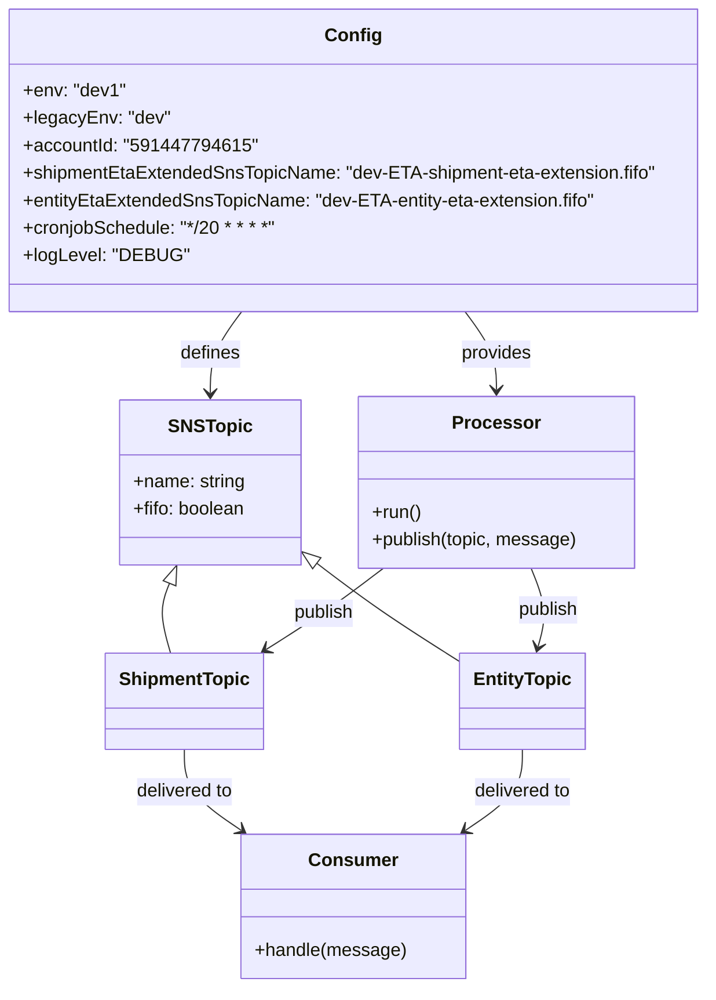
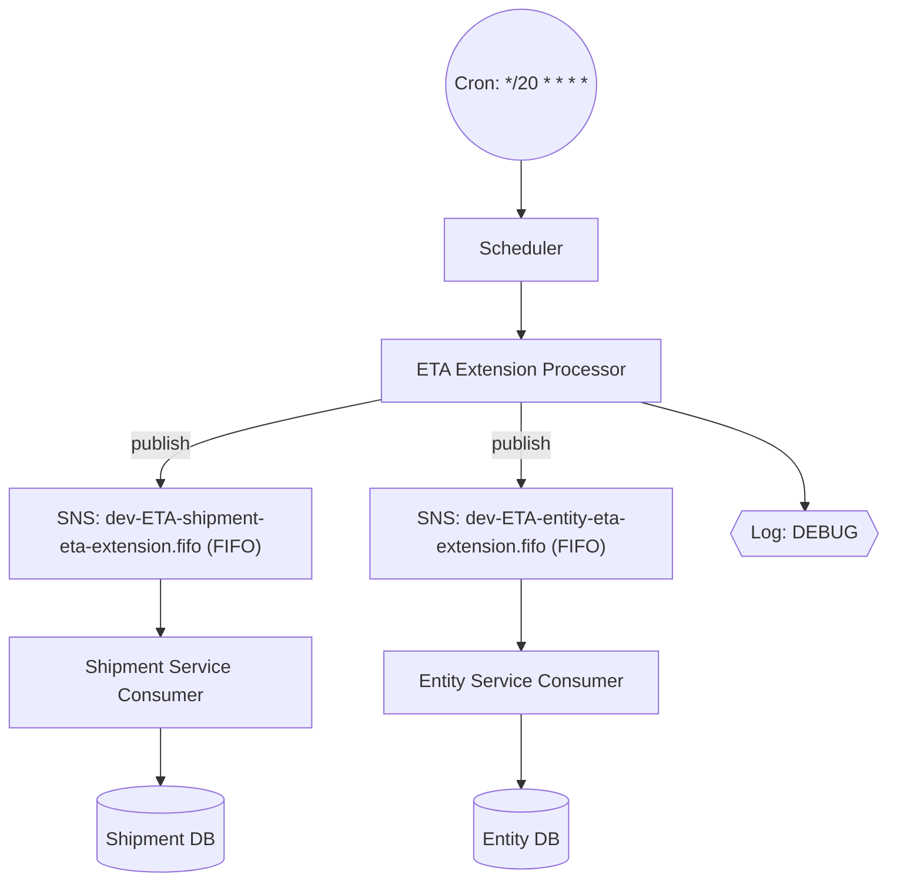

# Diagram: eta/extensions/profiles/values.dev1.yaml

> Auto-generated by Obscura crawlers

## Diagram 1

### SVG

<svg id="container" width="621.9765625" xmlns="http://www.w3.org/2000/svg" class="classDiagram" height="862" viewBox="0 0 621.9765625 862" role="graphics-document document" aria-roledescription="class"><g><defs><marker id="container_class-aggregationStart" class="marker aggregation class" refX="18" refY="7" markerWidth="190" markerHeight="240" orient="auto"><path d="M 18,7 L9,13 L1,7 L9,1 Z"></path></marker></defs><defs><marker id="container_class-aggregationEnd" class="marker aggregation class" refX="1" refY="7" markerWidth="20" markerHeight="28" orient="auto"><path d="M 18,7 L9,13 L1,7 L9,1 Z"></path></marker></defs><defs><marker id="container_class-extensionStart" class="marker extension class" refX="18" refY="7" markerWidth="190" markerHeight="240" orient="auto"><path d="M 1,7 L18,13 V 1 Z"></path></marker></defs><defs><marker id="container_class-extensionEnd" class="marker extension class" refX="1" refY="7" markerWidth="20" markerHeight="28" orient="auto"><path d="M 1,1 V 13 L18,7 Z"></path></marker></defs><defs><marker id="container_class-compositionStart" class="marker composition class" refX="18" refY="7" markerWidth="190" markerHeight="240" orient="auto"><path d="M 18,7 L9,13 L1,7 L9,1 Z"></path></marker></defs><defs><marker id="container_class-compositionEnd" class="marker composition class" refX="1" refY="7" markerWidth="20" markerHeight="28" orient="auto"><path d="M 18,7 L9,13 L1,7 L9,1 Z"></path></marker></defs><defs><marker id="container_class-dependencyStart" class="marker dependency class" refX="6" refY="7" markerWidth="190" markerHeight="240" orient="auto"><path d="M 5,7 L9,13 L1,7 L9,1 Z"></path></marker></defs><defs><marker id="container_class-dependencyEnd" class="marker dependency class" refX="13" refY="7" markerWidth="20" markerHeight="28" orient="auto"><path d="M 18,7 L9,13 L14,7 L9,1 Z"></path></marker></defs><defs><marker id="container_class-lollipopStart" class="marker lollipop class" refX="13" refY="7" markerWidth="190" markerHeight="240" orient="auto"><circle stroke="black" fill="transparent" cx="7" cy="7" r="6"></circle></marker></defs><defs><marker id="container_class-lollipopEnd" class="marker lollipop class" refX="1" refY="7" markerWidth="190" markerHeight="240" orient="auto"><circle stroke="black" fill="transparent" cx="7" cy="7" r="6"></circle></marker></defs><g class="root"><g class="clusters"></g><g class="edgePaths"><path d="M407.946,272L412.475,278.167C417.005,284.333,426.064,296.667,430.593,308C435.123,319.333,435.123,329.667,435.123,334.833L435.123,340" id="id_Config_Processor_1" class="edge-thickness-normal edge-pattern-solid relation" style=";;;" data-edge="true" data-et="edge" data-id="id_Config_Processor_1" data-points="W3sieCI6NDA3Ljk0NTYxMjk4MDc2OTIsInkiOjI3Mn0seyJ4Ijo0MzUuMTIzMDQ2ODc1LCJ5IjozMDl9LHsieCI6NDM1LjEyMzA0Njg3NSwieSI6MzQ2fV0=" marker-end="url(#container_class-dependencyEnd)"></path><path d="M214.031,272L209.501,278.167C204.972,284.333,195.913,296.667,191.383,308.5C186.854,320.333,186.854,331.667,186.854,337.333L186.854,343" id="id_Config_SNSTopic_2" class="edge-thickness-normal edge-pattern-solid relation" style=";;;" data-edge="true" data-et="edge" data-id="id_Config_SNSTopic_2" data-points="W3sieCI6MjE0LjAzMDk0OTUxOTIzMDc3LCJ5IjoyNzJ9LHsieCI6MTg2Ljg1MzUxNTYyNSwieSI6MzA5fSx7IngiOjE4Ni44NTM1MTU2MjUsInkiOjM0OX1d" marker-end="url(#container_class-dependencyEnd)"></path><path d="M149.821,508.897L148.129,512.914C146.436,516.931,143.051,524.966,143.2,535.149C143.349,545.333,147.033,557.667,148.875,563.833L150.716,570" id="id_SNSTopic_ShipmentTopic_3" class="edge-thickness-normal edge-pattern-solid relation" style=";;;" data-edge="true" data-et="edge" data-id="id_SNSTopic_ShipmentTopic_3" data-points="W3sieCI6MTU2LjUxODY5NDE5NjQyODU4LCJ5Ijo0OTN9LHsieCI6MTM5LjY2NjAxNTYyNSwieSI6NTMzfSx7IngiOjE1MC43MTYyNTI5NjY3NzIxNSwieSI6NTcwfV0=" marker-start="url(#container_class-extensionStart)"></path><path d="M278.963,490.832L288.233,497.86C297.503,504.888,316.042,518.944,337.217,533.549C358.393,548.153,382.203,563.306,394.108,570.883L406.014,578.459" id="id_SNSTopic_EntityTopic_4" class="edge-thickness-normal edge-pattern-solid relation" style=";;;" data-edge="true" data-et="edge" data-id="id_SNSTopic_EntityTopic_4" data-points="W3sieCI6MjY1LjIxNjc5Njg3NSwieSI6NDgwLjQxMDkyMzIyNTQwNTU1fSx7IngiOjMzNC41ODIwMzEyNSwieSI6NTMzfSx7IngiOjQwNi4wMTM2NzE4NzUsInkiOjU3OC40NTk0NjE1ODU2NjMyfV0=" marker-start="url(#container_class-extensionStart)"></path><path d="M336.198,496L328.064,502.167C319.93,508.333,303.662,520.667,286.682,532.463C269.702,544.26,252.01,555.519,243.164,561.149L234.317,566.779" id="id_Processor_ShipmentTopic_5" class="edge-thickness-normal edge-pattern-solid relation" style=";;;" data-edge="true" data-et="edge" data-id="id_Processor_ShipmentTopic_5" data-points="W3sieCI6MzM2LjE5NzcwMTU5MDQwMTgsInkiOjQ5Nn0seyJ4IjoyODcuMzk0NTMxMjUsInkiOjUzM30seyJ4IjoyMjkuMjU1NDYzODA1Mzc5NzUsInkiOjU3MH1d" marker-end="url(#container_class-dependencyEnd)"></path><path d="M466.722,496L469.32,502.167C471.918,508.333,477.114,520.667,478.157,532.042C479.199,543.417,476.088,553.834,474.533,559.042L472.977,564.251" id="id_Processor_EntityTopic_6" class="edge-thickness-normal edge-pattern-solid relation" style=";;;" data-edge="true" data-et="edge" data-id="id_Processor_EntityTopic_6" data-points="W3sieCI6NDY2LjcyMTgxOTE5NjQyODU2LCJ5Ijo0OTZ9LHsieCI6NDgyLjMxMDU0Njg3NSwieSI6NTMzfSx7IngiOjQ3MS4yNjAzMDk1MzMyMjc4LCJ5Ijo1NzB9XQ==" marker-end="url(#container_class-dependencyEnd)"></path><path d="M163.26,654L163.26,660.167C163.26,666.333,163.26,678.667,171.542,690.439C179.823,702.212,196.387,713.424,204.669,719.031L212.951,724.637" id="id_ShipmentTopic_Consumer_7" class="edge-thickness-normal edge-pattern-solid relation" style=";;;" data-edge="true" data-et="edge" data-id="id_ShipmentTopic_Consumer_7" data-points="W3sieCI6MTYzLjI1OTc2NTYyNSwieSI6NjU0fSx7IngiOjE2My4yNTk3NjU2MjUsInkiOjY5MX0seyJ4IjoyMTcuOTE5MzE2NDA2MjUsInkiOjcyOH1d" marker-end="url(#container_class-dependencyEnd)"></path><path d="M458.717,654L458.717,660.167C458.717,666.333,458.717,678.667,450.435,690.439C442.153,702.212,425.59,713.424,417.308,719.031L409.026,724.637" id="id_EntityTopic_Consumer_8" class="edge-thickness-normal edge-pattern-solid relation" style=";;;" data-edge="true" data-et="edge" data-id="id_EntityTopic_Consumer_8" data-points="W3sieCI6NDU4LjcxNjc5Njg3NSwieSI6NjU0fSx7IngiOjQ1OC43MTY3OTY4NzUsInkiOjY5MX0seyJ4Ijo0MDQuMDU3MjQ2MDkzNzUsInkiOjcyOH1d" marker-end="url(#container_class-dependencyEnd)"></path></g><g class="edgeLabels"><g class="edgeLabel" transform="translate(435.123046875, 309)"><g class="label" data-id="id_Config_Processor_1" transform="translate(-31.3125, -12)"><foreignObject width="62.625" height="24">

provides

</foreignObject></g></g><g class="edgeLabel" transform="translate(186.853515625, 309)"><g class="label" data-id="id_Config_SNSTopic_2" transform="translate(-26.53125, -12)"><foreignObject width="53.0625" height="24">

defines

</foreignObject></g></g><g class="edgeLabel"><g class="label" data-id="id_SNSTopic_ShipmentTopic_3" transform="translate(0, 0)"><foreignObject width="0" height="0">

</foreignObject></g></g><g class="edgeLabel"><g class="label" data-id="id_SNSTopic_EntityTopic_4" transform="translate(0, 0)"><foreignObject width="0" height="0">

</foreignObject></g></g><g class="edgeLabel" transform="translate(287.39453125, 533)"><g class="label" data-id="id_Processor_ShipmentTopic_5" transform="translate(-27.1875, -12)"><foreignObject width="54.375" height="24">

publish

</foreignObject></g></g><g class="edgeLabel" transform="translate(482.01256, 532.29273)"><g class="label" data-id="id_Processor_EntityTopic_6" transform="translate(-27.1875, -12)"><foreignObject width="54.375" height="24">

publish

</foreignObject></g></g><g class="edgeLabel" transform="translate(163.259765625, 691)"><g class="label" data-id="id_ShipmentTopic_Consumer_7" transform="translate(-43.5625, -12)"><foreignObject width="87.125" height="24">

delivered to

</foreignObject></g></g><g class="edgeLabel" transform="translate(458.716796875, 691)"><g class="label" data-id="id_EntityTopic_Consumer_8" transform="translate(-43.5625, -12)"><foreignObject width="87.125" height="24">

delivered to

</foreignObject></g></g></g><g class="nodes"><g class="node default" id="classId-Config-0" transform="translate(310.98828125, 140)"><g class="basic label-container"><path d="M-302.98828125 -132 L302.98828125 -132 L302.98828125 132 L-302.98828125 132" stroke="none" stroke-width="0" fill="#ECECFF" style=""></path><path d="M-302.98828125 -132 C-79.94101166012203 -132, 143.10625792975594 -132, 302.98828125 -132 M-302.98828125 -132 C-117.06290205810501 -132, 68.86247713378998 -132, 302.98828125 -132 M302.98828125 -132 C302.98828125 -73.87941367057346, 302.98828125 -15.758827341146926, 302.98828125 132 M302.98828125 -132 C302.98828125 -46.724408932235576, 302.98828125 38.55118213552885, 302.98828125 132 M302.98828125 132 C159.62679844353858 132, 16.26531563707715 132, -302.98828125 132 M302.98828125 132 C70.8592739552312 132, -161.2697333395376 132, -302.98828125 132 M-302.98828125 132 C-302.98828125 65.49291790395736, -302.98828125 -1.0141641920852749, -302.98828125 -132 M-302.98828125 132 C-302.98828125 32.94114080932462, -302.98828125 -66.11771838135076, -302.98828125 -132" stroke="#9370DB" stroke-width="1.3" fill="none" stroke-dasharray="0 0" style=""></path></g><g class="annotation-group text" transform="translate(0, -108)"></g><g class="label-group text" transform="translate(-22.9296875, -108)"><g class="label" style="font-weight: bolder" transform="translate(0,-12)"><foreignObject width="45.859375" height="24">

Config

</foreignObject></g></g><g class="members-group text" transform="translate(-290.98828125, -60)"><g class="label" style="" transform="translate(0,-12)"><foreignObject width="87.625" height="24">

+env: "dev1"

</foreignObject></g><g class="label" style="" transform="translate(0,12)"><foreignObject width="125.9375" height="24">

+legacyEnv: "dev"

</foreignObject></g><g class="label" style="" transform="translate(0,36)"><foreignObject width="192.359375" height="24">

+accountId: "591447794615"

</foreignObject></g><g class="label" style="" transform="translate(0,60)"><foreignObject width="559.046875" height="24">

+shipmentEtaExtendedSnsTopicName: "dev-ETA-shipment-eta-extension.fifo"

</foreignObject></g><g class="label" style="" transform="translate(0,84)"><foreignObject width="506.53125" height="24">

+entityEtaExtendedSnsTopicName: "dev-ETA-entity-eta-extension.fifo"

</foreignObject></g><g class="label" style="" transform="translate(0,108)"><foreignObject width="226.546875" height="24">

+cronjobSchedule: "*/20 * * * *"

</foreignObject></g><g class="label" style="" transform="translate(0,132)"><foreignObject width="137.828125" height="24">

+logLevel: "DEBUG"

</foreignObject></g></g><g class="methods-group text" transform="translate(-290.98828125, 132)"></g><g class="divider" style=""><path d="M-302.98828125 -84 C-78.46046806225516 -84, 146.06734512548968 -84, 302.98828125 -84 M-302.98828125 -84 C-112.59175147018078 -84, 77.80477830963844 -84, 302.98828125 -84" stroke="#9370DB" stroke-width="1.3" fill="none" stroke-dasharray="0 0" style=""></path></g><g class="divider" style=""><path d="M-302.98828125 108 C-110.25746547082417 108, 82.47335030835166 108, 302.98828125 108 M-302.98828125 108 C-175.47155657850948 108, -47.95483190701893 108, 302.98828125 108" stroke="#9370DB" stroke-width="1.3" fill="none" stroke-dasharray="0 0" style=""></path></g></g><g class="node default" id="classId-SNSTopic-1" transform="translate(186.853515625, 421)"><g class="basic label-container"><path d="M-78.36328125 -72 L78.36328125 -72 L78.36328125 72 L-78.36328125 72" stroke="none" stroke-width="0" fill="#ECECFF" style=""></path><path d="M-78.36328125 -72 C-44.584822922330964 -72, -10.806364594661929 -72, 78.36328125 -72 M-78.36328125 -72 C-29.879051544240312 -72, 18.605178161519376 -72, 78.36328125 -72 M78.36328125 -72 C78.36328125 -37.395820045452965, 78.36328125 -2.791640090905929, 78.36328125 72 M78.36328125 -72 C78.36328125 -40.961475442872924, 78.36328125 -9.922950885745848, 78.36328125 72 M78.36328125 72 C16.52010669659611 72, -45.32306785680778 72, -78.36328125 72 M78.36328125 72 C21.863774655261253 72, -34.635731939477495 72, -78.36328125 72 M-78.36328125 72 C-78.36328125 25.83485005271703, -78.36328125 -20.33029989456594, -78.36328125 -72 M-78.36328125 72 C-78.36328125 33.176159516835824, -78.36328125 -5.647680966328352, -78.36328125 -72" stroke="#9370DB" stroke-width="1.3" fill="none" stroke-dasharray="0 0" style=""></path></g><g class="annotation-group text" transform="translate(0, -48)"></g><g class="label-group text" transform="translate(-33.7109375, -48)"><g class="label" style="font-weight: bolder" transform="translate(0,-12)"><foreignObject width="67.421875" height="24">

SNSTopic

</foreignObject></g></g><g class="members-group text" transform="translate(-66.36328125, 0)"><g class="label" style="" transform="translate(0,-12)"><foreignObject width="98.21875" height="24">

+name: string

</foreignObject></g><g class="label" style="" transform="translate(0,12)"><foreignObject width="99.015625" height="24">

+fifo: boolean

</foreignObject></g></g><g class="methods-group text" transform="translate(-66.36328125, 72)"></g><g class="divider" style=""><path d="M-78.36328125 -24 C-34.3848137542643 -24, 9.5936537414714 -24, 78.36328125 -24 M-78.36328125 -24 C-39.48335080502246 -24, -0.6034203600449217 -24, 78.36328125 -24" stroke="#9370DB" stroke-width="1.3" fill="none" stroke-dasharray="0 0" style=""></path></g><g class="divider" style=""><path d="M-78.36328125 48 C-43.261073341144076 48, -8.158865432288152 48, 78.36328125 48 M-78.36328125 48 C-22.30009799803007 48, 33.76308525393986 48, 78.36328125 48" stroke="#9370DB" stroke-width="1.3" fill="none" stroke-dasharray="0 0" style=""></path></g></g><g class="node default" id="classId-Processor-2" transform="translate(435.123046875, 421)"><g class="basic label-container"><path d="M-119.90625 -75 L119.90625 -75 L119.90625 75 L-119.90625 75" stroke="none" stroke-width="0" fill="#ECECFF" style=""></path><path d="M-119.90625 -75 C-46.83487215438443 -75, 26.236505691231145 -75, 119.90625 -75 M-119.90625 -75 C-29.5733352052887 -75, 60.7595795894226 -75, 119.90625 -75 M119.90625 -75 C119.90625 -20.838790513395182, 119.90625 33.322418973209636, 119.90625 75 M119.90625 -75 C119.90625 -31.313748534565434, 119.90625 12.372502930869132, 119.90625 75 M119.90625 75 C67.34005835306266 75, 14.773866706125332 75, -119.90625 75 M119.90625 75 C23.988483713946465 75, -71.92928257210707 75, -119.90625 75 M-119.90625 75 C-119.90625 23.95063907189813, -119.90625 -27.09872185620374, -119.90625 -75 M-119.90625 75 C-119.90625 28.69093402108006, -119.90625 -17.61813195783988, -119.90625 -75" stroke="#9370DB" stroke-width="1.3" fill="none" stroke-dasharray="0 0" style=""></path></g><g class="annotation-group text" transform="translate(0, -51)"></g><g class="label-group text" transform="translate(-35.921875, -51)"><g class="label" style="font-weight: bolder" transform="translate(0,-12)"><foreignObject width="71.84375" height="24">

Processor

</foreignObject></g></g><g class="members-group text" transform="translate(-107.90625, -3)"></g><g class="methods-group text" transform="translate(-107.90625, 27)"><g class="label" style="" transform="translate(0,-12)"><foreignObject width="43.21875" height="24">

+run()

</foreignObject></g><g class="label" style="" transform="translate(0,12)"><foreignObject width="179.890625" height="24">

+publish(topic, message)

</foreignObject></g></g><g class="divider" style=""><path d="M-119.90625 -27 C-45.61728506624823 -27, 28.671679867503542 -27, 119.90625 -27 M-119.90625 -27 C-30.192777827696972 -27, 59.520694344606056 -27, 119.90625 -27" stroke="#9370DB" stroke-width="1.3" fill="none" stroke-dasharray="0 0" style=""></path></g><g class="divider" style=""><path d="M-119.90625 -3 C-43.04697878960785 -3, 33.8122924207843 -3, 119.90625 -3 M-119.90625 -3 C-35.32888738728312 -3, 49.248475225433765 -3, 119.90625 -3" stroke="#9370DB" stroke-width="1.3" fill="none" stroke-dasharray="0 0" style=""></path></g></g><g class="node default" id="classId-Consumer-3" transform="translate(310.98828125, 791)"><g class="basic label-container"><path d="M-95.82421875 -63 L95.82421875 -63 L95.82421875 63 L-95.82421875 63" stroke="none" stroke-width="0" fill="#ECECFF" style=""></path><path d="M-95.82421875 -63 C-39.12517318056669 -63, 17.57387238886662 -63, 95.82421875 -63 M-95.82421875 -63 C-56.26345565793137 -63, -16.702692565862733 -63, 95.82421875 -63 M95.82421875 -63 C95.82421875 -17.723847943240273, 95.82421875 27.552304113519455, 95.82421875 63 M95.82421875 -63 C95.82421875 -34.755058590812865, 95.82421875 -6.510117181625731, 95.82421875 63 M95.82421875 63 C31.131499044522712 63, -33.561220660954575 63, -95.82421875 63 M95.82421875 63 C28.983900740938097 63, -37.856417268123806 63, -95.82421875 63 M-95.82421875 63 C-95.82421875 29.474606889143473, -95.82421875 -4.050786221713054, -95.82421875 -63 M-95.82421875 63 C-95.82421875 35.45517159479425, -95.82421875 7.910343189588502, -95.82421875 -63" stroke="#9370DB" stroke-width="1.3" fill="none" stroke-dasharray="0 0" style=""></path></g><g class="annotation-group text" transform="translate(0, -39)"></g><g class="label-group text" transform="translate(-36.5546875, -39)"><g class="label" style="font-weight: bolder" transform="translate(0,-12)"><foreignObject width="73.109375" height="24">

Consumer

</foreignObject></g></g><g class="members-group text" transform="translate(-83.82421875, 9)"></g><g class="methods-group text" transform="translate(-83.82421875, 39)"><g class="label" style="" transform="translate(0,-12)"><foreignObject width="131.09375" height="24">

+handle(message)

</foreignObject></g></g><g class="divider" style=""><path d="M-95.82421875 -15 C-55.940655797557376 -15, -16.057092845114752 -15, 95.82421875 -15 M-95.82421875 -15 C-22.615519035078748 -15, 50.593180679842504 -15, 95.82421875 -15" stroke="#9370DB" stroke-width="1.3" fill="none" stroke-dasharray="0 0" style=""></path></g><g class="divider" style=""><path d="M-95.82421875 9 C-33.7061971737403 9, 28.4118244025194 9, 95.82421875 9 M-95.82421875 9 C-53.015106126205964 9, -10.205993502411928 9, 95.82421875 9" stroke="#9370DB" stroke-width="1.3" fill="none" stroke-dasharray="0 0" style=""></path></g></g><g class="node default" id="classId-ShipmentTopic-4" transform="translate(163.259765625, 612)"><g class="basic label-container"><path d="M-66.5234375 -42 L66.5234375 -42 L66.5234375 42 L-66.5234375 42" stroke="none" stroke-width="0" fill="#ECECFF" style=""></path><path d="M-66.5234375 -42 C-20.710013357854365 -42, 25.10341078429127 -42, 66.5234375 -42 M-66.5234375 -42 C-14.678286676298782 -42, 37.166864147402435 -42, 66.5234375 -42 M66.5234375 -42 C66.5234375 -9.510945890943333, 66.5234375 22.978108218113334, 66.5234375 42 M66.5234375 -42 C66.5234375 -17.51749855471433, 66.5234375 6.965002890571341, 66.5234375 42 M66.5234375 42 C25.73784052679006 42, -15.047756446419882 42, -66.5234375 42 M66.5234375 42 C32.2354712723649 42, -2.0524949552702054 42, -66.5234375 42 M-66.5234375 42 C-66.5234375 16.43544072315089, -66.5234375 -9.12911855369822, -66.5234375 -42 M-66.5234375 42 C-66.5234375 19.768814915389374, -66.5234375 -2.462370169221252, -66.5234375 -42" stroke="#9370DB" stroke-width="1.3" fill="none" stroke-dasharray="0 0" style=""></path></g><g class="annotation-group text" transform="translate(0, -18)"></g><g class="label-group text" transform="translate(-54.5234375, -18)"><g class="label" style="font-weight: bolder" transform="translate(0,-12)"><foreignObject width="109.046875" height="24">

ShipmentTopic

</foreignObject></g></g><g class="members-group text" transform="translate(-54.5234375, 30)"></g><g class="methods-group text" transform="translate(-54.5234375, 60)"></g><g class="divider" style=""><path d="M-66.5234375 6 C-13.610199917129997 6, 39.30303766574001 6, 66.5234375 6 M-66.5234375 6 C-33.129764378881816 6, 0.2639087422363673 6, 66.5234375 6" stroke="#9370DB" stroke-width="1.3" fill="none" stroke-dasharray="0 0" style=""></path></g><g class="divider" style=""><path d="M-66.5234375 24 C-24.492925351080423 24, 17.537586797839154 24, 66.5234375 24 M-66.5234375 24 C-15.968336809940226 24, 34.58676388011955 24, 66.5234375 24" stroke="#9370DB" stroke-width="1.3" fill="none" stroke-dasharray="0 0" style=""></path></g></g><g class="node default" id="classId-EntityTopic-5" transform="translate(458.716796875, 612)"><g class="basic label-container"><path d="M-52.703125 -42 L52.703125 -42 L52.703125 42 L-52.703125 42" stroke="none" stroke-width="0" fill="#ECECFF" style=""></path><path d="M-52.703125 -42 C-30.28029752963477 -42, -7.857470059269538 -42, 52.703125 -42 M-52.703125 -42 C-16.497610638352747 -42, 19.707903723294507 -42, 52.703125 -42 M52.703125 -42 C52.703125 -10.649971953312516, 52.703125 20.700056093374968, 52.703125 42 M52.703125 -42 C52.703125 -19.639919904177052, 52.703125 2.7201601916458955, 52.703125 42 M52.703125 42 C14.975359426979722 42, -22.752406146040556 42, -52.703125 42 M52.703125 42 C15.030056594692816 42, -22.643011810614368 42, -52.703125 42 M-52.703125 42 C-52.703125 20.93348020577153, -52.703125 -0.13303958845693842, -52.703125 -42 M-52.703125 42 C-52.703125 23.553116919365202, -52.703125 5.106233838730404, -52.703125 -42" stroke="#9370DB" stroke-width="1.3" fill="none" stroke-dasharray="0 0" style=""></path></g><g class="annotation-group text" transform="translate(0, -18)"></g><g class="label-group text" transform="translate(-40.703125, -18)"><g class="label" style="font-weight: bolder" transform="translate(0,-12)"><foreignObject width="81.40625" height="24">

EntityTopic

</foreignObject></g></g><g class="members-group text" transform="translate(-40.703125, 30)"></g><g class="methods-group text" transform="translate(-40.703125, 60)"></g><g class="divider" style=""><path d="M-52.703125 6 C-22.62042091526648 6, 7.462283169467042 6, 52.703125 6 M-52.703125 6 C-12.97277488262511 6, 26.75757523474978 6, 52.703125 6" stroke="#9370DB" stroke-width="1.3" fill="none" stroke-dasharray="0 0" style=""></path></g><g class="divider" style=""><path d="M-52.703125 24 C-27.34036193369978 24, -1.977598867399557 24, 52.703125 24 M-52.703125 24 C-11.885368227335974 24, 28.932388545328052 24, 52.703125 24" stroke="#9370DB" stroke-width="1.3" fill="none" stroke-dasharray="0 0" style=""></path></g></g></g></g></g></svg>

## Diagram 2

### SVG

<svg id="container" width="776.109375" xmlns="http://www.w3.org/2000/svg" class="flowchart" height="759.4693603515625" viewBox="0 0 776.109375 759.4693603515625" role="graphics-document document" aria-roledescription="flowchart-v2"><g><marker id="container_flowchart-v2-pointEnd" class="marker flowchart-v2" viewBox="0 0 10 10" refX="5" refY="5" markerUnits="userSpaceOnUse" markerWidth="8" markerHeight="8" orient="auto"><path d="M 0 0 L 10 5 L 0 10 z" class="arrowMarkerPath" style="stroke-width: 1; stroke-dasharray: 1, 0;"></path></marker><marker id="container_flowchart-v2-pointStart" class="marker flowchart-v2" viewBox="0 0 10 10" refX="4.5" refY="5" markerUnits="userSpaceOnUse" markerWidth="8" markerHeight="8" orient="auto"><path d="M 0 5 L 10 10 L 10 0 z" class="arrowMarkerPath" style="stroke-width: 1; stroke-dasharray: 1, 0;"></path></marker><marker id="container_flowchart-v2-circleEnd" class="marker flowchart-v2" viewBox="0 0 10 10" refX="11" refY="5" markerUnits="userSpaceOnUse" markerWidth="11" markerHeight="11" orient="auto"><circle cx="5" cy="5" r="5" class="arrowMarkerPath" style="stroke-width: 1; stroke-dasharray: 1, 0;"></circle></marker><marker id="container_flowchart-v2-circleStart" class="marker flowchart-v2" viewBox="0 0 10 10" refX="-1" refY="5" markerUnits="userSpaceOnUse" markerWidth="11" markerHeight="11" orient="auto"><circle cx="5" cy="5" r="5" class="arrowMarkerPath" style="stroke-width: 1; stroke-dasharray: 1, 0;"></circle></marker><marker id="container_flowchart-v2-crossEnd" class="marker cross flowchart-v2" viewBox="0 0 11 11" refX="12" refY="5.2" markerUnits="userSpaceOnUse" markerWidth="11" markerHeight="11" orient="auto"><path d="M 1,1 l 9,9 M 10,1 l -9,9" class="arrowMarkerPath" style="stroke-width: 2; stroke-dasharray: 1, 0;"></path></marker><marker id="container_flowchart-v2-crossStart" class="marker cross flowchart-v2" viewBox="0 0 11 11" refX="-1" refY="5.2" markerUnits="userSpaceOnUse" markerWidth="11" markerHeight="11" orient="auto"><path d="M 1,1 l 9,9 M 10,1 l -9,9" class="arrowMarkerPath" style="stroke-width: 2; stroke-dasharray: 1, 0;"></path></marker><g class="root"><g class="clusters"></g><g class="edgePaths"><path d="M448,139.547L448,143.714C448,147.88,448,156.214,448,163.88C448,171.547,448,178.547,448,182.047L448,185.547" id="L_Cron_Scheduler_0" class="edge-thickness-normal edge-pattern-solid edge-thickness-normal edge-pattern-solid flowchart-link" style=";" data-edge="true" data-et="edge" data-id="L_Cron_Scheduler_0" data-points="W3sieCI6NDQ4LCJ5IjoxMzkuNTQ2ODc1fSx7IngiOjQ0OCwieSI6MTY0LjU0Njg3NX0seyJ4Ijo0NDgsInkiOjE4OS41NDY4NzV9XQ==" marker-end="url(#container_flowchart-v2-pointEnd)"></path><path d="M448,243.547L448,247.714C448,251.88,448,260.214,448,267.88C448,275.547,448,282.547,448,286.047L448,289.547" id="L_Scheduler_Processor_0" class="edge-thickness-normal edge-pattern-solid edge-thickness-normal edge-pattern-solid flowchart-link" style=";" data-edge="true" data-et="edge" data-id="L_Scheduler_Processor_0" data-points="W3sieCI6NDQ4LCJ5IjoyNDMuNTQ2ODc1fSx7IngiOjQ0OCwieSI6MjY4LjU0Njg3NX0seyJ4Ijo0NDgsInkiOjI5My41NDY4NzV9XQ==" marker-end="url(#container_flowchart-v2-pointEnd)"></path><path d="M330.641,344.776L298.534,351.404C266.427,358.033,202.214,371.29,170.107,383.418C138,395.547,138,406.547,138,412.047L138,417.547" id="L_Processor_ShipmentTopic_0" class="edge-thickness-normal edge-pattern-solid edge-thickness-normal edge-pattern-solid flowchart-link" style=";" data-edge="true" data-et="edge" data-id="L_Processor_ShipmentTopic_0" data-points="W3sieCI6MzMwLjY0MDYyNSwieSI6MzQ0Ljc3NTkwNzI1ODA2NDU0fSx7IngiOjEzOCwieSI6Mzg0LjU0Njg3NX0seyJ4IjoxMzgsInkiOjQyMS41NDY4NzV9XQ==" marker-end="url(#container_flowchart-v2-pointEnd)"></path><path d="M448,347.547L448,353.714C448,359.88,448,372.214,448,383.88C448,395.547,448,406.547,448,412.047L448,417.547" id="L_Processor_EntityTopic_0" class="edge-thickness-normal edge-pattern-solid edge-thickness-normal edge-pattern-solid flowchart-link" style=";" data-edge="true" data-et="edge" data-id="L_Processor_EntityTopic_0" data-points="W3sieCI6NDQ4LCJ5IjozNDcuNTQ2ODc1fSx7IngiOjQ0OCwieSI6Mzg0LjU0Njg3NX0seyJ4Ijo0NDgsInkiOjQyMS41NDY4NzV9XQ==" marker-end="url(#container_flowchart-v2-pointEnd)"></path><path d="M138,499.547L138,503.714C138,507.88,138,516.214,138,523.88C138,531.547,138,538.547,138,542.047L138,545.547" id="L_ShipmentTopic_ShipmentService_0" class="edge-thickness-normal edge-pattern-solid edge-thickness-normal edge-pattern-solid flowchart-link" style=";" data-edge="true" data-et="edge" data-id="L_ShipmentTopic_ShipmentService_0" data-points="W3sieCI6MTM4LCJ5Ijo0OTkuNTQ2ODc1fSx7IngiOjEzOCwieSI6NTI0LjU0Njg3NX0seyJ4IjoxMzgsInkiOjU0OS41NDY4NzV9XQ==" marker-end="url(#container_flowchart-v2-pointEnd)"></path><path d="M448,499.547L448,503.714C448,507.88,448,516.214,448,525.88C448,535.547,448,546.547,448,552.047L448,557.547" id="L_EntityTopic_EntityService_0" class="edge-thickness-normal edge-pattern-solid edge-thickness-normal edge-pattern-solid flowchart-link" style=";" data-edge="true" data-et="edge" data-id="L_EntityTopic_EntityService_0" data-points="W3sieCI6NDQ4LCJ5Ijo0OTkuNTQ2ODc1fSx7IngiOjQ0OCwieSI6NTI0LjU0Njg3NX0seyJ4Ijo0NDgsInkiOjU2MS41NDY4NzV9XQ==" marker-end="url(#container_flowchart-v2-pointEnd)"></path><path d="M553.492,347.547L577.586,353.714C601.679,359.88,649.867,372.214,674.038,387.214C698.21,402.214,698.365,419.88,698.442,428.714L698.52,437.547" id="L_Processor_Log_0" class="edge-thickness-normal edge-pattern-solid edge-thickness-normal edge-pattern-solid flowchart-link" style=";" data-edge="true" data-et="edge" data-id="L_Processor_Log_0" data-points="W3sieCI6NTUzLjQ5MTgyMTI4OTA2MjUsInkiOjM0Ny41NDY4NzV9LHsieCI6Njk4LjA1NDY4NzUsInkiOjM4NC41NDY4NzV9LHsieCI6Njk4LjU1NDY4NzUsInkiOjQ0MS41NDY4NzV9XQ==" marker-end="url(#container_flowchart-v2-pointEnd)"></path><path d="M138,627.547L138,631.714C138,635.88,138,644.214,138,651.88C138,659.547,138,666.547,138,670.047L138,673.547" id="L_ShipmentService_DB_0" class="edge-thickness-normal edge-pattern-solid edge-thickness-normal edge-pattern-solid flowchart-link" style=";" data-edge="true" data-et="edge" data-id="L_ShipmentService_DB_0" data-points="W3sieCI6MTM4LCJ5Ijo2MjcuNTQ2ODc1fSx7IngiOjEzOCwieSI6NjUyLjU0Njg3NX0seyJ4IjoxMzgsInkiOjY3Ny41NDY4NzV9XQ==" marker-end="url(#container_flowchart-v2-pointEnd)"></path><path d="M448,615.547L448,621.714C448,627.88,448,640.214,448,650.335C448,660.456,448,668.365,448,672.319L448,676.273" id="L_EntityService_DB2_0" class="edge-thickness-normal edge-pattern-solid edge-thickness-normal edge-pattern-solid flowchart-link" style=";" data-edge="true" data-et="edge" data-id="L_EntityService_DB2_0" data-points="W3sieCI6NDQ4LCJ5Ijo2MTUuNTQ2ODc1fSx7IngiOjQ0OCwieSI6NjUyLjU0Njg3NX0seyJ4Ijo0NDgsInkiOjY4MC4yNzMzNDIxMzI1Njg0fV0=" marker-end="url(#container_flowchart-v2-pointEnd)"></path></g><g class="edgeLabels"><g class="edgeLabel"><g class="label" data-id="L_Cron_Scheduler_0" transform="translate(0, 0)"><foreignObject width="0" height="0">

</foreignObject></g></g><g class="edgeLabel"><g class="label" data-id="L_Scheduler_Processor_0" transform="translate(0, 0)"><foreignObject width="0" height="0">

</foreignObject></g></g><g class="edgeLabel" transform="translate(138, 384.546875)"><g class="label" data-id="L_Processor_ShipmentTopic_0" transform="translate(-27.1875, -12)"><foreignObject width="54.375" height="24">

publish

</foreignObject></g></g><g class="edgeLabel" transform="translate(448, 384.546875)"><g class="label" data-id="L_Processor_EntityTopic_0" transform="translate(-27.1875, -12)"><foreignObject width="54.375" height="24">

publish

</foreignObject></g></g><g class="edgeLabel"><g class="label" data-id="L_ShipmentTopic_ShipmentService_0" transform="translate(0, 0)"><foreignObject width="0" height="0">

</foreignObject></g></g><g class="edgeLabel"><g class="label" data-id="L_EntityTopic_EntityService_0" transform="translate(0, 0)"><foreignObject width="0" height="0">

</foreignObject></g></g><g class="edgeLabel"><g class="label" data-id="L_Processor_Log_0" transform="translate(0, 0)"><foreignObject width="0" height="0">

</foreignObject></g></g><g class="edgeLabel"><g class="label" data-id="L_ShipmentService_DB_0" transform="translate(0, 0)"><foreignObject width="0" height="0">

</foreignObject></g></g><g class="edgeLabel"><g class="label" data-id="L_EntityService_DB2_0" transform="translate(0, 0)"><foreignObject width="0" height="0">

</foreignObject></g></g></g><g class="nodes"><g class="node default" id="flowchart-Cron-0" transform="translate(448, 73.7734375)"><circle class="basic label-container" style="" r="65.7734375" cx="0" cy="0"></circle><g class="label" style="" transform="translate(-58.2734375, -12)"><rect></rect><foreignObject width="116.546875" height="24">

Cron: */20 * * * *

</foreignObject></g></g><g class="node default" id="flowchart-Scheduler-2" transform="translate(448, 216.546875)"><rect class="basic label-container" style="" x="-66.4296875" y="-27" width="132.859375" height="54"></rect><g class="label" style="" transform="translate(-36.4296875, -12)"><rect></rect><foreignObject width="72.859375" height="24">

Scheduler

</foreignObject></g></g><g class="node default" id="flowchart-Processor-4" transform="translate(448, 320.546875)"><rect class="basic label-container" style="" x="-117.359375" y="-27" width="234.71875" height="54"></rect><g class="label" style="" transform="translate(-87.359375, -12)"><rect></rect><foreignObject width="174.71875" height="24">

ETA Extension Processor

</foreignObject></g></g><g class="node default" id="flowchart-ShipmentTopic-6" transform="translate(138, 460.546875)"><rect class="basic label-container" style="" x="-130" y="-39" width="260" height="78"></rect><g class="label" style="" transform="translate(-100, -24)"><rect></rect><foreignObject width="200" height="48">

SNS: dev-ETA-shipment-eta-extension.fifo (FIFO)

</foreignObject></g></g><g class="node default" id="flowchart-EntityTopic-8" transform="translate(448, 460.546875)"><rect class="basic label-container" style="" x="-130" y="-39" width="260" height="78"></rect><g class="label" style="" transform="translate(-100, -24)"><rect></rect><foreignObject width="200" height="48">

SNS: dev-ETA-entity-eta-extension.fifo (FIFO)

</foreignObject></g></g><g class="node default" id="flowchart-ShipmentService-10" transform="translate(138, 588.546875)"><rect class="basic label-container" style="" x="-130" y="-39" width="260" height="78"></rect><g class="label" style="" transform="translate(-100, -24)"><rect></rect><foreignObject width="200" height="48">

Shipment Service Consumer

</foreignObject></g></g><g class="node default" id="flowchart-EntityService-12" transform="translate(448, 588.546875)"><rect class="basic label-container" style="" x="-117.4609375" y="-27" width="234.921875" height="54"></rect><g class="label" style="" transform="translate(-87.4609375, -12)"><rect></rect><foreignObject width="174.921875" height="24">

Entity Service Consumer

</foreignObject></g></g><g class="node default" id="flowchart-Log-14" transform="translate(698.0546875, 460.546875)"><g class="basic label-container"><path d="M-60.3046875 -19.5 C-46.859964614764934 -19.5, -33.41524172952987 -19.5, 0 -19.5 C12.22516182192107 -19.5, 24.45032364384214 -19.5, 60.3046875 -19.5 C63.3192302967475 -13.470914406505003, 66.333773093495 -7.441828813010005, 70.0546875 0 C66.59669931856702 6.915976362865961, 63.13871113713404 13.831952725731922, 60.3046875 19.5 C41.63574738068209 19.5, 22.96680726136418 19.5, 0 19.5 C-13.308871762291245 19.5, -26.61774352458249 19.5, -60.3046875 19.5 C-64.15170201582845 11.805970968343098, -67.9987165316569 4.111941936686197, -70.0546875 0 C-67.34796656757956 -5.413441864840885, -64.64124563515911 -10.82688372968177, -60.3046875 -19.5" stroke="none" stroke-width="0" fill="#ECECFF" style=""></path><path d="M-60.3046875 -19.5 C-36.18715850625349 -19.5, -12.069629512506978 -19.5, 0 -19.5 M-60.3046875 -19.5 C-45.18934318727713 -19.5, -30.07399887455426 -19.5, 0 -19.5 M0 -19.5 C13.834872251033007 -19.5, 27.669744502066013 -19.5, 60.3046875 -19.5 M0 -19.5 C17.706594322637546 -19.5, 35.41318864527509 -19.5, 60.3046875 -19.5 M60.3046875 -19.5 C63.784584663839084 -12.54020567232183, 67.26448182767817 -5.580411344643661, 70.0546875 0 M60.3046875 -19.5 C63.408178401654915 -13.293018196690165, 66.51166930330983 -7.086036393380329, 70.0546875 0 M70.0546875 0 C67.50492635915518 5.099522281689656, 64.95516521831034 10.199044563379312, 60.3046875 19.5 M70.0546875 0 C67.82034618577511 4.468682628449783, 65.58600487155022 8.937365256899566, 60.3046875 19.5 M60.3046875 19.5 C47.70904506029129 19.5, 35.113402620582576 19.5, 0 19.5 M60.3046875 19.5 C38.21005329135741 19.5, 16.11541908271483 19.5, 0 19.5 M0 19.5 C-16.13979536458045 19.5, -32.2795907291609 19.5, -60.3046875 19.5 M0 19.5 C-16.73277517585393 19.5, -33.46555035170786 19.5, -60.3046875 19.5 M-60.3046875 19.5 C-64.06943302030496 11.970508959390099, -67.8341785406099 4.4410179187801955, -70.0546875 0 M-60.3046875 19.5 C-63.20306989210906 13.703235215781866, -66.10145228421813 7.906470431563735, -70.0546875 0 M-70.0546875 0 C-67.0338830018238 -6.041608996352417, -64.01307850364758 -12.083217992704833, -60.3046875 -19.5 M-70.0546875 0 C-67.74690146263791 -4.615572074724177, -65.43911542527582 -9.231144149448355, -60.3046875 -19.5" stroke="#9370DB" stroke-width="1.3" fill="none" stroke-dasharray="0 0" style=""></path></g><g class="label" style="" transform="translate(-41.296875, -12)"><rect></rect><foreignObject width="82.59375" height="24">

Log: DEBUG

</foreignObject></g></g><g class="node default" id="flowchart-DB-16" transform="translate(138, 714.508129119873)"><path d="M0,11.64351542673968 a54.484375,11.64351542673968 0,0,0 108.96875,0 a54.484375,11.64351542673968 0,0,0 -108.96875,0 l0,50.64351542673968 a54.484375,11.64351542673968 0,0,0 108.96875,0 l0,-50.64351542673968" class="basic label-container" style="" transform="translate(-54.484375, -36.965273140109524)"></path><g class="label" style="" transform="translate(-46.984375, -2)"><rect></rect><foreignObject width="93.96875" height="24">

Shipment DB

</foreignObject></g></g><g class="node default" id="flowchart-DB2-18" transform="translate(448, 714.508129119873)"><path d="M0,9.823190165427228 a40.453125,9.823190165427228 0,0,0 80.90625,0 a40.453125,9.823190165427228 0,0,0 -80.90625,0 l0,48.82319016542723 a40.453125,9.823190165427228 0,0,0 80.90625,0 l0,-48.82319016542723" class="basic label-container" style="" transform="translate(-40.453125, -34.23478524814084)"></path><g class="label" style="" transform="translate(-32.953125, -2)"><rect></rect><foreignObject width="65.90625" height="24">

Entity DB

</foreignObject></g></g></g></g></g></svg>
