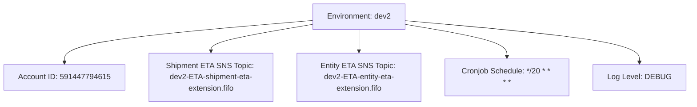

# Diagram: eta/extensions/profiles/values.dev2.yaml

> Auto-generated by Obscura crawlers

## Mermaid

### SVG

<svg id="container" width="1418.203125" xmlns="http://www.w3.org/2000/svg" class="flowchart" height="222" viewBox="0 0 1418.203125 222" role="graphics-document document" aria-roledescription="flowchart-v2"><g><marker id="container_flowchart-v2-pointEnd" class="marker flowchart-v2" viewBox="0 0 10 10" refX="5" refY="5" markerUnits="userSpaceOnUse" markerWidth="8" markerHeight="8" orient="auto"><path d="M 0 0 L 10 5 L 0 10 z" class="arrowMarkerPath" style="stroke-width: 1; stroke-dasharray: 1, 0;"></path></marker><marker id="container_flowchart-v2-pointStart" class="marker flowchart-v2" viewBox="0 0 10 10" refX="4.5" refY="5" markerUnits="userSpaceOnUse" markerWidth="8" markerHeight="8" orient="auto"><path d="M 0 5 L 10 10 L 10 0 z" class="arrowMarkerPath" style="stroke-width: 1; stroke-dasharray: 1, 0;"></path></marker><marker id="container_flowchart-v2-circleEnd" class="marker flowchart-v2" viewBox="0 0 10 10" refX="11" refY="5" markerUnits="userSpaceOnUse" markerWidth="11" markerHeight="11" orient="auto"><circle cx="5" cy="5" r="5" class="arrowMarkerPath" style="stroke-width: 1; stroke-dasharray: 1, 0;"></circle></marker><marker id="container_flowchart-v2-circleStart" class="marker flowchart-v2" viewBox="0 0 10 10" refX="-1" refY="5" markerUnits="userSpaceOnUse" markerWidth="11" markerHeight="11" orient="auto"><circle cx="5" cy="5" r="5" class="arrowMarkerPath" style="stroke-width: 1; stroke-dasharray: 1, 0;"></circle></marker><marker id="container_flowchart-v2-crossEnd" class="marker cross flowchart-v2" viewBox="0 0 11 11" refX="12" refY="5.2" markerUnits="userSpaceOnUse" markerWidth="11" markerHeight="11" orient="auto"><path d="M 1,1 l 9,9 M 10,1 l -9,9" class="arrowMarkerPath" style="stroke-width: 2; stroke-dasharray: 1, 0;"></path></marker><marker id="container_flowchart-v2-crossStart" class="marker cross flowchart-v2" viewBox="0 0 11 11" refX="-1" refY="5.2" markerUnits="userSpaceOnUse" markerWidth="11" markerHeight="11" orient="auto"><path d="M 1,1 l 9,9 M 10,1 l -9,9" class="arrowMarkerPath" style="stroke-width: 2; stroke-dasharray: 1, 0;"></path></marker><g class="root"><g class="clusters"></g><g class="edgePaths"><path d="M638.734,43.287L553.426,50.572C468.117,57.858,297.5,72.429,212.191,87.214C126.883,102,126.883,117,126.883,124.5L126.883,132" id="L_Env_Account_0" class="edge-thickness-normal edge-pattern-solid edge-thickness-normal edge-pattern-solid flowchart-link" style=";" data-edge="true" data-et="edge" data-id="L_Env_Account_0" data-points="W3sieCI6NjM4LjczNDM3NSwieSI6NDMuMjg2NjkzMDk4MjcxNjg0fSx7IngiOjEyNi44ODI4MTI1LCJ5Ijo4N30seyJ4IjoxMjYuODgyODEyNSwieSI6MTM2fV0=" marker-end="url(#container_flowchart-v2-pointEnd)"></path><path d="M638.734,51.276L603.24,57.23C567.745,63.184,496.755,75.092,461.26,84.546C425.766,94,425.766,101,425.766,104.5L425.766,108" id="L_Env_ShipmentTopic_0" class="edge-thickness-normal edge-pattern-solid edge-thickness-normal edge-pattern-solid flowchart-link" style=";" data-edge="true" data-et="edge" data-id="L_Env_ShipmentTopic_0" data-points="W3sieCI6NjM4LjczNDM3NSwieSI6NTEuMjc2MjA5Njc3NDE5MzZ9LHsieCI6NDI1Ljc2NTYyNSwieSI6ODd9LHsieCI6NDI1Ljc2NTYyNSwieSI6MTEyfV0=" marker-end="url(#container_flowchart-v2-pointEnd)"></path><path d="M735.766,62L735.766,66.167C735.766,70.333,735.766,78.667,735.766,86.333C735.766,94,735.766,101,735.766,104.5L735.766,108" id="L_Env_EntityTopic_0" class="edge-thickness-normal edge-pattern-solid edge-thickness-normal edge-pattern-solid flowchart-link" style=";" data-edge="true" data-et="edge" data-id="L_Env_EntityTopic_0" data-points="W3sieCI6NzM1Ljc2NTYyNSwieSI6NjJ9LHsieCI6NzM1Ljc2NTYyNSwieSI6ODd9LHsieCI6NzM1Ljc2NTYyNSwieSI6MTEyfV0=" marker-end="url(#container_flowchart-v2-pointEnd)"></path><path d="M832.797,51.276L868.292,57.23C903.786,63.184,974.776,75.092,1010.271,86.546C1045.766,98,1045.766,109,1045.766,114.5L1045.766,120" id="L_Env_Cron_0" class="edge-thickness-normal edge-pattern-solid edge-thickness-normal edge-pattern-solid flowchart-link" style=";" data-edge="true" data-et="edge" data-id="L_Env_Cron_0" data-points="W3sieCI6ODMyLjc5Njg3NSwieSI6NTEuMjc2MjA5Njc3NDE5MzZ9LHsieCI6MTA0NS43NjU2MjUsInkiOjg3fSx7IngiOjEwNDUuNzY1NjI1LCJ5IjoxMjR9XQ==" marker-end="url(#container_flowchart-v2-pointEnd)"></path><path d="M832.797,43.666L913.661,50.889C994.526,58.111,1156.255,72.555,1237.12,87.278C1317.984,102,1317.984,117,1317.984,124.5L1317.984,132" id="L_Env_Log_0" class="edge-thickness-normal edge-pattern-solid edge-thickness-normal edge-pattern-solid flowchart-link" style=";" data-edge="true" data-et="edge" data-id="L_Env_Log_0" data-points="W3sieCI6ODMyLjc5Njg3NSwieSI6NDMuNjY2MjAxNDkyMTM2NzY0fSx7IngiOjEzMTcuOTg0Mzc1LCJ5Ijo4N30seyJ4IjoxMzE3Ljk4NDM3NSwieSI6MTM2fV0=" marker-end="url(#container_flowchart-v2-pointEnd)"></path></g><g class="edgeLabels"><g class="edgeLabel"><g class="label" data-id="L_Env_Account_0" transform="translate(0, 0)"><foreignObject width="0" height="0">

</foreignObject></g></g><g class="edgeLabel"><g class="label" data-id="L_Env_ShipmentTopic_0" transform="translate(0, 0)"><foreignObject width="0" height="0">

</foreignObject></g></g><g class="edgeLabel"><g class="label" data-id="L_Env_EntityTopic_0" transform="translate(0, 0)"><foreignObject width="0" height="0">

</foreignObject></g></g><g class="edgeLabel"><g class="label" data-id="L_Env_Cron_0" transform="translate(0, 0)"><foreignObject width="0" height="0">

</foreignObject></g></g><g class="edgeLabel"><g class="label" data-id="L_Env_Log_0" transform="translate(0, 0)"><foreignObject width="0" height="0">

</foreignObject></g></g></g><g class="nodes"><g class="node default" id="flowchart-Env-0" transform="translate(735.765625, 35)"><rect class="basic label-container" style="" x="-97.03125" y="-27" width="194.0625" height="54"></rect><g class="label" style="" transform="translate(-67.03125, -12)"><rect></rect><foreignObject width="134.0625" height="24">

Environment: dev2

</foreignObject></g></g><g class="node default" id="flowchart-Account-1" transform="translate(126.8828125, 163)"><rect class="basic label-container" style="" x="-118.8828125" y="-27" width="237.765625" height="54"></rect><g class="label" style="" transform="translate(-88.8828125, -12)"><rect></rect><foreignObject width="177.765625" height="24">

Account ID: 591447794615

</foreignObject></g></g><g class="node default" id="flowchart-ShipmentTopic-2" transform="translate(425.765625, 163)"><rect class="basic label-container" style="" x="-130" y="-51" width="260" height="102"></rect><g class="label" style="" transform="translate(-100, -36)"><rect></rect><foreignObject width="200" height="72">

Shipment ETA SNS Topic: dev2-ETA-shipment-eta-extension.fifo

</foreignObject></g></g><g class="node default" id="flowchart-EntityTopic-3" transform="translate(735.765625, 163)"><rect class="basic label-container" style="" x="-130" y="-51" width="260" height="102"></rect><g class="label" style="" transform="translate(-100, -36)"><rect></rect><foreignObject width="200" height="72">

Entity ETA SNS Topic: dev2-ETA-entity-eta-extension.fifo

</foreignObject></g></g><g class="node default" id="flowchart-Cron-4" transform="translate(1045.765625, 163)"><rect class="basic label-container" style="" x="-130" y="-39" width="260" height="78"></rect><g class="label" style="" transform="translate(-100, -24)"><rect></rect><foreignObject width="200" height="48">

Cronjob Schedule: */20 * * * *

</foreignObject></g></g><g class="node default" id="flowchart-Log-5" transform="translate(1317.984375, 163)"><rect class="basic label-container" style="" x="-92.21875" y="-27" width="184.4375" height="54"></rect><g class="label" style="" transform="translate(-62.21875, -12)"><rect></rect><foreignObject width="124.4375" height="24">

Log Level: DEBUG

</foreignObject></g></g></g></g></g></svg>
