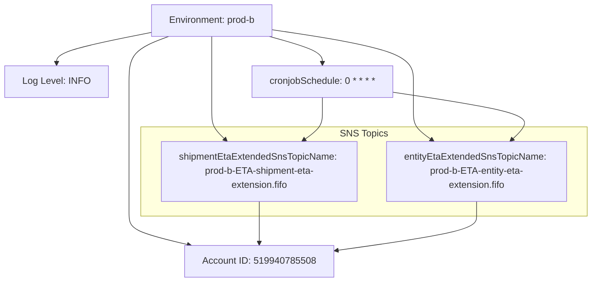

# Diagram: eta/extensions/profiles/values.prod-b.yaml

> Auto-generated by Obscura crawlers

## Mermaid

### SVG

<svg id="container" width="1000.125" xmlns="http://www.w3.org/2000/svg" class="flowchart" height="480" viewBox="0 0 1000.125 480" role="graphics-document document" aria-roledescription="flowchart-v2"><g><marker id="container_flowchart-v2-pointEnd" class="marker flowchart-v2" viewBox="0 0 10 10" refX="5" refY="5" markerUnits="userSpaceOnUse" markerWidth="8" markerHeight="8" orient="auto"><path d="M 0 0 L 10 5 L 0 10 z" class="arrowMarkerPath" style="stroke-width: 1; stroke-dasharray: 1, 0;"></path></marker><marker id="container_flowchart-v2-pointStart" class="marker flowchart-v2" viewBox="0 0 10 10" refX="4.5" refY="5" markerUnits="userSpaceOnUse" markerWidth="8" markerHeight="8" orient="auto"><path d="M 0 5 L 10 10 L 10 0 z" class="arrowMarkerPath" style="stroke-width: 1; stroke-dasharray: 1, 0;"></path></marker><marker id="container_flowchart-v2-circleEnd" class="marker flowchart-v2" viewBox="0 0 10 10" refX="11" refY="5" markerUnits="userSpaceOnUse" markerWidth="11" markerHeight="11" orient="auto"><circle cx="5" cy="5" r="5" class="arrowMarkerPath" style="stroke-width: 1; stroke-dasharray: 1, 0;"></circle></marker><marker id="container_flowchart-v2-circleStart" class="marker flowchart-v2" viewBox="0 0 10 10" refX="-1" refY="5" markerUnits="userSpaceOnUse" markerWidth="11" markerHeight="11" orient="auto"><circle cx="5" cy="5" r="5" class="arrowMarkerPath" style="stroke-width: 1; stroke-dasharray: 1, 0;"></circle></marker><marker id="container_flowchart-v2-crossEnd" class="marker cross flowchart-v2" viewBox="0 0 11 11" refX="12" refY="5.2" markerUnits="userSpaceOnUse" markerWidth="11" markerHeight="11" orient="auto"><path d="M 1,1 l 9,9 M 10,1 l -9,9" class="arrowMarkerPath" style="stroke-width: 2; stroke-dasharray: 1, 0;"></path></marker><marker id="container_flowchart-v2-crossStart" class="marker cross flowchart-v2" viewBox="0 0 11 11" refX="-1" refY="5.2" markerUnits="userSpaceOnUse" markerWidth="11" markerHeight="11" orient="auto"><path d="M 1,1 l 9,9 M 10,1 l -9,9" class="arrowMarkerPath" style="stroke-width: 2; stroke-dasharray: 1, 0;"></path></marker><g class="root"><g class="clusters"><g class="cluster" id="subGraph0" data-look="classic"><rect style="" x="232.46875" y="216" width="759.65625" height="152"></rect><g class="cluster-label" transform="translate(573.0546875, 216)"><foreignObject width="78.484375" height="24">

SNS Topics

</foreignObject></g></g></g><g class="edgePaths"><path d="M280.146,62L268.867,66.167C257.587,70.333,235.028,78.667,223.748,91.5C212.469,104.333,212.469,121.667,212.469,139C212.469,156.333,212.469,173.667,212.469,186.5C212.469,199.333,212.469,207.667,212.469,224.5C212.469,241.333,212.469,266.667,212.469,292C212.469,317.333,212.469,342.667,212.469,359.5C212.469,376.333,212.469,384.667,229.571,392.848C246.674,401.029,280.879,409.057,297.981,413.072L315.084,417.086" id="L_Env_Account_0" class="edge-thickness-normal edge-pattern-solid edge-thickness-normal edge-pattern-solid flowchart-link" style=";" data-edge="true" data-et="edge" data-id="L_Env_Account_0" data-points="W3sieCI6MjgwLjE0NjQwOTI1NDgwNzcsInkiOjYyfSx7IngiOjIxMi40Njg3NSwieSI6ODd9LHsieCI6MjEyLjQ2ODc1LCJ5IjoxMzl9LHsieCI6MjEyLjQ2ODc1LCJ5IjoxOTF9LHsieCI6MjEyLjQ2ODc1LCJ5IjoyMTZ9LHsieCI6MjEyLjQ2ODc1LCJ5IjoyOTJ9LHsieCI6MjEyLjQ2ODc1LCJ5IjozNjh9LHsieCI6MjEyLjQ2ODc1LCJ5IjozOTN9LHsieCI6MzE4Ljk3NzkxNDY2MzQ2MTU1LCJ5Ijo0MTh9XQ==" marker-end="url(#container_flowchart-v2-pointEnd)"></path><path d="M248.105,55.986L222.21,61.155C196.315,66.324,144.525,76.662,118.63,85.331C92.734,94,92.734,101,92.734,104.5L92.734,108" id="L_Env_Log_0" class="edge-thickness-normal edge-pattern-solid edge-thickness-normal edge-pattern-solid flowchart-link" style=";" data-edge="true" data-et="edge" data-id="L_Env_Log_0" data-points="W3sieCI6MjQ4LjEwNTQ2ODc1LCJ5Ijo1NS45ODU4ODk3MjY5NDE0OH0seyJ4Ijo5Mi43MzQzNzUsInkiOjg3fSx7IngiOjkyLjczNDM3NSwieSI6MTEyfV0=" marker-end="url(#container_flowchart-v2-pointEnd)"></path><path d="M450.412,62L465.407,66.167C480.403,70.333,510.395,78.667,525.391,86.333C540.387,94,540.387,101,540.387,104.5L540.387,108" id="L_Env_Cron_0" class="edge-thickness-normal edge-pattern-solid edge-thickness-normal edge-pattern-solid flowchart-link" style=";" data-edge="true" data-et="edge" data-id="L_Env_Cron_0" data-points="W3sieCI6NDUwLjQxMTUwODQxMzQ2MTU1LCJ5Ijo2Mn0seyJ4Ijo1NDAuMzg2NzE4NzUsInkiOjg3fSx7IngiOjU0MC4zODY3MTg3NSwieSI6MTEyfV0=" marker-end="url(#container_flowchart-v2-pointEnd)"></path><path d="M353.238,62L353.238,66.167C353.238,70.333,353.238,78.667,353.238,91.5C353.238,104.333,353.238,121.667,353.238,139C353.238,156.333,353.238,173.667,353.238,186.5C353.238,199.333,353.238,207.667,357.181,215.543C361.124,223.42,369.009,230.839,372.951,234.549L376.894,238.259" id="L_Env_ShipTopic_0" class="edge-thickness-normal edge-pattern-solid edge-thickness-normal edge-pattern-solid flowchart-link" style=";" data-edge="true" data-et="edge" data-id="L_Env_ShipTopic_0" data-points="W3sieCI6MzUzLjIzODI4MTI1LCJ5Ijo2Mn0seyJ4IjozNTMuMjM4MjgxMjUsInkiOjg3fSx7IngiOjM1My4yMzgyODEyNSwieSI6MTM5fSx7IngiOjM1My4yMzgyODEyNSwieSI6MTkxfSx7IngiOjM1My4yMzgyODEyNSwieSI6MjE2fSx7IngiOjM3OS44MDcyMDYwMDMyODk1LCJ5IjoyNDF9XQ==" marker-end="url(#container_flowchart-v2-pointEnd)"></path><path d="M458.371,50.882L498.219,56.902C538.066,62.921,617.762,74.961,657.609,89.647C697.457,104.333,697.457,121.667,697.457,139C697.457,156.333,697.457,173.667,697.457,186.5C697.457,199.333,697.457,207.667,702.747,215.612C708.036,223.558,718.616,231.116,723.906,234.896L729.195,238.675" id="L_Env_EntityTopic_0" class="edge-thickness-normal edge-pattern-solid edge-thickness-normal edge-pattern-solid flowchart-link" style=";" data-edge="true" data-et="edge" data-id="L_Env_EntityTopic_0" data-points="W3sieCI6NDU4LjM3MTA5Mzc1LCJ5Ijo1MC44ODIwNjk5MDQ2NzU0NX0seyJ4Ijo2OTcuNDU3MDMxMjUsInkiOjg3fSx7IngiOjY5Ny40NTcwMzEyNSwieSI6MTM5fSx7IngiOjY5Ny40NTcwMzEyNSwieSI6MTkxfSx7IngiOjY5Ny40NTcwMzEyNSwieSI6MjE2fSx7IngiOjczMi40NTAwOTI1MTY0NDc0LCJ5IjoyNDF9XQ==" marker-end="url(#container_flowchart-v2-pointEnd)"></path><path d="M540.387,166L540.387,170.167C540.387,174.333,540.387,182.667,540.387,191C540.387,199.333,540.387,207.667,535.097,215.612C529.807,223.558,519.228,231.116,513.938,234.896L508.648,238.675" id="L_Cron_ShipTopic_0" class="edge-thickness-normal edge-pattern-solid edge-thickness-normal edge-pattern-solid flowchart-link" style=";" data-edge="true" data-et="edge" data-id="L_Cron_ShipTopic_0" data-points="W3sieCI6NTQwLjM4NjcxODc1LCJ5IjoxNjZ9LHsieCI6NTQwLjM4NjcxODc1LCJ5IjoxOTF9LHsieCI6NTQwLjM4NjcxODc1LCJ5IjoyMTZ9LHsieCI6NTA1LjM5MzY1NzQ4MzU1MjYsInkiOjI0MX1d" marker-end="url(#container_flowchart-v2-pointEnd)"></path><path d="M662.457,157.262L700.044,162.885C737.632,168.508,812.806,179.754,850.393,189.544C887.98,199.333,887.98,207.667,883.862,215.553C879.744,223.44,871.507,230.879,867.388,234.599L863.27,238.319" id="L_Cron_EntityTopic_0" class="edge-thickness-normal edge-pattern-solid edge-thickness-normal edge-pattern-solid flowchart-link" style=";" data-edge="true" data-et="edge" data-id="L_Cron_EntityTopic_0" data-points="W3sieCI6NjYyLjQ1NzAzMTI1LCJ5IjoxNTcuMjYxNzA5OTcwMzMxNzR9LHsieCI6ODg3Ljk4MDQ2ODc1LCJ5IjoxOTF9LHsieCI6ODg3Ljk4MDQ2ODc1LCJ5IjoyMTZ9LHsieCI6ODYwLjMwMTM0NjYyODI4OTUsInkiOjI0MX1d" marker-end="url(#container_flowchart-v2-pointEnd)"></path><path d="M434.008,343L434.008,347.167C434.008,351.333,434.008,359.667,434.008,368C434.008,376.333,434.008,384.667,434.008,392.333C434.008,400,434.008,407,434.008,410.5L434.008,414" id="L_ShipTopic_Account_0" class="edge-thickness-normal edge-pattern-solid edge-thickness-normal edge-pattern-solid flowchart-link" style=";" data-edge="true" data-et="edge" data-id="L_ShipTopic_Account_0" data-points="W3sieCI6NDM0LjAwNzgxMjUsInkiOjM0M30seyJ4Ijo0MzQuMDA3ODEyNSwieSI6MzY4fSx7IngiOjQzNC4wMDc4MTI1LCJ5IjozOTN9LHsieCI6NDM0LjAwNzgxMjUsInkiOjQxOH1d" marker-end="url(#container_flowchart-v2-pointEnd)"></path><path d="M803.836,343L803.836,347.167C803.836,351.333,803.836,359.667,803.836,368C803.836,376.333,803.836,384.667,763.039,394.57C722.242,404.473,640.649,415.945,599.852,421.681L559.055,427.418" id="L_EntityTopic_Account_0" class="edge-thickness-normal edge-pattern-solid edge-thickness-normal edge-pattern-solid flowchart-link" style=";" data-edge="true" data-et="edge" data-id="L_EntityTopic_Account_0" data-points="W3sieCI6ODAzLjgzNTkzNzUsInkiOjM0M30seyJ4Ijo4MDMuODM1OTM3NSwieSI6MzY4fSx7IngiOjgwMy44MzU5Mzc1LCJ5IjozOTN9LHsieCI6NTU1LjA5Mzc1LCJ5Ijo0MjcuOTc0NjA4MTM3MjI1OX1d" marker-end="url(#container_flowchart-v2-pointEnd)"></path></g><g class="edgeLabels"><g class="edgeLabel"><g class="label" data-id="L_Env_Account_0" transform="translate(0, 0)"><foreignObject width="0" height="0">

</foreignObject></g></g><g class="edgeLabel"><g class="label" data-id="L_Env_Log_0" transform="translate(0, 0)"><foreignObject width="0" height="0">

</foreignObject></g></g><g class="edgeLabel"><g class="label" data-id="L_Env_Cron_0" transform="translate(0, 0)"><foreignObject width="0" height="0">

</foreignObject></g></g><g class="edgeLabel"><g class="label" data-id="L_Env_ShipTopic_0" transform="translate(0, 0)"><foreignObject width="0" height="0">

</foreignObject></g></g><g class="edgeLabel"><g class="label" data-id="L_Env_EntityTopic_0" transform="translate(0, 0)"><foreignObject width="0" height="0">

</foreignObject></g></g><g class="edgeLabel"><g class="label" data-id="L_Cron_ShipTopic_0" transform="translate(0, 0)"><foreignObject width="0" height="0">

</foreignObject></g></g><g class="edgeLabel"><g class="label" data-id="L_Cron_EntityTopic_0" transform="translate(0, 0)"><foreignObject width="0" height="0">

</foreignObject></g></g><g class="edgeLabel"><g class="label" data-id="L_ShipTopic_Account_0" transform="translate(0, 0)"><foreignObject width="0" height="0">

</foreignObject></g></g><g class="edgeLabel"><g class="label" data-id="L_EntityTopic_Account_0" transform="translate(0, 0)"><foreignObject width="0" height="0">

</foreignObject></g></g></g><g class="nodes"><g class="node default" id="flowchart-Env-0" transform="translate(353.23828125, 35)"><rect class="basic label-container" style="" x="-105.1328125" y="-27" width="210.265625" height="54"></rect><g class="label" style="" transform="translate(-75.1328125, -12)"><rect></rect><foreignObject width="150.265625" height="24">

Environment: prod-b

</foreignObject></g></g><g class="node default" id="flowchart-Account-1" transform="translate(434.0078125, 445)"><rect class="basic label-container" style="" x="-121.0859375" y="-27" width="242.171875" height="54"></rect><g class="label" style="" transform="translate(-91.0859375, -12)"><rect></rect><foreignObject width="182.171875" height="24">

Account ID: 519940785508

</foreignObject></g></g><g class="node default" id="flowchart-Log-2" transform="translate(92.734375, 139)"><rect class="basic label-container" style="" x="-84.734375" y="-27" width="169.46875" height="54"></rect><g class="label" style="" transform="translate(-54.734375, -12)"><rect></rect><foreignObject width="109.46875" height="24">

Log Level: INFO

</foreignObject></g></g><g class="node default" id="flowchart-Cron-3" transform="translate(540.38671875, 139)"><rect class="basic label-container" style="" x="-122.0703125" y="-27" width="244.140625" height="54"></rect><g class="label" style="" transform="translate(-92.0703125, -12)"><rect></rect><foreignObject width="184.140625" height="24">

cronjobSchedule: 0 * * * *

</foreignObject></g></g><g class="node default" id="flowchart-ShipTopic-4" transform="translate(434.0078125, 292)"><rect class="basic label-container" style="" x="-166.5390625" y="-51" width="333.078125" height="102"></rect><g class="label" style="" transform="translate(-136.5390625, -36)"><rect></rect><foreignObject width="273.078125" height="72">

shipmentEtaExtendedSnsTopicName: prod-b-ETA-shipment-eta-extension.fifo

</foreignObject></g></g><g class="node default" id="flowchart-EntityTopic-5" transform="translate(803.8359375, 292)"><rect class="basic label-container" style="" x="-153.2890625" y="-51" width="306.578125" height="102"></rect><g class="label" style="" transform="translate(-123.2890625, -36)"><rect></rect><foreignObject width="246.578125" height="72">

entityEtaExtendedSnsTopicName: prod-b-ETA-entity-eta-extension.fifo

</foreignObject></g></g></g></g></g></svg>
