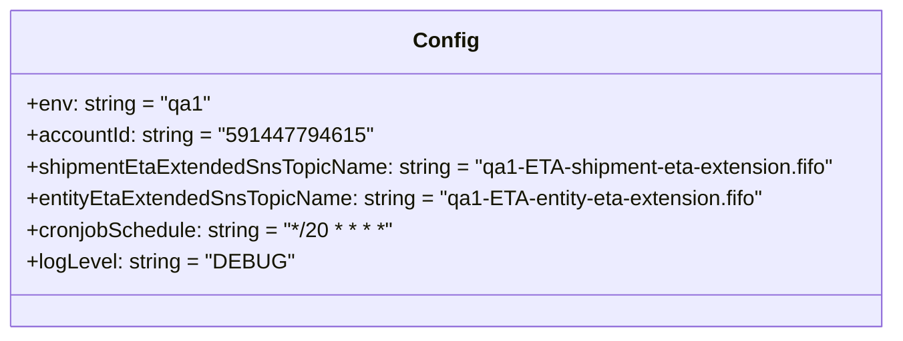
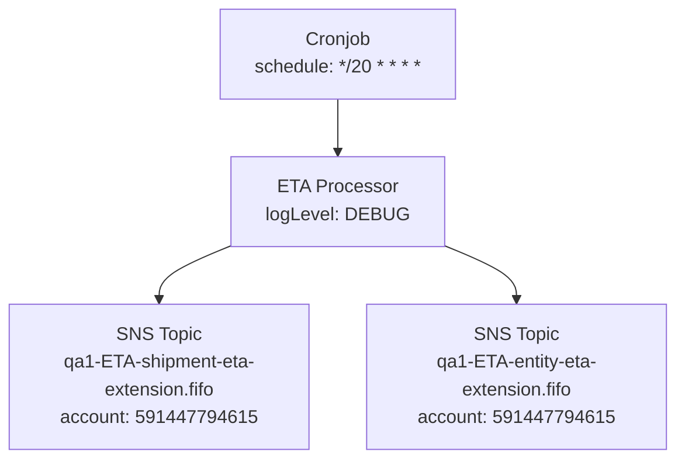

# Diagram: eta/extensions/profiles/values.qa1.yaml

> Auto-generated by Obscura crawlers

## Diagram 1

### SVG

<svg id="container" width="678.5546875" xmlns="http://www.w3.org/2000/svg" class="classDiagram" height="256" viewBox="0 0 678.5546875 256" role="graphics-document document" aria-roledescription="class"><g><defs><marker id="container_class-aggregationStart" class="marker aggregation class" refX="18" refY="7" markerWidth="190" markerHeight="240" orient="auto"><path d="M 18,7 L9,13 L1,7 L9,1 Z"></path></marker></defs><defs><marker id="container_class-aggregationEnd" class="marker aggregation class" refX="1" refY="7" markerWidth="20" markerHeight="28" orient="auto"><path d="M 18,7 L9,13 L1,7 L9,1 Z"></path></marker></defs><defs><marker id="container_class-extensionStart" class="marker extension class" refX="18" refY="7" markerWidth="190" markerHeight="240" orient="auto"><path d="M 1,7 L18,13 V 1 Z"></path></marker></defs><defs><marker id="container_class-extensionEnd" class="marker extension class" refX="1" refY="7" markerWidth="20" markerHeight="28" orient="auto"><path d="M 1,1 V 13 L18,7 Z"></path></marker></defs><defs><marker id="container_class-compositionStart" class="marker composition class" refX="18" refY="7" markerWidth="190" markerHeight="240" orient="auto"><path d="M 18,7 L9,13 L1,7 L9,1 Z"></path></marker></defs><defs><marker id="container_class-compositionEnd" class="marker composition class" refX="1" refY="7" markerWidth="20" markerHeight="28" orient="auto"><path d="M 18,7 L9,13 L1,7 L9,1 Z"></path></marker></defs><defs><marker id="container_class-dependencyStart" class="marker dependency class" refX="6" refY="7" markerWidth="190" markerHeight="240" orient="auto"><path d="M 5,7 L9,13 L1,7 L9,1 Z"></path></marker></defs><defs><marker id="container_class-dependencyEnd" class="marker dependency class" refX="13" refY="7" markerWidth="20" markerHeight="28" orient="auto"><path d="M 18,7 L9,13 L14,7 L9,1 Z"></path></marker></defs><defs><marker id="container_class-lollipopStart" class="marker lollipop class" refX="13" refY="7" markerWidth="190" markerHeight="240" orient="auto"><circle stroke="black" fill="transparent" cx="7" cy="7" r="6"></circle></marker></defs><defs><marker id="container_class-lollipopEnd" class="marker lollipop class" refX="1" refY="7" markerWidth="190" markerHeight="240" orient="auto"><circle stroke="black" fill="transparent" cx="7" cy="7" r="6"></circle></marker></defs><g class="root"><g class="clusters"></g><g class="edgePaths"></g><g class="edgeLabels"></g><g class="nodes"><g class="node default" id="classId-Config-0" transform="translate(339.27734375, 128)"><g class="basic label-container"><path d="M-331.27734375 -120 L331.27734375 -120 L331.27734375 120 L-331.27734375 120" stroke="none" stroke-width="0" fill="#ECECFF" style=""></path><path d="M-331.27734375 -120 C-72.28889222639657 -120, 186.69955929720686 -120, 331.27734375 -120 M-331.27734375 -120 C-198.09751950147168 -120, -64.91769525294336 -120, 331.27734375 -120 M331.27734375 -120 C331.27734375 -34.40395813691768, 331.27734375 51.19208372616464, 331.27734375 120 M331.27734375 -120 C331.27734375 -40.58264257467887, 331.27734375 38.83471485064226, 331.27734375 120 M331.27734375 120 C66.81555428411968 120, -197.64623518176063 120, -331.27734375 120 M331.27734375 120 C87.61401316057868 120, -156.04931742884264 120, -331.27734375 120 M-331.27734375 120 C-331.27734375 47.70216776122963, -331.27734375 -24.595664477540737, -331.27734375 -120 M-331.27734375 120 C-331.27734375 37.641559899201326, -331.27734375 -44.71688020159735, -331.27734375 -120" stroke="#9370DB" stroke-width="1.3" fill="none" stroke-dasharray="0 0" style=""></path></g><g class="annotation-group text" transform="translate(0, -96)"></g><g class="label-group text" transform="translate(-22.9296875, -96)"><g class="label" style="font-weight: bolder" transform="translate(0,-12)"><foreignObject width="45.859375" height="24">

Config

</foreignObject></g></g><g class="members-group text" transform="translate(-319.27734375, -48)"><g class="label" style="" transform="translate(0,-12)"><foreignObject width="137.109375" height="24">

+env: string = "qa1"

</foreignObject></g><g class="label" style="" transform="translate(0,12)"><foreignObject width="250.46875" height="24">

+accountId: string = "591447794615"

</foreignObject></g><g class="label" style="" transform="translate(0,36)"><foreignObject width="615.625" height="24">

+shipmentEtaExtendedSnsTopicName: string = "qa1-ETA-shipment-eta-extension.fifo"

</foreignObject></g><g class="label" style="" transform="translate(0,60)"><foreignObject width="563.109375" height="24">

+entityEtaExtendedSnsTopicName: string = "qa1-ETA-entity-eta-extension.fifo"

</foreignObject></g><g class="label" style="" transform="translate(0,84)"><foreignObject width="284.671875" height="24">

+cronjobSchedule: string = "*/20 * * * *"

</foreignObject></g><g class="label" style="" transform="translate(0,108)"><foreignObject width="195.9375" height="24">

+logLevel: string = "DEBUG"

</foreignObject></g></g><g class="methods-group text" transform="translate(-319.27734375, 120)"></g><g class="divider" style=""><path d="M-331.27734375 -72 C-125.33279888508383 -72, 80.61174597983234 -72, 331.27734375 -72 M-331.27734375 -72 C-134.37144763708596 -72, 62.53444847582807 -72, 331.27734375 -72" stroke="#9370DB" stroke-width="1.3" fill="none" stroke-dasharray="0 0" style=""></path></g><g class="divider" style=""><path d="M-331.27734375 96 C-147.38481264530236 96, 36.50771845939528 96, 331.27734375 96 M-331.27734375 96 C-116.55545417694219 96, 98.16643539611562 96, 331.27734375 96" stroke="#9370DB" stroke-width="1.3" fill="none" stroke-dasharray="0 0" style=""></path></g></g></g></g></g></svg>

## Diagram 2

### SVG

<svg id="container" width="586" xmlns="http://www.w3.org/2000/svg" class="flowchart" height="398" viewBox="0 0 586 398" role="graphics-document document" aria-roledescription="flowchart-v2"><g><marker id="container_flowchart-v2-pointEnd" class="marker flowchart-v2" viewBox="0 0 10 10" refX="5" refY="5" markerUnits="userSpaceOnUse" markerWidth="8" markerHeight="8" orient="auto"><path d="M 0 0 L 10 5 L 0 10 z" class="arrowMarkerPath" style="stroke-width: 1; stroke-dasharray: 1, 0;"></path></marker><marker id="container_flowchart-v2-pointStart" class="marker flowchart-v2" viewBox="0 0 10 10" refX="4.5" refY="5" markerUnits="userSpaceOnUse" markerWidth="8" markerHeight="8" orient="auto"><path d="M 0 5 L 10 10 L 10 0 z" class="arrowMarkerPath" style="stroke-width: 1; stroke-dasharray: 1, 0;"></path></marker><marker id="container_flowchart-v2-circleEnd" class="marker flowchart-v2" viewBox="0 0 10 10" refX="11" refY="5" markerUnits="userSpaceOnUse" markerWidth="11" markerHeight="11" orient="auto"><circle cx="5" cy="5" r="5" class="arrowMarkerPath" style="stroke-width: 1; stroke-dasharray: 1, 0;"></circle></marker><marker id="container_flowchart-v2-circleStart" class="marker flowchart-v2" viewBox="0 0 10 10" refX="-1" refY="5" markerUnits="userSpaceOnUse" markerWidth="11" markerHeight="11" orient="auto"><circle cx="5" cy="5" r="5" class="arrowMarkerPath" style="stroke-width: 1; stroke-dasharray: 1, 0;"></circle></marker><marker id="container_flowchart-v2-crossEnd" class="marker cross flowchart-v2" viewBox="0 0 11 11" refX="12" refY="5.2" markerUnits="userSpaceOnUse" markerWidth="11" markerHeight="11" orient="auto"><path d="M 1,1 l 9,9 M 10,1 l -9,9" class="arrowMarkerPath" style="stroke-width: 2; stroke-dasharray: 1, 0;"></path></marker><marker id="container_flowchart-v2-crossStart" class="marker cross flowchart-v2" viewBox="0 0 11 11" refX="-1" refY="5.2" markerUnits="userSpaceOnUse" markerWidth="11" markerHeight="11" orient="auto"><path d="M 1,1 l 9,9 M 10,1 l -9,9" class="arrowMarkerPath" style="stroke-width: 2; stroke-dasharray: 1, 0;"></path></marker><g class="root"><g class="clusters"></g><g class="edgePaths"><path d="M293,86L293,90.167C293,94.333,293,102.667,293,110.333C293,118,293,125,293,128.5L293,132" id="L_Cron_Processor_0" class="edge-thickness-normal edge-pattern-solid edge-thickness-normal edge-pattern-solid flowchart-link" style=";" data-edge="true" data-et="edge" data-id="L_Cron_Processor_0" data-points="W3sieCI6MjkzLCJ5Ijo4Nn0seyJ4IjoyOTMsInkiOjExMX0seyJ4IjoyOTMsInkiOjEzNn1d" marker-end="url(#container_flowchart-v2-pointEnd)"></path><path d="M198.547,214L188.456,218.167C178.365,222.333,158.182,230.667,148.091,238.333C138,246,138,253,138,256.5L138,260" id="L_Processor_ShipmentTopic_0" class="edge-thickness-normal edge-pattern-solid edge-thickness-normal edge-pattern-solid flowchart-link" style=";" data-edge="true" data-et="edge" data-id="L_Processor_ShipmentTopic_0" data-points="W3sieCI6MTk4LjU0Njg3NSwieSI6MjE0fSx7IngiOjEzOCwieSI6MjM5fSx7IngiOjEzOCwieSI6MjY0fV0=" marker-end="url(#container_flowchart-v2-pointEnd)"></path><path d="M387.453,214L397.544,218.167C407.635,222.333,427.818,230.667,437.909,238.333C448,246,448,253,448,256.5L448,260" id="L_Processor_EntityTopic_0" class="edge-thickness-normal edge-pattern-solid edge-thickness-normal edge-pattern-solid flowchart-link" style=";" data-edge="true" data-et="edge" data-id="L_Processor_EntityTopic_0" data-points="W3sieCI6Mzg3LjQ1MzEyNSwieSI6MjE0fSx7IngiOjQ0OCwieSI6MjM5fSx7IngiOjQ0OCwieSI6MjY0fV0=" marker-end="url(#container_flowchart-v2-pointEnd)"></path></g><g class="edgeLabels"><g class="edgeLabel"><g class="label" data-id="L_Cron_Processor_0" transform="translate(0, 0)"><foreignObject width="0" height="0">

</foreignObject></g></g><g class="edgeLabel"><g class="label" data-id="L_Processor_ShipmentTopic_0" transform="translate(0, 0)"><foreignObject width="0" height="0">

</foreignObject></g></g><g class="edgeLabel"><g class="label" data-id="L_Processor_EntityTopic_0" transform="translate(0, 0)"><foreignObject width="0" height="0">

</foreignObject></g></g></g><g class="nodes"><g class="node default" id="flowchart-Cron-0" transform="translate(293, 47)"><rect class="basic label-container" style="" x="-130" y="-39" width="260" height="78"></rect><g class="label" style="" transform="translate(-100, -24)"><rect></rect><foreignObject width="200" height="48">

Cronjob\nschedule: */20 * * * *

</foreignObject></g></g><g class="node default" id="flowchart-Processor-1" transform="translate(293, 175)"><rect class="basic label-container" style="" x="-130" y="-39" width="260" height="78"></rect><g class="label" style="" transform="translate(-100, -24)"><rect></rect><foreignObject width="200" height="48">

ETA Processor\nlogLevel: DEBUG

</foreignObject></g></g><g class="node default" id="flowchart-ShipmentTopic-3" transform="translate(138, 327)"><rect class="basic label-container" style="" x="-130" y="-63" width="260" height="126"></rect><g class="label" style="" transform="translate(-100, -48)"><rect></rect><foreignObject width="200" height="96">

SNS Topic\nqa1-ETA-shipment-eta-extension.fifo\naccount: 591447794615

</foreignObject></g></g><g class="node default" id="flowchart-EntityTopic-5" transform="translate(448, 327)"><rect class="basic label-container" style="" x="-130" y="-63" width="260" height="126"></rect><g class="label" style="" transform="translate(-100, -48)"><rect></rect><foreignObject width="200" height="96">

SNS Topic\nqa1-ETA-entity-eta-extension.fifo\naccount: 591447794615

</foreignObject></g></g></g></g></g></svg>
