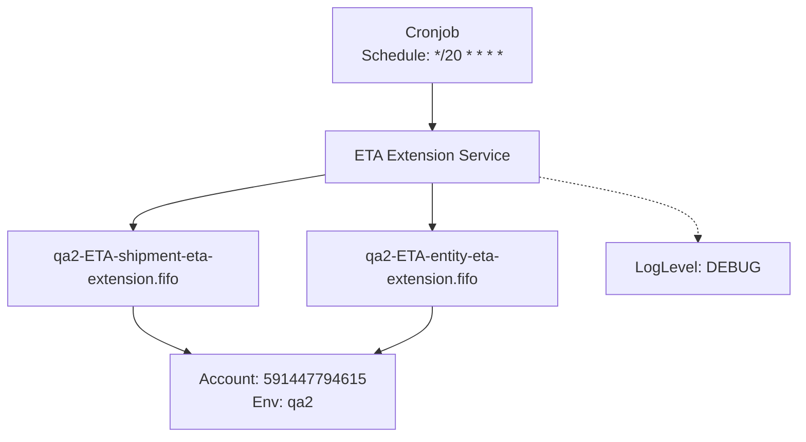
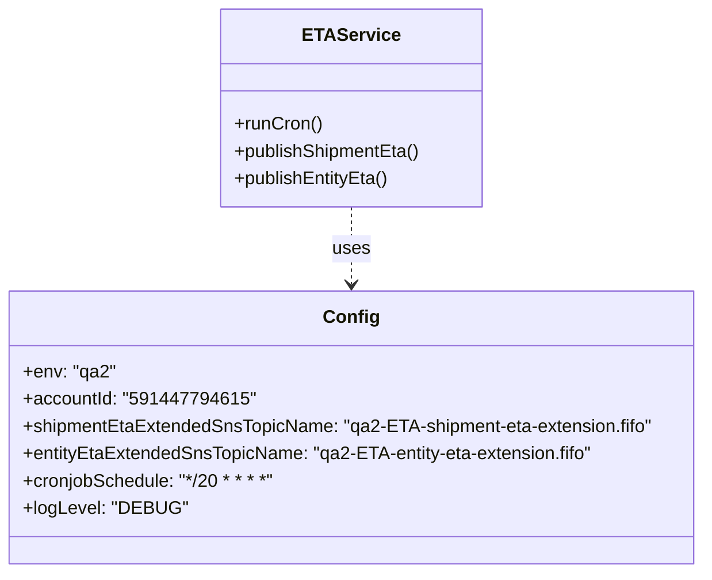

# Diagram: eta/extensions/profiles/values.qa2.yaml

> Auto-generated by Obscura crawlers

## Diagram 1

### SVG

<svg id="container" width="816.203125" xmlns="http://www.w3.org/2000/svg" class="flowchart" height="454" viewBox="0 0 816.203125 454" role="graphics-document document" aria-roledescription="flowchart-v2"><g><marker id="container_flowchart-v2-pointEnd" class="marker flowchart-v2" viewBox="0 0 10 10" refX="5" refY="5" markerUnits="userSpaceOnUse" markerWidth="8" markerHeight="8" orient="auto"><path d="M 0 0 L 10 5 L 0 10 z" class="arrowMarkerPath" style="stroke-width: 1; stroke-dasharray: 1, 0;"></path></marker><marker id="container_flowchart-v2-pointStart" class="marker flowchart-v2" viewBox="0 0 10 10" refX="4.5" refY="5" markerUnits="userSpaceOnUse" markerWidth="8" markerHeight="8" orient="auto"><path d="M 0 5 L 10 10 L 10 0 z" class="arrowMarkerPath" style="stroke-width: 1; stroke-dasharray: 1, 0;"></path></marker><marker id="container_flowchart-v2-circleEnd" class="marker flowchart-v2" viewBox="0 0 10 10" refX="11" refY="5" markerUnits="userSpaceOnUse" markerWidth="11" markerHeight="11" orient="auto"><circle cx="5" cy="5" r="5" class="arrowMarkerPath" style="stroke-width: 1; stroke-dasharray: 1, 0;"></circle></marker><marker id="container_flowchart-v2-circleStart" class="marker flowchart-v2" viewBox="0 0 10 10" refX="-1" refY="5" markerUnits="userSpaceOnUse" markerWidth="11" markerHeight="11" orient="auto"><circle cx="5" cy="5" r="5" class="arrowMarkerPath" style="stroke-width: 1; stroke-dasharray: 1, 0;"></circle></marker><marker id="container_flowchart-v2-crossEnd" class="marker cross flowchart-v2" viewBox="0 0 11 11" refX="12" refY="5.2" markerUnits="userSpaceOnUse" markerWidth="11" markerHeight="11" orient="auto"><path d="M 1,1 l 9,9 M 10,1 l -9,9" class="arrowMarkerPath" style="stroke-width: 2; stroke-dasharray: 1, 0;"></path></marker><marker id="container_flowchart-v2-crossStart" class="marker cross flowchart-v2" viewBox="0 0 11 11" refX="-1" refY="5.2" markerUnits="userSpaceOnUse" markerWidth="11" markerHeight="11" orient="auto"><path d="M 1,1 l 9,9 M 10,1 l -9,9" class="arrowMarkerPath" style="stroke-width: 2; stroke-dasharray: 1, 0;"></path></marker><g class="root"><g class="clusters"></g><g class="edgePaths"><path d="M448,86L448,90.167C448,94.333,448,102.667,448,110.333C448,118,448,125,448,128.5L448,132" id="L_Cronjob_ETAService_0" class="edge-thickness-normal edge-pattern-solid edge-thickness-normal edge-pattern-solid flowchart-link" style=";" data-edge="true" data-et="edge" data-id="L_Cronjob_ETAService_0" data-points="W3sieCI6NDQ4LCJ5Ijo4Nn0seyJ4Ijo0NDgsInkiOjExMX0seyJ4Ijo0NDgsInkiOjEzNn1d" marker-end="url(#container_flowchart-v2-pointEnd)"></path><path d="M339.805,181.149L306.171,186.791C272.536,192.433,205.268,203.716,171.634,212.858C138,222,138,229,138,232.5L138,236" id="L_ETAService_SNSShipment_0" class="edge-thickness-normal edge-pattern-solid edge-thickness-normal edge-pattern-solid flowchart-link" style=";" data-edge="true" data-et="edge" data-id="L_ETAService_SNSShipment_0" data-points="W3sieCI6MzM5LjgwNDY4NzUsInkiOjE4MS4xNDg4OTExMjkwMzIyNX0seyJ4IjoxMzgsInkiOjIxNX0seyJ4IjoxMzgsInkiOjI0MH1d" marker-end="url(#container_flowchart-v2-pointEnd)"></path><path d="M448,190L448,194.167C448,198.333,448,206.667,448,214.333C448,222,448,229,448,232.5L448,236" id="L_ETAService_SNSEntity_0" class="edge-thickness-normal edge-pattern-solid edge-thickness-normal edge-pattern-solid flowchart-link" style=";" data-edge="true" data-et="edge" data-id="L_ETAService_SNSEntity_0" data-points="W3sieCI6NDQ4LCJ5IjoxOTB9LHsieCI6NDQ4LCJ5IjoyMTV9LHsieCI6NDQ4LCJ5IjoyNDB9XQ==" marker-end="url(#container_flowchart-v2-pointEnd)"></path><path d="M138,318L138,322.167C138,326.333,138,334.667,147.475,342.746C156.95,350.824,175.9,358.649,185.375,362.561L194.85,366.473" id="L_SNSShipment_AWS_0" class="edge-thickness-normal edge-pattern-solid edge-thickness-normal edge-pattern-solid flowchart-link" style=";" data-edge="true" data-et="edge" data-id="L_SNSShipment_AWS_0" data-points="W3sieCI6MTM4LCJ5IjozMTh9LHsieCI6MTM4LCJ5IjozNDN9LHsieCI6MTk4LjU0Njg3NSwieSI6MzY4fV0=" marker-end="url(#container_flowchart-v2-pointEnd)"></path><path d="M448,318L448,322.167C448,326.333,448,334.667,438.525,342.746C429.05,350.824,410.1,358.649,400.625,362.561L391.15,366.473" id="L_SNSEntity_AWS_0" class="edge-thickness-normal edge-pattern-solid edge-thickness-normal edge-pattern-solid flowchart-link" style=";" data-edge="true" data-et="edge" data-id="L_SNSEntity_AWS_0" data-points="W3sieCI6NDQ4LCJ5IjozMTh9LHsieCI6NDQ4LCJ5IjozNDN9LHsieCI6Mzg3LjQ1MzEyNSwieSI6MzY4fV0=" marker-end="url(#container_flowchart-v2-pointEnd)"></path><path d="M556.195,183.83L583.18,189.025C610.164,194.22,664.133,204.61,691.117,215.305C718.102,226,718.102,237,718.102,242.5L718.102,248" id="L_ETAService_Logger_0" class="edge-thickness-normal edge-pattern-dotted edge-thickness-normal edge-pattern-solid flowchart-link" style=";" data-edge="true" data-et="edge" data-id="L_ETAService_Logger_0" data-points="W3sieCI6NTU2LjE5NTMxMjUsInkiOjE4My44Mjk3ODA0NjQ1MjQzM30seyJ4Ijo3MTguMTAxNTYyNSwieSI6MjE1fSx7IngiOjcxOC4xMDE1NjI1LCJ5IjoyNTJ9XQ==" marker-end="url(#container_flowchart-v2-pointEnd)"></path></g><g class="edgeLabels"><g class="edgeLabel"><g class="label" data-id="L_Cronjob_ETAService_0" transform="translate(0, 0)"><foreignObject width="0" height="0">

</foreignObject></g></g><g class="edgeLabel"><g class="label" data-id="L_ETAService_SNSShipment_0" transform="translate(0, 0)"><foreignObject width="0" height="0">

</foreignObject></g></g><g class="edgeLabel"><g class="label" data-id="L_ETAService_SNSEntity_0" transform="translate(0, 0)"><foreignObject width="0" height="0">

</foreignObject></g></g><g class="edgeLabel"><g class="label" data-id="L_SNSShipment_AWS_0" transform="translate(0, 0)"><foreignObject width="0" height="0">

</foreignObject></g></g><g class="edgeLabel"><g class="label" data-id="L_SNSEntity_AWS_0" transform="translate(0, 0)"><foreignObject width="0" height="0">

</foreignObject></g></g><g class="edgeLabel"><g class="label" data-id="L_ETAService_Logger_0" transform="translate(0, 0)"><foreignObject width="0" height="0">

</foreignObject></g></g></g><g class="nodes"><g class="node default" id="flowchart-Cronjob-0" transform="translate(448, 47)"><rect class="basic label-container" style="" x="-105.046875" y="-39" width="210.09375" height="78"></rect><g class="label" style="" transform="translate(-75.046875, -24)"><rect></rect><foreignObject width="150.09375" height="48">

Cronjob Schedule: */20 * * * *

</foreignObject></g></g><g class="node default" id="flowchart-ETAService-1" transform="translate(448, 163)"><rect class="basic label-container" style="" x="-108.1953125" y="-27" width="216.390625" height="54"></rect><g class="label" style="" transform="translate(-78.1953125, -12)"><rect></rect><foreignObject width="156.390625" height="24">

ETA Extension Service

</foreignObject></g></g><g class="node default" id="flowchart-SNSShipment-3" transform="translate(138, 279)"><rect class="basic label-container" style="" x="-130" y="-39" width="260" height="78"></rect><g class="label" style="" transform="translate(-100, -24)"><rect></rect><foreignObject width="200" height="48">

qa2-ETA-shipment-eta-extension.fifo

</foreignObject></g></g><g class="node default" id="flowchart-SNSEntity-5" transform="translate(448, 279)"><rect class="basic label-container" style="" x="-130" y="-39" width="260" height="78"></rect><g class="label" style="" transform="translate(-100, -24)"><rect></rect><foreignObject width="200" height="48">

qa2-ETA-entity-eta-extension.fifo

</foreignObject></g></g><g class="node default" id="flowchart-AWS-7" transform="translate(293, 407)"><rect class="basic label-container" style="" x="-109.28125" y="-39" width="218.5625" height="78"></rect><g class="label" style="" transform="translate(-79.28125, -24)"><rect></rect><foreignObject width="158.5625" height="48">

Account: 591447794615 Env: qa2

</foreignObject></g></g><g class="node default" id="flowchart-Logger-11" transform="translate(718.1015625, 279)"><rect class="basic label-container" style="" x="-90.1015625" y="-27" width="180.203125" height="54"></rect><g class="label" style="" transform="translate(-60.1015625, -12)"><rect></rect><foreignObject width="120.203125" height="24">

LogLevel: DEBUG

</foreignObject></g></g></g></g></g></svg>

## Diagram 2

### SVG

<svg id="container" width="621.8203125" xmlns="http://www.w3.org/2000/svg" class="classDiagram" height="504" viewBox="0 0 621.8203125 504" role="graphics-document document" aria-roledescription="class"><g><defs><marker id="container_class-aggregationStart" class="marker aggregation class" refX="18" refY="7" markerWidth="190" markerHeight="240" orient="auto"><path d="M 18,7 L9,13 L1,7 L9,1 Z"></path></marker></defs><defs><marker id="container_class-aggregationEnd" class="marker aggregation class" refX="1" refY="7" markerWidth="20" markerHeight="28" orient="auto"><path d="M 18,7 L9,13 L1,7 L9,1 Z"></path></marker></defs><defs><marker id="container_class-extensionStart" class="marker extension class" refX="18" refY="7" markerWidth="190" markerHeight="240" orient="auto"><path d="M 1,7 L18,13 V 1 Z"></path></marker></defs><defs><marker id="container_class-extensionEnd" class="marker extension class" refX="1" refY="7" markerWidth="20" markerHeight="28" orient="auto"><path d="M 1,1 V 13 L18,7 Z"></path></marker></defs><defs><marker id="container_class-compositionStart" class="marker composition class" refX="18" refY="7" markerWidth="190" markerHeight="240" orient="auto"><path d="M 18,7 L9,13 L1,7 L9,1 Z"></path></marker></defs><defs><marker id="container_class-compositionEnd" class="marker composition class" refX="1" refY="7" markerWidth="20" markerHeight="28" orient="auto"><path d="M 18,7 L9,13 L1,7 L9,1 Z"></path></marker></defs><defs><marker id="container_class-dependencyStart" class="marker dependency class" refX="6" refY="7" markerWidth="190" markerHeight="240" orient="auto"><path d="M 5,7 L9,13 L1,7 L9,1 Z"></path></marker></defs><defs><marker id="container_class-dependencyEnd" class="marker dependency class" refX="13" refY="7" markerWidth="20" markerHeight="28" orient="auto"><path d="M 18,7 L9,13 L14,7 L9,1 Z"></path></marker></defs><defs><marker id="container_class-lollipopStart" class="marker lollipop class" refX="13" refY="7" markerWidth="190" markerHeight="240" orient="auto"><circle stroke="black" fill="transparent" cx="7" cy="7" r="6"></circle></marker></defs><defs><marker id="container_class-lollipopEnd" class="marker lollipop class" refX="1" refY="7" markerWidth="190" markerHeight="240" orient="auto"><circle stroke="black" fill="transparent" cx="7" cy="7" r="6"></circle></marker></defs><g class="root"><g class="clusters"></g><g class="edgePaths"><path d="M310.91,182L310.91,188.167C310.91,194.333,310.91,206.667,310.91,218C310.91,229.333,310.91,239.667,310.91,244.833L310.91,250" id="id_ETAService_Config_1" class="edge-thickness-normal edge-pattern-dashed relation" style=";;;" data-edge="true" data-et="edge" data-id="id_ETAService_Config_1" data-points="W3sieCI6MzEwLjkxMDE1NjI1LCJ5IjoxODJ9LHsieCI6MzEwLjkxMDE1NjI1LCJ5IjoyMTl9LHsieCI6MzEwLjkxMDE1NjI1LCJ5IjoyNTZ9XQ==" marker-end="url(#container_class-dependencyEnd)"></path></g><g class="edgeLabels"><g class="edgeLabel" transform="translate(310.91015625, 219)"><g class="label" data-id="id_ETAService_Config_1" transform="translate(-16.4921875, -12)"><foreignObject width="32.984375" height="24">

uses

</foreignObject></g></g></g><g class="nodes"><g class="node default" id="classId-Config-0" transform="translate(310.91015625, 376)"><g class="basic label-container"><path d="M-302.91015625 -120 L302.91015625 -120 L302.91015625 120 L-302.91015625 120" stroke="none" stroke-width="0" fill="#ECECFF" style=""></path><path d="M-302.91015625 -120 C-153.62411244512094 -120, -4.338068640241886 -120, 302.91015625 -120 M-302.91015625 -120 C-128.93918134228178 -120, 45.03179356543643 -120, 302.91015625 -120 M302.91015625 -120 C302.91015625 -38.33447666477187, 302.91015625 43.33104667045626, 302.91015625 120 M302.91015625 -120 C302.91015625 -47.54809520990038, 302.91015625 24.903809580199237, 302.91015625 120 M302.91015625 120 C175.9925356301849 120, 49.07491501036981 120, -302.91015625 120 M302.91015625 120 C151.55125513924293 120, 0.1923540284858518 120, -302.91015625 120 M-302.91015625 120 C-302.91015625 63.477074109546784, -302.91015625 6.954148219093568, -302.91015625 -120 M-302.91015625 120 C-302.91015625 48.44124312548726, -302.91015625 -23.117513749025477, -302.91015625 -120" stroke="#9370DB" stroke-width="1.3" fill="none" stroke-dasharray="0 0" style=""></path></g><g class="annotation-group text" transform="translate(0, -96)"></g><g class="label-group text" transform="translate(-22.9296875, -96)"><g class="label" style="font-weight: bolder" transform="translate(0,-12)"><foreignObject width="45.859375" height="24">

Config

</foreignObject></g></g><g class="members-group text" transform="translate(-290.91015625, -48)"><g class="label" style="" transform="translate(0,-12)"><foreignObject width="80.796875" height="24">

+env: "qa2"

</foreignObject></g><g class="label" style="" transform="translate(0,12)"><foreignObject width="192.359375" height="24">

+accountId: "591447794615"

</foreignObject></g><g class="label" style="" transform="translate(0,36)"><foreignObject width="558.890625" height="24">

+shipmentEtaExtendedSnsTopicName: "qa2-ETA-shipment-eta-extension.fifo"

</foreignObject></g><g class="label" style="" transform="translate(0,60)"><foreignObject width="506.375" height="24">

+entityEtaExtendedSnsTopicName: "qa2-ETA-entity-eta-extension.fifo"

</foreignObject></g><g class="label" style="" transform="translate(0,84)"><foreignObject width="226.546875" height="24">

+cronjobSchedule: "*/20 * * * *"

</foreignObject></g><g class="label" style="" transform="translate(0,108)"><foreignObject width="137.828125" height="24">

+logLevel: "DEBUG"

</foreignObject></g></g><g class="methods-group text" transform="translate(-290.91015625, 120)"></g><g class="divider" style=""><path d="M-302.91015625 -72 C-143.28062470572144 -72, 16.348906838557127 -72, 302.91015625 -72 M-302.91015625 -72 C-89.42254555230352 -72, 124.06506514539296 -72, 302.91015625 -72" stroke="#9370DB" stroke-width="1.3" fill="none" stroke-dasharray="0 0" style=""></path></g><g class="divider" style=""><path d="M-302.91015625 96 C-120.07292327968364 96, 62.76430969063273 96, 302.91015625 96 M-302.91015625 96 C-163.51537917373517 96, -24.12060209747034 96, 302.91015625 96" stroke="#9370DB" stroke-width="1.3" fill="none" stroke-dasharray="0 0" style=""></path></g></g><g class="node default" id="classId-ETAService-1" transform="translate(310.91015625, 95)"><g class="basic label-container"><path d="M-114.3125 -87 L114.3125 -87 L114.3125 87 L-114.3125 87" stroke="none" stroke-width="0" fill="#ECECFF" style=""></path><path d="M-114.3125 -87 C-49.29778829880338 -87, 15.716923402393235 -87, 114.3125 -87 M-114.3125 -87 C-39.557719607735336 -87, 35.19706078452933 -87, 114.3125 -87 M114.3125 -87 C114.3125 -51.914159455859654, 114.3125 -16.828318911719307, 114.3125 87 M114.3125 -87 C114.3125 -28.57389501325914, 114.3125 29.85220997348172, 114.3125 87 M114.3125 87 C44.541444598873426 87, -25.22961080225315 87, -114.3125 87 M114.3125 87 C59.40746017080218 87, 4.502420341604363 87, -114.3125 87 M-114.3125 87 C-114.3125 29.515090149251748, -114.3125 -27.969819701496505, -114.3125 -87 M-114.3125 87 C-114.3125 30.252819837448406, -114.3125 -26.494360325103187, -114.3125 -87" stroke="#9370DB" stroke-width="1.3" fill="none" stroke-dasharray="0 0" style=""></path></g><g class="annotation-group text" transform="translate(0, -63)"></g><g class="label-group text" transform="translate(-39.5, -63)"><g class="label" style="font-weight: bolder" transform="translate(0,-12)"><foreignObject width="79" height="24">

ETAService

</foreignObject></g></g><g class="members-group text" transform="translate(-102.3125, -15)"></g><g class="methods-group text" transform="translate(-102.3125, 15)"><g class="label" style="" transform="translate(0,-12)"><foreignObject width="76.359375" height="24">

+runCron()

</foreignObject></g><g class="label" style="" transform="translate(0,12)"><foreignObject width="165.125" height="24">

+publishShipmentEta()

</foreignObject></g><g class="label" style="" transform="translate(0,36)"><foreignObject width="137.0625" height="24">

+publishEntityEta()

</foreignObject></g></g><g class="divider" style=""><path d="M-114.3125 -39 C-38.72201970771734 -39, 36.86846058456533 -39, 114.3125 -39 M-114.3125 -39 C-35.17231809596416 -39, 43.967863808071684 -39, 114.3125 -39" stroke="#9370DB" stroke-width="1.3" fill="none" stroke-dasharray="0 0" style=""></path></g><g class="divider" style=""><path d="M-114.3125 -15 C-24.857041651402596 -15, 64.5984166971948 -15, 114.3125 -15 M-114.3125 -15 C-64.08695089252211 -15, -13.861401785044222 -15, 114.3125 -15" stroke="#9370DB" stroke-width="1.3" fill="none" stroke-dasharray="0 0" style=""></path></g></g></g></g></g></svg>
