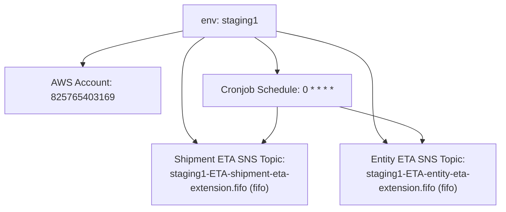

# Diagram: eta/extensions/profiles/values.staging1.yaml

> Auto-generated by Obscura crawlers

## Mermaid

### SVG

<svg id="container" width="832.44921875" xmlns="http://www.w3.org/2000/svg" class="flowchart" height="350" viewBox="0 0 832.44921875 350" role="graphics-document document" aria-roledescription="flowchart-v2"><g><marker id="container_flowchart-v2-pointEnd" class="marker flowchart-v2" viewBox="0 0 10 10" refX="5" refY="5" markerUnits="userSpaceOnUse" markerWidth="8" markerHeight="8" orient="auto"><path d="M 0 0 L 10 5 L 0 10 z" class="arrowMarkerPath" style="stroke-width: 1; stroke-dasharray: 1, 0;"></path></marker><marker id="container_flowchart-v2-pointStart" class="marker flowchart-v2" viewBox="0 0 10 10" refX="4.5" refY="5" markerUnits="userSpaceOnUse" markerWidth="8" markerHeight="8" orient="auto"><path d="M 0 5 L 10 10 L 10 0 z" class="arrowMarkerPath" style="stroke-width: 1; stroke-dasharray: 1, 0;"></path></marker><marker id="container_flowchart-v2-circleEnd" class="marker flowchart-v2" viewBox="0 0 10 10" refX="11" refY="5" markerUnits="userSpaceOnUse" markerWidth="11" markerHeight="11" orient="auto"><circle cx="5" cy="5" r="5" class="arrowMarkerPath" style="stroke-width: 1; stroke-dasharray: 1, 0;"></circle></marker><marker id="container_flowchart-v2-circleStart" class="marker flowchart-v2" viewBox="0 0 10 10" refX="-1" refY="5" markerUnits="userSpaceOnUse" markerWidth="11" markerHeight="11" orient="auto"><circle cx="5" cy="5" r="5" class="arrowMarkerPath" style="stroke-width: 1; stroke-dasharray: 1, 0;"></circle></marker><marker id="container_flowchart-v2-crossEnd" class="marker cross flowchart-v2" viewBox="0 0 11 11" refX="12" refY="5.2" markerUnits="userSpaceOnUse" markerWidth="11" markerHeight="11" orient="auto"><path d="M 1,1 l 9,9 M 10,1 l -9,9" class="arrowMarkerPath" style="stroke-width: 2; stroke-dasharray: 1, 0;"></path></marker><marker id="container_flowchart-v2-crossStart" class="marker cross flowchart-v2" viewBox="0 0 11 11" refX="-1" refY="5.2" markerUnits="userSpaceOnUse" markerWidth="11" markerHeight="11" orient="auto"><path d="M 1,1 l 9,9 M 10,1 l -9,9" class="arrowMarkerPath" style="stroke-width: 2; stroke-dasharray: 1, 0;"></path></marker><g class="root"><g class="clusters"></g><g class="edgePaths"><path d="M303.152,51.366L275.365,57.305C247.578,63.244,192.004,75.122,164.217,84.561C136.43,94,136.43,101,136.43,104.5L136.43,108" id="L_ENV_ACC_0" class="edge-thickness-normal edge-pattern-solid edge-thickness-normal edge-pattern-solid flowchart-link" style=";" data-edge="true" data-et="edge" data-id="L_ENV_ACC_0" data-points="W3sieCI6MzAzLjE1MjM0Mzc1LCJ5Ijo1MS4zNjU2ODU2NjA2MTM2NX0seyJ4IjoxMzYuNDI5Njg3NSwieSI6ODd9LHsieCI6MTM2LjQyOTY4NzUsInkiOjExMn1d" marker-end="url(#container_flowchart-v2-pointEnd)"></path><path d="M421.19,62L427.589,66.167C433.989,70.333,446.787,78.667,453.187,86.333C459.586,94,459.586,101,459.586,104.5L459.586,108" id="L_ENV_CRON_0" class="edge-thickness-normal edge-pattern-solid edge-thickness-normal edge-pattern-solid flowchart-link" style=";" data-edge="true" data-et="edge" data-id="L_ENV_CRON_0" data-points="W3sieCI6NDIxLjE5MDEyOTIwNjczMDgsInkiOjYyfSx7IngiOjQ1OS41ODU5Mzc1LCJ5Ijo4N30seyJ4Ijo0NTkuNTg1OTM3NSwieSI6MTEyfV0=" marker-end="url(#container_flowchart-v2-pointEnd)"></path><path d="M338.255,62L331.856,66.167C325.457,70.333,312.658,78.667,306.259,91.5C299.859,104.333,299.859,121.667,299.859,139C299.859,156.333,299.859,173.667,303.193,186.006C306.526,198.346,313.193,205.692,316.526,209.365L319.86,213.038" id="L_ENV_SHIP_0" class="edge-thickness-normal edge-pattern-solid edge-thickness-normal edge-pattern-solid flowchart-link" style=";" data-edge="true" data-et="edge" data-id="L_ENV_SHIP_0" data-points="W3sieCI6MzM4LjI1NTE4MzI5MzI2OTIsInkiOjYyfSx7IngiOjI5OS44NTkzNzUsInkiOjg3fSx7IngiOjI5OS44NTkzNzUsInkiOjEzOX0seyJ4IjoyOTkuODU5Mzc1LCJ5IjoxOTF9LHsieCI6MzIyLjU0NzgwNzE3MzI5NTQ0LCJ5IjoyMTZ9XQ==" marker-end="url(#container_flowchart-v2-pointEnd)"></path><path d="M456.293,51.619L483.463,57.516C510.633,63.412,564.973,75.206,592.143,89.77C619.313,104.333,619.313,121.667,619.313,139C619.313,156.333,619.313,173.667,622.437,185.993C625.562,198.319,631.811,205.639,634.936,209.298L638.061,212.958" id="L_ENV_ENT_0" class="edge-thickness-normal edge-pattern-solid edge-thickness-normal edge-pattern-solid flowchart-link" style=";" data-edge="true" data-et="edge" data-id="L_ENV_ENT_0" data-points="W3sieCI6NDU2LjI5Mjk2ODc1LCJ5Ijo1MS42MTg2MzUzNjMxNjk0NzR9LHsieCI6NjE5LjMxMjUsInkiOjg3fSx7IngiOjYxOS4zMTI1LCJ5IjoxMzl9LHsieCI6NjE5LjMxMjUsInkiOjE5MX0seyJ4Ijo2NDAuNjU4MTU4NzM1Nzk1NSwieSI6MjE2fV0=" marker-end="url(#container_flowchart-v2-pointEnd)"></path><path d="M459.586,166L459.586,170.167C459.586,174.333,459.586,182.667,456.253,190.506C452.919,198.346,446.252,205.692,442.919,209.365L439.586,213.038" id="L_CRON_SHIP_0" class="edge-thickness-normal edge-pattern-solid edge-thickness-normal edge-pattern-solid flowchart-link" style=";" data-edge="true" data-et="edge" data-id="L_CRON_SHIP_0" data-points="W3sieCI6NDU5LjU4NTkzNzUsInkiOjE2Nn0seyJ4Ijo0NTkuNTg1OTM3NSwieSI6MTkxfSx7IngiOjQzNi44OTc1MDUzMjY3MDQ1NiwieSI6MjE2fV0=" marker-end="url(#container_flowchart-v2-pointEnd)"></path><path d="M584.313,165.487L604.335,169.739C624.358,173.992,664.404,182.496,684.028,190.252C703.653,198.009,702.856,205.017,702.458,208.521L702.06,212.026" id="L_CRON_ENT_0" class="edge-thickness-normal edge-pattern-solid edge-thickness-normal edge-pattern-solid flowchart-link" style=";" data-edge="true" data-et="edge" data-id="L_CRON_ENT_0" data-points="W3sieCI6NTg0LjMxMjUsInkiOjE2NS40ODczNTc0MjIwMzA3OH0seyJ4Ijo3MDQuNDQ5MjE4NzUsInkiOjE5MX0seyJ4Ijo3MDEuNjA4MzA5NjU5MDkwOSwieSI6MjE2fV0=" marker-end="url(#container_flowchart-v2-pointEnd)"></path></g><g class="edgeLabels"><g class="edgeLabel"><g class="label" data-id="L_ENV_ACC_0" transform="translate(0, 0)"><foreignObject width="0" height="0">

</foreignObject></g></g><g class="edgeLabel"><g class="label" data-id="L_ENV_CRON_0" transform="translate(0, 0)"><foreignObject width="0" height="0">

</foreignObject></g></g><g class="edgeLabel"><g class="label" data-id="L_ENV_SHIP_0" transform="translate(0, 0)"><foreignObject width="0" height="0">

</foreignObject></g></g><g class="edgeLabel"><g class="label" data-id="L_ENV_ENT_0" transform="translate(0, 0)"><foreignObject width="0" height="0">

</foreignObject></g></g><g class="edgeLabel"><g class="label" data-id="L_CRON_SHIP_0" transform="translate(0, 0)"><foreignObject width="0" height="0">

</foreignObject></g></g><g class="edgeLabel"><g class="label" data-id="L_CRON_ENT_0" transform="translate(0, 0)"><foreignObject width="0" height="0">

</foreignObject></g></g></g><g class="nodes"><g class="node default" id="flowchart-ENV-0" transform="translate(379.72265625, 35)"><rect class="basic label-container" style="" x="-76.5703125" y="-27" width="153.140625" height="54"></rect><g class="label" style="" transform="translate(-46.5703125, -12)"><rect></rect><foreignObject width="93.140625" height="24">

env: staging1

</foreignObject></g></g><g class="node default" id="flowchart-ACC-1" transform="translate(136.4296875, 139)"><rect class="basic label-container" style="" x="-128.4296875" y="-27" width="256.859375" height="54"></rect><g class="label" style="" transform="translate(-98.4296875, -12)"><rect></rect><foreignObject width="196.859375" height="24">

AWS Account: 825765403169

</foreignObject></g></g><g class="node default" id="flowchart-CRON-2" transform="translate(459.5859375, 139)"><rect class="basic label-container" style="" x="-124.7265625" y="-27" width="249.453125" height="54"></rect><g class="label" style="" transform="translate(-94.7265625, -12)"><rect></rect><foreignObject width="189.453125" height="24">

Cronjob Schedule: 0 * * * *

</foreignObject></g></g><g class="node default" id="flowchart-SHIP-3" transform="translate(379.72265625, 279)"><rect class="basic label-container" style="" x="-130" y="-63" width="260" height="126"></rect><g class="label" style="" transform="translate(-100, -48)"><rect></rect><foreignObject width="200" height="96">

Shipment ETA SNS Topic:\nstaging1-ETA-shipment-eta-extension.fifo (fifo)

</foreignObject></g></g><g class="node default" id="flowchart-ENT-4" transform="translate(694.44921875, 279)"><rect class="basic label-container" style="" x="-130" y="-63" width="260" height="126"></rect><g class="label" style="" transform="translate(-100, -48)"><rect></rect><foreignObject width="200" height="96">

Entity ETA SNS Topic:\nstaging1-ETA-entity-eta-extension.fifo (fifo)

</foreignObject></g></g></g></g></g></svg>
