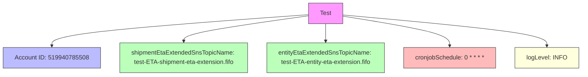

# Diagram: eta/extensions/profiles/values.test.yaml

> Auto-generated by Obscura crawlers

## Mermaid

### SVG

<svg id="container" width="1504.234375" xmlns="http://www.w3.org/2000/svg" class="flowchart" height="198" viewBox="0 0 1504.234375 198" role="graphics-document document" aria-roledescription="flowchart-v2"><g><marker id="container_flowchart-v2-pointEnd" class="marker flowchart-v2" viewBox="0 0 10 10" refX="5" refY="5" markerUnits="userSpaceOnUse" markerWidth="8" markerHeight="8" orient="auto"><path d="M 0 0 L 10 5 L 0 10 z" class="arrowMarkerPath" style="stroke-width: 1; stroke-dasharray: 1, 0;"></path></marker><marker id="container_flowchart-v2-pointStart" class="marker flowchart-v2" viewBox="0 0 10 10" refX="4.5" refY="5" markerUnits="userSpaceOnUse" markerWidth="8" markerHeight="8" orient="auto"><path d="M 0 5 L 10 10 L 10 0 z" class="arrowMarkerPath" style="stroke-width: 1; stroke-dasharray: 1, 0;"></path></marker><marker id="container_flowchart-v2-circleEnd" class="marker flowchart-v2" viewBox="0 0 10 10" refX="11" refY="5" markerUnits="userSpaceOnUse" markerWidth="11" markerHeight="11" orient="auto"><circle cx="5" cy="5" r="5" class="arrowMarkerPath" style="stroke-width: 1; stroke-dasharray: 1, 0;"></circle></marker><marker id="container_flowchart-v2-circleStart" class="marker flowchart-v2" viewBox="0 0 10 10" refX="-1" refY="5" markerUnits="userSpaceOnUse" markerWidth="11" markerHeight="11" orient="auto"><circle cx="5" cy="5" r="5" class="arrowMarkerPath" style="stroke-width: 1; stroke-dasharray: 1, 0;"></circle></marker><marker id="container_flowchart-v2-crossEnd" class="marker cross flowchart-v2" viewBox="0 0 11 11" refX="12" refY="5.2" markerUnits="userSpaceOnUse" markerWidth="11" markerHeight="11" orient="auto"><path d="M 1,1 l 9,9 M 10,1 l -9,9" class="arrowMarkerPath" style="stroke-width: 2; stroke-dasharray: 1, 0;"></path></marker><marker id="container_flowchart-v2-crossStart" class="marker cross flowchart-v2" viewBox="0 0 11 11" refX="-1" refY="5.2" markerUnits="userSpaceOnUse" markerWidth="11" markerHeight="11" orient="auto"><path d="M 1,1 l 9,9 M 10,1 l -9,9" class="arrowMarkerPath" style="stroke-width: 2; stroke-dasharray: 1, 0;"></path></marker><g class="root"><g class="clusters"></g><g class="edgePaths"><path d="M791.852,38.285L681.391,46.404C570.93,54.523,350.008,70.762,239.547,84.381C129.086,98,129.086,109,129.086,114.5L129.086,120" id="L_Env_Account_0" class="edge-thickness-normal edge-pattern-solid edge-thickness-normal edge-pattern-solid flowchart-link" style=";" data-edge="true" data-et="edge" data-id="L_Env_Account_0" data-points="W3sieCI6NzkxLjg1MTU2MjUsInkiOjM4LjI4NDY2OTkyMDcxMDI5fSx7IngiOjEyOS4wODU5Mzc1LCJ5Ijo4N30seyJ4IjoxMjkuMDg1OTM3NSwieSI6MTI0fV0=" marker-end="url(#container_flowchart-v2-pointEnd)"></path><path d="M791.852,41.283L737.661,48.903C683.471,56.522,575.091,71.761,520.901,82.881C466.711,94,466.711,101,466.711,104.5L466.711,108" id="L_Env_ShipmentTopic_0" class="edge-thickness-normal edge-pattern-solid edge-thickness-normal edge-pattern-solid flowchart-link" style=";" data-edge="true" data-et="edge" data-id="L_Env_ShipmentTopic_0" data-points="W3sieCI6NzkxLjg1MTU2MjUsInkiOjQxLjI4MzMyNDE3OTMwNjI2fSx7IngiOjQ2Ni43MTA5Mzc1LCJ5Ijo4N30seyJ4Ijo0NjYuNzEwOTM3NSwieSI6MTEyfV0=" marker-end="url(#container_flowchart-v2-pointEnd)"></path><path d="M836.539,62L836.539,66.167C836.539,70.333,836.539,78.667,836.539,86.333C836.539,94,836.539,101,836.539,104.5L836.539,108" id="L_Env_EntityTopic_0" class="edge-thickness-normal edge-pattern-solid edge-thickness-normal edge-pattern-solid flowchart-link" style=";" data-edge="true" data-et="edge" data-id="L_Env_EntityTopic_0" data-points="W3sieCI6ODM2LjUzOTA2MjUsInkiOjYyfSx7IngiOjgzNi41MzkwNjI1LCJ5Ijo4N30seyJ4Ijo4MzYuNTM5MDYyNSwieSI6MTEyfV0=" marker-end="url(#container_flowchart-v2-pointEnd)"></path><path d="M881.227,42.142L928.005,49.618C974.784,57.095,1068.341,72.047,1115.12,85.024C1161.898,98,1161.898,109,1161.898,114.5L1161.898,120" id="L_Env_Cron_0" class="edge-thickness-normal edge-pattern-solid edge-thickness-normal edge-pattern-solid flowchart-link" style=";" data-edge="true" data-et="edge" data-id="L_Env_Cron_0" data-points="W3sieCI6ODgxLjIyNjU2MjUsInkiOjQyLjE0MjEwMjQ4MjgzMTQ4fSx7IngiOjExNjEuODk4NDM3NSwieSI6ODd9LHsieCI6MTE2MS44OTg0Mzc1LCJ5IjoxMjR9XQ==" marker-end="url(#container_flowchart-v2-pointEnd)"></path><path d="M881.227,39.016L970.206,47.014C1059.185,55.011,1237.143,71.005,1326.122,84.503C1415.102,98,1415.102,109,1415.102,114.5L1415.102,120" id="L_Env_Log_0" class="edge-thickness-normal edge-pattern-solid edge-thickness-normal edge-pattern-solid flowchart-link" style=";" data-edge="true" data-et="edge" data-id="L_Env_Log_0" data-points="W3sieCI6ODgxLjIyNjU2MjUsInkiOjM5LjAxNjQyMDAwNjQ4MTU4fSx7IngiOjE0MTUuMTAxNTYyNSwieSI6ODd9LHsieCI6MTQxNS4xMDE1NjI1LCJ5IjoxMjR9XQ==" marker-end="url(#container_flowchart-v2-pointEnd)"></path></g><g class="edgeLabels"><g class="edgeLabel"><g class="label" data-id="L_Env_Account_0" transform="translate(0, 0)"><foreignObject width="0" height="0">

</foreignObject></g></g><g class="edgeLabel"><g class="label" data-id="L_Env_ShipmentTopic_0" transform="translate(0, 0)"><foreignObject width="0" height="0">

</foreignObject></g></g><g class="edgeLabel"><g class="label" data-id="L_Env_EntityTopic_0" transform="translate(0, 0)"><foreignObject width="0" height="0">

</foreignObject></g></g><g class="edgeLabel"><g class="label" data-id="L_Env_Cron_0" transform="translate(0, 0)"><foreignObject width="0" height="0">

</foreignObject></g></g><g class="edgeLabel"><g class="label" data-id="L_Env_Log_0" transform="translate(0, 0)"><foreignObject width="0" height="0">

</foreignObject></g></g></g><g class="nodes"><g class="node default env" id="flowchart-Env-0" transform="translate(836.5390625, 35)"><rect class="basic label-container" style="fill:#f9f !important;stroke:#333 !important;stroke-width:1px !important" x="-44.6875" y="-27" width="89.375" height="54"></rect><g class="label" style="" transform="translate(-14.6875, -12)"><rect></rect><foreignObject width="29.375" height="24">

Test

</foreignObject></g></g><g class="node default account" id="flowchart-Account-1" transform="translate(129.0859375, 151)"><rect class="basic label-container" style="fill:#bbf !important;stroke:#333 !important" x="-121.0859375" y="-27" width="242.171875" height="54"></rect><g class="label" style="" transform="translate(-91.0859375, -12)"><rect></rect><foreignObject width="182.171875" height="24">

Account ID: 519940785508

</foreignObject></g></g><g class="node default topic" id="flowchart-ShipmentTopic-2" transform="translate(466.7109375, 151)"><rect class="basic label-container" style="fill:#bfb !important;stroke:#333 !important" x="-166.5390625" y="-39" width="333.078125" height="78"></rect><g class="label" style="" transform="translate(-136.5390625, -24)"><rect></rect><foreignObject width="273.078125" height="48">

shipmentEtaExtendedSnsTopicName: test-ETA-shipment-eta-extension.fifo

</foreignObject></g></g><g class="node default topic" id="flowchart-EntityTopic-3" transform="translate(836.5390625, 151)"><rect class="basic label-container" style="fill:#bfb !important;stroke:#333 !important" x="-153.2890625" y="-39" width="306.578125" height="78"></rect><g class="label" style="" transform="translate(-123.2890625, -24)"><rect></rect><foreignObject width="246.578125" height="48">

entityEtaExtendedSnsTopicName: test-ETA-entity-eta-extension.fifo

</foreignObject></g></g><g class="node default cron" id="flowchart-Cron-4" transform="translate(1161.8984375, 151)"><rect class="basic label-container" style="fill:#fbb !important;stroke:#333 !important" x="-122.0703125" y="-27" width="244.140625" height="54"></rect><g class="label" style="" transform="translate(-92.0703125, -12)"><rect></rect><foreignObject width="184.140625" height="24">

cronjobSchedule: 0 * * * *

</foreignObject></g></g><g class="node default log" id="flowchart-Log-5" transform="translate(1415.1015625, 151)"><rect class="basic label-container" style="fill:#ffd !important;stroke:#333 !important" x="-81.1328125" y="-27" width="162.265625" height="54"></rect><g class="label" style="" transform="translate(-51.1328125, -12)"><rect></rect><foreignObject width="102.265625" height="24">

logLevel: INFO

</foreignObject></g></g></g></g></g></svg>
