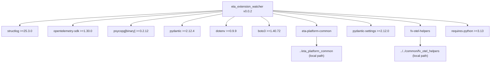
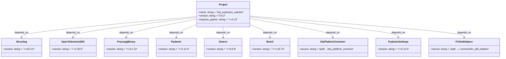

# Diagram: eta/extensions/pyproject.toml

> Auto-generated by Obscura crawlers

## Diagram 1

### SVG

<svg id="container" width="2506.75" xmlns="http://www.w3.org/2000/svg" class="flowchart" height="326" viewBox="0 0 2506.75 326" role="graphics-document document" aria-roledescription="flowchart-v2"><g><marker id="container_flowchart-v2-pointEnd" class="marker flowchart-v2" viewBox="0 0 10 10" refX="5" refY="5" markerUnits="userSpaceOnUse" markerWidth="8" markerHeight="8" orient="auto"><path d="M 0 0 L 10 5 L 0 10 z" class="arrowMarkerPath" style="stroke-width: 1; stroke-dasharray: 1, 0;"></path></marker><marker id="container_flowchart-v2-pointStart" class="marker flowchart-v2" viewBox="0 0 10 10" refX="4.5" refY="5" markerUnits="userSpaceOnUse" markerWidth="8" markerHeight="8" orient="auto"><path d="M 0 5 L 10 10 L 10 0 z" class="arrowMarkerPath" style="stroke-width: 1; stroke-dasharray: 1, 0;"></path></marker><marker id="container_flowchart-v2-circleEnd" class="marker flowchart-v2" viewBox="0 0 10 10" refX="11" refY="5" markerUnits="userSpaceOnUse" markerWidth="11" markerHeight="11" orient="auto"><circle cx="5" cy="5" r="5" class="arrowMarkerPath" style="stroke-width: 1; stroke-dasharray: 1, 0;"></circle></marker><marker id="container_flowchart-v2-circleStart" class="marker flowchart-v2" viewBox="0 0 10 10" refX="-1" refY="5" markerUnits="userSpaceOnUse" markerWidth="11" markerHeight="11" orient="auto"><circle cx="5" cy="5" r="5" class="arrowMarkerPath" style="stroke-width: 1; stroke-dasharray: 1, 0;"></circle></marker><marker id="container_flowchart-v2-crossEnd" class="marker cross flowchart-v2" viewBox="0 0 11 11" refX="12" refY="5.2" markerUnits="userSpaceOnUse" markerWidth="11" markerHeight="11" orient="auto"><path d="M 1,1 l 9,9 M 10,1 l -9,9" class="arrowMarkerPath" style="stroke-width: 2; stroke-dasharray: 1, 0;"></path></marker><marker id="container_flowchart-v2-crossStart" class="marker cross flowchart-v2" viewBox="0 0 11 11" refX="-1" refY="5.2" markerUnits="userSpaceOnUse" markerWidth="11" markerHeight="11" orient="auto"><path d="M 1,1 l 9,9 M 10,1 l -9,9" class="arrowMarkerPath" style="stroke-width: 2; stroke-dasharray: 1, 0;"></path></marker><g class="root"><g class="clusters"></g><g class="edgePaths"><path d="M1121.742,54.227L951.535,63.689C781.328,73.151,440.914,92.076,270.707,105.038C100.5,118,100.5,125,100.5,128.5L100.5,132" id="L_A_S1_0" class="edge-thickness-normal edge-pattern-solid edge-thickness-normal edge-pattern-solid flowchart-link" style=";" data-edge="true" data-et="edge" data-id="L_A_S1_0" data-points="W3sieCI6MTEyMS43NDIxODc1LCJ5Ijo1NC4yMjY5NzYyOTU5ODQ2MzV9LHsieCI6MTAwLjUsInkiOjExMX0seyJ4IjoxMDAuNSwieSI6MTM2fV0=" marker-end="url(#container_flowchart-v2-pointEnd)"></path><path d="M1121.742,56.46L996.822,65.55C871.901,74.64,622.06,92.82,497.139,105.41C372.219,118,372.219,125,372.219,128.5L372.219,132" id="L_A_S2_0" class="edge-thickness-normal edge-pattern-solid edge-thickness-normal edge-pattern-solid flowchart-link" style=";" data-edge="true" data-et="edge" data-id="L_A_S2_0" data-points="W3sieCI6MTEyMS43NDIxODc1LCJ5Ijo1Ni40NTk2NjgzMjE4MDA2OX0seyJ4IjozNzIuMjE4NzUsInkiOjExMX0seyJ4IjozNzIuMjE4NzUsInkiOjEzNn1d" marker-end="url(#container_flowchart-v2-pointEnd)"></path><path d="M1121.742,61.239L1046.022,69.532C970.302,77.826,818.862,94.413,743.142,106.206C667.422,118,667.422,125,667.422,128.5L667.422,132" id="L_A_S3_0" class="edge-thickness-normal edge-pattern-solid edge-thickness-normal edge-pattern-solid flowchart-link" style=";" data-edge="true" data-et="edge" data-id="L_A_S3_0" data-points="W3sieCI6MTEyMS43NDIxODc1LCJ5Ijo2MS4yMzg3NjU2NTk4ODc5Nn0seyJ4Ijo2NjcuNDIxODc1LCJ5IjoxMTF9LHsieCI6NjY3LjQyMTg3NSwieSI6MTM2fV0=" marker-end="url(#container_flowchart-v2-pointEnd)"></path><path d="M1121.742,72.336L1088.678,78.78C1055.615,85.224,989.487,98.112,956.423,108.056C923.359,118,923.359,125,923.359,128.5L923.359,132" id="L_A_S4_0" class="edge-thickness-normal edge-pattern-solid edge-thickness-normal edge-pattern-solid flowchart-link" style=";" data-edge="true" data-et="edge" data-id="L_A_S4_0" data-points="W3sieCI6MTEyMS43NDIxODc1LCJ5Ijo3Mi4zMzYyODMzOTYzNzkwM30seyJ4Ijo5MjMuMzU5Mzc1LCJ5IjoxMTF9LHsieCI6OTIzLjM1OTM3NSwieSI6MTM2fV0=" marker-end="url(#container_flowchart-v2-pointEnd)"></path><path d="M1186.306,86L1179.315,90.167C1172.324,94.333,1158.342,102.667,1151.35,110.333C1144.359,118,1144.359,125,1144.359,128.5L1144.359,132" id="L_A_S5_0" class="edge-thickness-normal edge-pattern-solid edge-thickness-normal edge-pattern-solid flowchart-link" style=";" data-edge="true" data-et="edge" data-id="L_A_S5_0" data-points="W3sieCI6MTE4Ni4zMDU3ODYxMzI4MTI1LCJ5Ijo4Nn0seyJ4IjoxMTQ0LjM1OTM3NSwieSI6MTExfSx7IngiOjExNDQuMzU5Mzc1LCJ5IjoxMzZ9XQ==" marker-end="url(#container_flowchart-v2-pointEnd)"></path><path d="M1317.179,86L1324.17,90.167C1331.161,94.333,1345.143,102.667,1352.134,110.333C1359.125,118,1359.125,125,1359.125,128.5L1359.125,132" id="L_A_S6_0" class="edge-thickness-normal edge-pattern-solid edge-thickness-normal edge-pattern-solid flowchart-link" style=";" data-edge="true" data-et="edge" data-id="L_A_S6_0" data-points="W3sieCI6MTMxNy4xNzg1ODg4NjcxODc1LCJ5Ijo4Nn0seyJ4IjoxMzU5LjEyNSwieSI6MTExfSx7IngiOjEzNTkuMTI1LCJ5IjoxMzZ9XQ==" marker-end="url(#container_flowchart-v2-pointEnd)"></path><path d="M1381.742,70.641L1418.732,77.367C1455.721,84.094,1529.701,97.547,1566.69,107.773C1603.68,118,1603.68,125,1603.68,128.5L1603.68,132" id="L_A_S7_0" class="edge-thickness-normal edge-pattern-solid edge-thickness-normal edge-pattern-solid flowchart-link" style=";" data-edge="true" data-et="edge" data-id="L_A_S7_0" data-points="W3sieCI6MTM4MS43NDIxODc1LCJ5Ijo3MC42NDA1NjExNzkxODY2NX0seyJ4IjoxNjAzLjY3OTY4NzUsInkiOjExMX0seyJ4IjoxNjAzLjY3OTY4NzUsInkiOjEzNn1d" marker-end="url(#container_flowchart-v2-pointEnd)"></path><path d="M1381.742,60.11L1465.849,68.591C1549.956,77.073,1718.169,94.037,1802.276,106.018C1886.383,118,1886.383,125,1886.383,128.5L1886.383,132" id="L_A_S8_0" class="edge-thickness-normal edge-pattern-solid edge-thickness-normal edge-pattern-solid flowchart-link" style=";" data-edge="true" data-et="edge" data-id="L_A_S8_0" data-points="W3sieCI6MTM4MS43NDIxODc1LCJ5Ijo2MC4xMDk3ODE2MTg1MzQxMTV9LHsieCI6MTg4Ni4zODI4MTI1LCJ5IjoxMTF9LHsieCI6MTg4Ni4zODI4MTI1LCJ5IjoxMzZ9XQ==" marker-end="url(#container_flowchart-v2-pointEnd)"></path><path d="M1381.742,56.34L1508.536,65.45C1635.331,74.56,1888.919,92.78,2015.714,105.39C2142.508,118,2142.508,125,2142.508,128.5L2142.508,132" id="L_A_S9_0" class="edge-thickness-normal edge-pattern-solid edge-thickness-normal edge-pattern-solid flowchart-link" style=";" data-edge="true" data-et="edge" data-id="L_A_S9_0" data-points="W3sieCI6MTM4MS43NDIxODc1LCJ5Ijo1Ni4zNDAyNzk2MDQ5NzQ2NTR9LHsieCI6MjE0Mi41MDc4MTI1LCJ5IjoxMTF9LHsieCI6MjE0Mi41MDc4MTI1LCJ5IjoxMzZ9XQ==" marker-end="url(#container_flowchart-v2-pointEnd)"></path><path d="M1381.742,54.324L1549.411,63.77C1717.081,73.216,2052.419,92.108,2220.089,105.054C2387.758,118,2387.758,125,2387.758,128.5L2387.758,132" id="L_A_PYREQ_0" class="edge-thickness-normal edge-pattern-solid edge-thickness-normal edge-pattern-solid flowchart-link" style=";" data-edge="true" data-et="edge" data-id="L_A_PYREQ_0" data-points="W3sieCI6MTM4MS43NDIxODc1LCJ5Ijo1NC4zMjM4NDI5MjY4OTYzNn0seyJ4IjoyMzg3Ljc1NzgxMjUsInkiOjExMX0seyJ4IjoyMzg3Ljc1NzgxMjUsInkiOjEzNn1d" marker-end="url(#container_flowchart-v2-pointEnd)"></path><path d="M1603.68,190L1603.68,194.167C1603.68,198.333,1603.68,206.667,1603.68,214.333C1603.68,222,1603.68,229,1603.68,232.5L1603.68,236" id="L_S7_PPATH1_0" class="edge-thickness-normal edge-pattern-solid edge-thickness-normal edge-pattern-solid flowchart-link" style=";" data-edge="true" data-et="edge" data-id="L_S7_PPATH1_0" data-points="W3sieCI6MTYwMy42Nzk2ODc1LCJ5IjoxOTB9LHsieCI6MTYwMy42Nzk2ODc1LCJ5IjoyMTV9LHsieCI6MTYwMy42Nzk2ODc1LCJ5IjoyNDB9XQ==" marker-end="url(#container_flowchart-v2-pointEnd)"></path><path d="M2142.508,190L2142.508,194.167C2142.508,198.333,2142.508,206.667,2142.508,214.333C2142.508,222,2142.508,229,2142.508,232.5L2142.508,236" id="L_S9_PPATH2_0" class="edge-thickness-normal edge-pattern-solid edge-thickness-normal edge-pattern-solid flowchart-link" style=";" data-edge="true" data-et="edge" data-id="L_S9_PPATH2_0" data-points="W3sieCI6MjE0Mi41MDc4MTI1LCJ5IjoxOTB9LHsieCI6MjE0Mi41MDc4MTI1LCJ5IjoyMTV9LHsieCI6MjE0Mi41MDc4MTI1LCJ5IjoyNDB9XQ==" marker-end="url(#container_flowchart-v2-pointEnd)"></path></g><g class="edgeLabels"><g class="edgeLabel"><g class="label" data-id="L_A_S1_0" transform="translate(0, 0)"><foreignObject width="0" height="0">

</foreignObject></g></g><g class="edgeLabel"><g class="label" data-id="L_A_S2_0" transform="translate(0, 0)"><foreignObject width="0" height="0">

</foreignObject></g></g><g class="edgeLabel"><g class="label" data-id="L_A_S3_0" transform="translate(0, 0)"><foreignObject width="0" height="0">

</foreignObject></g></g><g class="edgeLabel"><g class="label" data-id="L_A_S4_0" transform="translate(0, 0)"><foreignObject width="0" height="0">

</foreignObject></g></g><g class="edgeLabel"><g class="label" data-id="L_A_S5_0" transform="translate(0, 0)"><foreignObject width="0" height="0">

</foreignObject></g></g><g class="edgeLabel"><g class="label" data-id="L_A_S6_0" transform="translate(0, 0)"><foreignObject width="0" height="0">

</foreignObject></g></g><g class="edgeLabel"><g class="label" data-id="L_A_S7_0" transform="translate(0, 0)"><foreignObject width="0" height="0">

</foreignObject></g></g><g class="edgeLabel"><g class="label" data-id="L_A_S8_0" transform="translate(0, 0)"><foreignObject width="0" height="0">

</foreignObject></g></g><g class="edgeLabel"><g class="label" data-id="L_A_S9_0" transform="translate(0, 0)"><foreignObject width="0" height="0">

</foreignObject></g></g><g class="edgeLabel"><g class="label" data-id="L_A_PYREQ_0" transform="translate(0, 0)"><foreignObject width="0" height="0">

</foreignObject></g></g><g class="edgeLabel"><g class="label" data-id="L_S7_PPATH1_0" transform="translate(0, 0)"><foreignObject width="0" height="0">

</foreignObject></g></g><g class="edgeLabel"><g class="label" data-id="L_S9_PPATH2_0" transform="translate(0, 0)"><foreignObject width="0" height="0">

</foreignObject></g></g></g><g class="nodes"><g class="node default" id="flowchart-A-0" transform="translate(1251.7421875, 47)"><rect class="basic label-container" style="" x="-130" y="-39" width="260" height="78"></rect><g class="label" style="" transform="translate(-100, -24)"><rect></rect><foreignObject width="200" height="48">

eta_extension_watcher v0.0.2

</foreignObject></g></g><g class="node default" id="flowchart-S1-2" transform="translate(100.5, 163)"><rect class="basic label-container" style="" x="-92.5" y="-27" width="185" height="54"></rect><g class="label" style="" transform="translate(-62.5, -12)"><rect></rect><foreignObject width="125" height="24">

structlog &gt;=25.3.0

</foreignObject></g></g><g class="node default" id="flowchart-S2-4" transform="translate(372.21875, 163)"><rect class="basic label-container" style="" x="-129.21875" y="-27" width="258.4375" height="54"></rect><g class="label" style="" transform="translate(-99.21875, -12)"><rect></rect><foreignObject width="198.4375" height="24">

opentelemetry-sdk &gt;=1.30.0

</foreignObject></g></g><g class="node default" id="flowchart-S3-6" transform="translate(667.421875, 163)"><rect class="basic label-container" style="" x="-115.984375" y="-27" width="231.96875" height="54"></rect><g class="label" style="" transform="translate(-85.984375, -12)"><rect></rect><foreignObject width="171.96875" height="24">

psycopg[binary] &gt;=3.2.12

</foreignObject></g></g><g class="node default" id="flowchart-S4-8" transform="translate(923.359375, 163)"><rect class="basic label-container" style="" x="-89.953125" y="-27" width="179.90625" height="54"></rect><g class="label" style="" transform="translate(-59.953125, -12)"><rect></rect><foreignObject width="119.90625" height="24">

pydantic &gt;=2.12.4

</foreignObject></g></g><g class="node default" id="flowchart-S5-10" transform="translate(1144.359375, 163)"><rect class="basic label-container" style="" x="-81.046875" y="-27" width="162.09375" height="54"></rect><g class="label" style="" transform="translate(-51.046875, -12)"><rect></rect><foreignObject width="102.09375" height="24">

dotenv &gt;=0.9.9

</foreignObject></g></g><g class="node default" id="flowchart-S6-12" transform="translate(1359.125, 163)"><rect class="basic label-container" style="" x="-83.71875" y="-27" width="167.4375" height="54"></rect><g class="label" style="" transform="translate(-53.71875, -12)"><rect></rect><foreignObject width="107.4375" height="24">

boto3 &gt;=1.40.72

</foreignObject></g></g><g class="node default" id="flowchart-S7-14" transform="translate(1603.6796875, 163)"><rect class="basic label-container" style="" x="-110.8359375" y="-27" width="221.671875" height="54"></rect><g class="label" style="" transform="translate(-80.8359375, -12)"><rect></rect><foreignObject width="161.671875" height="24">

eta-platform-common

</foreignObject></g></g><g class="node default" id="flowchart-S8-16" transform="translate(1886.3828125, 163)"><rect class="basic label-container" style="" x="-121.8671875" y="-27" width="243.734375" height="54"></rect><g class="label" style="" transform="translate(-91.8671875, -12)"><rect></rect><foreignObject width="183.734375" height="24">

pydantic-settings &gt;=2.12.0

</foreignObject></g></g><g class="node default" id="flowchart-S9-18" transform="translate(2142.5078125, 163)"><rect class="basic label-container" style="" x="-84.2578125" y="-27" width="168.515625" height="54"></rect><g class="label" style="" transform="translate(-54.2578125, -12)"><rect></rect><foreignObject width="108.515625" height="24">

fv-otel-helpers

</foreignObject></g></g><g class="node default" id="flowchart-PYREQ-20" transform="translate(2387.7578125, 163)"><rect class="basic label-container" style="" x="-110.9921875" y="-27" width="221.984375" height="54"></rect><g class="label" style="" transform="translate(-80.9921875, -12)"><rect></rect><foreignObject width="161.984375" height="24">

requires-python &gt;=3.13

</foreignObject></g></g><g class="node default" id="flowchart-PPATH1-22" transform="translate(1603.6796875, 279)"><rect class="basic label-container" style="" x="-130" y="-39" width="260" height="78"></rect><g class="label" style="" transform="translate(-100, -24)"><rect></rect><foreignObject width="200" height="48">

../eta_platform_common (local path)

</foreignObject></g></g><g class="node default" id="flowchart-PPATH2-24" transform="translate(2142.5078125, 279)"><rect class="basic label-container" style="" x="-137.8203125" y="-39" width="275.640625" height="78"></rect><g class="label" style="" transform="translate(-107.8203125, -24)"><rect></rect><foreignObject width="215.640625" height="48">

../../common/fv_otel_helpers (local path)

</foreignObject></g></g></g></g></g></svg>

## Diagram 2

### SVG

<svg id="container" width="3160.78125" xmlns="http://www.w3.org/2000/svg" class="classDiagram" height="378" viewBox="0 0 3160.78125 378" role="graphics-document document" aria-roledescription="class"><g><defs><marker id="container_class-aggregationStart" class="marker aggregation class" refX="18" refY="7" markerWidth="190" markerHeight="240" orient="auto"><path d="M 18,7 L9,13 L1,7 L9,1 Z"></path></marker></defs><defs><marker id="container_class-aggregationEnd" class="marker aggregation class" refX="1" refY="7" markerWidth="20" markerHeight="28" orient="auto"><path d="M 18,7 L9,13 L1,7 L9,1 Z"></path></marker></defs><defs><marker id="container_class-extensionStart" class="marker extension class" refX="18" refY="7" markerWidth="190" markerHeight="240" orient="auto"><path d="M 1,7 L18,13 V 1 Z"></path></marker></defs><defs><marker id="container_class-extensionEnd" class="marker extension class" refX="1" refY="7" markerWidth="20" markerHeight="28" orient="auto"><path d="M 1,1 V 13 L18,7 Z"></path></marker></defs><defs><marker id="container_class-compositionStart" class="marker composition class" refX="18" refY="7" markerWidth="190" markerHeight="240" orient="auto"><path d="M 18,7 L9,13 L1,7 L9,1 Z"></path></marker></defs><defs><marker id="container_class-compositionEnd" class="marker composition class" refX="1" refY="7" markerWidth="20" markerHeight="28" orient="auto"><path d="M 18,7 L9,13 L1,7 L9,1 Z"></path></marker></defs><defs><marker id="container_class-dependencyStart" class="marker dependency class" refX="6" refY="7" markerWidth="190" markerHeight="240" orient="auto"><path d="M 5,7 L9,13 L1,7 L9,1 Z"></path></marker></defs><defs><marker id="container_class-dependencyEnd" class="marker dependency class" refX="13" refY="7" markerWidth="20" markerHeight="28" orient="auto"><path d="M 18,7 L9,13 L14,7 L9,1 Z"></path></marker></defs><defs><marker id="container_class-lollipopStart" class="marker lollipop class" refX="13" refY="7" markerWidth="190" markerHeight="240" orient="auto"><circle stroke="black" fill="transparent" cx="7" cy="7" r="6"></circle></marker></defs><defs><marker id="container_class-lollipopEnd" class="marker lollipop class" refX="1" refY="7" markerWidth="190" markerHeight="240" orient="auto"><circle stroke="black" fill="transparent" cx="7" cy="7" r="6"></circle></marker></defs><g class="root"><g class="clusters"></g><g class="edgePaths"><path d="M1216.523,108.621L1036.269,126.017C856.014,143.414,495.505,178.207,315.251,200.77C134.996,223.333,134.996,233.667,134.996,238.833L134.996,244" id="id_Project_Structlog_1" class="edge-thickness-normal edge-pattern-solid relation" style=";;;" data-edge="true" data-et="edge" data-id="id_Project_Structlog_1" data-points="W3sieCI6MTIxNi41MjM0Mzc1LCJ5IjoxMDguNjIwNjM4ODM3NDgwM30seyJ4IjoxMzQuOTk2MDkzNzUsInkiOjIxM30seyJ4IjoxMzQuOTk2MDkzNzUsInkiOjI1MH1d" marker-end="url(#container_class-dependencyEnd)"></path><path d="M1216.523,114.371L1089.98,130.809C963.436,147.247,710.349,180.124,583.805,201.728C457.262,223.333,457.262,233.667,457.262,238.833L457.262,244" id="id_Project_OpenTelemetrySDK_2" class="edge-thickness-normal edge-pattern-solid relation" style=";;;" data-edge="true" data-et="edge" data-id="id_Project_OpenTelemetrySDK_2" data-points="W3sieCI6MTIxNi41MjM0Mzc1LCJ5IjoxMTQuMzcwOTI5MDUyNDk1NjN9LHsieCI6NDU3LjI2MTcxODc1LCJ5IjoyMTN9LHsieCI6NDU3LjI2MTcxODc1LCJ5IjoyNTB9XQ==" marker-end="url(#container_class-dependencyEnd)"></path><path d="M1216.523,126.651L1144.998,141.043C1073.473,155.434,930.422,184.217,858.896,203.775C787.371,223.333,787.371,233.667,787.371,238.833L787.371,244" id="id_Project_PsycopgBinary_3" class="edge-thickness-normal edge-pattern-solid relation" style=";;;" data-edge="true" data-et="edge" data-id="id_Project_PsycopgBinary_3" data-points="W3sieCI6MTIxNi41MjM0Mzc1LCJ5IjoxMjYuNjUxMDM2MDUwNjY1OH0seyJ4Ijo3ODcuMzcxMDkzNzUsInkiOjIxM30seyJ4Ijo3ODcuMzcxMDkzNzUsInkiOjI1MH1d" marker-end="url(#container_class-dependencyEnd)"></path><path d="M1216.523,163.212L1196.456,171.51C1176.389,179.808,1136.255,196.404,1116.188,209.869C1096.121,223.333,1096.121,233.667,1096.121,238.833L1096.121,244" id="id_Project_Pydantic_4" class="edge-thickness-normal edge-pattern-solid relation" style=";;;" data-edge="true" data-et="edge" data-id="id_Project_Pydantic_4" data-points="W3sieCI6MTIxNi41MjM0Mzc1LCJ5IjoxNjMuMjEyNDgxNjQ0NjQwMjN9LHsieCI6MTA5Ni4xMjEwOTM3NSwieSI6MjEzfSx7IngiOjEwOTYuMTIxMDkzNzUsInkiOjI1MH1d" marker-end="url(#container_class-dependencyEnd)"></path><path d="M1388.738,176L1388.738,182.167C1388.738,188.333,1388.738,200.667,1388.738,212C1388.738,223.333,1388.738,233.667,1388.738,238.833L1388.738,244" id="id_Project_Dotenv_5" class="edge-thickness-normal edge-pattern-solid relation" style=";;;" data-edge="true" data-et="edge" data-id="id_Project_Dotenv_5" data-points="W3sieCI6MTM4OC43MzgyODEyNSwieSI6MTc2fSx7IngiOjEzODguNzM4MjgxMjUsInkiOjIxM30seyJ4IjoxMzg4LjczODI4MTI1LCJ5IjoyNTB9XQ==" marker-end="url(#container_class-dependencyEnd)"></path><path d="M1560.953,163.315L1580.95,171.596C1600.947,179.877,1640.94,196.438,1660.937,209.886C1680.934,223.333,1680.934,233.667,1680.934,238.833L1680.934,244" id="id_Project_Boto3_6" class="edge-thickness-normal edge-pattern-solid relation" style=";;;" data-edge="true" data-et="edge" data-id="id_Project_Boto3_6" data-points="W3sieCI6MTU2MC45NTMxMjUsInkiOjE2My4zMTUyOTkwNTYxNzQ5OH0seyJ4IjoxNjgwLjkzMzU5Mzc1LCJ5IjoyMTN9LHsieCI6MTY4MC45MzM1OTM3NSwieSI6MjUwfV0=" marker-end="url(#container_class-dependencyEnd)"></path><path d="M1560.953,122.046L1647.839,137.205C1734.724,152.364,1908.495,182.682,1995.38,203.008C2082.266,223.333,2082.266,233.667,2082.266,238.833L2082.266,244" id="id_Project_EtaPlatformCommon_7" class="edge-thickness-normal edge-pattern-solid relation" style=";;;" data-edge="true" data-et="edge" data-id="id_Project_EtaPlatformCommon_7" data-points="W3sieCI6MTU2MC45NTMxMjUsInkiOjEyMi4wNDYzOTQzOTQ1OTczN30seyJ4IjoyMDgyLjI2NTYyNSwieSI6MjEzfSx7IngiOjIwODIuMjY1NjI1LCJ5IjoyNTB9XQ==" marker-end="url(#container_class-dependencyEnd)"></path><path d="M1560.953,110.754L1717.434,127.795C1873.914,144.836,2186.875,178.918,2343.355,201.126C2499.836,223.333,2499.836,233.667,2499.836,238.833L2499.836,244" id="id_Project_PydanticSettings_8" class="edge-thickness-normal edge-pattern-solid relation" style=";;;" data-edge="true" data-et="edge" data-id="id_Project_PydanticSettings_8" data-points="W3sieCI6MTU2MC45NTMxMjUsInkiOjExMC43NTQ0MjM1ODg3MjMxNH0seyJ4IjoyNDk5LjgzNTkzNzUsInkiOjIxM30seyJ4IjoyNDk5LjgzNTkzNzUsInkiOjI1MH1d" marker-end="url(#container_class-dependencyEnd)"></path><path d="M1560.953,105.598L1787.656,123.498C2014.359,141.399,2467.766,177.199,2694.469,200.266C2921.172,223.333,2921.172,233.667,2921.172,238.833L2921.172,244" id="id_Project_FVOtelHelpers_9" class="edge-thickness-normal edge-pattern-solid relation" style=";;;" data-edge="true" data-et="edge" data-id="id_Project_FVOtelHelpers_9" data-points="W3sieCI6MTU2MC45NTMxMjUsInkiOjEwNS41OTc5NzY1NjQwMzM0Mn0seyJ4IjoyOTIxLjE3MTg3NSwieSI6MjEzfSx7IngiOjI5MjEuMTcxODc1LCJ5IjoyNTB9XQ==" marker-end="url(#container_class-dependencyEnd)"></path></g><g class="edgeLabels"><g class="edgeLabel" transform="translate(134.99609375, 213)"><g class="label" data-id="id_Project_Structlog_1" transform="translate(-44.671875, -12)"><foreignObject width="89.34375" height="24">

depends_on

</foreignObject></g></g><g class="edgeLabel" transform="translate(457.26171875, 213)"><g class="label" data-id="id_Project_OpenTelemetrySDK_2" transform="translate(-44.671875, -12)"><foreignObject width="89.34375" height="24">

depends_on

</foreignObject></g></g><g class="edgeLabel" transform="translate(787.37109375, 213)"><g class="label" data-id="id_Project_PsycopgBinary_3" transform="translate(-44.671875, -12)"><foreignObject width="89.34375" height="24">

depends_on

</foreignObject></g></g><g class="edgeLabel" transform="translate(1096.12109375, 213)"><g class="label" data-id="id_Project_Pydantic_4" transform="translate(-44.671875, -12)"><foreignObject width="89.34375" height="24">

depends_on

</foreignObject></g></g><g class="edgeLabel" transform="translate(1388.73828125, 213)"><g class="label" data-id="id_Project_Dotenv_5" transform="translate(-44.671875, -12)"><foreignObject width="89.34375" height="24">

depends_on

</foreignObject></g></g><g class="edgeLabel" transform="translate(1680.93359375, 213)"><g class="label" data-id="id_Project_Boto3_6" transform="translate(-44.671875, -12)"><foreignObject width="89.34375" height="24">

depends_on

</foreignObject></g></g><g class="edgeLabel" transform="translate(2082.265625, 213)"><g class="label" data-id="id_Project_EtaPlatformCommon_7" transform="translate(-44.671875, -12)"><foreignObject width="89.34375" height="24">

depends_on

</foreignObject></g></g><g class="edgeLabel" transform="translate(2499.8359375, 213)"><g class="label" data-id="id_Project_PydanticSettings_8" transform="translate(-44.671875, -12)"><foreignObject width="89.34375" height="24">

depends_on

</foreignObject></g></g><g class="edgeLabel" transform="translate(2921.171875, 213)"><g class="label" data-id="id_Project_FVOtelHelpers_9" transform="translate(-44.671875, -12)"><foreignObject width="89.34375" height="24">

depends_on

</foreignObject></g></g></g><g class="nodes"><g class="node default" id="classId-Project-0" transform="translate(1388.73828125, 92)"><g class="basic label-container"><path d="M-172.21484375 -84 L172.21484375 -84 L172.21484375 84 L-172.21484375 84" stroke="none" stroke-width="0" fill="#ECECFF" style=""></path><path d="M-172.21484375 -84 C-69.64761000703344 -84, 32.91962373593313 -84, 172.21484375 -84 M-172.21484375 -84 C-48.89875914374515 -84, 74.4173254625097 -84, 172.21484375 -84 M172.21484375 -84 C172.21484375 -47.919934028533866, 172.21484375 -11.839868057067733, 172.21484375 84 M172.21484375 -84 C172.21484375 -45.397304967475144, 172.21484375 -6.794609934950287, 172.21484375 84 M172.21484375 84 C85.94699545299156 84, -0.3208528440168834 84, -172.21484375 84 M172.21484375 84 C67.98203773690943 84, -36.250768276181134 84, -172.21484375 84 M-172.21484375 84 C-172.21484375 42.70861680544945, -172.21484375 1.4172336108989043, -172.21484375 -84 M-172.21484375 84 C-172.21484375 36.621719705332666, -172.21484375 -10.756560589334669, -172.21484375 -84" stroke="#9370DB" stroke-width="1.3" fill="none" stroke-dasharray="0 0" style=""></path></g><g class="annotation-group text" transform="translate(0, -60)"></g><g class="label-group text" transform="translate(-25.8671875, -60)"><g class="label" style="font-weight: bolder" transform="translate(0,-12)"><foreignObject width="51.734375" height="24">

Project

</foreignObject></g></g><g class="members-group text" transform="translate(-160.21484375, -12)"><g class="label" style="" transform="translate(0,-12)"><foreignObject width="294.5625" height="24">

+name: string = "eta_extension_watcher"

</foreignObject></g><g class="label" style="" transform="translate(0,12)"><foreignObject width="172.6875" height="24">

+version: string = "0.0.2"

</foreignObject></g><g class="label" style="" transform="translate(0,36)"><foreignObject width="246.40625" height="24">

+requires_python: string = "&gt;=3.13"

</foreignObject></g></g><g class="methods-group text" transform="translate(-160.21484375, 84)"></g><g class="divider" style=""><path d="M-172.21484375 -36 C-40.21744321121548 -36, 91.77995732756904 -36, 172.21484375 -36 M-172.21484375 -36 C-55.1637768081888 -36, 61.8872901336224 -36, 172.21484375 -36" stroke="#9370DB" stroke-width="1.3" fill="none" stroke-dasharray="0 0" style=""></path></g><g class="divider" style=""><path d="M-172.21484375 60 C-62.637069950360456 60, 46.94070384927909 60, 172.21484375 60 M-172.21484375 60 C-40.00631063539984 60, 92.20222247920032 60, 172.21484375 60" stroke="#9370DB" stroke-width="1.3" fill="none" stroke-dasharray="0 0" style=""></path></g></g><g class="node default" id="classId-Structlog-1" transform="translate(134.99609375, 310)"><g class="basic label-container"><path d="M-126.99609375 -60 L126.99609375 -60 L126.99609375 60 L-126.99609375 60" stroke="none" stroke-width="0" fill="#ECECFF" style=""></path><path d="M-126.99609375 -60 C-72.10883237005157 -60, -17.22157099010316 -60, 126.99609375 -60 M-126.99609375 -60 C-60.905111577935 -60, 5.1858705941299945 -60, 126.99609375 -60 M126.99609375 -60 C126.99609375 -22.45719951373748, 126.99609375 15.085600972525043, 126.99609375 60 M126.99609375 -60 C126.99609375 -32.3883342737872, 126.99609375 -4.776668547574403, 126.99609375 60 M126.99609375 60 C54.703777816435235 60, -17.58853811712953 60, -126.99609375 60 M126.99609375 60 C31.482967969030682 60, -64.03015781193864 60, -126.99609375 60 M-126.99609375 60 C-126.99609375 30.1464209574865, -126.99609375 0.29284191497300327, -126.99609375 -60 M-126.99609375 60 C-126.99609375 34.170596027480656, -126.99609375 8.341192054961311, -126.99609375 -60" stroke="#9370DB" stroke-width="1.3" fill="none" stroke-dasharray="0 0" style=""></path></g><g class="annotation-group text" transform="translate(0, -36)"></g><g class="label-group text" transform="translate(-33.7109375, -36)"><g class="label" style="font-weight: bolder" transform="translate(0,-12)"><foreignObject width="67.421875" height="24">

Structlog

</foreignObject></g></g><g class="members-group text" transform="translate(-114.99609375, 12)"><g class="label" style="" transform="translate(0,-12)"><foreignObject width="196.28125" height="24">

+version: string = "&gt;=25.3.0"

</foreignObject></g></g><g class="methods-group text" transform="translate(-114.99609375, 60)"></g><g class="divider" style=""><path d="M-126.99609375 -12 C-54.43685668848819 -12, 18.122380373023617 -12, 126.99609375 -12 M-126.99609375 -12 C-74.21522295528405 -12, -21.434352160568082 -12, 126.99609375 -12" stroke="#9370DB" stroke-width="1.3" fill="none" stroke-dasharray="0 0" style=""></path></g><g class="divider" style=""><path d="M-126.99609375 36 C-65.09210055729301 36, -3.188107364586017 36, 126.99609375 36 M-126.99609375 36 C-45.191711977579786 36, 36.61266979484043 36, 126.99609375 36" stroke="#9370DB" stroke-width="1.3" fill="none" stroke-dasharray="0 0" style=""></path></g></g><g class="node default" id="classId-OpenTelemetrySDK-2" transform="translate(457.26171875, 310)"><g class="basic label-container"><path d="M-145.26953125 -60 L145.26953125 -60 L145.26953125 60 L-145.26953125 60" stroke="none" stroke-width="0" fill="#ECECFF" style=""></path><path d="M-145.26953125 -60 C-83.33970756113179 -60, -21.409883872263578 -60, 145.26953125 -60 M-145.26953125 -60 C-42.752286186419795 -60, 59.76495887716041 -60, 145.26953125 -60 M145.26953125 -60 C145.26953125 -15.367040323456756, 145.26953125 29.26591935308649, 145.26953125 60 M145.26953125 -60 C145.26953125 -19.293704781217826, 145.26953125 21.412590437564347, 145.26953125 60 M145.26953125 60 C50.940499857191284 60, -43.38853153561743 60, -145.26953125 60 M145.26953125 60 C78.77437436453663 60, 12.279217479073253 60, -145.26953125 60 M-145.26953125 60 C-145.26953125 17.191764854790307, -145.26953125 -25.616470290419386, -145.26953125 -60 M-145.26953125 60 C-145.26953125 33.408221988777555, -145.26953125 6.816443977555117, -145.26953125 -60" stroke="#9370DB" stroke-width="1.3" fill="none" stroke-dasharray="0 0" style=""></path></g><g class="annotation-group text" transform="translate(0, -36)"></g><g class="label-group text" transform="translate(-70.8515625, -36)"><g class="label" style="font-weight: bolder" transform="translate(0,-12)"><foreignObject width="141.703125" height="24">

OpenTelemetrySDK

</foreignObject></g></g><g class="members-group text" transform="translate(-133.26953125, 12)"><g class="label" style="" transform="translate(0,-12)"><foreignObject width="195.6875" height="24">

+version: string = "&gt;=1.30.0"

</foreignObject></g></g><g class="methods-group text" transform="translate(-133.26953125, 60)"></g><g class="divider" style=""><path d="M-145.26953125 -12 C-70.57392440453616 -12, 4.121682440927685 -12, 145.26953125 -12 M-145.26953125 -12 C-65.32595939127985 -12, 14.617612467440296 -12, 145.26953125 -12" stroke="#9370DB" stroke-width="1.3" fill="none" stroke-dasharray="0 0" style=""></path></g><g class="divider" style=""><path d="M-145.26953125 36 C-32.39177440870124 36, 80.48598243259752 36, 145.26953125 36 M-145.26953125 36 C-78.36457774725304 36, -11.459624244506074 36, 145.26953125 36" stroke="#9370DB" stroke-width="1.3" fill="none" stroke-dasharray="0 0" style=""></path></g></g><g class="node default" id="classId-PsycopgBinary-3" transform="translate(787.37109375, 310)"><g class="basic label-container"><path d="M-134.83984375 -60 L134.83984375 -60 L134.83984375 60 L-134.83984375 60" stroke="none" stroke-width="0" fill="#ECECFF" style=""></path><path d="M-134.83984375 -60 C-79.85028224038822 -60, -24.86072073077645 -60, 134.83984375 -60 M-134.83984375 -60 C-41.114905376682884 -60, 52.61003299663423 -60, 134.83984375 -60 M134.83984375 -60 C134.83984375 -26.722586049091014, 134.83984375 6.554827901817973, 134.83984375 60 M134.83984375 -60 C134.83984375 -29.333061530931708, 134.83984375 1.3338769381365836, 134.83984375 60 M134.83984375 60 C39.886701706648125 60, -55.06644033670375 60, -134.83984375 60 M134.83984375 60 C64.46322480250846 60, -5.913394144983073 60, -134.83984375 60 M-134.83984375 60 C-134.83984375 33.17636301230566, -134.83984375 6.3527260246113215, -134.83984375 -60 M-134.83984375 60 C-134.83984375 28.717933106798057, -134.83984375 -2.564133786403886, -134.83984375 -60" stroke="#9370DB" stroke-width="1.3" fill="none" stroke-dasharray="0 0" style=""></path></g><g class="annotation-group text" transform="translate(0, -36)"></g><g class="label-group text" transform="translate(-53.4453125, -36)"><g class="label" style="font-weight: bolder" transform="translate(0,-12)"><foreignObject width="106.890625" height="24">

PsycopgBinary

</foreignObject></g></g><g class="members-group text" transform="translate(-122.83984375, 12)"><g class="label" style="" transform="translate(0,-12)"><foreignObject width="192.234375" height="24">

+version: string = "&gt;=3.2.12"

</foreignObject></g></g><g class="methods-group text" transform="translate(-122.83984375, 60)"></g><g class="divider" style=""><path d="M-134.83984375 -12 C-35.86710203245424 -12, 63.10563968509152 -12, 134.83984375 -12 M-134.83984375 -12 C-67.28243512814122 -12, 0.2749734937175674 -12, 134.83984375 -12" stroke="#9370DB" stroke-width="1.3" fill="none" stroke-dasharray="0 0" style=""></path></g><g class="divider" style=""><path d="M-134.83984375 36 C-77.74059553634885 36, -20.64134732269771 36, 134.83984375 36 M-134.83984375 36 C-42.06008461717339 36, 50.719674515653224 36, 134.83984375 36" stroke="#9370DB" stroke-width="1.3" fill="none" stroke-dasharray="0 0" style=""></path></g></g><g class="node default" id="classId-Pydantic-4" transform="translate(1096.12109375, 310)"><g class="basic label-container"><path d="M-123.91015625 -60 L123.91015625 -60 L123.91015625 60 L-123.91015625 60" stroke="none" stroke-width="0" fill="#ECECFF" style=""></path><path d="M-123.91015625 -60 C-26.75605813845472 -60, 70.39803997309056 -60, 123.91015625 -60 M-123.91015625 -60 C-72.80765488892739 -60, -21.705153527854776 -60, 123.91015625 -60 M123.91015625 -60 C123.91015625 -17.70814939741861, 123.91015625 24.583701205162782, 123.91015625 60 M123.91015625 -60 C123.91015625 -16.613469027514114, 123.91015625 26.773061944971772, 123.91015625 60 M123.91015625 60 C45.34695846460963 60, -33.216239320780744 60, -123.91015625 60 M123.91015625 60 C60.392374567412304 60, -3.125407115175392 60, -123.91015625 60 M-123.91015625 60 C-123.91015625 19.716409834685273, -123.91015625 -20.567180330629455, -123.91015625 -60 M-123.91015625 60 C-123.91015625 24.772787307272843, -123.91015625 -10.454425385454314, -123.91015625 -60" stroke="#9370DB" stroke-width="1.3" fill="none" stroke-dasharray="0 0" style=""></path></g><g class="annotation-group text" transform="translate(0, -36)"></g><g class="label-group text" transform="translate(-31.8203125, -36)"><g class="label" style="font-weight: bolder" transform="translate(0,-12)"><foreignObject width="63.640625" height="24">

Pydantic

</foreignObject></g></g><g class="members-group text" transform="translate(-111.91015625, 12)"><g class="label" style="" transform="translate(0,-12)"><foreignObject width="192" height="24">

+version: string = "&gt;=2.12.4"

</foreignObject></g></g><g class="methods-group text" transform="translate(-111.91015625, 60)"></g><g class="divider" style=""><path d="M-123.91015625 -12 C-27.788033120550708 -12, 68.33409000889858 -12, 123.91015625 -12 M-123.91015625 -12 C-61.56183329982031 -12, 0.7864896503593855 -12, 123.91015625 -12" stroke="#9370DB" stroke-width="1.3" fill="none" stroke-dasharray="0 0" style=""></path></g><g class="divider" style=""><path d="M-123.91015625 36 C-66.21716849360249 36, -8.524180737204958 36, 123.91015625 36 M-123.91015625 36 C-59.590368404522906 36, 4.729419440954189 36, 123.91015625 36" stroke="#9370DB" stroke-width="1.3" fill="none" stroke-dasharray="0 0" style=""></path></g></g><g class="node default" id="classId-Dotenv-5" transform="translate(1388.73828125, 310)"><g class="basic label-container"><path d="M-118.70703125 -60 L118.70703125 -60 L118.70703125 60 L-118.70703125 60" stroke="none" stroke-width="0" fill="#ECECFF" style=""></path><path d="M-118.70703125 -60 C-27.60738780677177 -60, 63.49225563645646 -60, 118.70703125 -60 M-118.70703125 -60 C-70.24220163698772 -60, -21.777372023975445 -60, 118.70703125 -60 M118.70703125 -60 C118.70703125 -30.520503866533318, 118.70703125 -1.0410077330666354, 118.70703125 60 M118.70703125 -60 C118.70703125 -18.803468596976046, 118.70703125 22.393062806047908, 118.70703125 60 M118.70703125 60 C41.85834012932533 60, -34.990350991349345 60, -118.70703125 60 M118.70703125 60 C66.65316751382156 60, 14.599303777643115 60, -118.70703125 60 M-118.70703125 60 C-118.70703125 23.71759327220824, -118.70703125 -12.564813455583518, -118.70703125 -60 M-118.70703125 60 C-118.70703125 29.494795713385706, -118.70703125 -1.0104085732285881, -118.70703125 -60" stroke="#9370DB" stroke-width="1.3" fill="none" stroke-dasharray="0 0" style=""></path></g><g class="annotation-group text" transform="translate(0, -36)"></g><g class="label-group text" transform="translate(-25.9140625, -36)"><g class="label" style="font-weight: bolder" transform="translate(0,-12)"><foreignObject width="51.828125" height="24">

Dotenv

</foreignObject></g></g><g class="members-group text" transform="translate(-106.70703125, 12)"><g class="label" style="" transform="translate(0,-12)"><foreignObject width="187.5" height="24">

+version: string = "&gt;=0.9.9"

</foreignObject></g></g><g class="methods-group text" transform="translate(-106.70703125, 60)"></g><g class="divider" style=""><path d="M-118.70703125 -12 C-46.50855541077169 -12, 25.689920428456617 -12, 118.70703125 -12 M-118.70703125 -12 C-53.18264675861242 -12, 12.341737732775158 -12, 118.70703125 -12" stroke="#9370DB" stroke-width="1.3" fill="none" stroke-dasharray="0 0" style=""></path></g><g class="divider" style=""><path d="M-118.70703125 36 C-45.3401415347936 36, 28.026748180412795 36, 118.70703125 36 M-118.70703125 36 C-43.489385567829714 36, 31.72826011434057 36, 118.70703125 36" stroke="#9370DB" stroke-width="1.3" fill="none" stroke-dasharray="0 0" style=""></path></g></g><g class="node default" id="classId-Boto3-6" transform="translate(1680.93359375, 310)"><g class="basic label-container"><path d="M-123.48828125 -60 L123.48828125 -60 L123.48828125 60 L-123.48828125 60" stroke="none" stroke-width="0" fill="#ECECFF" style=""></path><path d="M-123.48828125 -60 C-38.799361437552236 -60, 45.88955837489553 -60, 123.48828125 -60 M-123.48828125 -60 C-33.565042697762436 -60, 56.35819585447513 -60, 123.48828125 -60 M123.48828125 -60 C123.48828125 -32.4301509456497, 123.48828125 -4.860301891299393, 123.48828125 60 M123.48828125 -60 C123.48828125 -19.864758741341774, 123.48828125 20.270482517316452, 123.48828125 60 M123.48828125 60 C60.29639282990424 60, -2.8954955901915156 60, -123.48828125 60 M123.48828125 60 C50.704975879530096 60, -22.078329490939808 60, -123.48828125 60 M-123.48828125 60 C-123.48828125 32.273748037897775, -123.48828125 4.547496075795543, -123.48828125 -60 M-123.48828125 60 C-123.48828125 15.998289145310387, -123.48828125 -28.003421709379225, -123.48828125 -60" stroke="#9370DB" stroke-width="1.3" fill="none" stroke-dasharray="0 0" style=""></path></g><g class="annotation-group text" transform="translate(0, -36)"></g><g class="label-group text" transform="translate(-21.2265625, -36)"><g class="label" style="font-weight: bolder" transform="translate(0,-12)"><foreignObject width="42.453125" height="24">

Boto3

</foreignObject></g></g><g class="members-group text" transform="translate(-111.48828125, 12)"><g class="label" style="" transform="translate(0,-12)"><foreignObject width="201.75" height="24">

+version: string = "&gt;=1.40.72"

</foreignObject></g></g><g class="methods-group text" transform="translate(-111.48828125, 60)"></g><g class="divider" style=""><path d="M-123.48828125 -12 C-70.51650031847817 -12, -17.54471938695633 -12, 123.48828125 -12 M-123.48828125 -12 C-32.03220359041018 -12, 59.42387406917965 -12, 123.48828125 -12" stroke="#9370DB" stroke-width="1.3" fill="none" stroke-dasharray="0 0" style=""></path></g><g class="divider" style=""><path d="M-123.48828125 36 C-68.22487528238544 36, -12.96146931477088 36, 123.48828125 36 M-123.48828125 36 C-24.923219857137312 36, 73.64184153572538 36, 123.48828125 36" stroke="#9370DB" stroke-width="1.3" fill="none" stroke-dasharray="0 0" style=""></path></g></g><g class="node default" id="classId-EtaPlatformCommon-7" transform="translate(2082.265625, 310)"><g class="basic label-container"><path d="M-227.84375 -60 L227.84375 -60 L227.84375 60 L-227.84375 60" stroke="none" stroke-width="0" fill="#ECECFF" style=""></path><path d="M-227.84375 -60 C-69.07966969289609 -60, 89.68441061420782 -60, 227.84375 -60 M-227.84375 -60 C-96.28253865273126 -60, 35.27867269453748 -60, 227.84375 -60 M227.84375 -60 C227.84375 -13.140538319973203, 227.84375 33.718923360053594, 227.84375 60 M227.84375 -60 C227.84375 -12.294807933716434, 227.84375 35.41038413256713, 227.84375 60 M227.84375 60 C131.53603911227634 60, 35.22832822455271 60, -227.84375 60 M227.84375 60 C49.8146226888982 60, -128.2145046222036 60, -227.84375 60 M-227.84375 60 C-227.84375 12.92598503328719, -227.84375 -34.14802993342562, -227.84375 -60 M-227.84375 60 C-227.84375 22.10909322811893, -227.84375 -15.78181354376214, -227.84375 -60" stroke="#9370DB" stroke-width="1.3" fill="none" stroke-dasharray="0 0" style=""></path></g><g class="annotation-group text" transform="translate(0, -36)"></g><g class="label-group text" transform="translate(-75.296875, -36)"><g class="label" style="font-weight: bolder" transform="translate(0,-12)"><foreignObject width="150.59375" height="24">

EtaPlatformCommon

</foreignObject></g></g><g class="members-group text" transform="translate(-215.84375, 12)"><g class="label" style="" transform="translate(0,-12)"><foreignObject width="356.390625" height="24">

+source: string = "path: ../eta_platform_common"

</foreignObject></g></g><g class="methods-group text" transform="translate(-215.84375, 60)"></g><g class="divider" style=""><path d="M-227.84375 -12 C-54.13248232012225 -12, 119.5787853597555 -12, 227.84375 -12 M-227.84375 -12 C-116.50167289993696 -12, -5.159595799873927 -12, 227.84375 -12" stroke="#9370DB" stroke-width="1.3" fill="none" stroke-dasharray="0 0" style=""></path></g><g class="divider" style=""><path d="M-227.84375 36 C-129.87864408692687 36, -31.913538173853738 36, 227.84375 36 M-227.84375 36 C-58.683236757596035 36, 110.47727648480793 36, 227.84375 36" stroke="#9370DB" stroke-width="1.3" fill="none" stroke-dasharray="0 0" style=""></path></g></g><g class="node default" id="classId-PydanticSettings-8" transform="translate(2499.8359375, 310)"><g class="basic label-container"><path d="M-139.7265625 -60 L139.7265625 -60 L139.7265625 60 L-139.7265625 60" stroke="none" stroke-width="0" fill="#ECECFF" style=""></path><path d="M-139.7265625 -60 C-32.089701434845026 -60, 75.54715963030995 -60, 139.7265625 -60 M-139.7265625 -60 C-76.72245930811246 -60, -13.71835611622491 -60, 139.7265625 -60 M139.7265625 -60 C139.7265625 -17.259643674909782, 139.7265625 25.480712650180436, 139.7265625 60 M139.7265625 -60 C139.7265625 -12.303155681215486, 139.7265625 35.39368863756903, 139.7265625 60 M139.7265625 60 C28.875887038902235 60, -81.97478842219553 60, -139.7265625 60 M139.7265625 60 C36.25111285932803 60, -67.22433678134394 60, -139.7265625 60 M-139.7265625 60 C-139.7265625 33.901398019506956, -139.7265625 7.802796039013913, -139.7265625 -60 M-139.7265625 60 C-139.7265625 16.395231266046927, -139.7265625 -27.209537467906145, -139.7265625 -60" stroke="#9370DB" stroke-width="1.3" fill="none" stroke-dasharray="0 0" style=""></path></g><g class="annotation-group text" transform="translate(0, -36)"></g><g class="label-group text" transform="translate(-62.0625, -36)"><g class="label" style="font-weight: bolder" transform="translate(0,-12)"><foreignObject width="124.125" height="24">

PydanticSettings

</foreignObject></g></g><g class="members-group text" transform="translate(-127.7265625, 12)"><g class="label" style="" transform="translate(0,-12)"><foreignObject width="193.390625" height="24">

+version: string = "&gt;=2.12.0"

</foreignObject></g></g><g class="methods-group text" transform="translate(-127.7265625, 60)"></g><g class="divider" style=""><path d="M-139.7265625 -12 C-42.36012412627528 -12, 55.00631424744944 -12, 139.7265625 -12 M-139.7265625 -12 C-57.04764568819844 -12, 25.631271123603113 -12, 139.7265625 -12" stroke="#9370DB" stroke-width="1.3" fill="none" stroke-dasharray="0 0" style=""></path></g><g class="divider" style=""><path d="M-139.7265625 36 C-35.61459668295474 36, 68.49736913409052 36, 139.7265625 36 M-139.7265625 36 C-32.025226543861805 36, 75.67610941227639 36, 139.7265625 36" stroke="#9370DB" stroke-width="1.3" fill="none" stroke-dasharray="0 0" style=""></path></g></g><g class="node default" id="classId-FVOtelHelpers-9" transform="translate(2921.171875, 310)"><g class="basic label-container"><path d="M-231.609375 -60 L231.609375 -60 L231.609375 60 L-231.609375 60" stroke="none" stroke-width="0" fill="#ECECFF" style=""></path><path d="M-231.609375 -60 C-118.53749199529146 -60, -5.465608990582922 -60, 231.609375 -60 M-231.609375 -60 C-104.6854109185915 -60, 22.238553162817 -60, 231.609375 -60 M231.609375 -60 C231.609375 -19.042115148478814, 231.609375 21.915769703042372, 231.609375 60 M231.609375 -60 C231.609375 -34.60644351845063, 231.609375 -9.212887036901257, 231.609375 60 M231.609375 60 C81.23780083217136 60, -69.13377333565728 60, -231.609375 60 M231.609375 60 C54.62648159170905 60, -122.3564118165819 60, -231.609375 60 M-231.609375 60 C-231.609375 26.102616998900046, -231.609375 -7.794766002199907, -231.609375 -60 M-231.609375 60 C-231.609375 34.18894161624037, -231.609375 8.377883232480741, -231.609375 -60" stroke="#9370DB" stroke-width="1.3" fill="none" stroke-dasharray="0 0" style=""></path></g><g class="annotation-group text" transform="translate(0, -36)"></g><g class="label-group text" transform="translate(-51.96875, -36)"><g class="label" style="font-weight: bolder" transform="translate(0,-12)"><foreignObject width="103.9375" height="24">

FVOtelHelpers

</foreignObject></g></g><g class="members-group text" transform="translate(-219.609375, 12)"><g class="label" style="" transform="translate(0,-12)"><foreignObject width="387.25" height="24">

+source: string = "path: ../../common/fv_otel_helpers"

</foreignObject></g></g><g class="methods-group text" transform="translate(-219.609375, 60)"></g><g class="divider" style=""><path d="M-231.609375 -12 C-94.78440089406485 -12, 42.04057321187031 -12, 231.609375 -12 M-231.609375 -12 C-92.95161845183631 -12, 45.70613809632738 -12, 231.609375 -12" stroke="#9370DB" stroke-width="1.3" fill="none" stroke-dasharray="0 0" style=""></path></g><g class="divider" style=""><path d="M-231.609375 36 C-47.0296382689925 36, 137.550098462015 36, 231.609375 36 M-231.609375 36 C-93.1184151590713 36, 45.37254468185739 36, 231.609375 36" stroke="#9370DB" stroke-width="1.3" fill="none" stroke-dasharray="0 0" style=""></path></g></g></g></g></g></svg>
