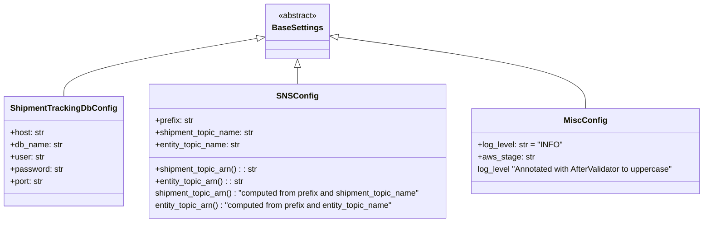

# Diagram: eta/extensions/src/config.py

> Auto-generated by Obscura crawlers

## Mermaid

### SVG

<svg id="container" width="1397.515625" xmlns="http://www.w3.org/2000/svg" class="classDiagram" height="438" viewBox="0 0 1397.515625 438" role="graphics-document document" aria-roledescription="class"><g><defs><marker id="container_class-aggregationStart" class="marker aggregation class" refX="18" refY="7" markerWidth="190" markerHeight="240" orient="auto"><path d="M 18,7 L9,13 L1,7 L9,1 Z"></path></marker></defs><defs><marker id="container_class-aggregationEnd" class="marker aggregation class" refX="1" refY="7" markerWidth="20" markerHeight="28" orient="auto"><path d="M 18,7 L9,13 L1,7 L9,1 Z"></path></marker></defs><defs><marker id="container_class-extensionStart" class="marker extension class" refX="18" refY="7" markerWidth="190" markerHeight="240" orient="auto"><path d="M 1,7 L18,13 V 1 Z"></path></marker></defs><defs><marker id="container_class-extensionEnd" class="marker extension class" refX="1" refY="7" markerWidth="20" markerHeight="28" orient="auto"><path d="M 1,1 V 13 L18,7 Z"></path></marker></defs><defs><marker id="container_class-compositionStart" class="marker composition class" refX="18" refY="7" markerWidth="190" markerHeight="240" orient="auto"><path d="M 18,7 L9,13 L1,7 L9,1 Z"></path></marker></defs><defs><marker id="container_class-compositionEnd" class="marker composition class" refX="1" refY="7" markerWidth="20" markerHeight="28" orient="auto"><path d="M 18,7 L9,13 L1,7 L9,1 Z"></path></marker></defs><defs><marker id="container_class-dependencyStart" class="marker dependency class" refX="6" refY="7" markerWidth="190" markerHeight="240" orient="auto"><path d="M 5,7 L9,13 L1,7 L9,1 Z"></path></marker></defs><defs><marker id="container_class-dependencyEnd" class="marker dependency class" refX="13" refY="7" markerWidth="20" markerHeight="28" orient="auto"><path d="M 18,7 L9,13 L14,7 L9,1 Z"></path></marker></defs><defs><marker id="container_class-lollipopStart" class="marker lollipop class" refX="13" refY="7" markerWidth="190" markerHeight="240" orient="auto"><circle stroke="black" fill="transparent" cx="7" cy="7" r="6"></circle></marker></defs><defs><marker id="container_class-lollipopEnd" class="marker lollipop class" refX="1" refY="7" markerWidth="190" markerHeight="240" orient="auto"><circle stroke="black" fill="transparent" cx="7" cy="7" r="6"></circle></marker></defs><g class="root"><g class="clusters"></g><g class="edgePaths"><path d="M506.427,75.137L442.279,86.114C378.131,97.091,249.835,119.046,185.687,138.189C121.539,157.333,121.539,173.667,121.539,181.833L121.539,190" id="id_BaseSettings_ShipmentTrackingDbConfig_1" class="edge-thickness-normal edge-pattern-solid relation" style=";;;" data-edge="true" data-et="edge" data-id="id_BaseSettings_ShipmentTrackingDbConfig_1" data-points="W3sieCI6NTIzLjQyOTY4NzUsInkiOjcyLjIyNzI3MjcyNzI3MjcyfSx7IngiOjEyMS41MzkwNjI1LCJ5IjoxNDF9LHsieCI6MTIxLjUzOTA2MjUsInkiOjE5MH1d" marker-start="url(#container_class-extensionStart)"></path><path d="M583.195,133.25L583.195,134.542C583.195,135.833,583.195,138.417,583.195,143.875C583.195,149.333,583.195,157.667,583.195,161.833L583.195,166" id="id_BaseSettings_SNSConfig_2" class="edge-thickness-normal edge-pattern-solid relation" style=";;;" data-edge="true" data-et="edge" data-id="id_BaseSettings_SNSConfig_2" data-points="W3sieCI6NTgzLjE5NTMxMjUsInkiOjExNn0seyJ4Ijo1ODMuMTk1MzEyNSwieSI6MTQxfSx7IngiOjU4My4xOTUzMTI1LCJ5IjoxNjZ9XQ==" marker-start="url(#container_class-extensionStart)"></path><path d="M660.052,72.519L743.445,83.932C826.839,95.346,993.627,118.173,1077.02,141.753C1160.414,165.333,1160.414,189.667,1160.414,201.833L1160.414,214" id="id_BaseSettings_MiscConfig_3" class="edge-thickness-normal edge-pattern-solid relation" style=";;;" data-edge="true" data-et="edge" data-id="id_BaseSettings_MiscConfig_3" data-points="W3sieCI6NjQyLjk2MDkzNzUsInkiOjcwLjE3OTcxNDE0NjQ5OTkyfSx7IngiOjExNjAuNDE0MDYyNSwieSI6MTQxfSx7IngiOjExNjAuNDE0MDYyNSwieSI6MjE0fV0=" marker-start="url(#container_class-extensionStart)"></path></g><g class="edgeLabels"><g class="edgeLabel"><g class="label" data-id="id_BaseSettings_ShipmentTrackingDbConfig_1" transform="translate(0, 0)"><foreignObject width="0" height="0">

</foreignObject></g></g><g class="edgeLabel"><g class="label" data-id="id_BaseSettings_SNSConfig_2" transform="translate(0, 0)"><foreignObject width="0" height="0">

</foreignObject></g></g><g class="edgeLabel"><g class="label" data-id="id_BaseSettings_MiscConfig_3" transform="translate(0, 0)"><foreignObject width="0" height="0">

</foreignObject></g></g></g><g class="nodes"><g class="node default" id="classId-BaseSettings-0" transform="translate(583.1953125, 62)"><g class="basic label-container"><path d="M-59.765625 -54 L59.765625 -54 L59.765625 54 L-59.765625 54" stroke="none" stroke-width="0" fill="#ECECFF" style=""></path><path d="M-59.765625 -54 C-32.86984348067077 -54, -5.97406196134154 -54, 59.765625 -54 M-59.765625 -54 C-33.988485732958395 -54, -8.211346465916783 -54, 59.765625 -54 M59.765625 -54 C59.765625 -16.283813447937227, 59.765625 21.432373104125546, 59.765625 54 M59.765625 -54 C59.765625 -22.00464089457179, 59.765625 9.990718210856421, 59.765625 54 M59.765625 54 C26.032542361344262 54, -7.700540277311475 54, -59.765625 54 M59.765625 54 C25.897261000105857 54, -7.971102999788286 54, -59.765625 54 M-59.765625 54 C-59.765625 16.113677171063564, -59.765625 -21.77264565787287, -59.765625 -54 M-59.765625 54 C-59.765625 18.618365769917148, -59.765625 -16.763268460165705, -59.765625 -54" stroke="#9370DB" stroke-width="1.3" fill="none" stroke-dasharray="0 0" style=""></path></g><g class="annotation-group text" transform="translate(-38.609375, -30)"><g class="label" style="" transform="translate(0,-12)"><foreignObject width="77.21875" height="24">

«abstract»

</foreignObject></g></g><g class="label-group text" transform="translate(-47.765625, -6)"><g class="label" style="font-weight: bolder" transform="translate(0,-12)"><foreignObject width="95.53125" height="24">

BaseSettings

</foreignObject></g></g><g class="members-group text" transform="translate(-47.765625, 42)"></g><g class="methods-group text" transform="translate(-47.765625, 72)"></g><g class="divider" style=""><path d="M-59.765625 18 C-17.28262442049798 18, 25.200376159004037 18, 59.765625 18 M-59.765625 18 C-30.046703954549052 18, -0.32778290909810437 18, 59.765625 18" stroke="#9370DB" stroke-width="1.3" fill="none" stroke-dasharray="0 0" style=""></path></g><g class="divider" style=""><path d="M-59.765625 36 C-26.95660499658863 36, 5.8524150068227385 36, 59.765625 36 M-59.765625 36 C-21.03666289042399 36, 17.69229921915202 36, 59.765625 36" stroke="#9370DB" stroke-width="1.3" fill="none" stroke-dasharray="0 0" style=""></path></g></g><g class="node default" id="classId-ShipmentTrackingDbConfig-1" transform="translate(121.5390625, 298)"><g class="basic label-container"><path d="M-113.5390625 -108 L113.5390625 -108 L113.5390625 108 L-113.5390625 108" stroke="none" stroke-width="0" fill="#ECECFF" style=""></path><path d="M-113.5390625 -108 C-34.591827294859115 -108, 44.35540791028177 -108, 113.5390625 -108 M-113.5390625 -108 C-33.638671477046856 -108, 46.26171954590629 -108, 113.5390625 -108 M113.5390625 -108 C113.5390625 -56.282235666589045, 113.5390625 -4.564471333178091, 113.5390625 108 M113.5390625 -108 C113.5390625 -39.44296984646397, 113.5390625 29.114060307072066, 113.5390625 108 M113.5390625 108 C64.44460505215703 108, 15.35014760431406 108, -113.5390625 108 M113.5390625 108 C34.951113242709724 108, -43.63683601458055 108, -113.5390625 108 M-113.5390625 108 C-113.5390625 45.29571738228914, -113.5390625 -17.40856523542172, -113.5390625 -108 M-113.5390625 108 C-113.5390625 48.634525391066795, -113.5390625 -10.73094921786641, -113.5390625 -108" stroke="#9370DB" stroke-width="1.3" fill="none" stroke-dasharray="0 0" style=""></path></g><g class="annotation-group text" transform="translate(0, -84)"></g><g class="label-group text" transform="translate(-98.9375, -84)"><g class="label" style="font-weight: bolder" transform="translate(0,-12)"><foreignObject width="197.875" height="24">

ShipmentTrackingDbConfig

</foreignObject></g></g><g class="members-group text" transform="translate(-101.5390625, -36)"><g class="label" style="" transform="translate(0,-12)"><foreignObject width="67.53125" height="24">

+host: str

</foreignObject></g><g class="label" style="" transform="translate(0,12)"><foreignObject width="103.078125" height="24">

+db_name: str

</foreignObject></g><g class="label" style="" transform="translate(0,36)"><foreignObject width="67.328125" height="24">

+user: str

</foreignObject></g><g class="label" style="" transform="translate(0,60)"><foreignObject width="104.140625" height="24">

+password: str

</foreignObject></g><g class="label" style="" transform="translate(0,84)"><foreignObject width="66.359375" height="24">

+port: str

</foreignObject></g></g><g class="methods-group text" transform="translate(-101.5390625, 108)"></g><g class="divider" style=""><path d="M-113.5390625 -60 C-59.34803215758372 -60, -5.157001815167433 -60, 113.5390625 -60 M-113.5390625 -60 C-23.629848169946044 -60, 66.27936616010791 -60, 113.5390625 -60" stroke="#9370DB" stroke-width="1.3" fill="none" stroke-dasharray="0 0" style=""></path></g><g class="divider" style=""><path d="M-113.5390625 84 C-57.92350667752034 84, -2.307950855040687 84, 113.5390625 84 M-113.5390625 84 C-64.2454271913579 84, -14.95179188271581 84, 113.5390625 84" stroke="#9370DB" stroke-width="1.3" fill="none" stroke-dasharray="0 0" style=""></path></g></g><g class="node default" id="classId-SNSConfig-2" transform="translate(583.1953125, 298)"><g class="basic label-container"><path d="M-298.1171875 -132 L298.1171875 -132 L298.1171875 132 L-298.1171875 132" stroke="none" stroke-width="0" fill="#ECECFF" style=""></path><path d="M-298.1171875 -132 C-117.57925989765508 -132, 62.958667704689844 -132, 298.1171875 -132 M-298.1171875 -132 C-135.26812620852098 -132, 27.580935082958035 -132, 298.1171875 -132 M298.1171875 -132 C298.1171875 -68.70349591854196, 298.1171875 -5.406991837083922, 298.1171875 132 M298.1171875 -132 C298.1171875 -35.43457729978152, 298.1171875 61.130845400436954, 298.1171875 132 M298.1171875 132 C133.29764631490954 132, -31.521894870180915 132, -298.1171875 132 M298.1171875 132 C85.38876635850252 132, -127.33965478299496 132, -298.1171875 132 M-298.1171875 132 C-298.1171875 50.89215233602363, -298.1171875 -30.215695327952744, -298.1171875 -132 M-298.1171875 132 C-298.1171875 75.13914291731543, -298.1171875 18.27828583463085, -298.1171875 -132" stroke="#9370DB" stroke-width="1.3" fill="none" stroke-dasharray="0 0" style=""></path></g><g class="annotation-group text" transform="translate(0, -108)"></g><g class="label-group text" transform="translate(-37.390625, -108)"><g class="label" style="font-weight: bolder" transform="translate(0,-12)"><foreignObject width="74.78125" height="24">

SNSConfig

</foreignObject></g></g><g class="members-group text" transform="translate(-286.1171875, -60)"><g class="label" style="" transform="translate(0,-12)"><foreignObject width="76.4375" height="24">

+prefix: str

</foreignObject></g><g class="label" style="" transform="translate(0,12)"><foreignObject width="197.3125" height="24">

+shipment_topic_name: str

</foreignObject></g><g class="label" style="" transform="translate(0,36)"><foreignObject width="170.34375" height="24">

+entity_topic_name: str

</foreignObject></g></g><g class="methods-group text" transform="translate(-286.1171875, 36)"><g class="label" style="" transform="translate(0,-12)"><foreignObject width="203.4375" height="24">

+shipment_topic_arn() : : str

</foreignObject></g><g class="label" style="" transform="translate(0,12)"><foreignObject width="176.453125" height="24">

+entity_topic_arn() : : str

</foreignObject></g><g class="label" style="" transform="translate(0,36)"><foreignObject width="534.84375" height="24">

shipment_topic_arn() : "computed from prefix and shipment_topic_name"

</foreignObject></g><g class="label" style="" transform="translate(0,60)"><foreignObject width="480.890625" height="24">

entity_topic_arn() : "computed from prefix and entity_topic_name"

</foreignObject></g></g><g class="divider" style=""><path d="M-298.1171875 -84 C-94.6547946569053 -84, 108.80759818618941 -84, 298.1171875 -84 M-298.1171875 -84 C-101.43410298266161 -84, 95.24898153467677 -84, 298.1171875 -84" stroke="#9370DB" stroke-width="1.3" fill="none" stroke-dasharray="0 0" style=""></path></g><g class="divider" style=""><path d="M-298.1171875 12 C-175.72706257275422 12, -53.33693764550847 12, 298.1171875 12 M-298.1171875 12 C-124.97912329079952 12, 48.15894091840096 12, 298.1171875 12" stroke="#9370DB" stroke-width="1.3" fill="none" stroke-dasharray="0 0" style=""></path></g></g><g class="node default" id="classId-MiscConfig-3" transform="translate(1160.4140625, 298)"><g class="basic label-container"><path d="M-229.1015625 -84 L229.1015625 -84 L229.1015625 84 L-229.1015625 84" stroke="none" stroke-width="0" fill="#ECECFF" style=""></path><path d="M-229.1015625 -84 C-66.0739735277345 -84, 96.95361544453101 -84, 229.1015625 -84 M-229.1015625 -84 C-83.23376364002957 -84, 62.63403521994087 -84, 229.1015625 -84 M229.1015625 -84 C229.1015625 -37.30054487252321, 229.1015625 9.398910254953577, 229.1015625 84 M229.1015625 -84 C229.1015625 -31.897438852389065, 229.1015625 20.20512229522187, 229.1015625 84 M229.1015625 84 C80.83625947182364 84, -67.42904355635272 84, -229.1015625 84 M229.1015625 84 C94.91585992301555 84, -39.26984265396891 84, -229.1015625 84 M-229.1015625 84 C-229.1015625 22.399869654581657, -229.1015625 -39.200260690836686, -229.1015625 -84 M-229.1015625 84 C-229.1015625 30.07972982663083, -229.1015625 -23.840540346738337, -229.1015625 -84" stroke="#9370DB" stroke-width="1.3" fill="none" stroke-dasharray="0 0" style=""></path></g><g class="annotation-group text" transform="translate(0, -60)"></g><g class="label-group text" transform="translate(-39.171875, -60)"><g class="label" style="font-weight: bolder" transform="translate(0,-12)"><foreignObject width="78.34375" height="24">

MiscConfig

</foreignObject></g></g><g class="members-group text" transform="translate(-217.1015625, -12)"><g class="label" style="" transform="translate(0,-12)"><foreignObject width="164.1875" height="24">

+log_level: str = "INFO"

</foreignObject></g><g class="label" style="" transform="translate(0,12)"><foreignObject width="109.28125" height="24">

+aws_stage: str

</foreignObject></g><g class="label" style="" transform="translate(0,36)"><foreignObject width="395.03125" height="24">

log_level "Annotated with AfterValidator to uppercase"

</foreignObject></g></g><g class="methods-group text" transform="translate(-217.1015625, 84)"></g><g class="divider" style=""><path d="M-229.1015625 -36 C-78.79848105303006 -36, 71.50460039393988 -36, 229.1015625 -36 M-229.1015625 -36 C-136.9235298506353 -36, -44.74549720127064 -36, 229.1015625 -36" stroke="#9370DB" stroke-width="1.3" fill="none" stroke-dasharray="0 0" style=""></path></g><g class="divider" style=""><path d="M-229.1015625 60 C-112.0870862296687 60, 4.927390040662601 60, 229.1015625 60 M-229.1015625 60 C-120.50475048580016 60, -11.907938471600318 60, 229.1015625 60" stroke="#9370DB" stroke-width="1.3" fill="none" stroke-dasharray="0 0" style=""></path></g></g></g></g></g></svg>
