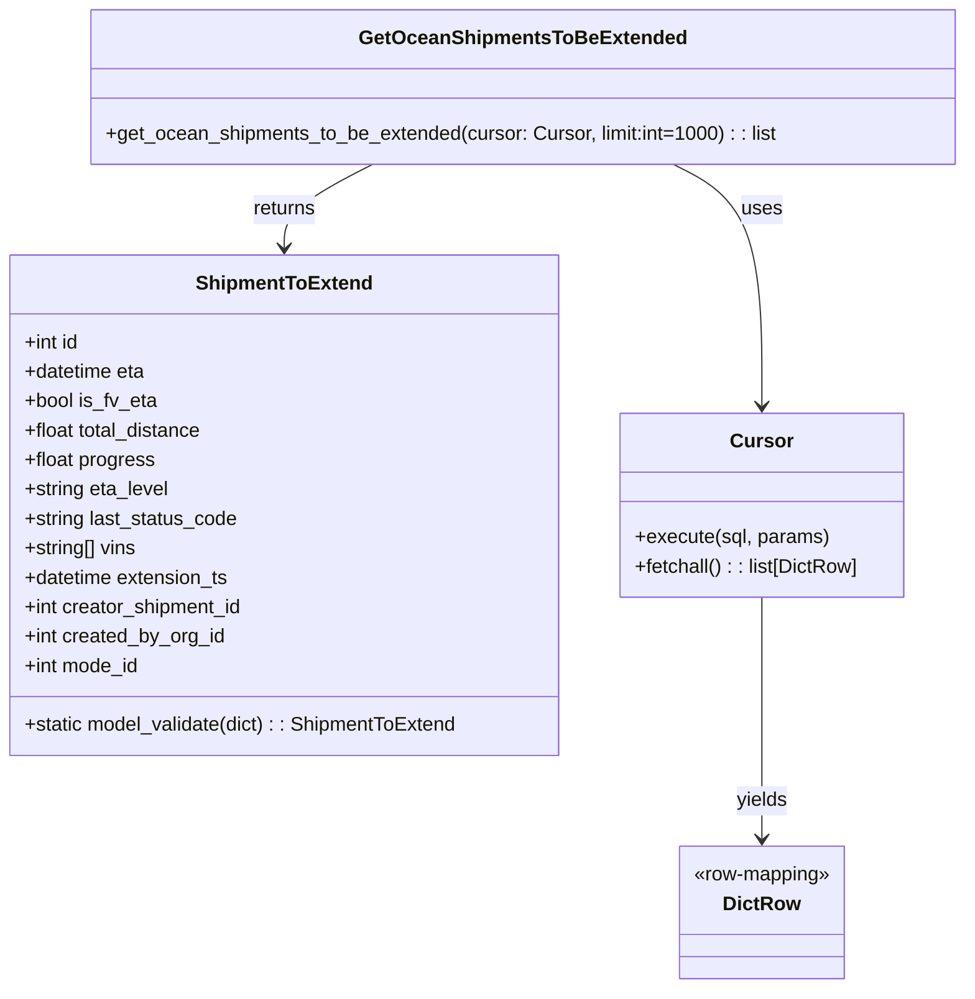

# Diagram: eta/extensions/src/db.py


> Auto-generated by Obscura crawlers

## Diagram 1

```mermaid
flowchart TD
    Start([Start]) --> Func[get_ocean_shipments_to_be_extended(cursor, limit)]
    Func --> Validate{cursor and limit valid?}
    Validate --> Build[Build SQL query string with selection and filters]
    Build --> Execute[cursor.execute(sql, [limit])]
    Execute --> Rows[cursor.fetchall()]
    Rows --> ToDict[for each row: dict(x)]
    ToDict --> ModelValidate[ShipmentToExtend.model_validate(dict)]
    ModelValidate --> Collect[collect results into list]
    Collect --> Return[return list[ShipmentToExtend]]
    Return --> End([End])
    Func --> Logger[logger]
    Func --> Tracer[tracer]
```

> SVG rendering failed for this diagram.

## Diagram 2



### SVG

<svg id="container" width="786.998046875" xmlns="http://www.w3.org/2000/svg" class="classDiagram" height="806" viewBox="0 0 786.998046875 806" role="graphics-document document" aria-roledescription="class"><style>#container{font-family:"trebuchet ms",verdana,arial,sans-serif;font-size:16px;fill:#333;}@keyframes edge-animation-frame{from{stroke-dashoffset:0;}}@keyframes dash{to{stroke-dashoffset:0;}}#container .edge-animation-slow{stroke-dasharray:9,5!important;stroke-dashoffset:900;animation:dash 50s linear infinite;stroke-linecap:round;}#container .edge-animation-fast{stroke-dasharray:9,5!important;stroke-dashoffset:900;animation:dash 20s linear infinite;stroke-linecap:round;}#container .error-icon{fill:#552222;}#container .error-text{fill:#552222;stroke:#552222;}#container .edge-thickness-normal{stroke-width:1px;}#container .edge-thickness-thick{stroke-width:3.5px;}#container .edge-pattern-solid{stroke-dasharray:0;}#container .edge-thickness-invisible{stroke-width:0;fill:none;}#container .edge-pattern-dashed{stroke-dasharray:3;}#container .edge-pattern-dotted{stroke-dasharray:2;}#container .marker{fill:#333333;stroke:#333333;}#container .marker.cross{stroke:#333333;}#container svg{font-family:"trebuchet ms",verdana,arial,sans-serif;font-size:16px;}#container p{margin:0;}#container g.classGroup text{fill:#9370DB;stroke:none;font-family:"trebuchet ms",verdana,arial,sans-serif;font-size:10px;}#container g.classGroup text .title{font-weight:bolder;}#container .nodeLabel,#container .edgeLabel{color:#131300;}#container .edgeLabel .label rect{fill:#ECECFF;}#container .label text{fill:#131300;}#container .labelBkg{background:#ECECFF;}#container .edgeLabel .label span{background:#ECECFF;}#container .classTitle{font-weight:bolder;}#container .node rect,#container .node circle,#container .node ellipse,#container .node polygon,#container .node path{fill:#ECECFF;stroke:#9370DB;stroke-width:1px;}#container .divider{stroke:#9370DB;stroke-width:1;}#container g.clickable{cursor:pointer;}#container g.classGroup rect{fill:#ECECFF;stroke:#9370DB;}#container g.classGroup line{stroke:#9370DB;stroke-width:1;}#container .classLabel .box{stroke:none;stroke-width:0;fill:#ECECFF;opacity:0.5;}#container .classLabel .label{fill:#9370DB;font-size:10px;}#container .relation{stroke:#333333;stroke-width:1;fill:none;}#container .dashed-line{stroke-dasharray:3;}#container .dotted-line{stroke-dasharray:1 2;}#container #compositionStart,#container .composition{fill:#333333!important;stroke:#333333!important;stroke-width:1;}#container #compositionEnd,#container .composition{fill:#333333!important;stroke:#333333!important;stroke-width:1;}#container #dependencyStart,#container .dependency{fill:#333333!important;stroke:#333333!important;stroke-width:1;}#container #dependencyStart,#container .dependency{fill:#333333!important;stroke:#333333!important;stroke-width:1;}#container #extensionStart,#container .extension{fill:transparent!important;stroke:#333333!important;stroke-width:1;}#container #extensionEnd,#container .extension{fill:transparent!important;stroke:#333333!important;stroke-width:1;}#container #aggregationStart,#container .aggregation{fill:transparent!important;stroke:#333333!important;stroke-width:1;}#container #aggregationEnd,#container .aggregation{fill:transparent!important;stroke:#333333!important;stroke-width:1;}#container #lollipopStart,#container .lollipop{fill:#ECECFF!important;stroke:#333333!important;stroke-width:1;}#container #lollipopEnd,#container .lollipop{fill:#ECECFF!important;stroke:#333333!important;stroke-width:1;}#container .edgeTerminals{font-size:11px;line-height:initial;}#container .classTitleText{text-anchor:middle;font-size:18px;fill:#333;}#container .label-icon{display:inline-block;height:1em;overflow:visible;vertical-align:-0.125em;}#container .node .label-icon path{fill:currentColor;stroke:revert;stroke-width:revert;}#container :root{--mermaid-font-family:"trebuchet ms",verdana,arial,sans-serif;}</style><g><defs><marker id="container_class-aggregationStart" class="marker aggregation class" refX="18" refY="7" markerWidth="190" markerHeight="240" orient="auto"><path d="M 18,7 L9,13 L1,7 L9,1 Z"></path></marker></defs><defs><marker id="container_class-aggregationEnd" class="marker aggregation class" refX="1" refY="7" markerWidth="20" markerHeight="28" orient="auto"><path d="M 18,7 L9,13 L1,7 L9,1 Z"></path></marker></defs><defs><marker id="container_class-extensionStart" class="marker extension class" refX="18" refY="7" markerWidth="190" markerHeight="240" orient="auto"><path d="M 1,7 L18,13 V 1 Z"></path></marker></defs><defs><marker id="container_class-extensionEnd" class="marker extension class" refX="1" refY="7" markerWidth="20" markerHeight="28" orient="auto"><path d="M 1,1 V 13 L18,7 Z"></path></marker></defs><defs><marker id="container_class-compositionStart" class="marker composition class" refX="18" refY="7" markerWidth="190" markerHeight="240" orient="auto"><path d="M 18,7 L9,13 L1,7 L9,1 Z"></path></marker></defs><defs><marker id="container_class-compositionEnd" class="marker composition class" refX="1" refY="7" markerWidth="20" markerHeight="28" orient="auto"><path d="M 18,7 L9,13 L1,7 L9,1 Z"></path></marker></defs><defs><marker id="container_class-dependencyStart" class="marker dependency class" refX="6" refY="7" markerWidth="190" markerHeight="240" orient="auto"><path d="M 5,7 L9,13 L1,7 L9,1 Z"></path></marker></defs><defs><marker id="container_class-dependencyEnd" class="marker dependency class" refX="13" refY="7" markerWidth="20" markerHeight="28" orient="auto"><path d="M 18,7 L9,13 L14,7 L9,1 Z"></path></marker></defs><defs><marker id="container_class-lollipopStart" class="marker lollipop class" refX="13" refY="7" markerWidth="190" markerHeight="240" orient="auto"><circle stroke="black" fill="transparent" cx="7" cy="7" r="6"></circle></marker></defs><defs><marker id="container_class-lollipopEnd" class="marker lollipop class" refX="1" refY="7" markerWidth="190" markerHeight="240" orient="auto"><circle stroke="black" fill="transparent" cx="7" cy="7" r="6"></circle></marker></defs><g class="root"><g class="clusters"></g><g class="edgePaths"><path d="M552.37,134L564.439,140.167C576.507,146.333,600.644,158.667,612.713,191.5C624.781,224.333,624.781,277.667,624.781,304.333L624.781,331" id="id_GetOceanShipmentsToBeExtended_Cursor_1" class="edge-thickness-normal edge-pattern-solid relation" style=";;;" data-edge="true" data-et="edge" data-id="id_GetOceanShipmentsToBeExtended_Cursor_1" data-points="W3sieCI6NTUyLjM3MDM3MTA5Mzc1LCJ5IjoxMzR9LHsieCI6NjI0Ljc4MTI1LCJ5IjoxNzF9LHsieCI6NjI0Ljc4MTI1LCJ5IjozMzd9XQ==" marker-end="url(#container_class-dependencyEnd)"></path><path d="M305.782,134L293.713,140.167C281.645,146.333,257.508,158.667,245.44,170C233.371,181.333,233.371,191.667,233.371,196.833L233.371,202" id="id_GetOceanShipmentsToBeExtended_ShipmentToExtend_2" class="edge-thickness-normal edge-pattern-solid relation" style=";;;" data-edge="true" data-et="edge" data-id="id_GetOceanShipmentsToBeExtended_ShipmentToExtend_2" data-points="W3sieCI6MzA1Ljc4MTk3MjY1NjI1LCJ5IjoxMzR9LHsieCI6MjMzLjM3MTA5Mzc1LCJ5IjoxNzF9LHsieCI6MjMzLjM3MTA5Mzc1LCJ5IjoyMDh9XQ==" marker-end="url(#container_class-dependencyEnd)"></path><path d="M624.781,487L624.781,514.667C624.781,542.333,624.781,597.667,624.781,630.5C624.781,663.333,624.781,673.667,624.781,678.833L624.781,684" id="id_Cursor_DictRow_3" class="edge-thickness-normal edge-pattern-solid relation" style=";;;" data-edge="true" data-et="edge" data-id="id_Cursor_DictRow_3" data-points="W3sieCI6NjI0Ljc4MTI1LCJ5Ijo0ODd9LHsieCI6NjI0Ljc4MTI1LCJ5Ijo2NTN9LHsieCI6NjI0Ljc4MTI1LCJ5Ijo2OTB9XQ==" marker-end="url(#container_class-dependencyEnd)"></path></g><g class="edgeLabels"><g class="edgeLabel" transform="translate(624.78125, 171)"><g class="label" data-id="id_GetOceanShipmentsToBeExtended_Cursor_1" transform="translate(-16.4921875, -12)"><foreignObject width="32.984375" height="24"><div xmlns="http://www.w3.org/1999/xhtml" class="labelBkg" style="display: table-cell; white-space: nowrap; line-height: 1.5; max-width: 200px; text-align: center;"><span class="edgeLabel"><p>uses</p></span></div></foreignObject></g></g><g class="edgeLabel" transform="translate(233.37109375, 171)"><g class="label" data-id="id_GetOceanShipmentsToBeExtended_ShipmentToExtend_2" transform="translate(-26.265625, -12)"><foreignObject width="52.53125" height="24"><div xmlns="http://www.w3.org/1999/xhtml" class="labelBkg" style="display: table-cell; white-space: nowrap; line-height: 1.5; max-width: 200px; text-align: center;"><span class="edgeLabel"><p>returns</p></span></div></foreignObject></g></g><g class="edgeLabel" transform="translate(624.78125, 653)"><g class="label" data-id="id_Cursor_DictRow_3" transform="translate(-21.3828125, -12)"><foreignObject width="42.765625" height="24"><div xmlns="http://www.w3.org/1999/xhtml" class="labelBkg" style="display: table-cell; white-space: nowrap; line-height: 1.5; max-width: 200px; text-align: center;"><span class="edgeLabel"><p>yields</p></span></div></foreignObject></g></g></g><g class="nodes"><g class="node default" id="classId-ShipmentToExtend-0" transform="translate(233.37109375, 412)"><g class="basic label-container"><path d="M-225.37109375 -204 L225.37109375 -204 L225.37109375 204 L-225.37109375 204" stroke="none" stroke-width="0" fill="#ECECFF" style=""></path><path d="M-225.37109375 -204 C-104.92605608709657 -204, 15.518981575806862 -204, 225.37109375 -204 M-225.37109375 -204 C-90.13954635409362 -204, 45.09200104181275 -204, 225.37109375 -204 M225.37109375 -204 C225.37109375 -116.6029015903884, 225.37109375 -29.205803180776797, 225.37109375 204 M225.37109375 -204 C225.37109375 -76.22249796066667, 225.37109375 51.555004078666656, 225.37109375 204 M225.37109375 204 C135.06847863119856 204, 44.76586351239709 204, -225.37109375 204 M225.37109375 204 C105.40336130361906 204, -14.564371142761871 204, -225.37109375 204 M-225.37109375 204 C-225.37109375 105.98366328398852, -225.37109375 7.9673265679770395, -225.37109375 -204 M-225.37109375 204 C-225.37109375 112.47202477714448, -225.37109375 20.944049554288966, -225.37109375 -204" stroke="#9370DB" stroke-width="1.3" fill="none" stroke-dasharray="0 0" style=""></path></g><g class="annotation-group text" transform="translate(0, -180)"></g><g class="label-group text" transform="translate(-68.7421875, -180)"><g class="label" style="font-weight: bolder" transform="translate(0,-12)"><foreignObject width="137.484375" height="24"><div xmlns="http://www.w3.org/1999/xhtml" style="display: table-cell; white-space: nowrap; line-height: 1.5; max-width: 186px; text-align: center;"><span class="nodeLabel markdown-node-label" style=""><p>ShipmentToExtend</p></span></div></foreignObject></g></g><g class="members-group text" transform="translate(-213.37109375, -132)"><g class="label" style="" transform="translate(0,-12)"><foreignObject width="45.96875" height="24"><div xmlns="http://www.w3.org/1999/xhtml" style="display: table-cell; white-space: nowrap; line-height: 1.5; max-width: 103px; text-align: center;"><span class="nodeLabel markdown-node-label" style=""><p>+int id</p></span></div></foreignObject></g><g class="label" style="" transform="translate(0,12)"><foreignObject width="100.5625" height="24"><div xmlns="http://www.w3.org/1999/xhtml" style="display: table-cell; white-space: nowrap; line-height: 1.5; max-width: 158px; text-align: center;"><span class="nodeLabel markdown-node-label" style=""><p>+datetime eta</p></span></div></foreignObject></g><g class="label" style="" transform="translate(0,36)"><foreignObject width="108.609375" height="24"><div xmlns="http://www.w3.org/1999/xhtml" style="display: table-cell; white-space: nowrap; line-height: 1.5; max-width: 166px; text-align: center;"><span class="nodeLabel markdown-node-label" style=""><p>+bool is_fv_eta</p></span></div></foreignObject></g><g class="label" style="" transform="translate(0,60)"><foreignObject width="148.171875" height="24"><div xmlns="http://www.w3.org/1999/xhtml" style="display: table-cell; white-space: nowrap; line-height: 1.5; max-width: 206px; text-align: center;"><span class="nodeLabel markdown-node-label" style=""><p>+float total_distance</p></span></div></foreignObject></g><g class="label" style="" transform="translate(0,84)"><foreignObject width="107.109375" height="24"><div xmlns="http://www.w3.org/1999/xhtml" style="display: table-cell; white-space: nowrap; line-height: 1.5; max-width: 164px; text-align: center;"><span class="nodeLabel markdown-node-label" style=""><p>+float progress</p></span></div></foreignObject></g><g class="label" style="" transform="translate(0,108)"><foreignObject width="119.59375" height="24"><div xmlns="http://www.w3.org/1999/xhtml" style="display: table-cell; white-space: nowrap; line-height: 1.5; max-width: 177px; text-align: center;"><span class="nodeLabel markdown-node-label" style=""><p>+string eta_level</p></span></div></foreignObject></g><g class="label" style="" transform="translate(0,132)"><foreignObject width="175.625" height="24"><div xmlns="http://www.w3.org/1999/xhtml" style="display: table-cell; white-space: nowrap; line-height: 1.5; max-width: 233px; text-align: center;"><span class="nodeLabel markdown-node-label" style=""><p>+string last_status_code</p></span></div></foreignObject></g><g class="label" style="" transform="translate(0,156)"><foreignObject width="93.40625" height="24"><div xmlns="http://www.w3.org/1999/xhtml" style="display: table-cell; white-space: nowrap; line-height: 1.5; max-width: 151px; text-align: center;"><span class="nodeLabel markdown-node-label" style=""><p>+string[] vins</p></span></div></foreignObject></g><g class="label" style="" transform="translate(0,180)"><foreignObject width="169.40625" height="24"><div xmlns="http://www.w3.org/1999/xhtml" style="display: table-cell; white-space: nowrap; line-height: 1.5; max-width: 227px; text-align: center;"><span class="nodeLabel markdown-node-label" style=""><p>+datetime extension_ts</p></span></div></foreignObject></g><g class="label" style="" transform="translate(0,204)"><foreignObject width="181.453125" height="24"><div xmlns="http://www.w3.org/1999/xhtml" style="display: table-cell; white-space: nowrap; line-height: 1.5; max-width: 239px; text-align: center;"><span class="nodeLabel markdown-node-label" style=""><p>+int creator_shipment_id</p></span></div></foreignObject></g><g class="label" style="" transform="translate(0,228)"><foreignObject width="165.546875" height="24"><div xmlns="http://www.w3.org/1999/xhtml" style="display: table-cell; white-space: nowrap; line-height: 1.5; max-width: 223px; text-align: center;"><span class="nodeLabel markdown-node-label" style=""><p>+int created_by_org_id</p></span></div></foreignObject></g><g class="label" style="" transform="translate(0,252)"><foreignObject width="95.3125" height="24"><div xmlns="http://www.w3.org/1999/xhtml" style="display: table-cell; white-space: nowrap; line-height: 1.5; max-width: 153px; text-align: center;"><span class="nodeLabel markdown-node-label" style=""><p>+int mode_id</p></span></div></foreignObject></g></g><g class="methods-group text" transform="translate(-213.37109375, 180)"><g class="label" style="" transform="translate(0,-12)"><foreignObject width="358" height="24"><div xmlns="http://www.w3.org/1999/xhtml" style="display: table-cell; white-space: nowrap; line-height: 1.5; max-width: 415px; text-align: center;"><span class="nodeLabel markdown-node-label" style=""><p>+static model_validate(dict) : : ShipmentToExtend</p></span></div></foreignObject></g></g><g class="divider" style=""><path d="M-225.37109375 -156 C-53.297718703866764 -156, 118.77565634226647 -156, 225.37109375 -156 M-225.37109375 -156 C-130.1304177706408 -156, -34.88974179128158 -156, 225.37109375 -156" stroke="#9370DB" stroke-width="1.3" fill="none" stroke-dasharray="0 0" style=""></path></g><g class="divider" style=""><path d="M-225.37109375 156 C-133.99032874614934 156, -42.60956374229869 156, 225.37109375 156 M-225.37109375 156 C-87.15317510023266 156, 51.06474354953468 156, 225.37109375 156" stroke="#9370DB" stroke-width="1.3" fill="none" stroke-dasharray="0 0" style=""></path></g></g><g class="node default" id="classId-Cursor-1" transform="translate(624.78125, 412)"><g class="basic label-container"><path d="M-116.0390625 -75 L116.0390625 -75 L116.0390625 75 L-116.0390625 75" stroke="none" stroke-width="0" fill="#ECECFF" style=""></path><path d="M-116.0390625 -75 C-24.73539172413919 -75, 66.56827905172162 -75, 116.0390625 -75 M-116.0390625 -75 C-26.15226675044778 -75, 63.73452899910444 -75, 116.0390625 -75 M116.0390625 -75 C116.0390625 -20.518664968549757, 116.0390625 33.962670062900486, 116.0390625 75 M116.0390625 -75 C116.0390625 -41.18873475273847, 116.0390625 -7.377469505476938, 116.0390625 75 M116.0390625 75 C35.436381282668876 75, -45.16629993466225 75, -116.0390625 75 M116.0390625 75 C33.575780972119645 75, -48.88750055576071 75, -116.0390625 75 M-116.0390625 75 C-116.0390625 16.77526646057455, -116.0390625 -41.4494670788509, -116.0390625 -75 M-116.0390625 75 C-116.0390625 18.394199353343332, -116.0390625 -38.211601293313336, -116.0390625 -75" stroke="#9370DB" stroke-width="1.3" fill="none" stroke-dasharray="0 0" style=""></path></g><g class="annotation-group text" transform="translate(0, -51)"></g><g class="label-group text" transform="translate(-23.90625, -51)"><g class="label" style="font-weight: bolder" transform="translate(0,-12)"><foreignObject width="47.8125" height="24"><div xmlns="http://www.w3.org/1999/xhtml" style="display: table-cell; white-space: nowrap; line-height: 1.5; max-width: 98px; text-align: center;"><span class="nodeLabel markdown-node-label" style=""><p>Cursor</p></span></div></foreignObject></g></g><g class="members-group text" transform="translate(-104.0390625, -3)"></g><g class="methods-group text" transform="translate(-104.0390625, 27)"><g class="label" style="" transform="translate(0,-12)"><foreignObject width="157.75" height="24"><div xmlns="http://www.w3.org/1999/xhtml" style="display: table-cell; white-space: nowrap; line-height: 1.5; max-width: 215px; text-align: center;"><span class="nodeLabel markdown-node-label" style=""><p>+execute(sql, params)</p></span></div></foreignObject></g><g class="label" style="" transform="translate(0,12)"><foreignObject width="184.171875" height="24"><div xmlns="http://www.w3.org/1999/xhtml" style="display: table-cell; white-space: nowrap; line-height: 1.5; max-width: 242px; text-align: center;"><span class="nodeLabel markdown-node-label" style=""><p>+fetchall() : : list[DictRow]</p></span></div></foreignObject></g></g><g class="divider" style=""><path d="M-116.0390625 -27 C-49.03973348809056 -27, 17.959595523818876 -27, 116.0390625 -27 M-116.0390625 -27 C-38.41155341508579 -27, 39.21595566982842 -27, 116.0390625 -27" stroke="#9370DB" stroke-width="1.3" fill="none" stroke-dasharray="0 0" style=""></path></g><g class="divider" style=""><path d="M-116.0390625 -3 C-28.421835542238966 -3, 59.19539141552207 -3, 116.0390625 -3 M-116.0390625 -3 C-50.53267370535626 -3, 14.97371508928748 -3, 116.0390625 -3" stroke="#9370DB" stroke-width="1.3" fill="none" stroke-dasharray="0 0" style=""></path></g></g><g class="node default" id="classId-DictRow-2" transform="translate(624.78125, 744)"><g class="basic label-container"><path d="M-69.4296875 -54 L69.4296875 -54 L69.4296875 54 L-69.4296875 54" stroke="none" stroke-width="0" fill="#ECECFF" style=""></path><path d="M-69.4296875 -54 C-36.47748622897503 -54, -3.5252849579500634 -54, 69.4296875 -54 M-69.4296875 -54 C-20.380212661293804 -54, 28.669262177412392 -54, 69.4296875 -54 M69.4296875 -54 C69.4296875 -20.50827610645623, 69.4296875 12.983447787087542, 69.4296875 54 M69.4296875 -54 C69.4296875 -14.965335820779252, 69.4296875 24.069328358441496, 69.4296875 54 M69.4296875 54 C40.131438521397996 54, 10.833189542795985 54, -69.4296875 54 M69.4296875 54 C20.194337723574925 54, -29.04101205285015 54, -69.4296875 54 M-69.4296875 54 C-69.4296875 29.869826964993454, -69.4296875 5.739653929986908, -69.4296875 -54 M-69.4296875 54 C-69.4296875 28.98731557301256, -69.4296875 3.974631146025118, -69.4296875 -54" stroke="#9370DB" stroke-width="1.3" fill="none" stroke-dasharray="0 0" style=""></path></g><g class="annotation-group text" transform="translate(-57.4296875, -30)"><g class="label" style="" transform="translate(0,-12)"><foreignObject width="114.859375" height="24"><div xmlns="http://www.w3.org/1999/xhtml" style="display: table-cell; white-space: nowrap; line-height: 1.5; max-width: 165px; text-align: center;"><span class="nodeLabel markdown-node-label" style=""><p>«row-mapping»</p></span></div></foreignObject></g></g><g class="label-group text" transform="translate(-29.8671875, -6)"><g class="label" style="font-weight: bolder" transform="translate(0,-12)"><foreignObject width="59.734375" height="24"><div xmlns="http://www.w3.org/1999/xhtml" style="display: table-cell; white-space: nowrap; line-height: 1.5; max-width: 109px; text-align: center;"><span class="nodeLabel markdown-node-label" style=""><p>DictRow</p></span></div></foreignObject></g></g><g class="members-group text" transform="translate(-57.4296875, 42)"></g><g class="methods-group text" transform="translate(-57.4296875, 72)"></g><g class="divider" style=""><path d="M-69.4296875 18 C-29.859635935352394 18, 9.710415629295213 18, 69.4296875 18 M-69.4296875 18 C-32.63737372016236 18, 4.154940059675283 18, 69.4296875 18" stroke="#9370DB" stroke-width="1.3" fill="none" stroke-dasharray="0 0" style=""></path></g><g class="divider" style=""><path d="M-69.4296875 36 C-23.656665363558986 36, 22.11635677288203 36, 69.4296875 36 M-69.4296875 36 C-14.263930149860343 36, 40.901827200279314 36, 69.4296875 36" stroke="#9370DB" stroke-width="1.3" fill="none" stroke-dasharray="0 0" style=""></path></g></g><g class="node default" id="classId-GetOceanShipmentsToBeExtended-3" transform="translate(429.076171875, 71)"><g class="basic label-container"><path d="M-349.921875 -63 L349.921875 -63 L349.921875 63 L-349.921875 63" stroke="none" stroke-width="0" fill="#ECECFF" style=""></path><path d="M-349.921875 -63 C-75.30164038242941 -63, 199.31859423514118 -63, 349.921875 -63 M-349.921875 -63 C-185.65530892848523 -63, -21.388742856970453 -63, 349.921875 -63 M349.921875 -63 C349.921875 -25.862861874391037, 349.921875 11.274276251217927, 349.921875 63 M349.921875 -63 C349.921875 -35.35561889254368, 349.921875 -7.711237785087363, 349.921875 63 M349.921875 63 C175.80773679251243 63, 1.6935985850248585 63, -349.921875 63 M349.921875 63 C109.40631275531769 63, -131.10924948936463 63, -349.921875 63 M-349.921875 63 C-349.921875 37.561500318624574, -349.921875 12.123000637249149, -349.921875 -63 M-349.921875 63 C-349.921875 14.904170850808306, -349.921875 -33.19165829838339, -349.921875 -63" stroke="#9370DB" stroke-width="1.3" fill="none" stroke-dasharray="0 0" style=""></path></g><g class="annotation-group text" transform="translate(0, -39)"></g><g class="label-group text" transform="translate(-126.375, -39)"><g class="label" style="font-weight: bolder" transform="translate(0,-12)"><foreignObject width="252.75" height="24"><div xmlns="http://www.w3.org/1999/xhtml" style="display: table-cell; white-space: nowrap; line-height: 1.5; max-width: 300px; text-align: center;"><span class="nodeLabel markdown-node-label" style=""><p>GetOceanShipmentsToBeExtended</p></span></div></foreignObject></g></g><g class="members-group text" transform="translate(-337.921875, 9)"></g><g class="methods-group text" transform="translate(-337.921875, 39)"><g class="label" style="" transform="translate(0,-12)"><foreignObject width="549.46875" height="24"><div xmlns="http://www.w3.org/1999/xhtml" style="display: table-cell; white-space: nowrap; line-height: 1.5; max-width: 607px; text-align: center;"><span class="nodeLabel markdown-node-label" style=""><p>+get_ocean_shipments_to_be_extended(cursor: Cursor, limit:int=1000) : : list</p></span></div></foreignObject></g></g><g class="divider" style=""><path d="M-349.921875 -15 C-165.2632708241156 -15, 19.395333351768784 -15, 349.921875 -15 M-349.921875 -15 C-112.74967590091134 -15, 124.42252319817732 -15, 349.921875 -15" stroke="#9370DB" stroke-width="1.3" fill="none" stroke-dasharray="0 0" style=""></path></g><g class="divider" style=""><path d="M-349.921875 9 C-168.8051217747528 9, 12.311631450494417 9, 349.921875 9 M-349.921875 9 C-81.64664758056915 9, 186.6285798388617 9, 349.921875 9" stroke="#9370DB" stroke-width="1.3" fill="none" stroke-dasharray="0 0" style=""></path></g></g></g></g></g></svg>
