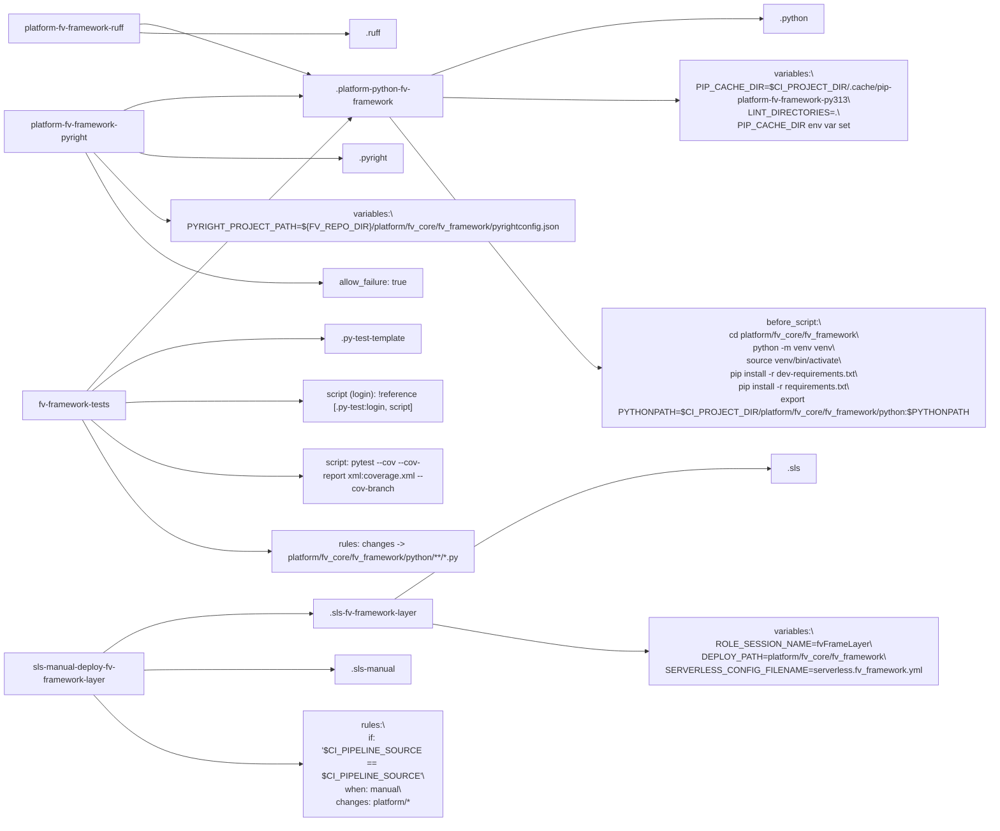

# Diagram: fv_core/fv_framework/.gitlab-ci.yml

> Auto-generated by Obscura crawlers

## Mermaid

### SVG

<svg id="container" width="2404.828125" xmlns="http://www.w3.org/2000/svg" class="flowchart" height="1418" viewBox="0 0 2404.828125 1418" role="graphics-document document" aria-roledescription="flowchart-v2"><g><marker id="container_flowchart-v2-pointEnd" class="marker flowchart-v2" viewBox="0 0 10 10" refX="5" refY="5" markerUnits="userSpaceOnUse" markerWidth="8" markerHeight="8" orient="auto"><path d="M 0 0 L 10 5 L 0 10 z" class="arrowMarkerPath" style="stroke-width: 1; stroke-dasharray: 1, 0;"></path></marker><marker id="container_flowchart-v2-pointStart" class="marker flowchart-v2" viewBox="0 0 10 10" refX="4.5" refY="5" markerUnits="userSpaceOnUse" markerWidth="8" markerHeight="8" orient="auto"><path d="M 0 5 L 10 10 L 10 0 z" class="arrowMarkerPath" style="stroke-width: 1; stroke-dasharray: 1, 0;"></path></marker><marker id="container_flowchart-v2-circleEnd" class="marker flowchart-v2" viewBox="0 0 10 10" refX="11" refY="5" markerUnits="userSpaceOnUse" markerWidth="11" markerHeight="11" orient="auto"><circle cx="5" cy="5" r="5" class="arrowMarkerPath" style="stroke-width: 1; stroke-dasharray: 1, 0;"></circle></marker><marker id="container_flowchart-v2-circleStart" class="marker flowchart-v2" viewBox="0 0 10 10" refX="-1" refY="5" markerUnits="userSpaceOnUse" markerWidth="11" markerHeight="11" orient="auto"><circle cx="5" cy="5" r="5" class="arrowMarkerPath" style="stroke-width: 1; stroke-dasharray: 1, 0;"></circle></marker><marker id="container_flowchart-v2-crossEnd" class="marker cross flowchart-v2" viewBox="0 0 11 11" refX="12" refY="5.2" markerUnits="userSpaceOnUse" markerWidth="11" markerHeight="11" orient="auto"><path d="M 1,1 l 9,9 M 10,1 l -9,9" class="arrowMarkerPath" style="stroke-width: 2; stroke-dasharray: 1, 0;"></path></marker><marker id="container_flowchart-v2-crossStart" class="marker cross flowchart-v2" viewBox="0 0 11 11" refX="-1" refY="5.2" markerUnits="userSpaceOnUse" markerWidth="11" markerHeight="11" orient="auto"><path d="M 1,1 l 9,9 M 10,1 l -9,9" class="arrowMarkerPath" style="stroke-width: 2; stroke-dasharray: 1, 0;"></path></marker><g class="root"><g class="clusters"></g><g class="edgePaths"><path d="M855.297,124.508L905.68,109.59C956.063,94.672,1056.828,64.836,1202.311,49.918C1347.794,35,1537.995,35,1633.095,35L1728.195,35" id="L_PPF_PY_0" class="edge-thickness-normal edge-pattern-solid edge-thickness-normal edge-pattern-solid flowchart-link" style=";" data-edge="true" data-et="edge" data-id="L_PPF_PY_0" data-points="W3sieCI6ODU1LjI5Njg3NSwieSI6MTI0LjUwNzkzMzYzOTM1Mzc1fSx7IngiOjExNTcuNTkzNzUsInkiOjM1fSx7IngiOjE3MzIuMTk1MzEyNSwieSI6MzV9XQ==" marker-end="url(#container_flowchart-v2-pointEnd)"></path><path d="M855.297,163L905.68,163C956.063,163,1056.828,163,1172.243,163C1287.659,163,1417.724,163,1482.757,163L1547.789,163" id="L_PPF_VARS_0" class="edge-thickness-normal edge-pattern-solid edge-thickness-normal edge-pattern-solid flowchart-link" style=";" data-edge="true" data-et="edge" data-id="L_PPF_VARS_0" data-points="W3sieCI6ODU1LjI5Njg3NSwieSI6MTYzfSx7IngiOjExNTcuNTkzNzUsInkiOjE2M30seyJ4IjoxNTUxLjc4OTA2MjUsInkiOjE2M31d" marker-end="url(#container_flowchart-v2-pointEnd)"></path><path d="M760.275,202L826.495,275.833C892.715,349.667,1025.154,497.333,1138.759,571.167C1252.365,645,1347.135,645,1394.521,645L1441.906,645" id="L_PPF_BS_0" class="edge-thickness-normal edge-pattern-solid edge-thickness-normal edge-pattern-solid flowchart-link" style=";" data-edge="true" data-et="edge" data-id="L_PPF_BS_0" data-points="W3sieCI6NzYwLjI3NTI1Mjg1MjY5NzEsInkiOjIwMn0seyJ4IjoxMTU3LjU5Mzc1LCJ5Ijo2NDV9LHsieCI6MTQ0NS45MDYyNSwieSI6NjQ1fV0=" marker-end="url(#container_flowchart-v2-pointEnd)"></path><path d="M242.224,186L250.687,182.833C259.149,179.667,276.075,173.333,334.254,169.707C392.432,166.08,491.865,165.16,541.581,164.7L591.297,164.24" id="L_PFPR_PPF_0" class="edge-thickness-normal edge-pattern-solid edge-thickness-normal edge-pattern-solid flowchart-link" style=";" data-edge="true" data-et="edge" data-id="L_PFPR_PPF_0" data-points="W3sieCI6MjQyLjIyNDEzNzkzMTAzNDQ4LCJ5IjoxODZ9LHsieCI6MjkzLCJ5IjoxNjd9LHsieCI6NTk1LjI5Njg3NSwieSI6MTY0LjIwMjg3NzA3Mzc3MDJ9XQ==" marker-end="url(#container_flowchart-v2-pointEnd)"></path><path d="M249.944,264L257.12,266.5C264.296,269,278.648,274,347.598,276.5C416.547,279,540.094,279,601.867,279L663.641,279" id="L_PFPR_PYR_0" class="edge-thickness-normal edge-pattern-solid edge-thickness-normal edge-pattern-solid flowchart-link" style=";" data-edge="true" data-et="edge" data-id="L_PFPR_PYR_0" data-points="W3sieCI6MjQ5Ljk0NDQ0NDQ0NDQ0NDQ2LCJ5IjoyNjR9LHsieCI6MjkzLCJ5IjoyNzl9LHsieCI6NjY3LjY0MDYyNSwieSI6Mjc5fV0=" marker-end="url(#container_flowchart-v2-pointEnd)"></path><path d="M176.259,264L195.716,283.833C215.173,303.667,254.086,343.333,277.043,363.167C300,383,307,383,310.5,383L314,383" id="L_PFPR_PYR_VAR_0" class="edge-thickness-normal edge-pattern-solid edge-thickness-normal edge-pattern-solid flowchart-link" style=";" data-edge="true" data-et="edge" data-id="L_PFPR_PYR_VAR_0" data-points="W3sieCI6MTc2LjI1OTQ5MzY3MDg4NjA2LCJ5IjoyNjR9LHsieCI6MjkzLCJ5IjozODN9LHsieCI6MzE4LCJ5IjozODN9XQ==" marker-end="url(#container_flowchart-v2-pointEnd)"></path><path d="M161.073,264L183.06,301.167C205.048,338.333,249.024,412.667,326.474,449.833C403.924,487,514.849,487,570.311,487L625.773,487" id="L_PFPR_ALLOW_0" class="edge-thickness-normal edge-pattern-solid edge-thickness-normal edge-pattern-solid flowchart-link" style=";" data-edge="true" data-et="edge" data-id="L_PFPR_ALLOW_0" data-points="W3sieCI6MTYxLjA3MjUxOTA4Mzk2OTQ3LCJ5IjoyNjR9LHsieCI6MjkzLCJ5Ijo0ODd9LHsieCI6NjI5Ljc3MzQzNzUsInkiOjQ4N31d" marker-end="url(#container_flowchart-v2-pointEnd)"></path><path d="M266.953,32.68L271.294,32.4C275.635,32.12,284.318,31.56,338.783,46.585C393.249,61.611,493.498,92.221,543.623,107.527L593.747,122.832" id="L_PFR_PPF_0" class="edge-thickness-normal edge-pattern-solid edge-thickness-normal edge-pattern-solid flowchart-link" style=";" data-edge="true" data-et="edge" data-id="L_PFR_PPF_0" data-points="W3sieCI6MjY2Ljk1MzEyNSwieSI6MzIuNjgwNDQzNTQ4Mzg3MDk2fSx7IngiOjI5MywieSI6MzF9LHsieCI6NTk3LjU3Mjc5ODI5NTQ1NDUsInkiOjEyNH1d" marker-end="url(#container_flowchart-v2-pointEnd)"></path><path d="M266.953,49.32L271.294,49.6C275.635,49.88,284.318,50.44,352.536,50.129C420.755,49.818,548.511,48.636,612.388,48.045L676.266,47.454" id="L_PFR_RU_0" class="edge-thickness-normal edge-pattern-solid edge-thickness-normal edge-pattern-solid flowchart-link" style=";" data-edge="true" data-et="edge" data-id="L_PFR_RU_0" data-points="W3sieCI6MjY2Ljk1MzEyNSwieSI6NDkuMzE5NTU2NDUxNjEyOTA0fSx7IngiOjI5MywieSI6NTF9LHsieCI6NjgwLjI2NTYyNSwieSI6NDcuNDE2NjY5Njc4Njc4NTd9XQ==" marker-end="url(#container_flowchart-v2-pointEnd)"></path><path d="M162.911,680L184.592,656.5C206.274,633,249.637,586,335.392,506.771C421.146,427.542,549.293,316.083,613.366,260.354L677.439,204.625" id="L_FVTEST_PPF_0" class="edge-thickness-normal edge-pattern-solid edge-thickness-normal edge-pattern-solid flowchart-link" style=";" data-edge="true" data-et="edge" data-id="L_FVTEST_PPF_0" data-points="W3sieCI6MTYyLjkxMDcxNDI4NTcxNDI4LCJ5Ijo2ODB9LHsieCI6MjkzLCJ5Ijo1Mzl9LHsieCI6NjgwLjQ1NzU3MTQ3NjA2MzgsInkiOjIwMn1d" marker-end="url(#container_flowchart-v2-pointEnd)"></path><path d="M174.078,680L193.898,665.167C213.718,650.333,253.359,620.667,329.092,605.833C404.826,591,516.651,591,572.564,591L628.477,591" id="L_FVTEST_PYT_0" class="edge-thickness-normal edge-pattern-solid edge-thickness-normal edge-pattern-solid flowchart-link" style=";" data-edge="true" data-et="edge" data-id="L_FVTEST_PYT_0" data-points="W3sieCI6MTc0LjA3NzU4NjIwNjg5NjU3LCJ5Ijo2ODB9LHsieCI6MjkzLCJ5Ijo1OTF9LHsieCI6NjMyLjQ3NjU2MjUsInkiOjU5MX1d" marker-end="url(#container_flowchart-v2-pointEnd)"></path><path d="M236.688,707L246.073,707C255.458,707,274.229,707,333.331,707C392.432,707,491.865,707,541.581,707L591.297,707" id="L_FVTEST_LOGIN_0" class="edge-thickness-normal edge-pattern-solid edge-thickness-normal edge-pattern-solid flowchart-link" style=";" data-edge="true" data-et="edge" data-id="L_FVTEST_LOGIN_0" data-points="W3sieCI6MjM2LjY4NzUsInkiOjcwN30seyJ4IjoyOTMsInkiOjcwN30seyJ4Ijo1OTUuMjk2ODc1LCJ5Ijo3MDd9XQ==" marker-end="url(#container_flowchart-v2-pointEnd)"></path><path d="M167.893,734L188.744,752.833C209.595,771.667,251.298,809.333,321.865,828.167C392.432,847,491.865,847,541.581,847L591.297,847" id="L_FVTEST_PYTEST_CMD_0" class="edge-thickness-normal edge-pattern-solid edge-thickness-normal edge-pattern-solid flowchart-link" style=";" data-edge="true" data-et="edge" data-id="L_FVTEST_PYTEST_CMD_0" data-points="W3sieCI6MTY3Ljg5Mjg1NzE0Mjg1NzE0LCJ5Ijo3MzR9LHsieCI6MjkzLCJ5Ijo4NDd9LHsieCI6NTk1LjI5Njg3NSwieSI6ODQ3fV0=" marker-end="url(#container_flowchart-v2-pointEnd)"></path><path d="M152.946,734L176.289,776.167C199.631,818.333,246.315,902.667,307.401,944.833C368.487,987,443.974,987,481.717,987L519.461,987" id="L_FVTEST_RULES_0" class="edge-thickness-normal edge-pattern-solid edge-thickness-normal edge-pattern-solid flowchart-link" style=";" data-edge="true" data-et="edge" data-id="L_FVTEST_RULES_0" data-points="W3sieCI6MTUyLjk0NjQyODU3MTQyODU4LCJ5Ijo3MzR9LHsieCI6MjkzLCJ5Ijo5ODd9LHsieCI6NTIzLjQ2MDkzNzUsInkiOjk4N31d" marker-end="url(#container_flowchart-v2-pointEnd)"></path><path d="M762.001,1076L827.933,1027.5C893.865,979,1025.73,882,1189.386,833.5C1353.042,785,1548.49,785,1646.214,785L1743.938,785" id="L_SLSL_SLS_0" class="edge-thickness-normal edge-pattern-solid edge-thickness-normal edge-pattern-solid flowchart-link" style=";" data-edge="true" data-et="edge" data-id="L_SLSL_SLS_0" data-points="W3sieCI6NzYyLjAwMTMyNjY1MDk0MzQsInkiOjEwNzZ9LHsieCI6MTE1Ny41OTM3NSwieSI6Nzg1fSx7IngiOjE3NDcuOTM3NSwieSI6Nzg1fV0=" marker-end="url(#container_flowchart-v2-pointEnd)"></path><path d="M839.211,1116.702L892.275,1123.085C945.339,1129.468,1051.466,1142.234,1108.03,1148.617C1164.594,1155,1171.594,1155,1175.094,1155L1178.594,1155" id="L_SLSL_SLSL_VARS_0" class="edge-thickness-normal edge-pattern-solid edge-thickness-normal edge-pattern-solid flowchart-link" style=";" data-edge="true" data-et="edge" data-id="L_SLSL_SLSL_VARS_0" data-points="W3sieCI6ODM5LjIxMDkzNzUsInkiOjExMTYuNzAyNDYxNDE2MTI3Nn0seyJ4IjoxMTU3LjU5Mzc1LCJ5IjoxMTU1fSx7IngiOjExODIuNTkzNzUsInkiOjExNTV9XQ==" marker-end="url(#container_flowchart-v2-pointEnd)"></path><path d="M196.125,1168L212.271,1157.167C228.417,1146.333,260.708,1124.667,329.251,1113.833C397.794,1103,502.589,1103,554.986,1103L607.383,1103" id="L_SLSMD_SLSL_0" class="edge-thickness-normal edge-pattern-solid edge-thickness-normal edge-pattern-solid flowchart-link" style=";" data-edge="true" data-et="edge" data-id="L_SLSMD_SLSL_0" data-points="W3sieCI6MTk2LjEyNSwieSI6MTE2OH0seyJ4IjoyOTMsInkiOjExMDN9LHsieCI6NjExLjM4MjgxMjUsInkiOjExMDN9XQ==" marker-end="url(#container_flowchart-v2-pointEnd)"></path><path d="M268,1207L272.167,1207C276.333,1207,284.667,1207,348.202,1207C411.737,1207,530.474,1207,589.842,1207L649.211,1207" id="L_SLSMD_SLSM_0" class="edge-thickness-normal edge-pattern-solid edge-thickness-normal edge-pattern-solid flowchart-link" style=";" data-edge="true" data-et="edge" data-id="L_SLSMD_SLSM_0" data-points="W3sieCI6MjY4LCJ5IjoxMjA3fSx7IngiOjI5MywieSI6MTIwN30seyJ4Ijo2NTMuMjEwOTM3NSwieSI6MTIwN31d" marker-end="url(#container_flowchart-v2-pointEnd)"></path><path d="M181.179,1246L199.815,1262.833C218.452,1279.667,255.726,1313.333,321.729,1330.167C387.732,1347,482.464,1347,529.829,1347L577.195,1347" id="L_SLSMD_SLSMD_RULES_0" class="edge-thickness-normal edge-pattern-solid edge-thickness-normal edge-pattern-solid flowchart-link" style=";" data-edge="true" data-et="edge" data-id="L_SLSMD_SLSMD_RULES_0" data-points="W3sieCI6MTgxLjE3ODU3MTQyODU3MTQ0LCJ5IjoxMjQ2fSx7IngiOjI5MywieSI6MTM0N30seyJ4Ijo1ODEuMTk1MzEyNSwieSI6MTM0N31d" marker-end="url(#container_flowchart-v2-pointEnd)"></path></g><g class="edgeLabels"><g class="edgeLabel"><g class="label" data-id="L_PPF_PY_0" transform="translate(0, 0)"><foreignObject width="0" height="0">

</foreignObject></g></g><g class="edgeLabel"><g class="label" data-id="L_PPF_VARS_0" transform="translate(0, 0)"><foreignObject width="0" height="0">

</foreignObject></g></g><g class="edgeLabel"><g class="label" data-id="L_PPF_BS_0" transform="translate(0, 0)"><foreignObject width="0" height="0">

</foreignObject></g></g><g class="edgeLabel"><g class="label" data-id="L_PFPR_PPF_0" transform="translate(0, 0)"><foreignObject width="0" height="0">

</foreignObject></g></g><g class="edgeLabel"><g class="label" data-id="L_PFPR_PYR_0" transform="translate(0, 0)"><foreignObject width="0" height="0">

</foreignObject></g></g><g class="edgeLabel"><g class="label" data-id="L_PFPR_PYR_VAR_0" transform="translate(0, 0)"><foreignObject width="0" height="0">

</foreignObject></g></g><g class="edgeLabel"><g class="label" data-id="L_PFPR_ALLOW_0" transform="translate(0, 0)"><foreignObject width="0" height="0">

</foreignObject></g></g><g class="edgeLabel"><g class="label" data-id="L_PFR_PPF_0" transform="translate(0, 0)"><foreignObject width="0" height="0">

</foreignObject></g></g><g class="edgeLabel"><g class="label" data-id="L_PFR_RU_0" transform="translate(0, 0)"><foreignObject width="0" height="0">

</foreignObject></g></g><g class="edgeLabel"><g class="label" data-id="L_FVTEST_PPF_0" transform="translate(0, 0)"><foreignObject width="0" height="0">

</foreignObject></g></g><g class="edgeLabel"><g class="label" data-id="L_FVTEST_PYT_0" transform="translate(0, 0)"><foreignObject width="0" height="0">

</foreignObject></g></g><g class="edgeLabel"><g class="label" data-id="L_FVTEST_LOGIN_0" transform="translate(0, 0)"><foreignObject width="0" height="0">

</foreignObject></g></g><g class="edgeLabel"><g class="label" data-id="L_FVTEST_PYTEST_CMD_0" transform="translate(0, 0)"><foreignObject width="0" height="0">

</foreignObject></g></g><g class="edgeLabel"><g class="label" data-id="L_FVTEST_RULES_0" transform="translate(0, 0)"><foreignObject width="0" height="0">

</foreignObject></g></g><g class="edgeLabel"><g class="label" data-id="L_SLSL_SLS_0" transform="translate(0, 0)"><foreignObject width="0" height="0">

</foreignObject></g></g><g class="edgeLabel"><g class="label" data-id="L_SLSL_SLSL_VARS_0" transform="translate(0, 0)"><foreignObject width="0" height="0">

</foreignObject></g></g><g class="edgeLabel"><g class="label" data-id="L_SLSMD_SLSL_0" transform="translate(0, 0)"><foreignObject width="0" height="0">

</foreignObject></g></g><g class="edgeLabel"><g class="label" data-id="L_SLSMD_SLSM_0" transform="translate(0, 0)"><foreignObject width="0" height="0">

</foreignObject></g></g><g class="edgeLabel"><g class="label" data-id="L_SLSMD_SLSMD_RULES_0" transform="translate(0, 0)"><foreignObject width="0" height="0">

</foreignObject></g></g></g><g class="nodes"><g class="node default" id="flowchart-PY-0" transform="translate(1789.7109375, 35)"><rect class="basic label-container" style="" x="-57.515625" y="-27" width="115.03125" height="54"></rect><g class="label" style="" transform="translate(-27.515625, -12)"><rect></rect><foreignObject width="55.03125" height="24">

.python

</foreignObject></g></g><g class="node default" id="flowchart-PYR-1" transform="translate(725.296875, 279)"><rect class="basic label-container" style="" x="-57.65625" y="-27" width="115.3125" height="54"></rect><g class="label" style="" transform="translate(-27.65625, -12)"><rect></rect><foreignObject width="55.3125" height="24">

.pyright

</foreignObject></g></g><g class="node default" id="flowchart-RU-2" transform="translate(725.296875, 47)"><rect class="basic label-container" style="" x="-45.03125" y="-27" width="90.0625" height="54"></rect><g class="label" style="" transform="translate(-15.03125, -12)"><rect></rect><foreignObject width="30.0625" height="24">

.ruff

</foreignObject></g></g><g class="node default" id="flowchart-PYT-3" transform="translate(725.296875, 591)"><rect class="basic label-container" style="" x="-92.8203125" y="-27" width="185.640625" height="54"></rect><g class="label" style="" transform="translate(-62.8203125, -12)"><rect></rect><foreignObject width="125.640625" height="24">

.py-test-template

</foreignObject></g></g><g class="node default" id="flowchart-SLS-4" transform="translate(1789.7109375, 785)"><rect class="basic label-container" style="" x="-41.7734375" y="-27" width="83.546875" height="54"></rect><g class="label" style="" transform="translate(-11.7734375, -12)"><rect></rect><foreignObject width="23.546875" height="24">

.sls

</foreignObject></g></g><g class="node default" id="flowchart-SLSM-5" transform="translate(725.296875, 1207)"><rect class="basic label-container" style="" x="-72.0859375" y="-27" width="144.171875" height="54"></rect><g class="label" style="" transform="translate(-42.0859375, -12)"><rect></rect><foreignObject width="84.171875" height="24">

.sls-manual

</foreignObject></g></g><g class="node default" id="flowchart-PPF-6" transform="translate(725.296875, 163)"><rect class="basic label-container" style="" x="-130" y="-39" width="260" height="78"></rect><g class="label" style="" transform="translate(-100, -24)"><rect></rect><foreignObject width="200" height="48">

.platform-python-fv-framework

</foreignObject></g></g><g class="node default" id="flowchart-VARS-9" transform="translate(1789.7109375, 163)"><rect class="basic label-container" style="" x="-237.921875" y="-51" width="475.84375" height="102"></rect><g class="label" style="" transform="translate(-207.921875, -36)"><rect></rect><foreignObject width="415.84375" height="72">

variables:\nPIP_CACHE_DIR=$CI_PROJECT_DIR/.cache/pip-platform-fv-framework-py313\nLINT_DIRECTORIES=.\nPIP_CACHE_DIR env var set

</foreignObject></g></g><g class="node default" id="flowchart-BS-12" transform="translate(1789.7109375, 645)"><rect class="basic label-container" style="" x="-343.8046875" y="-63" width="687.609375" height="126"></rect><g class="label" style="" transform="translate(-313.8046875, -48)"><rect></rect><foreignObject width="627.609375" height="96">

before_script:\ncd platform/fv_core/fv_framework\npython -m venv venv\nsource venv/bin/activate\npip install -r dev-requirements.txt\npip install -r requirements.txt\nexport PYTHONPATH=$CI_PROJECT_DIR/platform/fv_core/fv_framework/python:$PYTHONPATH

</foreignObject></g></g><g class="node default" id="flowchart-PFPR-15" transform="translate(138, 225)"><rect class="basic label-container" style="" x="-130" y="-39" width="260" height="78"></rect><g class="label" style="" transform="translate(-100, -24)"><rect></rect><foreignObject width="200" height="48">

platform-fv-framework-pyright

</foreignObject></g></g><g class="node default" id="flowchart-PYR_VAR-21" transform="translate(725.296875, 383)"><rect class="basic label-container" style="" x="-407.296875" y="-27" width="814.59375" height="54"></rect><g class="label" style="" transform="translate(-377.296875, -12)"><rect></rect><foreignObject width="754.59375" height="24">

variables:\nPYRIGHT_PROJECT_PATH=${FV_REPO_DIR}/platform/fv_core/fv_framework/pyrightconfig.json

</foreignObject></g></g><g class="node default" id="flowchart-ALLOW-23" transform="translate(725.296875, 487)"><rect class="basic label-container" style="" x="-95.5234375" y="-27" width="191.046875" height="54"></rect><g class="label" style="" transform="translate(-65.5234375, -12)"><rect></rect><foreignObject width="131.046875" height="24">

allow_failure: true

</foreignObject></g></g><g class="node default" id="flowchart-PFR-24" transform="translate(138, 41)"><rect class="basic label-container" style="" x="-128.953125" y="-27" width="257.90625" height="54"></rect><g class="label" style="" transform="translate(-98.953125, -12)"><rect></rect><foreignObject width="197.90625" height="24">

platform-fv-framework-ruff

</foreignObject></g></g><g class="node default" id="flowchart-FVTEST-29" transform="translate(138, 707)"><rect class="basic label-container" style="" x="-98.6875" y="-27" width="197.375" height="54"></rect><g class="label" style="" transform="translate(-68.6875, -12)"><rect></rect><foreignObject width="137.375" height="24">

fv-framework-tests

</foreignObject></g></g><g class="node default" id="flowchart-LOGIN-35" transform="translate(725.296875, 707)"><rect class="basic label-container" style="" x="-130" y="-39" width="260" height="78"></rect><g class="label" style="" transform="translate(-100, -24)"><rect></rect><foreignObject width="200" height="48">

script (login): !reference [.py-test:login, script]

</foreignObject></g></g><g class="node default" id="flowchart-PYTEST_CMD-37" transform="translate(725.296875, 847)"><rect class="basic label-container" style="" x="-130" y="-51" width="260" height="102"></rect><g class="label" style="" transform="translate(-100, -36)"><rect></rect><foreignObject width="200" height="72">

script: pytest --cov --cov-report xml:coverage.xml --cov-branch

</foreignObject></g></g><g class="node default" id="flowchart-RULES-39" transform="translate(725.296875, 987)"><rect class="basic label-container" style="" x="-201.8359375" y="-39" width="403.671875" height="78"></rect><g class="label" style="" transform="translate(-171.8359375, -24)"><rect></rect><foreignObject width="343.671875" height="48">

rules: changes -&gt; platform/fv_core/fv_framework/python/**/*.py

</foreignObject></g></g><g class="node default" id="flowchart-SLSL-40" transform="translate(725.296875, 1103)"><rect class="basic label-container" style="" x="-113.9140625" y="-27" width="227.828125" height="54"></rect><g class="label" style="" transform="translate(-83.9140625, -12)"><rect></rect><foreignObject width="167.828125" height="24">

.sls-fv-framework-layer

</foreignObject></g></g><g class="node default" id="flowchart-SLSL_VARS-44" transform="translate(1789.7109375, 1155)"><rect class="basic label-container" style="" x="-607.1171875" y="-27" width="1214.234375" height="54"></rect><g class="label" style="" transform="translate(-577.1171875, -12)"><rect></rect><foreignObject width="1154.234375" height="24">

variables:\nROLE_SESSION_NAME=fvFrameLayer\nDEPLOY_PATH=platform/fv_core/fv_framework\nSERVERLESS_CONFIG_FILENAME=serverless.fv_framework.yml

</foreignObject></g></g><g class="node default" id="flowchart-SLSMD-45" transform="translate(138, 1207)"><rect class="basic label-container" style="" x="-130" y="-39" width="260" height="78"></rect><g class="label" style="" transform="translate(-100, -24)"><rect></rect><foreignObject width="200" height="48">

sls-manual-deploy-fv-framework-layer

</foreignObject></g></g><g class="node default" id="flowchart-SLSMD_RULES-51" transform="translate(725.296875, 1347)"><rect class="basic label-container" style="" x="-144.1015625" y="-63" width="288.203125" height="126"></rect><g class="label" style="" transform="translate(-114.1015625, -48)"><rect></rect><foreignObject width="228.203125" height="96">

rules:\nif: '$CI_PIPELINE_SOURCE == $CI_PIPELINE_SOURCE'\nwhen: manual\nchanges: platform/*

</foreignObject></g></g></g></g></g></svg>
