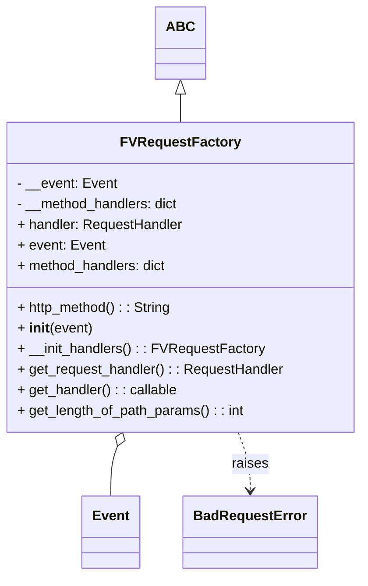

# Diagram: fv_core/fv_framework/python/fv_framework/api/FVRequestFactory.py

> Auto-generated by Obscura crawlers

## Mermaid

### SVG

<svg id="container" width="416.0703125" xmlns="http://www.w3.org/2000/svg" class="classDiagram" height="668" viewBox="0 0 416.0703125 668" role="graphics-document document" aria-roledescription="class"><g><defs><marker id="container_class-aggregationStart" class="marker aggregation class" refX="18" refY="7" markerWidth="190" markerHeight="240" orient="auto"><path d="M 18,7 L9,13 L1,7 L9,1 Z"></path></marker></defs><defs><marker id="container_class-aggregationEnd" class="marker aggregation class" refX="1" refY="7" markerWidth="20" markerHeight="28" orient="auto"><path d="M 18,7 L9,13 L1,7 L9,1 Z"></path></marker></defs><defs><marker id="container_class-extensionStart" class="marker extension class" refX="18" refY="7" markerWidth="190" markerHeight="240" orient="auto"><path d="M 1,7 L18,13 V 1 Z"></path></marker></defs><defs><marker id="container_class-extensionEnd" class="marker extension class" refX="1" refY="7" markerWidth="20" markerHeight="28" orient="auto"><path d="M 1,1 V 13 L18,7 Z"></path></marker></defs><defs><marker id="container_class-compositionStart" class="marker composition class" refX="18" refY="7" markerWidth="190" markerHeight="240" orient="auto"><path d="M 18,7 L9,13 L1,7 L9,1 Z"></path></marker></defs><defs><marker id="container_class-compositionEnd" class="marker composition class" refX="1" refY="7" markerWidth="20" markerHeight="28" orient="auto"><path d="M 18,7 L9,13 L1,7 L9,1 Z"></path></marker></defs><defs><marker id="container_class-dependencyStart" class="marker dependency class" refX="6" refY="7" markerWidth="190" markerHeight="240" orient="auto"><path d="M 5,7 L9,13 L1,7 L9,1 Z"></path></marker></defs><defs><marker id="container_class-dependencyEnd" class="marker dependency class" refX="13" refY="7" markerWidth="20" markerHeight="28" orient="auto"><path d="M 18,7 L9,13 L14,7 L9,1 Z"></path></marker></defs><defs><marker id="container_class-lollipopStart" class="marker lollipop class" refX="13" refY="7" markerWidth="190" markerHeight="240" orient="auto"><circle stroke="black" fill="transparent" cx="7" cy="7" r="6"></circle></marker></defs><defs><marker id="container_class-lollipopEnd" class="marker lollipop class" refX="1" refY="7" markerWidth="190" markerHeight="240" orient="auto"><circle stroke="black" fill="transparent" cx="7" cy="7" r="6"></circle></marker></defs><g class="root"><g class="clusters"></g><g class="edgePaths"><path d="M208.035,109.25L208.035,110.542C208.035,111.833,208.035,114.417,208.035,119.875C208.035,125.333,208.035,133.667,208.035,137.833L208.035,142" id="id_ABC_FVRequestFactory_1" class="edge-thickness-normal edge-pattern-solid relation" style=";;;" data-edge="true" data-et="edge" data-id="id_ABC_FVRequestFactory_1" data-points="W3sieCI6MjA4LjAzNTE1NjI1LCJ5Ijo5Mn0seyJ4IjoyMDguMDM1MTU2MjUsInkiOjExN30seyJ4IjoyMDguMDM1MTU2MjUsInkiOjE0Mn1d" marker-start="url(#container_class-extensionStart)"></path><path d="M137.279,518.227L136.031,521.689C134.783,525.152,132.286,532.076,131.037,541.705C129.789,551.333,129.789,563.667,129.789,569.833L129.789,576" id="id_FVRequestFactory_Event_2" class="edge-thickness-normal edge-pattern-solid relation" style=";;;" data-edge="true" data-et="edge" data-id="id_FVRequestFactory_Event_2" data-points="W3sieCI6MTQzLjEzMDU2MjM1NTk5MDc4LCJ5Ijo1MDJ9LHsieCI6MTI5Ljc4OTA2MjUsInkiOjUzOX0seyJ4IjoxMjkuNzg5MDYyNSwieSI6NTc2fV0=" marker-start="url(#container_class-aggregationStart)"></path><path d="M272.94,502L275.163,508.167C277.387,514.333,281.834,526.667,284.058,538C286.281,549.333,286.281,559.667,286.281,564.833L286.281,570" id="id_FVRequestFactory_BadRequestError_3" class="edge-thickness-normal edge-pattern-dashed relation" style=";;;" data-edge="true" data-et="edge" data-id="id_FVRequestFactory_BadRequestError_3" data-points="W3sieCI6MjcyLjkzOTc1MDE0NDAwOTIsInkiOjUwMn0seyJ4IjoyODYuMjgxMjUsInkiOjUzOX0seyJ4IjoyODYuMjgxMjUsInkiOjU3Nn1d" marker-end="url(#container_class-dependencyEnd)"></path></g><g class="edgeLabels"><g class="edgeLabel"><g class="label" data-id="id_ABC_FVRequestFactory_1" transform="translate(0, 0)"><foreignObject width="0" height="0">

</foreignObject></g></g><g class="edgeLabel"><g class="label" data-id="id_FVRequestFactory_Event_2" transform="translate(0, 0)"><foreignObject width="0" height="0">

</foreignObject></g></g><g class="edgeLabel" transform="translate(286.28125, 539)"><g class="label" data-id="id_FVRequestFactory_BadRequestError_3" transform="translate(-21.25, -12)"><foreignObject width="42.5" height="24">

raises

</foreignObject></g></g></g><g class="nodes"><g class="node default" id="classId-ABC-0" transform="translate(208.03515625, 50)"><g class="basic label-container"><path d="M-26.2578125 -42 L26.2578125 -42 L26.2578125 42 L-26.2578125 42" stroke="none" stroke-width="0" fill="#ECECFF" style=""></path><path d="M-26.2578125 -42 C-6.60407485216863 -42, 13.04966279566274 -42, 26.2578125 -42 M-26.2578125 -42 C-11.013629327099434 -42, 4.230553845801133 -42, 26.2578125 -42 M26.2578125 -42 C26.2578125 -17.747511995059, 26.2578125 6.504976009882, 26.2578125 42 M26.2578125 -42 C26.2578125 -18.402561041221645, 26.2578125 5.19487791755671, 26.2578125 42 M26.2578125 42 C8.140787993633278 42, -9.976236512733443 42, -26.2578125 42 M26.2578125 42 C13.016065957331497 42, -0.22568058533700608 42, -26.2578125 42 M-26.2578125 42 C-26.2578125 16.59295554202001, -26.2578125 -8.814088915959978, -26.2578125 -42 M-26.2578125 42 C-26.2578125 24.08869457515612, -26.2578125 6.177389150312237, -26.2578125 -42" stroke="#9370DB" stroke-width="1.3" fill="none" stroke-dasharray="0 0" style=""></path></g><g class="annotation-group text" transform="translate(0, -18)"></g><g class="label-group text" transform="translate(-14.2578125, -18)"><g class="label" style="font-weight: bolder" transform="translate(0,-12)"><foreignObject width="28.515625" height="24">

ABC

</foreignObject></g></g><g class="members-group text" transform="translate(-14.2578125, 30)"></g><g class="methods-group text" transform="translate(-14.2578125, 60)"></g><g class="divider" style=""><path d="M-26.2578125 6 C-9.375893731308476 6, 7.506025037383047 6, 26.2578125 6 M-26.2578125 6 C-12.005547878198534 6, 2.2467167436029314 6, 26.2578125 6" stroke="#9370DB" stroke-width="1.3" fill="none" stroke-dasharray="0 0" style=""></path></g><g class="divider" style=""><path d="M-26.2578125 24 C-9.087088696284756 24, 8.083635107430489 24, 26.2578125 24 M-26.2578125 24 C-7.406130372341892 24, 11.445551755316217 24, 26.2578125 24" stroke="#9370DB" stroke-width="1.3" fill="none" stroke-dasharray="0 0" style=""></path></g></g><g class="node default" id="classId-BadRequestError-1" transform="translate(286.28125, 618)"><g class="basic label-container"><path d="M-74.28125 -42 L74.28125 -42 L74.28125 42 L-74.28125 42" stroke="none" stroke-width="0" fill="#ECECFF" style=""></path><path d="M-74.28125 -42 C-37.52419762181102 -42, -0.7671452436220392 -42, 74.28125 -42 M-74.28125 -42 C-38.16853327462569 -42, -2.055816549251375 -42, 74.28125 -42 M74.28125 -42 C74.28125 -15.534431887867466, 74.28125 10.931136224265067, 74.28125 42 M74.28125 -42 C74.28125 -11.728321910382167, 74.28125 18.543356179235666, 74.28125 42 M74.28125 42 C18.512303101383353 42, -37.256643797233295 42, -74.28125 42 M74.28125 42 C18.13648822583474 42, -38.00827354833052 42, -74.28125 42 M-74.28125 42 C-74.28125 10.022624116070237, -74.28125 -21.954751767859527, -74.28125 -42 M-74.28125 42 C-74.28125 11.394406145519227, -74.28125 -19.211187708961546, -74.28125 -42" stroke="#9370DB" stroke-width="1.3" fill="none" stroke-dasharray="0 0" style=""></path></g><g class="annotation-group text" transform="translate(0, -18)"></g><g class="label-group text" transform="translate(-62.28125, -18)"><g class="label" style="font-weight: bolder" transform="translate(0,-12)"><foreignObject width="124.5625" height="24">

BadRequestError

</foreignObject></g></g><g class="members-group text" transform="translate(-62.28125, 30)"></g><g class="methods-group text" transform="translate(-62.28125, 60)"></g><g class="divider" style=""><path d="M-74.28125 6 C-42.56322491747413 6, -10.845199834948254 6, 74.28125 6 M-74.28125 6 C-29.3675340952055 6, 15.546181809589001 6, 74.28125 6" stroke="#9370DB" stroke-width="1.3" fill="none" stroke-dasharray="0 0" style=""></path></g><g class="divider" style=""><path d="M-74.28125 24 C-21.285801816206884 24, 31.70964636758623 24, 74.28125 24 M-74.28125 24 C-30.79841253489512 24, 12.684424930209758 24, 74.28125 24" stroke="#9370DB" stroke-width="1.3" fill="none" stroke-dasharray="0 0" style=""></path></g></g><g class="node default" id="classId-Event-2" transform="translate(129.7890625, 618)"><g class="basic label-container"><path d="M-32.2109375 -42 L32.2109375 -42 L32.2109375 42 L-32.2109375 42" stroke="none" stroke-width="0" fill="#ECECFF" style=""></path><path d="M-32.2109375 -42 C-17.985159537848226 -42, -3.7593815756964553 -42, 32.2109375 -42 M-32.2109375 -42 C-6.638155684157425 -42, 18.93462613168515 -42, 32.2109375 -42 M32.2109375 -42 C32.2109375 -9.470303581572168, 32.2109375 23.059392836855665, 32.2109375 42 M32.2109375 -42 C32.2109375 -19.705959209095177, 32.2109375 2.5880815818096465, 32.2109375 42 M32.2109375 42 C8.069939457639698 42, -16.071058584720603 42, -32.2109375 42 M32.2109375 42 C15.04594899507683 42, -2.1190395098463384 42, -32.2109375 42 M-32.2109375 42 C-32.2109375 8.785162719483353, -32.2109375 -24.429674561033295, -32.2109375 -42 M-32.2109375 42 C-32.2109375 24.22124764938497, -32.2109375 6.442495298769941, -32.2109375 -42" stroke="#9370DB" stroke-width="1.3" fill="none" stroke-dasharray="0 0" style=""></path></g><g class="annotation-group text" transform="translate(0, -18)"></g><g class="label-group text" transform="translate(-20.2109375, -18)"><g class="label" style="font-weight: bolder" transform="translate(0,-12)"><foreignObject width="40.421875" height="24">

Event

</foreignObject></g></g><g class="members-group text" transform="translate(-20.2109375, 30)"></g><g class="methods-group text" transform="translate(-20.2109375, 60)"></g><g class="divider" style=""><path d="M-32.2109375 6 C-15.477142639027 6, 1.2566522219459983 6, 32.2109375 6 M-32.2109375 6 C-15.69820422744736 6, 0.8145290451052816 6, 32.2109375 6" stroke="#9370DB" stroke-width="1.3" fill="none" stroke-dasharray="0 0" style=""></path></g><g class="divider" style=""><path d="M-32.2109375 24 C-12.846985183858344 24, 6.5169671322833125 24, 32.2109375 24 M-32.2109375 24 C-10.07264696535131 24, 12.065643569297379 24, 32.2109375 24" stroke="#9370DB" stroke-width="1.3" fill="none" stroke-dasharray="0 0" style=""></path></g></g><g class="node default" id="classId-FVRequestFactory-3" transform="translate(208.03515625, 322)"><g class="basic label-container"><path d="M-200.03515625 -180 L200.03515625 -180 L200.03515625 180 L-200.03515625 180" stroke="none" stroke-width="0" fill="#ECECFF" style=""></path><path d="M-200.03515625 -180 C-60.32794196177116 -180, 79.37927232645768 -180, 200.03515625 -180 M-200.03515625 -180 C-93.45315352616818 -180, 13.12884919766364 -180, 200.03515625 -180 M200.03515625 -180 C200.03515625 -103.09756935402605, 200.03515625 -26.1951387080521, 200.03515625 180 M200.03515625 -180 C200.03515625 -97.90142074985602, 200.03515625 -15.80284149971203, 200.03515625 180 M200.03515625 180 C54.97456375060105 180, -90.0860287487979 180, -200.03515625 180 M200.03515625 180 C43.33357494720508 180, -113.36800635558984 180, -200.03515625 180 M-200.03515625 180 C-200.03515625 79.7511190233727, -200.03515625 -20.49776195325461, -200.03515625 -180 M-200.03515625 180 C-200.03515625 45.798155076059174, -200.03515625 -88.40368984788165, -200.03515625 -180" stroke="#9370DB" stroke-width="1.3" fill="none" stroke-dasharray="0 0" style=""></path></g><g class="annotation-group text" transform="translate(0, -156)"></g><g class="label-group text" transform="translate(-65.0390625, -156)"><g class="label" style="font-weight: bolder" transform="translate(0,-12)"><foreignObject width="130.078125" height="24">

FVRequestFactory

</foreignObject></g></g><g class="members-group text" transform="translate(-188.03515625, -108)"><g class="label" style="" transform="translate(0,-12)"><foreignObject width="115.25" height="24">

- __event: Event

</foreignObject></g><g class="label" style="" transform="translate(0,12)"><foreignObject width="191.34375" height="24">

- __method_handlers: dict

</foreignObject></g><g class="label" style="" transform="translate(0,36)"><foreignObject width="194.046875" height="24">

+ handler: RequestHandler

</foreignObject></g><g class="label" style="" transform="translate(0,60)"><foreignObject width="100.625" height="24">

+ event: Event

</foreignObject></g><g class="label" style="" transform="translate(0,84)"><foreignObject width="176.390625" height="24">

+ method_handlers: dict

</foreignObject></g></g><g class="methods-group text" transform="translate(-188.03515625, 36)"><g class="label" style="" transform="translate(0,-12)"><foreignObject width="180.8125" height="24">

+ http_method() : : String

</foreignObject></g><g class="label" style="" transform="translate(0,12)"><foreignObject width="87.390625" height="24">

+ <strong>init</strong>(event)

</foreignObject></g><g class="label" style="" transform="translate(0,36)"><foreignObject width="283.671875" height="24">

+ __init_handlers() : : FVRequestFactory

</foreignObject></g><g class="label" style="" transform="translate(0,60)"><foreignObject width="311.03125" height="24">

+ get_request_handler() : : RequestHandler

</foreignObject></g><g class="label" style="" transform="translate(0,84)"><foreignObject width="187.265625" height="24">

+ get_handler() : : callable

</foreignObject></g><g class="label" style="" transform="translate(0,108)"><foreignObject width="265.171875" height="24">

+ get_length_of_path_params() : : int

</foreignObject></g></g><g class="divider" style=""><path d="M-200.03515625 -132 C-104.2547674568144 -132, -8.474378663628812 -132, 200.03515625 -132 M-200.03515625 -132 C-62.950773098238784 -132, 74.13361005352243 -132, 200.03515625 -132" stroke="#9370DB" stroke-width="1.3" fill="none" stroke-dasharray="0 0" style=""></path></g><g class="divider" style=""><path d="M-200.03515625 12 C-101.65400038775373 12, -3.272844525507452 12, 200.03515625 12 M-200.03515625 12 C-72.60274644651565 12, 54.829663356968695 12, 200.03515625 12" stroke="#9370DB" stroke-width="1.3" fill="none" stroke-dasharray="0 0" style=""></path></g></g></g></g></g></svg>
