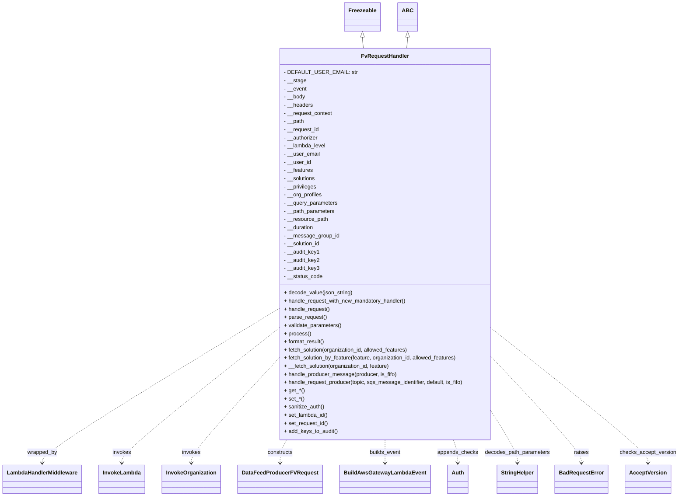
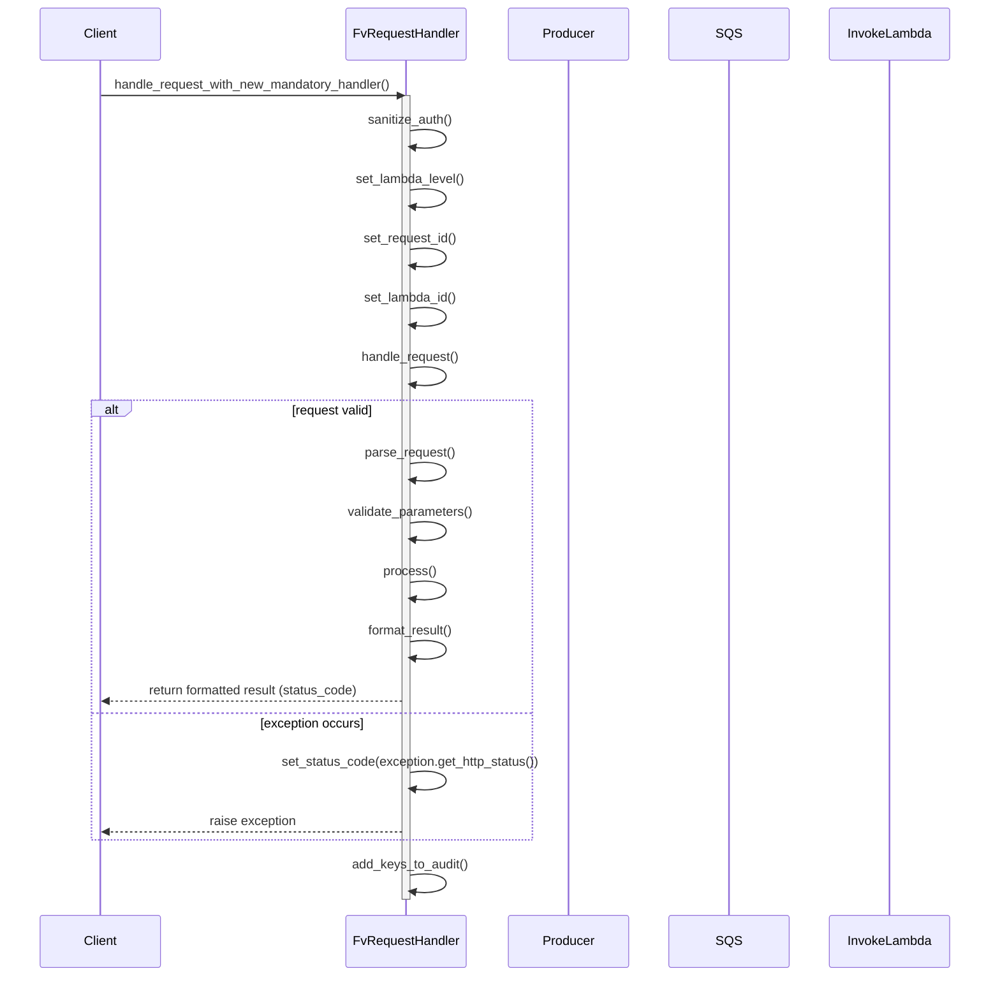
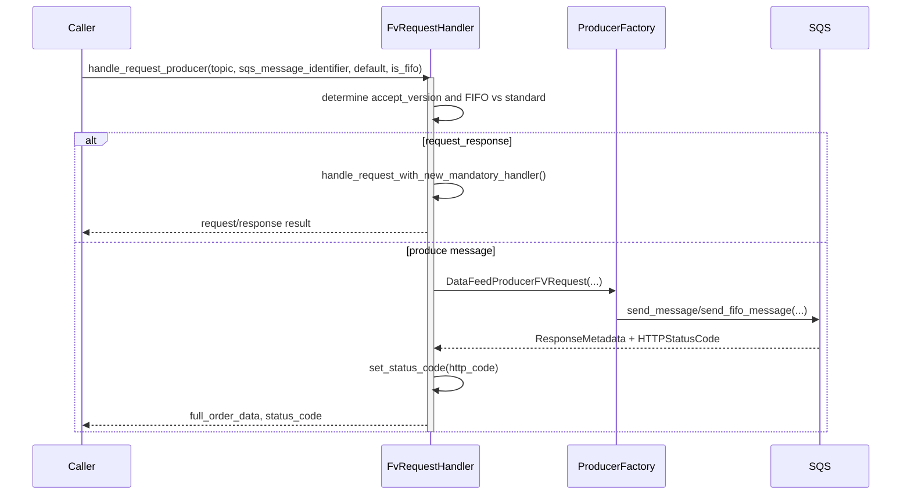

# Diagram: fv_core/fv_framework/python/fv_framework/api/FvRequestHandler.py

> Auto-generated by Obscura crawlers

## Diagram 1

### SVG

<svg id="container" width="1934.1953125" xmlns="http://www.w3.org/2000/svg" class="classDiagram" height="1460" viewBox="0 0 1934.1953125 1460" role="graphics-document document" aria-roledescription="class"><g><defs><marker id="container_class-aggregationStart" class="marker aggregation class" refX="18" refY="7" markerWidth="190" markerHeight="240" orient="auto"><path d="M 18,7 L9,13 L1,7 L9,1 Z"></path></marker></defs><defs><marker id="container_class-aggregationEnd" class="marker aggregation class" refX="1" refY="7" markerWidth="20" markerHeight="28" orient="auto"><path d="M 18,7 L9,13 L1,7 L9,1 Z"></path></marker></defs><defs><marker id="container_class-extensionStart" class="marker extension class" refX="18" refY="7" markerWidth="190" markerHeight="240" orient="auto"><path d="M 1,7 L18,13 V 1 Z"></path></marker></defs><defs><marker id="container_class-extensionEnd" class="marker extension class" refX="1" refY="7" markerWidth="20" markerHeight="28" orient="auto"><path d="M 1,1 V 13 L18,7 Z"></path></marker></defs><defs><marker id="container_class-compositionStart" class="marker composition class" refX="18" refY="7" markerWidth="190" markerHeight="240" orient="auto"><path d="M 18,7 L9,13 L1,7 L9,1 Z"></path></marker></defs><defs><marker id="container_class-compositionEnd" class="marker composition class" refX="1" refY="7" markerWidth="20" markerHeight="28" orient="auto"><path d="M 18,7 L9,13 L1,7 L9,1 Z"></path></marker></defs><defs><marker id="container_class-dependencyStart" class="marker dependency class" refX="6" refY="7" markerWidth="190" markerHeight="240" orient="auto"><path d="M 5,7 L9,13 L1,7 L9,1 Z"></path></marker></defs><defs><marker id="container_class-dependencyEnd" class="marker dependency class" refX="13" refY="7" markerWidth="20" markerHeight="28" orient="auto"><path d="M 18,7 L9,13 L14,7 L9,1 Z"></path></marker></defs><defs><marker id="container_class-lollipopStart" class="marker lollipop class" refX="13" refY="7" markerWidth="190" markerHeight="240" orient="auto"><circle stroke="black" fill="transparent" cx="7" cy="7" r="6"></circle></marker></defs><defs><marker id="container_class-lollipopEnd" class="marker lollipop class" refX="1" refY="7" markerWidth="190" markerHeight="240" orient="auto"><circle stroke="black" fill="transparent" cx="7" cy="7" r="6"></circle></marker></defs><g class="root"><g class="clusters"></g><g class="edgePaths"><path d="M1027.93,109.25L1027.93,110.542C1027.93,111.833,1027.93,114.417,1028.371,119.875C1028.813,125.333,1029.697,133.667,1030.139,137.833L1030.581,142" id="id_Freezeable_FvRequestHandler_1" class="edge-thickness-normal edge-pattern-solid relation" style=";;;" data-edge="true" data-et="edge" data-id="id_Freezeable_FvRequestHandler_1" data-points="W3sieCI6MTAyNy45Mjk2ODc1LCJ5Ijo5Mn0seyJ4IjoxMDI3LjkyOTY4NzUsInkiOjExN30seyJ4IjoxMDMwLjU4MDU0Mjg0NTI1OCwieSI6MTQyfV0=" marker-start="url(#container_class-extensionStart)"></path><path d="M1155.383,109.25L1155.383,110.542C1155.383,111.833,1155.383,114.417,1154.941,119.875C1154.499,125.333,1153.616,133.667,1153.174,137.833L1152.732,142" id="id_ABC_FvRequestHandler_2" class="edge-thickness-normal edge-pattern-solid relation" style=";;;" data-edge="true" data-et="edge" data-id="id_ABC_FvRequestHandler_2" data-points="W3sieCI6MTE1NS4zODI4MTI1LCJ5Ijo5Mn0seyJ4IjoxMTU1LjM4MjgxMjUsInkiOjExN30seyJ4IjoxMTUyLjczMTk1NzE1NDc0MiwieSI6MTQyfV0=" marker-start="url(#container_class-extensionStart)"></path><path d="M778.988,915.412L669.285,984.677C559.581,1053.941,340.173,1192.471,230.469,1266.902C120.766,1341.333,120.766,1351.667,120.766,1356.833L120.766,1362" id="id_FvRequestHandler_LambdaHandlerMiddleware_3" class="edge-thickness-normal edge-pattern-dashed relation" style=";;;" data-edge="true" data-et="edge" data-id="id_FvRequestHandler_LambdaHandlerMiddleware_3" data-points="W3sieCI6Nzc4Ljk4ODI4MTI1LCJ5Ijo5MTUuNDEyMDA0OTI0NjAyMX0seyJ4IjoxMjAuNzY1NjI1LCJ5IjoxMzMxfSx7IngiOjEyMC43NjU2MjUsInkiOjEzNjh9XQ==" marker-end="url(#container_class-dependencyEnd)"></path><path d="M778.988,976.086L707.326,1035.239C635.664,1094.391,492.34,1212.695,420.678,1277.014C349.016,1341.333,349.016,1351.667,349.016,1356.833L349.016,1362" id="id_FvRequestHandler_InvokeLambda_4" class="edge-thickness-normal edge-pattern-dashed relation" style=";;;" data-edge="true" data-et="edge" data-id="id_FvRequestHandler_InvokeLambda_4" data-points="W3sieCI6Nzc4Ljk4ODI4MTI1LCJ5Ijo5NzYuMDg2NDI2MTgxOTA5OX0seyJ4IjozNDkuMDE1NjI1LCJ5IjoxMzMxfSx7IngiOjM0OS4wMTU2MjUsInkiOjEzNjh9XQ==" marker-end="url(#container_class-dependencyEnd)"></path><path d="M778.988,1070.255L740.415,1113.713C701.841,1157.17,624.694,1244.085,586.12,1292.709C547.547,1341.333,547.547,1351.667,547.547,1356.833L547.547,1362" id="id_FvRequestHandler_InvokeOrganization_5" class="edge-thickness-normal edge-pattern-dashed relation" style=";;;" data-edge="true" data-et="edge" data-id="id_FvRequestHandler_InvokeOrganization_5" data-points="W3sieCI6Nzc4Ljk4ODI4MTI1LCJ5IjoxMDcwLjI1NTM5ODczMDcyNH0seyJ4Ijo1NDcuNTQ2ODc1LCJ5IjoxMzMxfSx7IngiOjU0Ny41NDY4NzUsInkiOjEzNjh9XQ==" marker-end="url(#container_class-dependencyEnd)"></path><path d="M815.835,1294L812.882,1300.167C809.929,1306.333,804.023,1318.667,801.07,1330C798.117,1341.333,798.117,1351.667,798.117,1356.833L798.117,1362" id="id_FvRequestHandler_DataFeedProducerFVRequest_6" class="edge-thickness-normal edge-pattern-dashed relation" style=";;;" data-edge="true" data-et="edge" data-id="id_FvRequestHandler_DataFeedProducerFVRequest_6" data-points="W3sieCI6ODE1LjgzNDg3OTY5MDA0ODksInkiOjEyOTR9LHsieCI6Nzk4LjExNzE4NzUsInkiOjEzMzF9LHsieCI6Nzk4LjExNzE4NzUsInkiOjEzNjh9XQ==" marker-end="url(#container_class-dependencyEnd)"></path><path d="M1091.656,1294L1091.656,1300.167C1091.656,1306.333,1091.656,1318.667,1091.656,1330C1091.656,1341.333,1091.656,1351.667,1091.656,1356.833L1091.656,1362" id="id_FvRequestHandler_BuildAwsGatewayLambdaEvent_7" class="edge-thickness-normal edge-pattern-dashed relation" style=";;;" data-edge="true" data-et="edge" data-id="id_FvRequestHandler_BuildAwsGatewayLambdaEvent_7" data-points="W3sieCI6MTA5MS42NTYyNSwieSI6MTI5NH0seyJ4IjoxMDkxLjY1NjI1LCJ5IjoxMzMxfSx7IngiOjEwOTEuNjU2MjUsInkiOjEzNjh9XQ==" marker-end="url(#container_class-dependencyEnd)"></path><path d="M1284.305,1294L1286.367,1300.167C1288.43,1306.333,1292.555,1318.667,1294.617,1330C1296.68,1341.333,1296.68,1351.667,1296.68,1356.833L1296.68,1362" id="id_FvRequestHandler_Auth_8" class="edge-thickness-normal edge-pattern-dashed relation" style=";;;" data-edge="true" data-et="edge" data-id="id_FvRequestHandler_Auth_8" data-points="W3sieCI6MTI4NC4zMDQ3MDAyNDQ2OTgzLCJ5IjoxMjk0fSx7IngiOjEyOTYuNjc5Njg3NSwieSI6MTMzMX0seyJ4IjoxMjk2LjY3OTY4NzUsInkiOjEzNjh9XQ==" marker-end="url(#container_class-dependencyEnd)"></path><path d="M1404.324,1220.873L1415.736,1239.228C1427.148,1257.582,1449.973,1294.291,1461.385,1317.812C1472.797,1341.333,1472.797,1351.667,1472.797,1356.833L1472.797,1362" id="id_FvRequestHandler_StringHelper_9" class="edge-thickness-normal edge-pattern-dashed relation" style=";;;" data-edge="true" data-et="edge" data-id="id_FvRequestHandler_StringHelper_9" data-points="W3sieCI6MTQwNC4zMjQyMTg3NSwieSI6MTIyMC44NzMzNTUwNjA4Nzh9LHsieCI6MTQ3Mi43OTY4NzUsInkiOjEzMzF9LHsieCI6MTQ3Mi43OTY4NzUsInkiOjEzNjh9XQ==" marker-end="url(#container_class-dependencyEnd)"></path><path d="M1404.324,1057.771L1446.23,1103.309C1488.135,1148.847,1571.947,1239.924,1613.852,1290.629C1655.758,1341.333,1655.758,1351.667,1655.758,1356.833L1655.758,1362" id="id_FvRequestHandler_BadRequestError_10" class="edge-thickness-normal edge-pattern-dashed relation" style=";;;" data-edge="true" data-et="edge" data-id="id_FvRequestHandler_BadRequestError_10" data-points="W3sieCI6MTQwNC4zMjQyMTg3NSwieSI6MTA1Ny43NzEyMDAwNTUzOTh9LHsieCI6MTY1NS43NTc4MTI1LCJ5IjoxMzMxfSx7IngiOjE2NTUuNzU3ODEyNSwieSI6MTM2OH1d" marker-end="url(#container_class-dependencyEnd)"></path><path d="M1404.324,972.866L1477.55,1032.555C1550.776,1092.244,1697.228,1211.622,1770.454,1276.478C1843.68,1341.333,1843.68,1351.667,1843.68,1356.833L1843.68,1362" id="id_FvRequestHandler_AcceptVersion_11" class="edge-thickness-normal edge-pattern-dashed relation" style=";;;" data-edge="true" data-et="edge" data-id="id_FvRequestHandler_AcceptVersion_11" data-points="W3sieCI6MTQwNC4zMjQyMTg3NSwieSI6OTcyLjg2NjM0NDk2NTE0NjF9LHsieCI6MTg0My42Nzk2ODc1LCJ5IjoxMzMxfSx7IngiOjE4NDMuNjc5Njg3NSwieSI6MTM2OH1d" marker-end="url(#container_class-dependencyEnd)"></path></g><g class="edgeLabels"><g class="edgeLabel"><g class="label" data-id="id_Freezeable_FvRequestHandler_1" transform="translate(0, 0)"><foreignObject width="0" height="0">

</foreignObject></g></g><g class="edgeLabel"><g class="label" data-id="id_ABC_FvRequestHandler_2" transform="translate(0, 0)"><foreignObject width="0" height="0">

</foreignObject></g></g><g class="edgeLabel" transform="translate(120.765625, 1331)"><g class="label" data-id="id_FvRequestHandler_LambdaHandlerMiddleware_3" transform="translate(-44.3671875, -12)"><foreignObject width="88.734375" height="24">

wrapped_by

</foreignObject></g></g><g class="edgeLabel" transform="translate(349.015625, 1331)"><g class="label" data-id="id_FvRequestHandler_InvokeLambda_4" transform="translate(-27.5859375, -12)"><foreignObject width="55.171875" height="24">

invokes

</foreignObject></g></g><g class="edgeLabel" transform="translate(547.546875, 1331)"><g class="label" data-id="id_FvRequestHandler_InvokeOrganization_5" transform="translate(-27.5859375, -12)"><foreignObject width="55.171875" height="24">

invokes

</foreignObject></g></g><g class="edgeLabel" transform="translate(798.1171875, 1331)"><g class="label" data-id="id_FvRequestHandler_DataFeedProducerFVRequest_6" transform="translate(-37.84375, -12)"><foreignObject width="75.6875" height="24">

constructs

</foreignObject></g></g><g class="edgeLabel" transform="translate(1091.65625, 1331)"><g class="label" data-id="id_FvRequestHandler_BuildAwsGatewayLambdaEvent_7" transform="translate(-46.5, -12)"><foreignObject width="93" height="24">

builds_event

</foreignObject></g></g><g class="edgeLabel" transform="translate(1296.6796875, 1331)"><g class="label" data-id="id_FvRequestHandler_Auth_8" transform="translate(-59.7578125, -12)"><foreignObject width="119.515625" height="24">

appends_checks

</foreignObject></g></g><g class="edgeLabel" transform="translate(1472.796875, 1331)"><g class="label" data-id="id_FvRequestHandler_StringHelper_9" transform="translate(-96.359375, -12)"><foreignObject width="192.71875" height="24">

decodes_path_parameters

</foreignObject></g></g><g class="edgeLabel" transform="translate(1655.7578125, 1331)"><g class="label" data-id="id_FvRequestHandler_BadRequestError_10" transform="translate(-21.25, -12)"><foreignObject width="42.5" height="24">

raises

</foreignObject></g></g><g class="edgeLabel" transform="translate(1843.6796875, 1331)"><g class="label" data-id="id_FvRequestHandler_AcceptVersion_11" transform="translate(-82.515625, -12)"><foreignObject width="165.03125" height="24">

checks_accept_version

</foreignObject></g></g></g><g class="nodes"><g class="node default" id="classId-Freezeable-0" transform="translate(1027.9296875, 50)"><g class="basic label-container"><path d="M-51.1953125 -42 L51.1953125 -42 L51.1953125 42 L-51.1953125 42" stroke="none" stroke-width="0" fill="#ECECFF" style=""></path><path d="M-51.1953125 -42 C-21.18282045505356 -42, 8.829671589892882 -42, 51.1953125 -42 M-51.1953125 -42 C-29.2516881889631 -42, -7.308063877926202 -42, 51.1953125 -42 M51.1953125 -42 C51.1953125 -19.381764308939015, 51.1953125 3.2364713821219695, 51.1953125 42 M51.1953125 -42 C51.1953125 -13.39976206882141, 51.1953125 15.20047586235718, 51.1953125 42 M51.1953125 42 C16.940006443350015 42, -17.31529961329997 42, -51.1953125 42 M51.1953125 42 C25.1817496936837 42, -0.8318131126326023 42, -51.1953125 42 M-51.1953125 42 C-51.1953125 24.6738001383364, -51.1953125 7.3476002766728, -51.1953125 -42 M-51.1953125 42 C-51.1953125 8.983066391828501, -51.1953125 -24.033867216342998, -51.1953125 -42" stroke="#9370DB" stroke-width="1.3" fill="none" stroke-dasharray="0 0" style=""></path></g><g class="annotation-group text" transform="translate(0, -18)"></g><g class="label-group text" transform="translate(-39.1953125, -18)"><g class="label" style="font-weight: bolder" transform="translate(0,-12)"><foreignObject width="78.390625" height="24">

Freezeable

</foreignObject></g></g><g class="members-group text" transform="translate(-39.1953125, 30)"></g><g class="methods-group text" transform="translate(-39.1953125, 60)"></g><g class="divider" style=""><path d="M-51.1953125 6 C-13.71526273182453 6, 23.76478703635094 6, 51.1953125 6 M-51.1953125 6 C-24.557026390888932 6, 2.0812597182221353 6, 51.1953125 6" stroke="#9370DB" stroke-width="1.3" fill="none" stroke-dasharray="0 0" style=""></path></g><g class="divider" style=""><path d="M-51.1953125 24 C-23.225313674126944 24, 4.744685151746111 24, 51.1953125 24 M-51.1953125 24 C-22.281396796993615 24, 6.63251890601277 24, 51.1953125 24" stroke="#9370DB" stroke-width="1.3" fill="none" stroke-dasharray="0 0" style=""></path></g></g><g class="node default" id="classId-ABC-1" transform="translate(1155.3828125, 50)"><g class="basic label-container"><path d="M-26.2578125 -42 L26.2578125 -42 L26.2578125 42 L-26.2578125 42" stroke="none" stroke-width="0" fill="#ECECFF" style=""></path><path d="M-26.2578125 -42 C-8.431591018271845 -42, 9.39463046345631 -42, 26.2578125 -42 M-26.2578125 -42 C-9.933928196455497 -42, 6.389956107089006 -42, 26.2578125 -42 M26.2578125 -42 C26.2578125 -10.090314225721237, 26.2578125 21.819371548557527, 26.2578125 42 M26.2578125 -42 C26.2578125 -17.624474449359138, 26.2578125 6.751051101281725, 26.2578125 42 M26.2578125 42 C13.337693095278517 42, 0.41757369055703464 42, -26.2578125 42 M26.2578125 42 C9.329835312311182 42, -7.598141875377635 42, -26.2578125 42 M-26.2578125 42 C-26.2578125 12.809330068210777, -26.2578125 -16.381339863578447, -26.2578125 -42 M-26.2578125 42 C-26.2578125 22.579868777266043, -26.2578125 3.159737554532086, -26.2578125 -42" stroke="#9370DB" stroke-width="1.3" fill="none" stroke-dasharray="0 0" style=""></path></g><g class="annotation-group text" transform="translate(0, -18)"></g><g class="label-group text" transform="translate(-14.2578125, -18)"><g class="label" style="font-weight: bolder" transform="translate(0,-12)"><foreignObject width="28.515625" height="24">

ABC

</foreignObject></g></g><g class="members-group text" transform="translate(-14.2578125, 30)"></g><g class="methods-group text" transform="translate(-14.2578125, 60)"></g><g class="divider" style=""><path d="M-26.2578125 6 C-7.134171575471026 6, 11.989469349057948 6, 26.2578125 6 M-26.2578125 6 C-11.074326304596248 6, 4.109159890807504 6, 26.2578125 6" stroke="#9370DB" stroke-width="1.3" fill="none" stroke-dasharray="0 0" style=""></path></g><g class="divider" style=""><path d="M-26.2578125 24 C-13.979779260871577 24, -1.7017460217431548 24, 26.2578125 24 M-26.2578125 24 C-9.086604641353954 24, 8.084603217292091 24, 26.2578125 24" stroke="#9370DB" stroke-width="1.3" fill="none" stroke-dasharray="0 0" style=""></path></g></g><g class="node default" id="classId-FvRequestHandler-2" transform="translate(1091.65625, 718)"><g class="basic label-container"><path d="M-312.66796875 -576 L312.66796875 -576 L312.66796875 576 L-312.66796875 576" stroke="none" stroke-width="0" fill="#ECECFF" style=""></path><path d="M-312.66796875 -576 C-107.68897067584362 -576, 97.29002739831276 -576, 312.66796875 -576 M-312.66796875 -576 C-146.35459115046615 -576, 19.958786449067702 -576, 312.66796875 -576 M312.66796875 -576 C312.66796875 -338.67645752265844, 312.66796875 -101.35291504531693, 312.66796875 576 M312.66796875 -576 C312.66796875 -286.76781420176525, 312.66796875 2.4643715964695048, 312.66796875 576 M312.66796875 576 C87.5387631009479 576, -137.5904425481042 576, -312.66796875 576 M312.66796875 576 C79.67654731745188 576, -153.31487411509625 576, -312.66796875 576 M-312.66796875 576 C-312.66796875 259.8210781168033, -312.66796875 -56.357843766393444, -312.66796875 -576 M-312.66796875 576 C-312.66796875 188.2647619420477, -312.66796875 -199.4704761159046, -312.66796875 -576" stroke="#9370DB" stroke-width="1.3" fill="none" stroke-dasharray="0 0" style=""></path></g><g class="annotation-group text" transform="translate(0, -552)"></g><g class="label-group text" transform="translate(-66.7890625, -552)"><g class="label" style="font-weight: bolder" transform="translate(0,-12)"><foreignObject width="133.578125" height="24">

FvRequestHandler

</foreignObject></g></g><g class="members-group text" transform="translate(-300.66796875, -504)"><g class="label" style="" transform="translate(0,-12)"><foreignObject width="194.296875" height="24">

- DEFAULT_USER_EMAIL: str

</foreignObject></g><g class="label" style="" transform="translate(0,12)"><foreignObject width="65.640625" height="24">

- __stage

</foreignObject></g><g class="label" style="" transform="translate(0,36)"><foreignObject width="67.1875" height="24">

- __event

</foreignObject></g><g class="label" style="" transform="translate(0,60)"><foreignObject width="63.46875" height="24">

- __body

</foreignObject></g><g class="label" style="" transform="translate(0,84)"><foreignObject width="85.515625" height="24">

- __headers

</foreignObject></g><g class="label" style="" transform="translate(0,108)"><foreignObject width="144.140625" height="24">

- __request_context

</foreignObject></g><g class="label" style="" transform="translate(0,132)"><foreignObject width="60.375" height="24">

- __path

</foreignObject></g><g class="label" style="" transform="translate(0,156)"><foreignObject width="104.84375" height="24">

- __request_id

</foreignObject></g><g class="label" style="" transform="translate(0,180)"><foreignObject width="101.828125" height="24">

- __authorizer

</foreignObject></g><g class="label" style="" transform="translate(0,204)"><foreignObject width="124.453125" height="24">

- __lambda_level

</foreignObject></g><g class="label" style="" transform="translate(0,228)"><foreignObject width="105.59375" height="24">

- __user_email

</foreignObject></g><g class="label" style="" transform="translate(0,252)"><foreignObject width="79.65625" height="24">

- __user_id

</foreignObject></g><g class="label" style="" transform="translate(0,276)"><foreignObject width="86.296875" height="24">

- __features

</foreignObject></g><g class="label" style="" transform="translate(0,300)"><foreignObject width="94.46875" height="24">

- __solutions

</foreignObject></g><g class="label" style="" transform="translate(0,324)"><foreignObject width="97.34375" height="24">

- __privileges

</foreignObject></g><g class="label" style="" transform="translate(0,348)"><foreignObject width="113.390625" height="24">

- __org_profiles

</foreignObject></g><g class="label" style="" transform="translate(0,372)"><foreignObject width="158.8125" height="24">

- __query_parameters

</foreignObject></g><g class="label" style="" transform="translate(0,396)"><foreignObject width="151.15625" height="24">

- __path_parameters

</foreignObject></g><g class="label" style="" transform="translate(0,420)"><foreignObject width="130.671875" height="24">

- __resource_path

</foreignObject></g><g class="label" style="" transform="translate(0,444)"><foreignObject width="89.0625" height="24">

- __duration

</foreignObject></g><g class="label" style="" transform="translate(0,468)"><foreignObject width="161.953125" height="24">

- __message_group_id

</foreignObject></g><g class="label" style="" transform="translate(0,492)"><foreignObject width="109.40625" height="24">

- __solution_id

</foreignObject></g><g class="label" style="" transform="translate(0,516)"><foreignObject width="104.546875" height="24">

- __audit_key1

</foreignObject></g><g class="label" style="" transform="translate(0,540)"><foreignObject width="105.390625" height="24">

- __audit_key2

</foreignObject></g><g class="label" style="" transform="translate(0,564)"><foreignObject width="105.390625" height="24">

- __audit_key3

</foreignObject></g><g class="label" style="" transform="translate(0,588)"><foreignObject width="114.21875" height="24">

- __status_code

</foreignObject></g></g><g class="methods-group text" transform="translate(-300.66796875, 144)"><g class="label" style="" transform="translate(0,-12)"><foreignObject width="203.453125" height="24">

+ decode_value(json_string)

</foreignObject></g><g class="label" style="" transform="translate(0,12)"><foreignObject width="364.59375" height="24">

+ handle_request_with_new_mandatory_handler()

</foreignObject></g><g class="label" style="" transform="translate(0,36)"><foreignObject width="136.21875" height="24">

+ handle_request()

</foreignObject></g><g class="label" style="" transform="translate(0,60)"><foreignObject width="126.046875" height="24">

+ parse_request()

</foreignObject></g><g class="label" style="" transform="translate(0,84)"><foreignObject width="170.953125" height="24">

+ validate_parameters()

</foreignObject></g><g class="label" style="" transform="translate(0,108)"><foreignObject width="77.96875" height="24">

+ process()

</foreignObject></g><g class="label" style="" transform="translate(0,132)"><foreignObject width="121.5" height="24">

+ format_result()

</foreignObject></g><g class="label" style="" transform="translate(0,156)"><foreignObject width="372.4375" height="24">

+ fetch_solution(organization_id, allowed_features)

</foreignObject></g><g class="label" style="" transform="translate(0,180)"><foreignObject width="517.453125" height="24">

+ fetch_solution_by_feature(feature, organization_id, allowed_features)

</foreignObject></g><g class="label" style="" transform="translate(0,204)"><foreignObject width="316.1875" height="24">

+ __fetch_solution(organization_id, feature)

</foreignObject></g><g class="label" style="" transform="translate(0,228)"><foreignObject width="331.875" height="24">

+ handle_producer_message(producer, is_fifo)

</foreignObject></g><g class="label" style="" transform="translate(0,252)"><foreignObject width="534.546875" height="24">

+ handle_request_producer(topic, sqs_message_identifier, default, is_fifo)

</foreignObject></g><g class="label" style="" transform="translate(0,276)"><foreignObject width="58.90625" height="24">

+ get_*()

</foreignObject></g><g class="label" style="" transform="translate(0,300)"><foreignObject width="58.3125" height="24">

+ set_*()

</foreignObject></g><g class="label" style="" transform="translate(0,324)"><foreignObject width="119.234375" height="24">

+ sanitize_auth()

</foreignObject></g><g class="label" style="" transform="translate(0,348)"><foreignObject width="129.921875" height="24">

+ set_lambda_id()

</foreignObject></g><g class="label" style="" transform="translate(0,372)"><foreignObject width="130.546875" height="24">

+ set_request_id()

</foreignObject></g><g class="label" style="" transform="translate(0,396)"><foreignObject width="158.8125" height="24">

+ add_keys_to_audit()

</foreignObject></g></g><g class="divider" style=""><path d="M-312.66796875 -528 C-151.42971733061563 -528, 9.808534088768738 -528, 312.66796875 -528 M-312.66796875 -528 C-158.08460946567155 -528, -3.501250181343096 -528, 312.66796875 -528" stroke="#9370DB" stroke-width="1.3" fill="none" stroke-dasharray="0 0" style=""></path></g><g class="divider" style=""><path d="M-312.66796875 120 C-171.86567609066392 120, -31.06338343132785 120, 312.66796875 120 M-312.66796875 120 C-172.53313927305848 120, -32.39830979611696 120, 312.66796875 120" stroke="#9370DB" stroke-width="1.3" fill="none" stroke-dasharray="0 0" style=""></path></g></g><g class="node default" id="classId-LambdaHandlerMiddleware-3" transform="translate(120.765625, 1410)"><g class="basic label-container"><path d="M-112.765625 -42 L112.765625 -42 L112.765625 42 L-112.765625 42" stroke="none" stroke-width="0" fill="#ECECFF" style=""></path><path d="M-112.765625 -42 C-36.87852105283949 -42, 39.00858289432102 -42, 112.765625 -42 M-112.765625 -42 C-41.18408378282835 -42, 30.397457434343295 -42, 112.765625 -42 M112.765625 -42 C112.765625 -15.069623140166229, 112.765625 11.860753719667542, 112.765625 42 M112.765625 -42 C112.765625 -24.915157660913195, 112.765625 -7.83031532182639, 112.765625 42 M112.765625 42 C52.98149590805157 42, -6.802633183896859 42, -112.765625 42 M112.765625 42 C47.40063452511738 42, -17.964355949765235 42, -112.765625 42 M-112.765625 42 C-112.765625 22.839809557198524, -112.765625 3.679619114397049, -112.765625 -42 M-112.765625 42 C-112.765625 8.585642988042117, -112.765625 -24.828714023915765, -112.765625 -42" stroke="#9370DB" stroke-width="1.3" fill="none" stroke-dasharray="0 0" style=""></path></g><g class="annotation-group text" transform="translate(0, -18)"></g><g class="label-group text" transform="translate(-100.765625, -18)"><g class="label" style="font-weight: bolder" transform="translate(0,-12)"><foreignObject width="201.53125" height="24">

LambdaHandlerMiddleware

</foreignObject></g></g><g class="members-group text" transform="translate(-100.765625, 30)"></g><g class="methods-group text" transform="translate(-100.765625, 60)"></g><g class="divider" style=""><path d="M-112.765625 6 C-51.32084313810367 6, 10.123938723792662 6, 112.765625 6 M-112.765625 6 C-33.05529895298419 6, 46.655027094031624 6, 112.765625 6" stroke="#9370DB" stroke-width="1.3" fill="none" stroke-dasharray="0 0" style=""></path></g><g class="divider" style=""><path d="M-112.765625 24 C-23.239447043276613 24, 66.28673091344677 24, 112.765625 24 M-112.765625 24 C-27.07139651242821 24, 58.62283197514358 24, 112.765625 24" stroke="#9370DB" stroke-width="1.3" fill="none" stroke-dasharray="0 0" style=""></path></g></g><g class="node default" id="classId-InvokeLambda-4" transform="translate(349.015625, 1410)"><g class="basic label-container"><path d="M-65.484375 -42 L65.484375 -42 L65.484375 42 L-65.484375 42" stroke="none" stroke-width="0" fill="#ECECFF" style=""></path><path d="M-65.484375 -42 C-23.3173801343373 -42, 18.849614731325403 -42, 65.484375 -42 M-65.484375 -42 C-23.945298065883946 -42, 17.593778868232107 -42, 65.484375 -42 M65.484375 -42 C65.484375 -20.015913924434088, 65.484375 1.9681721511318244, 65.484375 42 M65.484375 -42 C65.484375 -12.986778117990262, 65.484375 16.026443764019476, 65.484375 42 M65.484375 42 C15.211663881936552 42, -35.061047236126896 42, -65.484375 42 M65.484375 42 C20.466284594613448 42, -24.551805810773104 42, -65.484375 42 M-65.484375 42 C-65.484375 12.64720914210351, -65.484375 -16.70558171579298, -65.484375 -42 M-65.484375 42 C-65.484375 12.67108057611085, -65.484375 -16.6578388477783, -65.484375 -42" stroke="#9370DB" stroke-width="1.3" fill="none" stroke-dasharray="0 0" style=""></path></g><g class="annotation-group text" transform="translate(0, -18)"></g><g class="label-group text" transform="translate(-53.484375, -18)"><g class="label" style="font-weight: bolder" transform="translate(0,-12)"><foreignObject width="106.96875" height="24">

InvokeLambda

</foreignObject></g></g><g class="members-group text" transform="translate(-53.484375, 30)"></g><g class="methods-group text" transform="translate(-53.484375, 60)"></g><g class="divider" style=""><path d="M-65.484375 6 C-25.418029377080693 6, 14.648316245838615 6, 65.484375 6 M-65.484375 6 C-35.865936129223314 6, -6.247497258446636 6, 65.484375 6" stroke="#9370DB" stroke-width="1.3" fill="none" stroke-dasharray="0 0" style=""></path></g><g class="divider" style=""><path d="M-65.484375 24 C-25.166457208901193 24, 15.151460582197615 24, 65.484375 24 M-65.484375 24 C-32.79943713407593 24, -0.11449926815186018 24, 65.484375 24" stroke="#9370DB" stroke-width="1.3" fill="none" stroke-dasharray="0 0" style=""></path></g></g><g class="node default" id="classId-InvokeOrganization-5" transform="translate(547.546875, 1410)"><g class="basic label-container"><path d="M-83.046875 -42 L83.046875 -42 L83.046875 42 L-83.046875 42" stroke="none" stroke-width="0" fill="#ECECFF" style=""></path><path d="M-83.046875 -42 C-38.849282817966284 -42, 5.348309364067433 -42, 83.046875 -42 M-83.046875 -42 C-49.513651598937294 -42, -15.980428197874588 -42, 83.046875 -42 M83.046875 -42 C83.046875 -24.715313184303213, 83.046875 -7.430626368606426, 83.046875 42 M83.046875 -42 C83.046875 -12.679174506835878, 83.046875 16.641650986328244, 83.046875 42 M83.046875 42 C45.27927732657381 42, 7.511679653147624 42, -83.046875 42 M83.046875 42 C45.0256538238624 42, 7.004432647724798 42, -83.046875 42 M-83.046875 42 C-83.046875 10.91229433290918, -83.046875 -20.17541133418164, -83.046875 -42 M-83.046875 42 C-83.046875 21.163565247119, -83.046875 0.32713049423799845, -83.046875 -42" stroke="#9370DB" stroke-width="1.3" fill="none" stroke-dasharray="0 0" style=""></path></g><g class="annotation-group text" transform="translate(0, -18)"></g><g class="label-group text" transform="translate(-71.046875, -18)"><g class="label" style="font-weight: bolder" transform="translate(0,-12)"><foreignObject width="142.09375" height="24">

InvokeOrganization

</foreignObject></g></g><g class="members-group text" transform="translate(-71.046875, 30)"></g><g class="methods-group text" transform="translate(-71.046875, 60)"></g><g class="divider" style=""><path d="M-83.046875 6 C-48.68059577955143 6, -14.314316559102863 6, 83.046875 6 M-83.046875 6 C-43.90198129420765 6, -4.7570875884153025 6, 83.046875 6" stroke="#9370DB" stroke-width="1.3" fill="none" stroke-dasharray="0 0" style=""></path></g><g class="divider" style=""><path d="M-83.046875 24 C-39.659215064255854 24, 3.7284448714882927 24, 83.046875 24 M-83.046875 24 C-35.289702538644484 24, 12.467469922711032 24, 83.046875 24" stroke="#9370DB" stroke-width="1.3" fill="none" stroke-dasharray="0 0" style=""></path></g></g><g class="node default" id="classId-DataFeedProducerFVRequest-6" transform="translate(798.1171875, 1410)"><g class="basic label-container"><path d="M-117.5234375 -42 L117.5234375 -42 L117.5234375 42 L-117.5234375 42" stroke="none" stroke-width="0" fill="#ECECFF" style=""></path><path d="M-117.5234375 -42 C-58.04621529688829 -42, 1.4310069062234163 -42, 117.5234375 -42 M-117.5234375 -42 C-28.932739670651145 -42, 59.65795815869771 -42, 117.5234375 -42 M117.5234375 -42 C117.5234375 -10.50220366882833, 117.5234375 20.99559266234334, 117.5234375 42 M117.5234375 -42 C117.5234375 -15.458530880719078, 117.5234375 11.082938238561844, 117.5234375 42 M117.5234375 42 C65.8630403771478 42, 14.202643254295609 42, -117.5234375 42 M117.5234375 42 C35.19054216084599 42, -47.142353178308014 42, -117.5234375 42 M-117.5234375 42 C-117.5234375 8.829944506320338, -117.5234375 -24.340110987359324, -117.5234375 -42 M-117.5234375 42 C-117.5234375 21.98405684687201, -117.5234375 1.968113693744023, -117.5234375 -42" stroke="#9370DB" stroke-width="1.3" fill="none" stroke-dasharray="0 0" style=""></path></g><g class="annotation-group text" transform="translate(0, -18)"></g><g class="label-group text" transform="translate(-105.5234375, -18)"><g class="label" style="font-weight: bolder" transform="translate(0,-12)"><foreignObject width="211.046875" height="24">

DataFeedProducerFVRequest

</foreignObject></g></g><g class="members-group text" transform="translate(-105.5234375, 30)"></g><g class="methods-group text" transform="translate(-105.5234375, 60)"></g><g class="divider" style=""><path d="M-117.5234375 6 C-32.79452340465532 6, 51.934390690689355 6, 117.5234375 6 M-117.5234375 6 C-43.35296954670605 6, 30.8174984065879 6, 117.5234375 6" stroke="#9370DB" stroke-width="1.3" fill="none" stroke-dasharray="0 0" style=""></path></g><g class="divider" style=""><path d="M-117.5234375 24 C-32.994369727232026 24, 51.53469804553595 24, 117.5234375 24 M-117.5234375 24 C-35.80954092236871 24, 45.90435565526258 24, 117.5234375 24" stroke="#9370DB" stroke-width="1.3" fill="none" stroke-dasharray="0 0" style=""></path></g></g><g class="node default" id="classId-BuildAwsGatewayLambdaEvent-7" transform="translate(1091.65625, 1410)"><g class="basic label-container"><path d="M-126.015625 -42 L126.015625 -42 L126.015625 42 L-126.015625 42" stroke="none" stroke-width="0" fill="#ECECFF" style=""></path><path d="M-126.015625 -42 C-48.65275047199415 -42, 28.710124056011693 -42, 126.015625 -42 M-126.015625 -42 C-64.71821606354317 -42, -3.4208071270863343 -42, 126.015625 -42 M126.015625 -42 C126.015625 -15.418868909809497, 126.015625 11.162262180381006, 126.015625 42 M126.015625 -42 C126.015625 -23.329125730543858, 126.015625 -4.6582514610877155, 126.015625 42 M126.015625 42 C70.54838267090523 42, 15.081140341810453 42, -126.015625 42 M126.015625 42 C58.092974715814506 42, -9.829675568370988 42, -126.015625 42 M-126.015625 42 C-126.015625 9.535972782077323, -126.015625 -22.928054435845354, -126.015625 -42 M-126.015625 42 C-126.015625 13.524947179696536, -126.015625 -14.950105640606928, -126.015625 -42" stroke="#9370DB" stroke-width="1.3" fill="none" stroke-dasharray="0 0" style=""></path></g><g class="annotation-group text" transform="translate(0, -18)"></g><g class="label-group text" transform="translate(-114.015625, -18)"><g class="label" style="font-weight: bolder" transform="translate(0,-12)"><foreignObject width="228.03125" height="24">

BuildAwsGatewayLambdaEvent

</foreignObject></g></g><g class="members-group text" transform="translate(-114.015625, 30)"></g><g class="methods-group text" transform="translate(-114.015625, 60)"></g><g class="divider" style=""><path d="M-126.015625 6 C-38.99476657888782 6, 48.02609184222436 6, 126.015625 6 M-126.015625 6 C-40.116784115095996 6, 45.78205676980801 6, 126.015625 6" stroke="#9370DB" stroke-width="1.3" fill="none" stroke-dasharray="0 0" style=""></path></g><g class="divider" style=""><path d="M-126.015625 24 C-35.318926196962664 24, 55.37777260607467 24, 126.015625 24 M-126.015625 24 C-30.22142843319537 24, 65.57276813360926 24, 126.015625 24" stroke="#9370DB" stroke-width="1.3" fill="none" stroke-dasharray="0 0" style=""></path></g></g><g class="node default" id="classId-Auth-8" transform="translate(1296.6796875, 1410)"><g class="basic label-container"><path d="M-29.0078125 -42 L29.0078125 -42 L29.0078125 42 L-29.0078125 42" stroke="none" stroke-width="0" fill="#ECECFF" style=""></path><path d="M-29.0078125 -42 C-9.607254878976544 -42, 9.793302742046912 -42, 29.0078125 -42 M-29.0078125 -42 C-15.675482022119287 -42, -2.343151544238573 -42, 29.0078125 -42 M29.0078125 -42 C29.0078125 -8.962267324861699, 29.0078125 24.075465350276602, 29.0078125 42 M29.0078125 -42 C29.0078125 -21.563858015044374, 29.0078125 -1.1277160300887488, 29.0078125 42 M29.0078125 42 C16.403829152778112 42, 3.799845805556224 42, -29.0078125 42 M29.0078125 42 C10.779433819942184 42, -7.448944860115631 42, -29.0078125 42 M-29.0078125 42 C-29.0078125 22.166746993538474, -29.0078125 2.333493987076949, -29.0078125 -42 M-29.0078125 42 C-29.0078125 20.982970071504866, -29.0078125 -0.034059856990268145, -29.0078125 -42" stroke="#9370DB" stroke-width="1.3" fill="none" stroke-dasharray="0 0" style=""></path></g><g class="annotation-group text" transform="translate(0, -18)"></g><g class="label-group text" transform="translate(-17.0078125, -18)"><g class="label" style="font-weight: bolder" transform="translate(0,-12)"><foreignObject width="34.015625" height="24">

Auth

</foreignObject></g></g><g class="members-group text" transform="translate(-17.0078125, 30)"></g><g class="methods-group text" transform="translate(-17.0078125, 60)"></g><g class="divider" style=""><path d="M-29.0078125 6 C-12.030428309384789 6, 4.946955881230423 6, 29.0078125 6 M-29.0078125 6 C-6.305957107219886 6, 16.39589828556023 6, 29.0078125 6" stroke="#9370DB" stroke-width="1.3" fill="none" stroke-dasharray="0 0" style=""></path></g><g class="divider" style=""><path d="M-29.0078125 24 C-13.832746992452485 24, 1.3423185150950303 24, 29.0078125 24 M-29.0078125 24 C-16.57088438247405 24, -4.1339562649481 24, 29.0078125 24" stroke="#9370DB" stroke-width="1.3" fill="none" stroke-dasharray="0 0" style=""></path></g></g><g class="node default" id="classId-StringHelper-9" transform="translate(1472.796875, 1410)"><g class="basic label-container"><path d="M-58.6796875 -42 L58.6796875 -42 L58.6796875 42 L-58.6796875 42" stroke="none" stroke-width="0" fill="#ECECFF" style=""></path><path d="M-58.6796875 -42 C-15.34702566392447 -42, 27.98563617215106 -42, 58.6796875 -42 M-58.6796875 -42 C-30.666896497500026 -42, -2.654105495000053 -42, 58.6796875 -42 M58.6796875 -42 C58.6796875 -15.306745097643994, 58.6796875 11.386509804712013, 58.6796875 42 M58.6796875 -42 C58.6796875 -18.580309657164403, 58.6796875 4.839380685671195, 58.6796875 42 M58.6796875 42 C34.28364235815894 42, 9.887597216317879 42, -58.6796875 42 M58.6796875 42 C29.375609802038763 42, 0.07153210407752653 42, -58.6796875 42 M-58.6796875 42 C-58.6796875 22.003940965616263, -58.6796875 2.007881931232525, -58.6796875 -42 M-58.6796875 42 C-58.6796875 24.215086462332874, -58.6796875 6.430172924665747, -58.6796875 -42" stroke="#9370DB" stroke-width="1.3" fill="none" stroke-dasharray="0 0" style=""></path></g><g class="annotation-group text" transform="translate(0, -18)"></g><g class="label-group text" transform="translate(-46.6796875, -18)"><g class="label" style="font-weight: bolder" transform="translate(0,-12)"><foreignObject width="93.359375" height="24">

StringHelper

</foreignObject></g></g><g class="members-group text" transform="translate(-46.6796875, 30)"></g><g class="methods-group text" transform="translate(-46.6796875, 60)"></g><g class="divider" style=""><path d="M-58.6796875 6 C-14.992337253678706 6, 28.69501299264259 6, 58.6796875 6 M-58.6796875 6 C-20.57074037312416 6, 17.53820675375168 6, 58.6796875 6" stroke="#9370DB" stroke-width="1.3" fill="none" stroke-dasharray="0 0" style=""></path></g><g class="divider" style=""><path d="M-58.6796875 24 C-15.807959572175456 24, 27.06376835564909 24, 58.6796875 24 M-58.6796875 24 C-28.180387141673442 24, 2.3189132166531152 24, 58.6796875 24" stroke="#9370DB" stroke-width="1.3" fill="none" stroke-dasharray="0 0" style=""></path></g></g><g class="node default" id="classId-BadRequestError-10" transform="translate(1655.7578125, 1410)"><g class="basic label-container"><path d="M-74.28125 -42 L74.28125 -42 L74.28125 42 L-74.28125 42" stroke="none" stroke-width="0" fill="#ECECFF" style=""></path><path d="M-74.28125 -42 C-20.886946620172594 -42, 32.50735675965481 -42, 74.28125 -42 M-74.28125 -42 C-23.38704737840432 -42, 27.507155243191363 -42, 74.28125 -42 M74.28125 -42 C74.28125 -21.93789175187724, 74.28125 -1.8757835037544766, 74.28125 42 M74.28125 -42 C74.28125 -21.278985529138975, 74.28125 -0.5579710582779498, 74.28125 42 M74.28125 42 C40.48219243508478 42, 6.683134870169553 42, -74.28125 42 M74.28125 42 C40.53904282256348 42, 6.796835645126961 42, -74.28125 42 M-74.28125 42 C-74.28125 18.779793960117225, -74.28125 -4.440412079765551, -74.28125 -42 M-74.28125 42 C-74.28125 12.596397409796449, -74.28125 -16.807205180407102, -74.28125 -42" stroke="#9370DB" stroke-width="1.3" fill="none" stroke-dasharray="0 0" style=""></path></g><g class="annotation-group text" transform="translate(0, -18)"></g><g class="label-group text" transform="translate(-62.28125, -18)"><g class="label" style="font-weight: bolder" transform="translate(0,-12)"><foreignObject width="124.5625" height="24">

BadRequestError

</foreignObject></g></g><g class="members-group text" transform="translate(-62.28125, 30)"></g><g class="methods-group text" transform="translate(-62.28125, 60)"></g><g class="divider" style=""><path d="M-74.28125 6 C-31.680315340526143 6, 10.920619318947715 6, 74.28125 6 M-74.28125 6 C-28.111422586341327 6, 18.058404827317347 6, 74.28125 6" stroke="#9370DB" stroke-width="1.3" fill="none" stroke-dasharray="0 0" style=""></path></g><g class="divider" style=""><path d="M-74.28125 24 C-22.071544180560984 24, 30.13816163887803 24, 74.28125 24 M-74.28125 24 C-20.953587456704646 24, 32.37407508659071 24, 74.28125 24" stroke="#9370DB" stroke-width="1.3" fill="none" stroke-dasharray="0 0" style=""></path></g></g><g class="node default" id="classId-AcceptVersion-11" transform="translate(1843.6796875, 1410)"><g class="basic label-container"><path d="M-63.640625 -42 L63.640625 -42 L63.640625 42 L-63.640625 42" stroke="none" stroke-width="0" fill="#ECECFF" style=""></path><path d="M-63.640625 -42 C-15.29148546954898 -42, 33.05765406090204 -42, 63.640625 -42 M-63.640625 -42 C-24.486692128292567 -42, 14.667240743414865 -42, 63.640625 -42 M63.640625 -42 C63.640625 -11.804810958533231, 63.640625 18.390378082933537, 63.640625 42 M63.640625 -42 C63.640625 -23.415428045499063, 63.640625 -4.830856090998125, 63.640625 42 M63.640625 42 C35.60300941818629 42, 7.565393836372586 42, -63.640625 42 M63.640625 42 C26.893160918371997 42, -9.854303163256006 42, -63.640625 42 M-63.640625 42 C-63.640625 17.306022757425275, -63.640625 -7.38795448514945, -63.640625 -42 M-63.640625 42 C-63.640625 8.44853901185813, -63.640625 -25.10292197628374, -63.640625 -42" stroke="#9370DB" stroke-width="1.3" fill="none" stroke-dasharray="0 0" style=""></path></g><g class="annotation-group text" transform="translate(0, -18)"></g><g class="label-group text" transform="translate(-51.640625, -18)"><g class="label" style="font-weight: bolder" transform="translate(0,-12)"><foreignObject width="103.28125" height="24">

AcceptVersion

</foreignObject></g></g><g class="members-group text" transform="translate(-51.640625, 30)"></g><g class="methods-group text" transform="translate(-51.640625, 60)"></g><g class="divider" style=""><path d="M-63.640625 6 C-29.580905599270814 6, 4.478813801458372 6, 63.640625 6 M-63.640625 6 C-27.491311300227977 6, 8.658002399544046 6, 63.640625 6" stroke="#9370DB" stroke-width="1.3" fill="none" stroke-dasharray="0 0" style=""></path></g><g class="divider" style=""><path d="M-63.640625 24 C-37.09013347799041 24, -10.539641955980827 24, 63.640625 24 M-63.640625 24 C-15.561816368554432 24, 32.51699226289114 24, 63.640625 24" stroke="#9370DB" stroke-width="1.3" fill="none" stroke-dasharray="0 0" style=""></path></g></g></g></g></g></svg>

## Diagram 2

> SVG rendering failed for this diagram.

## Diagram 3

### SVG

<svg id="container" width="1485" xmlns="http://www.w3.org/2000/svg" height="793" viewBox="-50 -10 1485 793" role="graphics-document document" aria-roledescription="sequence"><g><rect x="1235" y="707" fill="#eaeaea" stroke="#666" width="150" height="65" name="SQS" rx="3" ry="3" class="actor actor-bottom"></rect><text x="1310" y="739.5" dominant-baseline="central" alignment-baseline="central" class="actor actor-box" style="text-anchor: middle; font-size: 16px; font-weight: 400;"><tspan x="1310" dy="0">SQS</tspan></text></g><g><rect x="892" y="707" fill="#eaeaea" stroke="#666" width="150" height="65" name="ProducerFactory" rx="3" ry="3" class="actor actor-bottom"></rect><text x="967" y="739.5" dominant-baseline="central" alignment-baseline="central" class="actor actor-box" style="text-anchor: middle; font-size: 16px; font-weight: 400;"><tspan x="967" dy="0">ProducerFactory</tspan></text></g><g><rect x="590.5" y="707" fill="#eaeaea" stroke="#666" width="153" height="65" name="Handler" rx="3" ry="3" class="actor actor-bottom"></rect><text x="667" y="739.5" dominant-baseline="central" alignment-baseline="central" class="actor actor-box" style="text-anchor: middle; font-size: 16px; font-weight: 400;"><tspan x="667" dy="0">FvRequestHandler</tspan></text></g><g><rect x="0" y="707" fill="#eaeaea" stroke="#666" width="150" height="65" name="Caller" rx="3" ry="3" class="actor actor-bottom"></rect><text x="75" y="739.5" dominant-baseline="central" alignment-baseline="central" class="actor actor-box" style="text-anchor: middle; font-size: 16px; font-weight: 400;"><tspan x="75" dy="0">Caller</tspan></text></g><g><line id="actor3" x1="1310" y1="65" x2="1310" y2="707" class="actor-line 200" stroke-width="0.5px" stroke="#999" name="SQS"></line><g id="root-3"><rect x="1235" y="0" fill="#eaeaea" stroke="#666" width="150" height="65" name="SQS" rx="3" ry="3" class="actor actor-top"></rect><text x="1310" y="32.5" dominant-baseline="central" alignment-baseline="central" class="actor actor-box" style="text-anchor: middle; font-size: 16px; font-weight: 400;"><tspan x="1310" dy="0">SQS</tspan></text></g></g><g><line id="actor2" x1="967" y1="65" x2="967" y2="707" class="actor-line 200" stroke-width="0.5px" stroke="#999" name="ProducerFactory"></line><g id="root-2"><rect x="892" y="0" fill="#eaeaea" stroke="#666" width="150" height="65" name="ProducerFactory" rx="3" ry="3" class="actor actor-top"></rect><text x="967" y="32.5" dominant-baseline="central" alignment-baseline="central" class="actor actor-box" style="text-anchor: middle; font-size: 16px; font-weight: 400;"><tspan x="967" dy="0">ProducerFactory</tspan></text></g></g><g><line id="actor1" x1="667" y1="65" x2="667" y2="707" class="actor-line 200" stroke-width="0.5px" stroke="#999" name="Handler"></line><g id="root-1"><rect x="590.5" y="0" fill="#eaeaea" stroke="#666" width="153" height="65" name="Handler" rx="3" ry="3" class="actor actor-top"></rect><text x="667" y="32.5" dominant-baseline="central" alignment-baseline="central" class="actor actor-box" style="text-anchor: middle; font-size: 16px; font-weight: 400;"><tspan x="667" dy="0">FvRequestHandler</tspan></text></g></g><g><line id="actor0" x1="75" y1="65" x2="75" y2="707" class="actor-line 200" stroke-width="0.5px" stroke="#999" name="Caller"></line><g id="root-0"><rect x="0" y="0" fill="#eaeaea" stroke="#666" width="150" height="65" name="Caller" rx="3" ry="3" class="actor actor-top"></rect><text x="75" y="32.5" dominant-baseline="central" alignment-baseline="central" class="actor actor-box" style="text-anchor: middle; font-size: 16px; font-weight: 400;"><tspan x="75" dy="0">Caller</tspan></text></g></g><g></g><defs><symbol id="computer" width="24" height="24"><path transform="scale(.5)" d="M2 2v13h20v-13h-20zm18 11h-16v-9h16v9zm-10.228 6l.466-1h3.524l.467 1h-4.457zm14.228 3h-24l2-6h2.104l-1.33 4h18.45l-1.297-4h2.073l2 6zm-5-10h-14v-7h14v7z"></path></symbol></defs><defs><symbol id="database" fill-rule="evenodd" clip-rule="evenodd"><path transform="scale(.5)" d="M12.258.001l.256.004.255.005.253.008.251.01.249.012.247.015.246.016.242.019.241.02.239.023.236.024.233.027.231.028.229.031.225.032.223.034.22.036.217.038.214.04.211.041.208.043.205.045.201.046.198.048.194.05.191.051.187.053.183.054.18.056.175.057.172.059.168.06.163.061.16.063.155.064.15.066.074.033.073.033.071.034.07.034.069.035.068.035.067.035.066.035.064.036.064.036.062.036.06.036.06.037.058.037.058.037.055.038.055.038.053.038.052.038.051.039.05.039.048.039.047.039.045.04.044.04.043.04.041.04.04.041.039.041.037.041.036.041.034.041.033.042.032.042.03.042.029.042.027.042.026.043.024.043.023.043.021.043.02.043.018.044.017.043.015.044.013.044.012.044.011.045.009.044.007.045.006.045.004.045.002.045.001.045v17l-.001.045-.002.045-.004.045-.006.045-.007.045-.009.044-.011.045-.012.044-.013.044-.015.044-.017.043-.018.044-.02.043-.021.043-.023.043-.024.043-.026.043-.027.042-.029.042-.03.042-.032.042-.033.042-.034.041-.036.041-.037.041-.039.041-.04.041-.041.04-.043.04-.044.04-.045.04-.047.039-.048.039-.05.039-.051.039-.052.038-.053.038-.055.038-.055.038-.058.037-.058.037-.06.037-.06.036-.062.036-.064.036-.064.036-.066.035-.067.035-.068.035-.069.035-.07.034-.071.034-.073.033-.074.033-.15.066-.155.064-.16.063-.163.061-.168.06-.172.059-.175.057-.18.056-.183.054-.187.053-.191.051-.194.05-.198.048-.201.046-.205.045-.208.043-.211.041-.214.04-.217.038-.22.036-.223.034-.225.032-.229.031-.231.028-.233.027-.236.024-.239.023-.241.02-.242.019-.246.016-.247.015-.249.012-.251.01-.253.008-.255.005-.256.004-.258.001-.258-.001-.256-.004-.255-.005-.253-.008-.251-.01-.249-.012-.247-.015-.245-.016-.243-.019-.241-.02-.238-.023-.236-.024-.234-.027-.231-.028-.228-.031-.226-.032-.223-.034-.22-.036-.217-.038-.214-.04-.211-.041-.208-.043-.204-.045-.201-.046-.198-.048-.195-.05-.19-.051-.187-.053-.184-.054-.179-.056-.176-.057-.172-.059-.167-.06-.164-.061-.159-.063-.155-.064-.151-.066-.074-.033-.072-.033-.072-.034-.07-.034-.069-.035-.068-.035-.067-.035-.066-.035-.064-.036-.063-.036-.062-.036-.061-.036-.06-.037-.058-.037-.057-.037-.056-.038-.055-.038-.053-.038-.052-.038-.051-.039-.049-.039-.049-.039-.046-.039-.046-.04-.044-.04-.043-.04-.041-.04-.04-.041-.039-.041-.037-.041-.036-.041-.034-.041-.033-.042-.032-.042-.03-.042-.029-.042-.027-.042-.026-.043-.024-.043-.023-.043-.021-.043-.02-.043-.018-.044-.017-.043-.015-.044-.013-.044-.012-.044-.011-.045-.009-.044-.007-.045-.006-.045-.004-.045-.002-.045-.001-.045v-17l.001-.045.002-.045.004-.045.006-.045.007-.045.009-.044.011-.045.012-.044.013-.044.015-.044.017-.043.018-.044.02-.043.021-.043.023-.043.024-.043.026-.043.027-.042.029-.042.03-.042.032-.042.033-.042.034-.041.036-.041.037-.041.039-.041.04-.041.041-.04.043-.04.044-.04.046-.04.046-.039.049-.039.049-.039.051-.039.052-.038.053-.038.055-.038.056-.038.057-.037.058-.037.06-.037.061-.036.062-.036.063-.036.064-.036.066-.035.067-.035.068-.035.069-.035.07-.034.072-.034.072-.033.074-.033.151-.066.155-.064.159-.063.164-.061.167-.06.172-.059.176-.057.179-.056.184-.054.187-.053.19-.051.195-.05.198-.048.201-.046.204-.045.208-.043.211-.041.214-.04.217-.038.22-.036.223-.034.226-.032.228-.031.231-.028.234-.027.236-.024.238-.023.241-.02.243-.019.245-.016.247-.015.249-.012.251-.01.253-.008.255-.005.256-.004.258-.001.258.001zm-9.258 20.499v.01l.001.021.003.021.004.022.005.021.006.022.007.022.009.023.01.022.011.023.012.023.013.023.015.023.016.024.017.023.018.024.019.024.021.024.022.025.023.024.024.025.052.049.056.05.061.051.066.051.07.051.075.051.079.052.084.052.088.052.092.052.097.052.102.051.105.052.11.052.114.051.119.051.123.051.127.05.131.05.135.05.139.048.144.049.147.047.152.047.155.047.16.045.163.045.167.043.171.043.176.041.178.041.183.039.187.039.19.037.194.035.197.035.202.033.204.031.209.03.212.029.216.027.219.025.222.024.226.021.23.02.233.018.236.016.24.015.243.012.246.01.249.008.253.005.256.004.259.001.26-.001.257-.004.254-.005.25-.008.247-.011.244-.012.241-.014.237-.016.233-.018.231-.021.226-.021.224-.024.22-.026.216-.027.212-.028.21-.031.205-.031.202-.034.198-.034.194-.036.191-.037.187-.039.183-.04.179-.04.175-.042.172-.043.168-.044.163-.045.16-.046.155-.046.152-.047.148-.048.143-.049.139-.049.136-.05.131-.05.126-.05.123-.051.118-.052.114-.051.11-.052.106-.052.101-.052.096-.052.092-.052.088-.053.083-.051.079-.052.074-.052.07-.051.065-.051.06-.051.056-.05.051-.05.023-.024.023-.025.021-.024.02-.024.019-.024.018-.024.017-.024.015-.023.014-.024.013-.023.012-.023.01-.023.01-.022.008-.022.006-.022.006-.022.004-.022.004-.021.001-.021.001-.021v-4.127l-.077.055-.08.053-.083.054-.085.053-.087.052-.09.052-.093.051-.095.05-.097.05-.1.049-.102.049-.105.048-.106.047-.109.047-.111.046-.114.045-.115.045-.118.044-.12.043-.122.042-.124.042-.126.041-.128.04-.13.04-.132.038-.134.038-.135.037-.138.037-.139.035-.142.035-.143.034-.144.033-.147.032-.148.031-.15.03-.151.03-.153.029-.154.027-.156.027-.158.026-.159.025-.161.024-.162.023-.163.022-.165.021-.166.02-.167.019-.169.018-.169.017-.171.016-.173.015-.173.014-.175.013-.175.012-.177.011-.178.01-.179.008-.179.008-.181.006-.182.005-.182.004-.184.003-.184.002h-.37l-.184-.002-.184-.003-.182-.004-.182-.005-.181-.006-.179-.008-.179-.008-.178-.01-.176-.011-.176-.012-.175-.013-.173-.014-.172-.015-.171-.016-.17-.017-.169-.018-.167-.019-.166-.02-.165-.021-.163-.022-.162-.023-.161-.024-.159-.025-.157-.026-.156-.027-.155-.027-.153-.029-.151-.03-.15-.03-.148-.031-.146-.032-.145-.033-.143-.034-.141-.035-.14-.035-.137-.037-.136-.037-.134-.038-.132-.038-.13-.04-.128-.04-.126-.041-.124-.042-.122-.042-.12-.044-.117-.043-.116-.045-.113-.045-.112-.046-.109-.047-.106-.047-.105-.048-.102-.049-.1-.049-.097-.05-.095-.05-.093-.052-.09-.051-.087-.052-.085-.053-.083-.054-.08-.054-.077-.054v4.127zm0-5.654v.011l.001.021.003.021.004.021.005.022.006.022.007.022.009.022.01.022.011.023.012.023.013.023.015.024.016.023.017.024.018.024.019.024.021.024.022.024.023.025.024.024.052.05.056.05.061.05.066.051.07.051.075.052.079.051.084.052.088.052.092.052.097.052.102.052.105.052.11.051.114.051.119.052.123.05.127.051.131.05.135.049.139.049.144.048.147.048.152.047.155.046.16.045.163.045.167.044.171.042.176.042.178.04.183.04.187.038.19.037.194.036.197.034.202.033.204.032.209.03.212.028.216.027.219.025.222.024.226.022.23.02.233.018.236.016.24.014.243.012.246.01.249.008.253.006.256.003.259.001.26-.001.257-.003.254-.006.25-.008.247-.01.244-.012.241-.015.237-.016.233-.018.231-.02.226-.022.224-.024.22-.025.216-.027.212-.029.21-.03.205-.032.202-.033.198-.035.194-.036.191-.037.187-.039.183-.039.179-.041.175-.042.172-.043.168-.044.163-.045.16-.045.155-.047.152-.047.148-.048.143-.048.139-.05.136-.049.131-.05.126-.051.123-.051.118-.051.114-.052.11-.052.106-.052.101-.052.096-.052.092-.052.088-.052.083-.052.079-.052.074-.051.07-.052.065-.051.06-.05.056-.051.051-.049.023-.025.023-.024.021-.025.02-.024.019-.024.018-.024.017-.024.015-.023.014-.023.013-.024.012-.022.01-.023.01-.023.008-.022.006-.022.006-.022.004-.021.004-.022.001-.021.001-.021v-4.139l-.077.054-.08.054-.083.054-.085.052-.087.053-.09.051-.093.051-.095.051-.097.05-.1.049-.102.049-.105.048-.106.047-.109.047-.111.046-.114.045-.115.044-.118.044-.12.044-.122.042-.124.042-.126.041-.128.04-.13.039-.132.039-.134.038-.135.037-.138.036-.139.036-.142.035-.143.033-.144.033-.147.033-.148.031-.15.03-.151.03-.153.028-.154.028-.156.027-.158.026-.159.025-.161.024-.162.023-.163.022-.165.021-.166.02-.167.019-.169.018-.169.017-.171.016-.173.015-.173.014-.175.013-.175.012-.177.011-.178.009-.179.009-.179.007-.181.007-.182.005-.182.004-.184.003-.184.002h-.37l-.184-.002-.184-.003-.182-.004-.182-.005-.181-.007-.179-.007-.179-.009-.178-.009-.176-.011-.176-.012-.175-.013-.173-.014-.172-.015-.171-.016-.17-.017-.169-.018-.167-.019-.166-.02-.165-.021-.163-.022-.162-.023-.161-.024-.159-.025-.157-.026-.156-.027-.155-.028-.153-.028-.151-.03-.15-.03-.148-.031-.146-.033-.145-.033-.143-.033-.141-.035-.14-.036-.137-.036-.136-.037-.134-.038-.132-.039-.13-.039-.128-.04-.126-.041-.124-.042-.122-.043-.12-.043-.117-.044-.116-.044-.113-.046-.112-.046-.109-.046-.106-.047-.105-.048-.102-.049-.1-.049-.097-.05-.095-.051-.093-.051-.09-.051-.087-.053-.085-.052-.083-.054-.08-.054-.077-.054v4.139zm0-5.666v.011l.001.02.003.022.004.021.005.022.006.021.007.022.009.023.01.022.011.023.012.023.013.023.015.023.016.024.017.024.018.023.019.024.021.025.022.024.023.024.024.025.052.05.056.05.061.05.066.051.07.051.075.052.079.051.084.052.088.052.092.052.097.052.102.052.105.051.11.052.114.051.119.051.123.051.127.05.131.05.135.05.139.049.144.048.147.048.152.047.155.046.16.045.163.045.167.043.171.043.176.042.178.04.183.04.187.038.19.037.194.036.197.034.202.033.204.032.209.03.212.028.216.027.219.025.222.024.226.021.23.02.233.018.236.017.24.014.243.012.246.01.249.008.253.006.256.003.259.001.26-.001.257-.003.254-.006.25-.008.247-.01.244-.013.241-.014.237-.016.233-.018.231-.02.226-.022.224-.024.22-.025.216-.027.212-.029.21-.03.205-.032.202-.033.198-.035.194-.036.191-.037.187-.039.183-.039.179-.041.175-.042.172-.043.168-.044.163-.045.16-.045.155-.047.152-.047.148-.048.143-.049.139-.049.136-.049.131-.051.126-.05.123-.051.118-.052.114-.051.11-.052.106-.052.101-.052.096-.052.092-.052.088-.052.083-.052.079-.052.074-.052.07-.051.065-.051.06-.051.056-.05.051-.049.023-.025.023-.025.021-.024.02-.024.019-.024.018-.024.017-.024.015-.023.014-.024.013-.023.012-.023.01-.022.01-.023.008-.022.006-.022.006-.022.004-.022.004-.021.001-.021.001-.021v-4.153l-.077.054-.08.054-.083.053-.085.053-.087.053-.09.051-.093.051-.095.051-.097.05-.1.049-.102.048-.105.048-.106.048-.109.046-.111.046-.114.046-.115.044-.118.044-.12.043-.122.043-.124.042-.126.041-.128.04-.13.039-.132.039-.134.038-.135.037-.138.036-.139.036-.142.034-.143.034-.144.033-.147.032-.148.032-.15.03-.151.03-.153.028-.154.028-.156.027-.158.026-.159.024-.161.024-.162.023-.163.023-.165.021-.166.02-.167.019-.169.018-.169.017-.171.016-.173.015-.173.014-.175.013-.175.012-.177.01-.178.01-.179.009-.179.007-.181.006-.182.006-.182.004-.184.003-.184.001-.185.001-.185-.001-.184-.001-.184-.003-.182-.004-.182-.006-.181-.006-.179-.007-.179-.009-.178-.01-.176-.01-.176-.012-.175-.013-.173-.014-.172-.015-.171-.016-.17-.017-.169-.018-.167-.019-.166-.02-.165-.021-.163-.023-.162-.023-.161-.024-.159-.024-.157-.026-.156-.027-.155-.028-.153-.028-.151-.03-.15-.03-.148-.032-.146-.032-.145-.033-.143-.034-.141-.034-.14-.036-.137-.036-.136-.037-.134-.038-.132-.039-.13-.039-.128-.041-.126-.041-.124-.041-.122-.043-.12-.043-.117-.044-.116-.044-.113-.046-.112-.046-.109-.046-.106-.048-.105-.048-.102-.048-.1-.05-.097-.049-.095-.051-.093-.051-.09-.052-.087-.052-.085-.053-.083-.053-.08-.054-.077-.054v4.153zm8.74-8.179l-.257.004-.254.005-.25.008-.247.011-.244.012-.241.014-.237.016-.233.018-.231.021-.226.022-.224.023-.22.026-.216.027-.212.028-.21.031-.205.032-.202.033-.198.034-.194.036-.191.038-.187.038-.183.04-.179.041-.175.042-.172.043-.168.043-.163.045-.16.046-.155.046-.152.048-.148.048-.143.048-.139.049-.136.05-.131.05-.126.051-.123.051-.118.051-.114.052-.11.052-.106.052-.101.052-.096.052-.092.052-.088.052-.083.052-.079.052-.074.051-.07.052-.065.051-.06.05-.056.05-.051.05-.023.025-.023.024-.021.024-.02.025-.019.024-.018.024-.017.023-.015.024-.014.023-.013.023-.012.023-.01.023-.01.022-.008.022-.006.023-.006.021-.004.022-.004.021-.001.021-.001.021.001.021.001.021.004.021.004.022.006.021.006.023.008.022.01.022.01.023.012.023.013.023.014.023.015.024.017.023.018.024.019.024.02.025.021.024.023.024.023.025.051.05.056.05.06.05.065.051.07.052.074.051.079.052.083.052.088.052.092.052.096.052.101.052.106.052.11.052.114.052.118.051.123.051.126.051.131.05.136.05.139.049.143.048.148.048.152.048.155.046.16.046.163.045.168.043.172.043.175.042.179.041.183.04.187.038.191.038.194.036.198.034.202.033.205.032.21.031.212.028.216.027.22.026.224.023.226.022.231.021.233.018.237.016.241.014.244.012.247.011.25.008.254.005.257.004.26.001.26-.001.257-.004.254-.005.25-.008.247-.011.244-.012.241-.014.237-.016.233-.018.231-.021.226-.022.224-.023.22-.026.216-.027.212-.028.21-.031.205-.032.202-.033.198-.034.194-.036.191-.038.187-.038.183-.04.179-.041.175-.042.172-.043.168-.043.163-.045.16-.046.155-.046.152-.048.148-.048.143-.048.139-.049.136-.05.131-.05.126-.051.123-.051.118-.051.114-.052.11-.052.106-.052.101-.052.096-.052.092-.052.088-.052.083-.052.079-.052.074-.051.07-.052.065-.051.06-.05.056-.05.051-.05.023-.025.023-.024.021-.024.02-.025.019-.024.018-.024.017-.023.015-.024.014-.023.013-.023.012-.023.01-.023.01-.022.008-.022.006-.023.006-.021.004-.022.004-.021.001-.021.001-.021-.001-.021-.001-.021-.004-.021-.004-.022-.006-.021-.006-.023-.008-.022-.01-.022-.01-.023-.012-.023-.013-.023-.014-.023-.015-.024-.017-.023-.018-.024-.019-.024-.02-.025-.021-.024-.023-.024-.023-.025-.051-.05-.056-.05-.06-.05-.065-.051-.07-.052-.074-.051-.079-.052-.083-.052-.088-.052-.092-.052-.096-.052-.101-.052-.106-.052-.11-.052-.114-.052-.118-.051-.123-.051-.126-.051-.131-.05-.136-.05-.139-.049-.143-.048-.148-.048-.152-.048-.155-.046-.16-.046-.163-.045-.168-.043-.172-.043-.175-.042-.179-.041-.183-.04-.187-.038-.191-.038-.194-.036-.198-.034-.202-.033-.205-.032-.21-.031-.212-.028-.216-.027-.22-.026-.224-.023-.226-.022-.231-.021-.233-.018-.237-.016-.241-.014-.244-.012-.247-.011-.25-.008-.254-.005-.257-.004-.26-.001-.26.001z"></path></symbol></defs><defs><symbol id="clock" width="24" height="24"><path transform="scale(.5)" d="M12 2c5.514 0 10 4.486 10 10s-4.486 10-10 10-10-4.486-10-10 4.486-10 10-10zm0-2c-6.627 0-12 5.373-12 12s5.373 12 12 12 12-5.373 12-12-5.373-12-12-12zm5.848 12.459c.202.038.202.333.001.372-1.907.361-6.045 1.111-6.547 1.111-.719 0-1.301-.582-1.301-1.301 0-.512.77-5.447 1.125-7.445.034-.192.312-.181.343.014l.985 6.238 5.394 1.011z"></path></symbol></defs><defs><marker id="arrowhead" refX="7.9" refY="5" markerUnits="userSpaceOnUse" markerWidth="12" markerHeight="12" orient="auto-start-reverse"><path d="M -1 0 L 10 5 L 0 10 z"></path></marker></defs><defs><marker id="crosshead" markerWidth="15" markerHeight="8" orient="auto" refX="4" refY="4.5"><path fill="none" stroke="#000000" stroke-width="1pt" d="M 1,2 L 6,7 M 6,2 L 1,7" style="stroke-dasharray: 0, 0;"></path></marker></defs><defs><marker id="filled-head" refX="15.5" refY="7" markerWidth="20" markerHeight="28" orient="auto"><path d="M 18,7 L9,13 L14,7 L9,1 Z"></path></marker></defs><defs><marker id="sequencenumber" refX="15" refY="15" markerWidth="60" markerHeight="40" orient="auto"><circle cx="15" cy="15" r="6"></circle></marker></defs><g><rect x="662" y="113" fill="#EDF2AE" stroke="#666" width="10" height="574" class="activation0"></rect></g><g><line x1="64" y1="201" x2="1321" y2="201" class="loopLine"></line><line x1="1321" y1="201" x2="1321" y2="687" class="loopLine"></line><line x1="64" y1="687" x2="1321" y2="687" class="loopLine"></line><line x1="64" y1="201" x2="64" y2="687" class="loopLine"></line><line x1="64" y1="377" x2="1321" y2="377" class="loopLine" style="stroke-dasharray: 3, 3;"></line><polygon points="64,201 114,201 114,214 105.6,221 64,221" class="labelBox"></polygon><text x="89" y="214" text-anchor="middle" dominant-baseline="middle" alignment-baseline="middle" class="labelText" style="font-size: 16px; font-weight: 400;">alt</text><text x="717.5" y="219" text-anchor="middle" class="loopText" style="font-size: 16px; font-weight: 400;"><tspan x="717.5">[request_response]</tspan></text><text x="692.5" y="395" text-anchor="middle" class="loopText" style="font-size: 16px; font-weight: 400;">[produce message]</text></g><text x="370" y="80" text-anchor="middle" dominant-baseline="middle" alignment-baseline="middle" class="messageText" dy="1em" style="font-size: 16px; font-weight: 400;">handle_request_producer(topic, sqs_message_identifier, default, is_fifo)</text><line x1="76" y1="113" x2="663" y2="113" class="messageLine0" stroke-width="2" stroke="none" marker-end="url(#arrowhead)" style="fill: none;"></line><text x="672" y="128" text-anchor="middle" dominant-baseline="middle" alignment-baseline="middle" class="messageText" dy="1em" style="font-size: 16px; font-weight: 400;">determine accept_version and FIFO vs standard</text><path d="M 672,161 C 732,151 732,191 672,181" class="messageLine0" stroke-width="2" stroke="none" marker-end="url(#arrowhead)" style="fill: none;"></path><text x="672" y="251" text-anchor="middle" dominant-baseline="middle" alignment-baseline="middle" class="messageText" dy="1em" style="font-size: 16px; font-weight: 400;">handle_request_with_new_mandatory_handler()</text><path d="M 672,284 C 732,274 732,314 672,304" class="messageLine0" stroke-width="2" stroke="none" marker-end="url(#arrowhead)" style="fill: none;"></path><text x="371" y="329" text-anchor="middle" dominant-baseline="middle" alignment-baseline="middle" class="messageText" dy="1em" style="font-size: 16px; font-weight: 400;">request/response result</text><line x1="662" y1="362" x2="79" y2="362" class="messageLine1" stroke-width="2" stroke="none" marker-end="url(#arrowhead)" style="stroke-dasharray: 3, 3; fill: none;"></line><text x="818" y="422" text-anchor="middle" dominant-baseline="middle" alignment-baseline="middle" class="messageText" dy="1em" style="font-size: 16px; font-weight: 400;">DataFeedProducerFVRequest(...)</text><line x1="672" y1="455" x2="963" y2="455" class="messageLine0" stroke-width="2" stroke="none" marker-end="url(#arrowhead)" style="fill: none;"></line><text x="1137" y="470" text-anchor="middle" dominant-baseline="middle" alignment-baseline="middle" class="messageText" dy="1em" style="font-size: 16px; font-weight: 400;">send_message/send_fifo_message(...)</text><line x1="968" y1="503" x2="1306" y2="503" class="messageLine0" stroke-width="2" stroke="none" marker-end="url(#arrowhead)" style="fill: none;"></line><text x="992" y="518" text-anchor="middle" dominant-baseline="middle" alignment-baseline="middle" class="messageText" dy="1em" style="font-size: 16px; font-weight: 400;">ResponseMetadata + HTTPStatusCode</text><line x1="1309" y1="551" x2="675" y2="551" class="messageLine1" stroke-width="2" stroke="none" marker-end="url(#arrowhead)" style="stroke-dasharray: 3, 3; fill: none;"></line><text x="672" y="566" text-anchor="middle" dominant-baseline="middle" alignment-baseline="middle" class="messageText" dy="1em" style="font-size: 16px; font-weight: 400;">set_status_code(http_code)</text><path d="M 672,599 C 732,589 732,629 672,619" class="messageLine0" stroke-width="2" stroke="none" marker-end="url(#arrowhead)" style="fill: none;"></path><text x="371" y="644" text-anchor="middle" dominant-baseline="middle" alignment-baseline="middle" class="messageText" dy="1em" style="font-size: 16px; font-weight: 400;">full_order_data, status_code</text><line x1="662" y1="677" x2="79" y2="677" class="messageLine1" stroke-width="2" stroke="none" marker-end="url(#arrowhead)" style="stroke-dasharray: 3, 3; fill: none;"></line></svg>
