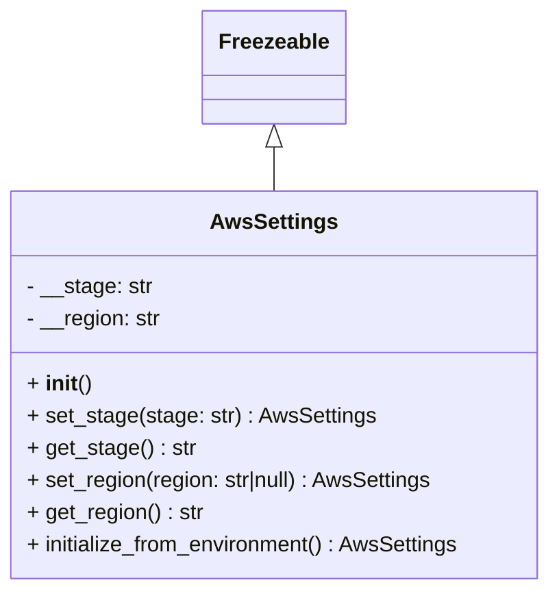

# Diagram: fv_core/fv_framework/python/fv_framework/aws/AwsSettings.py


> Auto-generated by Obscura crawlers

## Diagram 1



### SVG

<svg id="container" width="410.6015625" xmlns="http://www.w3.org/2000/svg" class="classDiagram" height="438" viewBox="0 0 410.6015625 438" role="graphics-document document" aria-roledescription="class"><style>#container{font-family:"trebuchet ms",verdana,arial,sans-serif;font-size:16px;fill:#333;}@keyframes edge-animation-frame{from{stroke-dashoffset:0;}}@keyframes dash{to{stroke-dashoffset:0;}}#container .edge-animation-slow{stroke-dasharray:9,5!important;stroke-dashoffset:900;animation:dash 50s linear infinite;stroke-linecap:round;}#container .edge-animation-fast{stroke-dasharray:9,5!important;stroke-dashoffset:900;animation:dash 20s linear infinite;stroke-linecap:round;}#container .error-icon{fill:#552222;}#container .error-text{fill:#552222;stroke:#552222;}#container .edge-thickness-normal{stroke-width:1px;}#container .edge-thickness-thick{stroke-width:3.5px;}#container .edge-pattern-solid{stroke-dasharray:0;}#container .edge-thickness-invisible{stroke-width:0;fill:none;}#container .edge-pattern-dashed{stroke-dasharray:3;}#container .edge-pattern-dotted{stroke-dasharray:2;}#container .marker{fill:#333333;stroke:#333333;}#container .marker.cross{stroke:#333333;}#container svg{font-family:"trebuchet ms",verdana,arial,sans-serif;font-size:16px;}#container p{margin:0;}#container g.classGroup text{fill:#9370DB;stroke:none;font-family:"trebuchet ms",verdana,arial,sans-serif;font-size:10px;}#container g.classGroup text .title{font-weight:bolder;}#container .nodeLabel,#container .edgeLabel{color:#131300;}#container .edgeLabel .label rect{fill:#ECECFF;}#container .label text{fill:#131300;}#container .labelBkg{background:#ECECFF;}#container .edgeLabel .label span{background:#ECECFF;}#container .classTitle{font-weight:bolder;}#container .node rect,#container .node circle,#container .node ellipse,#container .node polygon,#container .node path{fill:#ECECFF;stroke:#9370DB;stroke-width:1px;}#container .divider{stroke:#9370DB;stroke-width:1;}#container g.clickable{cursor:pointer;}#container g.classGroup rect{fill:#ECECFF;stroke:#9370DB;}#container g.classGroup line{stroke:#9370DB;stroke-width:1;}#container .classLabel .box{stroke:none;stroke-width:0;fill:#ECECFF;opacity:0.5;}#container .classLabel .label{fill:#9370DB;font-size:10px;}#container .relation{stroke:#333333;stroke-width:1;fill:none;}#container .dashed-line{stroke-dasharray:3;}#container .dotted-line{stroke-dasharray:1 2;}#container #compositionStart,#container .composition{fill:#333333!important;stroke:#333333!important;stroke-width:1;}#container #compositionEnd,#container .composition{fill:#333333!important;stroke:#333333!important;stroke-width:1;}#container #dependencyStart,#container .dependency{fill:#333333!important;stroke:#333333!important;stroke-width:1;}#container #dependencyStart,#container .dependency{fill:#333333!important;stroke:#333333!important;stroke-width:1;}#container #extensionStart,#container .extension{fill:transparent!important;stroke:#333333!important;stroke-width:1;}#container #extensionEnd,#container .extension{fill:transparent!important;stroke:#333333!important;stroke-width:1;}#container #aggregationStart,#container .aggregation{fill:transparent!important;stroke:#333333!important;stroke-width:1;}#container #aggregationEnd,#container .aggregation{fill:transparent!important;stroke:#333333!important;stroke-width:1;}#container #lollipopStart,#container .lollipop{fill:#ECECFF!important;stroke:#333333!important;stroke-width:1;}#container #lollipopEnd,#container .lollipop{fill:#ECECFF!important;stroke:#333333!important;stroke-width:1;}#container .edgeTerminals{font-size:11px;line-height:initial;}#container .classTitleText{text-anchor:middle;font-size:18px;fill:#333;}#container .label-icon{display:inline-block;height:1em;overflow:visible;vertical-align:-0.125em;}#container .node .label-icon path{fill:currentColor;stroke:revert;stroke-width:revert;}#container :root{--mermaid-font-family:"trebuchet ms",verdana,arial,sans-serif;}</style><g><defs><marker id="container_class-aggregationStart" class="marker aggregation class" refX="18" refY="7" markerWidth="190" markerHeight="240" orient="auto"><path d="M 18,7 L9,13 L1,7 L9,1 Z"></path></marker></defs><defs><marker id="container_class-aggregationEnd" class="marker aggregation class" refX="1" refY="7" markerWidth="20" markerHeight="28" orient="auto"><path d="M 18,7 L9,13 L1,7 L9,1 Z"></path></marker></defs><defs><marker id="container_class-extensionStart" class="marker extension class" refX="18" refY="7" markerWidth="190" markerHeight="240" orient="auto"><path d="M 1,7 L18,13 V 1 Z"></path></marker></defs><defs><marker id="container_class-extensionEnd" class="marker extension class" refX="1" refY="7" markerWidth="20" markerHeight="28" orient="auto"><path d="M 1,1 V 13 L18,7 Z"></path></marker></defs><defs><marker id="container_class-compositionStart" class="marker composition class" refX="18" refY="7" markerWidth="190" markerHeight="240" orient="auto"><path d="M 18,7 L9,13 L1,7 L9,1 Z"></path></marker></defs><defs><marker id="container_class-compositionEnd" class="marker composition class" refX="1" refY="7" markerWidth="20" markerHeight="28" orient="auto"><path d="M 18,7 L9,13 L1,7 L9,1 Z"></path></marker></defs><defs><marker id="container_class-dependencyStart" class="marker dependency class" refX="6" refY="7" markerWidth="190" markerHeight="240" orient="auto"><path d="M 5,7 L9,13 L1,7 L9,1 Z"></path></marker></defs><defs><marker id="container_class-dependencyEnd" class="marker dependency class" refX="13" refY="7" markerWidth="20" markerHeight="28" orient="auto"><path d="M 18,7 L9,13 L14,7 L9,1 Z"></path></marker></defs><defs><marker id="container_class-lollipopStart" class="marker lollipop class" refX="13" refY="7" markerWidth="190" markerHeight="240" orient="auto"><circle stroke="black" fill="transparent" cx="7" cy="7" r="6"></circle></marker></defs><defs><marker id="container_class-lollipopEnd" class="marker lollipop class" refX="1" refY="7" markerWidth="190" markerHeight="240" orient="auto"><circle stroke="black" fill="transparent" cx="7" cy="7" r="6"></circle></marker></defs><g class="root"><g class="clusters"></g><g class="edgePaths"><path d="M205.301,109.25L205.301,110.542C205.301,111.833,205.301,114.417,205.301,119.875C205.301,125.333,205.301,133.667,205.301,137.833L205.301,142" id="id_Freezeable_AwsSettings_1" class="edge-thickness-normal edge-pattern-solid relation" style=";;;" data-edge="true" data-et="edge" data-id="id_Freezeable_AwsSettings_1" data-points="W3sieCI6MjA1LjMwMDc4MTI1LCJ5Ijo5Mn0seyJ4IjoyMDUuMzAwNzgxMjUsInkiOjExN30seyJ4IjoyMDUuMzAwNzgxMjUsInkiOjE0Mn1d" marker-start="url(#container_class-extensionStart)"></path></g><g class="edgeLabels"><g class="edgeLabel"><g class="label" data-id="id_Freezeable_AwsSettings_1" transform="translate(0, 0)"><foreignObject width="0" height="0"><div xmlns="http://www.w3.org/1999/xhtml" class="labelBkg" style="display: table-cell; white-space: nowrap; line-height: 1.5; max-width: 200px; text-align: center;"><span class="edgeLabel"></span></div></foreignObject></g></g></g><g class="nodes"><g class="node default" id="classId-Freezeable-0" transform="translate(205.30078125, 50)"><g class="basic label-container"><path d="M-51.1953125 -42 L51.1953125 -42 L51.1953125 42 L-51.1953125 42" stroke="none" stroke-width="0" fill="#ECECFF" style=""></path><path d="M-51.1953125 -42 C-14.861718874625595 -42, 21.47187475074881 -42, 51.1953125 -42 M-51.1953125 -42 C-28.339751704820575 -42, -5.48419090964115 -42, 51.1953125 -42 M51.1953125 -42 C51.1953125 -22.627047622829163, 51.1953125 -3.254095245658327, 51.1953125 42 M51.1953125 -42 C51.1953125 -17.68738416338685, 51.1953125 6.625231673226303, 51.1953125 42 M51.1953125 42 C25.342897014430978 42, -0.509518471138044 42, -51.1953125 42 M51.1953125 42 C19.055548198844647 42, -13.084216102310705 42, -51.1953125 42 M-51.1953125 42 C-51.1953125 17.76887067477643, -51.1953125 -6.46225865044714, -51.1953125 -42 M-51.1953125 42 C-51.1953125 18.642528226093454, -51.1953125 -4.7149435478130926, -51.1953125 -42" stroke="#9370DB" stroke-width="1.3" fill="none" stroke-dasharray="0 0" style=""></path></g><g class="annotation-group text" transform="translate(0, -18)"></g><g class="label-group text" transform="translate(-39.1953125, -18)"><g class="label" style="font-weight: bolder" transform="translate(0,-12)"><foreignObject width="78.390625" height="24"><div xmlns="http://www.w3.org/1999/xhtml" style="display: table-cell; white-space: nowrap; line-height: 1.5; max-width: 127px; text-align: center;"><span class="nodeLabel markdown-node-label" style=""><p>Freezeable</p></span></div></foreignObject></g></g><g class="members-group text" transform="translate(-39.1953125, 30)"></g><g class="methods-group text" transform="translate(-39.1953125, 60)"></g><g class="divider" style=""><path d="M-51.1953125 6 C-27.161022035455378 6, -3.1267315709107564 6, 51.1953125 6 M-51.1953125 6 C-25.1025732033821 6, 0.9901660932357998 6, 51.1953125 6" stroke="#9370DB" stroke-width="1.3" fill="none" stroke-dasharray="0 0" style=""></path></g><g class="divider" style=""><path d="M-51.1953125 24 C-25.17757331502609 24, 0.8401658699478176 24, 51.1953125 24 M-51.1953125 24 C-10.310498024803024 24, 30.57431645039395 24, 51.1953125 24" stroke="#9370DB" stroke-width="1.3" fill="none" stroke-dasharray="0 0" style=""></path></g></g><g class="node default" id="classId-AwsSettings-1" transform="translate(205.30078125, 286)"><g class="basic label-container"><path d="M-197.30078125 -144 L197.30078125 -144 L197.30078125 144 L-197.30078125 144" stroke="none" stroke-width="0" fill="#ECECFF" style=""></path><path d="M-197.30078125 -144 C-79.19809823029757 -144, 38.90458478940485 -144, 197.30078125 -144 M-197.30078125 -144 C-41.22124877438395 -144, 114.8582837012321 -144, 197.30078125 -144 M197.30078125 -144 C197.30078125 -62.56259944063079, 197.30078125 18.874801118738418, 197.30078125 144 M197.30078125 -144 C197.30078125 -30.39120163986385, 197.30078125 83.2175967202723, 197.30078125 144 M197.30078125 144 C58.614854371187704 144, -80.07107250762459 144, -197.30078125 144 M197.30078125 144 C75.89998271685664 144, -45.50081581628672 144, -197.30078125 144 M-197.30078125 144 C-197.30078125 42.56719866292653, -197.30078125 -58.86560267414694, -197.30078125 -144 M-197.30078125 144 C-197.30078125 80.42628530120953, -197.30078125 16.852570602419064, -197.30078125 -144" stroke="#9370DB" stroke-width="1.3" fill="none" stroke-dasharray="0 0" style=""></path></g><g class="annotation-group text" transform="translate(0, -120)"></g><g class="label-group text" transform="translate(-44.8203125, -120)"><g class="label" style="font-weight: bolder" transform="translate(0,-12)"><foreignObject width="89.640625" height="24"><div xmlns="http://www.w3.org/1999/xhtml" style="display: table-cell; white-space: nowrap; line-height: 1.5; max-width: 137px; text-align: center;"><span class="nodeLabel markdown-node-label" style=""><p>AwsSettings</p></span></div></foreignObject></g></g><g class="members-group text" transform="translate(-185.30078125, -72)"><g class="label" style="" transform="translate(0,-12)"><foreignObject width="93.140625" height="24"><div xmlns="http://www.w3.org/1999/xhtml" style="display: table-cell; white-space: nowrap; line-height: 1.5; max-width: 151px; text-align: center;"><span class="nodeLabel markdown-node-label" style=""><p>- __stage: str</p></span></div></foreignObject></g><g class="label" style="" transform="translate(0,12)"><foreignObject width="100.640625" height="24"><div xmlns="http://www.w3.org/1999/xhtml" style="display: table-cell; white-space: nowrap; line-height: 1.5; max-width: 159px; text-align: center;"><span class="nodeLabel markdown-node-label" style=""><p>- __region: str</p></span></div></foreignObject></g></g><g class="methods-group text" transform="translate(-185.30078125, 0)"><g class="label" style="" transform="translate(0,-12)"><foreignObject width="47.046875" height="24"><div xmlns="http://www.w3.org/1999/xhtml" style="display: table-cell; white-space: nowrap; line-height: 1.5; max-width: 137px; text-align: center;"><span class="nodeLabel markdown-node-label" style=""><p>+ <strong>init</strong>()</p></span></div></foreignObject></g><g class="label" style="" transform="translate(0,12)"><foreignObject width="256.3125" height="24"><div xmlns="http://www.w3.org/1999/xhtml" style="display: table-cell; white-space: nowrap; line-height: 1.5; max-width: 314px; text-align: center;"><span class="nodeLabel markdown-node-label" style=""><p>+ set_stage(stage: str) : AwsSettings</p></span></div></foreignObject></g><g class="label" style="" transform="translate(0,36)"><foreignObject width="123.6875" height="24"><div xmlns="http://www.w3.org/1999/xhtml" style="display: table-cell; white-space: nowrap; line-height: 1.5; max-width: 182px; text-align: center;"><span class="nodeLabel markdown-node-label" style=""><p>+ get_stage() : str</p></span></div></foreignObject></g><g class="label" style="" transform="translate(0,60)"><foreignObject width="305.828125" height="24"><div xmlns="http://www.w3.org/1999/xhtml" style="display: table-cell; white-space: nowrap; line-height: 1.5; max-width: 363px; text-align: center;"><span class="nodeLabel markdown-node-label" style=""><p>+ set_region(region: str|null) : AwsSettings</p></span></div></foreignObject></g><g class="label" style="" transform="translate(0,84)"><foreignObject width="131.1875" height="24"><div xmlns="http://www.w3.org/1999/xhtml" style="display: table-cell; white-space: nowrap; line-height: 1.5; max-width: 189px; text-align: center;"><span class="nodeLabel markdown-node-label" style=""><p>+ get_region() : str</p></span></div></foreignObject></g><g class="label" style="" transform="translate(0,108)"><foreignObject width="325.78125" height="24"><div xmlns="http://www.w3.org/1999/xhtml" style="display: table-cell; white-space: nowrap; line-height: 1.5; max-width: 383px; text-align: center;"><span class="nodeLabel markdown-node-label" style=""><p>+ initialize_from_environment() : AwsSettings</p></span></div></foreignObject></g></g><g class="divider" style=""><path d="M-197.30078125 -96 C-68.28135807105693 -96, 60.73806510788614 -96, 197.30078125 -96 M-197.30078125 -96 C-105.51940610108296 -96, -13.738030952165929 -96, 197.30078125 -96" stroke="#9370DB" stroke-width="1.3" fill="none" stroke-dasharray="0 0" style=""></path></g><g class="divider" style=""><path d="M-197.30078125 -24 C-95.44727052513196 -24, 6.406240199736089 -24, 197.30078125 -24 M-197.30078125 -24 C-42.25657165884678 -24, 112.78763793230644 -24, 197.30078125 -24" stroke="#9370DB" stroke-width="1.3" fill="none" stroke-dasharray="0 0" style=""></path></g></g></g></g></g></svg>

## Diagram 2

```mermaid
flowchart TD
    subgraph Env["Environment Variables"]
        A[AWS_STAGE]
        B[AWS_DEFAULT_REGION]
        C[AWS_REGION]
    end
    Init[__init__()] -->|reads| A
    Init -->|reads| B
    Instance[AwsSettings instance] --> Init
    Init --> Instance
    InitEnv[initialize_from_environment()] -->|calls| S[set_stage(os.getenv(AWS_STAGE))]
    A -->|value| S
    S -->|returns self| Sret[AwsSettings (self)]
    Sret -->|calls| R[set_region(os.getenv(AWS_REGION))]
    C -->|value| R
    R -->|returns self| Done[AwsSettings (self)]
```

> SVG rendering failed for this diagram.
