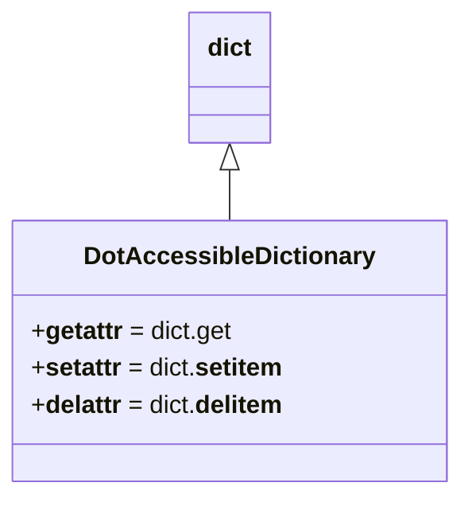
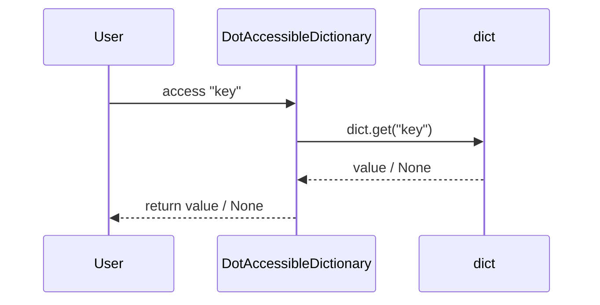

# Diagram: fv_core/fv_framework/python/fv_framework/aws/DotAccessibleDictionary.py

> Auto-generated by Obscura crawlers

## Diagram 1

### SVG

<svg id="container" width="291.0234375" xmlns="http://www.w3.org/2000/svg" class="classDiagram" height="318" viewBox="0 0 291.0234375 318" role="graphics-document document" aria-roledescription="class"><g><defs><marker id="container_class-aggregationStart" class="marker aggregation class" refX="18" refY="7" markerWidth="190" markerHeight="240" orient="auto"><path d="M 18,7 L9,13 L1,7 L9,1 Z"></path></marker></defs><defs><marker id="container_class-aggregationEnd" class="marker aggregation class" refX="1" refY="7" markerWidth="20" markerHeight="28" orient="auto"><path d="M 18,7 L9,13 L1,7 L9,1 Z"></path></marker></defs><defs><marker id="container_class-extensionStart" class="marker extension class" refX="18" refY="7" markerWidth="190" markerHeight="240" orient="auto"><path d="M 1,7 L18,13 V 1 Z"></path></marker></defs><defs><marker id="container_class-extensionEnd" class="marker extension class" refX="1" refY="7" markerWidth="20" markerHeight="28" orient="auto"><path d="M 1,1 V 13 L18,7 Z"></path></marker></defs><defs><marker id="container_class-compositionStart" class="marker composition class" refX="18" refY="7" markerWidth="190" markerHeight="240" orient="auto"><path d="M 18,7 L9,13 L1,7 L9,1 Z"></path></marker></defs><defs><marker id="container_class-compositionEnd" class="marker composition class" refX="1" refY="7" markerWidth="20" markerHeight="28" orient="auto"><path d="M 18,7 L9,13 L1,7 L9,1 Z"></path></marker></defs><defs><marker id="container_class-dependencyStart" class="marker dependency class" refX="6" refY="7" markerWidth="190" markerHeight="240" orient="auto"><path d="M 5,7 L9,13 L1,7 L9,1 Z"></path></marker></defs><defs><marker id="container_class-dependencyEnd" class="marker dependency class" refX="13" refY="7" markerWidth="20" markerHeight="28" orient="auto"><path d="M 18,7 L9,13 L14,7 L9,1 Z"></path></marker></defs><defs><marker id="container_class-lollipopStart" class="marker lollipop class" refX="13" refY="7" markerWidth="190" markerHeight="240" orient="auto"><circle stroke="black" fill="transparent" cx="7" cy="7" r="6"></circle></marker></defs><defs><marker id="container_class-lollipopEnd" class="marker lollipop class" refX="1" refY="7" markerWidth="190" markerHeight="240" orient="auto"><circle stroke="black" fill="transparent" cx="7" cy="7" r="6"></circle></marker></defs><g class="root"><g class="clusters"></g><g class="edgePaths"><path d="M145.512,109.25L145.512,110.542C145.512,111.833,145.512,114.417,145.512,119.875C145.512,125.333,145.512,133.667,145.512,137.833L145.512,142" id="id_dict_DotAccessibleDictionary_1" class="edge-thickness-normal edge-pattern-solid relation" style=";;;" data-edge="true" data-et="edge" data-id="id_dict_DotAccessibleDictionary_1" data-points="W3sieCI6MTQ1LjUxMTcxODc1LCJ5Ijo5Mn0seyJ4IjoxNDUuNTExNzE4NzUsInkiOjExN30seyJ4IjoxNDUuNTExNzE4NzUsInkiOjE0Mn1d" marker-start="url(#container_class-extensionStart)"></path></g><g class="edgeLabels"><g class="edgeLabel"><g class="label" data-id="id_dict_DotAccessibleDictionary_1" transform="translate(0, 0)"><foreignObject width="0" height="0">

</foreignObject></g></g></g><g class="nodes"><g class="node default" id="classId-dict-0" transform="translate(145.51171875, 50)"><g class="basic label-container"><path d="M-25.9765625 -42 L25.9765625 -42 L25.9765625 42 L-25.9765625 42" stroke="none" stroke-width="0" fill="#ECECFF" style=""></path><path d="M-25.9765625 -42 C-14.696167408974206 -42, -3.415772317948413 -42, 25.9765625 -42 M-25.9765625 -42 C-11.78140706983137 -42, 2.4137483603372587 -42, 25.9765625 -42 M25.9765625 -42 C25.9765625 -23.51155920836756, 25.9765625 -5.023118416735123, 25.9765625 42 M25.9765625 -42 C25.9765625 -15.601119205192738, 25.9765625 10.797761589614524, 25.9765625 42 M25.9765625 42 C8.971737427364207 42, -8.033087645271586 42, -25.9765625 42 M25.9765625 42 C10.623334245916945 42, -4.729894008166109 42, -25.9765625 42 M-25.9765625 42 C-25.9765625 14.115316297378115, -25.9765625 -13.76936740524377, -25.9765625 -42 M-25.9765625 42 C-25.9765625 24.194900029511732, -25.9765625 6.3898000590234645, -25.9765625 -42" stroke="#9370DB" stroke-width="1.3" fill="none" stroke-dasharray="0 0" style=""></path></g><g class="annotation-group text" transform="translate(0, -18)"></g><g class="label-group text" transform="translate(-13.9765625, -18)"><g class="label" style="font-weight: bolder" transform="translate(0,-12)"><foreignObject width="27.953125" height="24">

dict

</foreignObject></g></g><g class="members-group text" transform="translate(-13.9765625, 30)"></g><g class="methods-group text" transform="translate(-13.9765625, 60)"></g><g class="divider" style=""><path d="M-25.9765625 6 C-12.78233309808455 6, 0.4118963038309005 6, 25.9765625 6 M-25.9765625 6 C-12.074132941621125 6, 1.8282966167577506 6, 25.9765625 6" stroke="#9370DB" stroke-width="1.3" fill="none" stroke-dasharray="0 0" style=""></path></g><g class="divider" style=""><path d="M-25.9765625 24 C-6.398833318515894 24, 13.178895862968211 24, 25.9765625 24 M-25.9765625 24 C-11.546552950941592 24, 2.8834565981168154 24, 25.9765625 24" stroke="#9370DB" stroke-width="1.3" fill="none" stroke-dasharray="0 0" style=""></path></g></g><g class="node default" id="classId-DotAccessibleDictionary-1" transform="translate(145.51171875, 226)"><g class="basic label-container"><path d="M-137.51171875 -84 L137.51171875 -84 L137.51171875 84 L-137.51171875 84" stroke="none" stroke-width="0" fill="#ECECFF" style=""></path><path d="M-137.51171875 -84 C-33.92240419270797 -84, 69.66691036458406 -84, 137.51171875 -84 M-137.51171875 -84 C-66.05752278066973 -84, 5.396673188660543 -84, 137.51171875 -84 M137.51171875 -84 C137.51171875 -42.29055027174429, 137.51171875 -0.5811005434885743, 137.51171875 84 M137.51171875 -84 C137.51171875 -21.777274452834575, 137.51171875 40.44545109433085, 137.51171875 84 M137.51171875 84 C58.485659863908225 84, -20.54039902218355 84, -137.51171875 84 M137.51171875 84 C60.17115839285381 84, -17.169401964292376 84, -137.51171875 84 M-137.51171875 84 C-137.51171875 40.495744991500224, -137.51171875 -3.0085100169995513, -137.51171875 -84 M-137.51171875 84 C-137.51171875 47.56096403362382, -137.51171875 11.121928067247637, -137.51171875 -84" stroke="#9370DB" stroke-width="1.3" fill="none" stroke-dasharray="0 0" style=""></path></g><g class="annotation-group text" transform="translate(0, -60)"></g><g class="label-group text" transform="translate(-88.5703125, -60)"><g class="label" style="font-weight: bolder" transform="translate(0,-12)"><foreignObject width="177.140625" height="24">

DotAccessibleDictionary

</foreignObject></g></g><g class="members-group text" transform="translate(-125.51171875, -12)"><g class="label" style="" transform="translate(0,-12)"><foreignObject width="129.109375" height="24">

+<strong>getattr</strong> = dict.get

</foreignObject></g><g class="label" style="" transform="translate(0,12)"><foreignObject width="161.46875" height="24">

+<strong>setattr</strong> = dict.<strong>setitem</strong>

</foreignObject></g><g class="label" style="" transform="translate(0,36)"><foreignObject width="162.453125" height="24">

+<strong>delattr</strong> = dict.<strong>delitem</strong>

</foreignObject></g></g><g class="methods-group text" transform="translate(-125.51171875, 84)"></g><g class="divider" style=""><path d="M-137.51171875 -36 C-71.28645228627357 -36, -5.061185822547145 -36, 137.51171875 -36 M-137.51171875 -36 C-38.43867760226128 -36, 60.63436354547744 -36, 137.51171875 -36" stroke="#9370DB" stroke-width="1.3" fill="none" stroke-dasharray="0 0" style=""></path></g><g class="divider" style=""><path d="M-137.51171875 60 C-47.93382881045642 60, 41.64406112908716 60, 137.51171875 60 M-137.51171875 60 C-61.99063735091751 60, 13.53044404816498 60, 137.51171875 60" stroke="#9370DB" stroke-width="1.3" fill="none" stroke-dasharray="0 0" style=""></path></g></g></g></g></g></svg>

## Diagram 2

> SVG rendering failed for this diagram.
