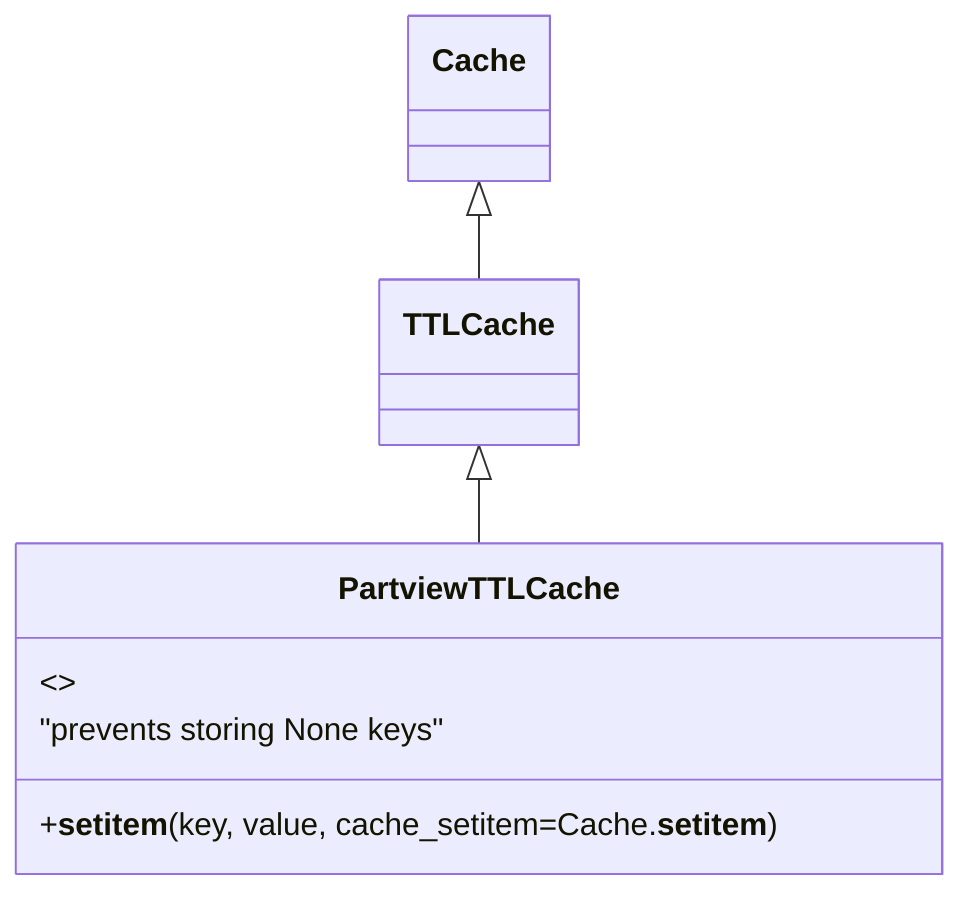

# Diagram: fv_core/fv_framework/python/fv_framework/aws/PartviewTTLCache.py


> Auto-generated by Obscura crawlers

## Diagram 1



### SVG

<svg id="container" width="473.453125" xmlns="http://www.w3.org/2000/svg" class="classDiagram" height="452" viewBox="0 0 473.453125 452" role="graphics-document document" aria-roledescription="class"><style>#container{font-family:"trebuchet ms",verdana,arial,sans-serif;font-size:16px;fill:#333;}@keyframes edge-animation-frame{from{stroke-dashoffset:0;}}@keyframes dash{to{stroke-dashoffset:0;}}#container .edge-animation-slow{stroke-dasharray:9,5!important;stroke-dashoffset:900;animation:dash 50s linear infinite;stroke-linecap:round;}#container .edge-animation-fast{stroke-dasharray:9,5!important;stroke-dashoffset:900;animation:dash 20s linear infinite;stroke-linecap:round;}#container .error-icon{fill:#552222;}#container .error-text{fill:#552222;stroke:#552222;}#container .edge-thickness-normal{stroke-width:1px;}#container .edge-thickness-thick{stroke-width:3.5px;}#container .edge-pattern-solid{stroke-dasharray:0;}#container .edge-thickness-invisible{stroke-width:0;fill:none;}#container .edge-pattern-dashed{stroke-dasharray:3;}#container .edge-pattern-dotted{stroke-dasharray:2;}#container .marker{fill:#333333;stroke:#333333;}#container .marker.cross{stroke:#333333;}#container svg{font-family:"trebuchet ms",verdana,arial,sans-serif;font-size:16px;}#container p{margin:0;}#container g.classGroup text{fill:#9370DB;stroke:none;font-family:"trebuchet ms",verdana,arial,sans-serif;font-size:10px;}#container g.classGroup text .title{font-weight:bolder;}#container .nodeLabel,#container .edgeLabel{color:#131300;}#container .edgeLabel .label rect{fill:#ECECFF;}#container .label text{fill:#131300;}#container .labelBkg{background:#ECECFF;}#container .edgeLabel .label span{background:#ECECFF;}#container .classTitle{font-weight:bolder;}#container .node rect,#container .node circle,#container .node ellipse,#container .node polygon,#container .node path{fill:#ECECFF;stroke:#9370DB;stroke-width:1px;}#container .divider{stroke:#9370DB;stroke-width:1;}#container g.clickable{cursor:pointer;}#container g.classGroup rect{fill:#ECECFF;stroke:#9370DB;}#container g.classGroup line{stroke:#9370DB;stroke-width:1;}#container .classLabel .box{stroke:none;stroke-width:0;fill:#ECECFF;opacity:0.5;}#container .classLabel .label{fill:#9370DB;font-size:10px;}#container .relation{stroke:#333333;stroke-width:1;fill:none;}#container .dashed-line{stroke-dasharray:3;}#container .dotted-line{stroke-dasharray:1 2;}#container #compositionStart,#container .composition{fill:#333333!important;stroke:#333333!important;stroke-width:1;}#container #compositionEnd,#container .composition{fill:#333333!important;stroke:#333333!important;stroke-width:1;}#container #dependencyStart,#container .dependency{fill:#333333!important;stroke:#333333!important;stroke-width:1;}#container #dependencyStart,#container .dependency{fill:#333333!important;stroke:#333333!important;stroke-width:1;}#container #extensionStart,#container .extension{fill:transparent!important;stroke:#333333!important;stroke-width:1;}#container #extensionEnd,#container .extension{fill:transparent!important;stroke:#333333!important;stroke-width:1;}#container #aggregationStart,#container .aggregation{fill:transparent!important;stroke:#333333!important;stroke-width:1;}#container #aggregationEnd,#container .aggregation{fill:transparent!important;stroke:#333333!important;stroke-width:1;}#container #lollipopStart,#container .lollipop{fill:#ECECFF!important;stroke:#333333!important;stroke-width:1;}#container #lollipopEnd,#container .lollipop{fill:#ECECFF!important;stroke:#333333!important;stroke-width:1;}#container .edgeTerminals{font-size:11px;line-height:initial;}#container .classTitleText{text-anchor:middle;font-size:18px;fill:#333;}#container .label-icon{display:inline-block;height:1em;overflow:visible;vertical-align:-0.125em;}#container .node .label-icon path{fill:currentColor;stroke:revert;stroke-width:revert;}#container :root{--mermaid-font-family:"trebuchet ms",verdana,arial,sans-serif;}</style><g><defs><marker id="container_class-aggregationStart" class="marker aggregation class" refX="18" refY="7" markerWidth="190" markerHeight="240" orient="auto"><path d="M 18,7 L9,13 L1,7 L9,1 Z"></path></marker></defs><defs><marker id="container_class-aggregationEnd" class="marker aggregation class" refX="1" refY="7" markerWidth="20" markerHeight="28" orient="auto"><path d="M 18,7 L9,13 L1,7 L9,1 Z"></path></marker></defs><defs><marker id="container_class-extensionStart" class="marker extension class" refX="18" refY="7" markerWidth="190" markerHeight="240" orient="auto"><path d="M 1,7 L18,13 V 1 Z"></path></marker></defs><defs><marker id="container_class-extensionEnd" class="marker extension class" refX="1" refY="7" markerWidth="20" markerHeight="28" orient="auto"><path d="M 1,1 V 13 L18,7 Z"></path></marker></defs><defs><marker id="container_class-compositionStart" class="marker composition class" refX="18" refY="7" markerWidth="190" markerHeight="240" orient="auto"><path d="M 18,7 L9,13 L1,7 L9,1 Z"></path></marker></defs><defs><marker id="container_class-compositionEnd" class="marker composition class" refX="1" refY="7" markerWidth="20" markerHeight="28" orient="auto"><path d="M 18,7 L9,13 L1,7 L9,1 Z"></path></marker></defs><defs><marker id="container_class-dependencyStart" class="marker dependency class" refX="6" refY="7" markerWidth="190" markerHeight="240" orient="auto"><path d="M 5,7 L9,13 L1,7 L9,1 Z"></path></marker></defs><defs><marker id="container_class-dependencyEnd" class="marker dependency class" refX="13" refY="7" markerWidth="20" markerHeight="28" orient="auto"><path d="M 18,7 L9,13 L14,7 L9,1 Z"></path></marker></defs><defs><marker id="container_class-lollipopStart" class="marker lollipop class" refX="13" refY="7" markerWidth="190" markerHeight="240" orient="auto"><circle stroke="black" fill="transparent" cx="7" cy="7" r="6"></circle></marker></defs><defs><marker id="container_class-lollipopEnd" class="marker lollipop class" refX="1" refY="7" markerWidth="190" markerHeight="240" orient="auto"><circle stroke="black" fill="transparent" cx="7" cy="7" r="6"></circle></marker></defs><g class="root"><g class="clusters"></g><g class="edgePaths"><path d="M236.727,109.25L236.727,110.542C236.727,111.833,236.727,114.417,236.727,119.875C236.727,125.333,236.727,133.667,236.727,137.833L236.727,142" id="id_Cache_TTLCache_1" class="edge-thickness-normal edge-pattern-solid relation" style=";;;" data-edge="true" data-et="edge" data-id="id_Cache_TTLCache_1" data-points="W3sieCI6MjM2LjcyNjU2MjUsInkiOjkyfSx7IngiOjIzNi43MjY1NjI1LCJ5IjoxMTd9LHsieCI6MjM2LjcyNjU2MjUsInkiOjE0Mn1d" marker-start="url(#container_class-extensionStart)"></path><path d="M236.727,243.25L236.727,244.542C236.727,245.833,236.727,248.417,236.727,253.875C236.727,259.333,236.727,267.667,236.727,271.833L236.727,276" id="id_TTLCache_PartviewTTLCache_2" class="edge-thickness-normal edge-pattern-solid relation" style=";;;" data-edge="true" data-et="edge" data-id="id_TTLCache_PartviewTTLCache_2" data-points="W3sieCI6MjM2LjcyNjU2MjUsInkiOjIyNn0seyJ4IjoyMzYuNzI2NTYyNSwieSI6MjUxfSx7IngiOjIzNi43MjY1NjI1LCJ5IjoyNzZ9XQ==" marker-start="url(#container_class-extensionStart)"></path></g><g class="edgeLabels"><g class="edgeLabel"><g class="label" data-id="id_Cache_TTLCache_1" transform="translate(0, 0)"><foreignObject width="0" height="0"><div xmlns="http://www.w3.org/1999/xhtml" class="labelBkg" style="display: table-cell; white-space: nowrap; line-height: 1.5; max-width: 200px; text-align: center;"><span class="edgeLabel"></span></div></foreignObject></g></g><g class="edgeLabel"><g class="label" data-id="id_TTLCache_PartviewTTLCache_2" transform="translate(0, 0)"><foreignObject width="0" height="0"><div xmlns="http://www.w3.org/1999/xhtml" class="labelBkg" style="display: table-cell; white-space: nowrap; line-height: 1.5; max-width: 200px; text-align: center;"><span class="edgeLabel"></span></div></foreignObject></g></g></g><g class="nodes"><g class="node default" id="classId-Cache-0" transform="translate(236.7265625, 50)"><g class="basic label-container"><path d="M-33.7734375 -42 L33.7734375 -42 L33.7734375 42 L-33.7734375 42" stroke="none" stroke-width="0" fill="#ECECFF" style=""></path><path d="M-33.7734375 -42 C-9.907504214207325 -42, 13.95842907158535 -42, 33.7734375 -42 M-33.7734375 -42 C-12.642399829908289 -42, 8.488637840183422 -42, 33.7734375 -42 M33.7734375 -42 C33.7734375 -11.662199233921765, 33.7734375 18.67560153215647, 33.7734375 42 M33.7734375 -42 C33.7734375 -9.903844023101968, 33.7734375 22.192311953796064, 33.7734375 42 M33.7734375 42 C6.980301134041177 42, -19.812835231917646 42, -33.7734375 42 M33.7734375 42 C18.56346617051244 42, 3.3534948410248866 42, -33.7734375 42 M-33.7734375 42 C-33.7734375 23.46155227514343, -33.7734375 4.923104550286858, -33.7734375 -42 M-33.7734375 42 C-33.7734375 11.442689383486357, -33.7734375 -19.114621233027286, -33.7734375 -42" stroke="#9370DB" stroke-width="1.3" fill="none" stroke-dasharray="0 0" style=""></path></g><g class="annotation-group text" transform="translate(0, -18)"></g><g class="label-group text" transform="translate(-21.7734375, -18)"><g class="label" style="font-weight: bolder" transform="translate(0,-12)"><foreignObject width="43.546875" height="24"><div xmlns="http://www.w3.org/1999/xhtml" style="display: table-cell; white-space: nowrap; line-height: 1.5; max-width: 93px; text-align: center;"><span class="nodeLabel markdown-node-label" style=""><p>Cache</p></span></div></foreignObject></g></g><g class="members-group text" transform="translate(-21.7734375, 30)"></g><g class="methods-group text" transform="translate(-21.7734375, 60)"></g><g class="divider" style=""><path d="M-33.7734375 6 C-11.653470752644107 6, 10.466495994711785 6, 33.7734375 6 M-33.7734375 6 C-13.741718990994187 6, 6.289999518011626 6, 33.7734375 6" stroke="#9370DB" stroke-width="1.3" fill="none" stroke-dasharray="0 0" style=""></path></g><g class="divider" style=""><path d="M-33.7734375 24 C-18.301567098267448 24, -2.829696696534892 24, 33.7734375 24 M-33.7734375 24 C-15.038316956214302 24, 3.696803587571395 24, 33.7734375 24" stroke="#9370DB" stroke-width="1.3" fill="none" stroke-dasharray="0 0" style=""></path></g></g><g class="node default" id="classId-TTLCache-1" transform="translate(236.7265625, 184)"><g class="basic label-container"><path d="M-46.1796875 -42 L46.1796875 -42 L46.1796875 42 L-46.1796875 42" stroke="none" stroke-width="0" fill="#ECECFF" style=""></path><path d="M-46.1796875 -42 C-12.608967218709665 -42, 20.96175306258067 -42, 46.1796875 -42 M-46.1796875 -42 C-23.41483522193188 -42, -0.6499829438637619 -42, 46.1796875 -42 M46.1796875 -42 C46.1796875 -13.79089037936691, 46.1796875 14.41821924126618, 46.1796875 42 M46.1796875 -42 C46.1796875 -18.425773155840623, 46.1796875 5.148453688318753, 46.1796875 42 M46.1796875 42 C14.151486460869869 42, -17.876714578260263 42, -46.1796875 42 M46.1796875 42 C10.218684407496994 42, -25.742318685006012 42, -46.1796875 42 M-46.1796875 42 C-46.1796875 24.499373870001424, -46.1796875 6.998747740002848, -46.1796875 -42 M-46.1796875 42 C-46.1796875 10.755238347300061, -46.1796875 -20.489523305399878, -46.1796875 -42" stroke="#9370DB" stroke-width="1.3" fill="none" stroke-dasharray="0 0" style=""></path></g><g class="annotation-group text" transform="translate(0, -18)"></g><g class="label-group text" transform="translate(-34.1796875, -18)"><g class="label" style="font-weight: bolder" transform="translate(0,-12)"><foreignObject width="68.359375" height="24"><div xmlns="http://www.w3.org/1999/xhtml" style="display: table-cell; white-space: nowrap; line-height: 1.5; max-width: 117px; text-align: center;"><span class="nodeLabel markdown-node-label" style=""><p>TTLCache</p></span></div></foreignObject></g></g><g class="members-group text" transform="translate(-34.1796875, 30)"></g><g class="methods-group text" transform="translate(-34.1796875, 60)"></g><g class="divider" style=""><path d="M-46.1796875 6 C-19.81563023751731 6, 6.5484270249653775 6, 46.1796875 6 M-46.1796875 6 C-15.315479067530237 6, 15.548729364939526 6, 46.1796875 6" stroke="#9370DB" stroke-width="1.3" fill="none" stroke-dasharray="0 0" style=""></path></g><g class="divider" style=""><path d="M-46.1796875 24 C-13.593507113688702 24, 18.992673272622596 24, 46.1796875 24 M-46.1796875 24 C-18.73427778101717 24, 8.71113193796566 24, 46.1796875 24" stroke="#9370DB" stroke-width="1.3" fill="none" stroke-dasharray="0 0" style=""></path></g></g><g class="node default" id="classId-PartviewTTLCache-2" transform="translate(236.7265625, 360)"><g class="basic label-container"><path d="M-228.7265625 -84 L228.7265625 -84 L228.7265625 84 L-228.7265625 84" stroke="none" stroke-width="0" fill="#ECECFF" style=""></path><path d="M-228.7265625 -84 C-47.982065041212024 -84, 132.76243241757595 -84, 228.7265625 -84 M-228.7265625 -84 C-83.34173926317754 -84, 62.04308397364491 -84, 228.7265625 -84 M228.7265625 -84 C228.7265625 -37.93687229581196, 228.7265625 8.126255408376082, 228.7265625 84 M228.7265625 -84 C228.7265625 -43.606383575156876, 228.7265625 -3.212767150313752, 228.7265625 84 M228.7265625 84 C78.72590723043382 84, -71.27474803913236 84, -228.7265625 84 M228.7265625 84 C129.420658646577 84, 30.11475479315402 84, -228.7265625 84 M-228.7265625 84 C-228.7265625 44.577014502833, -228.7265625 5.154029005666004, -228.7265625 -84 M-228.7265625 84 C-228.7265625 26.65596411489244, -228.7265625 -30.688071770215117, -228.7265625 -84" stroke="#9370DB" stroke-width="1.3" fill="none" stroke-dasharray="0 0" style=""></path></g><g class="annotation-group text" transform="translate(0, -60)"></g><g class="label-group text" transform="translate(-65.96875, -60)"><g class="label" style="font-weight: bolder" transform="translate(0,-12)"><foreignObject width="131.9375" height="24"><div xmlns="http://www.w3.org/1999/xhtml" style="display: table-cell; white-space: nowrap; line-height: 1.5; max-width: 179px; text-align: center;"><span class="nodeLabel markdown-node-label" style=""><p>PartviewTTLCache</p></span></div></foreignObject></g></g><g class="members-group text" transform="translate(-216.7265625, -12)"><g class="label" style="" transform="translate(0,-12)"><foreignObject width="16.015625" height="24"><div xmlns="http://www.w3.org/1999/xhtml" style="display: table-cell; white-space: nowrap; line-height: 1.5; max-width: 106px; text-align: center;"><span class="nodeLabel markdown-node-label" style=""><p>&lt;&gt;</p></span></div></foreignObject></g><g class="label" style="" transform="translate(0,12)"><foreignObject width="209.296875" height="24"><div xmlns="http://www.w3.org/1999/xhtml" style="display: table-cell; white-space: nowrap; line-height: 1.5; max-width: 259px; text-align: center;"><span class="nodeLabel markdown-node-label" style=""><p>"prevents storing None keys"</p></span></div></foreignObject></g></g><g class="methods-group text" transform="translate(-216.7265625, 60)"><g class="label" style="" transform="translate(0,-12)"><foreignObject width="367.484375" height="24"><div xmlns="http://www.w3.org/1999/xhtml" style="display: table-cell; white-space: nowrap; line-height: 1.5; max-width: 488px; text-align: center;"><span class="nodeLabel markdown-node-label" style=""><p>+<strong>setitem</strong>(key, value, cache_setitem=Cache.<strong>setitem</strong>)</p></span></div></foreignObject></g></g><g class="divider" style=""><path d="M-228.7265625 -36 C-110.00849187885449 -36, 8.70957874229103 -36, 228.7265625 -36 M-228.7265625 -36 C-47.232070862632185 -36, 134.26242077473563 -36, 228.7265625 -36" stroke="#9370DB" stroke-width="1.3" fill="none" stroke-dasharray="0 0" style=""></path></g><g class="divider" style=""><path d="M-228.7265625 36 C-107.21317221963129 36, 14.300218060737421 36, 228.7265625 36 M-228.7265625 36 C-125.73755749346294 36, -22.748552486925888 36, 228.7265625 36" stroke="#9370DB" stroke-width="1.3" fill="none" stroke-dasharray="0 0" style=""></path></g></g></g></g></g></svg>

## Diagram 2

```mermaid
flowchart TD
    Start([Start]) --> CheckKey{key == None?}
    CheckKey -- Yes --> Return[Return without setting]
    CheckKey -- No --> CallSuper[Call super().__setitem__(key, value, cache_setitem=Cache.__setitem__)]
    CallSuper --> End([End])
    Return --> End
```

> SVG rendering failed for this diagram.
