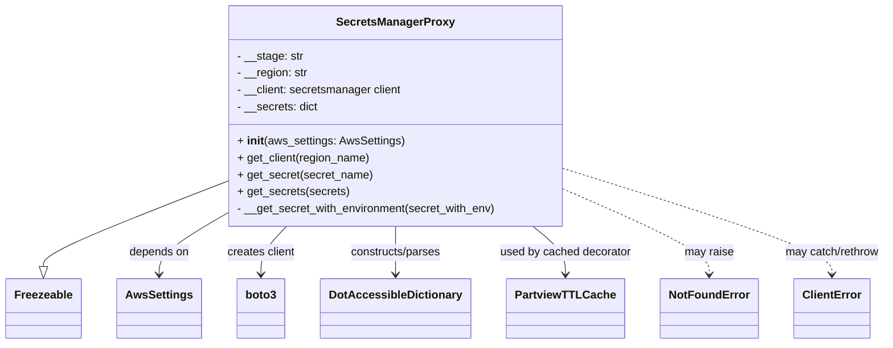

# Diagram: fv_core/fv_framework/python/fv_framework/aws/SecretsManagerProxy.py


> Auto-generated by Obscura crawlers

## Diagram 1



> SVG rendering failed for this diagram.

## Diagram 2

```mermaid
flowchart TD
subgraph Initialization
  A[__init__(aws_settings)] --> B{aws_settings is AwsSettings?}
  B --> C[set __stage and __region]
  C --> D[get_client(region) - cached]
  D --> E[create boto3 secretsmanager client]
  E --> F[store client in __client and init __secrets]
end

subgraph GetSecretFlow
  G[get_secret(secret_name)] --> H{secret_name in __secrets?}
  H -- Yes --> I[return cached secret]
  H -- No --> J[secret_with_env = stage/secret_name]
  J --> K[call __get_secret_with_environment(secret_with_env)]
  K --> L[store secret in __secrets[secret_name]]
  L --> I
end

subgraph FetchSecret
  M[call client.get_secret_value(SecretId)]
  M --> N[parse SecretString -> DotAccessibleDictionary]
  N --> O{parsed secret truthy?}
  O -- Yes --> P[retval = DotAccessibleDictionary(secret)]
  P --> Q[return retval]
  O -- No --> R[raise NotFoundError("Secret does not exist")]
  M -.-> S[ResourceNotFoundException -> ignored]
  M -.-> T[ClientError -> logging.error and re-raise]
end
```

> SVG rendering failed for this diagram.
