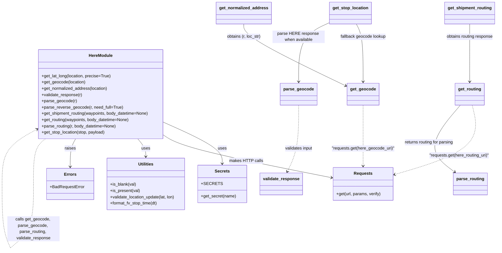

# Diagram: fv_core/fv_framework/python/fv_framework/common/HERE/HERE.py


> Auto-generated by Obscura crawlers

## Diagram 1



> SVG rendering failed for this diagram.

## Diagram 2

```mermaid
flowchart TD
    Start([get_lat_long(location, precise)]) --> CheckAddr{Required address fields present?}
    CheckAddr -- No --> ErrBadReq[BadRequestError: missing address fields]
    CheckAddr -- Yes --> CheckName{One of name fields present OR not precise?}
    CheckName -- Yes --> CallGeo[Call get_geocode(location) -> logging.info(loc_str)]
    CallGeo --> ParseGeo[Call parse_geocode(r) -> (latitude, longitude)]
    ParseGeo --> ReturnLatLong([Return (latitude, longitude)])
    CheckName -- No --> ErrBadReq
    ErrBadReq --> End([Exception raised])
```

> SVG rendering failed for this diagram.
