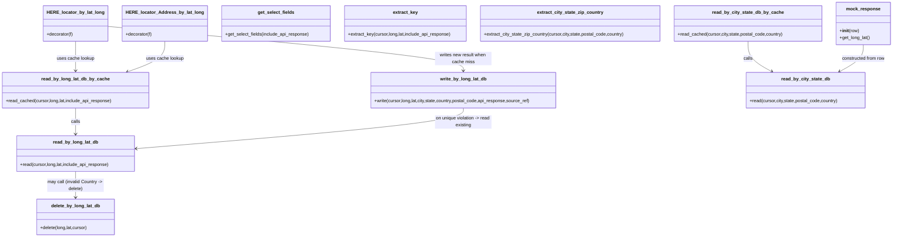

# Diagram: fv_core/fv_framework/python/fv_framework/common/HERE/HERE_locator.py


> Auto-generated by Obscura crawlers

## Diagram 1



### SVG

<svg id="container" width="3124.296875" xmlns="http://www.w3.org/2000/svg" class="classDiagram" height="838" viewBox="0 0 3124.296875 838" role="graphics-document document" aria-roledescription="class"><style>#container{font-family:"trebuchet ms",verdana,arial,sans-serif;font-size:16px;fill:#333;}@keyframes edge-animation-frame{from{stroke-dashoffset:0;}}@keyframes dash{to{stroke-dashoffset:0;}}#container .edge-animation-slow{stroke-dasharray:9,5!important;stroke-dashoffset:900;animation:dash 50s linear infinite;stroke-linecap:round;}#container .edge-animation-fast{stroke-dasharray:9,5!important;stroke-dashoffset:900;animation:dash 20s linear infinite;stroke-linecap:round;}#container .error-icon{fill:#552222;}#container .error-text{fill:#552222;stroke:#552222;}#container .edge-thickness-normal{stroke-width:1px;}#container .edge-thickness-thick{stroke-width:3.5px;}#container .edge-pattern-solid{stroke-dasharray:0;}#container .edge-thickness-invisible{stroke-width:0;fill:none;}#container .edge-pattern-dashed{stroke-dasharray:3;}#container .edge-pattern-dotted{stroke-dasharray:2;}#container .marker{fill:#333333;stroke:#333333;}#container .marker.cross{stroke:#333333;}#container svg{font-family:"trebuchet ms",verdana,arial,sans-serif;font-size:16px;}#container p{margin:0;}#container g.classGroup text{fill:#9370DB;stroke:none;font-family:"trebuchet ms",verdana,arial,sans-serif;font-size:10px;}#container g.classGroup text .title{font-weight:bolder;}#container .nodeLabel,#container .edgeLabel{color:#131300;}#container .edgeLabel .label rect{fill:#ECECFF;}#container .label text{fill:#131300;}#container .labelBkg{background:#ECECFF;}#container .edgeLabel .label span{background:#ECECFF;}#container .classTitle{font-weight:bolder;}#container .node rect,#container .node circle,#container .node ellipse,#container .node polygon,#container .node path{fill:#ECECFF;stroke:#9370DB;stroke-width:1px;}#container .divider{stroke:#9370DB;stroke-width:1;}#container g.clickable{cursor:pointer;}#container g.classGroup rect{fill:#ECECFF;stroke:#9370DB;}#container g.classGroup line{stroke:#9370DB;stroke-width:1;}#container .classLabel .box{stroke:none;stroke-width:0;fill:#ECECFF;opacity:0.5;}#container .classLabel .label{fill:#9370DB;font-size:10px;}#container .relation{stroke:#333333;stroke-width:1;fill:none;}#container .dashed-line{stroke-dasharray:3;}#container .dotted-line{stroke-dasharray:1 2;}#container #compositionStart,#container .composition{fill:#333333!important;stroke:#333333!important;stroke-width:1;}#container #compositionEnd,#container .composition{fill:#333333!important;stroke:#333333!important;stroke-width:1;}#container #dependencyStart,#container .dependency{fill:#333333!important;stroke:#333333!important;stroke-width:1;}#container #dependencyStart,#container .dependency{fill:#333333!important;stroke:#333333!important;stroke-width:1;}#container #extensionStart,#container .extension{fill:transparent!important;stroke:#333333!important;stroke-width:1;}#container #extensionEnd,#container .extension{fill:transparent!important;stroke:#333333!important;stroke-width:1;}#container #aggregationStart,#container .aggregation{fill:transparent!important;stroke:#333333!important;stroke-width:1;}#container #aggregationEnd,#container .aggregation{fill:transparent!important;stroke:#333333!important;stroke-width:1;}#container #lollipopStart,#container .lollipop{fill:#ECECFF!important;stroke:#333333!important;stroke-width:1;}#container #lollipopEnd,#container .lollipop{fill:#ECECFF!important;stroke:#333333!important;stroke-width:1;}#container .edgeTerminals{font-size:11px;line-height:initial;}#container .classTitleText{text-anchor:middle;font-size:18px;fill:#333;}#container .label-icon{display:inline-block;height:1em;overflow:visible;vertical-align:-0.125em;}#container .node .label-icon path{fill:currentColor;stroke:revert;stroke-width:revert;}#container :root{--mermaid-font-family:"trebuchet ms",verdana,arial,sans-serif;}</style><g><defs><marker id="container_class-aggregationStart" class="marker aggregation class" refX="18" refY="7" markerWidth="190" markerHeight="240" orient="auto"><path d="M 18,7 L9,13 L1,7 L9,1 Z"></path></marker></defs><defs><marker id="container_class-aggregationEnd" class="marker aggregation class" refX="1" refY="7" markerWidth="20" markerHeight="28" orient="auto"><path d="M 18,7 L9,13 L1,7 L9,1 Z"></path></marker></defs><defs><marker id="container_class-extensionStart" class="marker extension class" refX="18" refY="7" markerWidth="190" markerHeight="240" orient="auto"><path d="M 1,7 L18,13 V 1 Z"></path></marker></defs><defs><marker id="container_class-extensionEnd" class="marker extension class" refX="1" refY="7" markerWidth="20" markerHeight="28" orient="auto"><path d="M 1,1 V 13 L18,7 Z"></path></marker></defs><defs><marker id="container_class-compositionStart" class="marker composition class" refX="18" refY="7" markerWidth="190" markerHeight="240" orient="auto"><path d="M 18,7 L9,13 L1,7 L9,1 Z"></path></marker></defs><defs><marker id="container_class-compositionEnd" class="marker composition class" refX="1" refY="7" markerWidth="20" markerHeight="28" orient="auto"><path d="M 18,7 L9,13 L1,7 L9,1 Z"></path></marker></defs><defs><marker id="container_class-dependencyStart" class="marker dependency class" refX="6" refY="7" markerWidth="190" markerHeight="240" orient="auto"><path d="M 5,7 L9,13 L1,7 L9,1 Z"></path></marker></defs><defs><marker id="container_class-dependencyEnd" class="marker dependency class" refX="13" refY="7" markerWidth="20" markerHeight="28" orient="auto"><path d="M 18,7 L9,13 L14,7 L9,1 Z"></path></marker></defs><defs><marker id="container_class-lollipopStart" class="marker lollipop class" refX="13" refY="7" markerWidth="190" markerHeight="240" orient="auto"><circle stroke="black" fill="transparent" cx="7" cy="7" r="6"></circle></marker></defs><defs><marker id="container_class-lollipopEnd" class="marker lollipop class" refX="1" refY="7" markerWidth="190" markerHeight="240" orient="auto"><circle stroke="black" fill="transparent" cx="7" cy="7" r="6"></circle></marker></defs><g class="root"><g class="clusters"></g><g class="edgePaths"><path d="M265.27,382L265.27,390.167C265.27,398.333,265.27,414.667,265.27,430C265.27,445.333,265.27,459.667,265.27,466.833L265.27,474" id="id_read_by_long_lat_db_by_cache_read_by_long_lat_db_1" class="edge-thickness-normal edge-pattern-solid relation" style=";;;" data-edge="true" data-et="edge" data-id="id_read_by_long_lat_db_by_cache_read_by_long_lat_db_1" data-points="W3sieCI6MjY1LjI2OTUzMTI1LCJ5IjozODJ9LHsieCI6MjY1LjI2OTUzMTI1LCJ5Ijo0MzF9LHsieCI6MjY1LjI2OTUzMTI1LCJ5Ijo0ODB9XQ==" marker-end="url(#container_class-dependencyEnd)"></path><path d="M265.27,606L265.27,614.167C265.27,622.333,265.27,638.667,265.27,654C265.27,669.333,265.27,683.667,265.27,690.833L265.27,698" id="id_read_by_long_lat_db_delete_by_long_lat_db_2" class="edge-thickness-normal edge-pattern-solid relation" style=";;;" data-edge="true" data-et="edge" data-id="id_read_by_long_lat_db_delete_by_long_lat_db_2" data-points="W3sieCI6MjY1LjI2OTUzMTI1LCJ5Ijo2MDZ9LHsieCI6MjY1LjI2OTUzMTI1LCJ5Ijo2NTV9LHsieCI6MjY1LjI2OTUzMTI1LCJ5Ijo3MDR9XQ==" marker-end="url(#container_class-dependencyEnd)"></path><path d="M265.27,146L265.27,156.167C265.27,166.333,265.27,186.667,265.27,204C265.27,221.333,265.27,235.667,265.27,242.833L265.27,250" id="id_HERE_locator_by_lat_long_read_by_long_lat_db_by_cache_3" class="edge-thickness-normal edge-pattern-solid relation" style=";;;" data-edge="true" data-et="edge" data-id="id_HERE_locator_by_lat_long_read_by_long_lat_db_by_cache_3" data-points="W3sieCI6MjY1LjI2OTUzMTI1LCJ5IjoxNDZ9LHsieCI6MjY1LjI2OTUzMTI1LCJ5IjoyMDd9LHsieCI6MjY1LjI2OTUzMTI1LCJ5IjoyNTZ9XQ==" marker-end="url(#container_class-dependencyEnd)"></path><path d="M372.375,92.851L579.228,111.876C786.081,130.901,1199.786,168.95,1406.639,195.142C1613.492,221.333,1613.492,235.667,1613.492,242.833L1613.492,250" id="id_HERE_locator_by_lat_long_write_by_long_lat_db_4" class="edge-thickness-normal edge-pattern-solid relation" style=";;;" data-edge="true" data-et="edge" data-id="id_HERE_locator_by_lat_long_write_by_long_lat_db_4" data-points="W3sieCI6MzcyLjM3NSwieSI6OTIuODUwODA0NzM0MjQyMTN9LHsieCI6MTYxMy40OTIxODc1LCJ5IjoyMDd9LHsieCI6MTYxMy40OTIxODc1LCJ5IjoyNTZ9XQ==" marker-end="url(#container_class-dependencyEnd)"></path><path d="M562.617,146L562.617,156.167C562.617,166.333,562.617,186.667,541.871,204.648C521.126,222.628,479.634,238.257,458.888,246.071L438.142,253.885" id="id_HERE_locator_Address_by_lat_long_read_by_long_lat_db_by_cache_5" class="edge-thickness-normal edge-pattern-solid relation" style=";;;" data-edge="true" data-et="edge" data-id="id_HERE_locator_Address_by_lat_long_read_by_long_lat_db_by_cache_5" data-points="W3sieCI6NTYyLjYxNzE4NzUsInkiOjE0Nn0seyJ4Ijo1NjIuNjE3MTg3NSwieSI6MjA3fSx7IngiOjQzMi41Mjc1ODc4OTA2MjUsInkiOjI1Nn1d" marker-end="url(#container_class-dependencyEnd)"></path><path d="M2617.676,146L2617.676,156.167C2617.676,166.333,2617.676,186.667,2631.526,204.515C2645.376,222.363,2673.077,237.727,2686.927,245.408L2700.777,253.09" id="id_read_by_city_state_db_by_cache_read_by_city_state_db_6" class="edge-thickness-normal edge-pattern-solid relation" style=";;;" data-edge="true" data-et="edge" data-id="id_read_by_city_state_db_by_cache_read_by_city_state_db_6" data-points="W3sieCI6MjYxNy42NzU3ODEyNSwieSI6MTQ2fSx7IngiOjI2MTcuNjc1NzgxMjUsInkiOjIwN30seyJ4IjoyNzA2LjAyNDI5MTk5MjE4NzUsInkiOjI1Nn1d" marker-end="url(#container_class-dependencyEnd)"></path><path d="M1613.492,382L1613.492,390.167C1613.492,398.333,1613.492,414.667,1424.569,438.528C1235.645,462.389,857.799,493.777,668.875,509.472L479.952,525.166" id="id_write_by_long_lat_db_read_by_long_lat_db_7" class="edge-thickness-normal edge-pattern-solid relation" style=";;;" data-edge="true" data-et="edge" data-id="id_write_by_long_lat_db_read_by_long_lat_db_7" data-points="W3sieCI6MTYxMy40OTIxODc1LCJ5IjozODJ9LHsieCI6MTYxMy40OTIxODc1LCJ5Ijo0MzF9LHsieCI6NDczLjk3MjY1NjI1LCJ5Ijo1MjUuNjYyNTQ0NzI3NTc4M31d" marker-end="url(#container_class-dependencyEnd)"></path><path d="M3021.555,158L3021.555,166.167C3021.555,174.333,3021.555,190.667,3007.704,206.515C2993.854,222.363,2966.154,237.727,2952.303,245.408L2938.453,253.09" id="id_mock_response_read_by_city_state_db_8" class="edge-thickness-normal edge-pattern-solid relation" style=";;;" data-edge="true" data-et="edge" data-id="id_mock_response_read_by_city_state_db_8" data-points="W3sieCI6MzAyMS41NTQ2ODc1LCJ5IjoxNTh9LHsieCI6MzAyMS41NTQ2ODc1LCJ5IjoyMDd9LHsieCI6MjkzMy4yMDYxNzY3NTc4MTI1LCJ5IjoyNTZ9XQ==" marker-end="url(#container_class-dependencyEnd)"></path></g><g class="edgeLabels"><g class="edgeLabel" transform="translate(265.26953125, 431)"><g class="label" data-id="id_read_by_long_lat_db_by_cache_read_by_long_lat_db_1" transform="translate(-16.4453125, -12)"><foreignObject width="32.890625" height="24"><div xmlns="http://www.w3.org/1999/xhtml" class="labelBkg" style="display: table-cell; white-space: nowrap; line-height: 1.5; max-width: 200px; text-align: center;"><span class="edgeLabel"><p>calls</p></span></div></foreignObject></g></g><g class="edgeLabel" transform="translate(265.26953125, 655)"><g class="label" data-id="id_read_by_long_lat_db_delete_by_long_lat_db_2" transform="translate(-100, -24)"><foreignObject width="200" height="48"><div xmlns="http://www.w3.org/1999/xhtml" class="labelBkg" style="display: table; white-space: break-spaces; line-height: 1.5; max-width: 200px; text-align: center; width: 200px;"><span class="edgeLabel"><p>may call (invalid Country -&gt; delete)</p></span></div></foreignObject></g></g><g class="edgeLabel" transform="translate(265.26953125, 207)"><g class="label" data-id="id_HERE_locator_by_lat_long_read_by_long_lat_db_by_cache_3" transform="translate(-66.796875, -12)"><foreignObject width="133.59375" height="24"><div xmlns="http://www.w3.org/1999/xhtml" class="labelBkg" style="display: table-cell; white-space: nowrap; line-height: 1.5; max-width: 200px; text-align: center;"><span class="edgeLabel"><p>uses cache lookup</p></span></div></foreignObject></g></g><g class="edgeLabel" transform="translate(1613.4921875, 207)"><g class="label" data-id="id_HERE_locator_by_lat_long_write_by_long_lat_db_4" transform="translate(-100, -24)"><foreignObject width="200" height="48"><div xmlns="http://www.w3.org/1999/xhtml" class="labelBkg" style="display: table; white-space: break-spaces; line-height: 1.5; max-width: 200px; text-align: center; width: 200px;"><span class="edgeLabel"><p>writes new result when cache miss</p></span></div></foreignObject></g></g><g class="edgeLabel" transform="translate(562.6171875, 207)"><g class="label" data-id="id_HERE_locator_Address_by_lat_long_read_by_long_lat_db_by_cache_5" transform="translate(-66.796875, -12)"><foreignObject width="133.59375" height="24"><div xmlns="http://www.w3.org/1999/xhtml" class="labelBkg" style="display: table-cell; white-space: nowrap; line-height: 1.5; max-width: 200px; text-align: center;"><span class="edgeLabel"><p>uses cache lookup</p></span></div></foreignObject></g></g><g class="edgeLabel" transform="translate(2617.67578125, 207)"><g class="label" data-id="id_read_by_city_state_db_by_cache_read_by_city_state_db_6" transform="translate(-16.4453125, -12)"><foreignObject width="32.890625" height="24"><div xmlns="http://www.w3.org/1999/xhtml" class="labelBkg" style="display: table-cell; white-space: nowrap; line-height: 1.5; max-width: 200px; text-align: center;"><span class="edgeLabel"><p>calls</p></span></div></foreignObject></g></g><g class="edgeLabel" transform="translate(1613.4921875, 431)"><g class="label" data-id="id_write_by_long_lat_db_read_by_long_lat_db_7" transform="translate(-100, -24)"><foreignObject width="200" height="48"><div xmlns="http://www.w3.org/1999/xhtml" class="labelBkg" style="display: table; white-space: break-spaces; line-height: 1.5; max-width: 200px; text-align: center; width: 200px;"><span class="edgeLabel"><p>on unique violation -&gt; read existing</p></span></div></foreignObject></g></g><g class="edgeLabel" transform="translate(3021.5546875, 207)"><g class="label" data-id="id_mock_response_read_by_city_state_db_8" transform="translate(-77.6875, -12)"><foreignObject width="155.375" height="24"><div xmlns="http://www.w3.org/1999/xhtml" class="labelBkg" style="display: table-cell; white-space: nowrap; line-height: 1.5; max-width: 200px; text-align: center;"><span class="edgeLabel"><p>constructed from row</p></span></div></foreignObject></g></g></g><g class="nodes"><g class="node default" id="classId-mock_response-0" transform="translate(3021.5546875, 83)"><g class="basic label-container"><path d="M-94.7421875 -75 L94.7421875 -75 L94.7421875 75 L-94.7421875 75" stroke="none" stroke-width="0" fill="#ECECFF" style=""></path><path d="M-94.7421875 -75 C-50.67608352456766 -75, -6.609979549135318 -75, 94.7421875 -75 M-94.7421875 -75 C-44.010157912573305 -75, 6.721871674853389 -75, 94.7421875 -75 M94.7421875 -75 C94.7421875 -37.81795210661648, 94.7421875 -0.635904213232962, 94.7421875 75 M94.7421875 -75 C94.7421875 -17.03766804592042, 94.7421875 40.92466390815916, 94.7421875 75 M94.7421875 75 C43.398194938965354 75, -7.945797622069293 75, -94.7421875 75 M94.7421875 75 C33.04223165528878 75, -28.65772418942244 75, -94.7421875 75 M-94.7421875 75 C-94.7421875 20.928825312850414, -94.7421875 -33.14234937429917, -94.7421875 -75 M-94.7421875 75 C-94.7421875 19.550977112608656, -94.7421875 -35.89804577478269, -94.7421875 -75" stroke="#9370DB" stroke-width="1.3" fill="none" stroke-dasharray="0 0" style=""></path></g><g class="annotation-group text" transform="translate(0, -51)"></g><g class="label-group text" transform="translate(-57.4375, -51)"><g class="label" style="font-weight: bolder" transform="translate(0,-12)"><foreignObject width="114.875" height="24"><div xmlns="http://www.w3.org/1999/xhtml" style="display: table-cell; white-space: nowrap; line-height: 1.5; max-width: 164px; text-align: center;"><span class="nodeLabel markdown-node-label" style=""><p>mock_response</p></span></div></foreignObject></g></g><g class="members-group text" transform="translate(-82.7421875, -3)"></g><g class="methods-group text" transform="translate(-82.7421875, 27)"><g class="label" style="" transform="translate(0,-12)"><foreignObject width="69.3125" height="24"><div xmlns="http://www.w3.org/1999/xhtml" style="display: table-cell; white-space: nowrap; line-height: 1.5; max-width: 158px; text-align: center;"><span class="nodeLabel markdown-node-label" style=""><p>+<strong>init</strong>(row)</p></span></div></foreignObject></g><g class="label" style="" transform="translate(0,12)"><foreignObject width="108.046875" height="24"><div xmlns="http://www.w3.org/1999/xhtml" style="display: table-cell; white-space: nowrap; line-height: 1.5; max-width: 165px; text-align: center;"><span class="nodeLabel markdown-node-label" style=""><p>+get_long_lat()</p></span></div></foreignObject></g></g><g class="divider" style=""><path d="M-94.7421875 -27 C-52.86057790065803 -27, -10.978968301316058 -27, 94.7421875 -27 M-94.7421875 -27 C-35.86159178941157 -27, 23.01900392117686 -27, 94.7421875 -27" stroke="#9370DB" stroke-width="1.3" fill="none" stroke-dasharray="0 0" style=""></path></g><g class="divider" style=""><path d="M-94.7421875 -3 C-36.015399003580534 -3, 22.711389492838933 -3, 94.7421875 -3 M-94.7421875 -3 C-23.453653604720984 -3, 47.83488029055803 -3, 94.7421875 -3" stroke="#9370DB" stroke-width="1.3" fill="none" stroke-dasharray="0 0" style=""></path></g></g><g class="node default" id="classId-read_by_long_lat_db-1" transform="translate(265.26953125, 543)"><g class="basic label-container"><path d="M-208.703125 -63 L208.703125 -63 L208.703125 63 L-208.703125 63" stroke="none" stroke-width="0" fill="#ECECFF" style=""></path><path d="M-208.703125 -63 C-74.7436743221547 -63, 59.21577635569059 -63, 208.703125 -63 M-208.703125 -63 C-76.27723700003096 -63, 56.14865099993807 -63, 208.703125 -63 M208.703125 -63 C208.703125 -28.780818669080844, 208.703125 5.438362661838312, 208.703125 63 M208.703125 -63 C208.703125 -16.177446916503044, 208.703125 30.645106166993912, 208.703125 63 M208.703125 63 C99.52384361279346 63, -9.655437774413087 63, -208.703125 63 M208.703125 63 C96.81612890748687 63, -15.070867185026259 63, -208.703125 63 M-208.703125 63 C-208.703125 33.12522258109702, -208.703125 3.2504451621940404, -208.703125 -63 M-208.703125 63 C-208.703125 16.431665666637677, -208.703125 -30.136668666724646, -208.703125 -63" stroke="#9370DB" stroke-width="1.3" fill="none" stroke-dasharray="0 0" style=""></path></g><g class="annotation-group text" transform="translate(0, -39)"></g><g class="label-group text" transform="translate(-76.90625, -39)"><g class="label" style="font-weight: bolder" transform="translate(0,-12)"><foreignObject width="153.8125" height="24"><div xmlns="http://www.w3.org/1999/xhtml" style="display: table-cell; white-space: nowrap; line-height: 1.5; max-width: 202px; text-align: center;"><span class="nodeLabel markdown-node-label" style=""><p>read_by_long_lat_db</p></span></div></foreignObject></g></g><g class="members-group text" transform="translate(-196.703125, 9)"></g><g class="methods-group text" transform="translate(-196.703125, 39)"><g class="label" style="" transform="translate(0,-12)"><foreignObject width="316.5" height="24"><div xmlns="http://www.w3.org/1999/xhtml" style="display: table-cell; white-space: nowrap; line-height: 1.5; max-width: 374px; text-align: center;"><span class="nodeLabel markdown-node-label" style=""><p>+read(cursor,long,lat,include_api_response)</p></span></div></foreignObject></g></g><g class="divider" style=""><path d="M-208.703125 -15 C-68.09238908884507 -15, 72.51834682230987 -15, 208.703125 -15 M-208.703125 -15 C-108.4951894605943 -15, -8.287253921188608 -15, 208.703125 -15" stroke="#9370DB" stroke-width="1.3" fill="none" stroke-dasharray="0 0" style=""></path></g><g class="divider" style=""><path d="M-208.703125 9 C-75.75153584833635 9, 57.20005330332731 9, 208.703125 9 M-208.703125 9 C-66.27977493761881 9, 76.14357512476238 9, 208.703125 9" stroke="#9370DB" stroke-width="1.3" fill="none" stroke-dasharray="0 0" style=""></path></g></g><g class="node default" id="classId-read_by_long_lat_db_by_cache-2" transform="translate(265.26953125, 319)"><g class="basic label-container"><path d="M-257.26953125 -63 L257.26953125 -63 L257.26953125 63 L-257.26953125 63" stroke="none" stroke-width="0" fill="#ECECFF" style=""></path><path d="M-257.26953125 -63 C-105.95951890583424 -63, 45.35049343833151 -63, 257.26953125 -63 M-257.26953125 -63 C-124.82841712090232 -63, 7.612697008195369 -63, 257.26953125 -63 M257.26953125 -63 C257.26953125 -21.75972383399656, 257.26953125 19.48055233200688, 257.26953125 63 M257.26953125 -63 C257.26953125 -22.80028225199073, 257.26953125 17.39943549601854, 257.26953125 63 M257.26953125 63 C134.08836697622502 63, 10.907202702450064 63, -257.26953125 63 M257.26953125 63 C66.84356143783782 63, -123.58240837432436 63, -257.26953125 63 M-257.26953125 63 C-257.26953125 13.150736719976443, -257.26953125 -36.698526560047114, -257.26953125 -63 M-257.26953125 63 C-257.26953125 30.44188153458687, -257.26953125 -2.116236930826261, -257.26953125 -63" stroke="#9370DB" stroke-width="1.3" fill="none" stroke-dasharray="0 0" style=""></path></g><g class="annotation-group text" transform="translate(0, -39)"></g><g class="label-group text" transform="translate(-114.5234375, -39)"><g class="label" style="font-weight: bolder" transform="translate(0,-12)"><foreignObject width="229.046875" height="24"><div xmlns="http://www.w3.org/1999/xhtml" style="display: table-cell; white-space: nowrap; line-height: 1.5; max-width: 277px; text-align: center;"><span class="nodeLabel markdown-node-label" style=""><p>read_by_long_lat_db_by_cache</p></span></div></foreignObject></g></g><g class="members-group text" transform="translate(-245.26953125, 9)"></g><g class="methods-group text" transform="translate(-245.26953125, 39)"><g class="label" style="" transform="translate(0,-12)"><foreignObject width="376.015625" height="24"><div xmlns="http://www.w3.org/1999/xhtml" style="display: table-cell; white-space: nowrap; line-height: 1.5; max-width: 433px; text-align: center;"><span class="nodeLabel markdown-node-label" style=""><p>+read_cached(cursor,long,lat,include_api_response)</p></span></div></foreignObject></g></g><g class="divider" style=""><path d="M-257.26953125 -15 C-87.34942926890807 -15, 82.57067271218386 -15, 257.26953125 -15 M-257.26953125 -15 C-92.71137276637538 -15, 71.84678571724925 -15, 257.26953125 -15" stroke="#9370DB" stroke-width="1.3" fill="none" stroke-dasharray="0 0" style=""></path></g><g class="divider" style=""><path d="M-257.26953125 9 C-142.57225869644188 9, -27.874986142883756 9, 257.26953125 9 M-257.26953125 9 C-80.36300821280173 9, 96.54351482439654 9, 257.26953125 9" stroke="#9370DB" stroke-width="1.3" fill="none" stroke-dasharray="0 0" style=""></path></g></g><g class="node default" id="classId-delete_by_long_lat_db-3" transform="translate(265.26953125, 767)"><g class="basic label-container"><path d="M-137.93359375 -63 L137.93359375 -63 L137.93359375 63 L-137.93359375 63" stroke="none" stroke-width="0" fill="#ECECFF" style=""></path><path d="M-137.93359375 -63 C-55.005233425062016 -63, 27.923126899875967 -63, 137.93359375 -63 M-137.93359375 -63 C-50.623847717585605 -63, 36.68589831482879 -63, 137.93359375 -63 M137.93359375 -63 C137.93359375 -28.97969416605413, 137.93359375 5.0406116678917385, 137.93359375 63 M137.93359375 -63 C137.93359375 -18.365419456267375, 137.93359375 26.26916108746525, 137.93359375 63 M137.93359375 63 C42.63246685552434 63, -52.668660038951316 63, -137.93359375 63 M137.93359375 63 C49.62791382797268 63, -38.67776609405465 63, -137.93359375 63 M-137.93359375 63 C-137.93359375 36.46705026104372, -137.93359375 9.934100522087434, -137.93359375 -63 M-137.93359375 63 C-137.93359375 26.91955819013257, -137.93359375 -9.16088361973486, -137.93359375 -63" stroke="#9370DB" stroke-width="1.3" fill="none" stroke-dasharray="0 0" style=""></path></g><g class="annotation-group text" transform="translate(0, -39)"></g><g class="label-group text" transform="translate(-83.5859375, -39)"><g class="label" style="font-weight: bolder" transform="translate(0,-12)"><foreignObject width="167.171875" height="24"><div xmlns="http://www.w3.org/1999/xhtml" style="display: table-cell; white-space: nowrap; line-height: 1.5; max-width: 215px; text-align: center;"><span class="nodeLabel markdown-node-label" style=""><p>delete_by_long_lat_db</p></span></div></foreignObject></g></g><g class="members-group text" transform="translate(-125.93359375, 9)"></g><g class="methods-group text" transform="translate(-125.93359375, 39)"><g class="label" style="" transform="translate(0,-12)"><foreignObject width="168.28125" height="24"><div xmlns="http://www.w3.org/1999/xhtml" style="display: table-cell; white-space: nowrap; line-height: 1.5; max-width: 226px; text-align: center;"><span class="nodeLabel markdown-node-label" style=""><p>+delete(long,lat,cursor)</p></span></div></foreignObject></g></g><g class="divider" style=""><path d="M-137.93359375 -15 C-67.18285195644846 -15, 3.567889837103081 -15, 137.93359375 -15 M-137.93359375 -15 C-56.07536424925655 -15, 25.782865251486896 -15, 137.93359375 -15" stroke="#9370DB" stroke-width="1.3" fill="none" stroke-dasharray="0 0" style=""></path></g><g class="divider" style=""><path d="M-137.93359375 9 C-78.2885241769552 9, -18.643454603910413 9, 137.93359375 9 M-137.93359375 9 C-56.287628422639884 9, 25.358336904720232 9, 137.93359375 9" stroke="#9370DB" stroke-width="1.3" fill="none" stroke-dasharray="0 0" style=""></path></g></g><g class="node default" id="classId-write_by_long_lat_db-4" transform="translate(1613.4921875, 319)"><g class="basic label-container"><path d="M-330.6640625 -63 L330.6640625 -63 L330.6640625 63 L-330.6640625 63" stroke="none" stroke-width="0" fill="#ECECFF" style=""></path><path d="M-330.6640625 -63 C-115.54165233269478 -63, 99.58075783461044 -63, 330.6640625 -63 M-330.6640625 -63 C-171.408533940426 -63, -12.153005380851994 -63, 330.6640625 -63 M330.6640625 -63 C330.6640625 -21.302179285770002, 330.6640625 20.395641428459996, 330.6640625 63 M330.6640625 -63 C330.6640625 -20.30859532374822, 330.6640625 22.382809352503557, 330.6640625 63 M330.6640625 63 C116.12373106388932 63, -98.41660037222135 63, -330.6640625 63 M330.6640625 63 C134.7639574510911 63, -61.136147597817796 63, -330.6640625 63 M-330.6640625 63 C-330.6640625 13.235824756921424, -330.6640625 -36.52835048615715, -330.6640625 -63 M-330.6640625 63 C-330.6640625 31.6090769184379, -330.6640625 0.2181538368757998, -330.6640625 -63" stroke="#9370DB" stroke-width="1.3" fill="none" stroke-dasharray="0 0" style=""></path></g><g class="annotation-group text" transform="translate(0, -39)"></g><g class="label-group text" transform="translate(-79.078125, -39)"><g class="label" style="font-weight: bolder" transform="translate(0,-12)"><foreignObject width="158.15625" height="24"><div xmlns="http://www.w3.org/1999/xhtml" style="display: table-cell; white-space: nowrap; line-height: 1.5; max-width: 205px; text-align: center;"><span class="nodeLabel markdown-node-label" style=""><p>write_by_long_lat_db</p></span></div></foreignObject></g></g><g class="members-group text" transform="translate(-318.6640625, 9)"></g><g class="methods-group text" transform="translate(-318.6640625, 39)"><g class="label" style="" transform="translate(0,-12)"><foreignObject width="558.25" height="24"><div xmlns="http://www.w3.org/1999/xhtml" style="display: table-cell; white-space: nowrap; line-height: 1.5; max-width: 616px; text-align: center;"><span class="nodeLabel markdown-node-label" style=""><p>+write(cursor,long,lat,city,state,country,postal_code,api_response,source_ref)</p></span></div></foreignObject></g></g><g class="divider" style=""><path d="M-330.6640625 -15 C-183.20786325165164 -15, -35.75166400330329 -15, 330.6640625 -15 M-330.6640625 -15 C-125.06051985840432 -15, 80.54302278319136 -15, 330.6640625 -15" stroke="#9370DB" stroke-width="1.3" fill="none" stroke-dasharray="0 0" style=""></path></g><g class="divider" style=""><path d="M-330.6640625 9 C-88.33159457623839 9, 154.00087334752322 9, 330.6640625 9 M-330.6640625 9 C-68.61094488207362 9, 193.44217273585275 9, 330.6640625 9" stroke="#9370DB" stroke-width="1.3" fill="none" stroke-dasharray="0 0" style=""></path></g></g><g class="node default" id="classId-read_by_city_state_db-5" transform="translate(2819.615234375, 319)"><g class="basic label-container"><path d="M-210.578125 -63 L210.578125 -63 L210.578125 63 L-210.578125 63" stroke="none" stroke-width="0" fill="#ECECFF" style=""></path><path d="M-210.578125 -63 C-71.03951573933026 -63, 68.49909352133949 -63, 210.578125 -63 M-210.578125 -63 C-88.99424257694803 -63, 32.58963984610395 -63, 210.578125 -63 M210.578125 -63 C210.578125 -23.810754317244204, 210.578125 15.378491365511593, 210.578125 63 M210.578125 -63 C210.578125 -36.49286927215475, 210.578125 -9.985738544309491, 210.578125 63 M210.578125 63 C95.9093201807899 63, -18.75948463842019 63, -210.578125 63 M210.578125 63 C106.87028619162398 63, 3.162447383247951 63, -210.578125 63 M-210.578125 63 C-210.578125 15.204712217015782, -210.578125 -32.590575565968436, -210.578125 -63 M-210.578125 63 C-210.578125 32.689787311256254, -210.578125 2.379574622512507, -210.578125 -63" stroke="#9370DB" stroke-width="1.3" fill="none" stroke-dasharray="0 0" style=""></path></g><g class="annotation-group text" transform="translate(0, -39)"></g><g class="label-group text" transform="translate(-82.484375, -39)"><g class="label" style="font-weight: bolder" transform="translate(0,-12)"><foreignObject width="164.96875" height="24"><div xmlns="http://www.w3.org/1999/xhtml" style="display: table-cell; white-space: nowrap; line-height: 1.5; max-width: 212px; text-align: center;"><span class="nodeLabel markdown-node-label" style=""><p>read_by_city_state_db</p></span></div></foreignObject></g></g><g class="members-group text" transform="translate(-198.578125, 9)"></g><g class="methods-group text" transform="translate(-198.578125, 39)"><g class="label" style="" transform="translate(0,-12)"><foreignObject width="314.671875" height="24"><div xmlns="http://www.w3.org/1999/xhtml" style="display: table-cell; white-space: nowrap; line-height: 1.5; max-width: 372px; text-align: center;"><span class="nodeLabel markdown-node-label" style=""><p>+read(cursor,city,state,postal_code,country)</p></span></div></foreignObject></g></g><g class="divider" style=""><path d="M-210.578125 -15 C-110.97927750223897 -15, -11.380430004477944 -15, 210.578125 -15 M-210.578125 -15 C-93.2754023581774 -15, 24.027320283645196 -15, 210.578125 -15" stroke="#9370DB" stroke-width="1.3" fill="none" stroke-dasharray="0 0" style=""></path></g><g class="divider" style=""><path d="M-210.578125 9 C-123.6808148719858 9, -36.783504743971605 9, 210.578125 9 M-210.578125 9 C-96.90548727014568 9, 16.76715045970863 9, 210.578125 9" stroke="#9370DB" stroke-width="1.3" fill="none" stroke-dasharray="0 0" style=""></path></g></g><g class="node default" id="classId-read_by_city_state_db_by_cache-6" transform="translate(2617.67578125, 83)"><g class="basic label-container"><path d="M-259.13671875 -63 L259.13671875 -63 L259.13671875 63 L-259.13671875 63" stroke="none" stroke-width="0" fill="#ECECFF" style=""></path><path d="M-259.13671875 -63 C-129.1471098999066 -63, 0.8424989501867799 -63, 259.13671875 -63 M-259.13671875 -63 C-125.53456540876152 -63, 8.067587932476954 -63, 259.13671875 -63 M259.13671875 -63 C259.13671875 -19.99757469695357, 259.13671875 23.00485060609286, 259.13671875 63 M259.13671875 -63 C259.13671875 -28.14404172632259, 259.13671875 6.711916547354818, 259.13671875 63 M259.13671875 63 C78.31941527913492 63, -102.49788819173017 63, -259.13671875 63 M259.13671875 63 C65.311279539476 63, -128.514159671048 63, -259.13671875 63 M-259.13671875 63 C-259.13671875 27.609396361037724, -259.13671875 -7.781207277924551, -259.13671875 -63 M-259.13671875 63 C-259.13671875 13.651658382939587, -259.13671875 -35.696683234120826, -259.13671875 -63" stroke="#9370DB" stroke-width="1.3" fill="none" stroke-dasharray="0 0" style=""></path></g><g class="annotation-group text" transform="translate(0, -39)"></g><g class="label-group text" transform="translate(-120.1015625, -39)"><g class="label" style="font-weight: bolder" transform="translate(0,-12)"><foreignObject width="240.203125" height="24"><div xmlns="http://www.w3.org/1999/xhtml" style="display: table-cell; white-space: nowrap; line-height: 1.5; max-width: 287px; text-align: center;"><span class="nodeLabel markdown-node-label" style=""><p>read_by_city_state_db_by_cache</p></span></div></foreignObject></g></g><g class="members-group text" transform="translate(-247.13671875, 9)"></g><g class="methods-group text" transform="translate(-247.13671875, 39)"><g class="label" style="" transform="translate(0,-12)"><foreignObject width="374.171875" height="24"><div xmlns="http://www.w3.org/1999/xhtml" style="display: table-cell; white-space: nowrap; line-height: 1.5; max-width: 432px; text-align: center;"><span class="nodeLabel markdown-node-label" style=""><p>+read_cached(cursor,city,state,postal_code,country)</p></span></div></foreignObject></g></g><g class="divider" style=""><path d="M-259.13671875 -15 C-77.46451267732266 -15, 104.20769339535468 -15, 259.13671875 -15 M-259.13671875 -15 C-79.48163084226962 -15, 100.17345706546075 -15, 259.13671875 -15" stroke="#9370DB" stroke-width="1.3" fill="none" stroke-dasharray="0 0" style=""></path></g><g class="divider" style=""><path d="M-259.13671875 9 C-72.59779494038693 9, 113.94112886922613 9, 259.13671875 9 M-259.13671875 9 C-90.37523602914499 9, 78.38624669171003 9, 259.13671875 9" stroke="#9370DB" stroke-width="1.3" fill="none" stroke-dasharray="0 0" style=""></path></g></g><g class="node default" id="classId-get_select_fields-7" transform="translate(945.1875, 83)"><g class="basic label-container"><path d="M-192.328125 -63 L192.328125 -63 L192.328125 63 L-192.328125 63" stroke="none" stroke-width="0" fill="#ECECFF" style=""></path><path d="M-192.328125 -63 C-59.418585291088505 -63, 73.49095441782299 -63, 192.328125 -63 M-192.328125 -63 C-39.24870559183378 -63, 113.83071381633243 -63, 192.328125 -63 M192.328125 -63 C192.328125 -37.324601299425716, 192.328125 -11.649202598851431, 192.328125 63 M192.328125 -63 C192.328125 -29.69715231082359, 192.328125 3.60569537835282, 192.328125 63 M192.328125 63 C58.7622250690049 63, -74.8036748619902 63, -192.328125 63 M192.328125 63 C108.58503294961174 63, 24.841940899223488 63, -192.328125 63 M-192.328125 63 C-192.328125 17.767993379251763, -192.328125 -27.464013241496474, -192.328125 -63 M-192.328125 63 C-192.328125 16.313464431443776, -192.328125 -30.373071137112447, -192.328125 -63" stroke="#9370DB" stroke-width="1.3" fill="none" stroke-dasharray="0 0" style=""></path></g><g class="annotation-group text" transform="translate(0, -39)"></g><g class="label-group text" transform="translate(-62.0625, -39)"><g class="label" style="font-weight: bolder" transform="translate(0,-12)"><foreignObject width="124.125" height="24"><div xmlns="http://www.w3.org/1999/xhtml" style="display: table-cell; white-space: nowrap; line-height: 1.5; max-width: 171px; text-align: center;"><span class="nodeLabel markdown-node-label" style=""><p>get_select_fields</p></span></div></foreignObject></g></g><g class="members-group text" transform="translate(-180.328125, 9)"></g><g class="methods-group text" transform="translate(-180.328125, 39)"><g class="label" style="" transform="translate(0,-12)"><foreignObject width="298.59375" height="24"><div xmlns="http://www.w3.org/1999/xhtml" style="display: table-cell; white-space: nowrap; line-height: 1.5; max-width: 356px; text-align: center;"><span class="nodeLabel markdown-node-label" style=""><p>+get_select_fields(include_api_response)</p></span></div></foreignObject></g></g><g class="divider" style=""><path d="M-192.328125 -15 C-48.48565349819978 -15, 95.35681800360044 -15, 192.328125 -15 M-192.328125 -15 C-100.05705809004984 -15, -7.785991180099671 -15, 192.328125 -15" stroke="#9370DB" stroke-width="1.3" fill="none" stroke-dasharray="0 0" style=""></path></g><g class="divider" style=""><path d="M-192.328125 9 C-107.93436023539478 9, -23.540595470789555 9, 192.328125 9 M-192.328125 9 C-73.77932753446746 9, 44.76946993106509 9, 192.328125 9" stroke="#9370DB" stroke-width="1.3" fill="none" stroke-dasharray="0 0" style=""></path></g></g><g class="node default" id="classId-extract_key-8" transform="translate(1404.234375, 83)"><g class="basic label-container"><path d="M-216.71875 -63 L216.71875 -63 L216.71875 63 L-216.71875 63" stroke="none" stroke-width="0" fill="#ECECFF" style=""></path><path d="M-216.71875 -63 C-47.46893170118554 -63, 121.78088659762892 -63, 216.71875 -63 M-216.71875 -63 C-77.87201332029969 -63, 60.97472335940063 -63, 216.71875 -63 M216.71875 -63 C216.71875 -28.994845240583537, 216.71875 5.010309518832926, 216.71875 63 M216.71875 -63 C216.71875 -15.852945303858057, 216.71875 31.294109392283886, 216.71875 63 M216.71875 63 C44.702686687204334 63, -127.31337662559133 63, -216.71875 63 M216.71875 63 C58.2633280251988 63, -100.1920939496024 63, -216.71875 63 M-216.71875 63 C-216.71875 37.27118274428562, -216.71875 11.542365488571235, -216.71875 -63 M-216.71875 63 C-216.71875 34.873477629740876, -216.71875 6.746955259481744, -216.71875 -63" stroke="#9370DB" stroke-width="1.3" fill="none" stroke-dasharray="0 0" style=""></path></g><g class="annotation-group text" transform="translate(0, -39)"></g><g class="label-group text" transform="translate(-42.703125, -39)"><g class="label" style="font-weight: bolder" transform="translate(0,-12)"><foreignObject width="85.40625" height="24"><div xmlns="http://www.w3.org/1999/xhtml" style="display: table-cell; white-space: nowrap; line-height: 1.5; max-width: 133px; text-align: center;"><span class="nodeLabel markdown-node-label" style=""><p>extract_key</p></span></div></foreignObject></g></g><g class="members-group text" transform="translate(-204.71875, 9)"></g><g class="methods-group text" transform="translate(-204.71875, 39)"><g class="label" style="" transform="translate(0,-12)"><foreignObject width="366.734375" height="24"><div xmlns="http://www.w3.org/1999/xhtml" style="display: table-cell; white-space: nowrap; line-height: 1.5; max-width: 424px; text-align: center;"><span class="nodeLabel markdown-node-label" style=""><p>+extract_key(cursor,long,lat,include_api_response)</p></span></div></foreignObject></g></g><g class="divider" style=""><path d="M-216.71875 -15 C-49.49210909520235 -15, 117.7345318095953 -15, 216.71875 -15 M-216.71875 -15 C-75.62209020654794 -15, 65.47456958690412 -15, 216.71875 -15" stroke="#9370DB" stroke-width="1.3" fill="none" stroke-dasharray="0 0" style=""></path></g><g class="divider" style=""><path d="M-216.71875 9 C-70.82698721556079 9, 75.06477556887842 9, 216.71875 9 M-216.71875 9 C-127.28596372417618 9, -37.85317744835237 9, 216.71875 9" stroke="#9370DB" stroke-width="1.3" fill="none" stroke-dasharray="0 0" style=""></path></g></g><g class="node default" id="classId-extract_city_state_zip_country-9" transform="translate(1989.74609375, 83)"><g class="basic label-container"><path d="M-318.79296875 -63 L318.79296875 -63 L318.79296875 63 L-318.79296875 63" stroke="none" stroke-width="0" fill="#ECECFF" style=""></path><path d="M-318.79296875 -63 C-142.68692538774138 -63, 33.419117974517235 -63, 318.79296875 -63 M-318.79296875 -63 C-133.53927716735703 -63, 51.714414415285944 -63, 318.79296875 -63 M318.79296875 -63 C318.79296875 -26.47083080436559, 318.79296875 10.05833839126882, 318.79296875 63 M318.79296875 -63 C318.79296875 -20.639205275325928, 318.79296875 21.721589449348144, 318.79296875 63 M318.79296875 63 C96.68530955700734 63, -125.42234963598531 63, -318.79296875 63 M318.79296875 63 C123.03095150545715 63, -72.7310657390857 63, -318.79296875 63 M-318.79296875 63 C-318.79296875 26.104397768891985, -318.79296875 -10.79120446221603, -318.79296875 -63 M-318.79296875 63 C-318.79296875 19.31176740105054, -318.79296875 -24.376465197898924, -318.79296875 -63" stroke="#9370DB" stroke-width="1.3" fill="none" stroke-dasharray="0 0" style=""></path></g><g class="annotation-group text" transform="translate(0, -39)"></g><g class="label-group text" transform="translate(-112.0546875, -39)"><g class="label" style="font-weight: bolder" transform="translate(0,-12)"><foreignObject width="224.109375" height="24"><div xmlns="http://www.w3.org/1999/xhtml" style="display: table-cell; white-space: nowrap; line-height: 1.5; max-width: 270px; text-align: center;"><span class="nodeLabel markdown-node-label" style=""><p>extract_city_state_zip_country</p></span></div></foreignObject></g></g><g class="members-group text" transform="translate(-306.79296875, 9)"></g><g class="methods-group text" transform="translate(-306.79296875, 39)"><g class="label" style="" transform="translate(0,-12)"><foreignObject width="501.53125" height="24"><div xmlns="http://www.w3.org/1999/xhtml" style="display: table-cell; white-space: nowrap; line-height: 1.5; max-width: 559px; text-align: center;"><span class="nodeLabel markdown-node-label" style=""><p>+extract_city_state_zip_country(cursor,city,state,postal_code,country)</p></span></div></foreignObject></g></g><g class="divider" style=""><path d="M-318.79296875 -15 C-88.84154564694543 -15, 141.10987745610913 -15, 318.79296875 -15 M-318.79296875 -15 C-183.9682923268562 -15, -49.14361590371237 -15, 318.79296875 -15" stroke="#9370DB" stroke-width="1.3" fill="none" stroke-dasharray="0 0" style=""></path></g><g class="divider" style=""><path d="M-318.79296875 9 C-182.5479023199496 9, -46.3028358898992 9, 318.79296875 9 M-318.79296875 9 C-113.06094669172964 9, 92.67107536654072 9, 318.79296875 9" stroke="#9370DB" stroke-width="1.3" fill="none" stroke-dasharray="0 0" style=""></path></g></g><g class="node default" id="classId-HERE_locator_by_lat_long-10" transform="translate(265.26953125, 83)"><g class="basic label-container"><path d="M-107.10546875 -63 L107.10546875 -63 L107.10546875 63 L-107.10546875 63" stroke="none" stroke-width="0" fill="#ECECFF" style=""></path><path d="M-107.10546875 -63 C-26.19387556788388 -63, 54.71771761423224 -63, 107.10546875 -63 M-107.10546875 -63 C-24.38758169873715 -63, 58.3303053525257 -63, 107.10546875 -63 M107.10546875 -63 C107.10546875 -30.31162592301184, 107.10546875 2.3767481539763224, 107.10546875 63 M107.10546875 -63 C107.10546875 -33.4006771177716, 107.10546875 -3.801354235543201, 107.10546875 63 M107.10546875 63 C30.34518581345074 63, -46.41509712309852 63, -107.10546875 63 M107.10546875 63 C26.451786409956767 63, -54.201895930086465 63, -107.10546875 63 M-107.10546875 63 C-107.10546875 20.875212629232408, -107.10546875 -21.249574741535184, -107.10546875 -63 M-107.10546875 63 C-107.10546875 18.97851368381818, -107.10546875 -25.042972632363643, -107.10546875 -63" stroke="#9370DB" stroke-width="1.3" fill="none" stroke-dasharray="0 0" style=""></path></g><g class="annotation-group text" transform="translate(0, -39)"></g><g class="label-group text" transform="translate(-94.8671875, -39)"><g class="label" style="font-weight: bolder" transform="translate(0,-12)"><foreignObject width="189.734375" height="24"><div xmlns="http://www.w3.org/1999/xhtml" style="display: table-cell; white-space: nowrap; line-height: 1.5; max-width: 239px; text-align: center;"><span class="nodeLabel markdown-node-label" style=""><p>HERE_locator_by_lat_long</p></span></div></foreignObject></g></g><g class="members-group text" transform="translate(-95.10546875, 9)"></g><g class="methods-group text" transform="translate(-95.10546875, 39)"><g class="label" style="" transform="translate(0,-12)"><foreignObject width="95.34375" height="24"><div xmlns="http://www.w3.org/1999/xhtml" style="display: table-cell; white-space: nowrap; line-height: 1.5; max-width: 153px; text-align: center;"><span class="nodeLabel markdown-node-label" style=""><p>+decorator(f)</p></span></div></foreignObject></g></g><g class="divider" style=""><path d="M-107.10546875 -15 C-44.36431282639324 -15, 18.376843097213523 -15, 107.10546875 -15 M-107.10546875 -15 C-51.17828966926458 -15, 4.7488894114708415 -15, 107.10546875 -15" stroke="#9370DB" stroke-width="1.3" fill="none" stroke-dasharray="0 0" style=""></path></g><g class="divider" style=""><path d="M-107.10546875 9 C-57.79491821790975 9, -8.484367685819507 9, 107.10546875 9 M-107.10546875 9 C-42.553553906211576 9, 21.998360937576848 9, 107.10546875 9" stroke="#9370DB" stroke-width="1.3" fill="none" stroke-dasharray="0 0" style=""></path></g></g><g class="node default" id="classId-HERE_locator_Address_by_lat_long-11" transform="translate(562.6171875, 83)"><g class="basic label-container"><path d="M-140.2421875 -63 L140.2421875 -63 L140.2421875 63 L-140.2421875 63" stroke="none" stroke-width="0" fill="#ECECFF" style=""></path><path d="M-140.2421875 -63 C-56.66636256544835 -63, 26.909462369103295 -63, 140.2421875 -63 M-140.2421875 -63 C-76.46488093146264 -63, -12.68757436292529 -63, 140.2421875 -63 M140.2421875 -63 C140.2421875 -27.812469678763343, 140.2421875 7.375060642473315, 140.2421875 63 M140.2421875 -63 C140.2421875 -36.9328954768172, 140.2421875 -10.865790953634402, 140.2421875 63 M140.2421875 63 C75.75276490211664 63, 11.263342304233277 63, -140.2421875 63 M140.2421875 63 C54.87267617457704 63, -30.496835150845925 63, -140.2421875 63 M-140.2421875 63 C-140.2421875 24.97563957719293, -140.2421875 -13.048720845614142, -140.2421875 -63 M-140.2421875 63 C-140.2421875 17.33491277984441, -140.2421875 -28.330174440311183, -140.2421875 -63" stroke="#9370DB" stroke-width="1.3" fill="none" stroke-dasharray="0 0" style=""></path></g><g class="annotation-group text" transform="translate(0, -39)"></g><g class="label-group text" transform="translate(-128.2421875, -39)"><g class="label" style="font-weight: bolder" transform="translate(0,-12)"><foreignObject width="256.484375" height="24"><div xmlns="http://www.w3.org/1999/xhtml" style="display: table-cell; white-space: nowrap; line-height: 1.5; max-width: 304px; text-align: center;"><span class="nodeLabel markdown-node-label" style=""><p>HERE_locator_Address_by_lat_long</p></span></div></foreignObject></g></g><g class="members-group text" transform="translate(-128.2421875, 9)"></g><g class="methods-group text" transform="translate(-128.2421875, 39)"><g class="label" style="" transform="translate(0,-12)"><foreignObject width="95.34375" height="24"><div xmlns="http://www.w3.org/1999/xhtml" style="display: table-cell; white-space: nowrap; line-height: 1.5; max-width: 153px; text-align: center;"><span class="nodeLabel markdown-node-label" style=""><p>+decorator(f)</p></span></div></foreignObject></g></g><g class="divider" style=""><path d="M-140.2421875 -15 C-68.3815446922145 -15, 3.4790981155709915 -15, 140.2421875 -15 M-140.2421875 -15 C-29.568059129196186 -15, 81.10606924160763 -15, 140.2421875 -15" stroke="#9370DB" stroke-width="1.3" fill="none" stroke-dasharray="0 0" style=""></path></g><g class="divider" style=""><path d="M-140.2421875 9 C-53.79801318093715 9, 32.646161138125706 9, 140.2421875 9 M-140.2421875 9 C-31.189419517768428 9, 77.86334846446314 9, 140.2421875 9" stroke="#9370DB" stroke-width="1.3" fill="none" stroke-dasharray="0 0" style=""></path></g></g></g></g></g></svg>

## Diagram 2

```mermaid
flowchart TD
    Start[Start: decorated call] --> Valid{is_valid_lat_long(lng,lat)?}
    Valid -- No --> CallWrapped1[Call wrapped function f(*args,**kwargs) and return result]
    Valid -- Yes --> Format[Format lat/long to 2 decimal places]
    Format --> CursorCheck{cursor is None?}
    CursorCheck -- Yes --> CallWrapped2[Call wrapped function f(*args,**kwargs) and return its result]
    CursorCheck -- No --> CacheLookup[Call read_by_long_lat_db_by_cache(long,lat,include_api_response=False,cursor)]
    CacheLookup --> CacheHit{result is None?}
    CacheHit -- No --> ReturnCached[Return cached result]
    CacheHit -- Yes --> CallWrapped3[Call wrapped function f(*args,**kwargs) to fetch from API]
    CallWrapped3 --> WriteDB[Call write_by_long_lat_db(long,lat,city,state,country,postal_code,api_response,source_ref,cursor)]
    WriteDB --> ReturnNew[Return fetched result]
    ReturnCached --> End[End]
    ReturnNew --> End
    CallWrapped1 --> End
```

> SVG rendering failed for this diagram.
