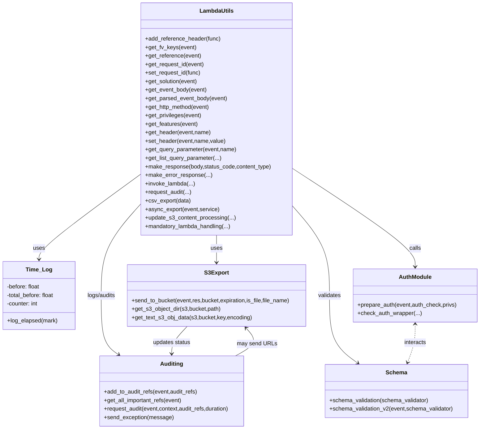
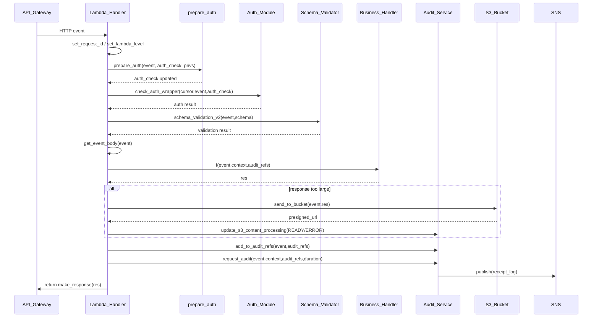

# Diagram: fv_core/fv_framework/python/fv_framework/common/aws/lambdas/__init__.py

> Auto-generated by Obscura crawlers

## Diagram 1

### SVG

<svg id="container" width="1362.5" xmlns="http://www.w3.org/2000/svg" class="classDiagram" height="1208" viewBox="0 0 1362.5 1208" role="graphics-document document" aria-roledescription="class"><g><defs><marker id="container_class-aggregationStart" class="marker aggregation class" refX="18" refY="7" markerWidth="190" markerHeight="240" orient="auto"><path d="M 18,7 L9,13 L1,7 L9,1 Z"></path></marker></defs><defs><marker id="container_class-aggregationEnd" class="marker aggregation class" refX="1" refY="7" markerWidth="20" markerHeight="28" orient="auto"><path d="M 18,7 L9,13 L1,7 L9,1 Z"></path></marker></defs><defs><marker id="container_class-extensionStart" class="marker extension class" refX="18" refY="7" markerWidth="190" markerHeight="240" orient="auto"><path d="M 1,7 L18,13 V 1 Z"></path></marker></defs><defs><marker id="container_class-extensionEnd" class="marker extension class" refX="1" refY="7" markerWidth="20" markerHeight="28" orient="auto"><path d="M 1,1 V 13 L18,7 Z"></path></marker></defs><defs><marker id="container_class-compositionStart" class="marker composition class" refX="18" refY="7" markerWidth="190" markerHeight="240" orient="auto"><path d="M 18,7 L9,13 L1,7 L9,1 Z"></path></marker></defs><defs><marker id="container_class-compositionEnd" class="marker composition class" refX="1" refY="7" markerWidth="20" markerHeight="28" orient="auto"><path d="M 18,7 L9,13 L1,7 L9,1 Z"></path></marker></defs><defs><marker id="container_class-dependencyStart" class="marker dependency class" refX="6" refY="7" markerWidth="190" markerHeight="240" orient="auto"><path d="M 5,7 L9,13 L1,7 L9,1 Z"></path></marker></defs><defs><marker id="container_class-dependencyEnd" class="marker dependency class" refX="13" refY="7" markerWidth="20" markerHeight="28" orient="auto"><path d="M 18,7 L9,13 L14,7 L9,1 Z"></path></marker></defs><defs><marker id="container_class-lollipopStart" class="marker lollipop class" refX="13" refY="7" markerWidth="190" markerHeight="240" orient="auto"><circle stroke="black" fill="transparent" cx="7" cy="7" r="6"></circle></marker></defs><defs><marker id="container_class-lollipopEnd" class="marker lollipop class" refX="1" refY="7" markerWidth="190" markerHeight="240" orient="auto"><circle stroke="black" fill="transparent" cx="7" cy="7" r="6"></circle></marker></defs><g class="root"><g class="clusters"></g><g class="edgePaths"><path d="M402.012,488.384L353.137,523.486C304.262,558.589,206.512,628.795,157.637,669.064C108.762,709.333,108.762,719.667,108.762,724.833L108.762,730" id="id_LambdaUtils_Time_Log_1" class="edge-thickness-normal edge-pattern-solid relation" style=";;;" data-edge="true" data-et="edge" data-id="id_LambdaUtils_Time_Log_1" data-points="W3sieCI6NDAyLjAxMTcxODc1LCJ5Ijo0ODguMzgzNjQ3Nzk4NzQyMX0seyJ4IjoxMDguNzYxNzE4NzUsInkiOjY5OX0seyJ4IjoxMDguNzYxNzE4NzUsInkiOjczNn1d" marker-end="url(#container_class-dependencyEnd)"></path><path d="M615.574,662L615.574,668.167C615.574,674.333,615.574,686.667,615.574,699.5C615.574,712.333,615.574,725.667,615.574,732.333L615.574,739" id="id_LambdaUtils_S3Export_2" class="edge-thickness-normal edge-pattern-solid relation" style=";;;" data-edge="true" data-et="edge" data-id="id_LambdaUtils_S3Export_2" data-points="W3sieCI6NjE1LjU3NDIxODc1LCJ5Ijo2NjJ9LHsieCI6NjE1LjU3NDIxODc1LCJ5Ijo2OTl9LHsieCI6NjE1LjU3NDIxODc1LCJ5Ijo3NDV9XQ==" marker-end="url(#container_class-dependencyEnd)"></path><path d="M829.137,472.849L887.531,510.541C945.924,548.233,1062.712,623.616,1121.106,669.975C1179.5,716.333,1179.5,733.667,1179.5,742.333L1179.5,751" id="id_LambdaUtils_AuthModule_3" class="edge-thickness-normal edge-pattern-solid relation" style=";;;" data-edge="true" data-et="edge" data-id="id_LambdaUtils_AuthModule_3" data-points="W3sieCI6ODI5LjEzNjcxODc1LCJ5Ijo0NzIuODQ5MjU3MDkxNDAwMjZ9LHsieCI6MTE3OS41LCJ5Ijo2OTl9LHsieCI6MTE3OS41LCJ5Ijo3NTd9XQ==" marker-end="url(#container_class-dependencyEnd)"></path><path d="M829.137,576.991L847.083,597.326C865.029,617.661,900.921,658.33,918.867,700.832C936.813,743.333,936.813,787.667,936.813,832C936.813,876.333,936.813,920.667,950.222,952.418C963.631,984.17,990.45,1003.341,1003.859,1012.926L1017.268,1022.511" id="id_LambdaUtils_Schema_4" class="edge-thickness-normal edge-pattern-solid relation" style=";;;" data-edge="true" data-et="edge" data-id="id_LambdaUtils_Schema_4" data-points="W3sieCI6ODI5LjEzNjcxODc1LCJ5Ijo1NzYuOTkwOTI4NjU3NDE3fSx7IngiOjkzNi44MTI1LCJ5Ijo2OTl9LHsieCI6OTM2LjgxMjUsInkiOjgzMn0seyJ4Ijo5MzYuODEyNSwieSI6OTY1fSx7IngiOjEwMjIuMTQ5NjAwNzU4MjcyMSwieSI6MTAyNn1d" marker-end="url(#container_class-dependencyEnd)"></path><path d="M402.012,570.708L382.639,592.09C363.266,613.472,324.52,656.236,305.146,699.785C285.773,743.333,285.773,787.667,285.773,832C285.773,876.333,285.773,920.667,294.093,948.441C302.413,976.215,319.052,987.431,327.371,993.039L335.691,998.646" id="id_LambdaUtils_Auditing_5" class="edge-thickness-normal edge-pattern-solid relation" style=";;;" data-edge="true" data-et="edge" data-id="id_LambdaUtils_Auditing_5" data-points="W3sieCI6NDAyLjAxMTcxODc1LCJ5Ijo1NzAuNzA4MjA0NTI2ODgwNX0seyJ4IjoyODUuNzczNDM3NSwieSI6Njk5fSx7IngiOjI4NS43NzM0Mzc1LCJ5Ijo4MzJ9LHsieCI6Mjg1Ljc3MzQzNzUsInkiOjk2NX0seyJ4IjozNDAuNjY2MDg3NDMxMDY2MiwieSI6MTAwMn1d" marker-end="url(#container_class-dependencyEnd)"></path><path d="M670.522,1002L681.919,995.833C693.317,989.667,716.113,977.333,721.081,964.233C726.049,951.133,713.19,937.266,706.761,930.333L700.331,923.399" id="id_Auditing_S3Export_6" class="edge-thickness-normal edge-pattern-solid relation" style=";;;" data-edge="true" data-et="edge" data-id="id_Auditing_S3Export_6" data-points="W3sieCI6NjcwLjUyMTU0MTgxOTg1MjksInkiOjEwMDJ9LHsieCI6NzM4LjkwODIwMzEyNSwieSI6OTY1fSx7IngiOjY5Ni4yNTEzMzYzNDg2ODQyLCJ5Ijo5MTl9XQ==" marker-end="url(#container_class-dependencyEnd)"></path><path d="M531.823,919L524.443,926.667C517.062,934.333,502.302,949.667,494.921,962.5C487.541,975.333,487.541,985.667,487.541,990.833L487.541,996" id="id_S3Export_Auditing_7" class="edge-thickness-normal edge-pattern-solid relation" style=";;;" data-edge="true" data-et="edge" data-id="id_S3Export_Auditing_7" data-points="W3sieCI6NTMxLjgyMzE3NjEwNDMyMzQsInkiOjkxOX0seyJ4Ijo0ODcuNTQxMDE1NjI1LCJ5Ijo5NjV9LHsieCI6NDg3LjU0MTAxNTYyNSwieSI6MTAwMn1d" marker-end="url(#container_class-dependencyEnd)"></path><path d="M1179.5,913L1179.5,921.667C1179.5,930.333,1179.5,947.667,1175.94,965.567C1172.381,983.467,1165.262,1001.934,1161.702,1011.168L1158.143,1020.402" id="id_AuthModule_Schema_8" class="edge-thickness-normal edge-pattern-dashed relation" style=";;;" data-edge="true" data-et="edge" data-id="id_AuthModule_Schema_8" data-points="W3sieCI6MTE3OS41LCJ5Ijo5MDd9LHsieCI6MTE3OS41LCJ5Ijo5NjV9LHsieCI6MTE1NS45ODQ2MTkxNDA2MjUsInkiOjEwMjZ9XQ==" marker-start="url(#container_class-dependencyStart)" marker-end="url(#container_class-dependencyEnd)"></path></g><g class="edgeLabels"><g class="edgeLabel" transform="translate(108.76171875, 699)"><g class="label" data-id="id_LambdaUtils_Time_Log_1" transform="translate(-16.4921875, -12)"><foreignObject width="32.984375" height="24">

uses

</foreignObject></g></g><g class="edgeLabel" transform="translate(615.57421875, 699)"><g class="label" data-id="id_LambdaUtils_S3Export_2" transform="translate(-16.4921875, -12)"><foreignObject width="32.984375" height="24">

uses

</foreignObject></g></g><g class="edgeLabel" transform="translate(1179.5, 699)"><g class="label" data-id="id_LambdaUtils_AuthModule_3" transform="translate(-16.4453125, -12)"><foreignObject width="32.890625" height="24">

calls

</foreignObject></g></g><g class="edgeLabel" transform="translate(936.8125, 832)"><g class="label" data-id="id_LambdaUtils_Schema_4" transform="translate(-32.6875, -12)"><foreignObject width="65.375" height="24">

validates

</foreignObject></g></g><g class="edgeLabel" transform="translate(285.7734375, 832)"><g class="label" data-id="id_LambdaUtils_Auditing_5" transform="translate(-41.25, -12)"><foreignObject width="82.5" height="24">

logs/audits

</foreignObject></g></g><g class="edgeLabel" transform="translate(732.30303, 968.57367)"><g class="label" data-id="id_Auditing_S3Export_6" transform="translate(-54.5703125, -12)"><foreignObject width="109.140625" height="24">

may send URLs

</foreignObject></g></g><g class="edgeLabel" transform="translate(487.541015625, 965)"><g class="label" data-id="id_S3Export_Auditing_7" transform="translate(-53.734375, -12)"><foreignObject width="107.46875" height="24">

updates status

</foreignObject></g></g><g class="edgeLabel" transform="translate(1179.5, 965)"><g class="label" data-id="id_AuthModule_Schema_8" transform="translate(-31.6875, -12)"><foreignObject width="63.375" height="24">

interacts

</foreignObject></g></g></g><g class="nodes"><g class="node default" id="classId-LambdaUtils-0" transform="translate(615.57421875, 335)"><g class="basic label-container"><path d="M-213.5625 -327 L213.5625 -327 L213.5625 327 L-213.5625 327" stroke="none" stroke-width="0" fill="#ECECFF" style=""></path><path d="M-213.5625 -327 C-114.82375502760162 -327, -16.08501005520324 -327, 213.5625 -327 M-213.5625 -327 C-82.7001835855327 -327, 48.1621328289346 -327, 213.5625 -327 M213.5625 -327 C213.5625 -68.42220968870816, 213.5625 190.15558062258367, 213.5625 327 M213.5625 -327 C213.5625 -93.49038638621215, 213.5625 140.0192272275757, 213.5625 327 M213.5625 327 C63.2373811617326 327, -87.0877376765348 327, -213.5625 327 M213.5625 327 C81.27991183477354 327, -51.002676330452914 327, -213.5625 327 M-213.5625 327 C-213.5625 166.8265450935123, -213.5625 6.653090187024588, -213.5625 -327 M-213.5625 327 C-213.5625 168.19770089613232, -213.5625 9.395401792264636, -213.5625 -327" stroke="#9370DB" stroke-width="1.3" fill="none" stroke-dasharray="0 0" style=""></path></g><g class="annotation-group text" transform="translate(0, -303)"></g><g class="label-group text" transform="translate(-45.921875, -303)"><g class="label" style="font-weight: bolder" transform="translate(0,-12)"><foreignObject width="91.84375" height="24">

LambdaUtils

</foreignObject></g></g><g class="members-group text" transform="translate(-201.5625, -255)"></g><g class="methods-group text" transform="translate(-201.5625, -225)"><g class="label" style="" transform="translate(0,-12)"><foreignObject width="213.25" height="24">

+add_reference_header(func)

</foreignObject></g><g class="label" style="" transform="translate(0,12)"><foreignObject width="142.265625" height="24">

+get_fv_keys(event)

</foreignObject></g><g class="label" style="" transform="translate(0,36)"><foreignObject width="157.75" height="24">

+get_reference(event)

</foreignObject></g><g class="label" style="" transform="translate(0,60)"><foreignObject width="167.234375" height="24">

+get_request_id(event)

</foreignObject></g><g class="label" style="" transform="translate(0,84)"><foreignObject width="158.015625" height="24">

+set_request_id(func)

</foreignObject></g><g class="label" style="" transform="translate(0,108)"><foreignObject width="149.40625" height="24">

+get_solution(event)

</foreignObject></g><g class="label" style="" transform="translate(0,132)"><foreignObject width="174.203125" height="24">

+get_event_body(event)

</foreignObject></g><g class="label" style="" transform="translate(0,156)"><foreignObject width="232.265625" height="24">

+get_parsed_event_body(event)

</foreignObject></g><g class="label" style="" transform="translate(0,180)"><foreignObject width="184.5" height="24">

+get_http_method(event)

</foreignObject></g><g class="label" style="" transform="translate(0,204)"><foreignObject width="159.734375" height="24">

+get_privileges(event)

</foreignObject></g><g class="label" style="" transform="translate(0,228)"><foreignObject width="148.703125" height="24">

+get_features(event)

</foreignObject></g><g class="label" style="" transform="translate(0,252)"><foreignObject width="185.09375" height="24">

+get_header(event,name)

</foreignObject></g><g class="label" style="" transform="translate(0,276)"><foreignObject width="226.421875" height="24">

+set_header(event,name,value)

</foreignObject></g><g class="label" style="" transform="translate(0,300)"><foreignObject width="258.390625" height="24">

+get_query_parameter(event,name)

</foreignObject></g><g class="label" style="" transform="translate(0,324)"><foreignObject width="215.765625" height="24">

+get_list_query_parameter(...)

</foreignObject></g><g class="label" style="" transform="translate(0,348)"><foreignObject width="357.203125" height="24">

+make_response(body,status_code,content_type)

</foreignObject></g><g class="label" style="" transform="translate(0,372)"><foreignObject width="186.203125" height="24">

+make_error_response(...)

</foreignObject></g><g class="label" style="" transform="translate(0,396)"><foreignObject width="140.21875" height="24">

+invoke_lambda(...)

</foreignObject></g><g class="label" style="" transform="translate(0,420)"><foreignObject width="131.015625" height="24">

+request_audit(...)

</foreignObject></g><g class="label" style="" transform="translate(0,444)"><foreignObject width="128.375" height="24">

+csv_export(data)

</foreignObject></g><g class="label" style="" transform="translate(0,468)"><foreignObject width="209" height="24">

+async_export(event,service)

</foreignObject></g><g class="label" style="" transform="translate(0,492)"><foreignObject width="253.71875" height="24">

+update_s3_content_processing(...)

</foreignObject></g><g class="label" style="" transform="translate(0,516)"><foreignObject width="243.59375" height="24">

+mandatory_lambda_handling(...)

</foreignObject></g></g><g class="divider" style=""><path d="M-213.5625 -279 C-44.859567941552854 -279, 123.84336411689429 -279, 213.5625 -279 M-213.5625 -279 C-115.10898683925343 -279, -16.655473678506866 -279, 213.5625 -279" stroke="#9370DB" stroke-width="1.3" fill="none" stroke-dasharray="0 0" style=""></path></g><g class="divider" style=""><path d="M-213.5625 -255 C-46.24054845074326 -255, 121.08140309851348 -255, 213.5625 -255 M-213.5625 -255 C-61.46749502132269 -255, 90.62750995735462 -255, 213.5625 -255" stroke="#9370DB" stroke-width="1.3" fill="none" stroke-dasharray="0 0" style=""></path></g></g><g class="node default" id="classId-Time_Log-1" transform="translate(108.76171875, 832)"><g class="basic label-container"><path d="M-100.76171875 -96 L100.76171875 -96 L100.76171875 96 L-100.76171875 96" stroke="none" stroke-width="0" fill="#ECECFF" style=""></path><path d="M-100.76171875 -96 C-44.44478585802797 -96, 11.87214703394406 -96, 100.76171875 -96 M-100.76171875 -96 C-25.73569432368319 -96, 49.29033010263362 -96, 100.76171875 -96 M100.76171875 -96 C100.76171875 -29.09997849642886, 100.76171875 37.80004300714228, 100.76171875 96 M100.76171875 -96 C100.76171875 -30.332780872784895, 100.76171875 35.33443825443021, 100.76171875 96 M100.76171875 96 C54.90100138265061 96, 9.040284015301225 96, -100.76171875 96 M100.76171875 96 C59.570337807779 96, 18.378956865557996 96, -100.76171875 96 M-100.76171875 96 C-100.76171875 28.530955273755055, -100.76171875 -38.93808945248989, -100.76171875 -96 M-100.76171875 96 C-100.76171875 42.261930239322496, -100.76171875 -11.476139521355009, -100.76171875 -96" stroke="#9370DB" stroke-width="1.3" fill="none" stroke-dasharray="0 0" style=""></path></g><g class="annotation-group text" transform="translate(0, -72)"></g><g class="label-group text" transform="translate(-34.7421875, -72)"><g class="label" style="font-weight: bolder" transform="translate(0,-12)"><foreignObject width="69.484375" height="24">

Time_Log

</foreignObject></g></g><g class="members-group text" transform="translate(-88.76171875, -24)"><g class="label" style="" transform="translate(0,-12)"><foreignObject width="94.78125" height="24">

-before: float

</foreignObject></g><g class="label" style="" transform="translate(0,12)"><foreignObject width="136.796875" height="24">

-total_before: float

</foreignObject></g><g class="label" style="" transform="translate(0,36)"><foreignObject width="90.15625" height="24">

-counter: int

</foreignObject></g></g><g class="methods-group text" transform="translate(-88.76171875, 72)"><g class="label" style="" transform="translate(0,-12)"><foreignObject width="142.78125" height="24">

+log_elapsed(mark)

</foreignObject></g></g><g class="divider" style=""><path d="M-100.76171875 -48 C-48.754501124500955 -48, 3.2527165009980905 -48, 100.76171875 -48 M-100.76171875 -48 C-31.74725795587476 -48, 37.26720283825048 -48, 100.76171875 -48" stroke="#9370DB" stroke-width="1.3" fill="none" stroke-dasharray="0 0" style=""></path></g><g class="divider" style=""><path d="M-100.76171875 48 C-37.766618065004955 48, 25.22848261999009 48, 100.76171875 48 M-100.76171875 48 C-23.63699511360379 48, 53.48772852279242 48, 100.76171875 48" stroke="#9370DB" stroke-width="1.3" fill="none" stroke-dasharray="0 0" style=""></path></g></g><g class="node default" id="classId-S3Export-2" transform="translate(615.57421875, 832)"><g class="basic label-container"><path d="M-253.55078125 -87 L253.55078125 -87 L253.55078125 87 L-253.55078125 87" stroke="none" stroke-width="0" fill="#ECECFF" style=""></path><path d="M-253.55078125 -87 C-72.58176719676356 -87, 108.38724685647287 -87, 253.55078125 -87 M-253.55078125 -87 C-144.3015189828124 -87, -35.05225671562479 -87, 253.55078125 -87 M253.55078125 -87 C253.55078125 -28.11566528032798, 253.55078125 30.768669439344038, 253.55078125 87 M253.55078125 -87 C253.55078125 -33.077268093697846, 253.55078125 20.845463812604308, 253.55078125 87 M253.55078125 87 C71.49311539892977 87, -110.56455045214045 87, -253.55078125 87 M253.55078125 87 C83.1295385889565 87, -87.29170407208699 87, -253.55078125 87 M-253.55078125 87 C-253.55078125 36.383480686974664, -253.55078125 -14.233038626050671, -253.55078125 -87 M-253.55078125 87 C-253.55078125 34.19249654743497, -253.55078125 -18.61500690513006, -253.55078125 -87" stroke="#9370DB" stroke-width="1.3" fill="none" stroke-dasharray="0 0" style=""></path></g><g class="annotation-group text" transform="translate(0, -63)"></g><g class="label-group text" transform="translate(-32.7890625, -63)"><g class="label" style="font-weight: bolder" transform="translate(0,-12)"><foreignObject width="65.578125" height="24">

S3Export

</foreignObject></g></g><g class="members-group text" transform="translate(-241.55078125, -15)"></g><g class="methods-group text" transform="translate(-241.55078125, 15)"><g class="label" style="" transform="translate(0,-12)"><foreignObject width="450.3125" height="24">

+send_to_bucket(event,res,bucket,expiration,is_file,file_name)

</foreignObject></g><g class="label" style="" transform="translate(0,12)"><foreignObject width="251.515625" height="24">

+get_s3_object_dir(s3,bucket,path)

</foreignObject></g><g class="label" style="" transform="translate(0,36)"><foreignObject width="338.359375" height="24">

+get_text_s3_obj_data(s3,bucket,key,encoding)

</foreignObject></g></g><g class="divider" style=""><path d="M-253.55078125 -39 C-128.86355197007418 -39, -4.176322690148396 -39, 253.55078125 -39 M-253.55078125 -39 C-104.21936159020882 -39, 45.11205806958236 -39, 253.55078125 -39" stroke="#9370DB" stroke-width="1.3" fill="none" stroke-dasharray="0 0" style=""></path></g><g class="divider" style=""><path d="M-253.55078125 -15 C-113.54869787250414 -15, 26.45338550499173 -15, 253.55078125 -15 M-253.55078125 -15 C-90.01934933374315 -15, 73.5120825825137 -15, 253.55078125 -15" stroke="#9370DB" stroke-width="1.3" fill="none" stroke-dasharray="0 0" style=""></path></g></g><g class="node default" id="classId-AuthModule-3" transform="translate(1179.5, 832)"><g class="basic label-container"><path d="M-175 -75 L175 -75 L175 75 L-175 75" stroke="none" stroke-width="0" fill="#ECECFF" style=""></path><path d="M-175 -75 C-60.22632797762114 -75, 54.54734404475772 -75, 175 -75 M-175 -75 C-45.07525147228054 -75, 84.84949705543892 -75, 175 -75 M175 -75 C175 -40.2095648247668, 175 -5.419129649533602, 175 75 M175 -75 C175 -24.334130415107822, 175 26.331739169784356, 175 75 M175 75 C73.7625318966712 75, -27.47493620665759 75, -175 75 M175 75 C61.02974637475086 75, -52.940507250498285 75, -175 75 M-175 75 C-175 16.502925766058638, -175 -41.994148467882724, -175 -75 M-175 75 C-175 44.486020236575534, -175 13.972040473151068, -175 -75" stroke="#9370DB" stroke-width="1.3" fill="none" stroke-dasharray="0 0" style=""></path></g><g class="annotation-group text" transform="translate(0, -51)"></g><g class="label-group text" transform="translate(-44.09375, -51)"><g class="label" style="font-weight: bolder" transform="translate(0,-12)"><foreignObject width="88.1875" height="24">

AuthModule

</foreignObject></g></g><g class="members-group text" transform="translate(-163, -3)"></g><g class="methods-group text" transform="translate(-163, 27)"><g class="label" style="" transform="translate(0,-12)"><foreignObject width="281.90625" height="24">

+prepare_auth(event,auth_check,privs)

</foreignObject></g><g class="label" style="" transform="translate(0,12)"><foreignObject width="180.328125" height="24">

+check_auth_wrapper(...)

</foreignObject></g></g><g class="divider" style=""><path d="M-175 -27 C-103.9637476528223 -27, -32.92749530564461 -27, 175 -27 M-175 -27 C-80.87014395416683 -27, 13.25971209166633 -27, 175 -27" stroke="#9370DB" stroke-width="1.3" fill="none" stroke-dasharray="0 0" style=""></path></g><g class="divider" style=""><path d="M-175 -3 C-65.51515271556758 -3, 43.96969456886484 -3, 175 -3 M-175 -3 C-37.973909257293656 -3, 99.05218148541269 -3, 175 -3" stroke="#9370DB" stroke-width="1.3" fill="none" stroke-dasharray="0 0" style=""></path></g></g><g class="node default" id="classId-Schema-4" transform="translate(1127.072265625, 1101)"><g class="basic label-container"><path d="M-201.49609375 -75 L201.49609375 -75 L201.49609375 75 L-201.49609375 75" stroke="none" stroke-width="0" fill="#ECECFF" style=""></path><path d="M-201.49609375 -75 C-62.04503419824732 -75, 77.40602535350536 -75, 201.49609375 -75 M-201.49609375 -75 C-116.63554655255395 -75, -31.774999355107894 -75, 201.49609375 -75 M201.49609375 -75 C201.49609375 -37.54575205005271, 201.49609375 -0.09150410010542487, 201.49609375 75 M201.49609375 -75 C201.49609375 -35.55755172158518, 201.49609375 3.884896556829645, 201.49609375 75 M201.49609375 75 C67.12821624969658 75, -67.23966125060684 75, -201.49609375 75 M201.49609375 75 C89.62725266707007 75, -22.241588415859866 75, -201.49609375 75 M-201.49609375 75 C-201.49609375 22.744316495170672, -201.49609375 -29.511367009658656, -201.49609375 -75 M-201.49609375 75 C-201.49609375 21.5924292669038, -201.49609375 -31.8151414661924, -201.49609375 -75" stroke="#9370DB" stroke-width="1.3" fill="none" stroke-dasharray="0 0" style=""></path></g><g class="annotation-group text" transform="translate(0, -51)"></g><g class="label-group text" transform="translate(-28.5859375, -51)"><g class="label" style="font-weight: bolder" transform="translate(0,-12)"><foreignObject width="57.171875" height="24">

Schema

</foreignObject></g></g><g class="members-group text" transform="translate(-189.49609375, -3)"></g><g class="methods-group text" transform="translate(-189.49609375, 27)"><g class="label" style="" transform="translate(0,-12)"><foreignObject width="282.625" height="24">

+schema_validation(schema_validator)

</foreignObject></g><g class="label" style="" transform="translate(0,12)"><foreignObject width="350.40625" height="24">

+schema_validation_v2(event,schema_validator)

</foreignObject></g></g><g class="divider" style=""><path d="M-201.49609375 -27 C-52.46997380400592 -27, 96.55614614198817 -27, 201.49609375 -27 M-201.49609375 -27 C-101.28389160323913 -27, -1.0716894564782535 -27, 201.49609375 -27" stroke="#9370DB" stroke-width="1.3" fill="none" stroke-dasharray="0 0" style=""></path></g><g class="divider" style=""><path d="M-201.49609375 -3 C-91.00148940069653 -3, 19.493114948606944 -3, 201.49609375 -3 M-201.49609375 -3 C-78.28618250033125 -3, 44.9237287493375 -3, 201.49609375 -3" stroke="#9370DB" stroke-width="1.3" fill="none" stroke-dasharray="0 0" style=""></path></g></g><g class="node default" id="classId-Auditing-5" transform="translate(487.541015625, 1101)"><g class="basic label-container"><path d="M-207.57421875 -99 L207.57421875 -99 L207.57421875 99 L-207.57421875 99" stroke="none" stroke-width="0" fill="#ECECFF" style=""></path><path d="M-207.57421875 -99 C-109.53211854723412 -99, -11.49001834446824 -99, 207.57421875 -99 M-207.57421875 -99 C-107.33262337131005 -99, -7.0910279926200985 -99, 207.57421875 -99 M207.57421875 -99 C207.57421875 -49.80451511425567, 207.57421875 -0.6090302285113438, 207.57421875 99 M207.57421875 -99 C207.57421875 -29.06109295969746, 207.57421875 40.87781408060508, 207.57421875 99 M207.57421875 99 C101.4105519630704 99, -4.7531148238591925 99, -207.57421875 99 M207.57421875 99 C93.99792095818641 99, -19.578376833627175 99, -207.57421875 99 M-207.57421875 99 C-207.57421875 42.84117297211592, -207.57421875 -13.317654055768159, -207.57421875 -99 M-207.57421875 99 C-207.57421875 35.143010457368696, -207.57421875 -28.713979085262608, -207.57421875 -99" stroke="#9370DB" stroke-width="1.3" fill="none" stroke-dasharray="0 0" style=""></path></g><g class="annotation-group text" transform="translate(0, -75)"></g><g class="label-group text" transform="translate(-30.7265625, -75)"><g class="label" style="font-weight: bolder" transform="translate(0,-12)"><foreignObject width="61.453125" height="24">

Auditing

</foreignObject></g></g><g class="members-group text" transform="translate(-195.57421875, -27)"></g><g class="methods-group text" transform="translate(-195.57421875, 3)"><g class="label" style="" transform="translate(0,-12)"><foreignObject width="267.484375" height="24">

+add_to_audit_refs(event,audit_refs)

</foreignObject></g><g class="label" style="" transform="translate(0,12)"><foreignObject width="223.75" height="24">

+get_all_important_refs(event)

</foreignObject></g><g class="label" style="" transform="translate(0,36)"><foreignObject width="360.421875" height="24">

+request_audit(event,context,audit_refs,duration)

</foreignObject></g><g class="label" style="" transform="translate(0,60)"><foreignObject width="194.625" height="24">

+send_exception(message)

</foreignObject></g></g><g class="divider" style=""><path d="M-207.57421875 -51 C-81.29328520398757 -51, 44.98764834202487 -51, 207.57421875 -51 M-207.57421875 -51 C-85.46143964510661 -51, 36.65133945978678 -51, 207.57421875 -51" stroke="#9370DB" stroke-width="1.3" fill="none" stroke-dasharray="0 0" style=""></path></g><g class="divider" style=""><path d="M-207.57421875 -27 C-61.375624981351166 -27, 84.82296878729767 -27, 207.57421875 -27 M-207.57421875 -27 C-56.35821996258812 -27, 94.85777882482375 -27, 207.57421875 -27" stroke="#9370DB" stroke-width="1.3" fill="none" stroke-dasharray="0 0" style=""></path></g></g></g></g></g></svg>

## Diagram 2

### SVG

<svg id="container" width="2069" xmlns="http://www.w3.org/2000/svg" height="1150" viewBox="-50 -10 2069 1150" role="graphics-document document" aria-roledescription="sequence"><g><rect x="1819" y="1064" fill="#eaeaea" stroke="#666" width="150" height="65" name="SNS" rx="3" ry="3" class="actor actor-bottom"></rect><text x="1894" y="1096.5" dominant-baseline="central" alignment-baseline="central" class="actor actor-box" style="text-anchor: middle; font-size: 16px; font-weight: 400;"><tspan x="1894" dy="0">SNS</tspan></text></g><g><rect x="1619" y="1064" fill="#eaeaea" stroke="#666" width="150" height="65" name="S3" rx="3" ry="3" class="actor actor-bottom"></rect><text x="1694" y="1096.5" dominant-baseline="central" alignment-baseline="central" class="actor actor-box" style="text-anchor: middle; font-size: 16px; font-weight: 400;"><tspan x="1694" dy="0">S3_Bucket</tspan></text></g><g><rect x="1419" y="1064" fill="#eaeaea" stroke="#666" width="150" height="65" name="Audit" rx="3" ry="3" class="actor actor-bottom"></rect><text x="1494" y="1096.5" dominant-baseline="central" alignment-baseline="central" class="actor actor-box" style="text-anchor: middle; font-size: 16px; font-weight: 400;"><tspan x="1494" dy="0">Audit_Service</tspan></text></g><g><rect x="1218" y="1064" fill="#eaeaea" stroke="#666" width="151" height="65" name="Handler" rx="3" ry="3" class="actor actor-bottom"></rect><text x="1293.5" y="1096.5" dominant-baseline="central" alignment-baseline="central" class="actor actor-box" style="text-anchor: middle; font-size: 16px; font-weight: 400;"><tspan x="1293.5" dy="0">Business_Handler</tspan></text></g><g><rect x="1017" y="1064" fill="#eaeaea" stroke="#666" width="151" height="65" name="SchemaV" rx="3" ry="3" class="actor actor-bottom"></rect><text x="1092.5" y="1096.5" dominant-baseline="central" alignment-baseline="central" class="actor actor-box" style="text-anchor: middle; font-size: 16px; font-weight: 400;"><tspan x="1092.5" dy="0">Schema_Validator</tspan></text></g><g><rect x="817" y="1064" fill="#eaeaea" stroke="#666" width="150" height="65" name="Auth" rx="3" ry="3" class="actor actor-bottom"></rect><text x="892" y="1096.5" dominant-baseline="central" alignment-baseline="central" class="actor actor-box" style="text-anchor: middle; font-size: 16px; font-weight: 400;"><tspan x="892" dy="0">Auth_Module</tspan></text></g><g><rect x="617" y="1064" fill="#eaeaea" stroke="#666" width="150" height="65" name="Prep" rx="3" ry="3" class="actor actor-bottom"></rect><text x="692" y="1096.5" dominant-baseline="central" alignment-baseline="central" class="actor actor-box" style="text-anchor: middle; font-size: 16px; font-weight: 400;"><tspan x="692" dy="0">prepare_auth</tspan></text></g><g><rect x="265" y="1064" fill="#eaeaea" stroke="#666" width="150" height="65" name="Lambda" rx="3" ry="3" class="actor actor-bottom"></rect><text x="340" y="1096.5" dominant-baseline="central" alignment-baseline="central" class="actor actor-box" style="text-anchor: middle; font-size: 16px; font-weight: 400;"><tspan x="340" dy="0">Lambda_Handler</tspan></text></g><g><rect x="0" y="1064" fill="#eaeaea" stroke="#666" width="150" height="65" name="API" rx="3" ry="3" class="actor actor-bottom"></rect><text x="75" y="1096.5" dominant-baseline="central" alignment-baseline="central" class="actor actor-box" style="text-anchor: middle; font-size: 16px; font-weight: 400;"><tspan x="75" dy="0">API_Gateway</tspan></text></g><g><line id="actor8" x1="1894" y1="65" x2="1894" y2="1064" class="actor-line 200" stroke-width="0.5px" stroke="#999" name="SNS"></line><g id="root-8"><rect x="1819" y="0" fill="#eaeaea" stroke="#666" width="150" height="65" name="SNS" rx="3" ry="3" class="actor actor-top"></rect><text x="1894" y="32.5" dominant-baseline="central" alignment-baseline="central" class="actor actor-box" style="text-anchor: middle; font-size: 16px; font-weight: 400;"><tspan x="1894" dy="0">SNS</tspan></text></g></g><g><line id="actor7" x1="1694" y1="65" x2="1694" y2="1064" class="actor-line 200" stroke-width="0.5px" stroke="#999" name="S3"></line><g id="root-7"><rect x="1619" y="0" fill="#eaeaea" stroke="#666" width="150" height="65" name="S3" rx="3" ry="3" class="actor actor-top"></rect><text x="1694" y="32.5" dominant-baseline="central" alignment-baseline="central" class="actor actor-box" style="text-anchor: middle; font-size: 16px; font-weight: 400;"><tspan x="1694" dy="0">S3_Bucket</tspan></text></g></g><g><line id="actor6" x1="1494" y1="65" x2="1494" y2="1064" class="actor-line 200" stroke-width="0.5px" stroke="#999" name="Audit"></line><g id="root-6"><rect x="1419" y="0" fill="#eaeaea" stroke="#666" width="150" height="65" name="Audit" rx="3" ry="3" class="actor actor-top"></rect><text x="1494" y="32.5" dominant-baseline="central" alignment-baseline="central" class="actor actor-box" style="text-anchor: middle; font-size: 16px; font-weight: 400;"><tspan x="1494" dy="0">Audit_Service</tspan></text></g></g><g><line id="actor5" x1="1293.5" y1="65" x2="1293.5" y2="1064" class="actor-line 200" stroke-width="0.5px" stroke="#999" name="Handler"></line><g id="root-5"><rect x="1218" y="0" fill="#eaeaea" stroke="#666" width="151" height="65" name="Handler" rx="3" ry="3" class="actor actor-top"></rect><text x="1293.5" y="32.5" dominant-baseline="central" alignment-baseline="central" class="actor actor-box" style="text-anchor: middle; font-size: 16px; font-weight: 400;"><tspan x="1293.5" dy="0">Business_Handler</tspan></text></g></g><g><line id="actor4" x1="1092.5" y1="65" x2="1092.5" y2="1064" class="actor-line 200" stroke-width="0.5px" stroke="#999" name="SchemaV"></line><g id="root-4"><rect x="1017" y="0" fill="#eaeaea" stroke="#666" width="151" height="65" name="SchemaV" rx="3" ry="3" class="actor actor-top"></rect><text x="1092.5" y="32.5" dominant-baseline="central" alignment-baseline="central" class="actor actor-box" style="text-anchor: middle; font-size: 16px; font-weight: 400;"><tspan x="1092.5" dy="0">Schema_Validator</tspan></text></g></g><g><line id="actor3" x1="892" y1="65" x2="892" y2="1064" class="actor-line 200" stroke-width="0.5px" stroke="#999" name="Auth"></line><g id="root-3"><rect x="817" y="0" fill="#eaeaea" stroke="#666" width="150" height="65" name="Auth" rx="3" ry="3" class="actor actor-top"></rect><text x="892" y="32.5" dominant-baseline="central" alignment-baseline="central" class="actor actor-box" style="text-anchor: middle; font-size: 16px; font-weight: 400;"><tspan x="892" dy="0">Auth_Module</tspan></text></g></g><g><line id="actor2" x1="692" y1="65" x2="692" y2="1064" class="actor-line 200" stroke-width="0.5px" stroke="#999" name="Prep"></line><g id="root-2"><rect x="617" y="0" fill="#eaeaea" stroke="#666" width="150" height="65" name="Prep" rx="3" ry="3" class="actor actor-top"></rect><text x="692" y="32.5" dominant-baseline="central" alignment-baseline="central" class="actor actor-box" style="text-anchor: middle; font-size: 16px; font-weight: 400;"><tspan x="692" dy="0">prepare_auth</tspan></text></g></g><g><line id="actor1" x1="340" y1="65" x2="340" y2="1064" class="actor-line 200" stroke-width="0.5px" stroke="#999" name="Lambda"></line><g id="root-1"><rect x="265" y="0" fill="#eaeaea" stroke="#666" width="150" height="65" name="Lambda" rx="3" ry="3" class="actor actor-top"></rect><text x="340" y="32.5" dominant-baseline="central" alignment-baseline="central" class="actor actor-box" style="text-anchor: middle; font-size: 16px; font-weight: 400;"><tspan x="340" dy="0">Lambda_Handler</tspan></text></g></g><g><line id="actor0" x1="75" y1="65" x2="75" y2="1064" class="actor-line 200" stroke-width="0.5px" stroke="#999" name="API"></line><g id="root-0"><rect x="0" y="0" fill="#eaeaea" stroke="#666" width="150" height="65" name="API" rx="3" ry="3" class="actor actor-top"></rect><text x="75" y="32.5" dominant-baseline="central" alignment-baseline="central" class="actor actor-box" style="text-anchor: middle; font-size: 16px; font-weight: 400;"><tspan x="75" dy="0">API_Gateway</tspan></text></g></g><g></g><defs><symbol id="computer" width="24" height="24"><path transform="scale(.5)" d="M2 2v13h20v-13h-20zm18 11h-16v-9h16v9zm-10.228 6l.466-1h3.524l.467 1h-4.457zm14.228 3h-24l2-6h2.104l-1.33 4h18.45l-1.297-4h2.073l2 6zm-5-10h-14v-7h14v7z"></path></symbol></defs><defs><symbol id="database" fill-rule="evenodd" clip-rule="evenodd"><path transform="scale(.5)" d="M12.258.001l.256.004.255.005.253.008.251.01.249.012.247.015.246.016.242.019.241.02.239.023.236.024.233.027.231.028.229.031.225.032.223.034.22.036.217.038.214.04.211.041.208.043.205.045.201.046.198.048.194.05.191.051.187.053.183.054.18.056.175.057.172.059.168.06.163.061.16.063.155.064.15.066.074.033.073.033.071.034.07.034.069.035.068.035.067.035.066.035.064.036.064.036.062.036.06.036.06.037.058.037.058.037.055.038.055.038.053.038.052.038.051.039.05.039.048.039.047.039.045.04.044.04.043.04.041.04.04.041.039.041.037.041.036.041.034.041.033.042.032.042.03.042.029.042.027.042.026.043.024.043.023.043.021.043.02.043.018.044.017.043.015.044.013.044.012.044.011.045.009.044.007.045.006.045.004.045.002.045.001.045v17l-.001.045-.002.045-.004.045-.006.045-.007.045-.009.044-.011.045-.012.044-.013.044-.015.044-.017.043-.018.044-.02.043-.021.043-.023.043-.024.043-.026.043-.027.042-.029.042-.03.042-.032.042-.033.042-.034.041-.036.041-.037.041-.039.041-.04.041-.041.04-.043.04-.044.04-.045.04-.047.039-.048.039-.05.039-.051.039-.052.038-.053.038-.055.038-.055.038-.058.037-.058.037-.06.037-.06.036-.062.036-.064.036-.064.036-.066.035-.067.035-.068.035-.069.035-.07.034-.071.034-.073.033-.074.033-.15.066-.155.064-.16.063-.163.061-.168.06-.172.059-.175.057-.18.056-.183.054-.187.053-.191.051-.194.05-.198.048-.201.046-.205.045-.208.043-.211.041-.214.04-.217.038-.22.036-.223.034-.225.032-.229.031-.231.028-.233.027-.236.024-.239.023-.241.02-.242.019-.246.016-.247.015-.249.012-.251.01-.253.008-.255.005-.256.004-.258.001-.258-.001-.256-.004-.255-.005-.253-.008-.251-.01-.249-.012-.247-.015-.245-.016-.243-.019-.241-.02-.238-.023-.236-.024-.234-.027-.231-.028-.228-.031-.226-.032-.223-.034-.22-.036-.217-.038-.214-.04-.211-.041-.208-.043-.204-.045-.201-.046-.198-.048-.195-.05-.19-.051-.187-.053-.184-.054-.179-.056-.176-.057-.172-.059-.167-.06-.164-.061-.159-.063-.155-.064-.151-.066-.074-.033-.072-.033-.072-.034-.07-.034-.069-.035-.068-.035-.067-.035-.066-.035-.064-.036-.063-.036-.062-.036-.061-.036-.06-.037-.058-.037-.057-.037-.056-.038-.055-.038-.053-.038-.052-.038-.051-.039-.049-.039-.049-.039-.046-.039-.046-.04-.044-.04-.043-.04-.041-.04-.04-.041-.039-.041-.037-.041-.036-.041-.034-.041-.033-.042-.032-.042-.03-.042-.029-.042-.027-.042-.026-.043-.024-.043-.023-.043-.021-.043-.02-.043-.018-.044-.017-.043-.015-.044-.013-.044-.012-.044-.011-.045-.009-.044-.007-.045-.006-.045-.004-.045-.002-.045-.001-.045v-17l.001-.045.002-.045.004-.045.006-.045.007-.045.009-.044.011-.045.012-.044.013-.044.015-.044.017-.043.018-.044.02-.043.021-.043.023-.043.024-.043.026-.043.027-.042.029-.042.03-.042.032-.042.033-.042.034-.041.036-.041.037-.041.039-.041.04-.041.041-.04.043-.04.044-.04.046-.04.046-.039.049-.039.049-.039.051-.039.052-.038.053-.038.055-.038.056-.038.057-.037.058-.037.06-.037.061-.036.062-.036.063-.036.064-.036.066-.035.067-.035.068-.035.069-.035.07-.034.072-.034.072-.033.074-.033.151-.066.155-.064.159-.063.164-.061.167-.06.172-.059.176-.057.179-.056.184-.054.187-.053.19-.051.195-.05.198-.048.201-.046.204-.045.208-.043.211-.041.214-.04.217-.038.22-.036.223-.034.226-.032.228-.031.231-.028.234-.027.236-.024.238-.023.241-.02.243-.019.245-.016.247-.015.249-.012.251-.01.253-.008.255-.005.256-.004.258-.001.258.001zm-9.258 20.499v.01l.001.021.003.021.004.022.005.021.006.022.007.022.009.023.01.022.011.023.012.023.013.023.015.023.016.024.017.023.018.024.019.024.021.024.022.025.023.024.024.025.052.049.056.05.061.051.066.051.07.051.075.051.079.052.084.052.088.052.092.052.097.052.102.051.105.052.11.052.114.051.119.051.123.051.127.05.131.05.135.05.139.048.144.049.147.047.152.047.155.047.16.045.163.045.167.043.171.043.176.041.178.041.183.039.187.039.19.037.194.035.197.035.202.033.204.031.209.03.212.029.216.027.219.025.222.024.226.021.23.02.233.018.236.016.24.015.243.012.246.01.249.008.253.005.256.004.259.001.26-.001.257-.004.254-.005.25-.008.247-.011.244-.012.241-.014.237-.016.233-.018.231-.021.226-.021.224-.024.22-.026.216-.027.212-.028.21-.031.205-.031.202-.034.198-.034.194-.036.191-.037.187-.039.183-.04.179-.04.175-.042.172-.043.168-.044.163-.045.16-.046.155-.046.152-.047.148-.048.143-.049.139-.049.136-.05.131-.05.126-.05.123-.051.118-.052.114-.051.11-.052.106-.052.101-.052.096-.052.092-.052.088-.053.083-.051.079-.052.074-.052.07-.051.065-.051.06-.051.056-.05.051-.05.023-.024.023-.025.021-.024.02-.024.019-.024.018-.024.017-.024.015-.023.014-.024.013-.023.012-.023.01-.023.01-.022.008-.022.006-.022.006-.022.004-.022.004-.021.001-.021.001-.021v-4.127l-.077.055-.08.053-.083.054-.085.053-.087.052-.09.052-.093.051-.095.05-.097.05-.1.049-.102.049-.105.048-.106.047-.109.047-.111.046-.114.045-.115.045-.118.044-.12.043-.122.042-.124.042-.126.041-.128.04-.13.04-.132.038-.134.038-.135.037-.138.037-.139.035-.142.035-.143.034-.144.033-.147.032-.148.031-.15.03-.151.03-.153.029-.154.027-.156.027-.158.026-.159.025-.161.024-.162.023-.163.022-.165.021-.166.02-.167.019-.169.018-.169.017-.171.016-.173.015-.173.014-.175.013-.175.012-.177.011-.178.01-.179.008-.179.008-.181.006-.182.005-.182.004-.184.003-.184.002h-.37l-.184-.002-.184-.003-.182-.004-.182-.005-.181-.006-.179-.008-.179-.008-.178-.01-.176-.011-.176-.012-.175-.013-.173-.014-.172-.015-.171-.016-.17-.017-.169-.018-.167-.019-.166-.02-.165-.021-.163-.022-.162-.023-.161-.024-.159-.025-.157-.026-.156-.027-.155-.027-.153-.029-.151-.03-.15-.03-.148-.031-.146-.032-.145-.033-.143-.034-.141-.035-.14-.035-.137-.037-.136-.037-.134-.038-.132-.038-.13-.04-.128-.04-.126-.041-.124-.042-.122-.042-.12-.044-.117-.043-.116-.045-.113-.045-.112-.046-.109-.047-.106-.047-.105-.048-.102-.049-.1-.049-.097-.05-.095-.05-.093-.052-.09-.051-.087-.052-.085-.053-.083-.054-.08-.054-.077-.054v4.127zm0-5.654v.011l.001.021.003.021.004.021.005.022.006.022.007.022.009.022.01.022.011.023.012.023.013.023.015.024.016.023.017.024.018.024.019.024.021.024.022.024.023.025.024.024.052.05.056.05.061.05.066.051.07.051.075.052.079.051.084.052.088.052.092.052.097.052.102.052.105.052.11.051.114.051.119.052.123.05.127.051.131.05.135.049.139.049.144.048.147.048.152.047.155.046.16.045.163.045.167.044.171.042.176.042.178.04.183.04.187.038.19.037.194.036.197.034.202.033.204.032.209.03.212.028.216.027.219.025.222.024.226.022.23.02.233.018.236.016.24.014.243.012.246.01.249.008.253.006.256.003.259.001.26-.001.257-.003.254-.006.25-.008.247-.01.244-.012.241-.015.237-.016.233-.018.231-.02.226-.022.224-.024.22-.025.216-.027.212-.029.21-.03.205-.032.202-.033.198-.035.194-.036.191-.037.187-.039.183-.039.179-.041.175-.042.172-.043.168-.044.163-.045.16-.045.155-.047.152-.047.148-.048.143-.048.139-.05.136-.049.131-.05.126-.051.123-.051.118-.051.114-.052.11-.052.106-.052.101-.052.096-.052.092-.052.088-.052.083-.052.079-.052.074-.051.07-.052.065-.051.06-.05.056-.051.051-.049.023-.025.023-.024.021-.025.02-.024.019-.024.018-.024.017-.024.015-.023.014-.023.013-.024.012-.022.01-.023.01-.023.008-.022.006-.022.006-.022.004-.021.004-.022.001-.021.001-.021v-4.139l-.077.054-.08.054-.083.054-.085.052-.087.053-.09.051-.093.051-.095.051-.097.05-.1.049-.102.049-.105.048-.106.047-.109.047-.111.046-.114.045-.115.044-.118.044-.12.044-.122.042-.124.042-.126.041-.128.04-.13.039-.132.039-.134.038-.135.037-.138.036-.139.036-.142.035-.143.033-.144.033-.147.033-.148.031-.15.03-.151.03-.153.028-.154.028-.156.027-.158.026-.159.025-.161.024-.162.023-.163.022-.165.021-.166.02-.167.019-.169.018-.169.017-.171.016-.173.015-.173.014-.175.013-.175.012-.177.011-.178.009-.179.009-.179.007-.181.007-.182.005-.182.004-.184.003-.184.002h-.37l-.184-.002-.184-.003-.182-.004-.182-.005-.181-.007-.179-.007-.179-.009-.178-.009-.176-.011-.176-.012-.175-.013-.173-.014-.172-.015-.171-.016-.17-.017-.169-.018-.167-.019-.166-.02-.165-.021-.163-.022-.162-.023-.161-.024-.159-.025-.157-.026-.156-.027-.155-.028-.153-.028-.151-.03-.15-.03-.148-.031-.146-.033-.145-.033-.143-.033-.141-.035-.14-.036-.137-.036-.136-.037-.134-.038-.132-.039-.13-.039-.128-.04-.126-.041-.124-.042-.122-.043-.12-.043-.117-.044-.116-.044-.113-.046-.112-.046-.109-.046-.106-.047-.105-.048-.102-.049-.1-.049-.097-.05-.095-.051-.093-.051-.09-.051-.087-.053-.085-.052-.083-.054-.08-.054-.077-.054v4.139zm0-5.666v.011l.001.02.003.022.004.021.005.022.006.021.007.022.009.023.01.022.011.023.012.023.013.023.015.023.016.024.017.024.018.023.019.024.021.025.022.024.023.024.024.025.052.05.056.05.061.05.066.051.07.051.075.052.079.051.084.052.088.052.092.052.097.052.102.052.105.051.11.052.114.051.119.051.123.051.127.05.131.05.135.05.139.049.144.048.147.048.152.047.155.046.16.045.163.045.167.043.171.043.176.042.178.04.183.04.187.038.19.037.194.036.197.034.202.033.204.032.209.03.212.028.216.027.219.025.222.024.226.021.23.02.233.018.236.017.24.014.243.012.246.01.249.008.253.006.256.003.259.001.26-.001.257-.003.254-.006.25-.008.247-.01.244-.013.241-.014.237-.016.233-.018.231-.02.226-.022.224-.024.22-.025.216-.027.212-.029.21-.03.205-.032.202-.033.198-.035.194-.036.191-.037.187-.039.183-.039.179-.041.175-.042.172-.043.168-.044.163-.045.16-.045.155-.047.152-.047.148-.048.143-.049.139-.049.136-.049.131-.051.126-.05.123-.051.118-.052.114-.051.11-.052.106-.052.101-.052.096-.052.092-.052.088-.052.083-.052.079-.052.074-.052.07-.051.065-.051.06-.051.056-.05.051-.049.023-.025.023-.025.021-.024.02-.024.019-.024.018-.024.017-.024.015-.023.014-.024.013-.023.012-.023.01-.022.01-.023.008-.022.006-.022.006-.022.004-.022.004-.021.001-.021.001-.021v-4.153l-.077.054-.08.054-.083.053-.085.053-.087.053-.09.051-.093.051-.095.051-.097.05-.1.049-.102.048-.105.048-.106.048-.109.046-.111.046-.114.046-.115.044-.118.044-.12.043-.122.043-.124.042-.126.041-.128.04-.13.039-.132.039-.134.038-.135.037-.138.036-.139.036-.142.034-.143.034-.144.033-.147.032-.148.032-.15.03-.151.03-.153.028-.154.028-.156.027-.158.026-.159.024-.161.024-.162.023-.163.023-.165.021-.166.02-.167.019-.169.018-.169.017-.171.016-.173.015-.173.014-.175.013-.175.012-.177.01-.178.01-.179.009-.179.007-.181.006-.182.006-.182.004-.184.003-.184.001-.185.001-.185-.001-.184-.001-.184-.003-.182-.004-.182-.006-.181-.006-.179-.007-.179-.009-.178-.01-.176-.01-.176-.012-.175-.013-.173-.014-.172-.015-.171-.016-.17-.017-.169-.018-.167-.019-.166-.02-.165-.021-.163-.023-.162-.023-.161-.024-.159-.024-.157-.026-.156-.027-.155-.028-.153-.028-.151-.03-.15-.03-.148-.032-.146-.032-.145-.033-.143-.034-.141-.034-.14-.036-.137-.036-.136-.037-.134-.038-.132-.039-.13-.039-.128-.041-.126-.041-.124-.041-.122-.043-.12-.043-.117-.044-.116-.044-.113-.046-.112-.046-.109-.046-.106-.048-.105-.048-.102-.048-.1-.05-.097-.049-.095-.051-.093-.051-.09-.052-.087-.052-.085-.053-.083-.053-.08-.054-.077-.054v4.153zm8.74-8.179l-.257.004-.254.005-.25.008-.247.011-.244.012-.241.014-.237.016-.233.018-.231.021-.226.022-.224.023-.22.026-.216.027-.212.028-.21.031-.205.032-.202.033-.198.034-.194.036-.191.038-.187.038-.183.04-.179.041-.175.042-.172.043-.168.043-.163.045-.16.046-.155.046-.152.048-.148.048-.143.048-.139.049-.136.05-.131.05-.126.051-.123.051-.118.051-.114.052-.11.052-.106.052-.101.052-.096.052-.092.052-.088.052-.083.052-.079.052-.074.051-.07.052-.065.051-.06.05-.056.05-.051.05-.023.025-.023.024-.021.024-.02.025-.019.024-.018.024-.017.023-.015.024-.014.023-.013.023-.012.023-.01.023-.01.022-.008.022-.006.023-.006.021-.004.022-.004.021-.001.021-.001.021.001.021.001.021.004.021.004.022.006.021.006.023.008.022.01.022.01.023.012.023.013.023.014.023.015.024.017.023.018.024.019.024.02.025.021.024.023.024.023.025.051.05.056.05.06.05.065.051.07.052.074.051.079.052.083.052.088.052.092.052.096.052.101.052.106.052.11.052.114.052.118.051.123.051.126.051.131.05.136.05.139.049.143.048.148.048.152.048.155.046.16.046.163.045.168.043.172.043.175.042.179.041.183.04.187.038.191.038.194.036.198.034.202.033.205.032.21.031.212.028.216.027.22.026.224.023.226.022.231.021.233.018.237.016.241.014.244.012.247.011.25.008.254.005.257.004.26.001.26-.001.257-.004.254-.005.25-.008.247-.011.244-.012.241-.014.237-.016.233-.018.231-.021.226-.022.224-.023.22-.026.216-.027.212-.028.21-.031.205-.032.202-.033.198-.034.194-.036.191-.038.187-.038.183-.04.179-.041.175-.042.172-.043.168-.043.163-.045.16-.046.155-.046.152-.048.148-.048.143-.048.139-.049.136-.05.131-.05.126-.051.123-.051.118-.051.114-.052.11-.052.106-.052.101-.052.096-.052.092-.052.088-.052.083-.052.079-.052.074-.051.07-.052.065-.051.06-.05.056-.05.051-.05.023-.025.023-.024.021-.024.02-.025.019-.024.018-.024.017-.023.015-.024.014-.023.013-.023.012-.023.01-.023.01-.022.008-.022.006-.023.006-.021.004-.022.004-.021.001-.021.001-.021-.001-.021-.001-.021-.004-.021-.004-.022-.006-.021-.006-.023-.008-.022-.01-.022-.01-.023-.012-.023-.013-.023-.014-.023-.015-.024-.017-.023-.018-.024-.019-.024-.02-.025-.021-.024-.023-.024-.023-.025-.051-.05-.056-.05-.06-.05-.065-.051-.07-.052-.074-.051-.079-.052-.083-.052-.088-.052-.092-.052-.096-.052-.101-.052-.106-.052-.11-.052-.114-.052-.118-.051-.123-.051-.126-.051-.131-.05-.136-.05-.139-.049-.143-.048-.148-.048-.152-.048-.155-.046-.16-.046-.163-.045-.168-.043-.172-.043-.175-.042-.179-.041-.183-.04-.187-.038-.191-.038-.194-.036-.198-.034-.202-.033-.205-.032-.21-.031-.212-.028-.216-.027-.22-.026-.224-.023-.226-.022-.231-.021-.233-.018-.237-.016-.241-.014-.244-.012-.247-.011-.25-.008-.254-.005-.257-.004-.26-.001-.26.001z"></path></symbol></defs><defs><symbol id="clock" width="24" height="24"><path transform="scale(.5)" d="M12 2c5.514 0 10 4.486 10 10s-4.486 10-10 10-10-4.486-10-10 4.486-10 10-10zm0-2c-6.627 0-12 5.373-12 12s5.373 12 12 12 12-5.373 12-12-5.373-12-12-12zm5.848 12.459c.202.038.202.333.001.372-1.907.361-6.045 1.111-6.547 1.111-.719 0-1.301-.582-1.301-1.301 0-.512.77-5.447 1.125-7.445.034-.192.312-.181.343.014l.985 6.238 5.394 1.011z"></path></symbol></defs><defs><marker id="arrowhead" refX="7.9" refY="5" markerUnits="userSpaceOnUse" markerWidth="12" markerHeight="12" orient="auto-start-reverse"><path d="M -1 0 L 10 5 L 0 10 z"></path></marker></defs><defs><marker id="crosshead" markerWidth="15" markerHeight="8" orient="auto" refX="4" refY="4.5"><path fill="none" stroke="#000000" stroke-width="1pt" d="M 1,2 L 6,7 M 6,2 L 1,7" style="stroke-dasharray: 0, 0;"></path></marker></defs><defs><marker id="filled-head" refX="15.5" refY="7" markerWidth="20" markerHeight="28" orient="auto"><path d="M 18,7 L9,13 L14,7 L9,1 Z"></path></marker></defs><defs><marker id="sequencenumber" refX="15" refY="15" markerWidth="60" markerHeight="40" orient="auto"><circle cx="15" cy="15" r="6"></circle></marker></defs><g><line x1="329" y1="663" x2="1705" y2="663" class="loopLine"></line><line x1="1705" y1="663" x2="1705" y2="852" class="loopLine"></line><line x1="329" y1="852" x2="1705" y2="852" class="loopLine"></line><line x1="329" y1="663" x2="329" y2="852" class="loopLine"></line><polygon points="329,663 379,663 379,676 370.6,683 329,683" class="labelBox"></polygon><text x="354" y="676" text-anchor="middle" dominant-baseline="middle" alignment-baseline="middle" class="labelText" style="font-size: 16px; font-weight: 400;">alt</text><text x="1042" y="681" text-anchor="middle" class="loopText" style="font-size: 16px; font-weight: 400;"><tspan x="1042">[response too large]</tspan></text></g><text x="206" y="80" text-anchor="middle" dominant-baseline="middle" alignment-baseline="middle" class="messageText" dy="1em" style="font-size: 16px; font-weight: 400;">HTTP event</text><line x1="76" y1="113" x2="336" y2="113" class="messageLine0" stroke-width="2" stroke="none" marker-end="url(#arrowhead)" style="fill: none;"></line><text x="341" y="128" text-anchor="middle" dominant-baseline="middle" alignment-baseline="middle" class="messageText" dy="1em" style="font-size: 16px; font-weight: 400;">set_request_id / set_lambda_level</text><path d="M 341,161 C 401,151 401,191 341,181" class="messageLine0" stroke-width="2" stroke="none" marker-end="url(#arrowhead)" style="fill: none;"></path><text x="515" y="206" text-anchor="middle" dominant-baseline="middle" alignment-baseline="middle" class="messageText" dy="1em" style="font-size: 16px; font-weight: 400;">prepare_auth(event, auth_check, privs)</text><line x1="341" y1="239" x2="688" y2="239" class="messageLine0" stroke-width="2" stroke="none" marker-end="url(#arrowhead)" style="fill: none;"></line><text x="518" y="254" text-anchor="middle" dominant-baseline="middle" alignment-baseline="middle" class="messageText" dy="1em" style="font-size: 16px; font-weight: 400;">auth_check updated</text><line x1="691" y1="287" x2="344" y2="287" class="messageLine1" stroke-width="2" stroke="none" marker-end="url(#arrowhead)" style="stroke-dasharray: 3, 3; fill: none;"></line><text x="615" y="302" text-anchor="middle" dominant-baseline="middle" alignment-baseline="middle" class="messageText" dy="1em" style="font-size: 16px; font-weight: 400;">check_auth_wrapper(cursor,event,auth_check)</text><line x1="341" y1="335" x2="888" y2="335" class="messageLine0" stroke-width="2" stroke="none" marker-end="url(#arrowhead)" style="fill: none;"></line><text x="618" y="350" text-anchor="middle" dominant-baseline="middle" alignment-baseline="middle" class="messageText" dy="1em" style="font-size: 16px; font-weight: 400;">auth result</text><line x1="891" y1="383" x2="344" y2="383" class="messageLine1" stroke-width="2" stroke="none" marker-end="url(#arrowhead)" style="stroke-dasharray: 3, 3; fill: none;"></line><text x="715" y="398" text-anchor="middle" dominant-baseline="middle" alignment-baseline="middle" class="messageText" dy="1em" style="font-size: 16px; font-weight: 400;">schema_validation_v2(event,schema)</text><line x1="341" y1="431" x2="1088.5" y2="431" class="messageLine0" stroke-width="2" stroke="none" marker-end="url(#arrowhead)" style="fill: none;"></line><text x="718" y="446" text-anchor="middle" dominant-baseline="middle" alignment-baseline="middle" class="messageText" dy="1em" style="font-size: 16px; font-weight: 400;">validation result</text><line x1="1091.5" y1="479" x2="344" y2="479" class="messageLine1" stroke-width="2" stroke="none" marker-end="url(#arrowhead)" style="stroke-dasharray: 3, 3; fill: none;"></line><text x="341" y="494" text-anchor="middle" dominant-baseline="middle" alignment-baseline="middle" class="messageText" dy="1em" style="font-size: 16px; font-weight: 400;">get_event_body(event)</text><path d="M 341,527 C 401,517 401,557 341,547" class="messageLine0" stroke-width="2" stroke="none" marker-end="url(#arrowhead)" style="fill: none;"></path><text x="815" y="572" text-anchor="middle" dominant-baseline="middle" alignment-baseline="middle" class="messageText" dy="1em" style="font-size: 16px; font-weight: 400;">f(event,context,audit_refs)</text><line x1="341" y1="605" x2="1289.5" y2="605" class="messageLine0" stroke-width="2" stroke="none" marker-end="url(#arrowhead)" style="fill: none;"></line><text x="818" y="620" text-anchor="middle" dominant-baseline="middle" alignment-baseline="middle" class="messageText" dy="1em" style="font-size: 16px; font-weight: 400;">res</text><line x1="1292.5" y1="653" x2="344" y2="653" class="messageLine1" stroke-width="2" stroke="none" marker-end="url(#arrowhead)" style="stroke-dasharray: 3, 3; fill: none;"></line><text x="1016" y="713" text-anchor="middle" dominant-baseline="middle" alignment-baseline="middle" class="messageText" dy="1em" style="font-size: 16px; font-weight: 400;">send_to_bucket(event,res)</text><line x1="341" y1="746" x2="1690" y2="746" class="messageLine0" stroke-width="2" stroke="none" marker-end="url(#arrowhead)" style="fill: none;"></line><text x="1019" y="761" text-anchor="middle" dominant-baseline="middle" alignment-baseline="middle" class="messageText" dy="1em" style="font-size: 16px; font-weight: 400;">presigned_url</text><line x1="1693" y1="794" x2="344" y2="794" class="messageLine1" stroke-width="2" stroke="none" marker-end="url(#arrowhead)" style="stroke-dasharray: 3, 3; fill: none;"></line><text x="916" y="809" text-anchor="middle" dominant-baseline="middle" alignment-baseline="middle" class="messageText" dy="1em" style="font-size: 16px; font-weight: 400;">update_s3_content_processing(READY/ERROR)</text><line x1="341" y1="842" x2="1490" y2="842" class="messageLine0" stroke-width="2" stroke="none" marker-end="url(#arrowhead)" style="fill: none;"></line><text x="916" y="867" text-anchor="middle" dominant-baseline="middle" alignment-baseline="middle" class="messageText" dy="1em" style="font-size: 16px; font-weight: 400;">add_to_audit_refs(event,audit_refs)</text><line x1="341" y1="900" x2="1490" y2="900" class="messageLine0" stroke-width="2" stroke="none" marker-end="url(#arrowhead)" style="fill: none;"></line><text x="916" y="915" text-anchor="middle" dominant-baseline="middle" alignment-baseline="middle" class="messageText" dy="1em" style="font-size: 16px; font-weight: 400;">request_audit(event,context,audit_refs,duration)</text><line x1="341" y1="948" x2="1490" y2="948" class="messageLine0" stroke-width="2" stroke="none" marker-end="url(#arrowhead)" style="fill: none;"></line><text x="1693" y="963" text-anchor="middle" dominant-baseline="middle" alignment-baseline="middle" class="messageText" dy="1em" style="font-size: 16px; font-weight: 400;">publish(receipt_log)</text><line x1="1495" y1="996" x2="1890" y2="996" class="messageLine0" stroke-width="2" stroke="none" marker-end="url(#arrowhead)" style="fill: none;"></line><text x="209" y="1011" text-anchor="middle" dominant-baseline="middle" alignment-baseline="middle" class="messageText" dy="1em" style="font-size: 16px; font-weight: 400;">return make_response(res)</text><line x1="339" y1="1044" x2="79" y2="1044" class="messageLine0" stroke-width="2" stroke="none" marker-end="url(#arrowhead)" style="fill: none;"></line></svg>
