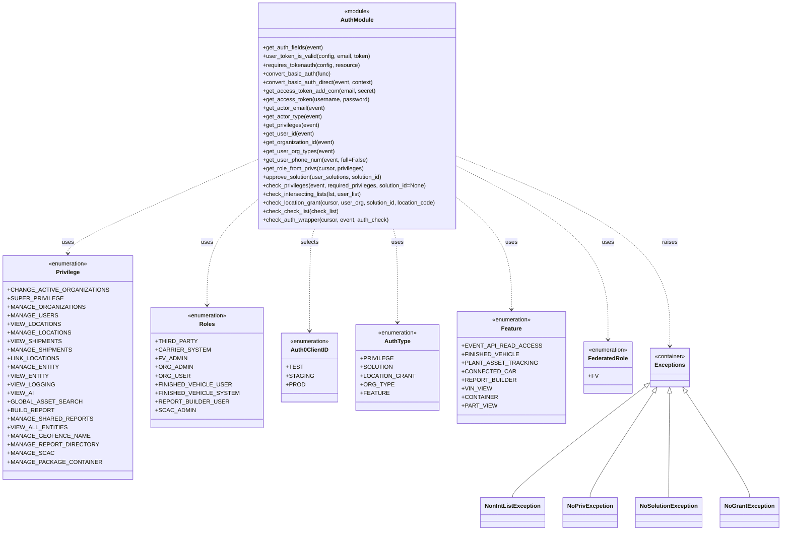

# Diagram: fv_core/fv_framework/python/fv_framework/common/aws/lambdas/auth.py


> Auto-generated by Obscura crawlers

## Diagram 1



> SVG rendering failed for this diagram.

## Diagram 2

```mermaid
flowchart LR
Start([API Event]) --> GetAuthHeader[Get Authorization Header]
GetAuthHeader --> IsBasic{Header contains "Basic"?}
IsBasic -- yes --> DecodeBasic[Decode Basic -> set x-user-email/x-user-token]
IsBasic -- no --> CheckTokenHeaders[Read x-user-email & x-user-token]
DecodeBasic --> CheckTokenHeaders
CheckTokenHeaders --> ValidateToken{Call user_token_is_valid}
ValidateToken -- valid --> InvokeHandler[Invoke Lambda Handler]
ValidateToken -- invalid --> Unauthorized[Return 401 Unauthorized]
InvokeHandler --> NeedAuthz{Handler requires authz checks?}
NeedAuthz -- no --> Success[Proceed]
NeedAuthz -- yes --> BuildAuthChecks[Build auth_check groups]
BuildAuthChecks --> AuthWrapper[check_auth_wrapper(cursor,event,auth_check)]
AuthWrapper --> AuthChecksPassed{All required checks passed?}
AuthChecksPassed -- yes --> Success
AuthChecksPassed -- no --> Forbidden[Raise ForbiddenError]
Success --> MaybeAccessToken{Requires external access token?}
MaybeAccessToken -- yes --> RequestToken[get_access_token(username,password) (cached ttl_cache)]
RequestToken --> Auth0POST[POST to auth0 /oauth/token]
Auth0POST --> TokenResponse{access_token in response?}
TokenResponse -- yes --> TokenOK[Return access_token]
TokenResponse -- no --> RetryOrFail[Retry or raise ForbiddenError]
Unauthorized --> End([End])
Forbidden --> End
TokenOK --> End
```

> SVG rendering failed for this diagram.
