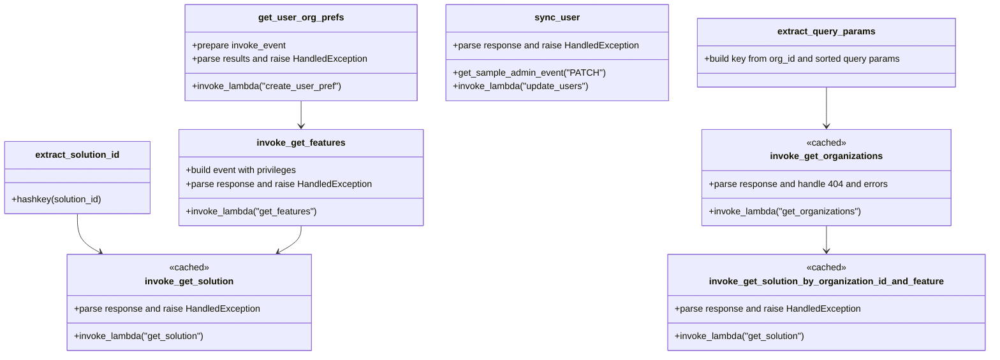

# Diagram: fv_core/fv_framework/python/fv_framework/common/aws/lambdas/invokinators/invokinator_iam.py


> Auto-generated by Obscura crawlers

## Diagram 1

```mermaid
flowchart TD
  GUP[get_user_org_prefs(event, organization_id, user_auth0_id=None, key_pref=None)]
  GUP -->|prepare invoke_event| GUP_PREP[invoke_event with authorizer and pathParameters]
  GUP_PREP -->|calls| INV_CREATE[invoke_lambda("create_user_pref")]
  INV_CREATE --> RES_CREATE[parse results.body and statusCode]
  RES_CREATE -->|status >= 400| ERR_CREATE[HandledException]
  RES_CREATE -->|status < 400| OK_CREATE[return results_body]

  IGF[invoke_get_features(organization_id, lambda_level)]
  IGF --> EV_FEATURES[event with privileges and organization_id]
  EV_FEATURES -->|calls| INV_FEATURES[invoke_lambda("get_features")]
  INV_FEATURES --> RES_FEATURES[parse body and statusCode]
  RES_FEATURES -->|status >= 400| ERR_FEATURES[HandledException]
  RES_FEATURES -->|status < 400| OK_FEATURES[return features]

  IGS[invoke_get_solution(solution_id)]
  IGS -.cached.-> KEY_SOL[extract_solution_id(solution_id)]
  IGS -->|calls| INV_SOLUTION1[invoke_lambda("get_solution")]
  INV_SOLUTION1 --> RES_SOL1[parse body and statusCode]
  RES_SOL1 -->|status >= 400| ERR_SOL1[HandledException]
  RES_SOL1 -->|status < 400| OK_SOL1[return solution]

  IGS2[invoke_get_solution_by_organization_id_and_feature(organization_id, feature_name)]
  IGS2 -.cached.-> KEY_ORG_FEATURE[extract_organization_id_feature_name(organization_id, feature_name)]
  IGS2 -->|calls| INV_SOLUTION2[invoke_lambda("get_solution")]
  INV_SOLUTION2 --> RES_SOL2[parse body and statusCode]
  RES_SOL2 -->|status >= 400| ERR_SOL2[HandledException]
  RES_SOL2 -->|status < 400| OK_SOL2[return solution]

  IGO[invoke_get_organizations(event, query_params)]
  IGO -.cached.-> KEY_QUERY[extract_query_params(event, query_params)]
  IGO -->|calls| INV_ORGS[invoke_lambda("get_organizations")]
  INV_ORGS --> RES_ORGS[parse body and statusCode]
  RES_ORGS -->|status >= 400 and !=404| ERR_ORGS[HandledException]
  RES_ORGS -->|status == 404 or <400| OK_ORGS[return org["response"]]

  SYNC[sync_user(auth0_user_id)]
  SYNC --> EVT_ADMIN[get_sample_admin_event("PATCH")]
  EVT_ADMIN -->|set pathParameters & body| INV_UPDATE[invoke_lambda("update_users")]
  INV_UPDATE --> RES_UPDATE[parse body and statusCode]
  RES_UPDATE -->|status >= 400| ERR_UPDATE[HandledException]
  RES_UPDATE -->|status < 400| OK_UPDATE[return response_body]

  classDef cached stroke:#ff3,stroke-width:2px,stroke-dasharray: 5 5;
  IGS:::cached
  IGS2:::cached
  IGO:::cached
```

> SVG rendering failed for this diagram.

## Diagram 2



### SVG

<svg id="container" width="1723.0625" xmlns="http://www.w3.org/2000/svg" class="classDiagram" height="620" viewBox="0 0 1723.0625 620" role="graphics-document document" aria-roledescription="class"><style>#container{font-family:"trebuchet ms",verdana,arial,sans-serif;font-size:16px;fill:#333;}@keyframes edge-animation-frame{from{stroke-dashoffset:0;}}@keyframes dash{to{stroke-dashoffset:0;}}#container .edge-animation-slow{stroke-dasharray:9,5!important;stroke-dashoffset:900;animation:dash 50s linear infinite;stroke-linecap:round;}#container .edge-animation-fast{stroke-dasharray:9,5!important;stroke-dashoffset:900;animation:dash 20s linear infinite;stroke-linecap:round;}#container .error-icon{fill:#552222;}#container .error-text{fill:#552222;stroke:#552222;}#container .edge-thickness-normal{stroke-width:1px;}#container .edge-thickness-thick{stroke-width:3.5px;}#container .edge-pattern-solid{stroke-dasharray:0;}#container .edge-thickness-invisible{stroke-width:0;fill:none;}#container .edge-pattern-dashed{stroke-dasharray:3;}#container .edge-pattern-dotted{stroke-dasharray:2;}#container .marker{fill:#333333;stroke:#333333;}#container .marker.cross{stroke:#333333;}#container svg{font-family:"trebuchet ms",verdana,arial,sans-serif;font-size:16px;}#container p{margin:0;}#container g.classGroup text{fill:#9370DB;stroke:none;font-family:"trebuchet ms",verdana,arial,sans-serif;font-size:10px;}#container g.classGroup text .title{font-weight:bolder;}#container .nodeLabel,#container .edgeLabel{color:#131300;}#container .edgeLabel .label rect{fill:#ECECFF;}#container .label text{fill:#131300;}#container .labelBkg{background:#ECECFF;}#container .edgeLabel .label span{background:#ECECFF;}#container .classTitle{font-weight:bolder;}#container .node rect,#container .node circle,#container .node ellipse,#container .node polygon,#container .node path{fill:#ECECFF;stroke:#9370DB;stroke-width:1px;}#container .divider{stroke:#9370DB;stroke-width:1;}#container g.clickable{cursor:pointer;}#container g.classGroup rect{fill:#ECECFF;stroke:#9370DB;}#container g.classGroup line{stroke:#9370DB;stroke-width:1;}#container .classLabel .box{stroke:none;stroke-width:0;fill:#ECECFF;opacity:0.5;}#container .classLabel .label{fill:#9370DB;font-size:10px;}#container .relation{stroke:#333333;stroke-width:1;fill:none;}#container .dashed-line{stroke-dasharray:3;}#container .dotted-line{stroke-dasharray:1 2;}#container #compositionStart,#container .composition{fill:#333333!important;stroke:#333333!important;stroke-width:1;}#container #compositionEnd,#container .composition{fill:#333333!important;stroke:#333333!important;stroke-width:1;}#container #dependencyStart,#container .dependency{fill:#333333!important;stroke:#333333!important;stroke-width:1;}#container #dependencyStart,#container .dependency{fill:#333333!important;stroke:#333333!important;stroke-width:1;}#container #extensionStart,#container .extension{fill:transparent!important;stroke:#333333!important;stroke-width:1;}#container #extensionEnd,#container .extension{fill:transparent!important;stroke:#333333!important;stroke-width:1;}#container #aggregationStart,#container .aggregation{fill:transparent!important;stroke:#333333!important;stroke-width:1;}#container #aggregationEnd,#container .aggregation{fill:transparent!important;stroke:#333333!important;stroke-width:1;}#container #lollipopStart,#container .lollipop{fill:#ECECFF!important;stroke:#333333!important;stroke-width:1;}#container #lollipopEnd,#container .lollipop{fill:#ECECFF!important;stroke:#333333!important;stroke-width:1;}#container .edgeTerminals{font-size:11px;line-height:initial;}#container .classTitleText{text-anchor:middle;font-size:18px;fill:#333;}#container .label-icon{display:inline-block;height:1em;overflow:visible;vertical-align:-0.125em;}#container .node .label-icon path{fill:currentColor;stroke:revert;stroke-width:revert;}#container :root{--mermaid-font-family:"trebuchet ms",verdana,arial,sans-serif;}</style><g><defs><marker id="container_class-aggregationStart" class="marker aggregation class" refX="18" refY="7" markerWidth="190" markerHeight="240" orient="auto"><path d="M 18,7 L9,13 L1,7 L9,1 Z"></path></marker></defs><defs><marker id="container_class-aggregationEnd" class="marker aggregation class" refX="1" refY="7" markerWidth="20" markerHeight="28" orient="auto"><path d="M 18,7 L9,13 L1,7 L9,1 Z"></path></marker></defs><defs><marker id="container_class-extensionStart" class="marker extension class" refX="18" refY="7" markerWidth="190" markerHeight="240" orient="auto"><path d="M 1,7 L18,13 V 1 Z"></path></marker></defs><defs><marker id="container_class-extensionEnd" class="marker extension class" refX="1" refY="7" markerWidth="20" markerHeight="28" orient="auto"><path d="M 1,1 V 13 L18,7 Z"></path></marker></defs><defs><marker id="container_class-compositionStart" class="marker composition class" refX="18" refY="7" markerWidth="190" markerHeight="240" orient="auto"><path d="M 18,7 L9,13 L1,7 L9,1 Z"></path></marker></defs><defs><marker id="container_class-compositionEnd" class="marker composition class" refX="1" refY="7" markerWidth="20" markerHeight="28" orient="auto"><path d="M 18,7 L9,13 L1,7 L9,1 Z"></path></marker></defs><defs><marker id="container_class-dependencyStart" class="marker dependency class" refX="6" refY="7" markerWidth="190" markerHeight="240" orient="auto"><path d="M 5,7 L9,13 L1,7 L9,1 Z"></path></marker></defs><defs><marker id="container_class-dependencyEnd" class="marker dependency class" refX="13" refY="7" markerWidth="20" markerHeight="28" orient="auto"><path d="M 18,7 L9,13 L14,7 L9,1 Z"></path></marker></defs><defs><marker id="container_class-lollipopStart" class="marker lollipop class" refX="13" refY="7" markerWidth="190" markerHeight="240" orient="auto"><circle stroke="black" fill="transparent" cx="7" cy="7" r="6"></circle></marker></defs><defs><marker id="container_class-lollipopEnd" class="marker lollipop class" refX="1" refY="7" markerWidth="190" markerHeight="240" orient="auto"><circle stroke="black" fill="transparent" cx="7" cy="7" r="6"></circle></marker></defs><g class="root"><g class="clusters"></g><g class="edgePaths"><path d="M135.574,373L135.574,380.667C135.574,388.333,135.574,403.667,142.155,415.012C148.736,426.357,161.897,433.715,168.478,437.394L175.059,441.072" id="id_extract_solution_id_invoke_get_solution_1" class="edge-thickness-normal edge-pattern-solid relation" style=";;;" data-edge="true" data-et="edge" data-id="id_extract_solution_id_invoke_get_solution_1" data-points="W3sieCI6MTM1LjU3NDIxODc1LCJ5IjozNzN9LHsieCI6MTM1LjU3NDIxODc1LCJ5Ijo0MTl9LHsieCI6MTgwLjI5NTg1MzY0MTA1NTAzLCJ5Ijo0NDR9XQ==" marker-end="url(#container_class-dependencyEnd)"></path><path d="M1441.645,152L1441.645,160.167C1441.645,168.333,1441.645,184.667,1441.645,196C1441.645,207.333,1441.645,213.667,1441.645,216.833L1441.645,220" id="id_extract_query_params_invoke_get_organizations_2" class="edge-thickness-normal edge-pattern-solid relation" style=";;;" data-edge="true" data-et="edge" data-id="id_extract_query_params_invoke_get_organizations_2" data-points="W3sieCI6MTQ0MS42NDQ1MzEyNSwieSI6MTUyfSx7IngiOjE0NDEuNjQ0NTMxMjUsInkiOjIwMX0seyJ4IjoxNDQxLjY0NDUzMTI1LCJ5IjoyMjZ9XQ==" marker-end="url(#container_class-dependencyEnd)"></path><path d="M525.547,176L525.547,180.167C525.547,184.333,525.547,192.667,525.547,200C525.547,207.333,525.547,213.667,525.547,216.833L525.547,220" id="id_get_user_org_prefs_invoke_get_features_3" class="edge-thickness-normal edge-pattern-solid relation" style=";;;" data-edge="true" data-et="edge" data-id="id_get_user_org_prefs_invoke_get_features_3" data-points="W3sieCI6NTI1LjU0Njg3NSwieSI6MTc2fSx7IngiOjUyNS41NDY4NzUsInkiOjIwMX0seyJ4Ijo1MjUuNTQ2ODc1LCJ5IjoyMjZ9XQ==" marker-end="url(#container_class-dependencyEnd)"></path><path d="M525.547,394L525.547,398.167C525.547,402.333,525.547,410.667,518.966,418.512C512.385,426.357,499.224,433.715,492.643,437.394L486.062,441.072" id="id_invoke_get_features_invoke_get_solution_4" class="edge-thickness-normal edge-pattern-solid relation" style=";;;" data-edge="true" data-et="edge" data-id="id_invoke_get_features_invoke_get_solution_4" data-points="W3sieCI6NTI1LjU0Njg3NSwieSI6Mzk0fSx7IngiOjUyNS41NDY4NzUsInkiOjQxOX0seyJ4Ijo0ODAuODI1MjQwMTA4OTQ0OTcsInkiOjQ0NH1d" marker-end="url(#container_class-dependencyEnd)"></path><path d="M1441.645,394L1441.645,398.167C1441.645,402.333,1441.645,410.667,1441.645,418C1441.645,425.333,1441.645,431.667,1441.645,434.833L1441.645,438" id="id_invoke_get_organizations_invoke_get_solution_by_organization_id_and_feature_5" class="edge-thickness-normal edge-pattern-solid relation" style=";;;" data-edge="true" data-et="edge" data-id="id_invoke_get_organizations_invoke_get_solution_by_organization_id_and_feature_5" data-points="W3sieCI6MTQ0MS42NDQ1MzEyNSwieSI6Mzk0fSx7IngiOjE0NDEuNjQ0NTMxMjUsInkiOjQxOX0seyJ4IjoxNDQxLjY0NDUzMTI1LCJ5Ijo0NDR9XQ==" marker-end="url(#container_class-dependencyEnd)"></path></g><g class="edgeLabels"><g class="edgeLabel"><g class="label" data-id="id_extract_solution_id_invoke_get_solution_1" transform="translate(0, 0)"><foreignObject width="0" height="0"><div xmlns="http://www.w3.org/1999/xhtml" class="labelBkg" style="display: table-cell; white-space: nowrap; line-height: 1.5; max-width: 200px; text-align: center;"><span class="edgeLabel"></span></div></foreignObject></g></g><g class="edgeLabel"><g class="label" data-id="id_extract_query_params_invoke_get_organizations_2" transform="translate(0, 0)"><foreignObject width="0" height="0"><div xmlns="http://www.w3.org/1999/xhtml" class="labelBkg" style="display: table-cell; white-space: nowrap; line-height: 1.5; max-width: 200px; text-align: center;"><span class="edgeLabel"></span></div></foreignObject></g></g><g class="edgeLabel"><g class="label" data-id="id_get_user_org_prefs_invoke_get_features_3" transform="translate(0, 0)"><foreignObject width="0" height="0"><div xmlns="http://www.w3.org/1999/xhtml" class="labelBkg" style="display: table-cell; white-space: nowrap; line-height: 1.5; max-width: 200px; text-align: center;"><span class="edgeLabel"></span></div></foreignObject></g></g><g class="edgeLabel"><g class="label" data-id="id_invoke_get_features_invoke_get_solution_4" transform="translate(0, 0)"><foreignObject width="0" height="0"><div xmlns="http://www.w3.org/1999/xhtml" class="labelBkg" style="display: table-cell; white-space: nowrap; line-height: 1.5; max-width: 200px; text-align: center;"><span class="edgeLabel"></span></div></foreignObject></g></g><g class="edgeLabel"><g class="label" data-id="id_invoke_get_organizations_invoke_get_solution_by_organization_id_and_feature_5" transform="translate(0, 0)"><foreignObject width="0" height="0"><div xmlns="http://www.w3.org/1999/xhtml" class="labelBkg" style="display: table-cell; white-space: nowrap; line-height: 1.5; max-width: 200px; text-align: center;"><span class="edgeLabel"></span></div></foreignObject></g></g></g><g class="nodes"><g class="node default" id="classId-get_user_org_prefs-0" transform="translate(525.546875, 92)"><g class="basic label-container"><path d="M-201.75390625 -84 L201.75390625 -84 L201.75390625 84 L-201.75390625 84" stroke="none" stroke-width="0" fill="#ECECFF" style=""></path><path d="M-201.75390625 -84 C-58.330394481857866 -84, 85.09311728628427 -84, 201.75390625 -84 M-201.75390625 -84 C-61.51077885493413 -84, 78.73234854013174 -84, 201.75390625 -84 M201.75390625 -84 C201.75390625 -40.42621417550769, 201.75390625 3.1475716489846235, 201.75390625 84 M201.75390625 -84 C201.75390625 -43.69203552421998, 201.75390625 -3.3840710484399636, 201.75390625 84 M201.75390625 84 C96.07887930990535 84, -9.596147630189307 84, -201.75390625 84 M201.75390625 84 C94.98932429790909 84, -11.775257654181814 84, -201.75390625 84 M-201.75390625 84 C-201.75390625 37.33951521355483, -201.75390625 -9.320969572890334, -201.75390625 -84 M-201.75390625 84 C-201.75390625 18.15426286380044, -201.75390625 -47.69147427239912, -201.75390625 -84" stroke="#9370DB" stroke-width="1.3" fill="none" stroke-dasharray="0 0" style=""></path></g><g class="annotation-group text" transform="translate(0, -60)"></g><g class="label-group text" transform="translate(-70.4140625, -60)"><g class="label" style="font-weight: bolder" transform="translate(0,-12)"><foreignObject width="140.828125" height="24"><div xmlns="http://www.w3.org/1999/xhtml" style="display: table-cell; white-space: nowrap; line-height: 1.5; max-width: 188px; text-align: center;"><span class="nodeLabel markdown-node-label" style=""><p>get_user_org_prefs</p></span></div></foreignObject></g></g><g class="members-group text" transform="translate(-189.75390625, -12)"><g class="label" style="" transform="translate(0,-12)"><foreignObject width="164.328125" height="24"><div xmlns="http://www.w3.org/1999/xhtml" style="display: table-cell; white-space: nowrap; line-height: 1.5; max-width: 222px; text-align: center;"><span class="nodeLabel markdown-node-label" style=""><p>+prepare invoke_event</p></span></div></foreignObject></g><g class="label" style="" transform="translate(0,12)"><foreignObject width="309.09375" height="24"><div xmlns="http://www.w3.org/1999/xhtml" style="display: table-cell; white-space: nowrap; line-height: 1.5; max-width: 366px; text-align: center;"><span class="nodeLabel markdown-node-label" style=""><p>+parse results and raise HandledException</p></span></div></foreignObject></g></g><g class="methods-group text" transform="translate(-189.75390625, 60)"><g class="label" style="" transform="translate(0,-12)"><foreignObject width="262.96875" height="24"><div xmlns="http://www.w3.org/1999/xhtml" style="display: table-cell; white-space: nowrap; line-height: 1.5; max-width: 320px; text-align: center;"><span class="nodeLabel markdown-node-label" style=""><p>+invoke_lambda("create_user_pref")</p></span></div></foreignObject></g></g><g class="divider" style=""><path d="M-201.75390625 -36 C-116.7627917097478 -36, -31.771677169495604 -36, 201.75390625 -36 M-201.75390625 -36 C-44.81295860446241 -36, 112.12798904107518 -36, 201.75390625 -36" stroke="#9370DB" stroke-width="1.3" fill="none" stroke-dasharray="0 0" style=""></path></g><g class="divider" style=""><path d="M-201.75390625 36 C-65.22583055529631 36, 71.30224513940738 36, 201.75390625 36 M-201.75390625 36 C-84.33260380357889 36, 33.08869864284222 36, 201.75390625 36" stroke="#9370DB" stroke-width="1.3" fill="none" stroke-dasharray="0 0" style=""></path></g></g><g class="node default" id="classId-invoke_get_features-1" transform="translate(525.546875, 310)"><g class="basic label-container"><path d="M-212.3984375 -84 L212.3984375 -84 L212.3984375 84 L-212.3984375 84" stroke="none" stroke-width="0" fill="#ECECFF" style=""></path><path d="M-212.3984375 -84 C-80.54839777631497 -84, 51.30164194737006 -84, 212.3984375 -84 M-212.3984375 -84 C-52.18854609353912 -84, 108.02134531292177 -84, 212.3984375 -84 M212.3984375 -84 C212.3984375 -46.42673166554279, 212.3984375 -8.853463331085578, 212.3984375 84 M212.3984375 -84 C212.3984375 -18.60817993342212, 212.3984375 46.78364013315576, 212.3984375 84 M212.3984375 84 C57.684942429628364 84, -97.02855264074327 84, -212.3984375 84 M212.3984375 84 C75.09467797690215 84, -62.209081546195705 84, -212.3984375 84 M-212.3984375 84 C-212.3984375 39.03432608012871, -212.3984375 -5.931347839742585, -212.3984375 -84 M-212.3984375 84 C-212.3984375 17.6104376572858, -212.3984375 -48.7791246854284, -212.3984375 -84" stroke="#9370DB" stroke-width="1.3" fill="none" stroke-dasharray="0 0" style=""></path></g><g class="annotation-group text" transform="translate(0, -60)"></g><g class="label-group text" transform="translate(-74.53125, -60)"><g class="label" style="font-weight: bolder" transform="translate(0,-12)"><foreignObject width="149.0625" height="24"><div xmlns="http://www.w3.org/1999/xhtml" style="display: table-cell; white-space: nowrap; line-height: 1.5; max-width: 196px; text-align: center;"><span class="nodeLabel markdown-node-label" style=""><p>invoke_get_features</p></span></div></foreignObject></g></g><g class="members-group text" transform="translate(-200.3984375, -12)"><g class="label" style="" transform="translate(0,-12)"><foreignObject width="199.84375" height="24"><div xmlns="http://www.w3.org/1999/xhtml" style="display: table-cell; white-space: nowrap; line-height: 1.5; max-width: 257px; text-align: center;"><span class="nodeLabel markdown-node-label" style=""><p>+build event with privileges</p></span></div></foreignObject></g><g class="label" style="" transform="translate(0,12)"><foreignObject width="326.265625" height="24"><div xmlns="http://www.w3.org/1999/xhtml" style="display: table-cell; white-space: nowrap; line-height: 1.5; max-width: 384px; text-align: center;"><span class="nodeLabel markdown-node-label" style=""><p>+parse response and raise HandledException</p></span></div></foreignObject></g></g><g class="methods-group text" transform="translate(-200.3984375, 60)"><g class="label" style="" transform="translate(0,-12)"><foreignObject width="231.21875" height="24"><div xmlns="http://www.w3.org/1999/xhtml" style="display: table-cell; white-space: nowrap; line-height: 1.5; max-width: 289px; text-align: center;"><span class="nodeLabel markdown-node-label" style=""><p>+invoke_lambda("get_features")</p></span></div></foreignObject></g></g><g class="divider" style=""><path d="M-212.3984375 -36 C-81.41968942921608 -36, 49.559058641567844 -36, 212.3984375 -36 M-212.3984375 -36 C-102.49544450247419 -36, 7.407548495051628 -36, 212.3984375 -36" stroke="#9370DB" stroke-width="1.3" fill="none" stroke-dasharray="0 0" style=""></path></g><g class="divider" style=""><path d="M-212.3984375 36 C-119.3597047812756 36, -26.320972062551192 36, 212.3984375 36 M-212.3984375 36 C-100.12868274267689 36, 12.141072014646227 36, 212.3984375 36" stroke="#9370DB" stroke-width="1.3" fill="none" stroke-dasharray="0 0" style=""></path></g></g><g class="node default" id="classId-invoke_get_solution-2" transform="translate(330.560546875, 528)"><g class="basic label-container"><path d="M-212.33984375 -84 L212.33984375 -84 L212.33984375 84 L-212.33984375 84" stroke="none" stroke-width="0" fill="#ECECFF" style=""></path><path d="M-212.33984375 -84 C-109.64786418607413 -84, -6.955884622148261 -84, 212.33984375 -84 M-212.33984375 -84 C-64.70977235964187 -84, 82.92029903071625 -84, 212.33984375 -84 M212.33984375 -84 C212.33984375 -36.24544947605173, 212.33984375 11.509101047896536, 212.33984375 84 M212.33984375 -84 C212.33984375 -45.268063700195185, 212.33984375 -6.53612740039037, 212.33984375 84 M212.33984375 84 C117.39855756792761 84, 22.457271385855222 84, -212.33984375 84 M212.33984375 84 C44.68280403007188 84, -122.97423568985624 84, -212.33984375 84 M-212.33984375 84 C-212.33984375 29.02516111183664, -212.33984375 -25.949677776326723, -212.33984375 -84 M-212.33984375 84 C-212.33984375 26.111795205843727, -212.33984375 -31.776409588312546, -212.33984375 -84" stroke="#9370DB" stroke-width="1.3" fill="none" stroke-dasharray="0 0" style=""></path></g><g class="annotation-group text" transform="translate(-34.7265625, -60)"><g class="label" style="" transform="translate(0,-12)"><foreignObject width="69.453125" height="24"><div xmlns="http://www.w3.org/1999/xhtml" style="display: table-cell; white-space: nowrap; line-height: 1.5; max-width: 119px; text-align: center;"><span class="nodeLabel markdown-node-label" style=""><p>«cached»</p></span></div></foreignObject></g></g><g class="label-group text" transform="translate(-74.4140625, -36)"><g class="label" style="font-weight: bolder" transform="translate(0,-12)"><foreignObject width="148.828125" height="24"><div xmlns="http://www.w3.org/1999/xhtml" style="display: table-cell; white-space: nowrap; line-height: 1.5; max-width: 197px; text-align: center;"><span class="nodeLabel markdown-node-label" style=""><p>invoke_get_solution</p></span></div></foreignObject></g></g><g class="members-group text" transform="translate(-200.33984375, 12)"><g class="label" style="" transform="translate(0,-12)"><foreignObject width="326.265625" height="24"><div xmlns="http://www.w3.org/1999/xhtml" style="display: table-cell; white-space: nowrap; line-height: 1.5; max-width: 384px; text-align: center;"><span class="nodeLabel markdown-node-label" style=""><p>+parse response and raise HandledException</p></span></div></foreignObject></g></g><g class="methods-group text" transform="translate(-200.33984375, 60)"><g class="label" style="" transform="translate(0,-12)"><foreignObject width="232.015625" height="24"><div xmlns="http://www.w3.org/1999/xhtml" style="display: table-cell; white-space: nowrap; line-height: 1.5; max-width: 289px; text-align: center;"><span class="nodeLabel markdown-node-label" style=""><p>+invoke_lambda("get_solution")</p></span></div></foreignObject></g></g><g class="divider" style=""><path d="M-212.33984375 -12 C-99.22550827978819 -12, 13.888827190423626 -12, 212.33984375 -12 M-212.33984375 -12 C-44.07926259695736 -12, 124.18131855608527 -12, 212.33984375 -12" stroke="#9370DB" stroke-width="1.3" fill="none" stroke-dasharray="0 0" style=""></path></g><g class="divider" style=""><path d="M-212.33984375 36 C-72.99468144139956 36, 66.35048086720087 36, 212.33984375 36 M-212.33984375 36 C-77.23757125089557 36, 57.86470124820886 36, 212.33984375 36" stroke="#9370DB" stroke-width="1.3" fill="none" stroke-dasharray="0 0" style=""></path></g></g><g class="node default" id="classId-invoke_get_solution_by_organization_id_and_feature-3" transform="translate(1441.64453125, 528)"><g class="basic label-container"><path d="M-273.41796875 -84 L273.41796875 -84 L273.41796875 84 L-273.41796875 84" stroke="none" stroke-width="0" fill="#ECECFF" style=""></path><path d="M-273.41796875 -84 C-87.4699913733784 -84, 98.47798600324319 -84, 273.41796875 -84 M-273.41796875 -84 C-116.49437768747254 -84, 40.42921337505493 -84, 273.41796875 -84 M273.41796875 -84 C273.41796875 -40.75688317728696, 273.41796875 2.4862336454260827, 273.41796875 84 M273.41796875 -84 C273.41796875 -25.182690936119265, 273.41796875 33.63461812776147, 273.41796875 84 M273.41796875 84 C70.3502152253468 84, -132.7175382993064 84, -273.41796875 84 M273.41796875 84 C87.29344493525394 84, -98.83107887949211 84, -273.41796875 84 M-273.41796875 84 C-273.41796875 36.45990144679143, -273.41796875 -11.080197106417145, -273.41796875 -84 M-273.41796875 84 C-273.41796875 28.143011017999072, -273.41796875 -27.713977964001856, -273.41796875 -84" stroke="#9370DB" stroke-width="1.3" fill="none" stroke-dasharray="0 0" style=""></path></g><g class="annotation-group text" transform="translate(-34.7265625, -60)"><g class="label" style="" transform="translate(0,-12)"><foreignObject width="69.453125" height="24"><div xmlns="http://www.w3.org/1999/xhtml" style="display: table-cell; white-space: nowrap; line-height: 1.5; max-width: 119px; text-align: center;"><span class="nodeLabel markdown-node-label" style=""><p>«cached»</p></span></div></foreignObject></g></g><g class="label-group text" transform="translate(-196.5703125, -36)"><g class="label" style="font-weight: bolder" transform="translate(0,-12)"><foreignObject width="393.140625" height="24"><div xmlns="http://www.w3.org/1999/xhtml" style="display: table-cell; white-space: nowrap; line-height: 1.5; max-width: 438px; text-align: center;"><span class="nodeLabel markdown-node-label" style=""><p>invoke_get_solution_by_organization_id_and_feature</p></span></div></foreignObject></g></g><g class="members-group text" transform="translate(-261.41796875, 12)"><g class="label" style="" transform="translate(0,-12)"><foreignObject width="326.265625" height="24"><div xmlns="http://www.w3.org/1999/xhtml" style="display: table-cell; white-space: nowrap; line-height: 1.5; max-width: 384px; text-align: center;"><span class="nodeLabel markdown-node-label" style=""><p>+parse response and raise HandledException</p></span></div></foreignObject></g></g><g class="methods-group text" transform="translate(-261.41796875, 60)"><g class="label" style="" transform="translate(0,-12)"><foreignObject width="232.015625" height="24"><div xmlns="http://www.w3.org/1999/xhtml" style="display: table-cell; white-space: nowrap; line-height: 1.5; max-width: 289px; text-align: center;"><span class="nodeLabel markdown-node-label" style=""><p>+invoke_lambda("get_solution")</p></span></div></foreignObject></g></g><g class="divider" style=""><path d="M-273.41796875 -12 C-71.98104010222957 -12, 129.45588854554086 -12, 273.41796875 -12 M-273.41796875 -12 C-63.360443863518526 -12, 146.69708102296295 -12, 273.41796875 -12" stroke="#9370DB" stroke-width="1.3" fill="none" stroke-dasharray="0 0" style=""></path></g><g class="divider" style=""><path d="M-273.41796875 36 C-134.1568631252305 36, 5.104242499538998 36, 273.41796875 36 M-273.41796875 36 C-71.47913655195742 36, 130.45969564608515 36, 273.41796875 36" stroke="#9370DB" stroke-width="1.3" fill="none" stroke-dasharray="0 0" style=""></path></g></g><g class="node default" id="classId-invoke_get_organizations-4" transform="translate(1441.64453125, 310)"><g class="basic label-container"><path d="M-216.34375 -84 L216.34375 -84 L216.34375 84 L-216.34375 84" stroke="none" stroke-width="0" fill="#ECECFF" style=""></path><path d="M-216.34375 -84 C-87.49755644518777 -84, 41.34863710962446 -84, 216.34375 -84 M-216.34375 -84 C-93.83042092378413 -84, 28.682908152431736 -84, 216.34375 -84 M216.34375 -84 C216.34375 -40.4703527907989, 216.34375 3.059294418402203, 216.34375 84 M216.34375 -84 C216.34375 -47.12401463014488, 216.34375 -10.248029260289755, 216.34375 84 M216.34375 84 C117.36896801113303 84, 18.39418602226607 84, -216.34375 84 M216.34375 84 C114.58699685908698 84, 12.83024371817396 84, -216.34375 84 M-216.34375 84 C-216.34375 29.252072372752295, -216.34375 -25.49585525449541, -216.34375 -84 M-216.34375 84 C-216.34375 49.5758318017321, -216.34375 15.1516636034642, -216.34375 -84" stroke="#9370DB" stroke-width="1.3" fill="none" stroke-dasharray="0 0" style=""></path></g><g class="annotation-group text" transform="translate(-34.7265625, -60)"><g class="label" style="" transform="translate(0,-12)"><foreignObject width="69.453125" height="24"><div xmlns="http://www.w3.org/1999/xhtml" style="display: table-cell; white-space: nowrap; line-height: 1.5; max-width: 119px; text-align: center;"><span class="nodeLabel markdown-node-label" style=""><p>«cached»</p></span></div></foreignObject></g></g><g class="label-group text" transform="translate(-93.828125, -36)"><g class="label" style="font-weight: bolder" transform="translate(0,-12)"><foreignObject width="187.65625" height="24"><div xmlns="http://www.w3.org/1999/xhtml" style="display: table-cell; white-space: nowrap; line-height: 1.5; max-width: 234px; text-align: center;"><span class="nodeLabel markdown-node-label" style=""><p>invoke_get_organizations</p></span></div></foreignObject></g></g><g class="members-group text" transform="translate(-204.34375, 12)"><g class="label" style="" transform="translate(0,-12)"><foreignObject width="314.859375" height="24"><div xmlns="http://www.w3.org/1999/xhtml" style="display: table-cell; white-space: nowrap; line-height: 1.5; max-width: 372px; text-align: center;"><span class="nodeLabel markdown-node-label" style=""><p>+parse response and handle 404 and errors</p></span></div></foreignObject></g></g><g class="methods-group text" transform="translate(-204.34375, 60)"><g class="label" style="" transform="translate(0,-12)"><foreignObject width="269.609375" height="24"><div xmlns="http://www.w3.org/1999/xhtml" style="display: table-cell; white-space: nowrap; line-height: 1.5; max-width: 327px; text-align: center;"><span class="nodeLabel markdown-node-label" style=""><p>+invoke_lambda("get_organizations")</p></span></div></foreignObject></g></g><g class="divider" style=""><path d="M-216.34375 -12 C-90.42178200822553 -12, 35.50018598354893 -12, 216.34375 -12 M-216.34375 -12 C-51.55142895105391 -12, 113.24089209789219 -12, 216.34375 -12" stroke="#9370DB" stroke-width="1.3" fill="none" stroke-dasharray="0 0" style=""></path></g><g class="divider" style=""><path d="M-216.34375 36 C-113.10468602114709 36, -9.865622042294177 36, 216.34375 36 M-216.34375 36 C-92.21109734219998 36, 31.921555315600045 36, 216.34375 36" stroke="#9370DB" stroke-width="1.3" fill="none" stroke-dasharray="0 0" style=""></path></g></g><g class="node default" id="classId-sync_user-5" transform="translate(970.62109375, 92)"><g class="basic label-container"><path d="M-193.3203125 -84 L193.3203125 -84 L193.3203125 84 L-193.3203125 84" stroke="none" stroke-width="0" fill="#ECECFF" style=""></path><path d="M-193.3203125 -84 C-114.2096397346542 -84, -35.09896696930841 -84, 193.3203125 -84 M-193.3203125 -84 C-86.78856381771321 -84, 19.74318486457358 -84, 193.3203125 -84 M193.3203125 -84 C193.3203125 -44.01773455543389, 193.3203125 -4.03546911086778, 193.3203125 84 M193.3203125 -84 C193.3203125 -49.521034154889385, 193.3203125 -15.04206830977877, 193.3203125 84 M193.3203125 84 C111.63232035115426 84, 29.944328202308526 84, -193.3203125 84 M193.3203125 84 C81.80379478211043 84, -29.71272293577914 84, -193.3203125 84 M-193.3203125 84 C-193.3203125 43.944482780141264, -193.3203125 3.8889655602825286, -193.3203125 -84 M-193.3203125 84 C-193.3203125 47.00834912967427, -193.3203125 10.016698259348544, -193.3203125 -84" stroke="#9370DB" stroke-width="1.3" fill="none" stroke-dasharray="0 0" style=""></path></g><g class="annotation-group text" transform="translate(0, -60)"></g><g class="label-group text" transform="translate(-36.375, -60)"><g class="label" style="font-weight: bolder" transform="translate(0,-12)"><foreignObject width="72.75" height="24"><div xmlns="http://www.w3.org/1999/xhtml" style="display: table-cell; white-space: nowrap; line-height: 1.5; max-width: 123px; text-align: center;"><span class="nodeLabel markdown-node-label" style=""><p>sync_user</p></span></div></foreignObject></g></g><g class="members-group text" transform="translate(-181.3203125, -12)"><g class="label" style="" transform="translate(0,-12)"><foreignObject width="326.265625" height="24"><div xmlns="http://www.w3.org/1999/xhtml" style="display: table-cell; white-space: nowrap; line-height: 1.5; max-width: 384px; text-align: center;"><span class="nodeLabel markdown-node-label" style=""><p>+parse response and raise HandledException</p></span></div></foreignObject></g></g><g class="methods-group text" transform="translate(-181.3203125, 36)"><g class="label" style="" transform="translate(0,-12)"><foreignObject width="260.71875" height="24"><div xmlns="http://www.w3.org/1999/xhtml" style="display: table-cell; white-space: nowrap; line-height: 1.5; max-width: 318px; text-align: center;"><span class="nodeLabel markdown-node-label" style=""><p>+get_sample_admin_event("PATCH")</p></span></div></foreignObject></g><g class="label" style="" transform="translate(0,12)"><foreignObject width="239.15625" height="24"><div xmlns="http://www.w3.org/1999/xhtml" style="display: table-cell; white-space: nowrap; line-height: 1.5; max-width: 297px; text-align: center;"><span class="nodeLabel markdown-node-label" style=""><p>+invoke_lambda("update_users")</p></span></div></foreignObject></g></g><g class="divider" style=""><path d="M-193.3203125 -36 C-42.455854002300754 -36, 108.40860449539849 -36, 193.3203125 -36 M-193.3203125 -36 C-68.39467606068682 -36, 56.53096037862636 -36, 193.3203125 -36" stroke="#9370DB" stroke-width="1.3" fill="none" stroke-dasharray="0 0" style=""></path></g><g class="divider" style=""><path d="M-193.3203125 12 C-107.4312541028575 12, -21.542195705714988 12, 193.3203125 12 M-193.3203125 12 C-112.20913755989608 12, -31.097962619792156 12, 193.3203125 12" stroke="#9370DB" stroke-width="1.3" fill="none" stroke-dasharray="0 0" style=""></path></g></g><g class="node default" id="classId-extract_solution_id-6" transform="translate(135.57421875, 310)"><g class="basic label-container"><path d="M-127.57421875 -63 L127.57421875 -63 L127.57421875 63 L-127.57421875 63" stroke="none" stroke-width="0" fill="#ECECFF" style=""></path><path d="M-127.57421875 -63 C-43.5181548052841 -63, 40.537909139431804 -63, 127.57421875 -63 M-127.57421875 -63 C-47.567769924540244 -63, 32.43867890091951 -63, 127.57421875 -63 M127.57421875 -63 C127.57421875 -31.55325537290359, 127.57421875 -0.1065107458071779, 127.57421875 63 M127.57421875 -63 C127.57421875 -29.100294628322985, 127.57421875 4.799410743354031, 127.57421875 63 M127.57421875 63 C50.54008009006537 63, -26.494058569869253 63, -127.57421875 63 M127.57421875 63 C53.63870693130427 63, -20.29680488739146 63, -127.57421875 63 M-127.57421875 63 C-127.57421875 20.81837087251884, -127.57421875 -21.363258254962318, -127.57421875 -63 M-127.57421875 63 C-127.57421875 36.53575025510584, -127.57421875 10.07150051021167, -127.57421875 -63" stroke="#9370DB" stroke-width="1.3" fill="none" stroke-dasharray="0 0" style=""></path></g><g class="annotation-group text" transform="translate(0, -39)"></g><g class="label-group text" transform="translate(-71.2265625, -39)"><g class="label" style="font-weight: bolder" transform="translate(0,-12)"><foreignObject width="142.453125" height="24"><div xmlns="http://www.w3.org/1999/xhtml" style="display: table-cell; white-space: nowrap; line-height: 1.5; max-width: 190px; text-align: center;"><span class="nodeLabel markdown-node-label" style=""><p>extract_solution_id</p></span></div></foreignObject></g></g><g class="members-group text" transform="translate(-115.57421875, 9)"></g><g class="methods-group text" transform="translate(-115.57421875, 39)"><g class="label" style="" transform="translate(0,-12)"><foreignObject width="159.921875" height="24"><div xmlns="http://www.w3.org/1999/xhtml" style="display: table-cell; white-space: nowrap; line-height: 1.5; max-width: 217px; text-align: center;"><span class="nodeLabel markdown-node-label" style=""><p>+hashkey(solution_id)</p></span></div></foreignObject></g></g><g class="divider" style=""><path d="M-127.57421875 -15 C-38.25570632478913 -15, 51.06280610042174 -15, 127.57421875 -15 M-127.57421875 -15 C-69.99727976244839 -15, -12.420340774896772 -15, 127.57421875 -15" stroke="#9370DB" stroke-width="1.3" fill="none" stroke-dasharray="0 0" style=""></path></g><g class="divider" style=""><path d="M-127.57421875 9 C-74.12641105143945 9, -20.678603352878895 9, 127.57421875 9 M-127.57421875 9 C-28.199490792797533 9, 71.17523716440493 9, 127.57421875 9" stroke="#9370DB" stroke-width="1.3" fill="none" stroke-dasharray="0 0" style=""></path></g></g><g class="node default" id="classId-extract_query_params-7" transform="translate(1441.64453125, 92)"><g class="basic label-container"><path d="M-227.703125 -60 L227.703125 -60 L227.703125 60 L-227.703125 60" stroke="none" stroke-width="0" fill="#ECECFF" style=""></path><path d="M-227.703125 -60 C-113.38282704756215 -60, 0.9374709048757097 -60, 227.703125 -60 M-227.703125 -60 C-128.04930200403635 -60, -28.39547900807267 -60, 227.703125 -60 M227.703125 -60 C227.703125 -31.611590843057584, 227.703125 -3.2231816861151685, 227.703125 60 M227.703125 -60 C227.703125 -27.517254554811416, 227.703125 4.965490890377168, 227.703125 60 M227.703125 60 C84.17300938155958 60, -59.35710623688084 60, -227.703125 60 M227.703125 60 C122.80380764236739 60, 17.904490284734777 60, -227.703125 60 M-227.703125 60 C-227.703125 28.641834800100863, -227.703125 -2.7163303997982737, -227.703125 -60 M-227.703125 60 C-227.703125 18.473114142643887, -227.703125 -23.053771714712227, -227.703125 -60" stroke="#9370DB" stroke-width="1.3" fill="none" stroke-dasharray="0 0" style=""></path></g><g class="annotation-group text" transform="translate(0, -36)"></g><g class="label-group text" transform="translate(-81.8125, -36)"><g class="label" style="font-weight: bolder" transform="translate(0,-12)"><foreignObject width="163.625" height="24"><div xmlns="http://www.w3.org/1999/xhtml" style="display: table-cell; white-space: nowrap; line-height: 1.5; max-width: 211px; text-align: center;"><span class="nodeLabel markdown-node-label" style=""><p>extract_query_params</p></span></div></foreignObject></g></g><g class="members-group text" transform="translate(-215.703125, 12)"><g class="label" style="" transform="translate(0,-12)"><foreignObject width="349.59375" height="24"><div xmlns="http://www.w3.org/1999/xhtml" style="display: table-cell; white-space: nowrap; line-height: 1.5; max-width: 407px; text-align: center;"><span class="nodeLabel markdown-node-label" style=""><p>+build key from org_id and sorted query params</p></span></div></foreignObject></g></g><g class="methods-group text" transform="translate(-215.703125, 60)"></g><g class="divider" style=""><path d="M-227.703125 -12 C-48.83931637090396 -12, 130.02449225819208 -12, 227.703125 -12 M-227.703125 -12 C-98.49435237592144 -12, 30.714420248157126 -12, 227.703125 -12" stroke="#9370DB" stroke-width="1.3" fill="none" stroke-dasharray="0 0" style=""></path></g><g class="divider" style=""><path d="M-227.703125 36 C-100.40283649582533 36, 26.897452008349347 36, 227.703125 36 M-227.703125 36 C-120.85967553567275 36, -14.0162260713455 36, 227.703125 36" stroke="#9370DB" stroke-width="1.3" fill="none" stroke-dasharray="0 0" style=""></path></g></g></g></g></g></svg>
