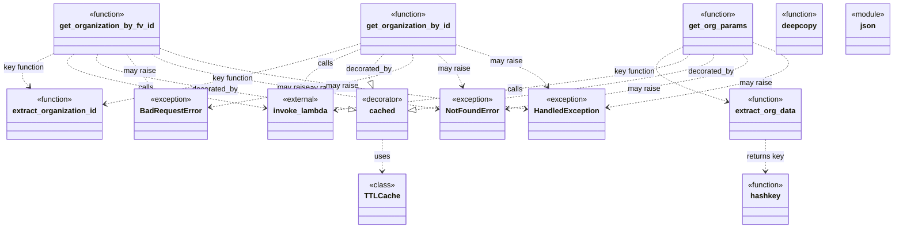

# Diagram: fv_core/fv_framework/python/fv_framework/common/aws/lambdas/invokinators/invokinator_organization.py


> Auto-generated by Obscura crawlers

## Diagram 1

```mermaid
flowchart LR
S1([Start]) --> C1{organization_fv_id?}
C1 -- No --> E1[Raise BadRequestError]
C1 -- Yes --> D1[deepcopy event\nset queryStringParameters={organization_fv_id}]
D1 --> L1[invoke_lambda: get_organizations]
L1 --> P1[parse statusCode & body]
P1 --> C2{status_code == 404?}
C2 -- Yes --> E2[Raise NotFoundError]
C2 -- No --> C3{status_code >= 400?}
C3 -- Yes --> E3[Raise HandledException (500)]
C3 -- No --> R1[return organization]
```

> SVG rendering failed for this diagram.

## Diagram 2

```mermaid
flowchart LR
S2([Start]) --> C4{organization_id?}
C4 -- No --> E4[Raise BadRequestError]
C4 -- Yes --> D2[deepcopy event\nset pathParameters={organization_id}]
D2 --> L2[invoke_lambda: get_organizations]
L2 --> P2[parse statusCode & body]
P2 --> C5{status_code == 404?}
C5 -- Yes --> E5[Raise NotFoundError]
C5 -- No --> C6{status_code >= 400?}
C6 -- Yes --> E6[Raise HandledException (500)]
C6 -- No --> R2[return organization]
```

> SVG rendering failed for this diagram.

## Diagram 3

```mermaid
flowchart LR
S3([Start]) --> D3[deepcopy event]
D3 --> Q1[set queryStringParameters = search_params if dict else {}]
Q1 --> F1{everything?}
F1 -- Yes --> Q2[set everything & fields in queryStringParameters]
F1 -- No --> Q3[skip setting everything/fields]
Q2 --> L3[invoke_lambda: get_organizations]
Q3 --> L3
L3 --> P3[parse statusCode & body]
P3 --> C7{status_code == 404?}
C7 -- Yes --> E7[Raise NotFoundError]
C7 -- No --> C8{status_code >= 400?}
C8 -- Yes --> E8[Raise HandledException (500)]
C8 -- No --> R3[return organization]
```

> SVG rendering failed for this diagram.

## Diagram 4



> SVG rendering failed for this diagram.
