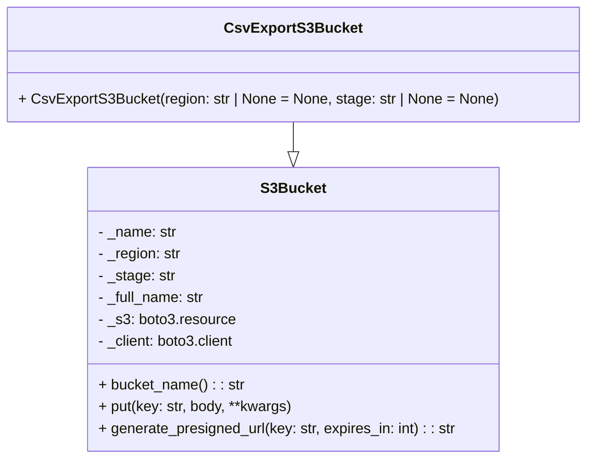
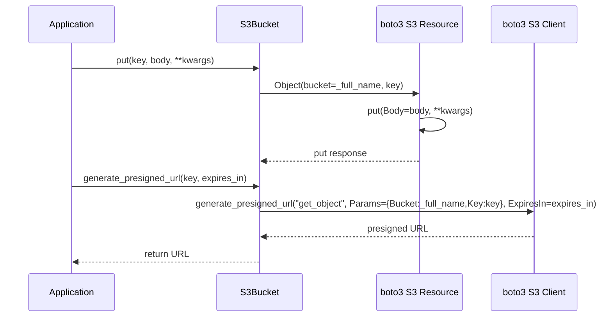

# Diagram: fv_core/fv_framework/python/fv_framework/common/aws/lambdas/s3.py

> Auto-generated by Obscura crawlers

## Diagram 1

### SVG

<svg id="container" width="633.421875" xmlns="http://www.w3.org/2000/svg" class="classDiagram" height="504" viewBox="0 0 633.421875 504" role="graphics-document document" aria-roledescription="class"><g><defs><marker id="container_class-aggregationStart" class="marker aggregation class" refX="18" refY="7" markerWidth="190" markerHeight="240" orient="auto"><path d="M 18,7 L9,13 L1,7 L9,1 Z"></path></marker></defs><defs><marker id="container_class-aggregationEnd" class="marker aggregation class" refX="1" refY="7" markerWidth="20" markerHeight="28" orient="auto"><path d="M 18,7 L9,13 L1,7 L9,1 Z"></path></marker></defs><defs><marker id="container_class-extensionStart" class="marker extension class" refX="18" refY="7" markerWidth="190" markerHeight="240" orient="auto"><path d="M 1,7 L18,13 V 1 Z"></path></marker></defs><defs><marker id="container_class-extensionEnd" class="marker extension class" refX="1" refY="7" markerWidth="20" markerHeight="28" orient="auto"><path d="M 1,1 V 13 L18,7 Z"></path></marker></defs><defs><marker id="container_class-compositionStart" class="marker composition class" refX="18" refY="7" markerWidth="190" markerHeight="240" orient="auto"><path d="M 18,7 L9,13 L1,7 L9,1 Z"></path></marker></defs><defs><marker id="container_class-compositionEnd" class="marker composition class" refX="1" refY="7" markerWidth="20" markerHeight="28" orient="auto"><path d="M 18,7 L9,13 L1,7 L9,1 Z"></path></marker></defs><defs><marker id="container_class-dependencyStart" class="marker dependency class" refX="6" refY="7" markerWidth="190" markerHeight="240" orient="auto"><path d="M 5,7 L9,13 L1,7 L9,1 Z"></path></marker></defs><defs><marker id="container_class-dependencyEnd" class="marker dependency class" refX="13" refY="7" markerWidth="20" markerHeight="28" orient="auto"><path d="M 18,7 L9,13 L14,7 L9,1 Z"></path></marker></defs><defs><marker id="container_class-lollipopStart" class="marker lollipop class" refX="13" refY="7" markerWidth="190" markerHeight="240" orient="auto"><circle stroke="black" fill="transparent" cx="7" cy="7" r="6"></circle></marker></defs><defs><marker id="container_class-lollipopEnd" class="marker lollipop class" refX="1" refY="7" markerWidth="190" markerHeight="240" orient="auto"><circle stroke="black" fill="transparent" cx="7" cy="7" r="6"></circle></marker></defs><g class="root"><g class="clusters"></g><g class="edgePaths"><path d="M316.711,134L316.711,138.167C316.711,142.333,316.711,150.667,316.711,156.125C316.711,161.583,316.711,164.167,316.711,165.458L316.711,166.75" id="id_CsvExportS3Bucket_S3Bucket_1" class="edge-thickness-normal edge-pattern-solid relation" style=";;;" data-edge="true" data-et="edge" data-id="id_CsvExportS3Bucket_S3Bucket_1" data-points="W3sieCI6MzE2LjcxMDkzNzUsInkiOjEzNH0seyJ4IjozMTYuNzEwOTM3NSwieSI6MTU5fSx7IngiOjMxNi43MTA5Mzc1LCJ5IjoxODR9XQ==" marker-end="url(#container_class-extensionEnd)"></path></g><g class="edgeLabels"><g class="edgeLabel"><g class="label" data-id="id_CsvExportS3Bucket_S3Bucket_1" transform="translate(0, 0)"><foreignObject width="0" height="0">

</foreignObject></g></g></g><g class="nodes"><g class="node default" id="classId-S3Bucket-0" transform="translate(316.7109375, 340)"><g class="basic label-container"><path d="M-226.33203125 -156 L226.33203125 -156 L226.33203125 156 L-226.33203125 156" stroke="none" stroke-width="0" fill="#ECECFF" style=""></path><path d="M-226.33203125 -156 C-124.56799805795626 -156, -22.80396486591252 -156, 226.33203125 -156 M-226.33203125 -156 C-126.61800214425072 -156, -26.903973038501448 -156, 226.33203125 -156 M226.33203125 -156 C226.33203125 -51.51013770526433, 226.33203125 52.979724589471346, 226.33203125 156 M226.33203125 -156 C226.33203125 -73.98738931623592, 226.33203125 8.025221367528161, 226.33203125 156 M226.33203125 156 C104.89945901823184 156, -16.533113213536325 156, -226.33203125 156 M226.33203125 156 C84.3879433120297 156, -57.55614462594059 156, -226.33203125 156 M-226.33203125 156 C-226.33203125 85.37276701964124, -226.33203125 14.74553403928249, -226.33203125 -156 M-226.33203125 156 C-226.33203125 91.33420899431529, -226.33203125 26.66841798863058, -226.33203125 -156" stroke="#9370DB" stroke-width="1.3" fill="none" stroke-dasharray="0 0" style=""></path></g><g class="annotation-group text" transform="translate(0, -132)"></g><g class="label-group text" transform="translate(-33.8984375, -132)"><g class="label" style="font-weight: bolder" transform="translate(0,-12)"><foreignObject width="67.796875" height="24">

S3Bucket

</foreignObject></g></g><g class="members-group text" transform="translate(-214.33203125, -84)"><g class="label" style="" transform="translate(0,-12)"><foreignObject width="87.03125" height="24">

- _name: str

</foreignObject></g><g class="label" style="" transform="translate(0,12)"><foreignObject width="92.484375" height="24">

- _region: str

</foreignObject></g><g class="label" style="" transform="translate(0,36)"><foreignObject width="84.984375" height="24">

- _stage: str

</foreignObject></g><g class="label" style="" transform="translate(0,60)"><foreignObject width="119.078125" height="24">

- _full_name: str

</foreignObject></g><g class="label" style="" transform="translate(0,84)"><foreignObject width="150.078125" height="24">

- _s3: boto3.resource

</foreignObject></g><g class="label" style="" transform="translate(0,108)"><foreignObject width="153.359375" height="24">

- _client: boto3.client

</foreignObject></g></g><g class="methods-group text" transform="translate(-214.33203125, 84)"><g class="label" style="" transform="translate(0,-12)"><foreignObject width="160.265625" height="24">

+ bucket_name() : : str

</foreignObject></g><g class="label" style="" transform="translate(0,12)"><foreignObject width="213.765625" height="24">

+ put(key: str, body, **kwargs)

</foreignObject></g><g class="label" style="" transform="translate(0,36)"><foreignObject width="394.765625" height="24">

+ generate_presigned_url(key: str, expires_in: int) : : str

</foreignObject></g></g><g class="divider" style=""><path d="M-226.33203125 -108 C-51.24206051144955 -108, 123.8479102271009 -108, 226.33203125 -108 M-226.33203125 -108 C-58.102652423923445 -108, 110.12672640215311 -108, 226.33203125 -108" stroke="#9370DB" stroke-width="1.3" fill="none" stroke-dasharray="0 0" style=""></path></g><g class="divider" style=""><path d="M-226.33203125 60 C-105.06733831067736 60, 16.197354628645286 60, 226.33203125 60 M-226.33203125 60 C-69.31872172540565 60, 87.6945877991887 60, 226.33203125 60" stroke="#9370DB" stroke-width="1.3" fill="none" stroke-dasharray="0 0" style=""></path></g></g><g class="node default" id="classId-CsvExportS3Bucket-1" transform="translate(316.7109375, 71)"><g class="basic label-container"><path d="M-308.7109375 -63 L308.7109375 -63 L308.7109375 63 L-308.7109375 63" stroke="none" stroke-width="0" fill="#ECECFF" style=""></path><path d="M-308.7109375 -63 C-120.08354702052256 -63, 68.54384345895488 -63, 308.7109375 -63 M-308.7109375 -63 C-125.86044839324344 -63, 56.99004071351311 -63, 308.7109375 -63 M308.7109375 -63 C308.7109375 -36.66137678513192, 308.7109375 -10.322753570263842, 308.7109375 63 M308.7109375 -63 C308.7109375 -21.161656765113158, 308.7109375 20.676686469773685, 308.7109375 63 M308.7109375 63 C61.91993689224702 63, -184.87106371550595 63, -308.7109375 63 M308.7109375 63 C132.3737485186365 63, -43.96344046272702 63, -308.7109375 63 M-308.7109375 63 C-308.7109375 21.705838941846594, -308.7109375 -19.588322116306813, -308.7109375 -63 M-308.7109375 63 C-308.7109375 31.200140219197284, -308.7109375 -0.5997195616054327, -308.7109375 -63" stroke="#9370DB" stroke-width="1.3" fill="none" stroke-dasharray="0 0" style=""></path></g><g class="annotation-group text" transform="translate(0, -39)"></g><g class="label-group text" transform="translate(-70.296875, -39)"><g class="label" style="font-weight: bolder" transform="translate(0,-12)"><foreignObject width="140.59375" height="24">

CsvExportS3Bucket

</foreignObject></g></g><g class="members-group text" transform="translate(-296.7109375, 9)"></g><g class="methods-group text" transform="translate(-296.7109375, 39)"><g class="label" style="" transform="translate(0,-12)"><foreignObject width="523.125" height="24">

+ CsvExportS3Bucket(region: str | None = None, stage: str | None = None)

</foreignObject></g></g><g class="divider" style=""><path d="M-308.7109375 -15 C-99.49339214334142 -15, 109.72415321331715 -15, 308.7109375 -15 M-308.7109375 -15 C-157.3381775590124 -15, -5.965417618024787 -15, 308.7109375 -15" stroke="#9370DB" stroke-width="1.3" fill="none" stroke-dasharray="0 0" style=""></path></g><g class="divider" style=""><path d="M-308.7109375 9 C-139.963513611724 9, 28.78391027655198 9, 308.7109375 9 M-308.7109375 9 C-160.12748187675885 9, -11.5440262535177 9, 308.7109375 9" stroke="#9370DB" stroke-width="1.3" fill="none" stroke-dasharray="0 0" style=""></path></g></g></g></g></g></svg>

## Diagram 2

> SVG rendering failed for this diagram.
