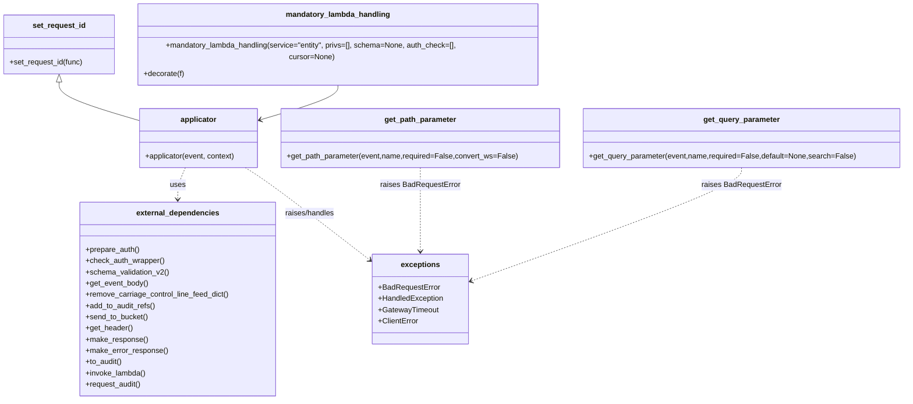

# Diagram: fv_core/fv_framework/python/fv_framework/common/aws/lambdas/security.py


> Auto-generated by Obscura crawlers

## Diagram 1

```mermaid
flowchart LR
  Start((start)) --> SetRequestId[set_request_id decorator]
  SetRequestId --> ConfigLogging[config_logging decorator]
  ConfigLogging --> SetLambdaLevel[set_lambda_level decorator]
  SetLambdaLevel --> Applicator[applicator (wrapped lambda)]
  Applicator --> LogEvent[log_event(event)]
  LogEvent --> PrepareAuth[prepare_auth(event, auth_check, privs)]
  PrepareAuth -- auth_check? --> CheckAuthWrapper{auth_check present?}
  CheckAuthWrapper -- yes --> CheckAuth[check_auth_wrapper(cursor, event, auth_check)]
  CheckAuthWrapper -- no --> SchemaValidation[schema_validation_v2(event, schema)]
  CheckAuth --> SchemaValidation
  SchemaValidation --> ParseBody{try parse body}
  ParseBody -- success --> GetEventBody[get_event_body(event)]
  ParseBody -- BadRequestError --> IgnoreBody[pass (BadRequestError)]
  GetEventBody --> RemoveCRLF[remove_carriage_control_line_feed_dict(event["body"])]
  RemoveCRLF --> AddAudit1[add_to_audit_refs(event, audit_refs)]
  IgnoreBody --> AddAudit1
  AddAudit1 --> MergeContext[event_copy.requestContext.update(event.requestContext)]
  MergeContext --> InvokeHandler[f(event, context, audit_refs)]
  InvokeHandler --> AddAudit2[add_to_audit_refs(event, audit_refs)]
  AddAudit2 --> ProcessResponse[process res and inspect res["body"]]
  ProcessResponse --> TrySerialize[pickle.dumps(res["body"]) (if possible)]
  TrySerialize -- serialized & size>5MB --> OverflowCheck{get_header(event,"fv-overflow")?}
  OverflowCheck -- yes --> SendBucket[send_to_bucket(event,res) -> make_response(SEE_OTHER)]
  OverflowCheck -- no --> RaiseTooLarge[raise HandledException]
  TrySerialize -- ok or not serializable --> ContinueProc
  ContinueProc --> DurationCalc[duration = time.perf_counter() - start_time]
  DurationCalc --> MethodCheck[get_http_method(event_copy).upper() if exists]
  MethodCheck --> TimeoutCheck{duration>29 AND method=="GET"?}
  TimeoutCheck -- yes --> GatewayTimeoutNode[error=GatewayTimeout(), log_no_res=True]
  TimeoutCheck -- no --> NoTimeout
  NoTimeout --> FinallyBlock
  GatewayTimeoutNode --> FinallyBlock
  FinallyBlock --> ErrorPresent{error?}
  ErrorPresent -- yes --> MakeErrorResp[make_error_response(...)] 
  ErrorPresent -- no --> UseRes[use produced res]
  UseRes --> ToAuditCheck[to_audit(event_copy,context,is_error=bool(error))]
  ToAuditCheck -- yes --> PrepareEventAudit[build event_audit payload]
  PrepareEventAudit --> InvokeRequestAudit[invoke_lambda("request_audit", full_payload=event_audit, invoke_type="Event", stage=stage)]
  InvokeRequestAudit --> ReturnRes[return res]
  ToAuditCheck -- no --> ReturnRes
  MakeErrorResp --> ToAuditCheck
  ReturnRes --> End((end))
```

> SVG rendering failed for this diagram.

## Diagram 2



> SVG rendering failed for this diagram.
