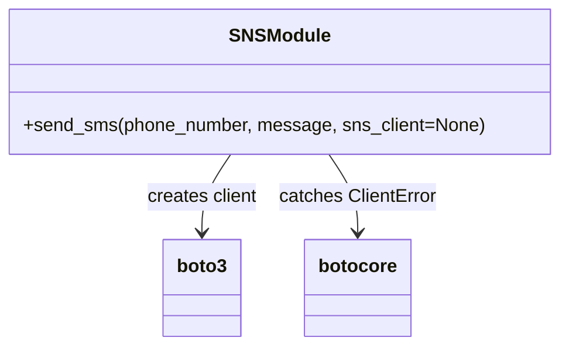

# Diagram: fv_core/fv_framework/python/fv_framework/common/aws/sns.py


> Auto-generated by Obscura crawlers

## Diagram 1

```mermaid
flowchart TD
    A[send_sms(phone_number, message)] --> B{sns_client provided?}
    B -- Yes --> C[Use provided sns_client]
    B -- No --> D[Create sns_client = boto3.client('sns')]
    C --> E[Call sns_client.publish(PhoneNumber, Message)]
    D --> E
    E --> F[Return / Done]
    E -- ClientError --> G[Handle botocore.exceptions.ClientError]
    G --> H[logging.error("Could not publish SMS: <error>")]
    G --> I[Set sns_client = None]
    H --> F
    I --> F
```

> SVG rendering failed for this diagram.

## Diagram 2



> SVG rendering failed for this diagram.
