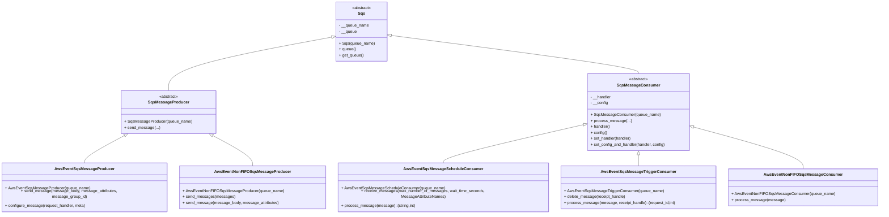

# Diagram: fv_core/fv_framework/python/fv_framework/common/aws/sqs.py

> Auto-generated by Obscura crawlers

## Mermaid

```mermaid
classDiagram
class Sqs <<abstract>> {
  - __queue_name
  - __queue
  + Sqs(queue_name)
  + queue()
  + get_queue()
}
class SqsMessageProducer <<abstract>> {
  + SqsMessageProducer(queue_name)
  + send_message(...)
}
class SqsMessageConsumer <<abstract>> {
  - __handler
  - __config
  + SqsMessageConsumer(queue_name)
  + process_message(...)
  + handler()
  + config()
  + set_handler(handler)
  + set_config_and_handler(handler, config)
}
class AwsEventSqsMessageProducer {
  + AwsEventSqsMessageProducer(queue_name)
  + send_message(message_body, message_attributes, message_group_id)
  + configure_message(request_handler, meta)
}
class AwsEventSqsMessageScheduleConsumer {
  + AwsEventSqsMessageScheduleConsumer(queue_name)
  + receive_messages(max_number_of_messages, wait_time_seconds, MessageAttributeNames)
  + process_message(message) : (string,int)
}
class AwsEventSqsMessageTriggerConsumer {
  + AwsEventSqsMessageTriggerConsumer(queue_name)
  + delete_message(receipt_handle)
  + process_message(message, receipt_handle) : (request_id,int)
}
class AwsEventNonFIFOSqsMessageProducer {
  + AwsEventNonFIFOSqsMessageProducer(queue_name)
  + send_messages(messages)
  + send_message(message_body, message_attributes)
}
class AwsEventNonFIFOSqsMessageConsumer {
  + AwsEventNonFIFOSqsMessageConsumer(queue_name)
  + process_message(message)
}
Sqs <|-- SqsMessageProducer
Sqs <|-- SqsMessageConsumer
SqsMessageProducer <|-- AwsEventSqsMessageProducer
SqsMessageProducer <|-- AwsEventNonFIFOSqsMessageProducer
SqsMessageConsumer <|-- AwsEventSqsMessageScheduleConsumer
SqsMessageConsumer <|-- AwsEventSqsMessageTriggerConsumer
SqsMessageConsumer <|-- AwsEventNonFIFOSqsMessageConsumer
```

> SVG rendering failed for this diagram.
