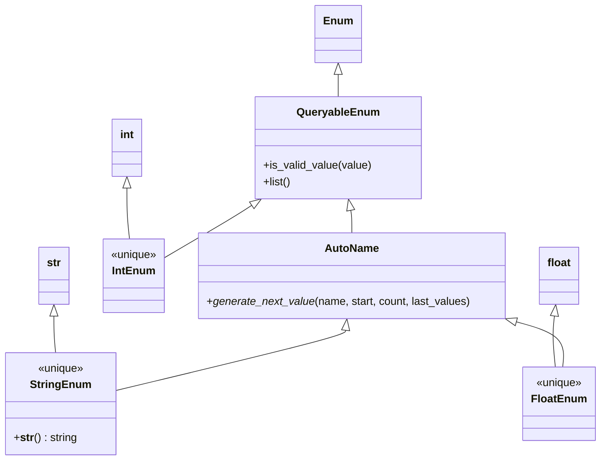

# Diagram: fv_core/fv_framework/python/fv_framework/common/enum.py

> Auto-generated by Obscura crawlers

## Mermaid

### SVG

<svg id="container" width="879.2890625" xmlns="http://www.w3.org/2000/svg" class="classDiagram" height="676" viewBox="0 0 879.2890625 676" role="graphics-document document" aria-roledescription="class"><g><defs><marker id="container_class-aggregationStart" class="marker aggregation class" refX="18" refY="7" markerWidth="190" markerHeight="240" orient="auto"><path d="M 18,7 L9,13 L1,7 L9,1 Z"></path></marker></defs><defs><marker id="container_class-aggregationEnd" class="marker aggregation class" refX="1" refY="7" markerWidth="20" markerHeight="28" orient="auto"><path d="M 18,7 L9,13 L1,7 L9,1 Z"></path></marker></defs><defs><marker id="container_class-extensionStart" class="marker extension class" refX="18" refY="7" markerWidth="190" markerHeight="240" orient="auto"><path d="M 1,7 L18,13 V 1 Z"></path></marker></defs><defs><marker id="container_class-extensionEnd" class="marker extension class" refX="1" refY="7" markerWidth="20" markerHeight="28" orient="auto"><path d="M 1,1 V 13 L18,7 Z"></path></marker></defs><defs><marker id="container_class-compositionStart" class="marker composition class" refX="18" refY="7" markerWidth="190" markerHeight="240" orient="auto"><path d="M 18,7 L9,13 L1,7 L9,1 Z"></path></marker></defs><defs><marker id="container_class-compositionEnd" class="marker composition class" refX="1" refY="7" markerWidth="20" markerHeight="28" orient="auto"><path d="M 18,7 L9,13 L1,7 L9,1 Z"></path></marker></defs><defs><marker id="container_class-dependencyStart" class="marker dependency class" refX="6" refY="7" markerWidth="190" markerHeight="240" orient="auto"><path d="M 5,7 L9,13 L1,7 L9,1 Z"></path></marker></defs><defs><marker id="container_class-dependencyEnd" class="marker dependency class" refX="13" refY="7" markerWidth="20" markerHeight="28" orient="auto"><path d="M 18,7 L9,13 L14,7 L9,1 Z"></path></marker></defs><defs><marker id="container_class-lollipopStart" class="marker lollipop class" refX="13" refY="7" markerWidth="190" markerHeight="240" orient="auto"><circle stroke="black" fill="transparent" cx="7" cy="7" r="6"></circle></marker></defs><defs><marker id="container_class-lollipopEnd" class="marker lollipop class" refX="1" refY="7" markerWidth="190" markerHeight="240" orient="auto"><circle stroke="black" fill="transparent" cx="7" cy="7" r="6"></circle></marker></defs><g class="root"><g class="clusters"></g><g class="edgePaths"><path d="M497.133,109.25L497.133,110.542C497.133,111.833,497.133,114.417,497.133,119.875C497.133,125.333,497.133,133.667,497.133,137.833L497.133,142" id="id_Enum_QueryableEnum_1" class="edge-thickness-normal edge-pattern-solid relation" style=";;;" data-edge="true" data-et="edge" data-id="id_Enum_QueryableEnum_1" data-points="W3sieCI6NDk3LjEzMjgxMjUsInkiOjkyfSx7IngiOjQ5Ny4xMzI4MTI1LCJ5IjoxMTd9LHsieCI6NDk3LjEzMjgxMjUsInkiOjE0Mn1d" marker-start="url(#container_class-extensionStart)"></path><path d="M515.516,308.915L515.785,310.263C516.055,311.61,516.594,314.305,516.863,319.819C517.133,325.333,517.133,333.667,517.133,337.833L517.133,342" id="id_QueryableEnum_AutoName_2" class="edge-thickness-normal edge-pattern-solid relation" style=";;;" data-edge="true" data-et="edge" data-id="id_QueryableEnum_AutoName_2" data-points="W3sieCI6NTEyLjEzMjgxMjUsInkiOjI5Mn0seyJ4Ijo1MTcuMTMyODEyNSwieSI6MzE3fSx7IngiOjUxNy4xMzI4MTI1LCJ5IjozNDJ9XQ==" marker-start="url(#container_class-extensionStart)"></path><path d="M185.977,276.25L185.977,283.042C185.977,289.833,185.977,303.417,186.621,315.875C187.264,328.333,188.552,339.667,189.196,345.333L189.84,351" id="id_int_IntEnum_3" class="edge-thickness-normal edge-pattern-solid relation" style=";;;" data-edge="true" data-et="edge" data-id="id_int_IntEnum_3" data-points="W3sieCI6MTg1Ljk3NjU2MjUsInkiOjI1OX0seyJ4IjoxODUuOTc2NTYyNSwieSI6MzE3fSx7IngiOjE4OS44NDAxOTg4NjM2MzYzNywieSI6MzUxfV0=" marker-start="url(#container_class-extensionStart)"></path><path d="M369.829,301.543L365.95,304.119C362.071,306.695,354.313,311.848,333.067,324.573C311.82,337.299,277.086,357.599,259.719,367.748L242.352,377.898" id="id_QueryableEnum_IntEnum_4" class="edge-thickness-normal edge-pattern-solid relation" style=";;;" data-edge="true" data-et="edge" data-id="id_QueryableEnum_IntEnum_4" data-points="W3sieCI6Mzg0LjE5OTIxODc1LCJ5IjoyOTJ9LHsieCI6MzQ2LjU1NDY4NzUsInkiOjMxN30seyJ4IjoyNDIuMzUxNTYyNSwieSI6Mzc3Ljg5Nzc4OTc2ODYwMDJ9XQ==" marker-start="url(#container_class-extensionStart)"></path><path d="M77.438,464.25L77.438,469.042C77.438,473.833,77.438,483.417,77.854,492.375C78.271,501.333,79.104,509.667,79.521,513.833L79.938,518" id="id_str_StringEnum_5" class="edge-thickness-normal edge-pattern-solid relation" style=";;;" data-edge="true" data-et="edge" data-id="id_str_StringEnum_5" data-points="W3sieCI6NzcuNDM3NSwieSI6NDQ3fSx7IngiOjc3LjQzNzUsInkiOjQ5M30seyJ4Ijo3OS45Mzc1LCJ5Ijo1MTh9XQ==" marker-start="url(#container_class-extensionStart)"></path><path d="M508.026,485.14L507.877,486.45C507.728,487.76,507.431,490.38,450.572,505.202C393.714,520.024,280.294,547.048,223.585,560.56L166.875,574.073" id="id_AutoName_StringEnum_6" class="edge-thickness-normal edge-pattern-solid relation" style=";;;" data-edge="true" data-et="edge" data-id="id_AutoName_StringEnum_6" data-points="W3sieCI6NTA5Ljk3MzcyMTU5MDkwOTA3LCJ5Ijo0Njh9LHsieCI6NTA3LjEzMjgxMjUsInkiOjQ5M30seyJ4IjoxNjYuODc1LCJ5Ijo1NzQuMDcyNTc4NjkzNjIwN31d" marker-start="url(#container_class-extensionStart)"></path><path d="M814.272,464.14L813.725,468.95C813.179,473.76,812.085,483.38,812.305,495.857C812.526,508.333,814.059,523.667,814.826,531.333L815.592,539" id="id_float_FloatEnum_7" class="edge-thickness-normal edge-pattern-solid relation" style=";;;" data-edge="true" data-et="edge" data-id="id_float_FloatEnum_7" data-points="W3sieCI6ODE2LjIxOTQ2MDIyNzI3MjcsInkiOjQ0N30seyJ4Ijo4MTAuOTkyMTg3NSwieSI6NDkzfSx7IngiOjgxNS41OTIxODc1LCJ5Ijo1Mzl9XQ==" marker-start="url(#container_class-extensionStart)"></path><path d="M758.437,472.657L770.53,476.047C782.622,479.438,806.807,486.219,818.133,497.276C829.459,508.333,827.926,523.667,827.159,531.333L826.392,539" id="id_AutoName_FloatEnum_8" class="edge-thickness-normal edge-pattern-solid relation" style=";;;" data-edge="true" data-et="edge" data-id="id_AutoName_FloatEnum_8" data-points="W3sieCI6NzQxLjgyNzU5MjMyOTU0NTUsInkiOjQ2OH0seyJ4Ijo4MzAuOTkyMTg3NSwieSI6NDkzfSx7IngiOjgyNi4zOTIxODc1LCJ5Ijo1Mzl9XQ==" marker-start="url(#container_class-extensionStart)"></path></g><g class="edgeLabels"><g class="edgeLabel"><g class="label" data-id="id_Enum_QueryableEnum_1" transform="translate(0, 0)"><foreignObject width="0" height="0">

</foreignObject></g></g><g class="edgeLabel"><g class="label" data-id="id_QueryableEnum_AutoName_2" transform="translate(0, 0)"><foreignObject width="0" height="0">

</foreignObject></g></g><g class="edgeLabel"><g class="label" data-id="id_int_IntEnum_3" transform="translate(0, 0)"><foreignObject width="0" height="0">

</foreignObject></g></g><g class="edgeLabel"><g class="label" data-id="id_QueryableEnum_IntEnum_4" transform="translate(0, 0)"><foreignObject width="0" height="0">

</foreignObject></g></g><g class="edgeLabel"><g class="label" data-id="id_str_StringEnum_5" transform="translate(0, 0)"><foreignObject width="0" height="0">

</foreignObject></g></g><g class="edgeLabel"><g class="label" data-id="id_AutoName_StringEnum_6" transform="translate(0, 0)"><foreignObject width="0" height="0">

</foreignObject></g></g><g class="edgeLabel"><g class="label" data-id="id_float_FloatEnum_7" transform="translate(0, 0)"><foreignObject width="0" height="0">

</foreignObject></g></g><g class="edgeLabel"><g class="label" data-id="id_AutoName_FloatEnum_8" transform="translate(0, 0)"><foreignObject width="0" height="0">

</foreignObject></g></g></g><g class="nodes"><g class="node default" id="classId-Enum-0" transform="translate(497.1328125, 50)"><g class="basic label-container"><path d="M-32.0859375 -42 L32.0859375 -42 L32.0859375 42 L-32.0859375 42" stroke="none" stroke-width="0" fill="#ECECFF" style=""></path><path d="M-32.0859375 -42 C-19.103134141339304 -42, -6.120330782678604 -42, 32.0859375 -42 M-32.0859375 -42 C-6.558425904761432 -42, 18.969085690477137 -42, 32.0859375 -42 M32.0859375 -42 C32.0859375 -22.96216323040898, 32.0859375 -3.9243264608179587, 32.0859375 42 M32.0859375 -42 C32.0859375 -12.3644573272605, 32.0859375 17.271085345479, 32.0859375 42 M32.0859375 42 C12.273019715844988 42, -7.539898068310023 42, -32.0859375 42 M32.0859375 42 C16.699143275756892 42, 1.3123490515137846 42, -32.0859375 42 M-32.0859375 42 C-32.0859375 22.729878914355176, -32.0859375 3.4597578287103516, -32.0859375 -42 M-32.0859375 42 C-32.0859375 22.484880425682082, -32.0859375 2.969760851364164, -32.0859375 -42" stroke="#9370DB" stroke-width="1.3" fill="none" stroke-dasharray="0 0" style=""></path></g><g class="annotation-group text" transform="translate(0, -18)"></g><g class="label-group text" transform="translate(-20.0859375, -18)"><g class="label" style="font-weight: bolder" transform="translate(0,-12)"><foreignObject width="40.171875" height="24">

Enum

</foreignObject></g></g><g class="members-group text" transform="translate(-20.0859375, 30)"></g><g class="methods-group text" transform="translate(-20.0859375, 60)"></g><g class="divider" style=""><path d="M-32.0859375 6 C-10.59986371342075 6, 10.886210073158502 6, 32.0859375 6 M-32.0859375 6 C-13.693674242859746 6, 4.698589014280508 6, 32.0859375 6" stroke="#9370DB" stroke-width="1.3" fill="none" stroke-dasharray="0 0" style=""></path></g><g class="divider" style=""><path d="M-32.0859375 24 C-12.894828845817642 24, 6.296279808364716 24, 32.0859375 24 M-32.0859375 24 C-18.671771312599653 24, -5.257605125199309 24, 32.0859375 24" stroke="#9370DB" stroke-width="1.3" fill="none" stroke-dasharray="0 0" style=""></path></g></g><g class="node default" id="classId-QueryableEnum-1" transform="translate(497.1328125, 217)"><g class="basic label-container"><path d="M-120.0390625 -75 L120.0390625 -75 L120.0390625 75 L-120.0390625 75" stroke="none" stroke-width="0" fill="#ECECFF" style=""></path><path d="M-120.0390625 -75 C-44.632748857224925 -75, 30.77356478555015 -75, 120.0390625 -75 M-120.0390625 -75 C-64.18613024416446 -75, -8.33319798832892 -75, 120.0390625 -75 M120.0390625 -75 C120.0390625 -26.1217003186024, 120.0390625 22.7565993627952, 120.0390625 75 M120.0390625 -75 C120.0390625 -44.31670501916487, 120.0390625 -13.63341003832975, 120.0390625 75 M120.0390625 75 C59.67120186629547 75, -0.6966587674090619 75, -120.0390625 75 M120.0390625 75 C54.25577564507587 75, -11.527511209848257 75, -120.0390625 75 M-120.0390625 75 C-120.0390625 43.07222288272233, -120.0390625 11.144445765444658, -120.0390625 -75 M-120.0390625 75 C-120.0390625 18.114893261058974, -120.0390625 -38.77021347788205, -120.0390625 -75" stroke="#9370DB" stroke-width="1.3" fill="none" stroke-dasharray="0 0" style=""></path></g><g class="annotation-group text" transform="translate(0, -51)"></g><g class="label-group text" transform="translate(-57.6875, -51)"><g class="label" style="font-weight: bolder" transform="translate(0,-12)"><foreignObject width="115.375" height="24">

QueryableEnum

</foreignObject></g></g><g class="members-group text" transform="translate(-108.0390625, -3)"></g><g class="methods-group text" transform="translate(-108.0390625, 27)"><g class="label" style="" transform="translate(0,-12)"><foreignObject width="158.390625" height="24">

+is_valid_value(value)

</foreignObject></g><g class="label" style="" transform="translate(0,12)"><foreignObject width="40.8125" height="24">

+list()

</foreignObject></g></g><g class="divider" style=""><path d="M-120.0390625 -27 C-48.58360300385567 -27, 22.871856492288657 -27, 120.0390625 -27 M-120.0390625 -27 C-67.48857064867683 -27, -14.938078797353654 -27, 120.0390625 -27" stroke="#9370DB" stroke-width="1.3" fill="none" stroke-dasharray="0 0" style=""></path></g><g class="divider" style=""><path d="M-120.0390625 -3 C-50.177034717181 -3, 19.684993065637997 -3, 120.0390625 -3 M-120.0390625 -3 C-62.06586492092637 -3, -4.092667341852746 -3, 120.0390625 -3" stroke="#9370DB" stroke-width="1.3" fill="none" stroke-dasharray="0 0" style=""></path></g></g><g class="node default" id="classId-AutoName-2" transform="translate(517.1328125, 405)"><g class="basic label-container"><path d="M-224.78125 -63 L224.78125 -63 L224.78125 63 L-224.78125 63" stroke="none" stroke-width="0" fill="#ECECFF" style=""></path><path d="M-224.78125 -63 C-53.14842292241411 -63, 118.48440415517177 -63, 224.78125 -63 M-224.78125 -63 C-91.60735247176319 -63, 41.566545056473615 -63, 224.78125 -63 M224.78125 -63 C224.78125 -15.256827958618302, 224.78125 32.486344082763395, 224.78125 63 M224.78125 -63 C224.78125 -31.199696096352916, 224.78125 0.6006078072941676, 224.78125 63 M224.78125 63 C121.71186292078626 63, 18.64247584157252 63, -224.78125 63 M224.78125 63 C46.03258219163763 63, -132.71608561672474 63, -224.78125 63 M-224.78125 63 C-224.78125 21.289703272509605, -224.78125 -20.42059345498079, -224.78125 -63 M-224.78125 63 C-224.78125 24.87348841068198, -224.78125 -13.253023178636042, -224.78125 -63" stroke="#9370DB" stroke-width="1.3" fill="none" stroke-dasharray="0 0" style=""></path></g><g class="annotation-group text" transform="translate(0, -39)"></g><g class="label-group text" transform="translate(-37.78125, -39)"><g class="label" style="font-weight: bolder" transform="translate(0,-12)"><foreignObject width="75.5625" height="24">

AutoName

</foreignObject></g></g><g class="members-group text" transform="translate(-212.78125, 9)"></g><g class="methods-group text" transform="translate(-212.78125, 39)"><g class="label" style="" transform="translate(0,-12)"><foreignObject width="387.78125" height="24">

+<em>generate_next_value</em>(name, start, count, last_values)

</foreignObject></g></g><g class="divider" style=""><path d="M-224.78125 -15 C-53.728280627917655 -15, 117.32468874416469 -15, 224.78125 -15 M-224.78125 -15 C-81.70977477427965 -15, 61.3617004514407 -15, 224.78125 -15" stroke="#9370DB" stroke-width="1.3" fill="none" stroke-dasharray="0 0" style=""></path></g><g class="divider" style=""><path d="M-224.78125 9 C-74.59235275326978 9, 75.59654449346044 9, 224.78125 9 M-224.78125 9 C-97.29056024965953 9, 30.20012950068093 9, 224.78125 9" stroke="#9370DB" stroke-width="1.3" fill="none" stroke-dasharray="0 0" style=""></path></g></g><g class="node default" id="classId-int-3" transform="translate(185.9765625, 217)"><g class="basic label-container"><path d="M-21.9609375 -42 L21.9609375 -42 L21.9609375 42 L-21.9609375 42" stroke="none" stroke-width="0" fill="#ECECFF" style=""></path><path d="M-21.9609375 -42 C-8.948176927266848 -42, 4.064583645466303 -42, 21.9609375 -42 M-21.9609375 -42 C-9.488936115819497 -42, 2.983065268361006 -42, 21.9609375 -42 M21.9609375 -42 C21.9609375 -16.395424857374927, 21.9609375 9.209150285250146, 21.9609375 42 M21.9609375 -42 C21.9609375 -11.925435683941522, 21.9609375 18.149128632116955, 21.9609375 42 M21.9609375 42 C8.915310301187313 42, -4.130316897625374 42, -21.9609375 42 M21.9609375 42 C9.378551544651271 42, -3.203834410697457 42, -21.9609375 42 M-21.9609375 42 C-21.9609375 23.4152537005814, -21.9609375 4.830507401162798, -21.9609375 -42 M-21.9609375 42 C-21.9609375 12.503209252330052, -21.9609375 -16.993581495339896, -21.9609375 -42" stroke="#9370DB" stroke-width="1.3" fill="none" stroke-dasharray="0 0" style=""></path></g><g class="annotation-group text" transform="translate(0, -18)"></g><g class="label-group text" transform="translate(-9.9609375, -18)"><g class="label" style="font-weight: bolder" transform="translate(0,-12)"><foreignObject width="19.921875" height="24">

int

</foreignObject></g></g><g class="members-group text" transform="translate(-9.9609375, 30)"></g><g class="methods-group text" transform="translate(-9.9609375, 60)"></g><g class="divider" style=""><path d="M-21.9609375 6 C-7.190090250539127 6, 7.580756998921746 6, 21.9609375 6 M-21.9609375 6 C-9.168400317167325 6, 3.624136865665349 6, 21.9609375 6" stroke="#9370DB" stroke-width="1.3" fill="none" stroke-dasharray="0 0" style=""></path></g><g class="divider" style=""><path d="M-21.9609375 24 C-9.369029436980522 24, 3.2228786260389555 24, 21.9609375 24 M-21.9609375 24 C-12.540418814230193 24, -3.1199001284603867 24, 21.9609375 24" stroke="#9370DB" stroke-width="1.3" fill="none" stroke-dasharray="0 0" style=""></path></g></g><g class="node default" id="classId-IntEnum-4" transform="translate(195.9765625, 405)"><g class="basic label-container"><path d="M-46.375 -54 L46.375 -54 L46.375 54 L-46.375 54" stroke="none" stroke-width="0" fill="#ECECFF" style=""></path><path d="M-46.375 -54 C-9.52538766374252 -54, 27.32422467251496 -54, 46.375 -54 M-46.375 -54 C-16.884210943217038 -54, 12.606578113565924 -54, 46.375 -54 M46.375 -54 C46.375 -13.69261262604698, 46.375 26.61477474790604, 46.375 54 M46.375 -54 C46.375 -27.40724488515431, 46.375 -0.8144897703086187, 46.375 54 M46.375 54 C13.78302530851456 54, -18.80894938297088 54, -46.375 54 M46.375 54 C24.82254372231529 54, 3.270087444630583 54, -46.375 54 M-46.375 54 C-46.375 20.816011412798133, -46.375 -12.367977174403734, -46.375 -54 M-46.375 54 C-46.375 31.76628245086546, -46.375 9.532564901730922, -46.375 -54" stroke="#9370DB" stroke-width="1.3" fill="none" stroke-dasharray="0 0" style=""></path></g><g class="annotation-group text" transform="translate(-34.375, -30)"><g class="label" style="" transform="translate(0,-12)"><foreignObject width="68.75" height="24">

«unique»

</foreignObject></g></g><g class="label-group text" transform="translate(-30.1328125, -6)"><g class="label" style="font-weight: bolder" transform="translate(0,-12)"><foreignObject width="60.265625" height="24">

IntEnum

</foreignObject></g></g><g class="members-group text" transform="translate(-34.375, 42)"></g><g class="methods-group text" transform="translate(-34.375, 72)"></g><g class="divider" style=""><path d="M-46.375 18 C-16.548975366349595 18, 13.27704926730081 18, 46.375 18 M-46.375 18 C-17.14551050760814 18, 12.08397898478372 18, 46.375 18" stroke="#9370DB" stroke-width="1.3" fill="none" stroke-dasharray="0 0" style=""></path></g><g class="divider" style=""><path d="M-46.375 36 C-23.347281673001316 36, -0.3195633460026315 36, 46.375 36 M-46.375 36 C-23.665115002521773 36, -0.9552300050435463 36, 46.375 36" stroke="#9370DB" stroke-width="1.3" fill="none" stroke-dasharray="0 0" style=""></path></g></g><g class="node default" id="classId-str-5" transform="translate(77.4375, 405)"><g class="basic label-container"><path d="M-22.1640625 -42 L22.1640625 -42 L22.1640625 42 L-22.1640625 42" stroke="none" stroke-width="0" fill="#ECECFF" style=""></path><path d="M-22.1640625 -42 C-11.74382075705051 -42, -1.3235790141010213 -42, 22.1640625 -42 M-22.1640625 -42 C-6.743999211756256 -42, 8.676064076487489 -42, 22.1640625 -42 M22.1640625 -42 C22.1640625 -15.813681630525924, 22.1640625 10.372636738948152, 22.1640625 42 M22.1640625 -42 C22.1640625 -22.113658957845217, 22.1640625 -2.227317915690435, 22.1640625 42 M22.1640625 42 C5.283695579295237 42, -11.596671341409525 42, -22.1640625 42 M22.1640625 42 C5.261364795237171 42, -11.641332909525659 42, -22.1640625 42 M-22.1640625 42 C-22.1640625 22.481868474662182, -22.1640625 2.963736949324364, -22.1640625 -42 M-22.1640625 42 C-22.1640625 15.323207013044868, -22.1640625 -11.353585973910263, -22.1640625 -42" stroke="#9370DB" stroke-width="1.3" fill="none" stroke-dasharray="0 0" style=""></path></g><g class="annotation-group text" transform="translate(0, -18)"></g><g class="label-group text" transform="translate(-10.1640625, -18)"><g class="label" style="font-weight: bolder" transform="translate(0,-12)"><foreignObject width="20.328125" height="24">

str

</foreignObject></g></g><g class="members-group text" transform="translate(-10.1640625, 30)"></g><g class="methods-group text" transform="translate(-10.1640625, 60)"></g><g class="divider" style=""><path d="M-22.1640625 6 C-6.609994673551869 6, 8.944073152896262 6, 22.1640625 6 M-22.1640625 6 C-10.053155738274695 6, 2.05775102345061 6, 22.1640625 6" stroke="#9370DB" stroke-width="1.3" fill="none" stroke-dasharray="0 0" style=""></path></g><g class="divider" style=""><path d="M-22.1640625 24 C-7.873367662750356 24, 6.417327174499288 24, 22.1640625 24 M-22.1640625 24 C-8.689984988129522 24, 4.784092523740956 24, 22.1640625 24" stroke="#9370DB" stroke-width="1.3" fill="none" stroke-dasharray="0 0" style=""></path></g></g><g class="node default" id="classId-StringEnum-6" transform="translate(87.4375, 593)"><g class="basic label-container"><path d="M-79.4375 -75 L79.4375 -75 L79.4375 75 L-79.4375 75" stroke="none" stroke-width="0" fill="#ECECFF" style=""></path><path d="M-79.4375 -75 C-21.125629465430215 -75, 37.18624106913957 -75, 79.4375 -75 M-79.4375 -75 C-43.08196085637064 -75, -6.726421712741285 -75, 79.4375 -75 M79.4375 -75 C79.4375 -37.2346352709101, 79.4375 0.5307294581798061, 79.4375 75 M79.4375 -75 C79.4375 -31.177239889006117, 79.4375 12.645520221987766, 79.4375 75 M79.4375 75 C38.233322464427005 75, -2.9708550711459907 75, -79.4375 75 M79.4375 75 C43.80999080773626 75, 8.182481615472526 75, -79.4375 75 M-79.4375 75 C-79.4375 37.9025942583744, -79.4375 0.8051885167487995, -79.4375 -75 M-79.4375 75 C-79.4375 38.00611621051682, -79.4375 1.0122324210336444, -79.4375 -75" stroke="#9370DB" stroke-width="1.3" fill="none" stroke-dasharray="0 0" style=""></path></g><g class="annotation-group text" transform="translate(-34.375, -51)"><g class="label" style="" transform="translate(0,-12)"><foreignObject width="68.75" height="24">

«unique»

</foreignObject></g></g><g class="label-group text" transform="translate(-42.234375, -27)"><g class="label" style="font-weight: bolder" transform="translate(0,-12)"><foreignObject width="84.46875" height="24">

StringEnum

</foreignObject></g></g><g class="members-group text" transform="translate(-67.4375, 21)"></g><g class="methods-group text" transform="translate(-67.4375, 51)"><g class="label" style="" transform="translate(0,-12)"><foreignObject width="92.640625" height="24">

+<strong>str</strong>() : string

</foreignObject></g></g><g class="divider" style=""><path d="M-79.4375 -3 C-30.991372030981488 -3, 17.454755938037025 -3, 79.4375 -3 M-79.4375 -3 C-41.35084036904137 -3, -3.264180738082743 -3, 79.4375 -3" stroke="#9370DB" stroke-width="1.3" fill="none" stroke-dasharray="0 0" style=""></path></g><g class="divider" style=""><path d="M-79.4375 21 C-23.107145515074258 21, 33.223208969851484 21, 79.4375 21 M-79.4375 21 C-18.49065097954159 21, 42.45619804091682 21, 79.4375 21" stroke="#9370DB" stroke-width="1.3" fill="none" stroke-dasharray="0 0" style=""></path></g></g><g class="node default" id="classId-float-7" transform="translate(820.9921875, 405)"><g class="basic label-container"><path d="M-29.078125 -42 L29.078125 -42 L29.078125 42 L-29.078125 42" stroke="none" stroke-width="0" fill="#ECECFF" style=""></path><path d="M-29.078125 -42 C-6.376087717180532 -42, 16.325949565638936 -42, 29.078125 -42 M-29.078125 -42 C-13.153110440614036 -42, 2.7719041187719284 -42, 29.078125 -42 M29.078125 -42 C29.078125 -18.560516637860644, 29.078125 4.878966724278712, 29.078125 42 M29.078125 -42 C29.078125 -17.724885269010546, 29.078125 6.550229461978908, 29.078125 42 M29.078125 42 C11.365513059506597 42, -6.347098880986806 42, -29.078125 42 M29.078125 42 C11.255504408361837 42, -6.567116183276326 42, -29.078125 42 M-29.078125 42 C-29.078125 14.91034818229025, -29.078125 -12.179303635419501, -29.078125 -42 M-29.078125 42 C-29.078125 9.7227552680002, -29.078125 -22.5544894639996, -29.078125 -42" stroke="#9370DB" stroke-width="1.3" fill="none" stroke-dasharray="0 0" style=""></path></g><g class="annotation-group text" transform="translate(0, -18)"></g><g class="label-group text" transform="translate(-17.078125, -18)"><g class="label" style="font-weight: bolder" transform="translate(0,-12)"><foreignObject width="34.15625" height="24">

float

</foreignObject></g></g><g class="members-group text" transform="translate(-17.078125, 30)"></g><g class="methods-group text" transform="translate(-17.078125, 60)"></g><g class="divider" style=""><path d="M-29.078125 6 C-6.921747065054934 6, 15.234630869890132 6, 29.078125 6 M-29.078125 6 C-9.404395459847809 6, 10.269334080304382 6, 29.078125 6" stroke="#9370DB" stroke-width="1.3" fill="none" stroke-dasharray="0 0" style=""></path></g><g class="divider" style=""><path d="M-29.078125 24 C-6.788218664463653 24, 15.501687671072695 24, 29.078125 24 M-29.078125 24 C-6.052865636342549 24, 16.972393727314902 24, 29.078125 24" stroke="#9370DB" stroke-width="1.3" fill="none" stroke-dasharray="0 0" style=""></path></g></g><g class="node default" id="classId-FloatEnum-8" transform="translate(820.9921875, 593)"><g class="basic label-container"><path d="M-50.296875 -54 L50.296875 -54 L50.296875 54 L-50.296875 54" stroke="none" stroke-width="0" fill="#ECECFF" style=""></path><path d="M-50.296875 -54 C-26.927478494787895 -54, -3.55808198957579 -54, 50.296875 -54 M-50.296875 -54 C-20.22752899145791 -54, 9.841817017084182 -54, 50.296875 -54 M50.296875 -54 C50.296875 -29.689336855537107, 50.296875 -5.378673711074214, 50.296875 54 M50.296875 -54 C50.296875 -21.801794580713974, 50.296875 10.396410838572052, 50.296875 54 M50.296875 54 C10.534794498907345 54, -29.22728600218531 54, -50.296875 54 M50.296875 54 C27.344768700641637 54, 4.392662401283275 54, -50.296875 54 M-50.296875 54 C-50.296875 26.36791216261593, -50.296875 -1.2641756747681399, -50.296875 -54 M-50.296875 54 C-50.296875 21.354455663938957, -50.296875 -11.291088672122086, -50.296875 -54" stroke="#9370DB" stroke-width="1.3" fill="none" stroke-dasharray="0 0" style=""></path></g><g class="annotation-group text" transform="translate(-34.375, -30)"><g class="label" style="" transform="translate(0,-12)"><foreignObject width="68.75" height="24">

«unique»

</foreignObject></g></g><g class="label-group text" transform="translate(-38.296875, -6)"><g class="label" style="font-weight: bolder" transform="translate(0,-12)"><foreignObject width="76.59375" height="24">

FloatEnum

</foreignObject></g></g><g class="members-group text" transform="translate(-38.296875, 42)"></g><g class="methods-group text" transform="translate(-38.296875, 72)"></g><g class="divider" style=""><path d="M-50.296875 18 C-24.935762812371465 18, 0.4253493752570705 18, 50.296875 18 M-50.296875 18 C-18.326444681187038 18, 13.643985637625924 18, 50.296875 18" stroke="#9370DB" stroke-width="1.3" fill="none" stroke-dasharray="0 0" style=""></path></g><g class="divider" style=""><path d="M-50.296875 36 C-16.70047903019877 36, 16.895916939602458 36, 50.296875 36 M-50.296875 36 C-18.5558368369216 36, 13.1852013261568 36, 50.296875 36" stroke="#9370DB" stroke-width="1.3" fill="none" stroke-dasharray="0 0" style=""></path></g></g></g></g></g></svg>
