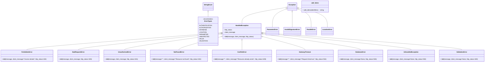

# Diagram: fv_core/fv_framework/python/fv_framework/common/error.py

> Auto-generated by Obscura crawlers

## Mermaid

```mermaid
classDiagram
class ErrorTypes {
  <<enumeration>>
  AUTHENTICATION
  AUTHORIZATION
  DATABASE
  LOCATION
  PARAMETER
  UNEXPECTED
  VALUE
  VALIDATION
}
class StringEnum
StringEnum <|-- ErrorTypes

class Exception
class HandledException {
  - http_status
  - client_message
  + __init__(message, client_message, http_status)
}
Exception <|-- HandledException

class ForbiddenError {
  + __init__(message, client_message="Access denied", http_status=403)
}
class BadRequestError {
  + __init__(message, client_message, http_status=400)
}
class UnauthorizedError {
  + __init__(message, client_message, http_status=401)
}
class NotFoundError {
  + __init__(message="", client_message="Resource not found", http_status=404)
}
class ConflictError {
  + __init__(message="", client_message="Resource already exists", http_status=409)
}
class GatewayTimeout {
  + __init__(message="", client_message="Request timed out", http_status=504)
}
class DatabaseError {
  + __init__(message, client_message=None, http_status=500)
}
class UnhandledException {
  + __init__(message, client_message=None, http_status=500)
}
class ValidationError {
  + __init__(message, client_message=None, http_status=400)
}

HandledException <|-- ForbiddenError
HandledException <|-- BadRequestError
HandledException <|-- UnauthorizedError
HandledException <|-- NotFoundError
HandledException <|-- ConflictError
HandledException <|-- GatewayTimeout
HandledException <|-- DatabaseError
HandledException <|-- UnhandledException
HandledException <|-- ValidationError

class ParameterError
class InvalidSignatureError
class ParallelError
class LocationError

Exception <|-- ParameterError
Exception <|-- InvalidSignatureError
Exception <|-- ParallelError
Exception <|-- LocationError

class add_idens {
  + add_idens(identifiers) : string
}
```

> SVG rendering failed for this diagram.
