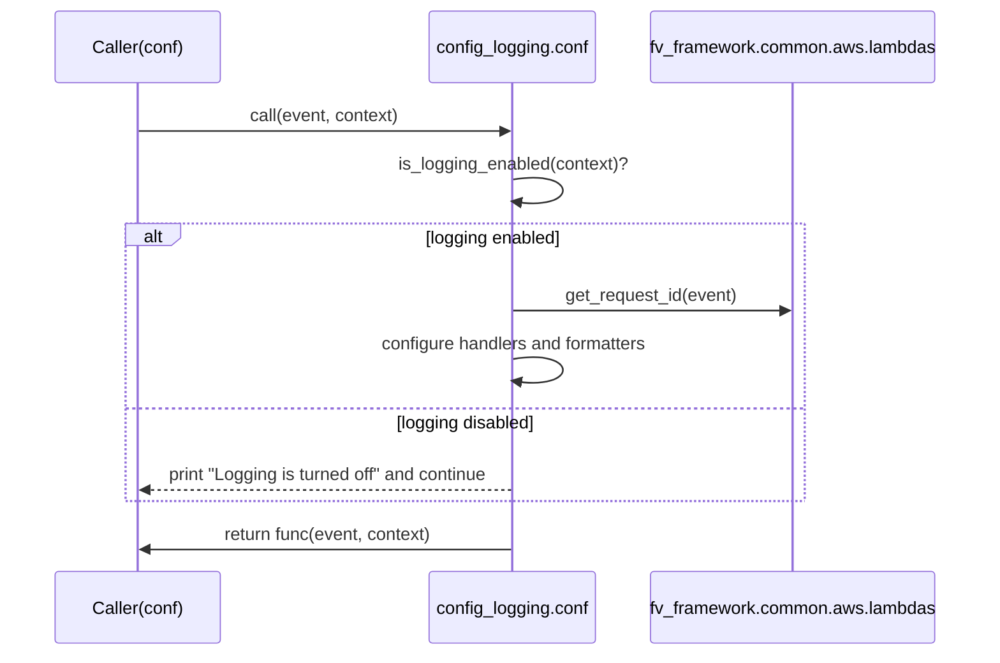
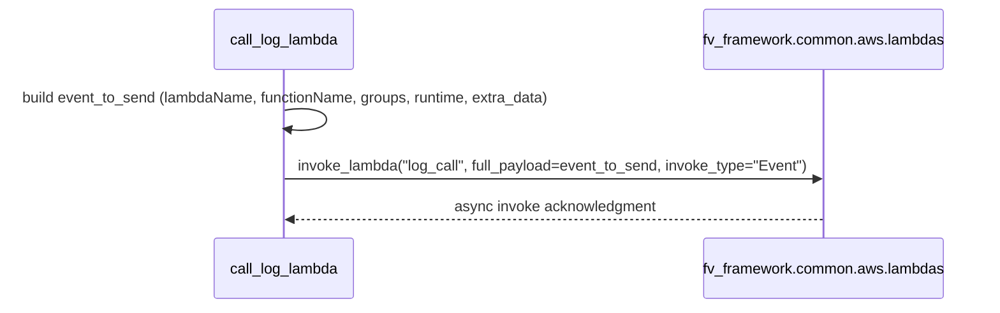

# Diagram: fv_core/fv_framework/python/fv_framework/common/log.py


> Auto-generated by Obscura crawlers

## Diagram 1

```mermaid
classDiagram
    class ISO8601LogFormatter {
        +formatTime(record, datefmt)
        +converter
        +default_time_format
        +default_msec_format
    }
    class StringLogFormatter {
        +formatMessage(record)
    }
    class StructuredLogFormatter {
        +format(record)
    }
    class LoggingFilter {
        +filter(record)
    }
    class StringLogFilter {
        +filter(record)
    }
    class StructuredLogFilter {
        +filter(record)
    }
    class config_logging {
        +conf(event, context)
    }
    class configure_logging {
        +configure_logging(log_level, log_format, request_id)
    }
    class make_log_record {
        +make_log_record(message, function, event, client_error, http_status, audit_refs, error_type, trace, duration, result)
    }
    class log_with_stack {
        +log_with_stack(message, logger, level)
    }
    class log_elapsed_time {
        +decorator(*args, **kwargs)
    }
    class call_log_lambda {
        +call_log_lambda(lambda_name, function_name, groups, runtime, extra_data)
    }

    ISO8601LogFormatter <|-- StringLogFormatter
    ISO8601LogFormatter <|-- StructuredLogFormatter
    LoggingFilter <|-- StringLogFilter
    LoggingFilter <|-- StructuredLogFilter

    config_logging --> StringLogFormatter : uses
    config_logging --> StructuredLogFormatter : uses
    config_logging --> StringLogFilter : adds
    config_logging --> StructuredLogFilter : adds
    config_logging --> configure_logging : related
    configure_logging --> StringLogFormatter : uses
    configure_logging --> StructuredLogFormatter : uses
    make_log_record --> os.environ : reads
    call_log_lambda --> fv_framework.common.aws.lambdas : invokes
    log_elapsed_time --> logging : logs elapsed time
    log_with_stack --> inspect : builds stack trace
```



> SVG rendering failed for this diagram.

## Diagram 2

```mermaid
flowchart TD
    Start[Invoke decorated function (conf)] --> Check{is_logging_enabled(context)?}
    Check -- Yes --> ReqId[Get request_id via fv_framework.common.aws.lambdas.get_request_id(event)]
    ReqId --> Clear[Remove existing root logger handlers]
    Clear --> SetLevel[Set root logger level (LOG_LEVEL or default)]
    SetLevel --> CreateStructured[Create structured handler]
    SetLevel --> CreateString[Create string handler]
    CreateStructured --> ApplyStructuredFmt[Set StructuredLogFormatter(format)]
    CreateStructured --> AddStructuredFilter[Add StructuredLogFilter]
    CreateString --> ApplyStringFmt[Set StringLogFormatter(format)]
    CreateString --> AddStringFilter[Add StringLogFilter]
    ApplyStructuredFmt --> AddStructuredFilter
    ApplyStringFmt --> AddStringFilter
    AddStructuredFilter --> AddHandlers[Add handlers to root logger]
    AddStringFilter --> AddHandlers
    AddHandlers --> CallWrapped[Call wrapped function -> func(event, context)]
    Check -- No --> SkipConfig[Logging turned off or not configured]
    SkipConfig --> CallWrapped
```

> SVG rendering failed for this diagram.

## Diagram 3



> SVG rendering failed for this diagram.

## Diagram 4



> SVG rendering failed for this diagram.
