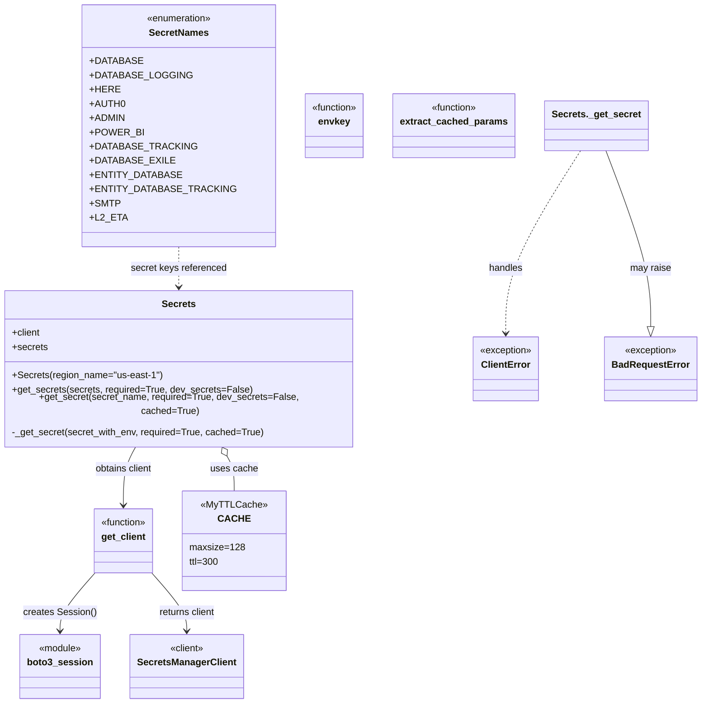

# Diagram: fv_core/fv_framework/python/fv_framework/common/secrets/__init__.py


> Auto-generated by Obscura crawlers

## Diagram 1



> SVG rendering failed for this diagram.

## Diagram 2

```mermaid
sequenceDiagram
participant Caller as Caller
participant S as Secrets
participant C as CACHE
participant SM as SecretsManager
participant BE as BadRequestError

Caller->>S: get_secret(secret_name, required=True, dev_secrets=False, cached=True)
S->>S: compute stage and secret_with_env
S->>C: check cached key (envkey)
alt cache hit
C-->>S: cached secret
S-->>Caller: return secret (dotdict)
else cache miss
S->>SM: get_secret_value(SecretId=secret_with_env)
alt secret string present
SM-->>S: {SecretString: "..."}
S->>S: parse JSON -> dotdict
S-->>C: store in cache
S-->>Caller: return secret (dotdict)
else ResourceNotFoundException
SM-->>S: ResourceNotFoundException
alt required == True
S-->>Caller: log error and raise exception
else required == False
S-->>Caller: log warning and return None
end
else ClientError
SM-->>S: ClientError
alt required == True
S-->>Caller: log error and raise
else required == False
S-->>Caller: log warning and return None
end
end
```

> SVG rendering failed for this diagram.
