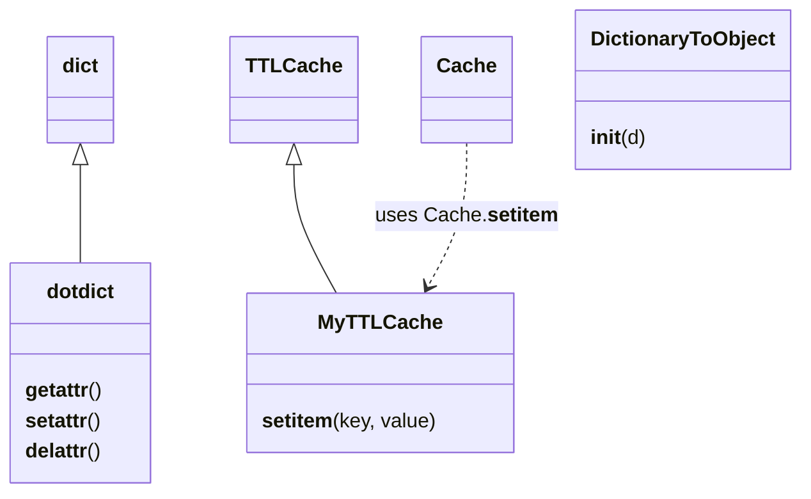

# Diagram: fv_core/fv_framework/python/fv_framework/common/utilities/__init__.py


> Auto-generated by Obscura crawlers

## Diagram 1



> SVG rendering failed for this diagram.

## Diagram 2

```mermaid
graph LR
    subgraph StringUtils
        is_blank["is_blank(str)"]
        is_present["is_present(str)"]
        snake_to_camel["snake_to_camel(str)"]
        snake_to_camel_recur["snake_to_camel_recur(obj)"]
        strip_str["strip_str(str)"]
        strip_recur["strip_recur(obj)"]
        split_to_list["split_to_list(str)"]
        add_escape["add_escape_to_backslash(str, remove=False)"]
        fix_wildcards["fix_wildcards(query)"]
    end
    subgraph Geo
        straight_line_distance["straight_line_distance(p0,p1)"]
        get_distance_waypoints["get_distance_waypoints(waypoints)"]
        get_distance["get_distance(first,sec)"]
    end
    subgraph Validation
        is_valid_lat_long["is_valid_lat_long(lat,lng)"]
        validate_lat_long["validate_lat_long(lat,lon)"]
        validate_location_update["validate_location_update(lat,lon)"]
        check_email_format["check_email_format(email)"]
        is_timestamp["is_timestamp(ts_str)"]
    end
    subgraph Time
        datetime_from_iso_format["datetime_from_iso_format(date_str,end=True)"]
        merge_date_and_time["merge_date_and_time(date,time)"]
        timestamp_to_datetime["timestamp_to_datetime(timestamp,to_utc)"]
    end
    subgraph Concurrency
        send_multithreaded_requests["send_multithreaded_requests(func,thread_nums,...)"]
    end
    subgraph Misc
        get_rand_hex["get_rand_hex(length)"]
        unescape["unescape(s)"]
        send_email["send_email(email,body)"]
        dev_to_staging["dev_to_staging(stage,spec_env=\"\")"]
        split_list_even["split_list_even(lst,max_size=1000)"]
    end

    snake_to_camel --> snake_to_camel_recur
    strip_str --> strip_recur
    straight_line_distance --> get_distance_waypoints
    validate_location_update --> validate_lat_long
    is_blank --> is_present
    datetime_from_iso_format --> merge_date_and_time
    timestamp_to_datetime --> datetime_from_iso_format
    get_distance --> straight_line_distance
    fix_wildcards --> strip_str
    send_multithreaded_requests --> get_rand_hex
```

> SVG rendering failed for this diagram.
