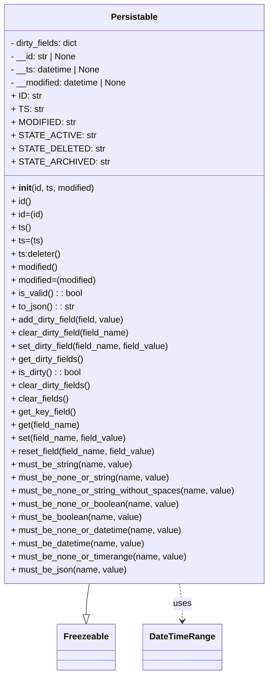

# Diagram: fv_core/fv_framework/python/fv_framework/core/Persistable.py

> Auto-generated by Obscura crawlers

## Mermaid

### SVG

<svg id="container" width="491.3828125" xmlns="http://www.w3.org/2000/svg" class="classDiagram" height="1230" viewBox="0 0 491.3828125 1230" role="graphics-document document" aria-roledescription="class"><g><defs><marker id="container_class-aggregationStart" class="marker aggregation class" refX="18" refY="7" markerWidth="190" markerHeight="240" orient="auto"><path d="M 18,7 L9,13 L1,7 L9,1 Z"></path></marker></defs><defs><marker id="container_class-aggregationEnd" class="marker aggregation class" refX="1" refY="7" markerWidth="20" markerHeight="28" orient="auto"><path d="M 18,7 L9,13 L1,7 L9,1 Z"></path></marker></defs><defs><marker id="container_class-extensionStart" class="marker extension class" refX="18" refY="7" markerWidth="190" markerHeight="240" orient="auto"><path d="M 1,7 L18,13 V 1 Z"></path></marker></defs><defs><marker id="container_class-extensionEnd" class="marker extension class" refX="1" refY="7" markerWidth="20" markerHeight="28" orient="auto"><path d="M 1,1 V 13 L18,7 Z"></path></marker></defs><defs><marker id="container_class-compositionStart" class="marker composition class" refX="18" refY="7" markerWidth="190" markerHeight="240" orient="auto"><path d="M 18,7 L9,13 L1,7 L9,1 Z"></path></marker></defs><defs><marker id="container_class-compositionEnd" class="marker composition class" refX="1" refY="7" markerWidth="20" markerHeight="28" orient="auto"><path d="M 18,7 L9,13 L1,7 L9,1 Z"></path></marker></defs><defs><marker id="container_class-dependencyStart" class="marker dependency class" refX="6" refY="7" markerWidth="190" markerHeight="240" orient="auto"><path d="M 5,7 L9,13 L1,7 L9,1 Z"></path></marker></defs><defs><marker id="container_class-dependencyEnd" class="marker dependency class" refX="13" refY="7" markerWidth="20" markerHeight="28" orient="auto"><path d="M 18,7 L9,13 L14,7 L9,1 Z"></path></marker></defs><defs><marker id="container_class-lollipopStart" class="marker lollipop class" refX="13" refY="7" markerWidth="190" markerHeight="240" orient="auto"><circle stroke="black" fill="transparent" cx="7" cy="7" r="6"></circle></marker></defs><defs><marker id="container_class-lollipopEnd" class="marker lollipop class" refX="1" refY="7" markerWidth="190" markerHeight="240" orient="auto"><circle stroke="black" fill="transparent" cx="7" cy="7" r="6"></circle></marker></defs><g class="root"><g class="clusters"></g><g class="edgePaths"><path d="M166.104,1064L165.175,1070.167C164.245,1076.333,162.386,1088.667,161.457,1098.125C160.527,1107.583,160.527,1114.167,160.527,1117.458L160.527,1120.75" id="id_Persistable_Freezeable_1" class="edge-thickness-normal edge-pattern-solid relation" style=";;;" data-edge="true" data-et="edge" data-id="id_Persistable_Freezeable_1" data-points="W3sieCI6MTY2LjEwNDQ1OTM0NzM0NTE0LCJ5IjoxMDY0fSx7IngiOjE2MC41MjczNDM3NSwieSI6MTEwMX0seyJ4IjoxNjAuNTI3MzQzNzUsInkiOjExMzh9XQ==" marker-end="url(#container_class-extensionEnd)"></path><path d="M325.278,1064L326.208,1070.167C327.137,1076.333,328.996,1088.667,329.926,1100C330.855,1111.333,330.855,1121.667,330.855,1126.833L330.855,1132" id="id_Persistable_DateTimeRange_2" class="edge-thickness-normal edge-pattern-dashed relation" style=";;;" data-edge="true" data-et="edge" data-id="id_Persistable_DateTimeRange_2" data-points="W3sieCI6MzI1LjI3ODM1MzE1MjY1NDg2LCJ5IjoxMDY0fSx7IngiOjMzMC44NTU0Njg3NSwieSI6MTEwMX0seyJ4IjozMzAuODU1NDY4NzUsInkiOjExMzh9XQ==" marker-end="url(#container_class-dependencyEnd)"></path></g><g class="edgeLabels"><g class="edgeLabel"><g class="label" data-id="id_Persistable_Freezeable_1" transform="translate(0, 0)"><foreignObject width="0" height="0">

</foreignObject></g></g><g class="edgeLabel" transform="translate(330.85546875, 1101)"><g class="label" data-id="id_Persistable_DateTimeRange_2" transform="translate(-16.4921875, -12)"><foreignObject width="32.984375" height="24">

uses

</foreignObject></g></g></g><g class="nodes"><g class="node default" id="classId-Freezeable-0" transform="translate(160.52734375, 1180)"><g class="basic label-container"><path d="M-51.1953125 -42 L51.1953125 -42 L51.1953125 42 L-51.1953125 42" stroke="none" stroke-width="0" fill="#ECECFF" style=""></path><path d="M-51.1953125 -42 C-22.345893332087684 -42, 6.503525835824632 -42, 51.1953125 -42 M-51.1953125 -42 C-16.663651748685815 -42, 17.86800900262837 -42, 51.1953125 -42 M51.1953125 -42 C51.1953125 -14.532385697060459, 51.1953125 12.935228605879082, 51.1953125 42 M51.1953125 -42 C51.1953125 -8.561983852455093, 51.1953125 24.876032295089814, 51.1953125 42 M51.1953125 42 C23.5796146728945 42, -4.036083154210999 42, -51.1953125 42 M51.1953125 42 C10.982940280181083 42, -29.229431939637834 42, -51.1953125 42 M-51.1953125 42 C-51.1953125 14.82246313107543, -51.1953125 -12.355073737849139, -51.1953125 -42 M-51.1953125 42 C-51.1953125 22.29665432343256, -51.1953125 2.5933086468651183, -51.1953125 -42" stroke="#9370DB" stroke-width="1.3" fill="none" stroke-dasharray="0 0" style=""></path></g><g class="annotation-group text" transform="translate(0, -18)"></g><g class="label-group text" transform="translate(-39.1953125, -18)"><g class="label" style="font-weight: bolder" transform="translate(0,-12)"><foreignObject width="78.390625" height="24">

Freezeable

</foreignObject></g></g><g class="members-group text" transform="translate(-39.1953125, 30)"></g><g class="methods-group text" transform="translate(-39.1953125, 60)"></g><g class="divider" style=""><path d="M-51.1953125 6 C-16.400658062521238 6, 18.393996374957524 6, 51.1953125 6 M-51.1953125 6 C-19.79836075394399 6, 11.598590992112022 6, 51.1953125 6" stroke="#9370DB" stroke-width="1.3" fill="none" stroke-dasharray="0 0" style=""></path></g><g class="divider" style=""><path d="M-51.1953125 24 C-20.947071159673776 24, 9.301170180652448 24, 51.1953125 24 M-51.1953125 24 C-21.932607005663158 24, 7.330098488673684 24, 51.1953125 24" stroke="#9370DB" stroke-width="1.3" fill="none" stroke-dasharray="0 0" style=""></path></g></g><g class="node default" id="classId-Persistable-1" transform="translate(245.69140625, 536)"><g class="basic label-container"><path d="M-237.69140625 -528 L237.69140625 -528 L237.69140625 528 L-237.69140625 528" stroke="none" stroke-width="0" fill="#ECECFF" style=""></path><path d="M-237.69140625 -528 C-60.00915130087964 -528, 117.67310364824073 -528, 237.69140625 -528 M-237.69140625 -528 C-53.141371215327155 -528, 131.4086638193457 -528, 237.69140625 -528 M237.69140625 -528 C237.69140625 -312.1898200982058, 237.69140625 -96.37964019641163, 237.69140625 528 M237.69140625 -528 C237.69140625 -176.52364626015992, 237.69140625 174.95270747968016, 237.69140625 528 M237.69140625 528 C129.5884670862552 528, 21.485527922510386 528, -237.69140625 528 M237.69140625 528 C88.01347290710646 528, -61.66446043578708 528, -237.69140625 528 M-237.69140625 528 C-237.69140625 152.7817193724054, -237.69140625 -222.4365612551892, -237.69140625 -528 M-237.69140625 528 C-237.69140625 227.96035455182778, -237.69140625 -72.07929089634445, -237.69140625 -528" stroke="#9370DB" stroke-width="1.3" fill="none" stroke-dasharray="0 0" style=""></path></g><g class="annotation-group text" transform="translate(0, -504)"></g><g class="label-group text" transform="translate(-40.9765625, -504)"><g class="label" style="font-weight: bolder" transform="translate(0,-12)"><foreignObject width="81.953125" height="24">

Persistable

</foreignObject></g></g><g class="members-group text" transform="translate(-225.69140625, -456)"><g class="label" style="" transform="translate(0,-12)"><foreignObject width="127.1875" height="24">

- dirty_fields: dict

</foreignObject></g><g class="label" style="" transform="translate(0,12)"><foreignObject width="122.0625" height="24">

- __id: str | None

</foreignObject></g><g class="label" style="" transform="translate(0,36)"><foreignObject width="166.734375" height="24">

- __ts: datetime | None

</foreignObject></g><g class="label" style="" transform="translate(0,60)"><foreignObject width="218.421875" height="24">

- __modified: datetime | None

</foreignObject></g><g class="label" style="" transform="translate(0,84)"><foreignObject width="54.765625" height="24">

+ ID: str

</foreignObject></g><g class="label" style="" transform="translate(0,108)"><foreignObject width="56.40625" height="24">

+ TS: str

</foreignObject></g><g class="label" style="" transform="translate(0,132)"><foreignObject width="109.5625" height="24">

+ MODIFIED: str

</foreignObject></g><g class="label" style="" transform="translate(0,156)"><foreignObject width="137.359375" height="24">

+ STATE_ACTIVE: str

</foreignObject></g><g class="label" style="" transform="translate(0,180)"><foreignObject width="151.625" height="24">

+ STATE_DELETED: str

</foreignObject></g><g class="label" style="" transform="translate(0,204)"><foreignObject width="160.125" height="24">

+ STATE_ARCHIVED: str

</foreignObject></g></g><g class="methods-group text" transform="translate(-225.69140625, -192)"><g class="label" style="" transform="translate(0,-12)"><foreignObject width="155.15625" height="24">

+ <strong>init</strong>(id, ts, modified)

</foreignObject></g><g class="label" style="" transform="translate(0,12)"><foreignObject width="36.6875" height="24">

+ id()

</foreignObject></g><g class="label" style="" transform="translate(0,36)"><foreignObject width="58.765625" height="24">

+ id=(id)

</foreignObject></g><g class="label" style="" transform="translate(0,60)"><foreignObject width="35.84375" height="24">

+ ts()

</foreignObject></g><g class="label" style="" transform="translate(0,84)"><foreignObject width="57.09375" height="24">

+ ts=(ts)

</foreignObject></g><g class="label" style="" transform="translate(0,108)"><foreignObject width="91.734375" height="24">

+ ts:deleter()

</foreignObject></g><g class="label" style="" transform="translate(0,132)"><foreignObject width="87.21875" height="24">

+ modified()

</foreignObject></g><g class="label" style="" transform="translate(0,156)"><foreignObject width="159.84375" height="24">

+ modified=(modified)

</foreignObject></g><g class="label" style="" transform="translate(0,180)"><foreignObject width="130.3125" height="24">

+ is_valid() : : bool

</foreignObject></g><g class="label" style="" transform="translate(0,204)"><foreignObject width="116.546875" height="24">

+ to_json() : : str

</foreignObject></g><g class="label" style="" transform="translate(0,228)"><foreignObject width="210.9375" height="24">

+ add_dirty_field(field, value)

</foreignObject></g><g class="label" style="" transform="translate(0,252)"><foreignObject width="219.390625" height="24">

+ clear_dirty_field(field_name)

</foreignObject></g><g class="label" style="" transform="translate(0,276)"><foreignObject width="293.671875" height="24">

+ set_dirty_field(field_name, field_value)

</foreignObject></g><g class="label" style="" transform="translate(0,300)"><foreignObject width="134.078125" height="24">

+ get_dirty_fields()

</foreignObject></g><g class="label" style="" transform="translate(0,324)"><foreignObject width="129.375" height="24">

+ is_dirty() : : bool

</foreignObject></g><g class="label" style="" transform="translate(0,348)"><foreignObject width="145.921875" height="24">

+ clear_dirty_fields()

</foreignObject></g><g class="label" style="" transform="translate(0,372)"><foreignObject width="104.578125" height="24">

+ clear_fields()

</foreignObject></g><g class="label" style="" transform="translate(0,396)"><foreignObject width="117.671875" height="24">

+ get_key_field()

</foreignObject></g><g class="label" style="" transform="translate(0,420)"><foreignObject width="126.09375" height="24">

+ get(field_name)

</foreignObject></g><g class="label" style="" transform="translate(0,444)"><foreignObject width="212.234375" height="24">

+ set(field_name, field_value)

</foreignObject></g><g class="label" style="" transform="translate(0,468)"><foreignObject width="266.75" height="24">

+ reset_field(field_name, field_value)

</foreignObject></g><g class="label" style="" transform="translate(0,492)"><foreignObject width="222.359375" height="24">

+ must_be_string(name, value)

</foreignObject></g><g class="label" style="" transform="translate(0,516)"><foreignObject width="289.421875" height="24">

+ must_be_none_or_string(name, value)

</foreignObject></g><g class="label" style="" transform="translate(0,540)"><foreignObject width="410.40625" height="24">

+ must_be_none_or_string_without_spaces(name, value)

</foreignObject></g><g class="label" style="" transform="translate(0,564)"><foreignObject width="307.21875" height="24">

+ must_be_none_or_boolean(name, value)

</foreignObject></g><g class="label" style="" transform="translate(0,588)"><foreignObject width="240.171875" height="24">

+ must_be_boolean(name, value)

</foreignObject></g><g class="label" style="" transform="translate(0,612)"><foreignObject width="312.71875" height="24">

+ must_be_none_or_datetime(name, value)

</foreignObject></g><g class="label" style="" transform="translate(0,636)"><foreignObject width="245.65625" height="24">

+ must_be_datetime(name, value)

</foreignObject></g><g class="label" style="" transform="translate(0,660)"><foreignObject width="320.671875" height="24">

+ must_be_none_or_timerange(name, value)

</foreignObject></g><g class="label" style="" transform="translate(0,684)"><foreignObject width="211.96875" height="24">

+ must_be_json(name, value)

</foreignObject></g></g><g class="divider" style=""><path d="M-237.69140625 -480 C-110.91506756151767 -480, 15.861271126964652 -480, 237.69140625 -480 M-237.69140625 -480 C-67.64909823148881 -480, 102.39320978702239 -480, 237.69140625 -480" stroke="#9370DB" stroke-width="1.3" fill="none" stroke-dasharray="0 0" style=""></path></g><g class="divider" style=""><path d="M-237.69140625 -216 C-122.68199724206531 -216, -7.672588234130615 -216, 237.69140625 -216 M-237.69140625 -216 C-141.33642512699998 -216, -44.98144400399994 -216, 237.69140625 -216" stroke="#9370DB" stroke-width="1.3" fill="none" stroke-dasharray="0 0" style=""></path></g></g><g class="node default" id="classId-DateTimeRange-2" transform="translate(330.85546875, 1180)"><g class="basic label-container"><path d="M-69.1328125 -42 L69.1328125 -42 L69.1328125 42 L-69.1328125 42" stroke="none" stroke-width="0" fill="#ECECFF" style=""></path><path d="M-69.1328125 -42 C-29.19996897474457 -42, 10.732874550510857 -42, 69.1328125 -42 M-69.1328125 -42 C-36.2301204249662 -42, -3.327428349932404 -42, 69.1328125 -42 M69.1328125 -42 C69.1328125 -22.962784275552703, 69.1328125 -3.925568551105407, 69.1328125 42 M69.1328125 -42 C69.1328125 -8.943104140810107, 69.1328125 24.113791718379787, 69.1328125 42 M69.1328125 42 C32.304235616818595 42, -4.524341266362811 42, -69.1328125 42 M69.1328125 42 C37.38197916716193 42, 5.631145834323867 42, -69.1328125 42 M-69.1328125 42 C-69.1328125 9.394854581485113, -69.1328125 -23.210290837029774, -69.1328125 -42 M-69.1328125 42 C-69.1328125 12.724976556870008, -69.1328125 -16.550046886259985, -69.1328125 -42" stroke="#9370DB" stroke-width="1.3" fill="none" stroke-dasharray="0 0" style=""></path></g><g class="annotation-group text" transform="translate(0, -18)"></g><g class="label-group text" transform="translate(-57.1328125, -18)"><g class="label" style="font-weight: bolder" transform="translate(0,-12)"><foreignObject width="114.265625" height="24">

DateTimeRange

</foreignObject></g></g><g class="members-group text" transform="translate(-57.1328125, 30)"></g><g class="methods-group text" transform="translate(-57.1328125, 60)"></g><g class="divider" style=""><path d="M-69.1328125 6 C-21.6125132231519 6, 25.9077860536962 6, 69.1328125 6 M-69.1328125 6 C-34.235751549083304 6, 0.6613094018333925 6, 69.1328125 6" stroke="#9370DB" stroke-width="1.3" fill="none" stroke-dasharray="0 0" style=""></path></g><g class="divider" style=""><path d="M-69.1328125 24 C-18.36499185665427 24, 32.40282878669146 24, 69.1328125 24 M-69.1328125 24 C-37.67377437643857 24, -6.214736252877152 24, 69.1328125 24" stroke="#9370DB" stroke-width="1.3" fill="none" stroke-dasharray="0 0" style=""></path></g></g></g></g></g></svg>
