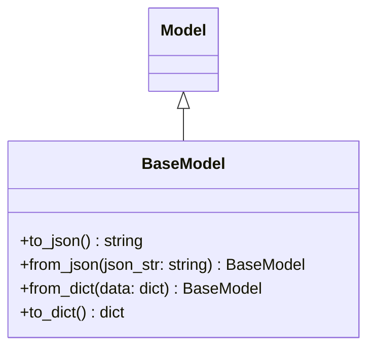

# Diagram: fv_core/fv_framework/python/fv_framework/core/model/base_model.py

> Auto-generated by Obscura crawlers

## Mermaid

### SVG

<svg id="container" width="372.296875" xmlns="http://www.w3.org/2000/svg" class="classDiagram" height="348" viewBox="0 0 372.296875 348" role="graphics-document document" aria-roledescription="class"><g><defs><marker id="container_class-aggregationStart" class="marker aggregation class" refX="18" refY="7" markerWidth="190" markerHeight="240" orient="auto"><path d="M 18,7 L9,13 L1,7 L9,1 Z"></path></marker></defs><defs><marker id="container_class-aggregationEnd" class="marker aggregation class" refX="1" refY="7" markerWidth="20" markerHeight="28" orient="auto"><path d="M 18,7 L9,13 L1,7 L9,1 Z"></path></marker></defs><defs><marker id="container_class-extensionStart" class="marker extension class" refX="18" refY="7" markerWidth="190" markerHeight="240" orient="auto"><path d="M 1,7 L18,13 V 1 Z"></path></marker></defs><defs><marker id="container_class-extensionEnd" class="marker extension class" refX="1" refY="7" markerWidth="20" markerHeight="28" orient="auto"><path d="M 1,1 V 13 L18,7 Z"></path></marker></defs><defs><marker id="container_class-compositionStart" class="marker composition class" refX="18" refY="7" markerWidth="190" markerHeight="240" orient="auto"><path d="M 18,7 L9,13 L1,7 L9,1 Z"></path></marker></defs><defs><marker id="container_class-compositionEnd" class="marker composition class" refX="1" refY="7" markerWidth="20" markerHeight="28" orient="auto"><path d="M 18,7 L9,13 L1,7 L9,1 Z"></path></marker></defs><defs><marker id="container_class-dependencyStart" class="marker dependency class" refX="6" refY="7" markerWidth="190" markerHeight="240" orient="auto"><path d="M 5,7 L9,13 L1,7 L9,1 Z"></path></marker></defs><defs><marker id="container_class-dependencyEnd" class="marker dependency class" refX="13" refY="7" markerWidth="20" markerHeight="28" orient="auto"><path d="M 18,7 L9,13 L14,7 L9,1 Z"></path></marker></defs><defs><marker id="container_class-lollipopStart" class="marker lollipop class" refX="13" refY="7" markerWidth="190" markerHeight="240" orient="auto"><circle stroke="black" fill="transparent" cx="7" cy="7" r="6"></circle></marker></defs><defs><marker id="container_class-lollipopEnd" class="marker lollipop class" refX="1" refY="7" markerWidth="190" markerHeight="240" orient="auto"><circle stroke="black" fill="transparent" cx="7" cy="7" r="6"></circle></marker></defs><g class="root"><g class="clusters"></g><g class="edgePaths"><path d="M186.148,109.25L186.148,110.542C186.148,111.833,186.148,114.417,186.148,119.875C186.148,125.333,186.148,133.667,186.148,137.833L186.148,142" id="id_Model_BaseModel_1" class="edge-thickness-normal edge-pattern-solid relation" style=";;;" data-edge="true" data-et="edge" data-id="id_Model_BaseModel_1" data-points="W3sieCI6MTg2LjE0ODQzNzUsInkiOjkyfSx7IngiOjE4Ni4xNDg0Mzc1LCJ5IjoxMTd9LHsieCI6MTg2LjE0ODQzNzUsInkiOjE0Mn1d" marker-start="url(#container_class-extensionStart)"></path></g><g class="edgeLabels"><g class="edgeLabel"><g class="label" data-id="id_Model_BaseModel_1" transform="translate(0, 0)"><foreignObject width="0" height="0">

</foreignObject></g></g></g><g class="nodes"><g class="node default" id="classId-Model-0" transform="translate(186.1484375, 50)"><g class="basic label-container"><path d="M-34.5546875 -42 L34.5546875 -42 L34.5546875 42 L-34.5546875 42" stroke="none" stroke-width="0" fill="#ECECFF" style=""></path><path d="M-34.5546875 -42 C-12.298620064330173 -42, 9.957447371339654 -42, 34.5546875 -42 M-34.5546875 -42 C-12.253193239339737 -42, 10.048301021320526 -42, 34.5546875 -42 M34.5546875 -42 C34.5546875 -24.433715238678907, 34.5546875 -6.867430477357814, 34.5546875 42 M34.5546875 -42 C34.5546875 -15.432810050636935, 34.5546875 11.13437989872613, 34.5546875 42 M34.5546875 42 C9.756925580086051 42, -15.040836339827898 42, -34.5546875 42 M34.5546875 42 C17.489900361280256 42, 0.42511322256051187 42, -34.5546875 42 M-34.5546875 42 C-34.5546875 16.27441096152188, -34.5546875 -9.45117807695624, -34.5546875 -42 M-34.5546875 42 C-34.5546875 11.072459574065476, -34.5546875 -19.855080851869047, -34.5546875 -42" stroke="#9370DB" stroke-width="1.3" fill="none" stroke-dasharray="0 0" style=""></path></g><g class="annotation-group text" transform="translate(0, -18)"></g><g class="label-group text" transform="translate(-22.5546875, -18)"><g class="label" style="font-weight: bolder" transform="translate(0,-12)"><foreignObject width="45.109375" height="24">

Model

</foreignObject></g></g><g class="members-group text" transform="translate(-22.5546875, 30)"></g><g class="methods-group text" transform="translate(-22.5546875, 60)"></g><g class="divider" style=""><path d="M-34.5546875 6 C-13.744241207396268 6, 7.066205085207464 6, 34.5546875 6 M-34.5546875 6 C-14.3025834480698 6, 5.9495206038604 6, 34.5546875 6" stroke="#9370DB" stroke-width="1.3" fill="none" stroke-dasharray="0 0" style=""></path></g><g class="divider" style=""><path d="M-34.5546875 24 C-7.195377763892164 24, 20.16393197221567 24, 34.5546875 24 M-34.5546875 24 C-13.317943593193203 24, 7.918800313613595 24, 34.5546875 24" stroke="#9370DB" stroke-width="1.3" fill="none" stroke-dasharray="0 0" style=""></path></g></g><g class="node default" id="classId-BaseModel-1" transform="translate(186.1484375, 241)"><g class="basic label-container"><path d="M-178.1484375 -99 L178.1484375 -99 L178.1484375 99 L-178.1484375 99" stroke="none" stroke-width="0" fill="#ECECFF" style=""></path><path d="M-178.1484375 -99 C-81.2066268649419 -99, 15.735183770116208 -99, 178.1484375 -99 M-178.1484375 -99 C-56.83555378130666 -99, 64.47732993738668 -99, 178.1484375 -99 M178.1484375 -99 C178.1484375 -19.936818832696844, 178.1484375 59.12636233460631, 178.1484375 99 M178.1484375 -99 C178.1484375 -57.00381744291982, 178.1484375 -15.007634885839636, 178.1484375 99 M178.1484375 99 C57.34045928736272 99, -63.46751892527456 99, -178.1484375 99 M178.1484375 99 C45.689930004306035 99, -86.76857749138793 99, -178.1484375 99 M-178.1484375 99 C-178.1484375 34.46036247380262, -178.1484375 -30.079275052394763, -178.1484375 -99 M-178.1484375 99 C-178.1484375 35.90712823628058, -178.1484375 -27.185743527438845, -178.1484375 -99" stroke="#9370DB" stroke-width="1.3" fill="none" stroke-dasharray="0 0" style=""></path></g><g class="annotation-group text" transform="translate(0, -75)"></g><g class="label-group text" transform="translate(-40.078125, -75)"><g class="label" style="font-weight: bolder" transform="translate(0,-12)"><foreignObject width="80.15625" height="24">

BaseModel

</foreignObject></g></g><g class="members-group text" transform="translate(-166.1484375, -27)"></g><g class="methods-group text" transform="translate(-166.1484375, 3)"><g class="label" style="" transform="translate(0,-12)"><foreignObject width="126.359375" height="24">

+to_json() : string

</foreignObject></g><g class="label" style="" transform="translate(0,12)"><foreignObject width="292.21875" height="24">

+from_json(json_str: string) : BaseModel

</foreignObject></g><g class="label" style="" transform="translate(0,36)"><foreignObject width="247.515625" height="24">

+from_dict(data: dict) : BaseModel

</foreignObject></g><g class="label" style="" transform="translate(0,60)"><foreignObject width="108.171875" height="24">

+to_dict() : dict

</foreignObject></g></g><g class="divider" style=""><path d="M-178.1484375 -51 C-84.8779017147027 -51, 8.392634070594596 -51, 178.1484375 -51 M-178.1484375 -51 C-80.30728058983061 -51, 17.533876320338777 -51, 178.1484375 -51" stroke="#9370DB" stroke-width="1.3" fill="none" stroke-dasharray="0 0" style=""></path></g><g class="divider" style=""><path d="M-178.1484375 -27 C-88.90391975628309 -27, 0.3405979874338243 -27, 178.1484375 -27 M-178.1484375 -27 C-46.366640919838005 -27, 85.41515566032399 -27, 178.1484375 -27" stroke="#9370DB" stroke-width="1.3" fill="none" stroke-dasharray="0 0" style=""></path></g></g></g></g></g></svg>
