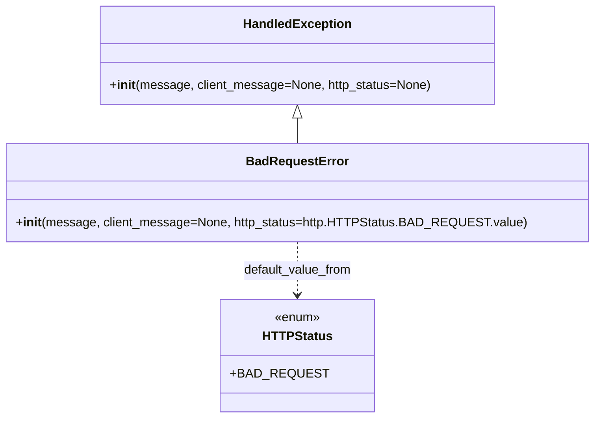

# Diagram: fv_core/fv_framework/python/fv_framework/exception/BadRequestError.py

> Auto-generated by Obscura crawlers

## Mermaid

```mermaid
classDiagram
    class HandledException {
        +__init__(message, client_message=None, http_status=None)
    }
    class BadRequestError {
        +__init__(message, client_message=None, http_status=http.HTTPStatus.BAD_REQUEST.value)
    }
    class HTTPStatus {
        <<enum>>
        +BAD_REQUEST
    }
    HandledException <|-- BadRequestError
    BadRequestError ..> HTTPStatus : default_value_from
```

> SVG rendering failed for this diagram.
