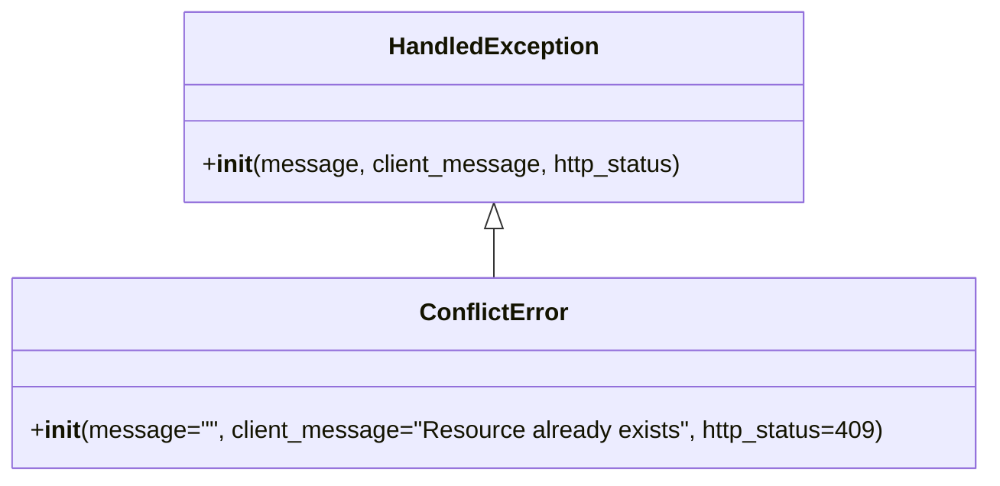

# Diagram: fv_core/fv_framework/python/fv_framework/exception/ConflictError.py

> Auto-generated by Obscura crawlers

## Mermaid

### SVG

<svg id="container" width="643.234375" xmlns="http://www.w3.org/2000/svg" class="classDiagram" height="318" viewBox="0 0 643.234375 318" role="graphics-document document" aria-roledescription="class"><g><defs><marker id="container_class-aggregationStart" class="marker aggregation class" refX="18" refY="7" markerWidth="190" markerHeight="240" orient="auto"><path d="M 18,7 L9,13 L1,7 L9,1 Z"></path></marker></defs><defs><marker id="container_class-aggregationEnd" class="marker aggregation class" refX="1" refY="7" markerWidth="20" markerHeight="28" orient="auto"><path d="M 18,7 L9,13 L1,7 L9,1 Z"></path></marker></defs><defs><marker id="container_class-extensionStart" class="marker extension class" refX="18" refY="7" markerWidth="190" markerHeight="240" orient="auto"><path d="M 1,7 L18,13 V 1 Z"></path></marker></defs><defs><marker id="container_class-extensionEnd" class="marker extension class" refX="1" refY="7" markerWidth="20" markerHeight="28" orient="auto"><path d="M 1,1 V 13 L18,7 Z"></path></marker></defs><defs><marker id="container_class-compositionStart" class="marker composition class" refX="18" refY="7" markerWidth="190" markerHeight="240" orient="auto"><path d="M 18,7 L9,13 L1,7 L9,1 Z"></path></marker></defs><defs><marker id="container_class-compositionEnd" class="marker composition class" refX="1" refY="7" markerWidth="20" markerHeight="28" orient="auto"><path d="M 18,7 L9,13 L1,7 L9,1 Z"></path></marker></defs><defs><marker id="container_class-dependencyStart" class="marker dependency class" refX="6" refY="7" markerWidth="190" markerHeight="240" orient="auto"><path d="M 5,7 L9,13 L1,7 L9,1 Z"></path></marker></defs><defs><marker id="container_class-dependencyEnd" class="marker dependency class" refX="13" refY="7" markerWidth="20" markerHeight="28" orient="auto"><path d="M 18,7 L9,13 L14,7 L9,1 Z"></path></marker></defs><defs><marker id="container_class-lollipopStart" class="marker lollipop class" refX="13" refY="7" markerWidth="190" markerHeight="240" orient="auto"><circle stroke="black" fill="transparent" cx="7" cy="7" r="6"></circle></marker></defs><defs><marker id="container_class-lollipopEnd" class="marker lollipop class" refX="1" refY="7" markerWidth="190" markerHeight="240" orient="auto"><circle stroke="black" fill="transparent" cx="7" cy="7" r="6"></circle></marker></defs><g class="root"><g class="clusters"></g><g class="edgePaths"><path d="M321.617,151.25L321.617,152.542C321.617,153.833,321.617,156.417,321.617,161.875C321.617,167.333,321.617,175.667,321.617,179.833L321.617,184" id="id_HandledException_ConflictError_1" class="edge-thickness-normal edge-pattern-solid relation" style=";;;" data-edge="true" data-et="edge" data-id="id_HandledException_ConflictError_1" data-points="W3sieCI6MzIxLjYxNzE4NzUsInkiOjEzNH0seyJ4IjozMjEuNjE3MTg3NSwieSI6MTU5fSx7IngiOjMyMS42MTcxODc1LCJ5IjoxODR9XQ==" marker-start="url(#container_class-extensionStart)"></path></g><g class="edgeLabels"><g class="edgeLabel"><g class="label" data-id="id_HandledException_ConflictError_1" transform="translate(0, 0)"><foreignObject width="0" height="0">

</foreignObject></g></g></g><g class="nodes"><g class="node default" id="classId-HandledException-0" transform="translate(321.6171875, 71)"><g class="basic label-container"><path d="M-202.83203125 -63 L202.83203125 -63 L202.83203125 63 L-202.83203125 63" stroke="none" stroke-width="0" fill="#ECECFF" style=""></path><path d="M-202.83203125 -63 C-68.31792076054043 -63, 66.19618972891914 -63, 202.83203125 -63 M-202.83203125 -63 C-51.31228195272564 -63, 100.20746734454872 -63, 202.83203125 -63 M202.83203125 -63 C202.83203125 -20.54815374939978, 202.83203125 21.90369250120044, 202.83203125 63 M202.83203125 -63 C202.83203125 -18.26096425075349, 202.83203125 26.478071498493023, 202.83203125 63 M202.83203125 63 C63.73983450076895 63, -75.3523622484621 63, -202.83203125 63 M202.83203125 63 C43.51891287068108 63, -115.79420550863784 63, -202.83203125 63 M-202.83203125 63 C-202.83203125 15.588799108049187, -202.83203125 -31.822401783901626, -202.83203125 -63 M-202.83203125 63 C-202.83203125 18.111630185421944, -202.83203125 -26.77673962915611, -202.83203125 -63" stroke="#9370DB" stroke-width="1.3" fill="none" stroke-dasharray="0 0" style=""></path></g><g class="annotation-group text" transform="translate(0, -39)"></g><g class="label-group text" transform="translate(-66.3828125, -39)"><g class="label" style="font-weight: bolder" transform="translate(0,-12)"><foreignObject width="132.765625" height="24">

HandledException

</foreignObject></g></g><g class="members-group text" transform="translate(-190.83203125, 9)"></g><g class="methods-group text" transform="translate(-190.83203125, 39)"><g class="label" style="" transform="translate(0,-12)"><foreignObject width="315.28125" height="24">

+<strong>init</strong>(message, client_message, http_status)

</foreignObject></g></g><g class="divider" style=""><path d="M-202.83203125 -15 C-104.30009525743999 -15, -5.7681592648799835 -15, 202.83203125 -15 M-202.83203125 -15 C-110.2414767321513 -15, -17.650922214302597 -15, 202.83203125 -15" stroke="#9370DB" stroke-width="1.3" fill="none" stroke-dasharray="0 0" style=""></path></g><g class="divider" style=""><path d="M-202.83203125 9 C-52.693756543231615 9, 97.44451816353677 9, 202.83203125 9 M-202.83203125 9 C-111.52305885135151 9, -20.214086452703015 9, 202.83203125 9" stroke="#9370DB" stroke-width="1.3" fill="none" stroke-dasharray="0 0" style=""></path></g></g><g class="node default" id="classId-ConflictError-1" transform="translate(321.6171875, 247)"><g class="basic label-container"><path d="M-313.6171875 -63 L313.6171875 -63 L313.6171875 63 L-313.6171875 63" stroke="none" stroke-width="0" fill="#ECECFF" style=""></path><path d="M-313.6171875 -63 C-186.23973727860238 -63, -58.862287057204725 -63, 313.6171875 -63 M-313.6171875 -63 C-179.87400499095247 -63, -46.13082248190494 -63, 313.6171875 -63 M313.6171875 -63 C313.6171875 -16.91327375721744, 313.6171875 29.17345248556512, 313.6171875 63 M313.6171875 -63 C313.6171875 -36.08066288587807, 313.6171875 -9.16132577175614, 313.6171875 63 M313.6171875 63 C124.60697812101216 63, -64.40323125797568 63, -313.6171875 63 M313.6171875 63 C170.1494253060911 63, 26.681663112182207 63, -313.6171875 63 M-313.6171875 63 C-313.6171875 18.496409405833333, -313.6171875 -26.007181188333334, -313.6171875 -63 M-313.6171875 63 C-313.6171875 30.198291363970405, -313.6171875 -2.6034172720591897, -313.6171875 -63" stroke="#9370DB" stroke-width="1.3" fill="none" stroke-dasharray="0 0" style=""></path></g><g class="annotation-group text" transform="translate(0, -39)"></g><g class="label-group text" transform="translate(-46.140625, -39)"><g class="label" style="font-weight: bolder" transform="translate(0,-12)"><foreignObject width="92.28125" height="24">

ConflictError

</foreignObject></g></g><g class="members-group text" transform="translate(-301.6171875, 9)"></g><g class="methods-group text" transform="translate(-301.6171875, 39)"><g class="label" style="" transform="translate(0,-12)"><foreignObject width="557.09375" height="24">

+<strong>init</strong>(message="", client_message="Resource already exists", http_status=409)

</foreignObject></g></g><g class="divider" style=""><path d="M-313.6171875 -15 C-179.9511370017796 -15, -46.28508650355923 -15, 313.6171875 -15 M-313.6171875 -15 C-185.9218757525475 -15, -58.226564005094986 -15, 313.6171875 -15" stroke="#9370DB" stroke-width="1.3" fill="none" stroke-dasharray="0 0" style=""></path></g><g class="divider" style=""><path d="M-313.6171875 9 C-78.00696058720504 9, 157.6032663255899 9, 313.6171875 9 M-313.6171875 9 C-112.77446532814321 9, 88.06825684371358 9, 313.6171875 9" stroke="#9370DB" stroke-width="1.3" fill="none" stroke-dasharray="0 0" style=""></path></g></g></g></g></g></svg>
