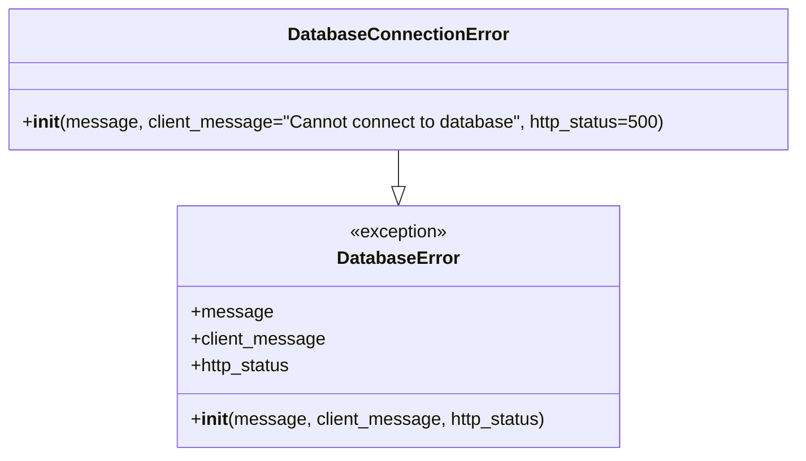

# Diagram: fv_core/fv_framework/python/fv_framework/exception/DatabaseConnectionError.py

> Auto-generated by Obscura crawlers

## Mermaid

### SVG

<svg id="container" width="705.15625" xmlns="http://www.w3.org/2000/svg" class="classDiagram" height="408" viewBox="0 0 705.15625 408" role="graphics-document document" aria-roledescription="class"><g><defs><marker id="container_class-aggregationStart" class="marker aggregation class" refX="18" refY="7" markerWidth="190" markerHeight="240" orient="auto"><path d="M 18,7 L9,13 L1,7 L9,1 Z"></path></marker></defs><defs><marker id="container_class-aggregationEnd" class="marker aggregation class" refX="1" refY="7" markerWidth="20" markerHeight="28" orient="auto"><path d="M 18,7 L9,13 L1,7 L9,1 Z"></path></marker></defs><defs><marker id="container_class-extensionStart" class="marker extension class" refX="18" refY="7" markerWidth="190" markerHeight="240" orient="auto"><path d="M 1,7 L18,13 V 1 Z"></path></marker></defs><defs><marker id="container_class-extensionEnd" class="marker extension class" refX="1" refY="7" markerWidth="20" markerHeight="28" orient="auto"><path d="M 1,1 V 13 L18,7 Z"></path></marker></defs><defs><marker id="container_class-compositionStart" class="marker composition class" refX="18" refY="7" markerWidth="190" markerHeight="240" orient="auto"><path d="M 18,7 L9,13 L1,7 L9,1 Z"></path></marker></defs><defs><marker id="container_class-compositionEnd" class="marker composition class" refX="1" refY="7" markerWidth="20" markerHeight="28" orient="auto"><path d="M 18,7 L9,13 L1,7 L9,1 Z"></path></marker></defs><defs><marker id="container_class-dependencyStart" class="marker dependency class" refX="6" refY="7" markerWidth="190" markerHeight="240" orient="auto"><path d="M 5,7 L9,13 L1,7 L9,1 Z"></path></marker></defs><defs><marker id="container_class-dependencyEnd" class="marker dependency class" refX="13" refY="7" markerWidth="20" markerHeight="28" orient="auto"><path d="M 18,7 L9,13 L14,7 L9,1 Z"></path></marker></defs><defs><marker id="container_class-lollipopStart" class="marker lollipop class" refX="13" refY="7" markerWidth="190" markerHeight="240" orient="auto"><circle stroke="black" fill="transparent" cx="7" cy="7" r="6"></circle></marker></defs><defs><marker id="container_class-lollipopEnd" class="marker lollipop class" refX="1" refY="7" markerWidth="190" markerHeight="240" orient="auto"><circle stroke="black" fill="transparent" cx="7" cy="7" r="6"></circle></marker></defs><g class="root"><g class="clusters"></g><g class="edgePaths"><path d="M352.578,134L352.578,138.167C352.578,142.333,352.578,150.667,352.578,156.125C352.578,161.583,352.578,164.167,352.578,165.458L352.578,166.75" id="id_DatabaseConnectionError_DatabaseError_1" class="edge-thickness-normal edge-pattern-solid relation" style=";;;" data-edge="true" data-et="edge" data-id="id_DatabaseConnectionError_DatabaseError_1" data-points="W3sieCI6MzUyLjU3ODEyNSwieSI6MTM0fSx7IngiOjM1Mi41NzgxMjUsInkiOjE1OX0seyJ4IjozNTIuNTc4MTI1LCJ5IjoxODR9XQ==" marker-end="url(#container_class-extensionEnd)"></path></g><g class="edgeLabels"><g class="edgeLabel"><g class="label" data-id="id_DatabaseConnectionError_DatabaseError_1" transform="translate(0, 0)"><foreignObject width="0" height="0">

</foreignObject></g></g></g><g class="nodes"><g class="node default" id="classId-DatabaseError-0" transform="translate(352.578125, 292)"><g class="basic label-container"><path d="M-195.8203125 -108 L195.8203125 -108 L195.8203125 108 L-195.8203125 108" stroke="none" stroke-width="0" fill="#ECECFF" style=""></path><path d="M-195.8203125 -108 C-103.96513139293859 -108, -12.109950285877176 -108, 195.8203125 -108 M-195.8203125 -108 C-90.47745548380651 -108, 14.865401532386983 -108, 195.8203125 -108 M195.8203125 -108 C195.8203125 -35.92488121492711, 195.8203125 36.15023757014578, 195.8203125 108 M195.8203125 -108 C195.8203125 -62.561065417168116, 195.8203125 -17.122130834336232, 195.8203125 108 M195.8203125 108 C63.58973562479659 108, -68.64084125040682 108, -195.8203125 108 M195.8203125 108 C67.1578719918731 108, -61.50456851625381 108, -195.8203125 108 M-195.8203125 108 C-195.8203125 48.17678220068742, -195.8203125 -11.64643559862516, -195.8203125 -108 M-195.8203125 108 C-195.8203125 53.802591777320224, -195.8203125 -0.3948164453595524, -195.8203125 -108" stroke="#9370DB" stroke-width="1.3" fill="none" stroke-dasharray="0 0" style=""></path></g><g class="annotation-group text" transform="translate(-44.3515625, -84)"><g class="label" style="" transform="translate(0,-12)"><foreignObject width="88.703125" height="24">

«exception»

</foreignObject></g></g><g class="label-group text" transform="translate(-52.359375, -60)"><g class="label" style="font-weight: bolder" transform="translate(0,-12)"><foreignObject width="104.71875" height="24">

DatabaseError

</foreignObject></g></g><g class="members-group text" transform="translate(-183.8203125, -12)"><g class="label" style="" transform="translate(0,-12)"><foreignObject width="70.375" height="24">

+message

</foreignObject></g><g class="label" style="" transform="translate(0,12)"><foreignObject width="119.421875" height="24">

+client_message

</foreignObject></g><g class="label" style="" transform="translate(0,36)"><foreignObject width="90.828125" height="24">

+http_status

</foreignObject></g></g><g class="methods-group text" transform="translate(-183.8203125, 84)"><g class="label" style="" transform="translate(0,-12)"><foreignObject width="315.28125" height="24">

+<strong>init</strong>(message, client_message, http_status)

</foreignObject></g></g><g class="divider" style=""><path d="M-195.8203125 -36 C-75.03837010109078 -36, 45.743572297818446 -36, 195.8203125 -36 M-195.8203125 -36 C-46.63389649156497 -36, 102.55251951687006 -36, 195.8203125 -36" stroke="#9370DB" stroke-width="1.3" fill="none" stroke-dasharray="0 0" style=""></path></g><g class="divider" style=""><path d="M-195.8203125 60 C-90.87422785267327 60, 14.071856794653456 60, 195.8203125 60 M-195.8203125 60 C-53.09001529062192 60, 89.64028191875616 60, 195.8203125 60" stroke="#9370DB" stroke-width="1.3" fill="none" stroke-dasharray="0 0" style=""></path></g></g><g class="node default" id="classId-DatabaseConnectionError-1" transform="translate(352.578125, 71)"><g class="basic label-container"><path d="M-344.578125 -63 L344.578125 -63 L344.578125 63 L-344.578125 63" stroke="none" stroke-width="0" fill="#ECECFF" style=""></path><path d="M-344.578125 -63 C-136.19250327339233 -63, 72.19311845321533 -63, 344.578125 -63 M-344.578125 -63 C-155.82553847378432 -63, 32.92704805243136 -63, 344.578125 -63 M344.578125 -63 C344.578125 -16.34777276570464, 344.578125 30.30445446859072, 344.578125 63 M344.578125 -63 C344.578125 -20.67981112143226, 344.578125 21.640377757135482, 344.578125 63 M344.578125 63 C109.56522254320436 63, -125.44767991359129 63, -344.578125 63 M344.578125 63 C127.63038577626952 63, -89.31735344746096 63, -344.578125 63 M-344.578125 63 C-344.578125 30.374499523661832, -344.578125 -2.2510009526763355, -344.578125 -63 M-344.578125 63 C-344.578125 34.29868114761378, -344.578125 5.597362295227548, -344.578125 -63" stroke="#9370DB" stroke-width="1.3" fill="none" stroke-dasharray="0 0" style=""></path></g><g class="annotation-group text" transform="translate(0, -39)"></g><g class="label-group text" transform="translate(-93.578125, -39)"><g class="label" style="font-weight: bolder" transform="translate(0,-12)"><foreignObject width="187.15625" height="24">

DatabaseConnectionError

</foreignObject></g></g><g class="members-group text" transform="translate(-332.578125, 9)"></g><g class="methods-group text" transform="translate(-332.578125, 39)"><g class="label" style="" transform="translate(0,-12)"><foreignObject width="571.578125" height="24">

+<strong>init</strong>(message, client_message="Cannot connect to database", http_status=500)

</foreignObject></g></g><g class="divider" style=""><path d="M-344.578125 -15 C-185.03482435598886 -15, -25.49152371197772 -15, 344.578125 -15 M-344.578125 -15 C-76.00069953646573 -15, 192.57672592706854 -15, 344.578125 -15" stroke="#9370DB" stroke-width="1.3" fill="none" stroke-dasharray="0 0" style=""></path></g><g class="divider" style=""><path d="M-344.578125 9 C-153.0843397464693 9, 38.40944550706138 9, 344.578125 9 M-344.578125 9 C-110.01782986827277 9, 124.54246526345446 9, 344.578125 9" stroke="#9370DB" stroke-width="1.3" fill="none" stroke-dasharray="0 0" style=""></path></g></g></g></g></g></svg>
