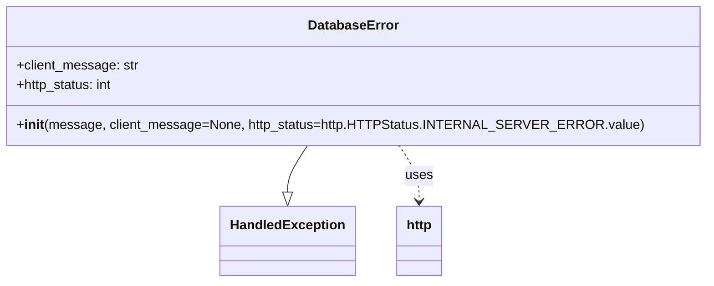

# Diagram: fv_core/fv_framework/python/fv_framework/exception/DatabaseError.py

> Auto-generated by Obscura crawlers

## Mermaid

### SVG

<svg id="container" width="813.140625" xmlns="http://www.w3.org/2000/svg" class="classDiagram" height="342" viewBox="0 0 813.140625 342" role="graphics-document document" aria-roledescription="class"><g><defs><marker id="container_class-aggregationStart" class="marker aggregation class" refX="18" refY="7" markerWidth="190" markerHeight="240" orient="auto"><path d="M 18,7 L9,13 L1,7 L9,1 Z"></path></marker></defs><defs><marker id="container_class-aggregationEnd" class="marker aggregation class" refX="1" refY="7" markerWidth="20" markerHeight="28" orient="auto"><path d="M 18,7 L9,13 L1,7 L9,1 Z"></path></marker></defs><defs><marker id="container_class-extensionStart" class="marker extension class" refX="18" refY="7" markerWidth="190" markerHeight="240" orient="auto"><path d="M 1,7 L18,13 V 1 Z"></path></marker></defs><defs><marker id="container_class-extensionEnd" class="marker extension class" refX="1" refY="7" markerWidth="20" markerHeight="28" orient="auto"><path d="M 1,1 V 13 L18,7 Z"></path></marker></defs><defs><marker id="container_class-compositionStart" class="marker composition class" refX="18" refY="7" markerWidth="190" markerHeight="240" orient="auto"><path d="M 18,7 L9,13 L1,7 L9,1 Z"></path></marker></defs><defs><marker id="container_class-compositionEnd" class="marker composition class" refX="1" refY="7" markerWidth="20" markerHeight="28" orient="auto"><path d="M 18,7 L9,13 L1,7 L9,1 Z"></path></marker></defs><defs><marker id="container_class-dependencyStart" class="marker dependency class" refX="6" refY="7" markerWidth="190" markerHeight="240" orient="auto"><path d="M 5,7 L9,13 L1,7 L9,1 Z"></path></marker></defs><defs><marker id="container_class-dependencyEnd" class="marker dependency class" refX="13" refY="7" markerWidth="20" markerHeight="28" orient="auto"><path d="M 18,7 L9,13 L14,7 L9,1 Z"></path></marker></defs><defs><marker id="container_class-lollipopStart" class="marker lollipop class" refX="13" refY="7" markerWidth="190" markerHeight="240" orient="auto"><circle stroke="black" fill="transparent" cx="7" cy="7" r="6"></circle></marker></defs><defs><marker id="container_class-lollipopEnd" class="marker lollipop class" refX="1" refY="7" markerWidth="190" markerHeight="240" orient="auto"><circle stroke="black" fill="transparent" cx="7" cy="7" r="6"></circle></marker></defs><g class="root"><g class="clusters"></g><g class="edgePaths"><path d="M352.438,176L348.464,182.167C344.49,188.333,336.542,200.667,332.568,210.125C328.594,219.583,328.594,226.167,328.594,229.458L328.594,232.75" id="id_DatabaseError_HandledException_1" class="edge-thickness-normal edge-pattern-solid relation" style=";;;" data-edge="true" data-et="edge" data-id="id_DatabaseError_HandledException_1" data-points="W3sieCI6MzUyLjQzNzgyMjgzMDU3ODUsInkiOjE3Nn0seyJ4IjozMjguNTkzNzUsInkiOjIxM30seyJ4IjozMjguNTkzNzUsInkiOjI1MH1d" marker-end="url(#container_class-extensionEnd)"></path><path d="M460.703,176L464.677,182.167C468.651,188.333,476.599,200.667,480.573,212C484.547,223.333,484.547,233.667,484.547,238.833L484.547,244" id="id_DatabaseError_http_2" class="edge-thickness-normal edge-pattern-dashed relation" style=";;;" data-edge="true" data-et="edge" data-id="id_DatabaseError_http_2" data-points="W3sieCI6NDYwLjcwMjgwMjE2OTQyMTUsInkiOjE3Nn0seyJ4Ijo0ODQuNTQ2ODc1LCJ5IjoyMTN9LHsieCI6NDg0LjU0Njg3NSwieSI6MjUwfV0=" marker-end="url(#container_class-dependencyEnd)"></path></g><g class="edgeLabels"><g class="edgeLabel"><g class="label" data-id="id_DatabaseError_HandledException_1" transform="translate(0, 0)"><foreignObject width="0" height="0">

</foreignObject></g></g><g class="edgeLabel" transform="translate(484.546875, 213)"><g class="label" data-id="id_DatabaseError_http_2" transform="translate(-16.4921875, -12)"><foreignObject width="32.984375" height="24">

uses

</foreignObject></g></g></g><g class="nodes"><g class="node default" id="classId-HandledException-0" transform="translate(328.59375, 292)"><g class="basic label-container"><path d="M-78.3828125 -42 L78.3828125 -42 L78.3828125 42 L-78.3828125 42" stroke="none" stroke-width="0" fill="#ECECFF" style=""></path><path d="M-78.3828125 -42 C-31.09135352935025 -42, 16.2001054412995 -42, 78.3828125 -42 M-78.3828125 -42 C-33.18823929169599 -42, 12.006333916608014 -42, 78.3828125 -42 M78.3828125 -42 C78.3828125 -20.807271255410246, 78.3828125 0.3854574891795082, 78.3828125 42 M78.3828125 -42 C78.3828125 -11.335843689129664, 78.3828125 19.32831262174067, 78.3828125 42 M78.3828125 42 C28.968393153734013 42, -20.446026192531974 42, -78.3828125 42 M78.3828125 42 C26.7520143184974 42, -24.878783863005197 42, -78.3828125 42 M-78.3828125 42 C-78.3828125 9.492987913500905, -78.3828125 -23.01402417299819, -78.3828125 -42 M-78.3828125 42 C-78.3828125 23.380828220001916, -78.3828125 4.761656440003833, -78.3828125 -42" stroke="#9370DB" stroke-width="1.3" fill="none" stroke-dasharray="0 0" style=""></path></g><g class="annotation-group text" transform="translate(0, -18)"></g><g class="label-group text" transform="translate(-66.3828125, -18)"><g class="label" style="font-weight: bolder" transform="translate(0,-12)"><foreignObject width="132.765625" height="24">

HandledException

</foreignObject></g></g><g class="members-group text" transform="translate(-66.3828125, 30)"></g><g class="methods-group text" transform="translate(-66.3828125, 60)"></g><g class="divider" style=""><path d="M-78.3828125 6 C-27.382261185237354 6, 23.618290129525292 6, 78.3828125 6 M-78.3828125 6 C-17.728906281991613 6, 42.924999936016775 6, 78.3828125 6" stroke="#9370DB" stroke-width="1.3" fill="none" stroke-dasharray="0 0" style=""></path></g><g class="divider" style=""><path d="M-78.3828125 24 C-26.73058802215801 24, 24.92163645568398 24, 78.3828125 24 M-78.3828125 24 C-23.653615309461102 24, 31.075581881077795 24, 78.3828125 24" stroke="#9370DB" stroke-width="1.3" fill="none" stroke-dasharray="0 0" style=""></path></g></g><g class="node default" id="classId-DatabaseError-1" transform="translate(406.5703125, 92)"><g class="basic label-container"><path d="M-398.5703125 -84 L398.5703125 -84 L398.5703125 84 L-398.5703125 84" stroke="none" stroke-width="0" fill="#ECECFF" style=""></path><path d="M-398.5703125 -84 C-91.68264972020472 -84, 215.20501305959056 -84, 398.5703125 -84 M-398.5703125 -84 C-157.52685230769112 -84, 83.51660788461777 -84, 398.5703125 -84 M398.5703125 -84 C398.5703125 -24.366347263857868, 398.5703125 35.267305472284264, 398.5703125 84 M398.5703125 -84 C398.5703125 -31.752363017075545, 398.5703125 20.49527396584891, 398.5703125 84 M398.5703125 84 C236.20746943345776 84, 73.84462636691552 84, -398.5703125 84 M398.5703125 84 C211.44387801093828 84, 24.317443521876555 84, -398.5703125 84 M-398.5703125 84 C-398.5703125 49.91284522185802, -398.5703125 15.825690443716042, -398.5703125 -84 M-398.5703125 84 C-398.5703125 25.960300492423897, -398.5703125 -32.079399015152205, -398.5703125 -84" stroke="#9370DB" stroke-width="1.3" fill="none" stroke-dasharray="0 0" style=""></path></g><g class="annotation-group text" transform="translate(0, -60)"></g><g class="label-group text" transform="translate(-52.359375, -60)"><g class="label" style="font-weight: bolder" transform="translate(0,-12)"><foreignObject width="104.71875" height="24">

DatabaseError

</foreignObject></g></g><g class="members-group text" transform="translate(-386.5703125, -12)"><g class="label" style="" transform="translate(0,-12)"><foreignObject width="146.921875" height="24">

+client_message: str

</foreignObject></g><g class="label" style="" transform="translate(0,12)"><foreignObject width="118.5625" height="24">

+http_status: int

</foreignObject></g></g><g class="methods-group text" transform="translate(-386.5703125, 60)"><g class="label" style="" transform="translate(0,-12)"><foreignObject width="720.78125" height="24">

+<strong>init</strong>(message, client_message=None, http_status=http.HTTPStatus.INTERNAL_SERVER_ERROR.value)

</foreignObject></g></g><g class="divider" style=""><path d="M-398.5703125 -36 C-139.52295025042469 -36, 119.52441199915063 -36, 398.5703125 -36 M-398.5703125 -36 C-96.51705998049044 -36, 205.5361925390191 -36, 398.5703125 -36" stroke="#9370DB" stroke-width="1.3" fill="none" stroke-dasharray="0 0" style=""></path></g><g class="divider" style=""><path d="M-398.5703125 36 C-180.85732375061406 36, 36.855664998771886 36, 398.5703125 36 M-398.5703125 36 C-204.08797626098257 36, -9.605640021965144 36, 398.5703125 36" stroke="#9370DB" stroke-width="1.3" fill="none" stroke-dasharray="0 0" style=""></path></g></g><g class="node default" id="classId-http-2" transform="translate(484.546875, 292)"><g class="basic label-container"><path d="M-27.5703125 -42 L27.5703125 -42 L27.5703125 42 L-27.5703125 42" stroke="none" stroke-width="0" fill="#ECECFF" style=""></path><path d="M-27.5703125 -42 C-12.217022048134682 -42, 3.136268403730636 -42, 27.5703125 -42 M-27.5703125 -42 C-11.68436316208157 -42, 4.201586175836859 -42, 27.5703125 -42 M27.5703125 -42 C27.5703125 -18.164228054992424, 27.5703125 5.671543890015151, 27.5703125 42 M27.5703125 -42 C27.5703125 -17.605360942184422, 27.5703125 6.789278115631156, 27.5703125 42 M27.5703125 42 C8.562594481285544 42, -10.445123537428913 42, -27.5703125 42 M27.5703125 42 C13.139813521398292 42, -1.2906854572034163 42, -27.5703125 42 M-27.5703125 42 C-27.5703125 8.491547991189698, -27.5703125 -25.016904017620604, -27.5703125 -42 M-27.5703125 42 C-27.5703125 12.083729703602323, -27.5703125 -17.832540592795354, -27.5703125 -42" stroke="#9370DB" stroke-width="1.3" fill="none" stroke-dasharray="0 0" style=""></path></g><g class="annotation-group text" transform="translate(0, -18)"></g><g class="label-group text" transform="translate(-15.5703125, -18)"><g class="label" style="font-weight: bolder" transform="translate(0,-12)"><foreignObject width="31.140625" height="24">

http

</foreignObject></g></g><g class="members-group text" transform="translate(-15.5703125, 30)"></g><g class="methods-group text" transform="translate(-15.5703125, 60)"></g><g class="divider" style=""><path d="M-27.5703125 6 C-9.329250484743554 6, 8.911811530512892 6, 27.5703125 6 M-27.5703125 6 C-6.111010468283432 6, 15.348291563433136 6, 27.5703125 6" stroke="#9370DB" stroke-width="1.3" fill="none" stroke-dasharray="0 0" style=""></path></g><g class="divider" style=""><path d="M-27.5703125 24 C-8.121207939253189 24, 11.327896621493622 24, 27.5703125 24 M-27.5703125 24 C-13.893295527156504 24, -0.21627855431300702 24, 27.5703125 24" stroke="#9370DB" stroke-width="1.3" fill="none" stroke-dasharray="0 0" style=""></path></g></g></g></g></g></svg>
