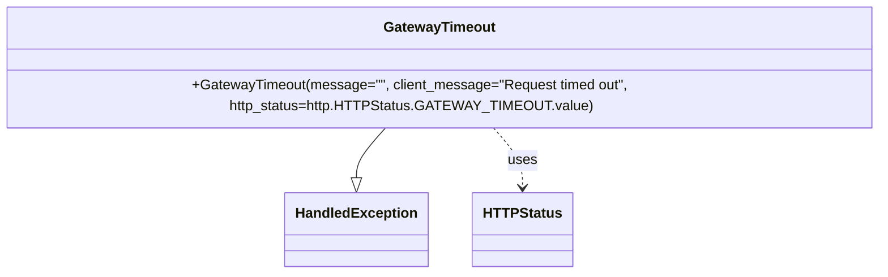

# Diagram: fv_core/fv_framework/python/fv_framework/exception/GatewayTimeout.py

> Auto-generated by Obscura crawlers

## Mermaid

```mermaid
classDiagram
    class GatewayTimeout {
        +GatewayTimeout(message="", client_message="Request timed out", http_status=http.HTTPStatus.GATEWAY_TIMEOUT.value)
    }
    class HandledException
    class HTTPStatus
    GatewayTimeout --|> HandledException
    GatewayTimeout ..> HTTPStatus : uses
```

> SVG rendering failed for this diagram.
