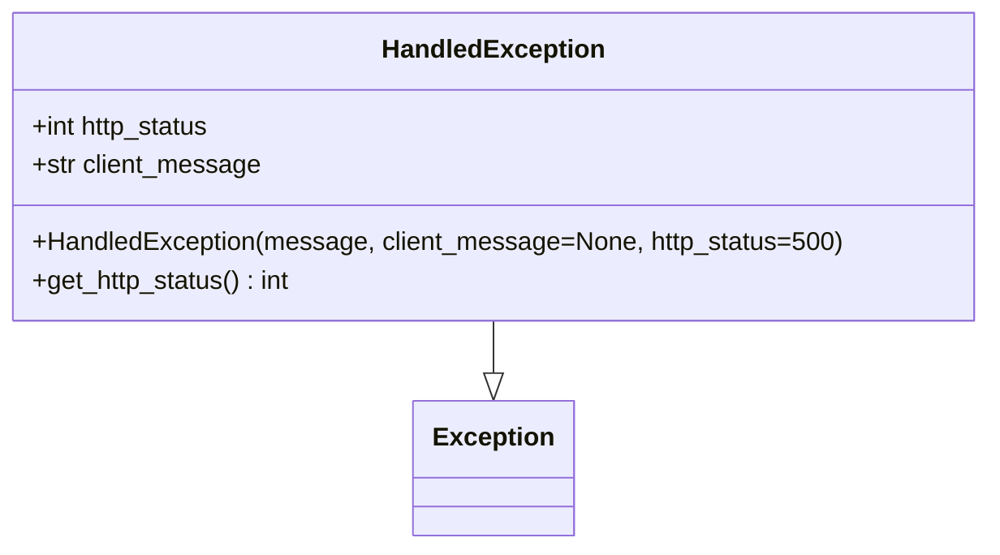

# Diagram: fv_core/fv_framework/python/fv_framework/exception/HandledException.py

> Auto-generated by Obscura crawlers

## Mermaid

### SVG

<svg id="container" width="609.6171875" xmlns="http://www.w3.org/2000/svg" class="classDiagram" height="342" viewBox="0 0 609.6171875 342" role="graphics-document document" aria-roledescription="class"><g><defs><marker id="container_class-aggregationStart" class="marker aggregation class" refX="18" refY="7" markerWidth="190" markerHeight="240" orient="auto"><path d="M 18,7 L9,13 L1,7 L9,1 Z"></path></marker></defs><defs><marker id="container_class-aggregationEnd" class="marker aggregation class" refX="1" refY="7" markerWidth="20" markerHeight="28" orient="auto"><path d="M 18,7 L9,13 L1,7 L9,1 Z"></path></marker></defs><defs><marker id="container_class-extensionStart" class="marker extension class" refX="18" refY="7" markerWidth="190" markerHeight="240" orient="auto"><path d="M 1,7 L18,13 V 1 Z"></path></marker></defs><defs><marker id="container_class-extensionEnd" class="marker extension class" refX="1" refY="7" markerWidth="20" markerHeight="28" orient="auto"><path d="M 1,1 V 13 L18,7 Z"></path></marker></defs><defs><marker id="container_class-compositionStart" class="marker composition class" refX="18" refY="7" markerWidth="190" markerHeight="240" orient="auto"><path d="M 18,7 L9,13 L1,7 L9,1 Z"></path></marker></defs><defs><marker id="container_class-compositionEnd" class="marker composition class" refX="1" refY="7" markerWidth="20" markerHeight="28" orient="auto"><path d="M 18,7 L9,13 L1,7 L9,1 Z"></path></marker></defs><defs><marker id="container_class-dependencyStart" class="marker dependency class" refX="6" refY="7" markerWidth="190" markerHeight="240" orient="auto"><path d="M 5,7 L9,13 L1,7 L9,1 Z"></path></marker></defs><defs><marker id="container_class-dependencyEnd" class="marker dependency class" refX="13" refY="7" markerWidth="20" markerHeight="28" orient="auto"><path d="M 18,7 L9,13 L14,7 L9,1 Z"></path></marker></defs><defs><marker id="container_class-lollipopStart" class="marker lollipop class" refX="13" refY="7" markerWidth="190" markerHeight="240" orient="auto"><circle stroke="black" fill="transparent" cx="7" cy="7" r="6"></circle></marker></defs><defs><marker id="container_class-lollipopEnd" class="marker lollipop class" refX="1" refY="7" markerWidth="190" markerHeight="240" orient="auto"><circle stroke="black" fill="transparent" cx="7" cy="7" r="6"></circle></marker></defs><g class="root"><g class="clusters"></g><g class="edgePaths"><path d="M304.809,200L304.809,204.167C304.809,208.333,304.809,216.667,304.809,222.125C304.809,227.583,304.809,230.167,304.809,231.458L304.809,232.75" id="id_HandledException_Exception_1" class="edge-thickness-normal edge-pattern-solid relation" style=";;;" data-edge="true" data-et="edge" data-id="id_HandledException_Exception_1" data-points="W3sieCI6MzA0LjgwODU5Mzc1LCJ5IjoyMDB9LHsieCI6MzA0LjgwODU5Mzc1LCJ5IjoyMjV9LHsieCI6MzA0LjgwODU5Mzc1LCJ5IjoyNTB9XQ==" marker-end="url(#container_class-extensionEnd)"></path></g><g class="edgeLabels"><g class="edgeLabel"><g class="label" data-id="id_HandledException_Exception_1" transform="translate(0, 0)"><foreignObject width="0" height="0">

</foreignObject></g></g></g><g class="nodes"><g class="node default" id="classId-Exception-0" transform="translate(304.80859375, 292)"><g class="basic label-container"><path d="M-47.703125 -42 L47.703125 -42 L47.703125 42 L-47.703125 42" stroke="none" stroke-width="0" fill="#ECECFF" style=""></path><path d="M-47.703125 -42 C-25.828532756691896 -42, -3.9539405133837917 -42, 47.703125 -42 M-47.703125 -42 C-15.587081557727323 -42, 16.528961884545353 -42, 47.703125 -42 M47.703125 -42 C47.703125 -11.159306552076043, 47.703125 19.681386895847915, 47.703125 42 M47.703125 -42 C47.703125 -15.414139636327878, 47.703125 11.171720727344244, 47.703125 42 M47.703125 42 C20.148329485264693 42, -7.406466029470614 42, -47.703125 42 M47.703125 42 C14.471893528439303 42, -18.759337943121395 42, -47.703125 42 M-47.703125 42 C-47.703125 24.62827844393219, -47.703125 7.256556887864377, -47.703125 -42 M-47.703125 42 C-47.703125 17.732536474873836, -47.703125 -6.534927050252328, -47.703125 -42" stroke="#9370DB" stroke-width="1.3" fill="none" stroke-dasharray="0 0" style=""></path></g><g class="annotation-group text" transform="translate(0, -18)"></g><g class="label-group text" transform="translate(-35.703125, -18)"><g class="label" style="font-weight: bolder" transform="translate(0,-12)"><foreignObject width="71.40625" height="24">

Exception

</foreignObject></g></g><g class="members-group text" transform="translate(-35.703125, 30)"></g><g class="methods-group text" transform="translate(-35.703125, 60)"></g><g class="divider" style=""><path d="M-47.703125 6 C-14.779291067397601 6, 18.144542865204798 6, 47.703125 6 M-47.703125 6 C-21.231366718466834 6, 5.240391563066332 6, 47.703125 6" stroke="#9370DB" stroke-width="1.3" fill="none" stroke-dasharray="0 0" style=""></path></g><g class="divider" style=""><path d="M-47.703125 24 C-15.266761059947193 24, 17.169602880105614 24, 47.703125 24 M-47.703125 24 C-12.546772601408726 24, 22.609579797182548 24, 47.703125 24" stroke="#9370DB" stroke-width="1.3" fill="none" stroke-dasharray="0 0" style=""></path></g></g><g class="node default" id="classId-HandledException-1" transform="translate(304.80859375, 104)"><g class="basic label-container"><path d="M-296.80859375 -96 L296.80859375 -96 L296.80859375 96 L-296.80859375 96" stroke="none" stroke-width="0" fill="#ECECFF" style=""></path><path d="M-296.80859375 -96 C-156.36333876323377 -96, -15.91808377646754 -96, 296.80859375 -96 M-296.80859375 -96 C-99.46380728320864 -96, 97.88097918358272 -96, 296.80859375 -96 M296.80859375 -96 C296.80859375 -31.96559344573265, 296.80859375 32.0688131085347, 296.80859375 96 M296.80859375 -96 C296.80859375 -24.804843671149143, 296.80859375 46.39031265770171, 296.80859375 96 M296.80859375 96 C155.90277995680023 96, 14.996966163600462 96, -296.80859375 96 M296.80859375 96 C108.989114091376 96, -78.83036556724801 96, -296.80859375 96 M-296.80859375 96 C-296.80859375 53.36972187686189, -296.80859375 10.739443753723776, -296.80859375 -96 M-296.80859375 96 C-296.80859375 41.93224601715334, -296.80859375 -12.135507965693321, -296.80859375 -96" stroke="#9370DB" stroke-width="1.3" fill="none" stroke-dasharray="0 0" style=""></path></g><g class="annotation-group text" transform="translate(0, -72)"></g><g class="label-group text" transform="translate(-66.3828125, -72)"><g class="label" style="font-weight: bolder" transform="translate(0,-12)"><foreignObject width="132.765625" height="24">

HandledException

</foreignObject></g></g><g class="members-group text" transform="translate(-284.80859375, -24)"><g class="label" style="" transform="translate(0,-12)"><foreignObject width="114.734375" height="24">

+int http_status

</foreignObject></g><g class="label" style="" transform="translate(0,12)"><foreignObject width="143.078125" height="24">

+str client_message

</foreignObject></g></g><g class="methods-group text" transform="translate(-284.80859375, 48)"><g class="label" style="" transform="translate(0,-12)"><foreignObject width="503.234375" height="24">

+HandledException(message, client_message=None, http_status=500)

</foreignObject></g><g class="label" style="" transform="translate(0,12)"><foreignObject width="164.0625" height="24">

+get_http_status() : int

</foreignObject></g></g><g class="divider" style=""><path d="M-296.80859375 -48 C-127.78994599091169 -48, 41.22870176817662 -48, 296.80859375 -48 M-296.80859375 -48 C-82.88522034922423 -48, 131.03815305155155 -48, 296.80859375 -48" stroke="#9370DB" stroke-width="1.3" fill="none" stroke-dasharray="0 0" style=""></path></g><g class="divider" style=""><path d="M-296.80859375 24 C-83.89645907365846 24, 129.01567560268307 24, 296.80859375 24 M-296.80859375 24 C-82.78847446925607 24, 131.23164481148785 24, 296.80859375 24" stroke="#9370DB" stroke-width="1.3" fill="none" stroke-dasharray="0 0" style=""></path></g></g></g></g></g></svg>
