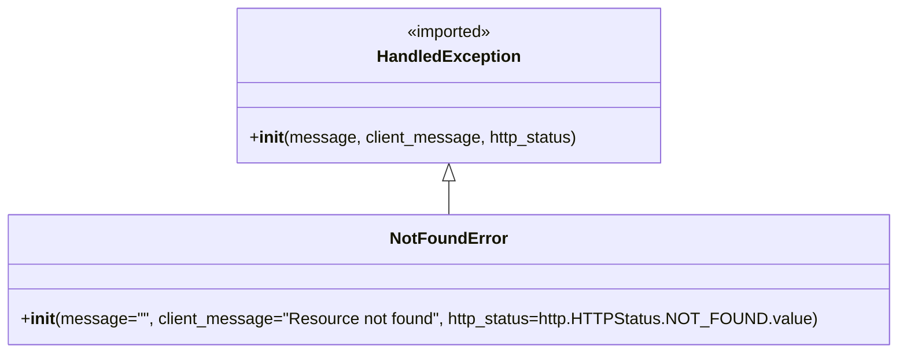

# Diagram: fv_core/fv_framework/python/fv_framework/exception/NotFoundError.py

> Auto-generated by Obscura crawlers

## Mermaid

```mermaid
classDiagram
    class HandledException {
        <<imported>>
        +__init__(message, client_message, http_status)
    }
    class NotFoundError {
        +__init__(message="", client_message="Resource not found", http_status=http.HTTPStatus.NOT_FOUND.value)
    }
    HandledException <|-- NotFoundError
```

> SVG rendering failed for this diagram.
